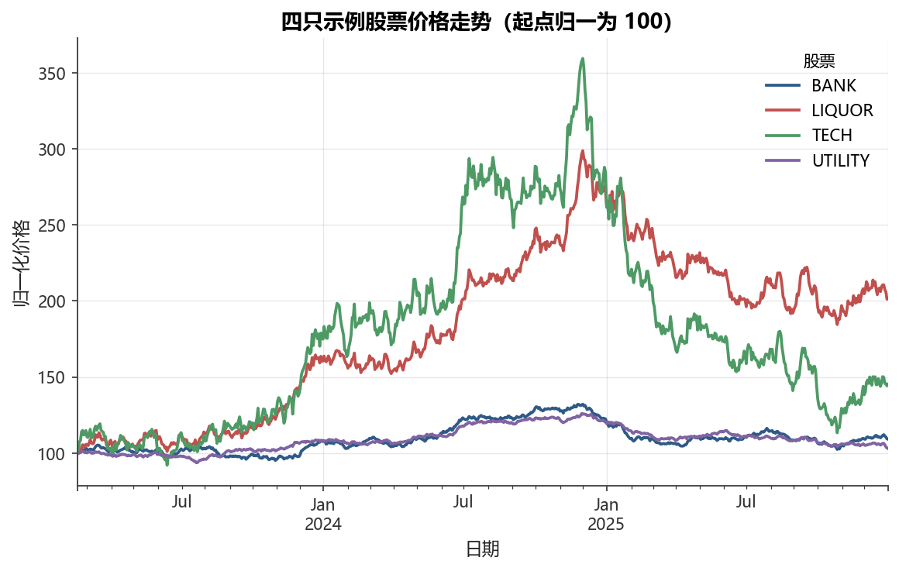

# 第1章 金融数据科学导论

[](https://colab.research.google.com/github/albertandking/financial-data-science/blob/main/notebooks/ch01_introduction.ipynb) [](https://mybinder.org/v2/gh/albertandking/financial-data-science/main?labpath=notebooks/ch01_introduction.ipynb)

!!! info "配套代码"
    本章示例可在配套示例 中逐格运行。如需运行，请先按环境说明准备内置样本数据。

---

## 1.1 本章导读：用数据预测明天涨跌，为什么这么难？

2015年6月，沪深两市合计超过5000只个股连续跌停，大量量化模型在极短时间内失效。2020年3月，新冠疫情引发全球股市熔断，历史上从未出现过的波动模式让几乎所有统计模型措手不及。2023年北交所放量暴涨，新兴板块的微盘股在散户情绪驱动下呈现出与传统定价理论完全相悖的走势。

这些现象背后，有一个让无数数据科学家感到沮丧的共同规律：**金融市场的噪声，远远大于信号**。相比图像识别（猫与狗的差异一眼就能辨别）或语音识别（人类语音含有大量可识别特征），股票明天究竟是涨还是跌，即便是最顶尖的机构，预测准确率也很难稳定超过55%。

然而，这并不意味着数据分析在金融领域毫无用武之地。恰恰相反——**数据科学在金融领域的价值，不在于「精准预测」，而在于系统性地发现和管理那些微小但稳定的规律**：控制回撤、识别风险因子、构建多空组合、检测异常交易。

本书就从这里出发：学会在噪声中找信号，在不确定性中做决策。

金融数据科学并不承诺能让你「战胜市场」——事实上，大量研究显示绝大多数主动管理策略在扣除费用后长期跑输指数。它承诺的是：**让你具备系统性、可量化、可复现地处理金融问题的能力**，无论是识别真实的统计规律、构建稳健的风险模型，还是避免那些数量惊人的方法论错误。

本章是全书的基础。在进入任何具体方法之前，我们需要先建立三个核心认知：第一，理解金融数据的独特性（噪声大、非平稳、厚尾），这决定了通用机器学习方法在金融场景下必须做出的改造；第二，认识 A 股市场的制度性特征（T+1、涨跌停、融券限制），这是在中国市场做数据分析的「必修课」；第三，牢记三大陷阱（前视偏差、幸存者偏差、数据窥探），这些错误在金融数据科学中出现的频率远高于其他领域，是导致策略「回测完美、实盘失效」的主要原因。

---

## 1.2 学习目标

学完本章，你应该能够：

- 用自己的语言定义「金融数据科学」，并说明它与金融工程、计量经济学的区别
- 列举金融数据的五种主要类型，并各举中国市场的实例
- 描述数据科学工作流的七个步骤，并指出金融场景下每步的特殊之处
- 解释金融数据五大风格化特征的直觉含义
- 说明有效市场假说三种形式，以及它为什么让预测变得困难
- 理解中国 A 股制度背景（T+1、涨跌停、停牌等）对数据分析的影响
- 识别三大经典陷阱：前视偏差、幸存者偏差、数据窥探
- 跑通本书的第一段代码：加载内置数据、计算收益率、绘图

---

## 1.3 什么是金融数据科学

### 1.3.1 定义

金融数据科学（Financial Data Science）是**以数据驱动的方法研究金融问题**的交叉学科，核心是将统计学、机器学习与计算机工程应用于金融资产定价、风险管理和投资决策。

它不是一个全新的领域，而是几个已有学科自然演化、相互渗透的结果：

| 学科 | 核心方法 | 与金融数据科学的关系 |
|------|---------|-------------------|
| **金融工程** | 随机过程、衍生品定价 | 提供资产定价理论框架 |
| **计量经济学** | 回归、因果推断、时间序列 | 提供统计推断规范 |
| **机器学习** | 监督/无监督/强化学习 | 提供预测与模式识别工具 |
| **计算机科学** | 数据工程、分布式计算 | 提供处理大规模数据的能力 |
| **金融数据科学** | 以上方法的综合运用 | 解决端到端金融问题 |

### 1.3.2 与相邻学科的区别

!!! note "三门学科的侧重点"
    - **计量经济学**：强调**因果推断**和统计显著性，假设线性关系，重视模型可解释性。典型问题：“货币政策调整是否因果性地影响了股票市场收益率？”
    - **金融工程**：强调**无套利定价**，从理论推导定价公式（如 Black-Scholes），对历史数据依赖较少。
    - **金融数据科学**：强调**预测性能**，接受复杂非线性模型，关注样本外表现，更多依赖数据本身发现规律。典型问题：“用过去30天的量价数据，能否预测未来5天的超额收益？”

三者并非相互排斥，优秀的金融数据科学家需要兼具所有三方面的素养。

### 1.3.3 三门学科的横向对比

下表从七个维度系统比较三门学科，帮助读者建立整体认知框架：

| 比较维度 | 计量经济学 | 金融工程 | 金融数据科学 |
|----------|-----------|---------|------------|
| **核心目标** | 因果推断与政策评估 | 无套利定价与风险对冲 | 样本外预测与规律挖掘 |
| **对数据的依赖** | 中等（以理论约束驱动） | 低（以理论模型驱动） | 高（以数据驱动） |
| **典型模型** | OLS、IV、DID、VAR | Black-Scholes、蒙特卡洛、随机波动率 | 随机森林、XGBoost、LSTM、因子模型 |
| **模型评估准则** | t统计量、p值、R² | 无套利条件、Greeks匹配 | 样本外IC、夏普比率、最大回撤 |
| **对非线性的态度** | 谨慎（需理论依据） | 接受（随机过程本身非线性） | 积极拥抱 |
| **典型时间视野** | 年度/季度 | 日内至年度（视产品） | 日频至月频（因子策略） |
| **对可解释性的要求** | 高（需解释系数经济含义） | 中等（模型参数有经济解释） | 低至中（黑盒模型可接受） |

!!! note "融合是大趋势"
    近年来学界与业界均在推动三个学科的融合：计量经济学引入机器学习方法处理高维变量选择（如LASSO、双重选择）；金融工程借助深度学习标定随机波动率模型；量化投资则越来越重视因果推断以避免伪相关。本书兼顾预测能力与因果机制，不偏废任何一端。

---

## 1.4 金融数据的类型

金融数据按照观测结构，通常分为以下五类：

### 1.4.1 横截面数据（Cross-Sectional Data）

在**同一时间点**观测多个个体（股票、基金、企业）的数据。

**示例**：2024年12月31日，沪深全部 A 股的市盈率（PE）、市净率（PB）、总市值、过去一年收益率——形成一张约5000行的快照表。

**典型用途**：股票因子分析（截面回归）、行业比较、选股排名。

### 1.4.2 时间序列数据（Time Series Data）

对**单个个体**在多个时间点的连续观测。

**示例**：贵州茅台（600519.SH）2010年至今每日收盘价、成交量、换手率序列；中国十年期国债收益率月度序列。

**特点**：观测之间有天然的时间顺序，不可随意打乱；存在趋势、季节性、自相关。

### 1.4.3 面板数据（Panel Data）

同时具有**截面维度和时间维度**的数据，可视为多个个体的时间序列叠加。

**示例**：沪深300成分股2020—2024年每月的收益率、市值、账面市值比——形成约300（个股）×60（月份）= 18000行的面板。

**典型用途**：多因子模型估计（Fama-MacBeth回归）、固定效应面板回归。

### 1.4.4 高频数据（High-Frequency Data）

时间间隔在分钟级、秒级甚至毫秒级的金融数据。

**示例**：上交所Level-2行情数据，包含每笔委托和成交的精确时间戳（精度到毫秒）；沪深股通10档盘口买卖挂单量；期货品种逐笔成交。

!!! warning "高频数据的挑战"
    高频数据体量极大（单日全市场Level-2数据可达数十GB），且存在微结构噪声（bid-ask bounce、报价颗粒度影响）。处理高频数据需要专门的清洗流程与微观结构知识，本书[第15章](../part4/15-high-frequency.md)专门介绍高频数据与市场微结构。

### 1.4.5 另类数据（Alternative Data）

泛指传统行情和财报之外的、需要挖掘才能产生信号的非结构化或半结构化数据。

| 另类数据类型 | 中国市场典型来源 | 潜在金融信号 |
|-------------|--------------|------------|
| 新闻与舆情 | 东方财富股吧、雪球、微博热搜 | 市场情绪、题材轮动 |
| 卫星图像 | 商场停车场车辆密度、工厂烟囱排放 | 零售商客流、工业开工率 |
| 招聘数据 | Boss直聘、智联招聘发布的岗位 | 企业扩张意图 |
| 消费数据 | 银联POS交易量（脱敏聚合）、美团外卖 | 居民消费景气 |
| 企业公告 | 深交所互动易问答、上交所e互动 | 管理层态度、业绩预期 |

!!! info "另类数据的合规边界"
    使用另类数据须注意**内幕信息**边界：若数据来源含有未公开的重大信息，使用可能触犯证券法。本书涉及的另类数据均为公开信息。

### 1.4.6 五类数据的横向特征对比

为便于选择合适的数据类型与分析方法，下表从五个维度汇总其特征：

| 特征维度 | 横截面数据 | 时间序列数据 | 面板数据 | 高频数据 | 另类数据 |
|----------|-----------|------------|---------|---------|---------|
| **观测维度** | 多个体 × 单时点 | 单个体 × 多时点 | 多个体 × 多时点 | 单/多个体 × 超高频时点 | 多来源 × 不定频 |
| **典型数据量** | 数千行 | 数千至数万行 | 数万至百万行 | 单日即可达GB级 | 极度不规则 |
| **主要挑战** | 个体异质性 | 非平稳性、自相关 | 兼具两者 | 微结构噪声、存储与计算 | 清洗与结构化、信号提取 |
| **常用模型** | 截面回归、Fama-MacBeth | ARIMA、GARCH、状态空间 | 固定效应、随机效应、因子模型 | HAR-RV、订单簿模型 | NLP情感分析、CV目标检测 |
| **A 股典型来源** | Wind/Choice全市场快照 | 东方财富/AkShare日K线 | CSMAR多因子数据库 | 上交所Level-2逐笔 | 东财股吧、卫星图像供应商 |

不同数据类型往往需要组合使用。例如，一个完整的多因子选股流程需要：面板数据（因子值与收益率）+ 时间序列（风险模型估计）+ 高频数据（估算冲击成本）+ 另类数据（情绪增强信号）。

---

## 1.5 数据科学工作流

金融数据科学项目通常遵循以下七步工作流，每一步在金融场景下都有其特殊之处：

```
问题定义 → 数据获取 → 数据清洗 → 特征工程 → 建模 → 评估 → 部署
```

### 第1步：问题定义

明确研究目标、预测目标变量、评估指标和约束条件。

**金融特点**：必须确认**信号持续时间**（日频、周频还是月频），交易成本（印花税0.1%、佣金约0.025%、冲击成本）是否会吃掉全部预测收益，以及信号是否能在真实可执行的价格（而非收盘价）上实现。

### 第2步：数据获取

**金融特点**：警惕**幸存者偏差**（详见1.8节）——如果只下载当前成分股，会遗漏历史上已退市的股票，导致回测虚高。优先使用包含全历史标的的数据库。

### 第3步：数据清洗

金融数据的常见“脏”数据：

- 停牌日的零成交量或填充价格（A 股停牌最长可达数年）
- 复权因子缺失或错误（前复权 vs 后复权 vs 不复权）
- 财报数据的“更新时间”与“披露时间”不一致（须使用公告日而非报告期末）
- 高频数据中的错单（如价格跳变10倍的闪现）

### 第4步：特征工程

将原始数据转化为对模型有用的输入变量。

**金融特点**：所有特征**必须只使用截止预测时刻已知的信息**，这是避免前视偏差的核心原则。

### 第5步：建模

选择合适的模型（线性回归、梯度提升树、神经网络等）并拟合。

**金融特点**：金融数据的时序性决定了**不能使用随机K折交叉验证**，必须使用**前向验证（walk-forward validation）**：训练集始终在测试集之前。

### 第6步：评估

**金融特点**：不仅要看预测精度，更要看**经济显著性**——策略在扣除交易成本后是否仍有超额收益？稳健性如何（不同时间段、不同市值区间）？

### 第7步：部署

将策略对接实盘交易系统（如通过券商量化接口），并持续监控是否出现策略失效（alpha decay）。

!!! tip "全流程的关键"
    在金融数据科学中，通常80%的时间花在步骤2-3（数据获取和清洗），而步骤5（建模）反而是最快的部分。数据质量决定模型天花板。

### 七步工作流在金融场景下的核心差异汇总

下表汇总了金融场景与通用数据科学的主要差异，帮助读者在后续章节学习时定位每步的特殊挑战：

| 工作流步骤 | 通用数据科学 | 金融场景的特殊要求 | 典型错误 |
|-----------|------------|-----------------|---------|
| 第1步：问题定义 | 确定预测目标与评估指标 | 须纳入交易成本与容量约束 | 忽略冲击成本，信号无法变现 |
| 第2步：数据获取 | 下载公开数据集 | 须使用点时（point-in-time）数据库 | 幸存者偏差，历史成分股缺失 |
| 第3步：数据清洗 | 处理缺失值与异常值 | 须处理停牌、复权、财报滞后 | 停牌期价格被视为正常交易日 |
| 第4步：特征工程 | 构建输入变量 | 所有特征须严格在预测时点之前 | 前视偏差，用了未来信息 |
| 第5步：建模 | 随机K折交叉验证 | 必须前向验证（walk-forward） | 随机分割，训练集含未来数据 |
| 第6步：评估 | 准确率、AUC等统计指标 | 经济显著性、扣费后超额收益 | 高准确率但交易成本吃光利润 |
| 第7步：部署 | 上线推理服务 | 对接券商接口，监控alpha衰退 | 策略失效后未及时下线，持续亏损 |

---

## 1.6 金融数据的风格化特征

「风格化特征」（Stylized Facts）是指在大量不同金融市场、不同时间段中反复出现、被实证研究广泛证实的统计规律。理解这些特征是构建合理模型的基础。

这些特征并非孤立存在，而是相互关联：厚尾往往与波动率聚集并发，非平稳性加剧了低信噪比的挑战，强时序依赖则决定了所有统计方法的使用边界。以下各子节分别阐述每种特征的直觉含义、数学表达与实践影响。

### 1.6.1 低信噪比（Low Signal-to-Noise Ratio）

**直觉**：设想你在一个喧闹的餐厅（市场噪声）中试图听清对面朋友说的话（真实信号）。股票日收益率的波动（每天±1%~±5%）远大于真实的预期收益（年化5%~10%，折成日度约0.02%~0.04%）。信号只占噪声的1%不到。

**数学表达**：若日度收益率 $r_t$ 的均值为 $\mu$、标准差为 $\sigma$，则信息比（IR）的量级约为：

$$\text{IR} \approx \frac{\mu}{\sigma} \approx \frac{0.0002}{0.015} \approx 0.013$$

这意味着即使模型「完全正确」，每天也只有微弱的可预测性。

!!! example "例 1.1　信息比的量级推算与年化换算"
    **背景**：假设某量化策略在 A 股日频数据上，预测的超额收益（相对沪深300）均值为
    $\mu_d = 0.025\%$（即年化约 $0.025\% \times 252 \approx 6.3\%$），日度跟踪误差（策略收益率标准差）为 $\sigma_d = 1.2\%$。

    **第一步：计算日度信息比**

    $\text{IR}_{daily} = \frac{\mu_d}{\sigma_d} = \frac{0.025\%}{1.2\%} \approx 0.021$

    **第二步：年化信息比**

    由于一年约有252个交易日，假设每日收益率独立，年化标准差为 $\sigma_{annual} = \sigma_d \times \sqrt{252}$，年化均值为 $\mu_{annual} = \mu_d \times 252$，故：

    $\text{IR}_{annual} = \frac{\mu_{annual}}{\sigma_{annual}} = \frac{\mu_d \times 252}{\sigma_d \times \sqrt{252}} = \text{IR}_{daily} \times \sqrt{252} \approx 0.021 \times 15.87 \approx 0.33$

    **第三步：与主动管理基准对比**

    | 年化IR水平 | 业界评价 |
    |-----------|---------|
    | < 0.0 | 策略亏损 |
    | 0.0 – 0.5 | 较弱，难以覆盖管理成本 |
    | 0.5 – 1.0 | 一般（大多数公募基金在此区间） |
    | 1.0 – 2.0 | 优秀（头部量化机构） |
    | > 2.0 | 卓越（往往容量有限） |

    本例中 $\text{IR} \approx 0.33$，已属于有盈利可能的区间，但扣除管理费（1%~2%/年）后优势大为削减，这正是金融数据科学在实战中最大的挑战。

    **延伸：主动管理基本定律（Fundamental Law of Active Management）**

    Grinold (1989) 证明，信息比可以进一步分解：

    $\text{IR} \approx \text{IC} \times \sqrt{BR}$

    其中 $\text{IC}$（Information Coefficient）为预测值与实际收益率的截面相关系数（衡量「预测准不准」），$BR$（Breadth）为每年独立预测的次数（衡量「预测多少次」）。例如，若策略每月对300只股票截面排名选股，则 $BR \approx 300 \times 12 = 3600$；若 $\text{IC} = 0.04$，则 $\text{IR} \approx 0.04 \times \sqrt{3600} = 2.4$。

    这一公式的直觉是：**预测的准确度和覆盖广度同样重要**，仅靠少数几次「神准」的预测，远不如持续、广泛的中等准确预测。

### 1.6.2 非平稳性（Non-stationarity）

**直觉**：2007年金融危机前，低波动率是「新常态」；2015年 A 股杠杆牛市中，个股日均振幅可达5%以上；而2017—2018年「核心资产」抱团行情让价值因子失效数年。市场结构在不断演变，历史模式无法保证未来重复出现。

**技术含义**：收益率序列的**均值、方差、自相关结构随时间变化**，不满足宽平稳（wide-sense stationary）假设。这使得长样本训练的模型在近期数据上性能可能大幅下降。

!!! example "例 1.2　A 股「核心资产」抱团行情中的非平稳性（2017—2021）"
    **背景**：2017年以贵州茅台、招商银行、格力电器为代表的「白马蓝筹」股票引发大规模资金抱团，持续至2021年2月达到高潮。在此期间，若干历史上表现稳健的因子相继失效，是非平稳性冲击量化模型的典型案例。

    **失效过程（虚构但量级合理的数字演示）**：

    某量化机构在2010—2016年的样本数据上训练了一个「小市值＋高动量」因子模型，历史回测年化超额收益约 $8\%$，最大回撤 $12\%$，信息比约 $1.1$。

    然而，进入2017年后，模型实盘表现急剧恶化：

    | 年份 | 实盘年化超额收益 | 最大回撤 | 备注 |
    |------|--------------|---------|------|
    | 2017 | $-6.2\%$ | $18\%$ | 小市值股票遭系统性抛售 |
    | 2018 | $-3.8\%$ | $24\%$ | 贸易战 + 去杠杆双重打压中小盘 |
    | 2019 | $+2.1\%$ | $15\%$ | 短暂修复，但远低于历史 |
    | 2020 | $-8.5\%$ | $31\%$ | 新冠后科技与消费蓝筹独领风骚 |

    **根本原因**：市场结构发生了结构性突变（regime change）：

    1. **机构化加速**：公募、外资（北上资金）持续增加，审美从「小而美」转向「大而稳」
    2. **流动性分化**：大量小市值股票因监管趋严和退市制度改革，流动性持续下降，小市值溢价反转
    3. **散户减少**：2015年股灾后散户绝对数量下降，过去由散户偏好驱动的动量效应减弱

    **教训**：用过去7年数据训练的模型，在以后4年中完全失效。这提示我们：在 A 股这样的新兴市场，**滚动重训练窗口通常不超过3年**，且必须持续监控因子有效性的在线统计量（如滚动12个月IC均值是否趋近于零）。

### 1.6.3 厚尾分布（Fat Tails / Heavy Tails）

**直觉**：如果收益率服从正态分布，3个标准差以外的事件理论上每百年发生约1次。但2015年6月 A 股单周下跌13%，以月度波动率衡量属于8个标准差事件，按正态分布概率近乎为零。极端事件比正态分布预测的要频繁得多。

**度量**：峰度（Kurtosis）。正态分布峰度为3；金融收益率峰度通常在5~10之间，体现为「尖峰厚尾」（leptokurtic）。

$$\text{Kurtosis} = \frac{E[(r_t - \mu)^4]}{\sigma^4}$$

!!! example "例 1.3　8σ 事件在正态分布下的概率——厚尾低估极端风险的量化测算"
    **背景**：2015年6月12日至6月26日，沪深300指数单周跌幅约 $13\%$。设同期月度收益率历史标准差约 $\sigma_{monthly} \approx 5\%$，则该跌幅对应的标准化偏离为：

    $z = \frac{-13\%}{5\%} = -2.6 \approx -3\sigma \quad (\text{月度频率})$

    换算到**单周**尺度（$\sigma_{weekly} \approx \sigma_{monthly}/\sqrt{4} \approx 2.5\%$）：

    $z_{weekly} = \frac{-13\%}{2.5\%} = -5.2\sigma$

    若进一步用**日度**波动率（$\sigma_{daily} \approx 1.6\%$）来衡量单周 $-13\%$ 中最惨烈的单日（约 $-7\%$）：

    $z_{daily} = \frac{-7\%}{1.6\%} \approx -4.4\sigma$

    2008年全球金融危机期间，部分指数单日跌幅达 $6\sim 8$ 个标准差。**以8σ为例**，正态分布下其概率为：

    $P(|Z| \geq 8) \approx 6.22 \times 10^{-16}$

    即约每 $1.6 \times 10^{15}$ 个交易日才会出现一次——超过宇宙年龄的百万倍。**而实际金融市场中，类似量级的极端事件几十年就会出现一次。**

    **正态分布与厚尾分布的极端概率对比**：

    | $z$ 值 | 正态分布概率 | Student-$t$（$\nu=4$）概率 | 实际发生频率（估计） |
    |--------|------------|--------------------------|-------------------|
    | $3\sigma$ | $1/370$ 天 | $1/130$ 天 | 约 $1/100$ 天 |
    | $4\sigma$ | $1/31,560$ 天（约86年） | $1/1,200$ 天 | 约 $1/500$ 天 |
    | $5\sigma$ | $1/3.5 \times 10^6$ 天 | $1/15,000$ 天 | 约 $1/5{,}000$ 天 |
    | $8\sigma$ | $1/1.6 \times 10^{15}$ 天 | $1/5 \times 10^6$ 天 | 约 $1/50{,}000$ 天 |

    上表清晰表明：正态分布对尾部概率的低估是**数量级级别**的错误，而 Student-$t$ 分布（自由度 $\nu \approx 3\sim5$）对实际发生频率的拟合更为合理。这一差异在风险管理中至关重要：若基于正态假设计算的99.9% VaR在实践中实际上只是98% VaR，机构将系统性地低配资本缓冲。

### 1.6.4 波动率聚集（Volatility Clustering）

**直觉**：市场大跌之后往往还有大跌，市场平静之后往往还是平静。2020年3月沪深300的日均振幅超过3%，而2021年大部分时间振幅不足1%。大波动倾向于跟着大波动，小波动跟着小波动。

**技术含义**：尽管收益率本身自相关不显著，**收益率的绝对值（或平方）存在显著正自相关**，这正是GARCH族模型建立的基础：

$$\sigma_t^2 = \omega + \alpha \epsilon_{t-1}^2 + \beta \sigma_{t-1}^2$$

### 1.6.5 强时序依赖（Temporal Dependence）

**直觉**：金融数据不像鸢尾花数据集——你不能随机打乱150只股票三天的收益率然后做K折交叉验证。今天的市场状态（利率水平、投资者情绪、流动性）直接影响明天的数据生成过程。样本之间的时间顺序不可破坏。

**实践影响**：必须使用**基于时间顺序的训练/测试集切分**，而非随机切分；特征工程中的滚动窗口计算必须避免引入未来信息。

**前向验证的基本切分方式**：设共有 $T$ 个月的数据，常用的「扩展窗口前向验证」方法如下：

- **初始训练窗口**：$t = 1$ 至 $t = T_{train}$（如60个月）
- **预测窗口**：$t = T_{train} + 1$ 至 $t = T_{train} + h$（如12个月）
- **滚动**：训练集不断向右扩展，每次向后推进 $h$ 个月，直到 $t = T$

相对地，「滚动窗口前向验证」使用固定长度的训练集（如最近60个月），避免模型被过于久远的历史数据干扰。在非平稳性强的市场（如 A 股）中，滚动窗口方式通常更为鲁棒。

---

## 1.7 有效市场假说与“预测为何如此困难”

### 1.7.1 三种形式

**有效市场假说**（Efficient Market Hypothesis, EMH，Fama 1970）认为：在有效市场中，资产价格已经充分反映了所有可得信息，因此不存在持续的超额收益机会。EMH分为三种形式：

| 形式 | 价格反映的信息集 | 含义 |
|------|--------------|------|
| **弱式有效（Weak Form）** | 全部历史价量数据 | 技术分析无效；无法通过历史走势预测未来 |
| **半强式有效（Semi-strong Form）** | 所有公开信息（财报、新闻、公告） | 基本面分析无效；信息发布后价格瞬间调整 |
| **强式有效（Strong Form）** | 包括内幕信息在内的所有信息 | 连内部人也无法持续获取超额收益 |

### 1.7.2 对 A 股的适用性

A 股长期被认为效率低于成熟市场，主要原因包括：

- **散户主导**：A 股散户交易量占比超过70%（vs 美股约10%），散户行为更情绪化
- **卖空限制**：融券制度不完善，负面信息难以通过做空快速反映到价格
- **涨跌停板**：阻碍了价格对信息的快速调整，导致「动量」效应更显著
- **信息不对称**：上市公司信息披露质量参差不齐，内幕交易历史上更为普遍

这些因素使 A 股的弱式有效性显著低于成熟市场。以量价动量因子为例，A 股月频12-1动量因子历史上的年化信息系数（IC）约为 $0.04\sim 0.06$，而美股同类因子约为 $0.02\sim 0.04$——表明历史量价信息在 A 股的预测力确实更强，与散户情绪驱动的持续追涨杀跌行为直接相关。

!!! note "EMH与量化投资并不矛盾"
    即便市场接近弱式有效，量化策略也可以通过以下方式获利：(1) 承担系统性风险（因子溢价）；(2) 提供流动性（做市策略）；(3) 利用市场摩擦（统计套利）。EMH说的是「无免费午餐」，不是「无法赚钱」。

### 1.7.3 价格发现速度的实证证据

判断市场效率，学界通常使用「事件研究（Event Study）」方法：在某类信息冲击（如盈利公告、分析师评级变化）前后，追踪价格的累计异常收益（CAR）走势。

若市场有效，CAR应在公告日当天或前后数日完成调整，之后保持水平；若市场无效，CAR应在公告日后持续单调上升或下降（表明市场「反应不足」）。

A 股的实证研究（如沈艳等，2016；Carpenter等，2021）发现：

- **盈利公告**：相当比例的价格调整发生在公告日**后**的5~10个交易日内，表明市场对季报的反应偏慢，存在「盈余漂移（Post-Earnings Announcement Drift, PEAD）」效应
- **分析师评级调升**：调升后超额收益可持续约15个交易日，美股仅约3~5日
- **大宗交易**：折价大宗交易后，折价幅度可预测后续10日的收益率，说明内部人信息优势尚未被充分套利

这些证据并非说明 A 股「完全无效」，而是说明**信息从产生到完全反映进价格需要更长时间**，这正是量化投资在 A 股相对美股具有更大阿尔法空间的理论基础之一。

---

## 1.8 中国市场制度背景

在中国 A 股市场进行数据分析，必须理解以下制度特征——忽视它们是初学者最常犯的错误之一。

### 1.8.1 交易所与板块

| 板块 | 交易所 | 定位 | 涨跌停幅度 |
|------|------|------|---------|
| **沪深主板** | 上交所/深交所 | 大型成熟企业 | ±10% |
| **科创板（STAR Market）** | 上交所 | 硬科技企业，注册制 | ±20%（前5日无限制） |
| **创业板（ChiNext）** | 深交所 | 成长型企业，注册制 | ±20%（前5日无限制） |
| **北交所（BSE）** | 北京证券交易所 | 专精特新中小企业 | ±30%（首日无限制） |

**数据影响**：不同板块的涨跌停幅度不同，在计算极端收益率分位数或做异常收益检测时，必须按板块分别处理。

### 1.8.2 T+1交收制度

A 股实行**T+1交收**：今天买入的股票，最早明天才能卖出（但当天买入的可以当天平仓ETF）。这与美股T+2不同，也与港股T+2不同。

**数据影响**：回测时不能假设当天开盘买入后同日以更高价格卖出——这在现实中无法执行，会造成前视偏差。正确做法是在 $t$ 日收盘价信号触发后，在 $t+1$ 日开盘价（或收盘价）成交。

### 1.8.3 涨跌停板

主板每日价格涨跌幅不超过前日收盘价的±10%。达到涨停或跌停后，挂单仍可成交，但价格不再变动。

**数据陷阱**：

- 涨停封板期间，买单无法成交，不能假设可以在涨停价买入
- 跌停日大量卖单无法成交，持仓可能被迫“坐电梯”
- 回测系统必须模拟涨跌停的流动性限制，否则绩效虚高

### 1.8.4 停牌制度

A 股公司可申请停牌（如重组、重大事项披露），历史上曾出现停牌长达数月乃至数年的案例。2016年后交易所收紧停牌标准，最长不超过3个月（重大资产重组除外）。

**数据影响**：

- 停牌期间价格序列出现**缺失值**或连续复制同一价格，需要特别处理
- 风险模型中若持有停牌股，实际持仓无法调整，会低估流动性风险

### 1.8.5 融资融券（Margin Trading & Short Selling）

A 股于2010年引入融资融券，但这一制度始终伴随明确约束：一是并非所有股票都可融券，只有进入标的库的约1700只股票可供操作；二是融券费率通常在8%~12%/年，远高于美股常见的约0.5%~2%；三是在市场压力较大时，还可能出现无券可借的情况。

**分析影响**：构建多空策略时，不能简单将美股做空成本模型套用到 A 股，需用实际融券费率作为做空端的成本项。

---

## 1.9 三大经典陷阱

### 1.9.1 前视偏差（Look-Ahead Bias）

**定义**：在预测模型中使用了**在预测时刻尚未发生或未能获得**的信息，导致回测绩效虚高。

**具体例子**：

!!! warning "前视偏差案例"
    **错误做法**：用当季财报的ROE作为当季末的选股信号。

    **问题**：A 股季报披露有滞后，例如三季报（1-9月数据）须在10月31日前披露，但很多公司在10月下旬才发布。若你在10月1日就使用该季度的ROE排名选股，实际上用到了10月31日才公开的信息，产生了约30天的前视偏差。

    **正确做法**：使用**公告日（announcement date）**而非**报告期末**作为信号生效时间。

另一个更隐蔽的例子：用标准化价格（减去均值除以标准差）时，若用**全样本**的均值和方差而不是**滚动窗口**的均值和方差，未来的数据就「泄漏」进了历史特征中。

!!! example "例 1.4　前视偏差如何将50% 准确率伪装成80%——一个逐步演示"
    **场景设定**：研究员小张计划用「季度每股收益（EPS）同比增速」预测股票下一季度是否跑赢指数。他选取了虚构股票「华远科技（HY.SZ）」的10个季度作为样本。

    **原始数据（EPS公告日滞后于季报期末约45天）**：

    | 季度 | 季报期末 | EPS公告日 | EPS同比增速 | 次季度跑赢指数？ |
    |------|---------|----------|------------|--------------|
    | 2022Q1 | 2022-03-31 | 2022-05-15 | $+18\%$ | 是 |
    | 2022Q2 | 2022-06-30 | 2022-08-12 | $+22\%$ | 是 |
    | 2022Q3 | 2022-09-30 | 2022-10-28 | $-5\%$ | 否 |
    | 2022Q4 | 2022-12-31 | 2023-03-20 | $+30\%$ | 是 |
    | 2023Q1 | 2023-03-31 | 2023-04-28 | $+12\%$ | 否 |
    | 2023Q2 | 2023-06-30 | 2023-08-10 | $+8\%$ | 否 |
    | 2023Q3 | 2023-09-30 | 2023-10-25 | $-3\%$ | 否 |
    | 2023Q4 | 2023-12-31 | 2024-03-15 | $+25\%$ | 是 |
    | 2024Q1 | 2024-03-31 | 2024-04-30 | $+19\%$ | 是 |
    | 2024Q2 | 2024-06-30 | 2024-08-08 | $+14\%$ | 是 |

    **有偏做法**（错误）：小张用「季报期末」作为信号日期，规则为「若EPS同比增速 $> 0$ 则预测跑赢」。

    按此规则，正增速的季度为 Q1/Q2/Q4/Q1/Q2/Q4/Q1/Q2（共8个），均预测「跑赢」，其中2022Q1、2022Q2、2022Q4、2024Q1、2024Q2确实跑赢（5个）；负增速的 Q3预测「跑输」，Q3均跑输（2个）。

    $\text{有偏准确率} = \frac{5 + 2}{10} = 70\%$

    **正确做法**：以**EPS公告日**为信号生效日期（意味着 Q4季报的信号须等到次年3月才能使用，相当于跳过了整整一个季度的「信号空窗期」）。重新对齐后，实际可用信号次数减少，部分原本正确的预测变为错误（因为在公告日前市场走势已部分定价），真实准确率约为 $52\%\sim56\%$，与随机猜测差异不显著。

    **量化影响**：在这个小样本中，前视偏差将准确率从约 $54\%$ 虚抬至 $70\%$，相差 $16$ 个百分点。在实际回测中，若信号覆盖数百只股票、数十个季度，虚高的准确率会被统计显著性测试「认证」为真实信号，导致机构投入真实资本后才发现失效。

### 1.9.2 幸存者偏差（Survivorship Bias）

**定义**：数据集中只包含了**「存活下来」的样本**，剔除了失败或退出的样本，导致对历史表现的高估。

**具体例子**：

!!! warning "幸存者偏差案例"
    **错误做法**：只下载「当前」沪深300成分股的历史数据，然后测试「买入当前成分股的过去10年表现」。

    **问题**：当前成分股都是「活下来」且规模够大的公司，10年前就包含这些股票本身就已经用了未来信息——那些10年前存在但后来退市、缩水或被剔除的公司被系统性地忽略了。你测出来的「优秀历史表现」其实是幸存者的表现。

    **正确做法**：使用包含**全部历史成分股变更**的点时（point-in-time）数据库，每个时间点只用当时已知的成分股构建组合。

**量化影响**：研究表明，幸存者偏差可使回测年化收益率虚高3%~8%（视策略类型而定）。

### 1.9.3 数据窥探偏差（Data Snooping Bias）

**定义**：在同一个数据集上反复尝试多种策略参数，最终挑出表现最好的组合，但这种「好表现」大概率是对历史数据的过拟合而非真实的规律。

**具体例子**：

!!! warning "数据窥探案例"
    某研究者用2010—2020年 A 股数据，尝试了500种不同的技术指标参数组合，最终发现「参数X在回测中夏普比率3.2，最大回撤仅8%」。

    **问题**：在500次尝试中，即便策略完全随机，也有约1%的概率（约5个）在历史数据上表现出色（纯属运气）。这5个「幸运策略」很可能在样本外迅速失效。

    **正确做法**：

    1. 严格划分训练集/验证集/测试集，测试集数据**绝对不能用于参数调优**
    2. 使用**多重假设检验校正**（如Bonferroni校正、Benjamini-Hochberg方法）
    3. 主张「先立假说，再看数据」的研究规范

### 1.9.4 三大陷阱的联合影响：一个动量因子算例

为了将三大陷阱的影响具体化，我们用一个简单的「截面动量因子」算例，分别展示每种偏差如何独立地虚高策略绩效。

!!! example "例 1.5　截面动量因子的回测——三种偏差的量化演示"
    **因子定义**：以每月末计算过去12个月（跳过最近1个月）收益率作为动量得分，做多得分最高的20%股票，做空得分最低的20%股票，每月末再平衡。

    **样本设定**：2014—2023年，沪深全 A 股（名义上约4800只），月频数据。

    **基准（「理想」无偏版本）**：

    - 每月用当时的历史成分股（含后来退市者）；
    - 信号用当月末价格，下月初开盘价成交（$T+1$ 制度正确模拟）；
    - 参数固定，无事后调优。

    | 指标 | 无偏基准 |
    |------|---------|
    | 年化超额收益 | $4.2\%$ |
    | 年化跟踪误差 | $8.1\%$ |
    | 信息比 IR | $0.52$ |
    | 最大回撤 | $22\%$ |

    **偏差一——幸存者偏差**：数据库只保留2023年底仍在市的股票（约3900只），剔除约900只历史退市股。

    影响：动量多头组合中，表现最好的「高动量」股票恰好是后来幸存的好公司，做空的「低动量」股票中含有后来退市（跌至极低价）的公司，均被剔除。结果年化超额收益虚增至约 $7.8\%$，IR 升至 $0.93$（**+79%**）。

    **偏差二——前视偏差**：在幸存者偏差的基础上，再加入用「月末收盘价」买入的假设（忽略 $T+1$，当日即用信号价成交）。

    影响：动量股在月末往往已经上涨，用信号日价格而非次日开盘价，相当于「提前抢入」，进一步虚高年化超额收益至约 $10.3\%$，IR 升至 $1.23$（**+137% vs 无偏基准**）。

    **偏差三——数据窥探**：在上述基础上，再将「回看窗口」从12个月调整为6个月、9个月、12个月，将「跳过期」从1个月调整为0至3个月，共 $3 \times 4 = 12$ 种参数组合，最终选取表现最优的组合（回看9个月、跳过0个月）。

    影响：多重比较下，最优参数的年化超额收益约为 $13.1\%$，IR 升至 $1.64$（**+215% vs 无偏基准**）。

    **汇总表**：

    | 版本 | 年化超额收益 | IR | 相对无偏基准虚增 |
    |------|------------|-----|----------------|
    | 无偏基准 | $4.2\%$ | $0.52$ | — |
    | +幸存者偏差 | $7.8\%$ | $0.93$ | $+79\%$ |
    | +幸存者+前视 | $10.3\%$ | $1.23$ | $+137\%$ |
    | +幸存者+前视+窥探 | $13.1\%$ | $1.64$ | $+215\%$ |

    这个演示说明：**三种偏差可以叠加**，将一个「普通但真实」的因子包装成「明星策略」。在实盘中，这些偏差带来的虚高绩效会在样本外迅速消失。

---

## 1.10 可复现研究与伦理合规

### 1.10.1 可复现性（Reproducibility）

金融数据科学研究的一个严峻现实是：大量已发表的学术论文和研究报告无法被独立复现。常见原因包括：

- 使用了付费或专有数据集，他人无法获取
- 代码未公开，关键预处理步骤语焉不详
- 随机种子未固定，结果在重新运行时略有不同
- 测试集数据被反复使用，实为训练集的一部分

金融领域的可复现危机尤为突出。Harvey、Liu & Zhu（2016）系统梳理了300余个已发表的因子研究，发现若以多重检验标准校正，绝大多数因子的「显著性」实为数据窥探的产物，而非真实的风险溢价或行为偏误。这一研究被称为「因子动物园（Factor Zoo）」问题，促使学界和业界大幅提高了策略发布的标准。

本书遵循以下可复现研究规范：

1. **所有示例代码开源**，使用 `uv` 锁定依赖版本（`uv.lock`）
2. **随机种子显式固定**：凡涉及随机操作的代码均设置 `random_state` 或 `np.random.seed`
3. **示例数据生成规则透明**：内置样本数据按固定规则生成，便于追踪与核对
4. **结果完全可复现**：按照统一步骤运行，原则上应得到一致输出

研究者在发表策略或因子研究时，建议遵循以下的「预注册（Pre-registration）」精神：在查看数据之前，先将研究假说、因子定义、评估指标和截止日期明确写下，作为约束自己不随意调整参数的承诺。这一做法在医学随机对照试验中已成规范，在金融学界正逐步推广。

### 1.10.2 伦理合规

!!! warning "合规边界"
    - **内幕信息**：利用未公开的重大信息交易在中国《证券法》下构成犯罪
    - **市场操纵**：通过算法交易制造虚假成交量、拉抬打压股价均违法
    - **数据隐私**：使用个人金融数据须遵守《个人信息保护法》和相关监管规定
    - **爬虫合规**：爬取交易所、证监会网站数据须遵守 `robots.txt` 和网站服务条款

---

## 1.11 第一段代码

<figure markdown>
  { width="680" }
  <figcaption>图1-1四只示例股票价格走势（起点归一为100）</figcaption>
</figure>


下面用内置示例数据集计算四只虚构股票的累计收益并作图。这里先展示核心代码片段：

```python
from fds import load_sample_prices, daily_returns, set_chinese_font
from fds import annualized_return, annualized_volatility, sharpe_ratio, max_drawdown
import matplotlib.pyplot as plt

set_chinese_font()                         # 配置中文字体

prices = load_sample_prices()              # 加载内置示例数据（约750交易日）
rets = daily_returns(prices)               # 简单日度收益率

# 基础统计汇总
stats = {
    "年化收益率": annualized_return(rets),
    "年化波动率": annualized_volatility(rets),
    "夏普比率":   sharpe_ratio(rets),
    "最大回撤":   rets.apply(max_drawdown),
}

# 累计净值图
cumulative = (1 + rets).cumprod()
cumulative.plot(title="四只示例股票累计净值")
plt.ylabel("净值（初始=1）")
plt.xlabel("日期")
plt.show()
```

---

## 1.12 本章小结

本章是全书的认知起点。学完后，建议把内容分成以下三层来掌握：

**必须掌握**

1. **学科定位**：金融数据科学是金融、统计/计量、机器学习与计算机方法的交叉，核心关注样本外预测与可执行决策。
2. **数据与工作流**：截面、时间序列、面板、高频、另类数据构成主要数据类型；完整研究通常遵循“问题定义 → 数据获取 → 清洗 → 探索 → 建模 → 评估 → 部署”的七步流程。
3. **市场特殊性**：低信噪比、非平稳、厚尾、波动率聚集和强时序依赖，是金融数据区别于一般商业数据的关键。

**理解即可**

4. **制度环境**：有效市场假说提供了“为何难预测”的理论背景；A 股的 T+1、涨跌停、停牌、融资融券限制决定了研究必须贴近中国市场制度。
5. **研究规范**：固定随机种子、锁定依赖、记录代码与实验过程，是金融研究可复现的基本要求。

**实践提醒**

前视偏差、幸存者偏差、数据窥探不是局部错误，而是会贯穿全书的系统性风险。后续每一章的方法学习，都要反复回到这三个提醒上。

---

## 1.13 习题

!!! note "使用建议"
    建议按“基础概念 → 市场制度 → 方法反思”顺序完成本章习题。若是入门课程，可重点完成 1~4 题；第 5 题更适合课堂讨论或课程论文导入。

### 基础概念

**习题1.1（概念辨析）**

请解释“前视偏差”与“数据窥探偏差”的区别。哪种偏差更难被察觉？举出一个不在本章中出现的金融分析例子，说明每种偏差如何产生。

??? tip "参考思路"
    前视偏差是时间维度上的信息泄漏（用了未来信息），数据窥探是参数空间的
    过拟合（同一历史集上选优）。前视偏差通常更隐蔽，因为它可能藏在数据预处理步骤中。

**习题1.2（极值波动股票对比）**

修改本章配套示例，只画出波动率最高与最低的两只股票的累计净值，并在图例中标注其年化波动率数值（精度两位小数）。

??? tip "参考思路"
    用 `annualized_volatility(rets)` 找出最高/最低列，
    再 `.idxmax()` / `.idxmin()` 取列名，最后在 `plt.legend()` 中加入数值。

**习题1.3（对数收益率）**

把简单收益率换成对数收益率（`daily_returns(prices, log=True)`）。观察并解释：(a) 描述性统计有何变化；(b) 累计净值曲线是否相同；(c) 什么情况下两者差异更大？

??? tip "参考思路"
    对数收益率 $r^{log} = \ln(P_t/P_{t-1})$，简单收益率 $r = P_t/P_{t-1} - 1$。
    两者在小幅波动时近似，但在高波动资产（如科技股）中差异更显著。
    累计对数收益率为各期对数收益率之和，而简单收益率累计需连乘，图形会有差异。

### 市场制度

**习题1.4（A 股制度）**

假设你用2015—2023年 A 股日度数据回测一个“买入涨停股翌日开盘卖出”的策略。请列举至少三个可能导致回测虚高的数据处理错误，并说明如何修正。

??? tip "参考思路"
    (1) 涨停日无法实际买入（流动性限制）；(2) 收盘价回测忽略了翌日
    集合竞价价格差异；(3) 未区分科创板/创业板±20%规则；(4) 2015年单边市的
    幸存者偏差（大量退市和重组）。

### 方法反思

**习题1.5（弱式有效与因子预测力）**

EMH弱式有效意味着历史价量数据不能用于预测超额收益。但机器学习研究确实发现了若干 A 股量价因子的预测力（IC值不为零）。请讨论：这两个观察是否矛盾？至少给出两种解释，说明预测力为何可以同时存在于“接近弱式有效”的市场中。

??? tip "参考思路"
    (1) 交易成本：信号存在但交易成本吃掉所有利润，市场仍是有效的；
    (2) 风险补偿：预测到的超额收益是对某种风险的补偿，非真正“免费午餐”；
    (3) 短暂的套利窗口：信号存在但容量有限，大资金无法充分套利；
    (4) 统计偶然：在大量因子测试中，有些因子在历史上显著但实为数据窥探。

## 1.14 拓展阅读

### 经典文献

- **Fama, E. F. (1970)**. “Efficient Capital Markets: A Review of Theory and Empirical Work.” *Journal of Finance*, 25(2), 383–417.
  — 有效市场假说的奠基论文，必读原典。

- **Fama, E. F. & French, K. R. (1993)**. “Common Risk Factors in the Returns on Stocks and Bonds.” *Journal of Financial Economics*, 33(1), 3–56.
  — 三因子模型，开创了因子投资的先河。

- **Lo, A. W. & MacKinlay, A. C. (1988)**. “Stock Market Prices Do Not Follow Random Walks.” *Review of Financial Studies*, 1(1), 41–66.
  — 对弱式有效假说的经典实证挑战。

### 教材

- **López de Prado, M. (2018)**. *Advances in Financial Machine Learning*. Wiley.
  — 系统介绍金融机器学习的实践方法，涵盖特征工程、标记、验证等关键议题。中文版：《机器学习与资产管理》。

- **Tsay, R. S. (2010)**. *Analysis of Financial Time Series* (3rd ed.). Wiley.
  — 金融时间序列分析的标准教材，ARCH/GARCH、VaR等专题权威参考。

- **Campbell, J. Y., Lo, A. W., & MacKinlay, A. C. (1997)**. *The Econometrics of Financial Markets*. Princeton University Press.
  — 金融计量经济学经典，理论深度高，适合进阶阅读。

- **Cochrane, J. H. (2005)**. *Asset Pricing* (Revised ed.). Princeton University Press.
  — 资产定价理论的现代综合，SDF框架下的统一处理。

### 中文资源

- **陈蓉、郑振龙（2022）**. 《金融学》（第4版）. 北京大学出版社.
  — 国内优秀金融学本科教材，为本书提供理论背景。

- **北京大学光华管理学院量化金融团队**. AShareData文档（GitHub开源）.
  — 高质量 A 股点时数据的学术开源项目，可用于复现研究。

### 在线资源

- [**QuantLib**](https://www.quantlib.org)：开源金融衍生品定价库
- [**AKShare**](https://akshare.akfamily.xyz)：开源 A 股数据获取Python库
- [**WRDS**](https://wrds-www.wharton.upenn.edu)（Wharton Research Data Services）：国际学术数据库，许多高校订阅
