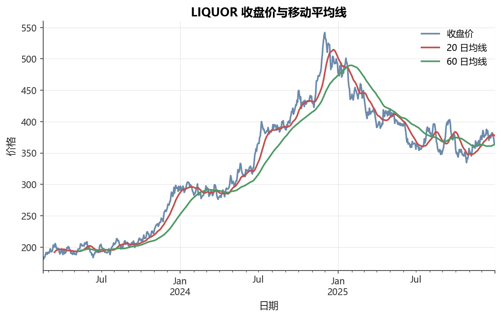

# 第2章 Python 数据科学工具栈

[](https://colab.research.google.com/github/albertandking/financial-data-science/blob/main/notebooks/ch02_python_toolkit.ipynb) [](https://mybinder.org/v2/gh/albertandking/financial-data-science/main?labpath=notebooks/ch02_python_toolkit.ipynb)

!!! info "配套代码"
    本章代码见 `notebooks/ch02_python_toolkit.ipynb`，可逐格运行（依赖内置数据，离线可跑）。运行前请先执行 `uv run python scripts/make_sample_data.py` 生成内置数据集。

## 2.1 本章导读与学习目标

金融数据科学离不开一套经过实战验证的工具栈。本章从项目管理（uv）开始，系统介绍 NumPy 的向量化思维、Pandas 的时间序列能力，以及如何高效存储与可视化金融数据。这些工具将贯穿全书——后续章节的每一个模型、每一张图，都建立在本章基础之上。

**学习目标**

- 理解本书的项目结构，掌握 uv 环境管理的核心命令与依赖组机制
- 掌握 NumPy `ndarray` 的 dtype、轴(axis)概念、向量化运算与广播规则
- 能比较向量化与 for 循环的性能差距，理解其背后原因
- 掌握 Pandas `Series`/`DataFrame` 的创建、索引（`loc`/`iloc`/布尔索引）
- 能处理 `DatetimeIndex`、缺失值、`groupby`、`merge`、`resample`、`rolling`/`ewm`
- 了解 CSV 与 Parquet 格式的差异，选择合适的存储方案
- 能绘制含中文标注的时间序列图

---

## 2.2 为什么是 Python

金融数据科学的事实标准语言是 Python，原因主要有三：

1. **生态完整**：从数据获取（akshare、tushare）、数值计算（NumPy）、数据处理（Pandas）、统计建模（statsmodels）到机器学习（scikit-learn）、深度学习（PyTorch），所有工具均可无缝协作。
2. **可读性强**：代码贴近数学伪代码，如 $\mathbf{r} = \mathbf{P}_{t}/\mathbf{P}_{t-1} - 1$
   可直接写成 `r = P[1:] / P[:-1] - 1`，便于教学与学术协作。
3. **可复现性**：配合 uv 等现代工具，环境与依赖可一键复现，是“可复现研究”的重要保障。

### 2.2.1 uv 环境管理

本书采用 [uv](https://docs.astral.sh/uv/) 管理 Python 环境与依赖。uv 由 Rust 编写，速度极快，能在几秒内完成环境创建与依赖解析。

**核心命令速查表**

| 命令 | 说明 |
|------|------|
| `uv sync` | 按 `pyproject.toml` 安装全部依赖（含 `uv.lock` 锁定版本） |
| `uv sync --extra data` | 额外安装数据获取组（akshare、tushare 等） |
| `uv sync --extra advanced` | 额外安装进阶组（XGBoost、PyTorch 等） |
| `uv run python xxx.py` | 在项目虚拟环境中运行脚本 |
| `uv run jupyter lab` | 在项目环境中启动 JupyterLab |
| `uv add numpy` | 添加新依赖并更新 `uv.lock` |
| `uv remove numpy` | 移除依赖 |

**pyproject.toml 结构**

```toml
[project]
name = "financial-data-science"
requires-python = ">=3.11"

dependencies = [          # 核心依赖：所有章节必须
    "numpy>=1.26",
    "pandas>=2.2",
    "pyarrow>=16.0",
]

[project.optional-dependencies]
data = ["akshare>=1.14"]   # 可选：数据获取
advanced = ["torch>=2.2"]  # 可选：深度学习

[dependency-groups]
docs = ["mkdocs>=1.6", "jupyter>=1.0", "nbconvert>=7.16"]
dev  = ["pytest>=8.0"]
```

!!! tip "可复现研究的关键"
    把 `pyproject.toml` 和 `uv.lock` 一同提交到 Git 仓库。合作者只需 `uv sync` 一条命令，就能得到**完全一致**的环境，包括 Python 版本和所有第三方包的精确版本号。

### 2.2.2 项目目录结构

```
financial-data-science/
├── book/           # Markdown 正文
│   └── part1/
├── notebooks/      # 配套 Jupyter Notebook
├── scripts/        # 数据生成与工具脚本
├── src/fds/        # 本书复用工具包
├── data/
│   ├── raw/        # 原始数据（不提交 Git）
│   └── processed/  # 处理后数据
├── pyproject.toml
└── uv.lock
```

---

## 2.3 NumPy：向量化思维

### 2.3.1 ndarray 与 dtype

NumPy 的核心是 `ndarray`（N 维数组）。与 Python 列表不同，`ndarray` 要求所有元素具有**相同的数据类型（dtype）**，从而能存储在连续内存块中，大幅提升计算效率。

```python
import numpy as np

# 整数数组：dtype 自动推断为 int64
a = np.array([1, 2, 3, 4])
print(a.dtype)   # int64

# 浮点数组：金融计算默认用 float64
prices = np.array([10.0, 10.5, 10.3, 10.8])
print(prices.dtype)   # float64

# 显式指定 dtype
b = np.array([1, 2, 3], dtype=np.float32)   # 节省内存，牺牲精度
```

常用 dtype：

| dtype | 描述 | 精度（十进制有效位） | 金融场景 |
|-------|------|-------------------|---------|
| `float64` | 双精度浮点（8字节） | ≈ 15–16位 | **默认，价格/收益率** |
| `float32` | 单精度浮点（4字节） | ≈ 6–7位 | 大规模深度学习特征，节省内存 |
| `int64` | 64位整数（8字节） | 精确 | 成交量、股票代码 |
| `bool` | 布尔（1字节） | — | 掩码、条件筛选 |

金融计算中应坚持使用 `float64`：即使单个价格精度差异微小，在复利累积（$(1+r_1)(1+r_2)\cdots(1+r_T)$）或协方差矩阵运算中，`float32` 的累积误差可能超过1 bp（基点），影响因子打分或风险模型结果。`float32` 只在确认精度损失可接受的场景（如神经网络权重）才值得使用。

### 2.3.2 轴（axis）概念

`ndarray` 的每个维度称为一个**轴**。金融中最常见的二维数组是“时间 × 标的”：

```
axis=0（沿行，对时间维度聚合）
        ↓
      BANK  LIQUOR  TECH  UTILITY
t=1 [  10      50    100       20 ]
t=2 [  11      52     98       21 ]
t=3 [  10      51    102       19 ]
        → axis=1（沿列，对标的维度聚合）
```

```python
mat = np.array([[10, 50, 100, 20],
                [11, 52,  98, 21],
                [10, 51, 102, 19]], dtype=float)

mat.mean(axis=0)   # 每只股票的均价，shape (4,)
mat.mean(axis=1)   # 每天的截面均价，shape (3,)
mat.std(axis=0)    # 每只股票的价格波动
```

### 2.3.3 向量化 vs for 循环：性能对比

向量化的速度优势来自两个方面：
1. NumPy 底层用 C/Fortran 实现，避免 Python 解释器开销
2. 数据连续存储在内存，CPU 缓存命中率高

```python
import time

n = 1_000_000
prices = np.random.rand(n) * 100 + 50

# 方式一：for 循环（慢）
t0 = time.perf_counter()
returns_loop = []
for i in range(1, len(prices)):
    returns_loop.append(prices[i] / prices[i-1] - 1)
t_loop = time.perf_counter() - t0

# 方式二：向量化（快）
t0 = time.perf_counter()
returns_vec = prices[1:] / prices[:-1] - 1
t_vec = time.perf_counter() - t0

print(f"循环耗时：{t_loop*1000:.1f} ms")
print(f"向量化：  {t_vec*1000:.1f} ms")
print(f"加速比：  {t_loop/t_vec:.0f}x")
# 典型输出：循环 ~400 ms，向量化 ~3 ms，加速约 100x
```

!!! warning “避免在金融计算中写 for 循环”
    当数据量超过万条（A 股日度数据很容易达到几十万行），for 循环会成为明显瓶颈。本书所有示例均采用向量化写法，请养成”先想有没有数组运算”的思维习惯。

!!! example “例 2.1：向量化 vs for 循环——百万级收益率计算的性能对比”
    以计算100万个模拟价格的日度简单收益率为例，对比两种写法的实际耗时。

    ```python
    import numpy as np
    import time

    rng = np.random.default_rng(42)
    n = 1_000_000
    prices = rng.uniform(50, 150, size=n)   # 模拟100万个价格点

    # ── 方式一：Python for 循环 ──────────────────────────────────
    t0 = time.perf_counter()
    ret_loop = []
    for i in range(1, n):
        ret_loop.append(prices[i] / prices[i - 1] - 1)
    t_loop = time.perf_counter() - t0

    # ── 方式二：NumPy 向量化 ─────────────────────────────────────
    t0 = time.perf_counter()
    ret_vec = prices[1:] / prices[:-1] - 1
    t_vec = time.perf_counter() - t0

    print(f”for 循环耗时 : {t_loop * 1000:7.1f} ms”)
    print(f”向量化耗时   : {t_vec  * 1000:7.1f} ms”)
    print(f”加速比       : {t_loop / t_vec:.0f}x”)
    ```

    **典型输出（参考值，因机器而异）：**

    | 方式 | 耗时（ms） | 相对速度 |
    |------|-----------|---------|
    | Python for 循环 | ≈ 350–500 | 1× |
    | NumPy 向量化 | ≈ 2–5 | **约100×** |

    加速比达到 **100倍**左右的原因有二：其一，NumPy 底层由 C 实现，单次运算无 Python 解释器的对象装箱/拆箱开销；其二，`ndarray` 数据连续存储在内存，CPU 预取（prefetch）和 SIMD 指令可充分利用，而 Python 列表中每个元素是独立的堆对象，内存不连续，缓存命中率极低。

### 2.3.4 广播规则（Broadcasting）

当两个形状不同的数组运算时，NumPy 按以下规则自动”广播”对齐：

1. 从最后一维开始对齐，维度数不足的在左侧补1
2. 每个维度大小必须相同，**或**其中一个为1（则自动扩展）
3. 任何维度不满足上述条件则报错

**广播规则逐步判定示例**

以「$250 \times 4$ 收益矩阵」减去「4只股票的均值向量」为例，逐步演示形状对齐过程：

| 步骤 | 操作 | 形状 A（矩阵） | 形状 B（均值向量） |
|------|------|--------------|-----------------|
| 原始形状 | — | `(250, 4)` | `(4,)` |
| 步骤1：左补1 | B 维度不足，左侧补1 | `(250, 4)` | `(1, 4)` |
| 步骤2：检查各维度 | 维度0：250 vs 1，B 扩展为250 | `(250, 4)` | `(250, 4)` |
| 步骤3：检查各维度 | 维度1：4 vs 4，匹配 ✓ | `(250, 4)` | `(250, 4)` |
| 最终结果 | 逐元素相减 | `(250, 4)` | — |

若 B 的形状为 `(3,)` 而非 `(4,)`，则维度1为4 vs 3，两者均不为1，广播失败并抛出 `ValueError: operands could not be broadcast together`。

**实例：给多只股票去均值（标准化截面）**

```python
rng = np.random.default_rng(42)
mat = rng.standard_normal((250, 4))   # 250天 × 4只股票

# mat.mean(axis=0) 形状为 (4,)
# mat 形状为 (250, 4)
# 广播：(4,) → (1, 4) → (250, 4)，再做减法
demeaned = mat - mat.mean(axis=0)
print(demeaned.mean(axis=0).round(10))   # 每列均值 ≈ 0
```

**实例：组合权重 × 收益矩阵**

设 $\mathbf{w}$ 为4只股票的权重向量，$\mathbf{R}$ 为 $T \times 4$ 收益矩阵，则每日组合收益为：

$$r_p = \mathbf{R} \cdot \mathbf{w} \quad \Leftrightarrow \quad \mathbf{R} @ \mathbf{w}$$

```python
w = np.array([0.4, 0.3, 0.2, 0.1])    # 权重，shape (4,)
R = rng.standard_normal((250, 4))      # 收益矩阵，shape (250, 4)

# 矩阵乘（@ 运算符，等价于 np.dot）
portfolio_ret = R @ w                   # shape (250,)

# 广播版：每列乘以对应权重后求和
portfolio_ret2 = (R * w).sum(axis=1)   # 结果相同
print(np.allclose(portfolio_ret, portfolio_ret2))   # True
```

!!! info "为什么用 `@`"
    `@` 是 Python 3.5+ 引入的矩阵乘运算符（PEP 465）。`np.dot` 与 `@` 对二维数组等价，但 `@` 更易读、与数学符号直接对应，本书后续讨论均值-方差优化（$w^\top \mu$、$w^\top \Sigma w$）时将大量使用。

!!! example "例 2.2：广播形状对齐算例——截面标准化"
    **任务**：对「250日 × 4只股票」的模拟收益矩阵，按截面（每天）进行 z-score 标准化，即每日各股票收益率减去当日均值、除以当日标准差。

    ```python
    import numpy as np

    rng = np.random.default_rng(0)
    R = rng.normal(0, 0.02, size=(250, 4))   # shape: (250, 4)

    # ── 截面均值与标准差 ─────────────────────────────────────────
    mu_cross    = R.mean(axis=1)   # shape: (250,)
    sigma_cross = R.std(axis=1)    # shape: (250,)

    # ── 广播除法：需要将 (250,) 变为列向量 (250, 1) ──────────────
    # 直接做 R - mu_cross 会报错：(250,4) - (250,) 无法对齐
    z = (R - mu_cross[:, np.newaxis]) / sigma_cross[:, np.newaxis]
    # ── 验证：每行均值 ≈ 0，每行标准差 ≈ 1 ──────────────────────
    print(z.mean(axis=1).round(10))    # array of ~0.0
    print(z.std(axis=1).round(10))     # array of ~1.0
    ```

    **形状推导**：
    - `mu_cross` 形状 `(250,)` → `mu_cross[:, np.newaxis]` 变为 `(250, 1)`
    - `(250, 4)` - `(250, 1)` → 广播规则步骤2将 `(250, 1)` 扩展至 `(250, 4)` ✓
    - 若省略 `np.newaxis` 直接写 `R - mu_cross`，NumPy 将 `(250,)` 左补为 `(1, 250)`，尝试对维度1做4 vs 250，报 `ValueError`。

### 2.3.5 随机数：default_rng

NumPy 1.17起推荐用 `default_rng`，避免全局随机状态：

```python
rng = np.random.default_rng(seed=42)   # 固定种子，保证可复现

# 正态分布（均值, 标准差, 形状）
noise = rng.normal(loc=0.0, scale=0.01, size=(252, 4))

# 均匀分布
u = rng.uniform(0, 1, size=1000)

# 标准正态
z = rng.standard_normal((100, 4))
```

!!! tip "可复现性"
    固定 `seed` 是科研和教学的好习惯：结果可被他人精确复现，方便排查 bug 和撰写报告。

### 2.3.6 基础线性代数：点积与矩阵乘

| 操作 | 代码 | 说明 |
|------|------|------|
| 向量点积 $\mathbf{a}^\top \mathbf{b}$ | `a @ b` | 标量 |
| 矩阵向量乘 $A\mathbf{x}$ | `A @ x` | 向量 |
| 矩阵乘 $AB$ | `A @ B` | 矩阵 |
| 转置 $A^\top$ | `A.T` | 矩阵 |

```python
mu = np.array([0.10, 0.12, 0.15, 0.08])   # 预期年化收益
w  = np.array([0.25, 0.25, 0.25, 0.25])   # 等权组合

# 组合预期收益：w^T μ
port_mu = w @ mu
print(f"组合预期收益：{port_mu:.2%}")   # 11.25%

# 协方差矩阵（后续第5章详细推导）
Sigma = np.diag([0.04, 0.09, 0.16, 0.01])   # 对角（无相关）示例
port_var = w @ Sigma @ w                       # w^T Σ w
print(f"组合方差：{port_var:.4f}")
print(f"组合波动：{port_var**0.5:.2%}")
```

---

## 2.4 Pandas：金融数据的主力

### 2.4.1 Series 与 DataFrame

```python
import pandas as pd

# Series：带索引的一维数组
price_series = pd.Series(
    [10.5, 11.0, 10.8, 11.3, 11.1],
    index=pd.date_range("2025-01-02", periods=5, freq="B"),
    name="BANK"
)

# DataFrame：带行列标签的二维表
data = {
    "BANK":    [10.5, 11.0, 10.8],
    "LIQUOR":  [50.2, 51.5, 50.8],
    "TECH":    [100.3, 98.7, 101.2],
    "UTILITY": [20.1, 20.5, 20.3],
}
df = pd.DataFrame(data, index=pd.date_range("2025-01-02", periods=3, freq="B"))
```

### 2.4.2 索引：loc / iloc / 布尔索引

这是 Pandas 初学者最容易混淆的地方：

| 方法 | 基于 | 示例 |
|------|------|------|
| `loc[行标签, 列标签]` | **标签** | `df.loc["2025-01-02", "BANK"]` |
| `iloc[行整数, 列整数]` | **位置** | `df.iloc[0, 0]` |
| 布尔索引 | 条件 | `df[df["BANK"] > 11]` |

```python
from fds import load_sample_prices

prices = load_sample_prices()

# loc：按日期标签切片（包含两端）
q1_2025 = prices.loc["2025-01-01":"2025-03-31"]

# loc：选行 + 选列
bank_2025 = prices.loc["2025", "BANK"]

# iloc：第 0 到 4 行，全部列
first5 = prices.iloc[:5, :]

# 布尔索引：找 TECH 超过历史均值的交易日
above_mean = prices[prices["TECH"] > prices["TECH"].mean()]

# 赋值时务必用 loc 避免 SettingWithCopyWarning
prices_copy = prices.copy()
prices_copy.loc["2025-01-02", "BANK"] = 11.0
```

!!! warning "链式赋值陷阱"
    `df[df["A"] > 0]["B"] = 1` 可能不会修改原始 DataFrame（取决于 Pandas 是否复制）。正确做法是用 `df.loc[df["A"] > 0, "B"] = 1`。Pandas 2.0会对链式赋值发出 `FutureWarning`，Pandas 3.0将彻底禁止。

!!! example "例2.3：loc / iloc / 布尔索引对照例"
    以下用同一个小 DataFrame 演示三种索引方式的相同点与差异：

    ```python
    import pandas as pd

    df = pd.DataFrame(
        {"股票": ["BANK", "LIQUOR", "TECH", "UTILITY"],
         "收盘价": [11.20, 52.80, 98.60, 20.40],
         "涨跌幅": [0.015, -0.003, 0.028, -0.008]},
        index=pd.date_range("2025-03-03", periods=4, freq="B"),
    )
    ```

    | 需求 | 代码 | 返回类型 | 说明 |
    |------|------|---------|------|
    | 取第1行第2列的值 | `df.iloc[0, 1]` | 标量 `11.20` | 完全基于整数位置 |
    | 取第1行第2列的值 | `df.loc["2025-03-03", "收盘价"]` | 标量 `11.20` | 基于标签，两端均包含 |
    | 取前两行 | `df.iloc[:2]` | DataFrame | 位置切片，不含右端 |
    | 取前两行 | `df.loc[:"2025-03-04"]` | DataFrame | 标签切片，**含右端** |
    | 找涨幅正的交易日 | `df[df["涨跌幅"] > 0]` | DataFrame | 布尔索引，返回满足条件的行 |
    | 修改某单元格 | `df.loc["2025-03-03", "收盘价"] = 11.30` | 原地修改 | 必须用 `loc`，不能用 `iloc` 混用字符串列名 |

    ```python
    # 验证：loc 标签切片含两端
    print(df.loc["2025-03-03":"2025-03-04"])   # 输出 2 行（含 03-04）

    # 验证：iloc 位置切片不含右端
    print(df.iloc[0:2])                         # 同样输出 2 行

    # 布尔索引：找收盘价超过 50 元的行
    big = df[df["收盘价"] > 50]
    print(big)                                  # 只有 LIQUOR（52.80）和 TECH（98.60）
    ```

    **核心记忆法**：`loc` 认“标签名”，`iloc` 认“数字位”；两者在切片时的最大差异是 `loc` **包含右端标签**，`iloc` **不含右端位置**。

### 2.4.3 DatetimeIndex 与时间切片

```python
prices = load_sample_prices()
print(type(prices.index))          # <class 'pandas.DatetimeIndex'>
print(prices.index.freq)           # <BusinessDay>

# 字符串切片（仅 DatetimeIndex 支持）
prices.loc["2025"]                  # 2025 全年
prices.loc["2025-01":"2025-03"]     # 一季度
prices.loc["2024-Q4"]               # 第四季度（Pandas ≥1.4）

# 常用时间属性
prices.index.year
prices.index.month
prices.index.day_of_week            # 0=周一，4=周五
```

**频率别名速查**

| 别名 | 含义 | 说明 |
|------|------|------|
| `B` | 工作日 | 跳过周末 |
| `D` | 日历日 | 含节假日 |
| `W` | 每周日 | 可 `W-FRI` 指定截止日 |
| `ME` | 月末 | Pandas 2.x 新别名，旧版用 `M` |
| `QE` | 季末 | 旧版用 `Q` |
| `YE` | 年末 | 旧版用 `A`/`Y` |

!!! tip "Pandas 2.x 频率别名变更"
    Pandas 2.2起，`M`/`Q`/`Y`/`A` 等别名已弃用并在 Pandas 3.0中移除。请统一使用 `ME`/`QE`/`YE`，以免代码在未来版本报 `FutureWarning`。

**DatetimeIndex 的常用访问器**

`DatetimeIndex` 提供丰富的属性，可直接抽取时间分量，无需字符串解析，在特征工程（第8章）中频繁使用：

```python
idx = prices.index                # DatetimeIndex

idx.year          # 年份（整数数组）
idx.month         # 月份1–12
idx.day           # 日1–31
idx.day_of_week   # 0=周一 … 4=周五（工作日编号）
idx.quarter       # 季度1–4
idx.is_month_end  # 布尔数组，是否为月末最后一个交易日
idx.is_quarter_end

# 转换为 Period（会计期）
idx.to_period("M")    # 转为月度 Period 索引，如 "2025-01"
idx.to_period("Q")    # 转为季度 Period 索引，如 "2025Q1"
```

`Period` 索引适合与宏观数据（季度 GDP、月度 CPI）做 `merge`，因为 `Period` 天然表达「整段时间」而非某一精确时刻，避免时区或日历错位问题。

### 2.4.4 缺失值处理

金融数据经常遇到缺失值（停牌、节假日、数据源问题）。

```python
# 检测缺失值
prices.isna().sum()           # 每列缺失数量
prices.isna().any()           # 是否存在缺失

# 前向填充（停牌用前一日价格）
prices_filled = prices.ffill()

# 后向填充（少数场景：用后续已知值填补历史缺口）
prices_bfill = prices.bfill()

# 删除含缺失值的行
prices_clean = prices.dropna()

# 用特定值填充（如成交量缺失填 0）
# volume.fillna(0)
```

!!! example "例2.4：缺失值 ffill / dropna 处理——停牌数据修复"
    A 股中若某只股票停牌，当日数据源通常返回 `NaN`。以下用含缺口的小数据演示常见处理流程：

    ```python
    import pandas as pd
    import numpy as np

    idx = pd.date_range("2025-01-02", periods=8, freq="B")
    raw = pd.Series(
        [10.0, 10.2, np.nan, np.nan, 10.5, np.nan, 10.8, 10.9],
        index=idx,
        name="BANK_停牌示例",
    )
    print(raw)
    ```

    输出（`NaN` 对应停牌日）：

    ```
    2025-01-02    10.0
    2025-01-03    10.2
    2025-01-06     NaN   ← 停牌
    2025-01-07     NaN   ← 停牌
    2025-01-08    10.5
    2025-01-09     NaN   ← 停牌
    2025-01-10    10.8
    2025-01-13    10.9
    ```

    ```python
    # ── 方案一：前向填充（ffill）──────────────────────────────────
    filled = raw.ffill()
    # 01-06 → 10.2，01-07 → 10.2，01-09 → 10.5（用最近已知价填充）

    # ── 方案二：限制填充步数（limit=1，超过 1 日仍为 NaN）──────────
    filled_limit = raw.ffill(limit=1)
    # 01-06 → 10.2，01-07 → NaN（连续停牌第 2 天不填充）

    # ── 方案三：直接删除含缺失值的行 ─────────────────────────────
    clean = raw.dropna()
    # 保留 5 行，剔除停牌日

    print(pd.concat([raw, filled, filled_limit, clean],
                    axis=1,
                    keys=["原始", "ffill", "ffill(limit=1)", "dropna"]))
    ```

    **如何选择**：

    | 场景 | 推荐方案 | 理由 |
    |------|---------|------|
    | 价格序列、短暂停牌（1–3日） | `ffill()` | 保持连续性，收益率计算不会突然跳空 |
    | 停牌超过1周，怀疑数据质量 | `ffill(limit=n)` | 避免长期用过期价格掩盖真实缺口 |
    | 计算收益率、统计截面信号 | `dropna()` | 避免填充引入的「假」价格污染模型 |

### 2.4.5 groupby：按年/月统计

```python
# 计算日度收益率
from fds import daily_returns
ret = daily_returns(prices)   # log=False 默认，算术收益率

# 添加年份列，按年分组
ret["year"] = ret.index.year
annual_stats = ret.groupby("year")[["BANK", "LIQUOR", "TECH", "UTILITY"]].agg(
    ["mean", "std"]
)
print(annual_stats)

# 更简洁：用 Grouper 按年分组
annual_ret = (
    ret.drop(columns="year")
    .groupby(pd.Grouper(freq="YE"))
    .apply(lambda x: (1 + x).prod() - 1)   # 年化复利
)
```

!!! example "例2.5：groupby 按月聚合——计算月均日度收益率"
    以内置数据为例，计算每只股票每个月的「日度收益率均值」与「日度收益率标准差」：

    ```python
    import pandas as pd
    import numpy as np
    from fds import load_sample_prices

    prices = load_sample_prices()

    # ── 步骤 1：计算日度简单收益率 ─────────────────────────────────
    ret = prices.pct_change().dropna()        # shape: (N-1, 4)

    # ── 步骤 2：用 Grouper 按月分组（频率别名 ME = month-end）──────
    monthly = (
        ret
        .groupby(pd.Grouper(freq="ME"))
        .agg(["mean", "std"])
        .round(4)
    )
    # monthly 是 MultiIndex 列（股票名 × 统计量），形如：
    #            BANK        LIQUOR       TECH        UTILITY
    #            mean   std  mean   std   mean   std  mean   std
    # 2023-01-31  ...   ...   ...   ...    ...   ...   ...   ...
    # 2023-02-28  ...   ...   ...   ...    ...   ...   ...   ...

    # ── 步骤 3：仅看银行股，按月年化夏普 ─────────────────────────
    bank_m = monthly["BANK"].copy()
    bank_m["sharpe_annualized"] = (
        bank_m["mean"] / bank_m["std"] * (252 ** 0.5)
    )
    print(bank_m.tail(6))
    ```

    **关键点**：`pd.Grouper(freq="ME")` 会将每个月内所有交易日的收益率归入该月，聚合结果的索引是每月最后一个日历日（月末）。若改为 `freq="QE"` 则按季末分组；改为 `freq="YE"` 则按年末分组。

### 2.4.6 merge 与 concat：多标的对齐

实务中经常需要把来自不同数据源的数据拼合。

```python
# concat：列方向拼合（外连接，日期不匹配时填 NaN）
bank = prices[["BANK"]].copy()
liquor = prices[["LIQUOR"]].iloc[5:]   # 故意错开 5 行

merged = pd.concat([bank, liquor], axis=1)
print(merged.isna().sum())   # LIQUOR 前 5 行为 NaN

# merge：按某个键列连接（适合有明确关联键的场景）
# 例如：把宏观利率数据和股价数据按月份对齐
stock_monthly = prices.resample("ME").last()
stock_monthly["year_month"] = stock_monthly.index.to_period("M")

rate_data = pd.DataFrame({
    "year_month": pd.period_range("2023-01", periods=24, freq="M"),
    "rate": [3.5 + i*0.01 for i in range(24)]
})
combined = stock_monthly.merge(rate_data, on="year_month", how="left")
```

### 2.4.7 resample：时间频率转换

`resample` 是处理时间序列的利器，可在任意频率之间转换：

```python
# 日 → 月
month_end  = prices.resample("ME").last()     # 月末价格
month_high = prices.resample("ME").max()      # 月内最高价
month_ret  = month_end.pct_change().dropna()  # 月度算术收益率

# 日 → 周（每周五）
week_ret = prices.resample("W-FRI").last().pct_change().dropna()

# 日 → 年
annual_price = prices.resample("YE").last()

# OHLC（开高低收）聚合
ohlc = prices["BANK"].resample("ME").ohlc()
```

!!! example "例 2.6：A 股月度收益率——完整 resample 流程"
    **任务**：取模拟「银行股」的日度收盘价，将其重采样为月度收益率序列，并计算年化收益与年化波动率，演示 `resample` 的完整工作流程。

    ```python
    import pandas as pd
    import numpy as np
    from fds import load_sample_prices

    # ── 步骤 1：取日度收盘价 ───────────────────────────────────────
    prices = load_sample_prices()
    bank_daily = prices["BANK"]    # DatetimeIndex，工作日频率

    # ── 步骤 2：重采样为月末收盘价 ─────────────────────────────────
    # "ME" = Month-End（Pandas 2.2+ 推荐别名，旧版为 "M"）
    bank_monthly = bank_daily.resample("ME").last()
    # bank_monthly 的索引是每月最后一个日历日，值为当月最后一个交易日的收盘价

    # ── 步骤 3：计算月度简单收益率 $r_t = P_t/P_{t-1} - 1$ ─────────
    bank_mret = bank_monthly.pct_change().dropna()
    bank_mret.name = "月度收益率"

    # ── 步骤 4：汇总统计 ───────────────────────────────────────────
    n_months = len(bank_mret)
    ann_ret  = (1 + bank_mret).prod() ** (12 / n_months) - 1   # 年化复利收益
    ann_vol  = bank_mret.std() * (12 ** 0.5)                   # 年化波动率
    sharpe   = ann_ret / ann_vol                                # 简化夏普（无风险利率=0）

    print(f"月度样本数   : {n_months}")
    print(f"年化收益率   : {ann_ret:.2%}")
    print(f"年化波动率   : {ann_vol:.2%}")
    print(f"夏普比率     : {sharpe:.2f}")

    # ── 步骤 5（可选）：查看前 6 个月的数据 ───────────────────────
    print(bank_mret.head(6).to_frame().assign(
        累计净值=lambda d: (1 + d["月度收益率"]).cumprod()
    ).round(4))
    ```

    整个流程只用三步：`.resample("ME").last()` → `.pct_change().dropna()` → 统计量计算。将 `"ME"` 改为 `"QE"` 即可得到季度收益率，改为 `"YE"` 即年度收益率。

    !!! tip "Pandas 2.x 频率别名的来历"
        早期 Pandas 采用 `M`（Month）、`Q`（Quarter）、`A`/`Y`（Year）作为频率别名，含义模糊——`M` 本意指“月末”，但读者常误解为“每月任意日”。Pandas 2.2引入更清晰的 `ME`（Month-End）、`MS`（Month-Start）、`QE`（Quarter-End）、`QS`（Quarter-Start）、`YE`（Year-End）、`YS`（Year-Start）命名体系，**End/Start 后缀**明确表达采样点落在周期的末端还是起始端，消除歧义。旧别名 `M`/`Q`/`A`/`Y` 在 Pandas 2.x 仍可用但会触发 `FutureWarning`，在 **Pandas 3.0中已彻底移除**；若代码需要兼容多版本，建议统一改写为新别名，并在 `requirements` 中锁定 `pandas>=2.2`。

### 2.4.8 rolling 与 ewm：移动窗口

<figure markdown>
  { width="680" }
  <figcaption>图2-1　LIQUOR 收盘价与移动平均线（rolling 应用）</figcaption>
</figure>


移动窗口统计是技术分析与风险监控的基础：

```python
# 20 日简单移动平均（SMA）
sma20 = prices["TECH"].rolling(window=20).mean()

# 20 日移动波动率（年化）
vol20 = prices["TECH"].rolling(window=20).std() * (252**0.5)

# 指数加权移动平均（EWM / EWMA）：近期权重更高
# span=20 ≈ 对应 20 日半衰期，com/halflife 参数也可用
ewma20 = prices["TECH"].ewm(span=20, adjust=False).mean()

# EWM 波动率（RiskMetrics 模型常用）
ewm_vol = prices["TECH"].pct_change().ewm(span=60).std() * (252**0.5)
```

| 方法 | 特点 | 典型用途 |
|------|------|---------|
| `rolling(n).mean()` | 等权，窗口内数据 | SMA、MACD |
| `rolling(n).std()` | 等权，历史波动率 | 布林带、VaR |
| `ewm(span=n).mean()` | 指数权重，更敏感 | EWMA 均线 |
| `ewm(span=n).std()` | 指数权重 | RiskMetrics 波动率 |

### 2.4.9 apply vs 向量化

`apply` 允许对 DataFrame 的每行/每列应用任意 Python 函数，但速度较慢。能向量化就不要用 `apply`：

```python
# 慢（apply + lambda）
sharpe_apply = ret.apply(lambda col: col.mean() / col.std() * 252**0.5)

# 快（向量化）
sharpe_vec = ret.mean() / ret.std() * (252**0.5)

# 两者结果相同，但后者快 10–50 倍
# apply 保留给真正复杂、无法向量化的自定义逻辑
```

**apply vs 向量化对比**

| 维度 | `apply(func)` | 向量化方法 |
|------|--------------|-----------|
| 速度 | 慢（逐行/列调 Python 函数） | **快**（调用底层 C 实现） |
| 灵活性 | 高（任意自定义函数） | 受限于内置运算 |
| 适用场景 | 复杂自定义指标（如信息系数、最大回撤） | 均值/标准差/收益率等标准统计量 |
| 调试难度 | 函数内部可加断点 | 链式表达式，需拆分调试 |
| 内存效率 | 低（每次调用产生临时对象） | 高（原地广播） |

!!! tip "apply 的合理用场"
    当计算逻辑无法用 NumPy/Pandas 内置函数表达时（例如对每列做 Fama-MacBeth 截面回归、计算每列的最大回撤路径），`apply` 是最简洁的选择。此时可配合 `tqdm` 显示进度条：
    ```python
    from tqdm import tqdm
    tqdm.pandas()
    result = df.progress_apply(your_complex_func)
    ```

### 2.4.10 MultiIndex 简介

MultiIndex（多级索引）用于面板数据（多标的 × 时间），将在第8章详细介绍。

```python
# 构造 MultiIndex DataFrame（标的 × 日期）
arrays = [
    ["BANK", "BANK", "TECH", "TECH"],
    pd.to_datetime(["2025-01-02", "2025-01-03"] * 2),
]
idx = pd.MultiIndex.from_arrays(arrays, names=["ticker", "date"])
panel = pd.Series([10.5, 11.0, 100.3, 98.7], index=idx)

# 按外层索引切片
panel.loc["BANK"]

# 交叉截面
panel.unstack("ticker")   # 转为宽表（行=日期，列=标的）
```

---

## 2.5 时间处理

### 2.5.1 pd.to_datetime

```python
# 字符串转日期
dates = pd.to_datetime(["2025-01-02", "20250103", "Jan 4, 2025"])

# 指定格式（提速）
dates = pd.to_datetime(["20250102", "20250103"], format="%Y%m%d")

# Unix 时间戳
ts = pd.to_datetime(1735689600, unit="s")
```

### 2.5.2 日期运算与偏移量

```python
import pandas as pd

today = pd.Timestamp("2025-12-31")

# 日期加减
yesterday = today - pd.Timedelta(days=1)
next_month = today + pd.DateOffset(months=1)

# 工作日偏移
one_bday_later = today + pd.offsets.BDay(1)

# 生成日期范围
trading_days = pd.date_range("2025-01-01", "2025-12-31", freq="B")
print(len(trading_days))   # ~261个工作日（非精确交易日）
```

---

## 2.6 数据存储：CSV vs Parquet

金融数据处理中，选对存储格式事半功倍。

| 维度 | CSV | Parquet |
|------|-----|---------|
| 可读性 | 文本，可直接打开 | 二进制，需工具 |
| 体积 | 大（无压缩） | **小（列式+压缩，通常5–10x）** |
| 读写速度 | 慢（逐行解析） | **快（列式批量读取）** |
| 类型保留 | 无（全部字符串） | **有（日期/浮点/类别等）** |
| 跨语言 | 所有工具 | R/Python/Spark 等均支持 |
| 建议场景 | 对外交换、小文件 | **日常存储、中大型数据** |

```python
import pandas as pd

prices = pd.read_parquet("data/processed/prices.parquet")   # 推荐入库格式

# 写 Parquet（需要 pyarrow 或 fastparquet）
prices.to_parquet("output/prices.parquet", compression="snappy")

# 写 CSV（对外交换、给 Excel 用户）
prices.to_csv("output/prices.csv", encoding="utf-8-sig")    # utf-8-sig 防 Excel 乱码

# 往返一致性验证
back = pd.read_parquet("output/prices.parquet")
assert prices.equals(back), "读写前后数据不一致！"
```

!!! info "为什么优先 Parquet"
    以本书内置数据（750交易日 × 4只股票）为例：CSV 约45 KB，Parquet 约8 KB，体积节省80%；读取速度 Parquet 约快3–5倍（数据量越大优势越明显）。更重要的是，Parquet 保留 `DatetimeIndex` 的类型信息，避免读回后需要再次 `pd.to_datetime` 转换。

---

## 2.7 matplotlib 绘图基础

### 2.7.1 Figure 与 Axes

matplotlib 的绘图对象分两层：
- `Figure`：整张图，相当于“画布”
- `Axes`：坐标系，一张 Figure 可包含多个 Axes

```python
import matplotlib.pyplot as plt
from fds import load_sample_prices, set_chinese_font

set_chinese_font()   # 设置中文字体，避免方块字

prices = load_sample_prices()

fig, axes = plt.subplots(2, 1, figsize=(12, 8), sharex=True)

# 上子图：股价走势
axes[0].plot(prices.index, prices["TECH"], label="科技", color="steelblue")
axes[0].plot(prices.index, prices["BANK"], label="银行", color="salmon")
axes[0].set_ylabel("价格（元）")
axes[0].set_title("A股风格模拟数据：科技 vs 银行")
axes[0].legend()

# 下子图：科技股 20 日移动平均
tech_sma = prices["TECH"].rolling(20).mean()
axes[1].plot(prices.index, prices["TECH"], alpha=0.4, label="科技原始")
axes[1].plot(prices.index, tech_sma, linewidth=2, label="20日均线")
axes[1].set_ylabel("价格（元）")
axes[1].set_xlabel("日期")
axes[1].legend()

fig.tight_layout()
plt.savefig("output/ch02_price_trend.png", dpi=150, bbox_inches="tight")
plt.show()
```

!!! tip "中文字体"
    `set_chinese_font()` 会自动检测系统可用的中文字体（Windows 上优先 SimHei，macOS 上优先 PingFang SC，Linux 上优先 Noto Sans CJK），确保标题与标签正常显示。在 notebook 第一格调用一次即可全局生效。

---

## 2.8 性能与可读性建议

| 场景 | 推荐写法 | 避免 |
|------|---------|------|
| 逐元素计算 | 向量化 `arr * factor` | `for` 循环 |
| 条件赋值 | `df.loc[cond, col] = val` | 链式赋值 `df[cond][col] = val` |
| 分组统计 | `groupby().agg()` | `for group in groupby` 手动累加 |
| 自定义函数 | 先试向量化，再用 `apply` | 过度使用 `apply` |
| 多次读同一文件 | 读入后缓存变量 | 每次都从磁盘读 |
| 大型 DataFrame 预览 | `.head()` / `.sample(5)` | 直接 print 整个 DataFrame |

---

## 2.9 本章小结

本章建立了贯穿全书的工具基础：

- **uv**：通过 `pyproject.toml` + `uv.lock` 实现一键复现的 Python 环境
- **NumPy**：`ndarray` 的向量化运算（快100x 以上）、广播规则、矩阵乘 `@`为后续组合收益 $w^\top \mu$ 和组合方差 $w^\top \Sigma w$ 铺垫
- **Pandas**：`DatetimeIndex` + `loc/iloc/布尔索引` + `resample/rolling/ewm`构成金融时间序列处理的完整工具链
- **存储**：日常数据优先 Parquet（快、小、保类型），对外交换用 CSV
- **可视化**：`set_chinese_font()` 一行解决中文字体问题

---

## 2.10 习题

1. **向量化练习**：用 NumPy 向量化（不使用循环）计算以下指标：加载内置数据 `load_sample_prices()`，计算 LIQUOR 的5日简单移动平均（提示：可用 `np.convolve(prices, np.ones(5)/5, mode='valid')`），并与 Pandas `rolling(5).mean()` 结果对比，验证两者一致。

2. **广播应用**：对所有4只股票，用 NumPy 广播计算“超额收益”（每日各股票收益率减去当日等权平均收益率），结果转为 DataFrame，打印前5行。（提示：先用 `daily_returns` 算收益率矩阵，再减去行均值。）

3. **时间序列分析**：对内置数据按以下步骤操作：a. `resample("W-FRI")` 得到周频价格；b. 计算周度收益率；c. 用 `groupby(pd.Grouper(freq="YE"))` 统计每年的周度收益率均值与标准差；d. 打印结果并说明哪一年波动最大。

4. **Parquet 往返**：将波动率最高的一只股票（用 `std()` 衡量）的日度收益率单独保存为 Parquet 文件，读回后验证 `equals()` 返回 `True`，并比较该文件与对应 CSV 文件的字节大小。

5. **可视化**：绘制一张图，同时展示 TECH 股的日度收盘价（蓝色细线，alpha=0.4）、20日 SMA（橙色实线）、20日 EWMA（绿色虚线），加上中文标题“科技股移动平均对比”和图例，保存为 PNG 文件。思路：先调用 `set_chinese_font()`，再用 `fig, ax = plt.subplots()` 绘制。

---

## 2.11 拓展阅读

1. **McKinney, W.** (2022). *Python for Data Analysis*, 3rd ed. O'Reilly.
   Pandas 作者亲著，第10–11章对时间序列有深入讲解。
2. **NumPy 官方文档** — Broadcasting：<https://numpy.org/doc/stable/user/basics.broadcasting.html>
3. **Pandas 官方文档** — Time Series：<https://pandas.pydata.org/docs/user_guide/timeseries.html>
4. **Pandas 官方文档** — Enhancing Performance：<https://pandas.pydata.org/docs/user_guide/enhancingperf.html>
5. **VanderPlas, J.** (2023). *Python Data Science Handbook*, 2nd ed. O'Reilly.
   开源全文：<https://jakevdp.github.io/PythonDataScienceHandbook/>
6. **uv 文档**：<https://docs.astral.sh/uv/>，工作区与依赖组的完整说明。
