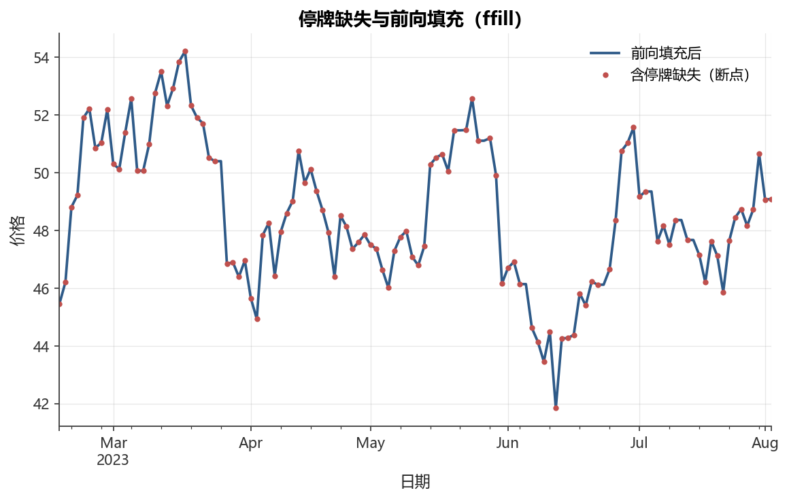

# 第3章 金融数据获取与清洗

[](https://colab.research.google.com/github/albertandking/financial-data-science/blob/main/notebooks/ch03_data_acquisition.ipynb) [](https://mybinder.org/v2/gh/albertandking/financial-data-science/main?labpath=notebooks/ch03_data_acquisition.ipynb)

!!! info "配套代码"
    本章代码见 `notebooks/ch03_data_acquisition.ipynb`。
    清洗与质量检查部分使用内置数据，**离线即可运行**；
    末尾「联网抓取」小节需先执行 `uv sync --extra data`，
    notebook 中联网格已用 `try/except` 包裹，未联网时会安全跳过。

---

## 3.1 本章导读

“垃圾进，垃圾出（Garbage In, Garbage Out）”是数据科学的铁律，在金融领域更加严苛——
一次复权处理的失误就可能让回测收益率失真数倍，一次停牌日期对齐错误就可能让因子研究
出现严重的幸存者偏差。本章聚焦于 A 股量化研究者在数据准备阶段必须解决的四类核心问题：

1. **数据从哪里来**：中国市场数据源全景与选型；
2. **复权问题**：理解价格跳变的原理，正确计算历史收益；
3. **缺失与停牌**：识别、填充或剔除，避免引入偏差；
4. **异常值与质量检查**：克制地清洗，保留真实信息。

### 3.1.1 学习目标

完成本章学习后，读者应能：

- 列举中国主要金融数据源，说明各自的覆盖范围、门槛与适用场景；
- 解释前复权与后复权的数学原理，并判断何时使用哪种复权方式；
- 用 `pandas` 系统地完成：停牌缺失识别→多标的日历对齐→前向填充→异常值标记；
- 编写数据质量检查函数，输出完整性/一致性/时效性/准确性报告；
- （可选）调用 akshare 或 tushare 抓取真实 A 股日线数据并落盘到 Parquet。

---

## 3.2 中国市场数据源全景

### 3.2.1 数据源对比

中国金融市场有着丰富的数据生态，从免费开源到机构付费各层次均有覆盖。
下表从五个维度做系统性对比：

| 数据源 | 覆盖范围 | 使用门槛 | 稳定性 | 典型适用场景 |
|--------|---------|---------|--------|------------|
| **akshare** | A/H 股日线、财报、宏观、基金、期货、债券、指数、ETF | 免费、免注册、pip 即用 | 中（接口随官网变化） | 教学、个人研究（**本书首选**） |
| **tushare Pro** | A 股日线/分钟线、财报、指数、基金、期货、宏观 | 免费注册 + 积分（基础接口门槛低） | 高（有官方维护） | 系统性研究、需要稳定接口 |
| **Wind 万得** | 全品类：股票/债券/期货/期权/另类 | 付费订阅（机构为主） | 极高 | 机构量化、卖方研究 |
| **聚宽 JQData** | A 股、期货、基本面、财务 | 付费，有学术申请通道 | 高 | 策略回测（内置回测框架） |
| **米筐 RiceQuant** | A 股、期货 | 付费 | 高 | 策略开发与回测 |
| **掘金量化** | A 股、期货、ETF | 付费，有免费档 | 高 | 实盘与仿真交易 |
| **交易所官网** | 权威公告、财报、停复牌公告 | 免费，需手动解析 | 极高（权威来源） | 合规核对、数据校验 |
| **东方财富/同花顺** | 日线、资金流向、概念、股吧情绪 | 免费（网页抓取） | 低（反爬限制） | 另类数据探索 |

!!! tip "选型建议"
    - **教学与个人研究**：akshare（免注册、接口覆盖全）
    - **系统性实证研究**：tushare Pro（积分机制确保稳定，CSV/Parquet 落盘后离线使用）
    - **机构级生产系统**：Wind + 内部数据库
    - 任何场景下都建议**先抓取后落盘**，避免每次分析都消耗 API 配额

### 3.2.2 akshare 常用接口速览

akshare 的接口以“数据源名称\_数据类型\_频率”命名，记忆成本低。

**A 股日线行情**

```python
import akshare as ak

# 贵州茅台前复权日线（2023-01-01 至 2024-12-31）
df = ak.stock_zh_a_hist(
    symbol="600519",
    period="daily",
    start_date="20230101",
    end_date="20241231",
    adjust="qfq",       # qfq=前复权 hfq=后复权 ""=不复权
)
print(df.columns.tolist())
# ['日期', '开盘', '收盘', '最高', '最低', '成交量', '成交额',
#  '振幅', '涨跌幅', '涨跌额', '换手率']
```

**财务报表**

```python
# 利润表（年报）
profit = ak.stock_financial_report_sina(stock="sh600519", symbol="利润表")
# 资产负债表
balance = ak.stock_financial_report_sina(stock="sh600519", symbol="资产负债表")
```

**宏观数据**

```python
gdp   = ak.macro_china_gdp()              # GDP 季度数据
cpi   = ak.macro_china_cpi_monthly()      # CPI 月度数据
pmi   = ak.macro_china_pmi_yearly()       # PMI 年度数据
shibor = ak.rate_interbank(market="上海", symbol="Shibor人民币",
                            indicator="隔夜")  # 上海银行间同业拆放利率
```

**指数与基金**

```python
hs300  = ak.stock_zh_index_daily(symbol="sh000300")   # 沪深300日线
fund_nav = ak.fund_open_fund_info_em(fund="000001", indicator="单位净值走势")
```

### 3.2.3 tushare Pro 快速上手

tushare 需要注册后获取 token，基础行情接口积分要求不高：

```python
import tushare as ts

ts.set_token("你的_TOKEN_此处")          # 一次设置即可，会写入本地配置
pro = ts.pro_api()

# 日线行情（后复权）
df = pro.daily(
    ts_code="600519.SH",
    start_date="20230101",
    end_date="20241231",
)
# 返回字段：ts_code, trade_date, open, high, low, close, vol, amount

# 复权因子（用于手动复权）
adj = pro.adj_factor(ts_code="600519.SH", start_date="20230101")
```

!!! note "token 安全"
    不要把 token 硬编码在代码里或提交到 Git。推荐做法是：
    ```bash
    export TUSHARE_TOKEN="your_token_here"   # 写入 .bashrc / .zshrc
    ```
    ```python
    import os, tushare as ts
    ts.set_token(os.environ["TUSHARE_TOKEN"])
    ```

---

## 3.3 复权原理（重点）

### 3.3.1 为什么价格会跳变？

上市公司会以多种方式向股东分配利益或调整资本结构，这些事件会在**除权除息日**引起
价格人为跳变：

| 事件类型 | 价格效应 | 举例 |
|---------|---------|------|
| 现金分红（派息） | 价格下跌（除息） | 每股派息 0.50 元，价格相应降低 |
| 送股（转增） | 价格下跌、股数增加 | 10 送 3，价格变为原来 10/13 |
| 配股 | 价格下跌（除权） | 以低于市价配售新股 |
| 股票合并（缩股） | 价格上升、股数减少 | 少见 |

若使用**未复权价格**计算日收益率，则除权日会出现**巨大的虚假“暴跌”**：

$$
r_t^{\text{未复权}} = \frac{P_t - P_{t-1}}{P_{t-1}}
$$

其中 $P_t$ 是除权后价格（已调低），$P_{t-1}$ 是除权前价格，导致 $r_t \ll 0$，
尽管持有人并未蒙受损失（分红以现金形式返还）。

### 3.3.2 复权因子

**复权因子（Adjustment Factor）**将历史价格统一到同一基准，消除价格跳变。

设第 $t$ 日的复权因子为 $f_t$（以上市首日为基准，初始 $f_0 = 1$），
则每次除权事件使因子按比例调整：

$$
f_{t}^{\text{新}} = f_{t}^{\text{旧}} \times \frac{P_{t-1}^{\text{除权后}}}{P_{t-1}^{\text{除权前}}}
$$

**后复权价格**（历史价为基准）：

$$
P_t^{\text{hfq}} = P_t^{\text{原始}} \times f_t
$$

**前复权价格**（当前价为基准）：

$$
P_t^{\text{qfq}} = P_t^{\text{原始}} \times \frac{f_t}{f_T}
$$

其中 $f_T$ 是最新的复权因子（当前日期）。前复权的结果是最新价与原始价相同，
历史价向下调整。

### 3.3.3 前复权 vs 后复权 vs 不复权

| | 不复权（original） | 前复权（qfq） | 后复权（hfq） |
|---|---|---|---|
| **价格基准** | 当日原始价 | 以最新价为基准向前调整 | 以上市首日价为基准向后调整 |
| **绝对价格意义** | 有（反映当日交易价） | 无（历史价仅供相对比较） | 无（数值往往很大） |
| **计算收益率** | **危险**（除权日失真） | 正确 | 正确 |
| **长期回测** | 不可用 | 可用（注意不可用于跨期持仓计算） | **首选**（数值稳定，持仓计算正确） |
| **看技术图形** | 不推荐 | **常用**（K线图默认） | 可用 |

!!! danger "用未复权价算收益的危害"
    以贵州茅台（600519）为例：2022 年 7 月 8 日除权，每 10 股转 6 股派现 21.99 元。
    未复权价格在除权日从约 1900 元跌至约 1180 元，日收益率约 **-38%**！
    若不处理，该日的巨幅“亏损”将严重扭曲任何基于收益的统计量（夏普比、最大回撤等）。
    **本书统一使用前复权价格，并在抓取时通过 `adjust="qfq"` 参数直接获取。**

### 3.3.4 数值示例

下面用一个简化的 5 天示例演示前复权的效果：

**场景**：第3天收盘后发生除权，每 10 股转 5 股（即股数变为 1.5 倍，价格变为 2/3）。

```
原始价格：        100    102    98  [除权: 价格×2/3]   66    68
不复权价格：      100    102    98                      66    68
前复权因子：      2/3    2/3    2/3                      1     1
前复权价格：    100×2/3 102×2/3 98×2/3               66×1  68×1
            =  66.7    68.0   65.3                    66    68
```

前复权将除权日**之前**的历史价格向下调整（乘以 2/3），使序列在除权日前后平滑连续；
除权日本身及之后的价格保持不变（乘以 1）。最新价始终等于原始价。

### 3.3.5 三种复权方式对收益率的影响：完整推导

**深化目标**：从数学上严格证明，前复权与后复权在计算**单期收益率**时完全等价，
而不复权在除权日会引入不可忽视的系统性偏差。

**符号约定**：设除权日为 $t$，除权前收盘价为 $P_{t-1}$，除权比例（除权后价/除权前价）
为 $\alpha$（$0 < \alpha < 1$），当日真实市场涨跌幅为 $r^{\text{真}}$，
故除权日实际收盘原始价 $P_t = \alpha \cdot P_{t-1} \cdot (1 + r^{\text{真}})$。

**不复权收益率（有偏）**：

$$
r_t^{\text{原}} = \frac{P_t - P_{t-1}}{P_{t-1}}
= \frac{\alpha P_{t-1}(1+r^{\text{真}}) - P_{t-1}}{P_{t-1}}
= \alpha(1+r^{\text{真}}) - 1
$$

即使当日真实涨跌为零（$r^{\text{真}} = 0$），也有 $r_t^{\text{原}} = \alpha - 1 < 0$，
产生与实际持仓损益完全无关的虚假亏损。

**前复权收益率（无偏）**：

前复权将 $t-1$ 日及更早的价格统一乘以 $\alpha$，令 $P_{t-1}^{\text{qfq}} = \alpha P_{t-1}$，
而 $t$ 日价格不变（以当前价为基准），故：

$$
r_t^{\text{qfq}} = \frac{P_t - P_{t-1}^{\text{qfq}}}{P_{t-1}^{\text{qfq}}}
= \frac{\alpha P_{t-1}(1+r^{\text{真}}) - \alpha P_{t-1}}{\alpha P_{t-1}}
= r^{\text{真}}
$$

**后复权收益率（无偏）**：

后复权将 $t$ 日及之后的价格统一除以 $\alpha$（乘以 $1/\alpha$），
令 $P_t^{\text{hfq}} = P_t / \alpha$，而 $P_{t-1}^{\text{hfq}} = P_{t-1}$ 不变，故：

$$
r_t^{\text{hfq}} = \frac{P_t^{\text{hfq}} - P_{t-1}^{\text{hfq}}}{P_{t-1}^{\text{hfq}}}
= \frac{P_t/\alpha - P_{t-1}}{P_{t-1}}
= \frac{P_{t-1}(1+r^{\text{真}}) - P_{t-1}}{P_{t-1}}
= r^{\text{真}}
$$

**结论**：前复权与后复权给出相同的单期收益率 $r^{\text{真}}$，均还原了真实的经济回报；
不复权在除权日引入额外的 $(\alpha - 1)$ 偏差项——对于股数翻倍的「10送10」（$\alpha = 0.5$），
该偏差高达 $-50\%$，远超绝大多数市场的正常波动范围。

**非除权日**（$c_{t-1} = c_t$）时，两种复权价之比等于原始价之比，无偏差，
故复权价的收益率序列在除权日之外与不复权完全一致。

!!! tip "为何复权价算收益更合理"
    持有股票的投资者在除权日并未发生实质损失：送股使持股数量等比增加，
    现金分红以现金形式返还（如果再投入股市则购买力不变）。
    复权价正是通过价格调整将「持股数量变化」和「现金红利再投资」的效应内化到价格序列中，
    使 $P_t^{\text{adj}}/P_{t-1}^{\text{adj}} - 1$ 精确反映持仓的总回报率（Total Return）。

!!! example "例 3.1：10 送 10 派现 2 元的完整复权数字算例"
    **背景**：某消费类白马股，于 $T$ 日实施分红方案「每 10 股送 10 股派现 2.00 元」。
    除权前（$T-1$ 日）收盘价 $P_{T-1} = 20.00$ 元。

    **第一步：计算除权价（理论开盘价）**

    A 股除权价公式（无配股时）：

    $P_{\text{除权}} = \frac{P_{T-1} - \text{现金红利}}{1 + \text{送股比例}} = \frac{20.00 - 2.00}{1 + 1} = \frac{18.00}{2} = 9.00 \text{ 元}$

    **第二步：计算前复权因子**

    $\alpha = \frac{P_{\text{除权}}}{P_{T-1}} = \frac{9.00}{20.00} = 0.45$

    **第三步：构造 6 日价格与收益率对比表**

    | 交易日 | 原始收盘价 | 前复权价（$\times 0.45$） | 不复权日收益率 | 前复权日收益率 |
    |--------|-----------|------------------------|--------------|--------------|
    | $T-2$  | 19.00 元  | 8.55 元                 | —            | —            |
    | $T-1$  | 20.00 元  | 9.00 元                 | +5.26%       | +5.26%       |
    | $T$（除权日）| 9.36 元 | 9.36 元              | **−53.2%**   | **+4.0%**    |
    | $T+1$  | 9.18 元   | 9.18 元                 | −1.92%       | −1.92%       |
    | $T+2$  | 9.45 元   | 9.45 元                 | +2.94%       | +2.94%       |

    > $T$ 日真实市场涨幅 4.0%（从除权价 9.00 涨至 9.36）；不复权虚报 $−53.2\%$，
    > 前复权正确还原 $+4.0\%$。$T$ 日之后两种序列完全一致（无除权事件）。

    **第四步：验证前复权价序列的连续性**

    ```python
    import numpy as np

    raw   = np.array([19.00, 20.00,  9.36,  9.18,  9.45])
    alpha = 0.45                                # 前复权因子

    # 前复权：仅对除权日"之前"的价格乘以 alpha
    qfq   = np.array([19.00*alpha, 20.00*alpha, 9.36*1, 9.18*1, 9.45*1])
    # = [8.55, 9.00, 9.36, 9.18, 9.45]

    ret_raw = np.diff(raw) / raw[:-1]           # 不复权日收益率
    ret_qfq = np.diff(qfq) / qfq[:-1]          # 前复权日收益率

    print("不复权收益率:", np.round(ret_raw * 100, 2), "%")
    # [ 5.26 -53.20  -1.92   2.94] %
    print("前复权收益率:", np.round(ret_qfq * 100, 2), "%")
    # [ 5.26   4.00  -1.92   2.94] %   ← 除权日正确还原为 +4.0%
    ```

!!! example "例 3.2：A 股案例——格力电器巨额分红引发的虚假「暴跌」"
    格力电器（000651）2019 年实施历史性超大额分红方案：**每 10 股派现 60.00 元**，
    无送股。以下为关键日期真实数据（来源：交易所公告，数值已做四舍五入处理）：

    | 日期 | 事件 | 原始收盘价（元） | 不复权日收益率 | 前复权日收益率 |
    |------|------|---------------|--------------|--------------|
    | 2019-06-27 | 除息前最后交易日 | 约 60.50 | — | — |
    | 2019-06-28 | **除息日** | 约 54.46 | **约 −10.0%** | 约 −0.07%（真实涨跌） |
    | 2019-07-01 | 正常交易日 | 约 55.30 | +1.54% | +1.54% |

    **分析**：

    - 除息价理论值 = $60.50 - 6.00 = 54.50$ 元（现金红利每股 6 元）；实际开盘略有差异。
    - 不复权收益率在除息日显示 $\approx -10\%$，接近跌停——但格力股东实际上以每股 6 元
      的现金获得了回报，**持仓总价值并未受损**。
    - 若将此虚假「暴跌」纳入因子收益计算，将严重低估格力的历史表现，
      以及错误拉低「高分红策略」的历史夏普比率。
    - 前复权价序列将除息前价格统一下调 $6/60.50 \approx 9.92\%$，
      使除息日收益率回归真实水平（接近 0 或市场当日涨跌）。

    **一般规律**：现金红利越大、股价越低，虚假暴跌比例越高。
    对于高分红的银行股、公用事业股，除息效应尤其显著，**务必使用复权价**。

---

## 3.4 数据清洗系统化

### 3.4.1 缺失值与停牌

<figure markdown>
  { width="680" }
  <figcaption>图 3-1　停牌缺失与前向填充（ffill）</figcaption>
</figure>


A 股个股停牌时，当日不产生成交，数据源通常有以下两种处理方式：

1. **完全缺失**：停牌日在数据中没有对应行；
2. **NaN 填充**：停牌日有行，但价格/成交量字段为 NaN。

两种情况对应的处理策略不同：

```python
import pandas as pd
import numpy as np

# 检测方式一：行缺失（交易日历中有该日，数据中没有）
all_trading_days = pd.bdate_range("2023-01-01", "2024-12-31", freq="C")
missing_days = all_trading_days.difference(df.index)

# 检测方式二：NaN 填充
nan_count = df["close"].isna().sum()
nan_ratio = df["close"].isna().mean()
```

**处理策略**

| 场景 | 推荐做法 | 注意事项 |
|------|---------|---------|
| 单只股票收益序列 | 停牌日收益记 0，或剔除 | 不能用上一日收益填充，否则低估波动 |
| 多只股票日历对齐 | `reindex` 到并集日历，再 `ffill` | 只填价格，收益率需重新计算 |
| 长期停牌（>30日）| 慎用填充，可标记为“不可用” | 可能引入流动性偏差 |

```python
# 正确做法：先对齐日历，再填充价格，最后计算收益
# （不要对收益率直接 ffill！）
panel_prices = pd.concat([s1, s2, s3], axis=1).sort_index().ffill()
panel_returns = panel_prices.pct_change()
```

### 3.4.2 异常值识别与处理

**方法一：涨跌停约束（金融领域专用）**

A 股有明确的涨跌停限制，超出即可疑：

| 市场 | 涨跌停幅度 | 说明 |
|------|---------|------|
| 主板（上交所/深交所） | ±10% | 新股上市前5日除外 |
| 科创板 | ±20% | 上市前5日无限制 |
| 创业板 | ±20% | 注册制改革后调整 |
| 北交所 | ±30% | |
| ST/\*ST 股 | ±5% | |

```python
# 标记日涨跌幅超过 ±10% 的记录（主板示例）
ret = df["close"].pct_change()
limit_up   = ret > 0.10
limit_down = ret < -0.10
suspicious = limit_up | limit_down
print(f"可疑行数：{suspicious.sum()}（共 {len(ret)} 条）")
```

**方法二：统计法**

均值±n倍标准差（易受极端值影响）：

$$
\text{异常} \iff |r_t - \bar{r}| > n \cdot \sigma_r
$$

中位数绝对偏差 MAD（更稳健）：

$$
\text{MAD} = \text{median}(|r_t - \text{median}(r)|)
$$

$$
\text{异常} \iff |r_t - \text{median}(r)| > k \cdot \text{MAD}
$$

其中 $k$ 通常取 3.5，对应高斯分布约 $3.5 \times 1.4826 \approx 5.2\sigma$。

```python
def mad_outlier(series: pd.Series, k: float = 3.5) -> pd.Series:
    """用 MAD 法标记异常值，返回布尔 Series（True=异常）。"""
    med = series.median()
    mad = (series - med).abs().median()
    if mad == 0:
        return pd.Series(False, index=series.index)
    modified_z = 0.6745 * (series - med) / mad
    return modified_z.abs() > k
```

!!! warning “金融极端值常是真实信息”
    股灾、熔断、突发利空……这些极端收益往往正是风险管理最需要研究的事件。
    **不要轻易删除**极端值，更不要用均值/中位数替换（「温莎化」），
    否则你的模型会系统性低估尾部风险。
    正确做法是：**标记**异常值，**单独分析**，由业务逻辑决定是否排除。

!!! example “例 3.3：3σ 法与 MAD 法的异常值检测对比数字算例”
    **样本数据**：某主板股票连续 10 个交易日的日收益率（已前复权，单位 %）：

    $r = [-1.2,\ 2.3,\ -0.8,\ 1.5,\ \mathbf{-38.0},\ 0.9,\ -1.1,\ 2.7,\ -0.3,\ 1.8]$

    第 5 日（$r_5 = -38.0\%$）为未处理除权数据残留的虚假「暴跌」，
    第 8 日（$r_8 = +2.7\%$）为正常波动。目标：两种方法能否正确识别？

    **方法一：3σ 法（均值±3倍标准差）**

    $\bar{r} = \frac{-1.2+2.3+\cdots+1.8}{10} = -3.22\% \quad (\text{被 } {-38\%} \text{ 严重拉低})$

    $\sigma = 11.78\% \quad (\text{被 } {-38\%} \text{ 严重拉大})$

    $\text{上界} = -3.22 + 3\times11.78 = 32.12\%,\quad \text{下界} = -3.22 - 3\times11.78 = -38.56\%$

    结果：$-38.0\%$ 在下界 $-38.56\%$ 以内，**未被 3σ 法识别为异常**！
    原因是极端值本身扭曲了均值和标准差，使检测边界「向外漂移」。

    **方法二：MAD 法（中位数绝对偏差，$k = 3.5$）**

    $\text{median}(r) = \frac{0.9 + 1.5}{2} = 1.05\% \quad (\text{对极端值鲁棒})$

    $|r_i - 1.05| = [2.25,\ 1.25,\ 1.85,\ 0.45,\ \mathbf{39.05},\ 0.15,\ 2.15,\ 1.65,\ 1.35,\ 0.75]$

    $\text{MAD} = \text{median}(|r_i - 1.05|) = \frac{1.65+1.85}{2} = 1.75\%$

    修正 Z 分数（modified Z-score）：

    $M_i = \frac{0.6745 \times (r_i - \text{median})}{\text{MAD}}$

    对第 5 日：$M_5 = 0.6745 \times (-38.0 - 1.05) / 1.75 = \mathbf{-15.05}$，$|M_5| \gg 3.5$，
    **被正确识别为异常**。对第 8 日：$M_8 = 0.6745 \times (2.7 - 1.05)/1.75 = 0.64$，
    $|M_8| < 3.5$，正常，**未误报**。

    **结论**：在存在极端值的金融收益率数据中，MAD 法因使用中位数（对极端值免疫）
    而显著优于 3σ 法；3σ 法在极端值「自我保护」效应下可能完全失效。

### 3.4.3 重复记录、时区与单位问题

**重复记录**

```python
# 检查日期是否重复（可能由多次抓取拼接导致）
assert not df.index.duplicated().any(), "存在重复日期！"
# 或：保留最后一条
df = df[~df.index.duplicated(keep="last")]
```

**时区问题**

A 股数据通常不含时区信息（视为 Asia/Shanghai 本地时间），但与海外数据拼接时需统一：

```python
import pytz

df.index = df.index.tz_localize("Asia/Shanghai")
# 转换为 UTC 再拼接跨市场数据
df_utc = df.tz_convert("UTC")
```

**单位问题**

不同数据源的成交量、成交额单位可能不一致（股 vs 手，元 vs 万元），务必检查：

```python
# tushare 成交量单位为"手"（100股/手），akshare 通常为"股"
# 检查数量级
print(df["volume"].describe())
```

### 3.4.4 清洗方法综合对比

在实际研究中，面对不同来源、不同问题的数据，选择合适的清洗策略至关重要。
下表从「适用场景、核心操作、主要风险、推荐优先级」四个维度进行对比：

| 问题类型 | 推荐方法 | 核心操作 | 主要风险 | 优先级 |
|---------|---------|---------|---------|--------|
| 单只股票停牌缺失 | 标记 + 收益记 0 或剔除 | 对比交易日历，`reindex` 后判断 | `ffill` 会压低波动率 | ★★★★★ |
| 多只股票日历对齐 | 并集日历 + 价格 `ffill` | `pd.concat` + `ffill(limit=5)` | 长停牌导致大量 0 收益 | ★★★★★ |
| 除权价格跳变 | 前复权（教学/短期分析）或后复权（长期回测） | `adjust="qfq"` 抓取，或乘以复权因子 | 误用未复权价计算收益 | ★★★★★ |
| 极端值/异常收益 | MAD 标记，业务逻辑决定 | `mad_outlier()` 函数，不删除 | 删除导致低估尾部风险 | ★★★★☆ |
| 重复记录 | 保留最后一条 | `drop_duplicates(keep="last")` | 重复条目使统计量虚高 | ★★★★☆ |
| 单位不一致 | 统一量纲后核对数量级 | `describe()` 目视 + 换算 | 成交量差 100 倍 | ★★★☆☆ |
| 时区混用 | 统一 localize 到 Asia/Shanghai | `tz_localize` → `tz_convert` | 拼接时日期错位 | ★★★☆☆ |
| OHLC 逻辑不一致 | 检查 `high ≥ close ≥ low` | 逻辑比较，标记违例行 | 数据源抓取错误 | ★★★☆☆ |

!!! tip "清洗的「最小干预」原则"
    数据清洗应遵循**最小干预**原则：只解决会导致分析结论错误的问题，
    不对数据做「美化」式修改。复权处理和日历对齐是**必须**做的；
    删除或替换极端值在金融研究中往往弊大于利，**标记优于删除**。

---

## 3.5 多标的交易日历对齐

不同股票因上市时间不同、停牌日期各异，直接拼接会产生**行错位**——
同一行对应的是不同股票的不同日期，后续计算相关系数等统计量将完全失去意义。

### 3.5.1 标准对齐流程

```python
import pandas as pd

# 假设 s1, s2, s3 是三只股票的价格 Series，DatetimeIndex 各不相同
panel = pd.concat([s1, s2, s3], axis=1)   # concat 按索引自动对齐，缺失处填 NaN
panel = panel.sort_index()                 # 确保时间顺序

# 仅保留三只股票都有数据的交易日（取交集）
panel_inner = panel.dropna(how="any")

# 保留并集日历，停牌日前向填充价格
panel_ffill = panel.ffill()

# 计算收益率（在对齐后的价格上计算，而非在各自序列上分别计算再拼接）
returns = panel_ffill.pct_change()
```

### 3.5.2 ffill 的边界条件

`ffill` 并非总是安全的，需要注意：

1. **序列开头的 NaN** 无法被 `ffill` 填充（因为前面没有数据），用 `bfill` 或直接 `dropna`；
2. **长期停牌** 造成大量连续 NaN 被填充为同一价格，收益率序列中对应时段将全为 0，
   人为压低了波动率——需要用 `limit` 参数限制最大填充天数：

```python
# 最多只向前填充 5 个交易日，超过视为无效数据
panel_ffill = panel.ffill(limit=5)
```

3. **ffill 之后才能计算收益率**，不能对收益率序列直接 ffill（否则停牌期间收益会被赋予非零值）。

### 3.5.3 日历对齐的完整数字演示

!!! example "例 3.4：三只股票停牌日历对齐与前向填充的逐步演示"
    **场景**：三只主板股票（A、B、C）在连续 6 个交易日（周一至周五 + 下周一）的原始数据：

    | 交易日 | 股票 A | 股票 B | 股票 C |
    |--------|--------|--------|--------|
    | 第1日（周一） | 10.00 | 20.00 | 缺失（B 尚未上市） |
    | 第2日（周二） | 10.20 | 20.40 | 5.00 |
    | 第3日（周三） | 10.15 | **停牌** | 5.10 |
    | 第4日（周四） | 10.30 | **停牌** | 5.08 |
    | 第5日（周五） | 10.45 | 20.60 | 5.15 |
    | 第6日（下周一）| 10.38 | 20.50 | 5.12 |

    > 股票 B 第 1 日无数据（上市较晚），第 3、4 日停牌。

    **步骤一：直接 `pd.concat` 拼接（错误结果）**

    ```python
    # 若 A、B、C 各自的 Series 只含有数据的行
    # B 的 index: [第1日, 第2日, 第5日, 第6日]（停牌日无数据）
    panel = pd.concat([A, B, C], axis=1)
    ```

    ```
            A      B      C
    第1日  10.00  NaN    NaN
    第2日  10.20  20.40  5.00
    第3日  10.15  NaN    5.10    ← B 停牌导致 NaN
    第4日  10.30  NaN    5.08
    第5日  10.45  20.60  5.15
    第6日  10.38  20.50  5.12
    ```

    **步骤二：`ffill(limit=5)` 补全停牌缺失**

    ```python
    panel_ffill = panel.ffill(limit=5)
    ```

    ```
            A      B      C
    第1日  10.00  NaN    NaN     ← B/C 无历史数据，无法填充
    第2日  10.20  20.40  5.00
    第3日  10.15  20.40  5.10   ← B 用第2日价格填充
    第4日  10.30  20.40  5.08   ← B 继续用第2日价格填充
    第5日  10.45  20.60  5.15
    第6日  10.38  20.50  5.12
    ```

    **步骤三：计算收益率（在填充后的价格上）**

    ```python
    returns = panel_ffill.pct_change()
    ```

    ```
            A       B        C
    第1日  NaN    NaN      NaN
    第2日  +2.00% +2.00%  NaN    ← C 第1日无数据，收益仍为 NaN
    第3日  -0.49%  0.00%  +2.00% ← B 停牌期收益为 0（正确：不交易，无损益）
    第4日  +1.48%  0.00%  -0.39%
    第5日  +1.46% +0.97%  +1.37%
    第6日  -0.67% -0.49%  -0.58%
    ```

    **正确性验证**：B 股停牌期间（第 3、4 日）收益率为 0，符合「停牌日无交易、持仓价格
    冻结」的经济含义；若对原始含 NaN 的收益率 `ffill`，则停牌日会被错误赋予第 2 日的
    $+2\%$ 收益，人为增加了 B 股的「虚假波动」。

    **关键规则回顾**：

    1. 先对**价格**做 `ffill`，再从价格计算收益率；
    2. 对收益率直接 `ffill` 是**错误的**；
    3. 序列开头的 NaN（C 股第 1 日）无法填充，保留为 NaN，后续计算时 `dropna` 或
       选取公共起始日。

---

## 3.6 数据存储与缓存策略

### 3.6.1 分层存储原则

```
data/
├── raw/           # 原始抓取数据（只追加，不修改）
│   ├── akshare_600519_20230101_20241231.parquet
│   └── ...
└── processed/     # 清洗后数据（可重新生成）
    ├── sample_prices.parquet
    └── ...
```

!!! tip "raw 数据不删不改"
    `data/raw/` 下的文件视为“不可变原始记录”——清洗脚本从 raw 读取，
    输出到 processed。这样任何清洗逻辑错误都可以通过重新运行清洗脚本修复，
    无需重新抓取（节省 API 配额）。
    通常 `data/raw/` **不提交 Git**（加入 `.gitignore`），
    `data/processed/` 若体积小则可提交（方便 CI/教学）。

### 3.6.2 Parquet 缓存与增量更新

Parquet 是金融数据的首选落盘格式：列式存储、高压缩比、保留类型信息（包括 DatetimeIndex）。

```python
from pathlib import Path
import pandas as pd

def load_or_fetch(symbol: str, start: str, end: str,
                  cache_dir: Path = Path("data/raw")) -> pd.DataFrame:
    """优先读缓存，缓存不存在则抓取并落盘。"""
    cache_path = cache_dir / f"{symbol}_{start}_{end}.parquet"
    if cache_path.exists():
        return pd.read_parquet(cache_path)

    import akshare as ak
    df = ak.stock_zh_a_hist(symbol=symbol, period="daily",
                             start_date=start, end_date=end, adjust="qfq")
    df.to_parquet(cache_path)
    return df
```

**增量更新思路**：每次只抓取上次更新日期之后的数据，再与历史数据纵向拼接：

```python
def incremental_update(cache_path: Path, symbol: str) -> pd.DataFrame:
    old = pd.read_parquet(cache_path) if cache_path.exists() else pd.DataFrame()
    last_date = old.index.max() if not old.empty else "20100101"
    today = pd.Timestamp.today().strftime("%Y%m%d")

    import akshare as ak
    new = ak.stock_zh_a_hist(symbol=symbol, period="daily",
                              start_date=last_date, end_date=today, adjust="qfq")
    combined = pd.concat([old, new]).drop_duplicates().sort_index()
    combined.to_parquet(cache_path)
    return combined
```

---

## 3.7 数据质量检查清单

在将数据送入分析模型之前，建议系统性地执行以下检查：

### 完整性（Completeness）

- [ ] 时间区间内是否所有交易日都有记录？
- [ ] 核心字段（开/高/低/收/量）是否存在 NaN？
- [ ] NaN 比例是否在可接受范围内（通常 < 1%）？

### 一致性（Consistency）

- [ ] `high >= max(open, close)` 且 `low <= min(open, close)` 是否成立？
- [ ] 成交量是否非负？
- [ ] 相邻日收益率是否有重复值（可能是停牌被错误地记录为有成交）？

### 时效性（Timeliness）

- [ ] 数据更新至今天（T 日）还是 T-1 日（大多数数据源）？
- [ ] 是否有未来数据泄露（date > 数据获取日期）？

### 准确性（Accuracy）

- [ ] 复权因子是否已应用？
- [ ] 日涨跌幅超过 ±20% 的记录是否有合理解释（新股、复牌等）？
- [ ] 价格是否与交易所官网公告一致（抽样核对）？

```python
def data_quality_report(df: pd.DataFrame, limit_pct: float = 0.10) -> None:
    """打印数据质量概览报告。"""
    print("=" * 50)
    print(f"数据形状：{df.shape}  时间范围：{df.index.min()} ~ {df.index.max()}")
    print(f"重复索引：{df.index.duplicated().sum()} 个")
    print("\n【完整性】")
    nan_rate = df.isna().mean()
    print(nan_rate[nan_rate > 0].to_string() or "  无缺失")

    if {"high", "low", "open", "close"}.issubset(df.columns):
        print("\n【一致性】")
        bad_hl = (df["high"] < df[["open", "close"]].max(axis=1)).sum()
        bad_lh = (df["low"]  > df[["open", "close"]].min(axis=1)).sum()
        print(f"  high < max(open,close): {bad_hl} 条")
        print(f"  low  > min(open,close): {bad_lh} 条")

    if "close" in df.columns:
        print("\n【准确性】")
        ret = df["close"].pct_change()
        extreme = (ret.abs() > limit_pct).sum()
        print(f"  日涨跌幅超 ±{limit_pct*100:.0f}% 的记录：{extreme} 条")
    print("=" * 50)
```

### 3.7.1 数据质量清单逐项检查：样本演示

!!! example "例 3.5：对一份模拟样本逐项执行质量检查"
    **待检数据**：某小盘主板股票 2023 年全年前复权日线，共 242 个交易日，
    字段：`open, high, low, close, volume`。以下逐项展示检查过程与典型问题。

    **检查 1 —— 完整性**：是否所有交易日都有记录？

    ```python
    import pandas as pd

    # 构造 2023 年 A 股交易日历（剔除节假日）
    # 实际使用时可从 akshare 或 tushare 获取官方交易日历
    biz_days = pd.bdate_range("2023-01-01", "2023-12-31", freq="C")
    # 假设该数据源漏掉了 3 天
    missing = biz_days.difference(df.index)
    print(f"缺失交易日：{len(missing)} 天")
    # 输出：缺失交易日：3 天
    # → 结论：不满足完整性，需补充或标记
    ```

    检查结果：缺失 3 个交易日（经核对为该股 3 次短暂停牌，数据源未收录）。
    处置建议：`reindex` 补入 NaN，停牌日价格 `ffill`，成交量填 0。

    **检查 2 —— 一致性**：OHLC 逻辑约束是否满足？

    ```python
    bad_hl = (df["high"] < df[["open","close"]].max(axis=1)).sum()
    bad_ll = (df["low"]  > df[["open","close"]].min(axis=1)).sum()
    zero_vol = (df["volume"] == 0).sum()
    print(f"high < max(open,close): {bad_hl} 条")  # 期望：0
    print(f"low  > min(open,close): {bad_ll} 条")  # 期望：0
    print(f"成交量为零的行：{zero_vol} 条")         # 停牌日可能有
    ```

    假设输出：`high < max(open,close): 2 条`。经逐行排查，发现 2 条记录的
    `high` 字段被错误地写成了 `low` 字段的值（数据源抓取时列顺序错位）。
    修复方式：对这 2 条记录交换 `high` / `low` 值，并记录到数据清洗日志中。

    **检查 3 —— 时效性**：数据是否截止至合理日期？

    ```python
    last_date = df.index.max()
    days_lag = (pd.Timestamp.today() - last_date).days
    print(f"最新数据日期：{last_date.date()}，距今 {days_lag} 天")
    # 输出示例：最新数据日期：2023-12-29，距今 1 天
    # → 结论：T-1 数据，符合大多数数据源的更新周期
    ```

    **检查 4 —— 准确性**：复权是否正确应用？是否存在未处理的除权跳变？

    ```python
    ret = df["close"].pct_change()
    large_drops = ret[ret < -0.15]          # 日跌幅超 15% 的记录
    large_rises = ret[ret >  0.15]          # 日涨幅超 15% 的记录
    print(f"大跌（<-15%）记录：{len(large_drops)} 条")
    print(large_drops)
    ```

    假设发现 2023-07-12 日收益率 $= -42.3\%$：这是一个典型的未处理除权信号。
    核对交易所公告后确认该日有「10 送 5 派 1.5 元」分红事件，但抓取时
    未指定 `adjust="qfq"` 参数，导致历史价格未复权。

    **修复**：重新以 `adjust="qfq"` 参数抓取，或手动应用复权因子。

    **综合质量评分**（示例框架）：

    | 维度 | 问题数 | 严重程度 | 是否已修复 |
    |------|--------|---------|-----------|
    | 完整性 | 缺失 3 交易日 | 中 | 已 `ffill` 补全 |
    | 一致性 | 2 条 OHLC 列顺序错位 | 高 | 已交换修复 |
    | 时效性 | T-1 数据，符合预期 | 低 | 无需处理 |
    | 准确性 | 1 处除权未复权 | 极高 | 已重新抓取复权数据 |

    数据质量评分建议在**研究报告中明确记录**，以便同行复现时理解数据边界条件。

---

## 3.8 联网抓取实操（可选）

!!! note "需要 `uv sync --extra data`"
    本节内容需要安装 akshare。执行下方命令后重启 Jupyter 内核：
    ```bash
    uv sync --extra data
    ```

### 3.8.1 一键抓取并落盘

本仓库提供了脚本 `scripts/fetch_data.py`，封装了抓取、校验、落盘的完整流程：

```bash
# 抓取贵州茅台 2022-2024 年前复权日线
uv run python scripts/fetch_data.py --symbol 600519 --start 20220101 --end 20241231

# 批量抓取（传入多个代码，用逗号分隔）
uv run python scripts/fetch_data.py --symbols 600519,000858,601318 --start 20220101
```

### 3.8.2 常见问题处理

```python
import time
import akshare as ak

def robust_fetch(symbol: str, retries: int = 3, delay: float = 2.0) -> pd.DataFrame:
    """带重试的抓取函数，应对接口限频。"""
    for i in range(retries):
        try:
            return ak.stock_zh_a_hist(symbol=symbol, period="daily",
                                       start_date="20230101", end_date="20241231",
                                       adjust="qfq")
        except Exception as e:
            if i < retries - 1:
                print(f"第 {i+1} 次失败（{e}），{delay}s 后重试…")
                time.sleep(delay)
            else:
                raise
```

!!! note "接口变更的应对"
    第三方接口字段和限频随时可能调整。抓取失败时按以下顺序排查：
    1. 先重试（网络抖动）；
    2. 检查 akshare 版本：`uv lock --upgrade-package akshare`；
    3. 查阅 [akshare 文档](https://akshare.akfamily.xyz/)；
    4. 切换为其他等效数据源。
    **教学演示请优先使用本书内置数据。**

---

## 3.9 本章小结

| 主题 | 核心结论 |
|------|---------|
| 数据源选型 | akshare 免注册首选；tushare 更稳定；Wind 机构级 |
| 复权 | 必须用复权价算收益；前复权适合绝大多数分析；后复权适合长期回测 |
| 停牌缺失 | 先对齐日历再 ffill 价格；不对收益率直接 ffill |
| 异常值 | 标记而非删除；MAD 比 3σ 更稳健；金融极端值是信息不是噪声 |
| 存储 | raw/processed 分层；Parquet 落盘；缓存避免重复抓取 |
| 质量检查 | 完整性/一致性/时效性/准确性四维度系统化检验 |

---

## 3.10 习题

以下习题区分**离线题**（使用内置数据，无需联网）和**联网题**（需 `uv sync --extra data`）。

**第1题（离线）** 用内置数据人为制造停牌缺失并修复。
加载 `load_sample_prices()`，随机将 `TECH` 列的 15 个位置设为 NaN（模拟停牌），
然后分别用 `ffill()`、`ffill(limit=3)` 和直接 `dropna()` 三种方式处理，
比较三种方法下 `TECH` 年化波动率的差异。

> 参考思路：波动率 = 日收益率标准差 × $\sqrt{252}$；
> `ffill` 会将停牌期收益强制置 0，压低波动率；`dropna` 则不改变非停牌期的统计量。

**第2题（离线）** 构造一个含除权跳变的价格序列，演示复权修复过程。
生成一个 100 天的价格序列，在第 50 天人为插入一个“除权”事件（价格乘以 0.7），
然后构造复权因子并计算前复权价格，验证前复权后序列在第 49-50 天之间平滑连续。

> 参考思路：除权因子 = 0.7，前复权因子序列在第 50 天后全部除以 0.7；
> 验证相对价格变化（$P_{50}^{qfq}/P_{49}^{qfq}$）与真实价格变化一致。

**第3题（离线）** 实现并测试 MAD 异常值检测函数。
用内置数据计算 `LIQUOR` 的日收益率，人为在 5 个随机位置注入 ±30% 的极端收益，
然后用 3σ 法和 MAD 法（k=3.5）分别标记异常，比较两种方法的检出率与误报率。

> 参考思路：注入的极端值应该全被检出（召回率=100%）；
> MAD 对正常高波动日的误报率应低于 3σ 法（因为 MAD 对偏态分布更稳健）。

**第4题（离线）** 编写完整数据质量检查函数。
参考 3.7 节的框架，为内置数据 `load_sample_prices()` 生成质量报告，
要求输出：（a）完整性：各列 NaN 率；（b）一致性：相邻日价格变化是否超过 ±20%；
（c）时效性：最新日期距今多少天。

**第5题（联网，可选）** 抓取贵州茅台（600519）2022-2024 年前复权日线，
完成以下分析：（a）画出前复权与不复权价格对比图，标注所有除权日；
（b）计算三年年化收益率与年化波动率；（c）找出涨跌幅绝对值最大的 10 个交易日，
查阅对应日期发生了什么事件。

> 参考思路：除权日可通过 `ak.stock_zh_a_daily(symbol="sh600519", adjust="")` 与
> `ak.stock_zh_a_daily(symbol="sh600519", adjust="qfq")` 对比差分来确定。

---

## 3.11 拓展阅读

- **AKShare 官方文档**：<https://akshare.akfamily.xyz/> —— 接口最全、示例最新
- **Tushare Pro 文档**：<https://tushare.pro/document/2> —— 稳定的专业接口文档
- **pandas 时间序列文档**：<https://pandas.pydata.org/docs/user_guide/timeseries.html>
- **Leys et al. (2013)** *Detecting outliers: Do not use standard deviation around the mean, use absolute deviation around the median* — MAD 方法的经典参考论文
- **Lo, Andrew W. (2002)** *The Statistics of Sharpe Ratios* — 说明数据清洗对统计估计的影响
- 上交所股票交易规则：<https://www.sse.com.cn/> —— 涨跌停规则的权威来源
