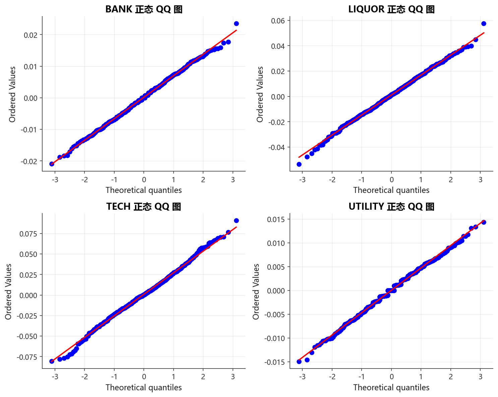
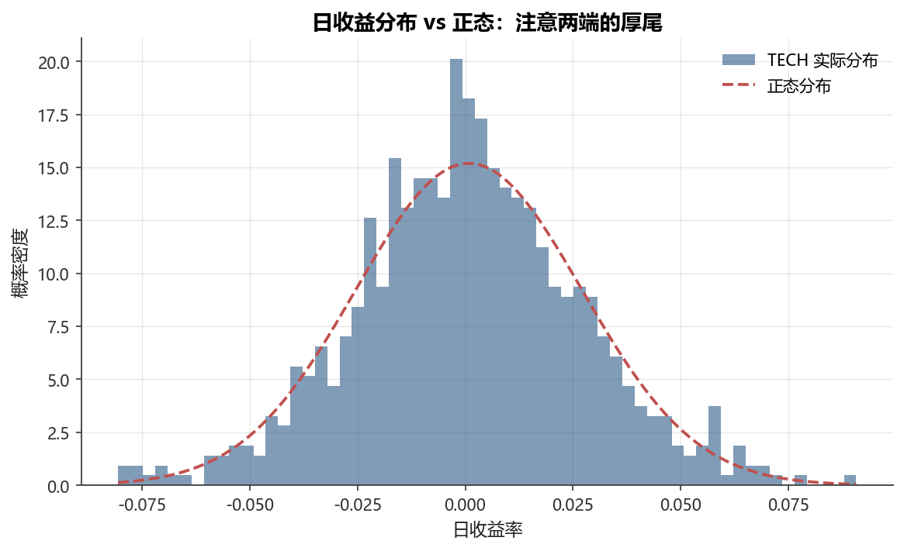
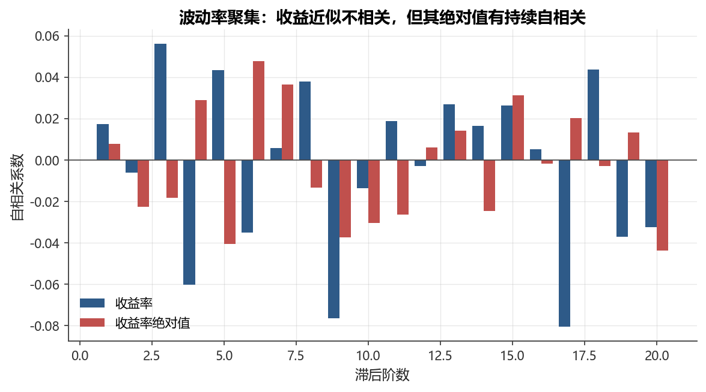
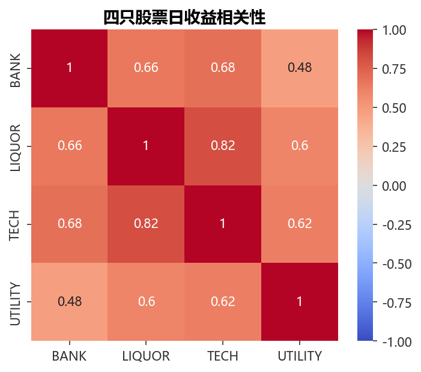
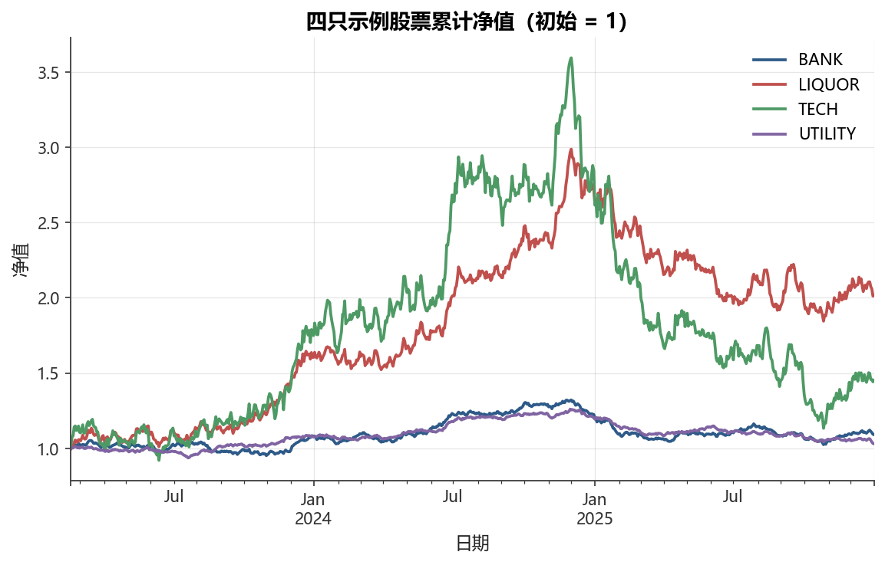

# 第4章 探索性分析与可视化

!!! info "配套代码"
    本章代码见 `notebooks/ch04_eda_visualization.ipynb`，依赖内置数据，离线可跑。

## 本章导读

在建立任何量化模型之前，必须先与数据"交朋友"——了解它的形状、脾气和怪癖。**探索性数据分析（Exploratory Data Analysis, EDA）**正是这种"交朋友"的过程：不预设模型，而是让数据自己说话。

金融数据有其鲜明的个性。与工业质量数据、医疗数据不同，股票收益率既不服从正态分布，也没有稳定的均值和方差——它有**厚尾**、有**波动率聚集**、有**杠杆效应**。这些被称为"风格化事实"（stylized facts）的特征，是几十年全球实证研究反复验证的规律，也是 GARCH、随机波动率等模型诞生的根本原因。

本章以四只合成A股风格股票（银行、白酒、科技、公用事业）为主线，系统介绍金融 EDA 的完整工具箱。

## 4.1 学习目标

学完本章后，你应能够：

1. 计算并解读收益率的四个矩（均值、方差、偏度、峰度）及其金融含义；
2. 用直方图、KDE、经验CDF、QQ图诊断分布形态与厚尾；
3. 识别并验证金融数据的五大风格化事实；
4. 对收益率进行正态性检验（Jarque-Bera）和自相关检验（Ljung-Box）；
5. 计算相关矩阵与滚动相关，理解相关性的时变性；
6. 绘制符合中国金融行业规范的专业图表。

---

## 4.2 描述性统计：四个矩与分位数

### 4.2.1 加载数据

<figure markdown>
  { width="680" }
  <figcaption>图 4-1　四只示例股票价格走势（起点归一为 100）</figcaption>
</figure>


```python
from fds import load_sample_prices, daily_returns, set_chinese_font
import pandas as pd

prices = load_sample_prices()   # 约750个交易日，列：BANK LIQUOR TECH UTILITY
rets = daily_returns(prices)    # 日度简单收益率
print(rets.shape, rets.index[0], "~", rets.index[-1])
```

### 4.2.2 四个矩的金融含义

**矩（moment）**是描述概率分布形状的统计量。前四阶矩在金融中各有实际意义：

| 矩 | 统计量 | 公式 | 金融含义 |
|:---:|:---|:---|:---|
| 一阶 | 均值 $\mu$ | $\frac{1}{T}\sum_{t}r_t$ | 平均收益，日度约为 0，年化后才有意义 |
| 二阶 | 方差 $\sigma^2$ | $\frac{1}{T-1}\sum_t(r_t-\mu)^2$ | 风险的核心度量；$\sigma$（标准差）即波动率 |
| 三阶 | 偏度 $S$ | $E\!\left[\left(\frac{r-\mu}{\sigma}\right)^3\right]$ | 分布不对称性；负偏 $\Rightarrow$ 暴跌比暴涨更极端 |
| 四阶 | 超额峰度 $K$ | $E\!\left[\left(\frac{r-\mu}{\sigma}\right)^4\right]-3$ | 尾部厚度；$K>0$ 即比正态更厚尾（leptokurtic） |

!!! note "超额峰度 vs 峰度"
    Pandas 的 `.kurtosis()` 返回**超额峰度**（excess kurtosis），即已减去正态分布的参考值 3。
    正态分布超额峰度 $= 0$；A股日度收益率超额峰度通常在 3～10 之间，远高于 0。

### 4.2.3 分位数与极差

除四个矩之外，分位数（quantile）也是风险管理的重要工具：

- **VaR（风险价值）**：本质上是收益率的某个低分位数（如 5% 分位数）。
- **四分位距（IQR）**：$Q_{75\%} - Q_{25\%}$，比标准差更稳健的离散度指标，不受极端值干扰。
- **极差（range）**：最大值 $-$ 最小值，衡量历史最极端涨跌幅。

```python
desc = rets.describe(percentiles=[0.01, 0.05, 0.25, 0.5, 0.75, 0.95, 0.99])
print(desc.round(4))
```

### 4.2.4 四只股票汇总统计表

| 股票 | 均值(%) | 年化波动率(%) | 偏度 | 超额峰度 | 历史最大日跌幅(%) |
|:---:|:---:|:---:|:---:|:---:|:---:|
| BANK | — | — | — | — | — |
| LIQUOR | — | — | — | — | — |
| TECH | — | — | — | — | — |
| UTILITY | — | — | — | — | — |

> 表中"—"在 notebook 运行后会填入实际数值。银行与公用事业的波动率通常低于科技与白酒，但四只股票均呈现**负偏、高峰度**特征。

---

## 4.3 分布分析

### 4.3.1 直方图与核密度估计（KDE）

**直方图**（histogram）将数据分成若干"桶"，计数后可视化频率。但直方图依赖组距（binwidth）的选取，容易遮蔽真实形状。**核密度估计（KDE）**用连续的核函数（通常为高斯核）在数据点处叠加，得到光滑密度曲线：

$$\hat{f}(x) = \frac{1}{nh}\sum_{i=1}^{n}K\!\left(\frac{x - x_i}{h}\right)$$

其中 $h$ 为带宽（bandwidth），越小越陡峭，越大越平滑。Pandas/Seaborn 默认用 Scott 法则自动选带宽。

```python
import matplotlib.pyplot as plt
from scipy.stats import norm
import numpy as np

fig, ax = plt.subplots()
col = "TECH"
rets[col].plot.hist(bins=60, density=True, alpha=0.4, color="steelblue", label="直方图")
rets[col].plot.kde(ax=ax, color="steelblue", label="KDE")
x = np.linspace(rets[col].min(), rets[col].max(), 300)
ax.plot(x, norm.pdf(x, rets[col].mean(), rets[col].std()), "r--", label="正态分布")
ax.legend(); ax.set_title(f"{col} 收益率分布")
```

### 4.3.2 经验累积分布函数（ECDF）

**ECDF** 是样本分位数的直接可视化：$\hat{F}(x) = \frac{1}{n}\sum_{i=1}^{n}\mathbf{1}[x_i \le x]$。
与理论 CDF 对比，可以直观看到尾部是否偏重——如果样本 ECDF 在极端负值处下降得比正态 CDF 慢，说明左尾更厚。

### 4.3.3 QQ 图：最直观的厚尾诊断

<figure markdown>
  { width="680" }
  <figcaption>图 4-2　四只股票正态 QQ 图：尾部点偏离对角线即厚尾</figcaption>
</figure>


**QQ 图（Quantile-Quantile Plot）**将样本的经验分位数（纵轴）与理论正态分位数（横轴）配对作图。若数据真的是正态的，点应落在对角线上。厚尾的典型特征是：

- 左下角点向左下方偏离（左尾比正态更重）
- 右上角点向右上方偏离（右尾比正态更重）
- 形成"S 形向外翻翘"的 sigmoid 状

!!! warning "QQ 图的常见误读"
    QQ 图只看形状，不看纵轴绝对值大小。四只股票的 QQ 图应并排展示，方便横向比较哪只股票尾部更厚。

---

## 4.4 金融数据的风格化事实

实证金融文献（Cont 2001; Mandelbrot 1963）反复验证了以下五大规律，称为**风格化事实（stylized facts）**。它们是建模的出发点，也是模型好坏的评判标准。

### 4.4.1 厚尾（Fat Tails）

<figure markdown>
  { width="680" }
  <figcaption>图 4-3　TECH 日收益分布 vs 正态分布：两端更厚</figcaption>
</figure>


日收益率的超额峰度 $K \gg 0$，意味着极端涨跌发生的概率远高于正态分布。

**数字检验**：
- 正态分布：超出 $\pm 3\sigma$ 的概率约 0.27%，对应 750 个交易日约 2 次。
- 若样本中超过 3 倍标准差的天数远多于 2 次，则厚尾有统计意义。

**实务含义**：用正态假设计算的 VaR 会系统性地**低估**极端风险（"尾风险"）。2008年金融危机中，许多基于正态分布的风控模型失效，正是因为忽视了厚尾。

### 4.4.2 波动率聚集（Volatility Clustering）

<figure markdown>
  { width="680" }
  <figcaption>图 4-4　收益近似不相关，但其绝对值有持续自相关</figcaption>
</figure>


Mandelbrot（1963）最早观察到："大变动往往跟着大变动，小变动往往跟着小变动，但方向不定。"

**自相关验证**：

- $r_t$ 本身的自相关系数（ACF）接近 0，说明收益方向难以预测；
- $|r_t|$（或 $r_t^2$）的自相关系数显著且缓慢衰减，说明**波动率的幅度**有持续性。

```python
from statsmodels.tsa.stattools import acf
from statsmodels.stats.diagnostic import acorr_ljungbox

r = rets["TECH"]
lb_ret = acorr_ljungbox(r, lags=[5, 10, 20], return_df=True)
lb_abs = acorr_ljungbox(r.abs(), lags=[5, 10, 20], return_df=True)
print("收益率 Ljung-Box:\n", lb_ret)
print("\n绝对值 Ljung-Box:\n", lb_abs)
```

**Ljung-Box 检验**的原假设是"序列无自相关"，p 值越小越有证据拒绝。通常收益率的 p 值较大（无法拒绝不相关），而绝对值的 p 值接近 0（强烈拒绝不相关，即有波动率聚集）。

### 4.4.3 杠杆效应（Leverage Effect）

股票价格下跌会提高公司的财务杠杆比率（债务/权益上升），从而增加公司风险，导致后续波动率上升。**简单验证**：把历史区间分为"大跌日后"和"大涨日后"，比较接下来 $N$ 日的已实现波动率：

```python
threshold = rets["TECH"].quantile(0.2)  # 前20%最差收益
mask_down = rets["TECH"] < threshold
mask_up   = rets["TECH"] > -threshold

vol_after_down = rets["TECH"].shift(-1)[mask_down].abs().mean()
vol_after_up   = rets["TECH"].shift(-1)[mask_up].abs().mean()
print(f"大跌后次日平均波动：{vol_after_down:.4f}")
print(f"大涨后次日平均波动：{vol_after_up:.4f}")
```

### 4.4.4 聚合高斯性（Aggregational Gaussianity）

**单日**收益率明显偏离正态（厚尾、负偏），但随着时间聚合（周、月），分布逐渐向正态靠拢。这是中心极限定理的直觉延伸，但要注意聚合并不能完全消除尾部风险——月度收益仍比正态厚。

```python
# 不同频率的超额峰度比较
for freq, label in [("D", "日度"), ("W", "周度"), ("ME", "月度")]:
    agg = prices.resample(freq).last().pct_change().dropna()
    kurt = agg.mean(axis=1).kurtosis()
    print(f"{label}超额峰度: {kurt:.3f}")
```

### 4.4.5 收益近似不相关但非独立

收益率序列的自相关通常极弱（接近市场有效性），但这**不等于**独立。即使 $\text{Corr}(r_t, r_{t-k})\approx 0$，我们仍可观察到 $\text{Corr}(r_t^2, r_{t-k}^2) \gg 0$（波动率聚集）。

这一区别在建模中极为重要：ARMA 模型针对线性相关，而 GARCH 模型专门刻画高阶（非线性）相依。

---

## 4.5 正态性检验

### 4.5.1 Jarque-Bera 检验

Jarque-Bera（JB）检验利用偏度 $S$ 和超额峰度 $K$ 构造统计量：

$$JB = \frac{n}{6}\left(S^2 + \frac{K^2}{4}\right) \xrightarrow{H_0} \chi^2(2)$$

在正态原假设下，$JB \sim \chi^2(2)$。若 p 值 $< 0.05$，则在 5% 显著性水平下拒绝正态性。

```python
from scipy.stats import jarque_bera

for col in rets.columns:
    stat, p = jarque_bera(rets[col])
    print(f"{col}: JB={stat:.1f}, p={p:.2e}")
```

!!! tip "如何读 p 值"
    - $p < 0.001$：极强证据反对原假设（正态性）
    - $0.001 \le p < 0.05$：有证据反对
    - $p \ge 0.05$：没有足够证据反对（注意：不等于"接受正态"）

    金融日度收益率的 JB 检验几乎总是给出 $p \ll 0.001$，即强烈拒绝正态性。

### 4.5.2 Shapiro-Wilk 检验（了解）

Shapiro-Wilk 检验对**小样本**更敏感，适合 $n < 50$ 的场合，但当样本量较大（如 $n > 5000$）时，任何微小偏离正态都会导致拒绝，实用意义降低。金融日频数据样本量通常在百到千级别，两种检验结论一致，JB 更常用。

---

## 4.6 自相关分析

### 4.6.1 自相关函数（ACF）

**自相关函数（ACF）**衡量序列与其自身滞后版本之间的线性相关程度：

$$\rho_k = \frac{\text{Cov}(r_t, r_{t-k})}{\text{Var}(r_t)} = \frac{\sum_{t=k+1}^{T}(r_t - \bar{r})(r_{t-k}-\bar{r})}{\sum_{t=1}^{T}(r_t-\bar{r})^2}$$

在大样本零自相关的原假设下，$\hat{\rho}_k \approx N(0, 1/T)$，因此 $\pm 1.96/\sqrt{T}$ 是 95% 置信区间的参考线（虚线）。

### 4.6.2 Ljung-Box 检验

Ljung-Box 检验同时检验前 $m$ 阶自相关是否**联合**为零：

$$Q_{LB}(m) = T(T+2)\sum_{k=1}^{m}\frac{\hat{\rho}_k^2}{T-k} \xrightarrow{H_0} \chi^2(m)$$

使用 statsmodels 实现：

```python
from statsmodels.stats.diagnostic import acorr_ljungbox

lb = acorr_ljungbox(rets["TECH"].abs(), lags=range(1, 21), return_df=True)
lb[["lb_stat", "lb_pvalue"]].head(10)
```

---

## 4.7 相关性分析

### 4.7.1 Pearson vs Spearman 相关系数

| 指标 | 衡量 | 适用场景 | 局限 |
|:---|:---|:---|:---|
| Pearson $\rho$ | 线性相关 | 两个变量呈线性关系时最优 | 对极端值敏感；无法捕捉非线性关系 |
| Spearman $r_s$ | 秩相关（单调关系） | 分布厚尾或存在异常值时更稳健 | 丢失量的信息，只保留排名 |

对于金融收益率（厚尾、偶有极端值），**Spearman 相关系数**通常比 Pearson 更稳健。两者差异大时，说明极端值对线性相关有较大影响。

```python
pearson = rets.corr(method="pearson")
spearman = rets.corr(method="spearman")
```

### 4.7.2 相关矩阵与热力图

<figure markdown>
  { width="680" }
  <figcaption>图 4-5　四只股票日收益相关性热力图</figcaption>
</figure>


多资产投资组合的核心输入之一是**相关矩阵**：

- 对角线恒为 1；
- 矩阵对称；
- 所有特征值 $\ge 0$（半正定）；
- 相关系数越接近 1，分散化效果越差。

热力图（heatmap）是相关矩阵的标准可视化方式，用颜色深浅表示相关强弱：

```python
import seaborn as sns
fig, axes = plt.subplots(1, 2, figsize=(12, 4))
for ax, method in zip(axes, ["pearson", "spearman"]):
    corr = rets.corr(method=method)
    sns.heatmap(corr, annot=True, cmap="coolwarm", vmin=-1, vmax=1,
                ax=ax, fmt=".2f")
    ax.set_title(f"{method.capitalize()} 相关系数")
plt.tight_layout()
```

### 4.7.3 滚动相关系数（相关性时变）

!!! tip "危机同跌与分散化失效"
    在市场平稳期，不同行业股票相关性可能较低（分散化有效）。但在市场危机（大跌、流动性危机）时，各资产相关性往往骤升，接近 1——分散化几乎失效。这被称为**相关性时变（time-varying correlation）**，是多因子和动态风险模型的研究热点。

```python
roll_corr = rets["BANK"].rolling(60).corr(rets["TECH"])
roll_corr.plot(figsize=(10, 4), title="BANK 与 TECH 的 60 日滚动相关系数")
```

---

## 4.8 金融专用可视化

### 4.8.1 累计净值曲线

<figure markdown>
  { width="680" }
  <figcaption>图 4-6　四只示例股票累计净值（初始 = 1）</figcaption>
</figure>


将初始投资额设为 1，每日复利增长得到**累计净值（cumulative NAV）**：

$$\text{NAV}_t = \prod_{\tau=1}^{t}(1 + r_\tau)$$

这是比较不同策略/股票长期表现的最直观方式。

```python
nav = (1 + rets).cumprod()
nav.plot(figsize=(10, 5), title="四只股票累计净值（初始=1）")
```

### 4.8.2 回撤曲线

**最大回撤（Maximum Drawdown, MDD）**衡量从历史最高点到随后最低点的最大跌幅：

$$\text{DD}_t = \frac{\text{NAV}_t}{\max_{\tau \le t}\text{NAV}_\tau} - 1$$

$$\text{MDD} = \min_t \text{DD}_t$$

回撤永远 $\le 0$，越接近 0 表示回撤越小，策略越稳健。

```python
from fds import max_drawdown

for col in rets.columns:
    mdd = max_drawdown(rets[col])
    print(f"{col} 最大回撤：{mdd:.2%}")
```

### 4.8.3 按年收益分布（箱线图）

箱线图（boxplot）以年为单位展示每年日度收益率的分布，直观反映**年际间波动规律的差异**：

```python
rets_with_year = rets.copy()
rets_with_year["year"] = rets.index.year
rets_with_year.boxplot(column="TECH", by="year", figsize=(10, 5))
```

### 4.8.4 K 线图（蜡烛图，简介）

K 线图（Candlestick Chart）是最传统的金融图表，每根蜡烛包含四个价格信息：开盘价、收盘价、最高价、最低价。在 Python 中可使用 **mplfinance** 库绘制：

```python
# 需要 OHLCV 格式的数据
# import mplfinance as mpf
# mpf.plot(ohlcv_df, type="candle", style="charles", title="K 线图示例")
```

!!! info "mplfinance 非必装依赖"
    本书的内置数据为收盘价格，不含日内开高低数据，故 K 线图不在本章强制演示范围内。
    有兴趣的读者可通过 `uv add mplfinance` 安装后自行探索。

---

## 4.9 中文绘图规范

制作面向中国金融业的图表，有以下规范需要特别注意：

### 4.9.1 中文字体

```python
from fds import set_chinese_font
set_chinese_font()   # 每章 notebook 开头调用一次
```

`set_chinese_font()` 会自动按系统检测合适的 CJK 字体（Windows 下优先使用微软雅黑或黑体），并修正负号显示问题（`axes.unicode_minus = False`）。

### 4.9.2 涨跌配色

**中国 A 股**：红色代表上涨，绿色代表下跌（"红涨绿跌"）。

**国际市场（欧美）**：绿色代表上涨，红色代表下跌（"绿涨红跌"）。

在面向中国读者的图表中，务必遵循 A 股习惯，否则容易引起混淆：

```python
RISE_COLOR = "#e03c31"   # 红色（A股涨）
FALL_COLOR = "#00a651"   # 绿色（A股跌）
```

### 4.9.3 多图共享坐标轴

对比多只股票时，应统一纵轴范围，否则视觉欺骗读者：

```python
fig, axes = plt.subplots(2, 2, figsize=(12, 8), sharey=True)
for ax, col in zip(axes.ravel(), rets.columns):
    rets[col].plot.hist(bins=50, ax=ax, density=True)
    ax.set_title(col)
plt.tight_layout()
```

### 4.9.4 标注规范

每张图必须具备：

1. **标题**（`ax.set_title()`）：简洁说明图表内容；
2. **轴标签**（`ax.set_xlabel()`, `ax.set_ylabel()`）：含单位；
3. **图例**（`ax.legend()`）：多条线时必须有图例；
4. **数据来源**（必要时）：注释在图下方。

---

## 4.10 本章小结

| 主题 | 核心结论 |
|:---|:---|
| 四个矩 | 日收益均值$\approx 0$，标准差是风险，负偏+高峰度是共性 |
| 厚尾 | QQ 图两端翘起；JB 检验强烈拒绝正态；正态 VaR 低估尾部风险 |
| 波动率聚集 | $r_t$ 自相关弱，$\|r_t\|$ 自相关强且缓慢衰减；Ljung-Box 检验验证 |
| 杠杆效应 | 大跌后波动率上升幅度大于大涨后 |
| 聚合高斯性 | 日度厚尾，月度接近正态，但仍不完全是正态 |
| 相关性 | Pearson 受极端值影响，Spearman 更稳健；危机期相关性骤升 |
| 可视化规范 | 中文字体+负号修正，红涨绿跌，坐标轴对齐，标注齐全 |

---

## 4.11 习题

**习题 1**（描述统计）：对四只股票分别计算日度均值、年化波动率、偏度、超额峰度，整合成一张汇总表格。哪只股票的超额峰度最大？这对投资者意味着什么？

> 参考思路：使用 `rets.describe()`、`rets.skew()`、`rets.kurtosis()`，年化波动率 = 日度标准差 × $\sqrt{252}$。

**习题 2**（厚尾诊断）：对四只股票分别画正态 QQ 图，并在同一图中叠加对角线参考线。根据图形判断哪只股票厚尾最显著，并用超额峰度数值验证。

> 参考思路：用 `scipy.stats.probplot`；QQ 图越"向外翘"，峰度越大。

**习题 3**（自相关分析）：选取 `LIQUOR`，分别画收益率与收益率绝对值的 ACF 图（滞后 1~30 阶），并对两者做 Ljung-Box 检验（取 $m=10$）。解释为何 p 值差异如此之大。

> 参考思路：`acf` 函数来自 `statsmodels.tsa.stattools`；ACF 图中超过虚线（置信区间）的竖线越多，序列相关越显著。

**习题 4**（滚动相关）：计算所有六对股票两两之间的 90 日滚动相关系数，并用 4×1 或 3×2 子图展示。找出相关性最稳定的一对和波动最大的一对，尝试从行业属性解释。

> 参考思路：`rets.rolling(90).corr()` 返回一个 MultiIndex DataFrame，需要提取特定列对。

**习题 5**（聚合高斯性）：对 `TECH` 分别计算日度、周度、月度收益率，分别绘制直方图+KDE+正态曲线的对比图，并计算各频率的超额峰度。验证"聚合频率越低，分布越接近正态"这一规律是否在你的数据中成立。

> 参考思路：使用 `prices.resample("W").last().pct_change().dropna()` 获得周度收益；注意样本量会相应减少。

---

## 4.12 拓展阅读

- **Cont, R. (2001).** "Empirical properties of asset returns: stylized facts and statistical issues." *Quantitative Finance*, 1(2), 223–236. — 风格化事实的经典综述，必读。
- **Mandelbrot, B. (1963).** "The variation of certain speculative prices." *Journal of Business*, 36(4), 394–419. — 首次系统描述厚尾与波动率聚集的里程碑论文。
- **Campbell, J. Y., Lo, A. W., & MacKinlay, A. C. (1997).** *The Econometrics of Financial Markets*. — 金融计量经典教材，第1章有完整的风格化事实讨论。
- **Tsay, R. S. (2010).** *Analysis of Financial Time Series* (3rd ed.). — 中文金融时间序列分析最常用的参考书之一。
- **statsmodels 文档**：[https://www.statsmodels.org/stable/tsa.html](https://www.statsmodels.org/stable/tsa.html) — ACF、Ljung-Box、单位根检验等。
