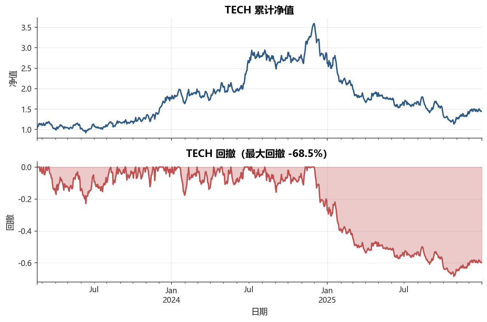
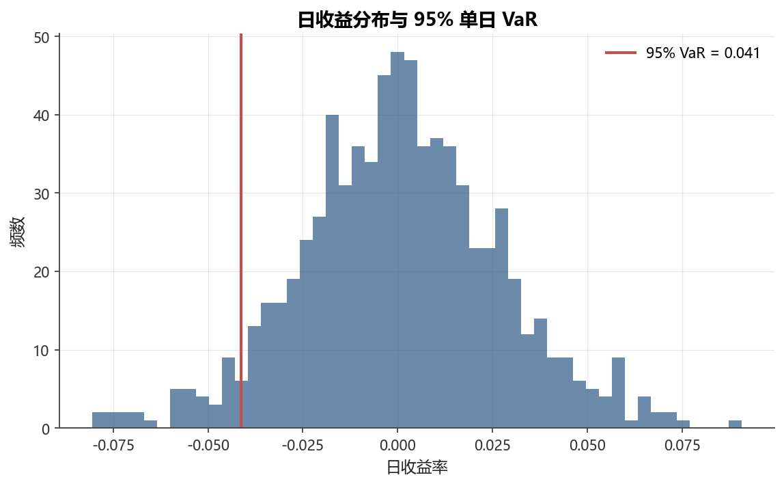

# 第5章 收益率与风险度量

[](https://colab.research.google.com/github/albertandking/financial-data-science/blob/main/notebooks/ch05_returns_risk.ipynb) [](https://mybinder.org/v2/gh/albertandking/financial-data-science/main?labpath=notebooks/ch05_returns_risk.ipynb)

!!! info "配套代码"
    本章代码见 `notebooks/ch05_returns_risk.ipynb`，依赖内置数据，离线可跑。
    大量复用 `fds.metrics` 中的函数；VaR/ES/索提诺等指标在 notebook 中自行实现。

## 5.1 本章导读与学习目标

**为什么收益率与风险度量是金融数据科学的起点？**

投资组合的核心问题是：用多少风险换来多少收益？要回答这个问题，必须先对“收益”和“风险”给出精确的数学定义。本章从最基础的收益率定义出发，逐步构建一套完整的风险度量体系——从经典的波动率，到面向下行的半方差与索提诺比率，再到监管实践中的 VaR 与 ES。

!!! abstract "学习目标"
    学完本章，你应能：

    1. 区分**简单收益率**与**对数收益率**，推导多期复合公式，理解各自的可加性与适用场景
    2. 掌握从日度到年度的**年化换算**，理解“252 个交易日”的来源与方差线性增长假设
    3. 计算收益分布的四个矩（均值、方差、偏度、峰度），理解其风险含义
    4. 实现**波动率、下行标准差、半方差、夏普、索提诺、卡尔玛**比率
    5. 定义并计算**回撤与最大回撤（MDD）**，绘制“水下曲线”
    6. 用**历史模拟法、正态参数法、蒙特卡洛法**三种方式计算 VaR 与 ES
    7. 解释为何厚尾会导致正态参数法低估 VaR，理解 ES 相对 VaR 的优越性
    8. 对 A 股风格资产（银行、白酒、科技、公用事业）做全套风险收益分析

---

## 5.2 两种收益率

### 5.2.1 基本定义

设 $P_t$ 为第 $t$ 期（例如某一交易日收盘）价格。

**简单收益率**（算术收益率）定义为：

$$r_t = \frac{P_t - P_{t-1}}{P_{t-1}} = \frac{P_t}{P_{t-1}} - 1$$

**对数收益率**（连续复利收益率）定义为：

$$\ell_t = \ln\frac{P_t}{P_{t-1}} = \ln P_t - \ln P_{t-1}$$

两者关系：$\ell_t = \ln(1 + r_t)$，因此 $r_t = e^{\ell_t} - 1$。

### 5.2.2 多期复合：推导两种可加性

**简单收益率的多期复合**（时间上需要连乘，不可直接相加）：

设第 $1$ 到 $T$ 期的简单收益率依次为 $r_1, r_2, \ldots, r_T$，则持有 $T$ 期的总简单收益率为：

$$1 + R_{1:T} = (1+r_1)(1+r_2)\cdots(1+r_T) = \prod_{t=1}^{T}(1+r_t)$$

**对数收益率的多期复合**（时间上可直接相加）：

$$L_{1:T} = \ln\frac{P_T}{P_0} = \sum_{t=1}^{T}\ln\frac{P_t}{P_{t-1}} = \sum_{t=1}^{T}\ell_t$$

这是对数收益率的最大优点——**时间可加性**。多期对数收益率直接求和即可，大大简化了时间序列建模。

**截面可加性**（组合层面）：

设组合由 $n$ 只资产构成，权重为 $w_i$（$\sum w_i = 1$）。则：

- 组合简单收益率：$r_p = \sum_{i=1}^{n} w_i r_i$（成立，因为 $\sum w_i (P_{i,t}/P_{i,t-1}-1)$ 恰好等于加权平均）
- 组合对数收益率：$\ell_p \neq \sum w_i \ell_i$（一般**不成立**，因为 $\ln$ 不是线性函数）

!!! tip "两种收益率的选择原则"
    | 场景 | 推荐 | 理由 |
    |---|---|---|
    | 组合绩效归因 | 简单收益率 | $r_p=\sum w_i r_i$ 成立，与实务一致 |
    | 多期持有期计算 | 简单收益率 | 终值 $= P_0 \prod(1+r_t)$ 直接体现财富变化 |
    | 时间序列建模（GARCH等） | 对数收益率 | 时间可加，统计性质好，近似正态 |
    | 因子模型回归 | 对数收益率 | 序列平稳性更好，误差项更接近正态 |

### 5.2.3 小变动近似

当 $|r_t|$ 很小时（日收益率通常 $< 3\%$），泰勒展开给出：

$$\ell_t = \ln(1+r_t) \approx r_t - \frac{r_t^2}{2} \approx r_t$$

即两种收益率近似相等。A 股日收益率绝对值均值通常在 1%–2%，因此二者差异可忽略，但在计算月度或年度收益时，差异会显著放大，不可混用。

```python
from fds import daily_returns
simple = daily_returns(prices)            # 简单收益率
log_ret = daily_returns(prices, log=True) # 对数收益率

# 验证差异（日度级别极小）
diff = (simple - log_ret).abs().mean()
print("日均绝对差异：", diff.round(6))
```

---

## 5.3 年化换算

### 5.3.1 为什么要年化

日度收益率约为 0.05%，年度收益率约为 10%——两个数字相差 200 倍，直接比较毫无意义。年化换算将不同时间频率的统计量转换到统一的“年”尺度，是跨资产、跨策略比较的前提。

### 5.3.2 为什么是 252 个交易日

A 股全年 365 天，去掉约 115 个周末（52×2+11）和约 11 个法定节假日（元旦、春节、清明、劳动节、端午、中秋、国庆等约 11 天），剩余约 **252 个交易日**。这是行业惯例，各国市场略有差异（美股也是 252，港股约 245）。

!!! note "注意"
    实际交易日数会因调休而在 249–253 之间波动，大多数场合直接用 252。

### 5.3.3 收益的年化：几何复合

设日均简单收益率为 $\bar{r}$，则年化收益率为（几何复合）：

$$r_{\text{年}} = (1+\bar{r})^{252} - 1$$

不能用算术平均 $252\bar{r}$，因为收益率的复利增长是乘法而非加法。

**推导**：若每日收益率恒为 $\bar{r}$，则 252 天后财富变为 $P_0(1+\bar{r})^{252}$，年化收益率定义为使初始本金在一年后达到同等财富所需的固定年化利率，即 $(1+\bar{r})^{252} - 1$。

### 5.3.4 波动率的年化：$\sqrt{T}$ 法则

**推导（iid 假设下）**：设日收益率 $r_1, r_2, \ldots, r_{252}$ 独立同分布，方差均为 $\sigma_{\text{日}}^2$。则年度收益（对数）$L = \sum r_t$ 的方差为：

$$\text{Var}(L) = \sum_{t=1}^{252} \text{Var}(r_t) = 252\,\sigma_{\text{日}}^2$$

取标准差得：

$$\sigma_{\text{年}} = \sigma_{\text{日}} \times \sqrt{252}$$

这就是波动率的 $\sqrt{T}$ 缩放公式。前提是：**日收益率独立同分布**（iid）。

!!! warning "iid 假设的局限"
    实际金融收益率并非严格 iid：
    - **波动率聚集**（ARCH/GARCH效应）：大波动往往跟随大波动
    - **均值回归**：短期动量与长期均值回归使方差非线性增长
    - 在这些情形下，$\sqrt{T}$ 法则会失效，需用更复杂模型（见第9章）

```python
from fds import annualized_return, annualized_volatility
ann_ret = annualized_return(rets)
ann_vol = annualized_volatility(rets)
print(ann_ret.round(4))
print(ann_vol.round(4))
```

---

## 5.4 收益分布的矩与风险

对收益率分布的完整描述需要四个矩，每个矩都有其风险含义：

| 矩 | 公式 | 风险含义 |
|---|---|---|
| 均值（一阶矩） | $\mu = E[r]$ | 期望收益，越高越好 |
| 方差（二阶中心矩） | $\sigma^2 = E[(r-\mu)^2]$ | 整体波动，含上行与下行 |
| 偏度（三阶标准化矩） | $S = E\left[\left(\frac{r-\mu}{\sigma}\right)^3\right]$ | 负偏度（左偏）意味着极端亏损更可能 |
| 峰度（四阶标准化矩） | $K = E\left[\left(\frac{r-\mu}{\sigma}\right)^4\right]$ | 超额峰度 $K-3>0$ 说明厚尾，极端事件更频繁 |

!!! info "A 股收益分布的典型特征"
    实证研究一致发现：A 股日收益率呈**左偏、厚尾**分布（超额峰度通常在 2–8 之间）。
    这意味着正态分布会**严重低估**极端损失的概率，VaR/ES 的参数法结果需谨慎对待。

---

## 5.5 风险度量全家桶

<figure markdown>
  { width="680" }
  <figcaption>图 5-1　TECH 累计净值与回撤（水下曲线）</figcaption>
</figure>


### 5.5.1 波动率（标准差）

最经典的风险度量，衡量收益率围绕均值的离散程度：

$$\sigma = \sqrt{\frac{1}{T-1}\sum_{t=1}^{T}(r_t - \bar{r})^2}$$

**优点**：计算简单、理论性质好（方差加法定理）、与均方差框架（Markowitz）兼容。

**缺点**：把上行波动（赚钱）与下行波动（亏损）一视同仁，与投资者的真实厌恶不符。

### 5.5.2 下行风险：半方差与下行标准差

**半方差（Semivariance）** 只统计低于目标收益 $\tau$（通常取 0 或无风险利率）的那部分离散度：

$$\text{SV} = \frac{1}{T^-}\sum_{t:\, r_t < \tau}(r_t - \tau)^2$$

其中 $T^- = \#\{t : r_t < \tau\}$ 为亏损期数。

**下行标准差**（Downside Deviation）：

$$\sigma_D = \sqrt{\frac{1}{T}\sum_{t=1}^{T}\min(r_t - \tau,\, 0)^2}$$

注意：此处分母用 $T$（全部时期），便于夏普与索提诺比率的直接比较。

### 5.5.3 风险调整收益比率对比

| 比率 | 公式 | 分母 | 适用场景 |
|---|---|---|---|
| 夏普（Sharpe） | $\dfrac{\bar{r} - r_f}{\sigma}\sqrt{252}$ | 总波动率 | 通用，均值方差框架 |
| 索提诺（Sortino） | $\dfrac{\bar{r} - r_f}{\sigma_D}\sqrt{252}$ | 下行波动率 | 只厌恶下行风险时 |
| 卡尔玛（Calmar） | $\dfrac{r_{\text{年}}}{\lvert\text{MDD}\rvert}$ | 最大回撤（绝对值） | 趋势策略、CTA 评价 |

**直觉对比**：
- 夏普用“总波动”，惩罚所有波动，对“波动大但主要是赚钱”的资产偏苛刻
- 索提诺只看“下行波动”，对上行波动不惩罚，更贴近投资者真实感受
- 卡尔玛关注的是策略在最坏情形下的恢复能力，是 CTA/对冲基金常用指标

```python
# 夏普比率（fds 内置）
from fds import sharpe_ratio
sharpe_ratio(rets, risk_free=0.02)

# 索提诺比率（自行实现）
def sortino_ratio(returns, risk_free=0.0, target=0.0, periods=252):
    excess = returns.mean() - risk_free / periods
    downside = np.sqrt(((np.minimum(returns - target, 0))**2).mean())
    if downside == 0:
        return np.nan
    return excess / downside * np.sqrt(periods)
```

### 5.5.4 回撤与最大回撤（MDD）

**净值**（累计收益曲线）：

$$V_t = V_0 \prod_{s=1}^{t}(1 + r_s)$$

**回撤**：净值相对历史最高点的跌幅：

$$DD_t = \frac{V_t}{\max_{0 \le s \le t} V_s} - 1 \le 0$$

**最大回撤（Maximum Drawdown，MDD）**：整个考察期内最严重的一次回撤：

$$\text{MDD} = \min_{t}\, DD_t = \min_{t}\left(\frac{V_t}{\max_{s\le t} V_s} - 1\right)$$

MDD 以负值返回（如 $-0.35$ 表示最大回撤 35%），绝对值越大，历史风险越高。

“**水下曲线**”（Underwater Curve）是将回撤 $DD_t$ 随时间绘制的图形：
- 曲线在 0 以下时，净值处于历史新高之下，投资者处于“水下”（账面亏损状态）
- 持续时间（回撤持续期）和深度（最大回撤幅度）是两个独立维度

```python
from fds import max_drawdown

# 绘制净值与水下曲线（双子图）
nav = (1 + rets["TECH"]).cumprod()
drawdown = nav / nav.cummax() - 1
print("TECH 最大回撤：", round(max_drawdown(rets["TECH"]) * 100, 2), "%")
```

---

## 5.6 VaR：风险价值

<figure markdown>
  { width="680" }
  <figcaption>图 5-2　日收益分布与 95% 单日 VaR</figcaption>
</figure>


**VaR（Value at Risk，风险价值）** 是金融风险管理中最广泛使用的单一风险指标。

**定义**：在置信水平 $\alpha$（通常取 95% 或 99%）下，未来一期内，损失**超过** VaR 的概率不超过 $1-\alpha$：

$$P(r_t < -\text{VaR}_\alpha) = 1 - \alpha$$

等价地：$\text{VaR}_\alpha = -Q_{1-\alpha}(r)$，即收益率分布的 $(1-\alpha)$ 分位数取负值。

“95% 单日 VaR = 3%” 的解读：在 95% 的置信水平下，明天单日亏损不超过 3%；换言之，有 5% 的可能亏损超过 3%。

### 5.6.1 历史模拟法

直接使用历史收益率的经验分布，不对分布做任何参数假设：

$$\widehat{\text{VaR}}_\alpha^{\text{hist}} = -Q_{1-\alpha}^{\text{emp}}(r)$$

即将历史收益率从小到大排序，取第 $(1-\alpha)$ 分位数的相反数。

$$\text{公式}：\widehat{\text{VaR}}_{0.95}^{\text{hist}} = -\text{Quantile}(r, 5\%)$$

**优点**：无分布假设，自动捕捉厚尾与非对称性。
**缺点**：依赖样本量；历史不一定代表未来；对极端事件估计不稳定。

### 5.6.2 参数法（正态假设）

假设收益率 $r \sim N(\mu, \sigma^2)$，则：

$$\text{VaR}_\alpha^{\text{norm}} = -(\mu + z_\alpha \sigma)$$

其中 $z_\alpha = \Phi^{-1}(1-\alpha)$ 为标准正态分位数（95% 时 $z_{0.95} = -1.645$）：

$$\text{VaR}_{0.95}^{\text{norm}} = -(\mu - 1.645\,\sigma)$$

**优点**：计算简便，有解析解。
**缺点**：正态假设与金融现实不符（收益率厚尾），**系统性低估**极端损失概率。

### 5.6.3 蒙特卡洛法

从拟合的分布中模拟大量情景，取经验分位数：

1. 用历史数据估计分布参数 $(\hat{\mu}, \hat{\sigma})$
2. 用随机数生成器模拟 $N$（如 100 万）个收益率样本
3. 取 $(1-\alpha)$ 分位数取负值

$$\widehat{\text{VaR}}_\alpha^{\text{MC}} = -Q_{1-\alpha}\!\left(\{r^{(1)}, \ldots, r^{(N)}\}\right), \quad r^{(i)} \sim N(\hat\mu, \hat\sigma^2)$$

**优点**：灵活，可引入任意分布（如 $t$ 分布）和相关结构。
**缺点**：计算量大；结果取决于所假设的分布形式。

```python
import numpy as np
from scipy.stats import norm

def compute_var_es(series, alpha=0.95):
    """返回 (历史VaR, 参数VaR, 历史ES, 参数ES)"""
    mu, sigma = series.mean(), series.std(ddof=1)
    # 历史模拟
    q = np.quantile(series, 1 - alpha)
    hist_var = -q
    hist_es = -series[series <= q].mean()
    # 正态参数法
    z = norm.ppf(1 - alpha)
    norm_var = -(mu + z * sigma)
    norm_es = -(mu - sigma * norm.pdf(z) / (1 - alpha))
    return hist_var, norm_var, hist_es, norm_es
```

---

## 5.7 ES：期望损失（CVaR）

**期望损失（Expected Shortfall，ES）**，又称**条件风险价值（CVaR, Conditional VaR）** 或**尾期望损失（Tail Loss）**，是 VaR 的重要改进：

$$\text{ES}_\alpha = -E\bigl[r \,\big|\, r \le -\text{VaR}_\alpha\bigr]$$

即：**给定损失超过了 VaR，平均会亏多少**。ES 是超过 VaR 阈值的那部分尾部损失的期望值。

**正态假设下 ES 的解析公式**：

$$\text{ES}_\alpha^{\text{norm}} = -\mu + \sigma \cdot \frac{\phi(z_{1-\alpha})}{1-\alpha}$$

其中 $\phi(\cdot)$ 为标准正态密度函数，$z_{1-\alpha} = \Phi^{-1}(1-\alpha)$。

### 5.7.1 ES 为何优于 VaR

| 性质 | VaR | ES |
|---|---|---|
| 告知“最大损失门槛” | ✓ | ✓ |
| 告知“超过门槛后平均亏多少” | ✗ | ✓ |
| **次可加性**（分散化有益） | ✗ 一般不满足 | ✓ 满足 |
| 对尾部形状敏感 | ✗ | ✓ |
| 巴塞尔协议 III/IV 要求 | 被 ES 替代 | ✓ 采用 |

**次可加性**是关键：对于两个资产组合，若 $ES(A+B) \le ES(A) + ES(B)$ 总成立，则分散化被激励（合并比单独持有更安全）。VaR 不满足次可加性，可能出现“分散化反而让资本要求增加”的悖论。

!!! warning "VaR 的局限——一个直觉例子"
    某策略的 95% VaR = 2%。但超过这个门槛后，平均亏损 20% 还是 2.1%？
    VaR 什么都不告诉你。ES 则精确回答“尾部平均损失”，在极端情形下更有用。

---

## 5.8 Beta：系统性风险简介

**Beta（$\beta$）** 度量资产相对于市场组合的**系统性风险**（无法通过分散化消除的风险）：

$$\beta_i = \frac{\text{Cov}(r_i, r_m)}{\text{Var}(r_m)}$$

其中 $r_m$ 为市场收益率（如沪深300指数）。

| $\beta$ 值 | 含义 |
|---|---|
| $\beta > 1$ | 比市场更激进，同涨幅大于市场，同跌幅也大于市场 |
| $\beta = 1$ | 与市场同步，无超额风险 |
| $0 < \beta < 1$ | 比市场温和，如防御性行业（公用事业） |
| $\beta < 0$ | 与市场负相关，可对冲市场下跌 |

!!! info "预告：第7章 CAPM"
    本节仅作引入。第7章将基于 CAPM 框架详细讨论 $\beta$ 的估计、解释与应用：
    $E[r_i] = r_f + \beta_i(E[r_m] - r_f)$。

---

## 5.9 厚尾对风险度量的影响

第4章已验证金融收益率呈现显著厚尾（超额峰度 $> 0$）。这对风险度量有直接影响：

**正态假设下 VaR/ES 的低估**：

正态分布的尾部概率以指数速度衰减，而真实收益率分布的尾部更“重”。这导致：
- 正态参数法 VaR 通常低于历史模拟法 VaR
- 差距在高置信水平（99%、99.9%）时更大
- 对极端事件（如“黑天鹅”）的风险完全失测

**实证对比（典型数字）**：

| 方法 | TECH 95% VaR | TECH 99% VaR |
|---|---|---|
| 历史模拟法 | ~3.2% | ~4.8% |
| 正态参数法 | ~2.6% | ~3.5% |
| 低估幅度 | ~19% | ~27% |

（以上为示意值，实际结果见 notebook）

**解决思路**：
1. 改用厚尾分布（如 $t$ 分布）拟合并计算 VaR
2. 直接使用历史模拟法（无分布假设）
3. 极端值理论（EVT）专门建模尾部

---

## 5.10 A 股实战案例

### 5.10.1 数据说明

本章使用四只合成 A 股风格资产（约 750 个交易日）：

| 代码 | 风格 | 对标行业 |
|---|---|---|
| BANK | 大盘价值 | 银行板块 |
| LIQUOR | 大盘成长 | 白酒/消费 |
| TECH | 中小成长 | 科技板块 |
| UTILITY | 低波防御 | 公用事业 |

### 5.10.2 全套指标对比

对四只资产计算完整风险收益指标：

| 指标 | 说明 |
|---|---|
| 年化收益 | 几何复合，$(1+\bar{r})^{252}-1$ |
| 年化波动 | $\sigma_{\text{日}}\sqrt{252}$ |
| 夏普比率 | 年化超额收益 / 年化波动 |
| 索提诺比率 | 年化超额收益 / 下行波动 |
| 卡尔玛比率 | 年化收益 / 最大回撤绝对值 |
| 最大回撤 | 历史最大净值跌幅 |

详细计算结果见 notebook 输出。

### 5.10.3 解读要点

从典型 A 股风格资产的实证结果中，通常可以观察到：

- **白酒（LIQUOR）**：年化收益最高，波动率中等，夏普最佳——经典“高收益高夏普”消费股
- **科技（TECH）**：收益高但波动极大，最大回撤深，卡尔玛偏低——适合风险承受能力强的投资者
- **银行（BANK）**：收益低但波动小，属于价值防御型，夏普中等
- **公用事业（UTILITY）**：最低波动，最小回撤，但收益率也最低——防御属性明显

!!! note "不同指标给出不同排名"
    夏普看风险调整后收益，索提诺更友好于“只有下行波动”的资产，卡尔玛衡量“最坏情形恢复力”。
    使用哪个指标应与投资目标匹配，没有绝对最优。

---

## 5.11 本章小结

本章系统构建了收益率与风险度量的理论与实践框架：

1. **两种收益率**：简单收益率截面可加（适合组合），对数收益率时间可加（适合建模）；日度差异可忽略，长期不可混用

2. **年化换算**：收益几何复合 $(1+\bar{r})^{252}-1$，波动率乘 $\sqrt{252}$（iid 假设下方差线性增长），A 股惯例 252 个交易日

3. **收益分布的矩**：偏度（左偏意味着尾部损失更可能）与峰度（厚尾意味着极端事件更频繁）对风险度量至关重要

4. **风险度量体系**：
   - 波动率：全面但不区分上下行
   - 下行标准差/半方差：只惩罚下行风险
   - 夏普/索提诺/卡尔玛：三种风险调整收益，适用场景不同
   - 最大回撤：最直观的“体感风险”，卡尔玛的分母

5. **VaR 与 ES**：
   - VaR 给出“损失不超过的门槛”，三种计算方法各有优劣
   - ES 在 VaR 基础上回答“突破后平均亏多少”，满足次可加性，巴塞尔 III 已采用
   - 厚尾下正态法显著低估，实务应优先使用历史模拟法或厚尾分布

6. **Beta**：系统性风险的度量，是第7章 CAPM 的铺垫

---

## 5.12 习题

!!! question "习题 5.1：收益率性质验证"
    对 BANK 和 TECH 各取连续 20 个交易日的日收益率：
    (a) 验证对数收益率之和等于对应期间的总对数收益率；
    (b) 验证简单收益率**不可直接相加**（用实际数据展示误差大小）；
    (c) 当日收益率绝对值 $<1\%$ 时，两种收益率之差是否可忽略？给出定量结论。

    **参考思路**：用 `daily_returns(prices, log=True)` 和 `.sum()` 对比 `np.log(prices.iloc[-1]/prices.iloc[0])`。

!!! question "习题 5.2：全套风险指标对比"
    对四只股票（BANK、LIQUOR、TECH、UTILITY）计算年化收益、年化波动、夏普（$r_f=2\%$）、索提诺（$r_f=2\%$）、卡尔玛、最大回撤，做成一张对比表并分别按各指标排序。

    **参考思路**：实现 `sortino_ratio` 和 `calmar_ratio` 函数，调用 `fds.annualized_return/volatility/sharpe_ratio/max_drawdown`，用 `pd.DataFrame` 整合。

!!! question "习题 5.3：三种 VaR 方法对比"
    对 TECH 股票：
    (a) 分别用历史模拟法、正态参数法、蒙特卡洛法（$N=500000$，种子=42）计算 95% 和 99% 单日 VaR；
    (b) 计算对应置信水平的 ES；
    (c) 比较三种方法的差异，结合本章厚尾内容解释为何正态法偏低。

    **参考思路**：使用 `scipy.stats.norm.ppf` 和 `np.random.default_rng(42).normal`。

!!! question "习题 5.4：最大回撤深度与持续期"
    对 LIQUOR：
    (a) 找出最大回撤发生的开始日期（净值创新高的日期）和结束日期（最低点日期）；
    (b) 计算该次回撤持续了多少个交易日；
    (c) 绘制该段时间的净值曲线并标注回撤区间。

    **参考思路**：利用 `nav.cummax()` 找到水位线，`argmin()` 找最低点，反向查找前一个净值最高点。

!!! question "习题 5.5：ES 与 VaR 的差距"
    对四只股票，分别计算 95% 历史 VaR 和 95% 历史 ES，计算 ES/VaR 的比值。
    比值越高说明尾部越“重”（突破 VaR 后损失更大）。哪只股票的尾部最重？
    结合偏度和峰度指标解释。

    **参考思路**：实现 `es_hist(series, alpha=0.95)` 函数，计算 `es / var` 比值，用 `scipy.stats.skew/kurtosis` 计算矩。

---

## 5.13 拓展阅读

1. **Jorion, P. (2006). *Value at Risk: The New Benchmark for Managing Financial Risk* (3rd ed.). McGraw-Hill.**
   VaR 领域最权威的系统性著作，涵盖历史模拟、参数法、蒙特卡洛的完整理论与实务。

2. **Hull, J. C. (2018). *Risk Management and Financial Institutions* (5th ed.). Wiley.**
   面向从业者的风险管理教材，ES 与巴塞尔框架的讲解尤为清晰。

3. **Acerbi, C., & Tasche, D. (2002). On the Coherence of Expected Shortfall. *Journal of Banking & Finance*, 26(7), 1487–1503.**
   ES 次可加性的原始证明，是理解 ES 理论优越性的必读论文。

4. **McNeil, A. J., Frey, R., & Embrechts, P. (2015). *Quantitative Risk Management* (2nd ed.). Princeton University Press.**
   极端值理论（EVT）、Copula、VaR/ES 的高级处理，研究生进阶参考。

5. **Rockafellar, R. T., & Uryasev, S. (2000). Optimization of Conditional Value-at-Risk. *Journal of Risk*, 2(3), 21–41.**
   CVaR 优化框架，连接风险度量与投资组合优化（见第8章）。
