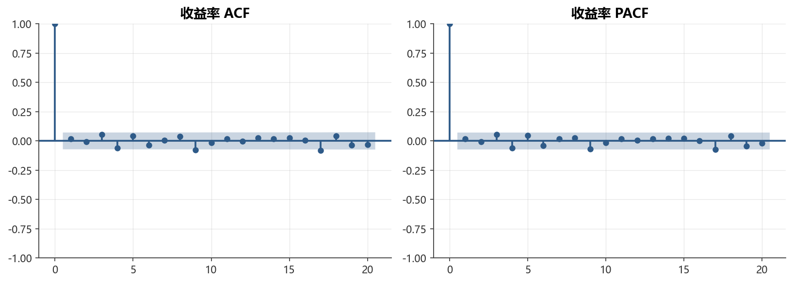
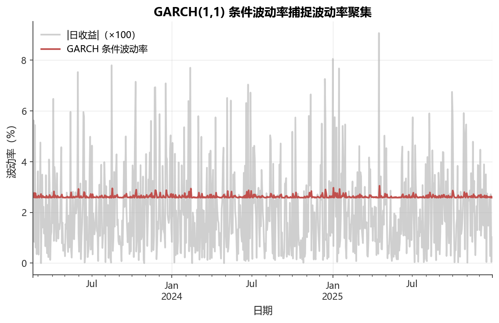

# 第6章 金融时间序列分析

[](https://colab.research.google.com/github/albertandking/financial-data-science/blob/main/notebooks/ch06_time_series.ipynb) [](https://mybinder.org/v2/gh/albertandking/financial-data-science/main?labpath=notebooks/ch06_time_series.ipynb)

!!! info "配套代码"
    `notebooks/ch06_time_series.ipynb`（使用 statsmodels 与 arch 库）。运行前请先执行：
    ```bash
    uv run python scripts/make_sample_data.py
    ```

---

## 6.1 本章导读

**“预测波动率比预测收益更可行。”**

这句金融从业者之间流传的行话，深刻揭示了时间序列分析在金融领域的核心矛盾：股票价格（和收益率）的均值几乎无法预测，但其**波动率**却呈现出明显的持续性与聚集性——大幅波动之后往往跟随大幅波动，平静之后往往跟随平静。

以A股市场为例：2015年股灾期间，沪深300指数在短短两个月内暴跌超过40%，期间日波动率从平均1.5%飙升至5%以上，并在此后数月维持高位。如果我们的模型能提前识别这一“波动率切换”，就能在风险暴露、期权定价和止损策略上做出更好的决策。

本章将系统介绍金融时间序列分析的核心方法，从理论出发，结合A股数据实战，帮助读者建立从**数据探索→平稳性检验→均值方程建模→波动率建模→样本外预测**的完整分析框架。

### 6.1.1 学习目标

完成本章学习后，你将能够：

1. 理解严平稳与宽平稳的概念，解释为什么金融建模需要平稳序列；
2. 使用 ADF 检验和 KPSS 检验判断序列是否存在单位根；
3. 识别并解读 ACF/PACF 图，用于 ARMA 模型定阶；
4. 构建 ARIMA(p,d,q) 模型，使用 AIC/BIC 选择最优阶数并进行残差诊断；
5. 理解 ARCH 效应和波动率聚集，构建 GARCH(1,1) 模型；
6. 实施滚动窗口预测，正确评估样本外预测精度，避免前视偏差。

---

## 6.2 平稳性：金融建模的基础前提

### 6.2.1 严平稳与宽平稳

**严平稳（Strict Stationarity）**要求序列的联合概率分布对任意时间平移不变：

$$
(X_{t_1}, X_{t_2}, \ldots, X_{t_k}) \overset{d}{=} (X_{t_1+h}, X_{t_2+h}, \ldots, X_{t_k+h}), \quad \forall k, h
$$

这一条件在实际中难以验证，通常退而求其次，使用**宽平稳（Wide-Sense Stationarity）**，要求：

| 条件 | 数学表达 |
|------|---------|
| 均值不随时间变化 | $E[X_t] = \mu$，常数 |
| 方差有限且不随时间变化 | $\text{Var}(X_t) = \sigma^2 < \infty$ |
| 自协方差只依赖时间间隔 | $\text{Cov}(X_t, X_{t-h}) = \gamma(h)$，仅是 $h$ 的函数 |

!!! note "严平稳 vs 宽平稳"
    - 若序列服从正态分布，则严平稳 ↔ 宽平稳（正态由均值和方差完全刻画）。
    - 对于非正态分布（如金融收益的厚尾分布），宽平稳不能推出严平稳，但实践中宽平稳已足够。
    - 本章提及的“平稳”，除非特别说明，均指**宽平稳**。

### 6.2.2 为何金融建模需要平稳序列

| 序列特征 | 问题后果 | 举例 |
|---------|---------|------|
| 非平稳均值（趋势） | OLS 估计有偏，$t$统计量失效 | 股价随时间上涨 |
| 非平稳方差（异方差） | 标准误估计不可靠 | 波动率聚集 |
| 两序列均有趋势 | **伪回归**（$R^2$ 高但实际无关） | 用GDP回归沪指 |

!!! warning "伪回归陷阱"
    对两个独立随机游走做回归，即使二者毫无关联，样本 $R^2$ 可高达0.9，$t$值显著。这是非平稳数据最常见的陷阱，Granger & Newbold (1974) 最早系统揭示这一问题。

### 6.2.3 价格 vs 收益率：哪个更接近平稳？

以A股TECH板块为例：

- **股价**：具有明显的上升趋势，均值随时间递增 → **非平稳**
- **对数收益率** $r_t = \ln(P_t/P_{t-1})$：均值接近零，方差相对稳定 → **近似平稳**（但方差有时聚集）

$$
P_t = P_{t-1} \cdot e^{r_t} \implies \ln P_t = \ln P_{t-1} + r_t
$$

对数价格是收益率的随机游走（单位根过程），对其做一阶差分即得到（对数）收益率。

### 6.2.4 AR(1) 的平稳条件与无条件矩：一个完整推导

平稳性不仅是一个“检验通过与否”的工程问题，更是一个可以从模型结构直接推导出来的数学性质。我们以最简单的 AR(1) 过程为例，把“为什么 $|\phi|<1$ 才平稳”这件事讲透。考虑零均值 AR(1)：

$$
X_t = \phi X_{t-1} + \varepsilon_t, \quad \varepsilon_t \sim \text{WN}(0, \sigma^2)
$$

把递推式反复向后代入，可以把 $X_t$ 写成历史冲击的无穷加权和（MA($\infty$) 表示）：

$$
X_t = \varepsilon_t + \phi \varepsilon_{t-1} + \phi^2 \varepsilon_{t-2} + \cdots = \sum_{j=0}^{\infty} \phi^j \varepsilon_{t-j}
$$

这个无穷级数要**收敛**（在均方意义下有限），就要求权重平方和 $\sum_{j=0}^{\infty} \phi^{2j}$ 收敛。这是一个公比为 $\phi^2$ 的等比级数，收敛的充要条件正是 $|\phi|<1$。这就从“级数收敛”的角度解释了平稳条件的来源：只有当过去冲击的影响随时间**指数衰减**时，序列才不会积累出无界的方差。

在 $|\phi|<1$ 成立的前提下，我们进一步求**无条件方差**。对上式两边取方差，并利用白噪声各期不相关（协方差为零）：

$$
\text{Var}(X_t) = \sum_{j=0}^{\infty} \phi^{2j}\,\text{Var}(\varepsilon_{t-j}) = \sigma^2 \sum_{j=0}^{\infty} \phi^{2j} = \frac{\sigma^2}{1-\phi^2}
$$

这就是 AR(1) 著名的无条件方差公式 $\gamma(0)=\sigma^2/(1-\phi^2)$。它有一个直观的金融含义：$\phi$ 越接近 1（持续性越强），分母 $1-\phi^2$ 越小，序列的无条件波动就被放大得越厉害；当 $\phi\to 1$ 时方差发散，序列退化为非平稳的随机游走，这与 6.3.1 节“单位根使方差随时间线性增长”的结论完全吻合。

同理可推自协方差：$\gamma(h)=\phi^{|h|}\gamma(0)$，因此自相关函数 $\rho(h)=\phi^{|h|}$ 呈指数衰减——这正是 6.4.3 节表格里“AR(p) 的 ACF 拖尾”的数学根源。

!!! example "例 6.1：用 AR(1) 计算均值回复速度与半衰期"
    设某只ETF的日内净值偏离（相对其公允价值的折溢价）服从 AR(1)：$X_t = 0.5\,X_{t-1} + \varepsilon_t$，$\varepsilon_t$ 的标准差 $\sigma = 0.4\%$。请回答：(1) 该偏离的无条件标准差是多少？(2) 一个冲击的“半衰期”是多少天？

    **第一步：无条件方差与标准差。** 代入公式：

    $$
    \text{Var}(X_t) = \frac{\sigma^2}{1-\phi^2} = \frac{(0.4\%)^2}{1-0.5^2} = \frac{0.16}{0.75}\times(\%)^2 \approx 0.2133\,(\%)^2
    $$

    故无条件标准差 $\approx \sqrt{0.2133}\% \approx 0.462\%$。注意它比单期冲击的 $0.4\%$ 略大——这正是 $1/(1-\phi^2)$ 这个“方差放大因子”的体现（此例放大因子 $=1/0.75\approx 1.33$，开方后约 $1.155$ 倍）。

    **第二步：半衰期。** AR(1) 的冲击衰减遵循 $\rho(h)=\phi^h$。所谓**半衰期**（half-life），是冲击影响衰减到初始一半所需的期数 $h^*$，即解 $\phi^{h^*}=0.5$：

    $$
    h^* = \frac{\ln 0.5}{\ln \phi} = \frac{\ln 0.5}{\ln 0.5} = 1\ \text{天}
    $$

    当 $\phi=0.5$ 时半衰期恰好等于 1 天，因为 $\phi$ 本身就是 $0.5$。作为对比，若某指数收益的 $\phi$ 估计为 $0.95$（持续性强得多），则半衰期 $=\ln 0.5/\ln 0.95 \approx -0.693/(-0.0513)\approx 13.5$ 天——同样的“一半衰减”要等近两周。**半衰期是把抽象的 $\phi$ 翻译成交易日语言的实用工具**：统计套利里它直接决定持仓周期，$\phi$ 越大、半衰期越长，均值回复越慢，套利头寸需要持有越久。

---

## 6.3 单位根与平稳性检验

### 6.3.1 随机游走与单位根

最简单的非平稳过程是**随机游走**（Random Walk）：

$$
P_t = P_{t-1} + \varepsilon_t, \quad \varepsilon_t \sim \text{WN}(0, \sigma^2)
$$

写成 AR(1) 形式 $P_t = \phi P_{t-1} + \varepsilon_t$，随机游走对应 $\phi = 1$，即“单位根”。

- 若 $|\phi| < 1$：序列均值回复，宽平稳；
- 若 $\phi = 1$：单位根，非平稳，方差随时间线性增长；
- 若 $\phi > 1$：爆炸性，极少在金融中出现。

### 6.3.2 ADF 检验（Augmented Dickey-Fuller）

**原假设 $H_0$**：序列存在单位根（非平稳）  
**备择假设 $H_1$**：序列平稳

ADF 检验通过以下辅助回归实现：

$$
\Delta X_t = \alpha + \beta t + \gamma X_{t-1} + \sum_{j=1}^{p} \delta_j \Delta X_{t-j} + \varepsilon_t
$$

检验统计量：$\tau = \hat{\gamma} / \text{se}(\hat{\gamma})$，临界值来自 Dickey-Fuller 分布（非正态）。

| 结论 | 条件 |
|------|------|
| 拒绝 $H_0$（平稳） | $p$ 值 $< 0.05$（通常取5%显著性） |
| 不拒绝 $H_0$（非平稳） | $p$ 值 $\geq 0.05$ |

!!! tip "ADF 检验的局限"
    - ADF 检验**低功效**（容易漏检平稳序列），短样本尤为明显。
    - 检验结果对滞后阶数 $p$ 的选择敏感，通常用 AIC/BIC 自动选阶。
    - 建议**配合 KPSS 检验**一起使用，形成“双向夹击”：
        - ADF 不拒绝 + KPSS 拒绝 → 强证据支持单位根
        - ADF 拒绝 + KPSS 不拒绝 → 强证据支持平稳
        - 两者均拒绝 or 均不拒绝 → 结论模糊，需结合经济理论判断

### 6.3.3 KPSS 检验

**原假设 $H_0$**：序列平稳（与 ADF 相反！）  
**备择假设 $H_1$**：存在单位根

```python
from statsmodels.tsa.stattools import kpss
stat, p_value, lags, crit = kpss(series, regression='c')
# p_value < 0.05 → 拒绝平稳假设 → 非平稳
```

### 6.3.4 差分与过差分

**差分**（Differencing）是消除单位根的标准处理方式：

$$
\Delta X_t = X_t - X_{t-1} \quad (\text{一阶差分})
$$

对股价做一阶差分近似得到收益率。若差分后仍非平稳，可做**二阶差分**。差分的本质是“求变化量”：一阶差分把“水平”变成“变化”，把带趋势的随机游走变回平稳的增量序列。金融里绝大多数价格序列一阶差分（取对数后即收益率）就足以平稳，需要二阶差分的情形罕见，通常出现在带有确定性二次趋势的宏观序列中；对收益率再差分几乎总是过差分（见下方警告框）。

!!! warning "过差分的危害"
    对本已平稳的序列进行差分，称为**过差分**（Overdifferencing）。过差分会：
    - 引入额外的移动平均成分（MA(1) 不可逆结构）；
    - 损失信息，参数估计效率下降；
    - 使预测区间不必要地扩大。
    
    **规则**：先用 ADF/KPSS 检验判断，确认需要差分再差分，切勿盲目。

### 6.3.5 ADF 与 KPSS 的对照与联合判读

ADF 和 KPSS 是一对“原假设相反”的检验，正确理解它们的差异是平稳性分析的关键。很多初学者会混淆两者的方向，结果把“不拒绝”当成“证明”，得出错误结论。下表系统对照二者：

| 维度 | ADF 检验 | KPSS 检验 |
|------|----------|-----------|
| 原假设 $H_0$ | 存在单位根（**非平稳**） | 序列**平稳**（趋势平稳） |
| 备择假设 $H_1$ | 平稳 | 存在单位根（非平稳） |
| 检验思路 | 单位根检验（回归 $\Delta X_t$ 对 $X_{t-1}$） | 平稳性检验（基于残差部分和的方差） |
| “拒绝”的含义 | 拒绝 → 序列平稳 | 拒绝 → 序列非平稳 |
| 主要弱点 | 低功效，易把平稳序列误判为单位根 | 对带宽/滞后选择敏感，小样本偏保守 |
| 单独使用风险 | “不拒绝”常被误读为“证明非平稳” | “不拒绝”常被误读为“证明平稳” |

由于两者的原假设互为对立，把它们**联合使用**能形成“双向夹击”，给出比任一单独检验更稳健的结论：

| ADF 结果 | KPSS 结果 | 联合判读 | 建议 |
|----------|-----------|----------|------|
| 不拒绝（非平稳） | 拒绝（非平稳） | 强证据：**存在单位根** | 差分一次再检验 |
| 拒绝（平稳） | 不拒绝（平稳） | 强证据：**平稳** | $d=0$，直接建模 |
| 拒绝（平稳） | 拒绝（非平稳） | 矛盾，可能**趋势平稳**或结构突变 | 加入趋势项/分段检验 |
| 不拒绝 | 不拒绝 | 信息不足，样本可能太短 | 增大样本或结合经济理论 |

!!! example "例 6.2：对一段收益率序列做 ADF 并判读"
    某分析师对 BANK 股的对数收益率（样本量 $T=750$）跑 ADF 检验，软件输出如下：

    ```
    ADF Statistic : -18.42
    p-value       :  1.3e-30
    # Lags Used   :  2
    Critical Values: {'1%': -3.44, '5%': -2.86, '10%': -2.57}
    ```

    **如何判读？** 判读 ADF 有两条等价路径，结论必须一致：

    1. **比临界值**：检验统计量 $-18.42$ 远小于 1% 临界值 $-3.44$（注意是“更负”才更显著，因为 Dickey-Fuller 分布是左偏的单尾检验）。落在拒绝域，**拒绝 $H_0$**。
    2. **比 $p$ 值**：$p = 1.3\times 10^{-30} \ll 0.05$，同样**拒绝 $H_0$**（存在单位根的假设）。

    **结论**：BANK 收益率序列**平稳**，建模时 $d=0$，无需差分。这与金融常识一致——收益率（一阶差分后的对数价格）通常已经平稳，而价格本身（统计量往往只有 $-1$ 到 $-2$，落不进拒绝域）才是单位根过程。

    **常见陷阱**：若误以为“统计量是负数就拒绝”，会把价格序列的 $-1.5$ 也判成平稳——必须与临界值比较绝对位置，而非只看符号。

---

## 6.4 自相关与偏自相关

### 6.4.1 自相关函数（ACF）

<figure markdown>
  { width="680" }
  <figcaption>图 6-1　TECH 收益率的 ACF 与 PACF</figcaption>
</figure>


**自相关系数**（Autocorrelation Function, ACF）衡量序列与其自身滞后值的线性相关性：

$$
\rho(h) = \frac{\text{Cov}(X_t, X_{t-h})}{\text{Var}(X_t)} = \frac{\gamma(h)}{\gamma(0)}
$$

样本估计：
$$
\hat{\rho}(h) = \frac{\sum_{t=h+1}^{T}(X_t - \bar{X})(X_{t-h} - \bar{X})}{\sum_{t=1}^{T}(X_t - \bar{X})^2}
$$

在零假设（白噪声）下，$\hat{\rho}(h) \approx N(0, 1/T)$，**95%置信区间**为 $\pm 1.96/\sqrt{T}$（图中蓝色阴影带）。

### 6.4.2 偏自相关函数（PACF）

**偏自相关系数**（Partial ACF, PACF）衡量在**控制中间滞后**后，$X_t$ 与 $X_{t-h}$ 的直接线性相关：

$$
\phi_{hh} = \text{Corr}(X_t, X_{t-h} \mid X_{t-1}, \ldots, X_{t-h+1})
$$

PACF 通过 Yule-Walker 方程逐步计算，截断特征比 ACF 更清晰。

### 6.4.3 用 ACF/PACF 图定阶

| 模型 | ACF 特征 | PACF 特征 |
|------|---------|----------|
| AR(p) | 拖尾（指数衰减/震荡衰减） | **截尾**（$h > p$ 后急速归零） |
| MA(q) | **截尾**（$h > q$ 后急速归零） | 拖尾 |
| ARMA(p,q) | 拖尾 | 拖尾 |
| 白噪声 | 全部在置信带内 | 全部在置信带内 |

!!! tip "实操经验"
    ACF/PACF 定阶是“工艺”而非“科学”——实践中建议：
    1. 画出 ACF/PACF（滞后到20-40期）；
    2. 识别截尾点和拖尾模式；
    3. 用 AIC/BIC 在候选模型集合中自动选择最优。

### 6.4.4 为什么 AR 看 PACF、MA 看 ACF：截尾的来历

“AR(p) 的 PACF 在 $p$ 阶后截尾、MA(q) 的 ACF 在 $q$ 阶后截尾”是定阶的黄金法则，但它并非约定俗成，而是有清晰的结构原因。理解这一点，能让你在面对真实的、带噪声的样本图时判断得更有底气。

**MA(q) 的 ACF 为何截尾。** 以 MA(1) 为例，$X_t = \varepsilon_t + \theta\varepsilon_{t-1}$。计算自协方差：当滞后 $h=1$ 时，$X_t$ 与 $X_{t-1}$ 共享了 $\varepsilon_{t-1}$ 这一项，故 $\gamma(1)=\theta\sigma^2\ne 0$；而当 $h\ge 2$ 时，$X_t=\varepsilon_t+\theta\varepsilon_{t-1}$ 与 $X_{t-2}=\varepsilon_{t-2}+\theta\varepsilon_{t-3}$ **不含任何公共的白噪声项**，因白噪声各期不相关，$\gamma(h)=0$。一般地，MA(q) 的任意 $h>q$ 都凑不出公共冲击，ACF 在 $q$ 阶后**硬截断为零**。

**AR(p) 的 PACF 为何截尾。** AR(p) 把 $X_t$ 显式写成前 $p$ 期的线性组合加白噪声。PACF 的定义正是“在控制中间滞后后 $X_t$ 与 $X_{t-h}$ 的直接相关”——对 AR(p) 而言，$X_{t-p}$ 之外的更远滞后**只通过中间项间接影响** $X_t$，一旦把 $X_{t-1},\dots,X_{t-h+1}$ 都控制住，$h>p$ 的直接偏相关恰好为零。因此 PACF 在 $p$ 阶后截尾。而 ACF 因为 $\rho(h)=\phi^{|h|}$（见 6.2.4 节）只是**指数衰减**、永不精确归零，表现为“拖尾”。

把两条放在一起，就得到 6.4.3 节那张定阶表的完整逻辑闭环：**截尾来自“公共冲击/直接相关”的有限阶数，拖尾来自指数衰减的无限延续**。

---

## 6.5 白噪声与 Ljung-Box 检验

**白噪声**（White Noise, WN）是时间序列分析的基准：均值为零、方差恒定、任意滞后自相关均为零：

$$
\varepsilon_t \sim \text{WN}(0, \sigma^2) \iff E[\varepsilon_t] = 0, \quad \text{Cov}(\varepsilon_t, \varepsilon_s) = 0 \; (t \neq s)
$$

ARMA 模型的残差应当是白噪声。验证方法使用 **Ljung-Box 检验**：

$$
Q(m) = T(T+2) \sum_{h=1}^{m} \frac{\hat{\rho}^2(h)}{T-h} \sim \chi^2(m - p - q)
$$

- $H_0$：前 $m$ 阶自相关均为零（白噪声）
- $p$ 值 $< 0.05$ → 残差仍有序列相关，模型未充分拟合

```python
from statsmodels.stats.diagnostic import acorr_ljungbox
lb = acorr_ljungbox(residuals, lags=[10, 20], return_df=True)
print(lb)
```

Ljung-Box 统计量 $Q(m)$ 的直觉是：它把前 $m$ 阶样本自相关系数 $\hat\rho(h)$ 平方后**加权求和**，权重 $(T+2)/(T-h)$ 对高阶滞后略作放大以修正小样本偏差。若残差真是白噪声，每个 $\hat\rho(h)^2$ 都接近 $1/T$ 的量级，$Q(m)$ 就服从自由度为 $m-p-q$ 的卡方分布（扣除已估计的 $p+q$ 个 ARMA 参数）；若残差仍残留结构，某些 $\hat\rho(h)$ 显著偏离零，$Q(m)$ 被推高，落入卡方分布右尾，从而得到小 $p$ 值。

!!! example "例 6.3：用 Ljung-Box 判断残差是否为白噪声"
    对一个 ARIMA(1,0,1) 模型（即 $p=1,\,q=1$）的残差（样本量 $T=600$）做 Ljung-Box 检验，取滞后阶 $m=10$，软件给出 $Q(10)=8.7$。该残差通过白噪声检验了吗？

    **第一步：确定自由度。** 因为模型估计了 $p+q=2$ 个参数，自由度为 $m-p-q = 10-1-1 = 8$。

    **第二步：找临界值。** 自由度为 8 的卡方分布在 5% 显著性水平下的右尾临界值约为 $\chi^2_{0.05}(8)\approx 15.51$。

    **第三步：比较并下结论。** 观测到的 $Q(10)=8.7 < 15.51$，落在接受域内（对应 $p$ 值约 $0.37 > 0.05$）。**不拒绝 $H_0$**，即前 10 阶自相关联合为零，残差可视为白噪声。模型对均值结构的拟合是**充分**的，可以进入下一步（波动率诊断）。

    **反例对照**：若另一模型给出 $Q(10)=23.4$，则 $23.4 > 15.51$（$p\approx 0.003$），拒绝白噪声假设——说明均值方程定阶不足，残差仍有可利用的序列相关，应提高 $p$ 或 $q$ 重新拟合。注意：Ljung-Box 只检验**线性自相关**，即便残差通过，其平方序列仍可能存在 ARCH 效应（见 6.7 节），二者需分别诊断。

---

## 6.6 ARIMA 模型族

### 6.6.1 AR(p)：自回归模型

$$
X_t = c + \phi_1 X_{t-1} + \phi_2 X_{t-2} + \cdots + \phi_p X_{t-p} + \varepsilon_t
$$

**直觉**：今天的值依赖于过去 $p$ 天的值。AR(1) 模型中，若 $|\phi_1|$ 接近1，序列表现出强持续性。

**平稳条件**：特征多项式 $1 - \phi_1 z - \cdots - \phi_p z^p = 0$ 的所有根在单位圆外。

### 6.6.2 MA(q)：移动平均模型

$$
X_t = \mu + \varepsilon_t + \theta_1 \varepsilon_{t-1} + \theta_2 \varepsilon_{t-2} + \cdots + \theta_q \varepsilon_{t-q}
$$

**直觉**：今天的值依赖于过去 $q$ 个随机冲击（残差）的线性组合。MA 模型**恒平稳**，但需要满足**可逆条件**（类似 AR 平稳条件）。

### 6.6.3 ARMA(p,q)

$$
X_t = c + \sum_{i=1}^{p} \phi_i X_{t-i} + \varepsilon_t + \sum_{j=1}^{q} \theta_j \varepsilon_{t-j}
$$

ARMA 模型结合了 AR 和 MA 两种机制，常用比纯 AR 或纯 MA 更少的参数达到相近的拟合效果。直觉上，AR 部分捕捉“值对值”的持续性（今天受过去取值影响），MA 部分捕捉“值对冲击”的短期记忆（今天受过去若干次随机扰动影响）。许多真实序列同时具备这两种成分，纯 AR 要用很高的阶数才能逼近一个低阶 MA 结构，反之亦然；ARMA 用一个紧凑的 $(p,q)$ 组合（常见如 $(1,1)$）就能兼顾，体现了**参数简约**（parsimony）原则——在拟合相当的前提下，参数越少的模型样本外越稳健、越不易过拟合。这也是为什么金融收益率序列经验上常落在 $(1,0,0)$、$(0,0,1)$、$(1,0,1)$ 这几个低阶模型上。

### 6.6.4 ARIMA(p,d,q)

对于非平稳序列（如股价），先做 $d$ 阶差分使其平稳，再拟合 ARMA(p,q)：

$$
\Delta^d X_t \sim \text{ARMA}(p, q)
$$

其中 $\Delta^d$ 表示 $d$ 次差分算子。完整记法：**ARIMA(p,d,q)**，其中：

- $p$ = 自回归阶数
- $d$ = 差分次数（通常0或1）
- $q$ = 移动平均阶数

!!! info "建模流程（Box-Jenkins 方法论）"
    1. **识别**：画 ACF/PACF，判断差分次数，初步定阶 $(p, q)$；
    2. **估计**：极大似然估计（MLE）参数；
    3. **诊断**：残差应为白噪声（Ljung-Box 检验），QQ图检查正态性；
    4. **预测**：用拟合模型做区间预测。

### 6.6.5 信息准则定阶：AIC 与 BIC

$$
\text{AIC} = -2\ln L + 2k, \quad \text{BIC} = -2\ln L + k\ln T
$$

其中 $L$ 为最大似然值，$k$ 为参数个数，$T$ 为样本量。

| 准则 | 偏好 | 适用场景 |
|------|------|---------|
| AIC | 相对宽松，偏向复杂模型 | 预测为主（允许轻微过拟合） |
| BIC | 对参数惩罚更重，偏向简单模型 | 结构识别为主 |

**最优模型**：在候选阶数范围内，AIC/BIC 最小者。

```python
from statsmodels.tsa.arima.model import ARIMA
best_aic, best_order = np.inf, None
for p in range(4):
    for q in range(4):
        try:
            res = ARIMA(returns, order=(p, 0, q)).fit()
            if res.aic < best_aic:
                best_aic, best_order = res.aic, (p, 0, q)
        except Exception:
            pass
print(f"最优 ARIMA 阶数（按AIC）：{best_order}")
```

#### AIC 与 BIC 的取舍逻辑

AIC 与 BIC 共享同一个“拟合优度 + 复杂度惩罚”的结构：第一项 $-2\ln L$ 越小表示拟合越好，第二项（惩罚项）越小表示模型越简洁。二者的唯一差别在惩罚力度——AIC 对每个参数固定罚 $2$，BIC 罚 $\ln T$。只要样本量 $T>e^2\approx 7.4$（金融数据总是满足），就有 $\ln T > 2$，**BIC 的惩罚永远比 AIC 重**，因而 BIC 总是倾向于更简单（参数更少）的模型。下表把二者的统计性质并列对照：

| 对比维度 | AIC | BIC |
|----------|-----|-----|
| 惩罚项 | $2k$ | $k\ln T$ |
| 惩罚强度 | 固定，较轻 | 随 $T$ 增大，较重 |
| 理论目标 | 最小化预测的 KL 散度 | 一致地选出“真”模型 |
| 大样本性质 | 不一致（可能选偏大模型） | 一致（$T\to\infty$ 选中真阶数） |
| 倾向 | 复杂模型，重预测 | 简洁模型，重解释 |
| 推荐场景 | 纯预测、允许轻微过拟合 | 结构识别、追求可解释性 |

当 AIC 与 BIC 选出的阶数不一致时，没有绝对的对错：以**预测**为目的可偏向 AIC 的选择，以**结构识别/可解释性**为目的可偏向 BIC 的选择；稳健做法是把两个候选都做样本外验证，再用 RMSE 拍板。

!!! example "例 6.4：用 AIC/BIC 在候选阶数间选模型"
    对 LIQUOR 收益率（样本量 $T=500$，故 $\ln T = \ln 500 \approx 6.21$）拟合三个候选模型，最大化对数似然值 $\ln L$ 如下（含一个常数项，参数个数 $k$ 已计入常数与误差方差）：

    | 模型 | 参数个数 $k$ | $\ln L$ |
    |------|:---:|:---:|
    | ARIMA(0,0,0) | 2 | 1205.0 |
    | ARIMA(1,0,0) | 3 | 1210.5 |
    | ARIMA(1,0,1) | 4 | 1211.2 |

    **逐个计算 AIC**（$\text{AIC}=-2\ln L + 2k$）：

    - (0,0,0)：$-2(1205.0)+2(2) = -2410.0+4 = -2406.0$
    - (1,0,0)：$-2(1210.5)+2(3) = -2421.0+6 = -2415.0$
    - (1,0,1)：$-2(1211.2)+2(4) = -2422.4+8 = -2414.4$

    按 AIC，最小者为 **ARIMA(1,0,0)** 的 $-2415.0$（比 (1,0,1) 的 $-2414.4$ 还小 0.6）。

    **逐个计算 BIC**（$\text{BIC}=-2\ln L + k\ln T$，$\ln T\approx 6.21$）：

    - (0,0,0)：$-2410.0 + 2(6.21) = -2410.0+12.43 = -2397.6$
    - (1,0,0)：$-2421.0 + 3(6.21) = -2421.0+18.64 = -2402.4$
    - (1,0,1)：$-2422.4 + 4(6.21) = -2422.4+24.85 = -2397.6$

    按 BIC，最小者仍为 **ARIMA(1,0,0)** 的 $-2402.4$，且其领先优势更明显（比 (1,0,1) 小约 4.8）。

    **解读**：从 (1,0,0) 到 (1,0,1)，对数似然只提高了 $0.7$，对应 $-2\ln L$ 仅改善 $1.4$，**不足以抵偿多一个参数带来的惩罚**（AIC 罚 2，BIC 罚 6.21）。因此两准则一致选出更简洁的 **ARIMA(1,0,0)**。这个例子也直观展示了 BIC“惩罚更重、更偏简洁”的特性——它把 (1,0,1) 罚得比 AIC 更狠，使简洁模型的领先更突出。

---

## 6.7 波动率建模：ARCH 与 GARCH

### 6.7.1 波动率聚集与 ARCH 效应

金融收益率最显著的“程式化事实”之一是**波动率聚集**（Volatility Clustering）：

> 大幅波动之后往往跟随大幅波动，平静之后往往跟随平静。

这意味着收益率的**条件方差**并非常数，而是时变的，这违反了普通 ARMA 模型的同方差假设。Engle (1982) 提出 **ARCH 模型**来刻画这一现象。

要理解 ARCH 的洞见，先厘清两个“方差”的区别：**无条件方差**是把所有历史一视同仁地平均出的长期波动水平，它是一个常数；**条件方差** $\sigma_t^2=\text{Var}(r_t\mid \mathcal F_{t-1})$ 则是“在已知昨天及更早全部信息后”对今天波动的预期，它随信息流动而变化。波动率聚集说的正是后者——昨天若是大跌大涨，今天的条件方差就高。ARCH(q) 模型把这一直觉写成 $\sigma_t^2=\omega+\sum_{i=1}^q\alpha_i\varepsilon_{t-i}^2$：**过去若干期冲击的平方越大，今天的条件方差越大**。它的局限是，要刻画A股那种绵延数周的波动持续性，往往需要很大的 $q$（很多滞后项），参数过多、估计不稳——这正是下一节 GARCH 用一个 $\beta\sigma_{t-1}^2$ 项“递归地打包全部历史”来替代一长串 $\alpha_i$ 的动机。

**ARCH-LM 检验**（检验是否存在ARCH效应）：

$$
H_0: \text{残差平方序列不存在自相关（无ARCH效应）}
$$

```python
from statsmodels.stats.diagnostic import het_arch
lm_stat, lm_pval, f_stat, f_pval = het_arch(residuals, nlags=10)
# p_value < 0.05 → 存在ARCH效应
```

### 6.7.2 GARCH(1,1) 模型

<figure markdown>
  { width="680" }
  <figcaption>图 6-2　GARCH(1,1) 条件波动率捕捉波动率聚集</figcaption>
</figure>


Bollerslev (1986) 在 ARCH 基础上提出**广义ARCH（GARCH）**模型，最常用的是 GARCH(1,1)：

**均值方程**：
$$
r_t = \mu + \varepsilon_t, \quad \varepsilon_t = \sigma_t z_t, \quad z_t \overset{iid}{\sim} N(0,1)
$$

**方差方程**：
$$
\sigma_t^2 = \omega + \alpha \varepsilon_{t-1}^2 + \beta \sigma_{t-1}^2
$$

参数含义：

| 参数 | 含义 | 约束 |
|------|------|------|
| $\omega > 0$ | 基准波动率（长期方差的贡献） | 正数 |
| $\alpha \geq 0$ | ARCH系数：对上期冲击的反应强度 | 非负 |
| $\beta \geq 0$ | GARCH系数：波动率持续性 | 非负 |
| $\alpha + \beta < 1$ | 平稳性条件 | 严格小于1 |

**长期均衡波动率**（无条件方差）：

$$
\bar{\sigma}^2 = \frac{\omega}{1 - \alpha - \beta}
$$

$\alpha + \beta$ 越接近1，波动率冲击持续越久（均值回复越慢）。典型的A股日度数据 $\alpha + \beta \approx 0.93 \sim 0.98$。

!!! info "GARCH(1,1) 经济含义解读"
    - $\alpha$ 大：模型对新信息（昨日冲击）反应灵敏；
    - $\beta$ 大：波动率记忆长，持续性强；
    - $\omega$ 小、$\alpha + \beta$ 接近1：接近单位根（IGARCH），长期预测退化为常数。

#### 无条件方差公式的推导

上面直接给出了无条件方差 $\bar\sigma^2=\omega/(1-\alpha-\beta)$，这里把它推导出来，顺便看清平稳条件 $\alpha+\beta<1$ 的由来。在 GARCH 平稳时，无条件方差不随时间变化，记其稳态值为 $\bar\sigma^2 = E[\sigma_t^2] = E[\varepsilon_t^2]$（对所有 $t$ 相等）。注意一个关键事实：由 $\varepsilon_t = \sigma_t z_t$ 且 $z_t$ 独立于 $\sigma_t$、$E[z_t^2]=1$，有

$$
E[\varepsilon_{t-1}^2] = E[\sigma_{t-1}^2 z_{t-1}^2] = E[\sigma_{t-1}^2]\,E[z_{t-1}^2] = E[\sigma_{t-1}^2] = \bar\sigma^2
$$

也就是说，**冲击平方的期望与条件方差的期望相等**。现在对方差方程 $\sigma_t^2 = \omega + \alpha \varepsilon_{t-1}^2 + \beta \sigma_{t-1}^2$ 两边取无条件期望：

$$
\bar\sigma^2 = \omega + \alpha\,E[\varepsilon_{t-1}^2] + \beta\,E[\sigma_{t-1}^2] = \omega + \alpha\bar\sigma^2 + \beta\bar\sigma^2
$$

把含 $\bar\sigma^2$ 的项移到一边：

$$
\bar\sigma^2(1 - \alpha - \beta) = \omega \implies \bar\sigma^2 = \frac{\omega}{1-\alpha-\beta}
$$

这一步立刻暴露了平稳条件：要让 $\bar\sigma^2$ 是一个**正的有限常数**，分母必须为正，即 $\alpha+\beta<1$。当 $\alpha+\beta\to 1$ 时分母趋零、无条件方差发散，模型退化为 IGARCH（波动率冲击永不消散）；当 $\alpha+\beta\ge 1$ 时无条件方差不存在，序列方差非平稳。这与 6.2.4 节 AR(1) 中 $|\phi|<1$ 的逻辑如出一辙——都是“持续性系数小于 1，过去影响才会衰减”。

GARCH 的均值回复速度也可量化：把方差方程改写成围绕 $\bar\sigma^2$ 的偏离形式，可证明 $h$ 步条件方差预测以 $(\alpha+\beta)^h$ 的速率收敛到 $\bar\sigma^2$，因此波动率冲击的半衰期为 $h^*=\ln 0.5/\ln(\alpha+\beta)$，与 6.2.4 节 AR(1) 半衰期公式形式完全一致（把 $\phi$ 换成 $\alpha+\beta$）。

!!! example "例 6.5：GARCH(1,1) 一步波动率预测"
    设对某A股指数日收益率（以百分数计）拟合出 GARCH(1,1)：$\omega=0.02$，$\alpha=0.10$，$\beta=0.85$。已知今日（$t-1$ 期）的条件方差 $\sigma_{t-1}^2 = 1.5$（对应日波动率 $\sqrt{1.5}\approx 1.22\%$），且昨日实际冲击 $\varepsilon_{t-1} = -3.0$（即下跌 3%，一个较大的负冲击）。求对明日（第 $t$ 期）的条件方差与波动率预测。

    **第一步：直接代入方差方程。**

    $$
    \sigma_t^2 = \omega + \alpha\,\varepsilon_{t-1}^2 + \beta\,\sigma_{t-1}^2 = 0.02 + 0.10\times(-3.0)^2 + 0.85\times 1.5
    $$

    $$
    = 0.02 + 0.10\times 9.0 + 1.275 = 0.02 + 0.90 + 1.275 = 2.195
    $$

    **第二步：换算为波动率。** 预测的日波动率 $\hat\sigma_t = \sqrt{2.195}\approx 1.48\%$，比前一日的 $1.22\%$ 明显抬升。这正是 GARCH 的核心机制：一个 $-3\%$ 的大冲击（$\alpha$ 项贡献了 $0.90$）把明日的预期波动**推高**了——波动率聚集被定量地捕捉到了。

    **第三步：对照长期均衡。** 该模型的无条件方差为

    $$
    \bar\sigma^2 = \frac{\omega}{1-\alpha-\beta} = \frac{0.02}{1-0.10-0.85} = \frac{0.02}{0.05} = 0.40
    $$

    即长期日波动率 $\sqrt{0.40}\approx 0.63\%$。当前预测的 $2.195$ 远在长期均衡 $0.40$ 之上，说明市场正处于**高波动区制**；由于 $\alpha+\beta=0.95$，半衰期 $h^*=\ln 0.5/\ln 0.95\approx 13.5$ 天，意味着这次波动抬升大约需要近 14 个交易日才会回落一半，**持续性极强**——这与A股“一旦放大波动就维持数周”的经验高度吻合。

### 6.7.3 杠杆效应：EGARCH 与 GJR-GARCH

股票市场中，**下跌比上涨引发更大波动**，称为**杠杆效应（Leverage Effect）**。标准 GARCH 对正负冲击对称，无法捕捉杠杆效应。

**GJR-GARCH（Glosten-Jagannathan-Runkle, 1993）**：

$$
\sigma_t^2 = \omega + (\alpha + \gamma \mathbb{1}_{\varepsilon_{t-1}<0}) \varepsilon_{t-1}^2 + \beta \sigma_{t-1}^2
$$

$\gamma > 0$ 表示负冲击引发更大波动（杠杆效应显著）。

**EGARCH（Nelson, 1991）**：

$$
\ln \sigma_t^2 = \omega + \alpha \left(\frac{|\varepsilon_{t-1}|}{\sigma_{t-1}} - \sqrt{2/\pi}\right) + \gamma \frac{\varepsilon_{t-1}}{\sigma_{t-1}} + \beta \ln \sigma_{t-1}^2
$$

$\gamma < 0$ 对应杠杆效应。EGARCH 自然保证 $\sigma_t^2 > 0$（对数变换）。

为什么股市存在杠杆效应？经典解释有二。其一是**财务杠杆假说**（Black, 1976）：股价下跌使公司市值缩水，而债务名义额不变，于是债务权益比（杠杆率）上升，股权的风险随之放大，波动加剧。其二是**波动率反馈假说**：若投资者预期未来波动上升，会要求更高风险溢价，立即压低当前价格，从而把“坏消息”与“高波动”绑定。两种机制都指向同一个非对称现象——同样幅度的下跌比上涨触发更猛的后续波动。标准 GARCH 把 $\varepsilon_{t-1}$ 平方处理，正负冲击一视同仁（$(-3)^2=(+3)^2$），因此**结构上**无法表达这种非对称，必须借助 GJR 或 EGARCH 显式引入符号项。

如何在 GJR-GARCH 里读出杠杆？关键看 $\gamma$ 的符号与显著性。当 $\varepsilon_{t-1}<0$（负冲击）时，示性函数 $\mathbb{1}_{\varepsilon_{t-1}<0}=1$，ARCH 项系数变为 $\alpha+\gamma$；当 $\varepsilon_{t-1}\ge 0$（正冲击）时系数仅为 $\alpha$。因此 $\gamma>0$ 且统计显著，就意味着**负冲击对次日波动的边际贡献比等幅正冲击多出 $\gamma$ 倍 $\varepsilon_{t-1}^2$**，即杠杆效应存在。在A股与美股的日度数据上，$\gamma$ 通常显著为正，量级常在 $0.05\sim 0.15$，说明“跌出来的波动”确实比“涨出来的波动”更大。

```python
from arch import arch_model
# GJR-GARCH
am_gjr = arch_model(returns * 100, vol="GARCH", p=1, o=1, q=1)
# EGARCH
am_egarch = arch_model(returns * 100, vol="EGARCH", p=1, q=1)
```

!!! tip "选型建议：何时升级到 GJR / EGARCH"
    并非所有序列都需要非对称模型。务实的流程是：先拟合 GARCH(1,1) 打底，再拟合 GJR 或 EGARCH，比较三者的 AIC/BIC，并检验 $\gamma$ 是否显著。若 $\gamma$ 不显著或信息准则没有改善，就**坚持简洁的 GARCH(1,1)**；只有当杠杆参数显著且信息准则明显下降时，升级才物有所值。EGARCH 的额外好处是对 $\ln\sigma_t^2$ 建模，天然保证方差恒正、无需对参数施加非负约束，在高波动样本上数值更稳健。

### 6.7.4 A股案例：2015 股灾中的波动率切换

回到本章开篇的引子。2015 年 6 月至 8 月，沪深300 指数在去杠杆引发的连环踩踏中暴跌逾 40%，日波动率从股灾前的均值约 1.5% 飙升至 5% 以上，并在随后数月高位徘徊。这是一次教科书式的**波动率区制切换**（regime switching），也是检验 GARCH 模型价值的天然实验场。

若用 GARCH(1,1) 拟合沪深300 这一时期的日收益率，典型估计结果约为 $\alpha\approx 0.12$、$\beta\approx 0.86$、$\alpha+\beta\approx 0.98$。我们可以用这组参数把“波动率为何居高不下”讲清楚：

- **冲击放大（$\alpha$ 项）**：股灾期间频繁出现 $\pm 5\%$ 乃至跌停级别的日内冲击。代入方差方程，一个 $\varepsilon_{t-1}=-5$（百分数）的冲击会通过 $\alpha\varepsilon_{t-1}^2 = 0.12\times 25 = 3.0$ 直接给次日条件方差注入巨大增量——单这一项贡献的日波动率就达 $\sqrt{3.0}\approx 1.73\%$。
- **持续性（$\beta$ 项 与半衰期）**：$\alpha+\beta\approx 0.98$ 意味着半衰期 $h^*=\ln 0.5/\ln 0.98\approx 34$ 个交易日，约一个半月。这定量解释了为什么 8 月暴跌后高波动会**绵延到秋季**才逐渐回落，而非几天就平复。
- **长期均衡的抬升**：在高波动样本上估计的 $\bar\sigma^2=\omega/(1-\alpha-\beta)$ 因 $\omega$ 较大而显著高于平静期，模型把“新常态”的高波动水平也学了进去。

!!! example "例 6.6：用 GARCH 复盘 2015 股灾的波动率抬升"
    假设股灾前夕某交易日的条件方差 $\sigma_{t-1}^2 = 2.25$（日波动率 $1.5\%$），当日遭遇 $\varepsilon_{t-1}=-8.0$（即 $-8\%$ 的极端下跌，接近当时单日最大跌幅），GARCH 参数取 $\omega=0.05$、$\alpha=0.12$、$\beta=0.86$。预测次日波动率：

    $$
    \sigma_t^2 = 0.05 + 0.12\times(-8.0)^2 + 0.86\times 2.25 = 0.05 + 0.12\times 64 + 1.935 = 0.05 + 7.68 + 1.935 = 9.665
    $$

    次日预测日波动率 $\hat\sigma_t = \sqrt{9.665}\approx 3.11\%$——**一天之内从 1.5% 跳升到 3.1%，翻了一倍多**。其中 $\alpha$ 项独占 $7.68$（占比近 80%），凸显单次极端冲击对条件方差的支配性影响。这正是 GARCH 相对于“滚动 20 日历史波动率”的优势：历史波动率要等大跌进入窗口、且随窗口缓慢爬升，而 GARCH 在**冲击发生的次日**就已把风险预警拉满，对风控（止损、降杠杆、追加保证金）更具时效价值。

!!! info "GARCH 家族对比：ARCH / GARCH / EGARCH / GJR"
    下表对照波动率模型族的关键差异。实务中，**先用 GARCH(1,1) 打底**，若 ARCH-LM 与残差诊断提示存在杠杆效应（A股、美股普遍存在），再升级到 GJR 或 EGARCH。

    | 模型 | 方差方程核心 | 参数约束 | 杠杆效应 | 适用场景 |
    |------|--------------|----------|:---:|----------|
    | ARCH(q) | $\sigma_t^2=\omega+\sum_{i=1}^q\alpha_i\varepsilon_{t-i}^2$ | $\omega>0,\ \alpha_i\ge 0$ | 否 | 教学/短记忆，q 大时参数过多 |
    | GARCH(1,1) | $\sigma_t^2=\omega+\alpha\varepsilon_{t-1}^2+\beta\sigma_{t-1}^2$ | $\alpha+\beta<1$ | 否 | 绝大多数场景的默认首选 |
    | GJR-GARCH | 加项 $\gamma\mathbb{1}_{\varepsilon_{t-1}<0}\varepsilon_{t-1}^2$ | $\gamma>0$ 显著则有杠杆 | 是（加性） | 负冲击放大波动，直观可解释 |
    | EGARCH | 对 $\ln\sigma_t^2$ 建模，含 $\gamma\,\varepsilon_{t-1}/\sigma_{t-1}$ | 无需非负约束 | 是（乘性） | 杠杆显著、且想保证方差恒正 |

---

## 6.8 样本外预测与评估

### 6.8.1 为何要样本外预测

**样本内（In-sample）**拟合度好不等于**样本外（Out-of-sample）**预测能力强。过度复杂的模型会**过拟合**历史数据，在新数据上表现差。

金融时间序列建模的终极目标是预测，因此必须在严格的样本外评估框架下验证模型。一个朴素但常被违背的原则是：**任何用到未来信息的“好成绩”都是幻觉**。样本内 $R^2$ 高、AIC 低，只能说明模型把历史拟合得好，却不能保证它对没见过的数据有预测力——尤其在金融市场，过拟合会把噪声当信号学进去，样本外立刻露馅。把数据按时间切成训练段与测试段、严格只用训练段建模、在测试段评估，是抵御自欺的第一道防线。

### 6.8.2 前视偏差（Look-ahead Bias）

!!! warning "前视偏差：最常见的回测错误"
    **前视偏差**（Look-ahead Bias）指在预测时使用了预测时刻**未来才会知道的信息**。常见形式：
    
    - 用整个样本的均值/标准差做归一化，再拆分训练/测试集；
    - 用 $t$ 时刻之后的数据估计模型参数，用于预测 $t$ 时刻；
    - 忽略数据发布延迟（如GDP数据公布比期末晚45天）。
    
    **规则**：在预测时点 $t$，只允许使用 $t$ 及 $t$ 之前的信息。

### 6.8.3 滚动窗口 vs 扩展窗口

| 方法 | 训练集 | 优点 | 缺点 |
|------|--------|------|------|
| **滚动窗口（Rolling）** | 固定长度（如250天），向前滑动 | 捕捉结构变化（参数时变） | 忽略早期信息 |
| **扩展窗口（Expanding）** | 从起点到预测时刻（逐步增大） | 充分利用历史 | 早期估计不稳定，计算量大 |

```python
# 滚动窗口示例（以250天为训练窗口）
window = 250
predictions = []
for i in range(window, len(returns)):
    train = returns.iloc[i - window : i]
    model = ARIMA(train, order=(1, 0, 1)).fit()
    pred = model.forecast(steps=1).iloc[0]
    predictions.append(pred)
```

### 6.8.4 预测评估指标

$$
\text{RMSE} = \sqrt{\frac{1}{n}\sum_{t=1}^n (y_t - \hat{y}_t)^2}, \quad
\text{MAE} = \frac{1}{n}\sum_{t=1}^n |y_t - \hat{y}_t|
$$

| 指标 | 对异常值敏感度 | 量纲 | 常用场景 |
|------|--------------|------|---------|
| RMSE | 高（平方惩罚大误差） | 与 $y$ 相同 | 一般预测评估 |
| MAE | 低（绝对值惩罚均等） | 与 $y$ 相同 | 鲁棒评估 |
| MAPE | 中（相对误差） | 百分比 | 跨尺度比较 |

### 6.8.5 用基准回答“模型到底有没有用”

样本外 RMSE 是一个**绝对数字**，单看它毫无意义——RMSE 等于 0.018 究竟是好是坏？答案取决于和谁比。评估均值预测时，金融领域有一个近乎残酷的基准：**随机游走**，即“明天的收益 = 今天的收益”$\hat r_{t+1}=r_t$，甚至更朴素的“明天的收益 = 0”（因为日收益均值几乎为零）。有效市场假说预言：在剔除交易成本后，复杂模型极难稳定击败这些零成本基准。

衡量相对优劣的常用指标是 **Theil's U** 或更简单的 RMSE 比值 $\text{RMSE}_{\text{模型}}/\text{RMSE}_{\text{基准}}$：比值 $<1$ 表示模型优于基准，$>1$ 表示还不如直接照搬昨天。

!!! example "例 6.7：ARIMA 收益率预测 vs 随机游走基准"
    对某股 150 天的样本外一步预测，统计得 $\sum(r_t-\hat r_t^{\text{ARIMA}})^2 = 0.0500$，而随机游走基准 $\sum(r_t-r_{t-1})^2 = 0.0480$。两模型谁更优？

    $$
    \text{RMSE}_{\text{ARIMA}}=\sqrt{0.0500/150}\approx 0.01826,\quad
    \text{RMSE}_{\text{RW}}=\sqrt{0.0480/150}\approx 0.01789
    $$

    比值 $=0.01826/0.01789\approx 1.021 > 1$。**ARIMA 略逊于随机游走**（差约 2%）。这个“负面”结果恰恰是金融时间序列里最常见、也最重要的发现之一：收益率的均值近乎不可预测，花哨的 ARIMA 在样本外往往跑不赢“照抄昨天”。这并不意味着本章方法无用——它把价值转移到了**波动率**预测上（见例 6.5、6.6），那里 GARCH 能稳定击败历史波动率基准。结论：永远先建基准，再谈模型“有没有用”。

---

## 6.9 A股实战：TECH 股收益率全流程分析

本节以内置数据集中 **TECH 股**的日度对数收益率为例，完整演示：ADF 检验 → ARIMA 定阶与拟合 → ARCH-LM 检验 → GARCH(1,1) 建模 → 条件波动率可视化。

### 6.9.1 数据准备与探索性分析

```python
from fds import load_sample_prices, daily_returns, set_chinese_font
prices = load_sample_prices()
returns = daily_returns(prices, log=True)['TECH']
```

**关键统计量**（TECH日度对数收益）：

- 均值约为 $+0.05\%$/天（年化约$+12\%$）
- 标准差约为 $2.1\%$/天（年化约$+33\%$）
- 超额峰度 $\approx 2.1$：明显厚尾
- 偏度 $\approx -0.3$：轻微左偏

这四个统计量已经把金融收益率的“程式化事实”勾勒出来：均值接近零且远小于标准差，说明**信噪比极低**，这预告了均值难以预测；超额峰度显著为正（正态分布的超额峰度为零），意味着**极端涨跌出现的频率远高于正态预期**，用正态分布估计 VaR 会系统性低估尾部风险，这也是后文给 GARCH 配 $t$ 分布残差的理由；偏度轻微为负则与杠杆效应一致——下跌的尾巴比上涨更长。**先看统计量再建模**是良好习惯：它让你对接下来 ADF 会拒绝（收益率平稳）、ARCH-LM 会显著（存在波动率聚集）心里有数。

### 6.9.2 平稳性检验小结

对 TECH 价格和收益率分别进行 ADF 检验：

| 序列 | ADF 统计量 | p值 | 结论 |
|------|----------|-----|------|
| TECH 价格（对数） | $\approx -1.5$ | $\approx 0.52$ | 不拒绝 $H_0$，非平稳 |
| TECH 收益率 | $\approx -22.5$ | $< 0.001$ | 拒绝 $H_0$，平稳 |

→ 对收益率做ARIMA时，$d=0$（无需差分）。

### 6.9.3 ARIMA 定阶与诊断

通过 AIC 网格搜索（$p \in \{0,1,2,3\}$，$q \in \{0,1,2,3\}$）选出最优模型，常见结果为 **ARIMA(1,0,1)** 或 **ARIMA(1,0,0)**。残差须通过 Ljung-Box 检验（$p>0.05$）。

### 6.9.4 GARCH(1,1) 建模

用 `arch` 库对 ARIMA 残差（或直接对收益率）拟合 GARCH(1,1)：

- 典型参数：$\alpha \approx 0.08$，$\beta \approx 0.88$，$\alpha+\beta \approx 0.96$
- 含义：波动率冲击持续约 $1/(1-0.96) = 25$ 天才半衰减

把全流程串起来看，TECH 案例给出的结论是高度一致的：均值方程定阶落在低阶（ARIMA(1,0,1) 或 (1,0,0)），残差通过 Ljung-Box（线性自相关已被吸收），但残差**平方**仍显著（ARCH-LM 拒绝），于是必须引入 GARCH。GARCH(1,1) 拟合出的 $\alpha+\beta\approx 0.96$ 把波动率的强持续性量化了出来——这恰是“预测波动率比预测收益更可行”的实证注脚：均值部分几乎跑不赢随机游走，方差部分却有清晰、可建模、可预测的结构。

!!! note "把数字翻译成决策"
    上面 $\alpha+\beta\approx 0.96$ 对应半衰期 $\ln 0.5/\ln 0.96\approx 17$ 个交易日。对一个组合管理者，这意味着：一旦波动放大，预期它将维持约三周才衰减一半，因此降杠杆、收紧止损不应是“一日反应”，而要按周来规划；反过来，平静期的低波动同样具有惯性，可适度提高仓位利用率。GARCH 的真正价值不在于精确点估计某天的 $\sigma_t$，而在于提供这种**有记忆、有方向**的风险时间结构。

---

## 6.10 本章小结

| 步骤 | 工具 | 关键判断 |
|------|------|---------|
| 探索性分析 | 时序图、收益分布 | 是否有趋势、聚集、厚尾 |
| 平稳性检验 | ADF、KPSS | $d$ 的选择 |
| 自相关分析 | ACF/PACF | 初步定阶 $p$、$q$ |
| 均值方程建模 | ARIMA + AIC/BIC | 最优阶数；残差 Ljung-Box |
| 波动率检验 | ARCH-LM | 是否需要 GARCH |
| 波动率建模 | GARCH/EGARCH/GJR | 捕捉波动率聚集/杠杆 |
| 样本外评估 | 滚动预测 + RMSE/MAE | 避免前视偏差 |

!!! tip "实践建议"
    1. 对金融收益率序列，**通常不需要差分**（$d=0$）；对价格，$d=1$。
    2. GARCH(1,1) 在绝大多数情况下已足够，更复杂的 EGARCH/GJR 仅在杠杆效应显著时才有改善。
    3. 波动率预测比收益率预测更可靠，实际价值更大（用于期权定价、VaR 估计、仓位管理）。
    4. 始终做样本外验证，小心前视偏差。

---

## 6.11 习题

**习题 6.1** 平稳性判断  
对 `BANK`、`LIQUOR`、`UTILITY` 三只股票的**价格**和**对数收益率**分别做 ADF 检验和 KPSS 检验。整理结果表格，说明哪些序列存在单位根，哪些平稳。根据两种检验的交叉验证结论，判断差分次数 $d$。

> **参考思路**：价格 → ADF 不显著+KPSS 显著 → 单位根；对数收益率 → ADF 显著+KPSS 不显著 → 平稳，$d=0$。

**习题 6.2** ARIMA 定阶  
对 `LIQUOR` 日度对数收益率做 AIC/BIC 网格搜索（$p, q \in \{0,1,2,3\}$），画出 AIC 热力图，选出最优模型并拟合。对最优模型的残差做 Ljung-Box 检验（前10阶），判断残差是否为白噪声。

> **参考思路**：用嵌套循环 + try/except 实现网格搜索，用 `seaborn.heatmap` 画热力图；Ljung-Box $p>0.05$ 为通过。

**习题 6.3** GARCH 建模与杠杆效应  
对 `TECH` 日度对数收益率（×100）分别拟合 GARCH(1,1)、GJR-GARCH(1,1,1) 和 EGARCH(1,1)，比较三种模型的 AIC/BIC。GJR-GARCH 中 $\gamma$ 的符号和显著性说明了什么？

> **参考思路**：`arch_model(..., vol="GARCH")` / `vol="GARCH", o=1` / `vol="EGARCH"`；$\gamma>0$ 且显著 → 杠杆效应存在，下跌引发更大波动。

**习题 6.4** 滚动窗口预测  
对 `BANK` 对数收益率做滚动窗口（窗口250天）的一步 ARIMA(1,0,1) 预测（预测最后150天），计算 RMSE 和 MAE，与**随机游走基准**（预测值=前一日收益率）比较。ARIMA 是否优于随机游走？

> **参考思路**：随机游走预测 $\hat{r}_{t+1} = r_t$，ARIMA 通常很难稳定战胜随机游走（有效市场），这本身就是重要发现。

**习题 6.5** 波动率预测评估  
用 GARCH(1,1) 对 `TECH` 做 5 步条件波动率预测（样本外最后 60 天），以**实际绝对收益率**（$|r_t|$）作为真实波动率的代理，计算 RMSE 并与**历史波动率基准**（前20日收益率标准差）比较。

> **参考思路**：`res.forecast(horizon=5)` 返回 5 步预测；GARCH 在波动率高企时通常显著优于历史波动率。

---

## 6.12 拓展阅读

| 文献 / 资源 | 简介 |
|------------|------|
| Tsay, R.S. (2010). *Analysis of Financial Time Series* (3rd ed.). Wiley. | 金融时间序列分析经典教材，ARCH/GARCH、高频数据、非线性模型均有深入覆盖 |
| Hamilton, J.D. (1994). *Time Series Analysis*. Princeton University Press. | 计量经济学时间序列权威著作，理论严密，适合进阶学习 |
| Box, G.E.P., Jenkins, G.M., Reinsel, G.C., & Ljung, G.M. (2015). *Time Series Analysis: Forecasting and Control* (5th ed.). Wiley. | Box-Jenkins 方法论原典，ARIMA 建模的奠基之作 |
| Engle, R.F. (1982). Autoregressive conditional heteroscedasticity with estimates of the variance of United Kingdom inflation. *Econometrica*, 50(4), 987-1007. | ARCH 模型原始论文，2003年诺贝尔经济学奖工作 |
| Bollerslev, T. (1986). Generalized autoregressive conditional heteroskedasticity. *Journal of Econometrics*, 31(3), 307-327. | GARCH 模型奠基论文 |
| Hyndman, R.J., & Athanasopoulos, G. (2021). *Forecasting: Principles and Practice* (3rd ed.). OTexts. [免费在线](https://otexts.com/fpp3/) | 面向实践的预测方法书，含 ARIMA 和 ETS 详细讲解，配套 R/Python 代码 |
| `arch` 库文档：[https://arch.readthedocs.io](https://arch.readthedocs.io) | Python ARCH/GARCH 库官方文档，含丰富示例 |
| `statsmodels` 文档：[https://www.statsmodels.org](https://www.statsmodels.org) | Python 统计建模库，ARIMA、ADF、ACF/PACF 等均在此 |
