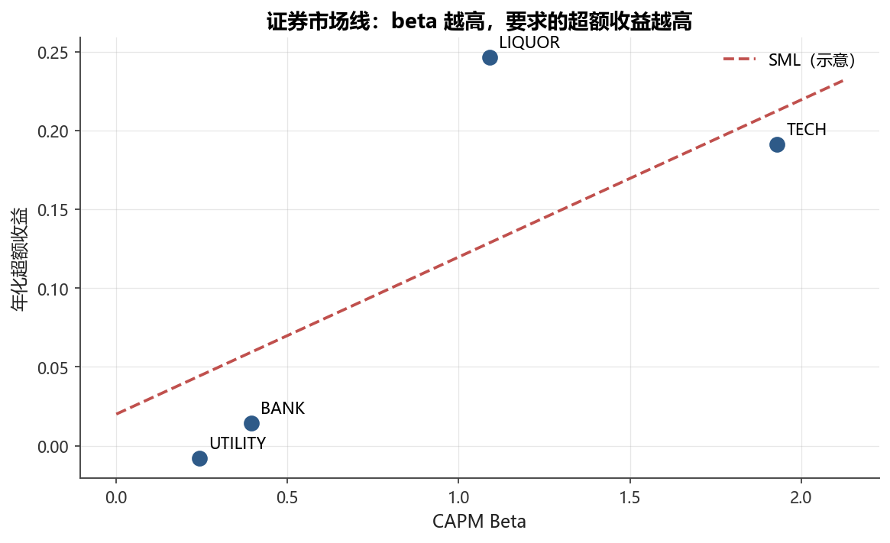
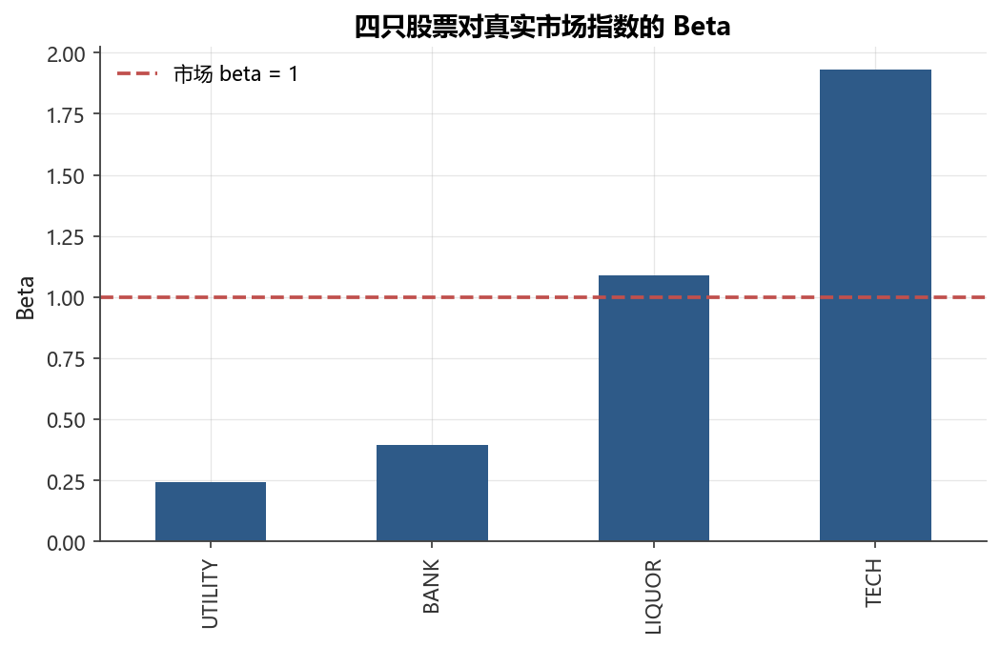

# 第7章 资产定价与因子模型

!!! info "配套代码"
    `notebooks/ch07_factor_models.ipynb`

    运行前请先执行：`uv run python scripts/make_sample_data.py`

---

## 本章导读

“为什么有的股票涨得多、有的涨得少？”这是资产定价理论想要回答的核心问题。
本章从**风险与收益的基本权衡**出发，沿着历史脉络，逐步介绍资产定价领域最
重要的几个里程碑模型：

- **CAPM（资本资产定价模型）**：只用一个因子（市场超额收益）解释股票收益截面差异；
- **Fama-French 三因子模型**：加入规模（SMB）和价值（HML）因子，显著改善拟合；
- **Carhart 四因子**与 **Fama-French 五因子**：进一步纳入动量、盈利和投资因子。

在实操层面，我们将用 Python / statsmodels 对内置数据集做时序回归，估计
$\beta$、$\alpha$ 与因子暴露，并用 IC、分组回测等方法检验因子有效性。
本章使用 `load_market()` 提供的真实市场指数估计 CAPM beta，
用 `load_factors()` 中 MKT/HML 的真实因子展示 FF 三因子回归中
**价值股（BANK/UTILITY）正 HML 载荷、成长股（LIQUOR/TECH）负 HML 载荷**的
显著分化——这是本章的核心实证亮点。
最后，我们专门讨论 A 股市场的若干特殊性，帮助读者在国内实践中少走弯路。

---

## 7.1 学习目标

完成本章学习后，读者应能：

1. 解释系统性风险与非系统性风险的区别，理解分散化的边界；
2. 推导 CAPM 的证券市场线（SML），用时序回归估计 $\beta$ 与 $\alpha$；
3. 理解 Fama-French 三因子（SMB、HML）的经济逻辑和构造方式；
4. 用 statsmodels 做多因子回归，解读摘要中的系数、$t$ 检验和 $R^2$；
5. 了解 Carhart 四因子和 FF 五因子的新增因子含义；
6. 掌握因子模型在业绩归因与 alpha 检验中的应用；
7. 识别 A 股因子构建的独特挑战（壳价值、涨跌停、停牌等）。

---

## 7.2 风险与收益：系统性风险 vs 非系统性风险

### 7.2.1 两类风险

持有一只股票，面临两类风险：

| 风险类型 | 别名 | 来源 | 可否分散 |
|---|---|---|---|
| **系统性风险** | 市场风险、$\beta$ 风险、不可分散风险 | 宏观经济、利率、政策、全球市场情绪 | **不可**分散 |
| **非系统性风险** | 个股风险、特质风险、$\varepsilon$ 风险 | 个别公司的经营、管理层变动、诉讼等 | **可**通过持有多只股票分散 |

### 7.2.2 分散化的数学基础

设有 $N$ 只股票，等权组合的方差为：

$$
\sigma_p^2 = \frac{1}{N} \bar{\sigma}^2 + \frac{N-1}{N} \bar{\sigma}_{ij}
$$

其中 $\bar{\sigma}^2$ 为个股平均方差，$\bar{\sigma}_{ij}$ 为平均协方差。当
$N \to \infty$，第一项趋向 $0$，组合方差趋向平均协方差：

$$
\lim_{N \to \infty} \sigma_p^2 = \bar{\sigma}_{ij}
$$

**结论**：非系统性风险可通过增加持仓数量消除，但系统性风险（平均协方差）
是所有资产共有的，无法靠分散化消除。

!!! tip "直觉理解"
    把鸡蛋放在多个篮子里能防止“某个篮子摔碎”（非系统性风险），但无法
    防止“整个厨房失火”（系统性风险）。

### 7.2.3 风险溢价的本质

理性投资者既然可以通过分散化消除非系统性风险，市场就**不会**为其提供额外
报酬。因此：

> **只有承担系统性风险，才能获得超额报酬（风险溢价）。**

这一思想是 CAPM 以及所有因子模型的根基。

---

## 7.3 CAPM：资本资产定价模型

### 7.3.1 基本假设

CAPM 由 Sharpe（1964）、Lintner（1965）、Mossin（1966）独立提出，核心假设包括：

- 投资者均为均值-方差最优化者（Markowitz 框架）；
- 同质预期：所有投资者看到相同的预期收益、方差与协方差；
- 无摩擦市场：无税费、无交易成本、可以无限卖空；
- 存在无风险资产，所有投资者可按无风险利率 $r_f$ 借贷。

### 7.3.2 推导思路

在上述假设下，均衡时所有投资者持有同一个**切线组合**，该组合就是**市场组合**
$M$（包含所有风险资产，按市值加权）。

每只资产 $i$ 的预期超额收益，由其与市场组合的**协方差**决定：

$$
E[r_i] - r_f = \frac{\text{Cov}(r_i, r_m)}{\text{Var}(r_m)} \cdot \left(E[r_m] - r_f\right)
$$

定义**贝塔**（$\beta$）：

$$
\boxed{\beta_i = \frac{\text{Cov}(r_i, r_m)}{\text{Var}(r_m)}}
$$

于是得到 **CAPM 方程**（证券市场线，SML）：

$$
\boxed{E[r_i] - r_f = \beta_i \cdot \left(E[r_m] - r_f\right)}
$$

### 7.3.3 证券市场线（SML）的含义

<figure markdown>
  { width="680" }
  <figcaption>图 7-1　证券市场线：beta 越高，要求的超额收益越高</figcaption>
</figure>


| 概念 | 含义 |
|---|---|
| $r_f$ | 无风险利率（截距），代表时间价值 |
| $E[r_m] - r_f$ | 市场风险溢价，代表承担单位系统性风险的补偿 |
| $\beta_i$ | 资产 $i$ 的系统性风险量 |
| $E[r_i] - r_f$ | 资产 $i$ 的预期超额收益 |

- $\beta = 0$：与市场无关，预期收益 = $r_f$；
- $\beta = 1$：与市场同步，预期收益 = 市场平均收益；
- $\beta > 1$：比市场波动更大，要求更高的风险溢价；
- $\beta < 0$（罕见，如黄金在危机时）：提供对冲价值，预期收益甚至低于无风险利率。

!!! note "SML vs CML"
    **证券市场线（SML）**以 $\beta$ 为横轴，适用于**单只资产**；
    **资本市场线（CML）**以总波动率 $\sigma$ 为横轴，只适用于**有效组合**。
    个别股票因含非系统性风险，位于 CML 下方，但在均衡时应位于 SML 上。

### 7.3.4 贝塔的估计：时序回归

实践中用**时序回归**估计 $\beta$：

$$
r_{i,t} - r_{f,t} = \alpha_i + \beta_i (r_{m,t} - r_{f,t}) + \varepsilon_{i,t}
$$

其中：

- $\alpha_i$（截距）：CAPM 预测为 **0**；若 $\alpha_i > 0$ 则说明该资产产生了超额 alpha；
- $\beta_i$（斜率）：即贝塔，通常用 36 至 60 个月的月度数据估计；
- $\varepsilon_{i,t}$：残差，代表个股特质风险，均值为 0，与市场因子不相关。

```python
import statsmodels.api as sm
from fds import load_market, load_sample_prices, daily_returns

# 加载真实市场数据与股票数据
market = load_market()
prices = load_sample_prices()
rets   = daily_returns(prices)

# 对齐日期，构造超额收益
common_idx   = rets.index.intersection(market.index)
rf_daily     = market.loc[common_idx, 'rf_daily']     # 真实日度无风险利率
mkt_excess   = market.loc[common_idx, 'index_return'] - rf_daily  # 真实市场超额收益
stock_excess = rets.loc[common_idx, 'TECH'] - rf_daily

# OLS 时序回归
y = stock_excess
X = sm.add_constant(mkt_excess)
result = sm.OLS(y, X).fit()
alpha = result.params['const']
beta  = result.params['index_return']
r2    = result.rsquared
print(result.summary())
```

### 7.3.5 回归结果解读

<figure markdown>
  { width="680" }
  <figcaption>图 7-2　四只股票对真实市场指数的 Beta</figcaption>
</figure>


| 统计量 | 含义 | CAPM 预期 |
|---|---|---|
| `const`（$\alpha$） | 超额 alpha | = 0 |
| 斜率（$\beta$） | 市场敏感度 | 因股而异 |
| $t$-统计量 | 系数是否显著异于 0 | $\|\alpha\text{ }t\text{-stat}\| < 2$ |
| $p$-值 | 显著性概率 | $\alpha$ 的 $p > 0.05$ |
| $R^2$ | 系统性风险占总风险比例 | 越高说明特质风险越小 |

---

## 7.4 CAPM 的实证挑战

CAPM 理论优美，但大量实证研究发现其预测能力不足：

### 7.4.1 低 Beta 异象（Low-Beta Anomaly）

Black、Jensen、Scholes（1972）等研究发现：

- 实际证券市场线**比 CAPM 预测的更平坦**；
- 高 $\beta$ 股票的实际收益**低于** CAPM 预测；
- 低 $\beta$ 股票的实际收益**高于** CAPM 预测。

直觉解释：有杠杆限制的投资者（如基金）会追涨高波动股票，抬高其价格、
压低未来收益；而低 $\beta$ 的稳定资产被低估。

### 7.4.2 规模效应（Size Effect）

Banz（1981）：**小市值股票**（Small-cap）在风险调整后表现好于大市值股票。
原因可能包括：

- 小公司信息不透明，流动性差，需要额外流动性溢价；
- 小公司有更大的经营杠杆弹性（成长期权）。

### 7.4.3 价值效应（Value Effect）

Basu（1977）：**账面市值比（B/M）高的股票**（价值股）优于成长股。
Fama & French（1992）系统证明：B/M 对截面收益率的解释力超过 $\beta$。

### 7.4.4 动量效应（Momentum Effect）

Jegadeesh & Titman（1993）：**过去 3-12 个月表现好的股票**，未来
3-12 个月通常继续表现好。这完全被 CAPM 忽略。

!!! warning "CAPM 的局限性"
    单因子 CAPM 无法解释以下“异象”：规模效应、价值效应、动量效应、
    低波动率异象。这促使学术界和从业者发展出多因子模型。

---

## 7.5 Fama-French 三因子模型

Fama & French（1993）在 CAPM 基础上增加两个因子。
本章使用 `load_factors()` 内置数据集，其中 **MKT 和 HML 基于真实数据构造，结论可信**；
SMB 为合成示意因子。FF3 回归中 HML 载荷的价值/成长分化是本节的亮点实证结论：
BANK（+0.25, $t \approx 10$）、UTILITY（+0.11, $t \approx 6$）呈正载荷（价值股），
LIQUOR（−0.61, $t \approx -17$）、TECH（−1.03, $t \approx -27$）呈负载荷（成长股），
方向高度显著且完全符合 FF 因子的经济学含义。

$$
\boxed{r_{i,t} - r_{f,t} = \alpha_i + \beta_i^{MKT} \cdot MKT_t + \beta_i^{SMB} \cdot SMB_t + \beta_i^{HML} \cdot HML_t + \varepsilon_{i,t}}
$$

### 7.5.1 三个因子的定义

| 因子 | 全称 | 构造逻辑 | 捕获的效应 |
|---|---|---|---|
| **MKT** | Market Excess Return | 市场组合超额收益 | 系统性风险（Beta） |
| **SMB** | Small Minus Big | 小市值组合 − 大市值组合 | 规模效应 |
| **HML** | High Minus Low | 高账面市值比 − 低账面市值比 | 价值效应 |

### 7.5.2 因子的构造方法（6 个组合法）

Fama-French 用 **2×3 双重排序**构造因子：

**第一步：规模二分**——按市值将股票分成大（Big, B）和小（Small, S）两组，
分界线为市值中位数。

**第二步：B/M 三分**——按账面市值比将股票分成低（Low, 30%）、中（Middle, 40%）、
高（High, 30%）三组。

**第三步：形成 6 个组合**：

$$
\begin{array}{|c|c|c|}
\hline
 & \text{Low B/M} & \text{High B/M} \\
\hline
\text{Small} & S/L & S/H \\
\text{Big}   & B/L & B/H \\
\hline
\end{array}
$$

（中间组仅用于分界，不计入因子构造）

$$
SMB = \frac{1}{2}(S/L + S/H) - \frac{1}{2}(B/L + B/H)
$$

$$
HML = \frac{1}{2}(S/H + B/H) - \frac{1}{2}(S/L + B/L)
$$

!!! note "为什么用 6 个组合而不是直接排序？"
    双重排序控制了规模和 B/M 之间的相关性——SMB 在每个 B/M 组内对比大小，
    HML 在每个规模组内对比高低，从而使两个因子尽量正交。

### 7.5.3 经济学解释之争

| 观点 | 代表人 | 解释逻辑 |
|---|---|---|
| **风险定价** | Fama & French | SMB 和 HML 代表真实的经济风险，是系统性风险的补充度量 |
| **行为定价** | Lakonishok 等 | 市场对价值股过度悲观、对成长股过度乐观，定价错误导致异象 |
| **数据挖掘** | 怀疑者 | 因子在样本内表现好，样本外可能衰减 |

---

## 7.6 扩展因子模型

### 7.6.1 Carhart 四因子（1997）

Carhart 在 FF 三因子基础上增加**动量因子**：

$$
r_{i,t} - r_{f,t} = \alpha_i + \beta^{MKT} MKT_t + \beta^{SMB} SMB_t + \beta^{HML} HML_t + \beta^{UMD} UMD_t + \varepsilon_{i,t}
$$

**UMD（Up Minus Down）**，也称 WML（Winners Minus Losers）：

- 每月按过去 2~12 个月累计收益排序（跳过最近 1 个月避免反转效应）；
- 多头：收益前 30%；空头：收益后 30%；
- UMD 每月调仓。

### 7.6.2 Fama-French 五因子（2015）

Fama & French（2015）再增加两个盈利和投资因子：

$$
r_{i,t} - r_{f,t} = \alpha_i + \beta^{MKT} MKT_t + \beta^{SMB} SMB_t + \beta^{HML} HML_t + \beta^{RMW} RMW_t + \beta^{CMA} CMA_t + \varepsilon_{i,t}
$$

| 新增因子 | 全称 | 构造 | 对应“利润表”的发现 |
|---|---|---|---|
| **RMW** | Robust Minus Weak | 高盈利 − 低盈利（按营业利润率排序） | 盈利效应（Novy-Marx 2013） |
| **CMA** | Conservative Minus Aggressive | 低投资 − 高投资（按总资产增长率排序） | 投资效应（Titman et al. 2004） |

!!! note "HML 在五因子中的地位"
    Fama & French（2015）指出，引入 RMW 和 CMA 后，HML 变得冗余（可被其他因子解释），
    但他们仍保留 HML 以保持与三因子模型的可比性。

### 7.6.3 因子模型的“因子动物园”

截至 2020 年代，学术文献中已记录超过 **400 个** “显著”因子（Harvey 等
2016 年称之为“factor zoo”）。实践中选用哪些因子，需要：

1. **理论支撑**：因子背后有合理的经济学故事；
2. **样本外验证**：在独立样本或国际市场中仍然显著；
3. **实施成本**：考虑交易成本后因子是否仍然盈利；
4. **因子相关性**：避免多重共线性，确保新因子提供独立信息。

---

## 7.7 因子模型的应用

### 7.7.1 业绩归因（Performance Attribution）

基金经理的实际收益 $r_p$ 可分解：

$$
r_{p,t} - r_{f,t} = \underbrace{\alpha_p}_{\text{真实alpha}} + \underbrace{\beta^{MKT} MKT_t + \beta^{SMB} SMB_t + \cdots}_{\text{因子暴露收益（beta）}} + \underbrace{\varepsilon_t}_{\text{特质风险}}
$$

- **因子暴露收益**：仅仅是因为持有了特定类型的资产（如偏向小盘），不代表选股能力；
- **真实 $\alpha$**：在控制所有因子暴露后的超额收益，才是衡量主动管理能力的指标。

### 7.7.2 风险分解

因子模型也可以分解组合的**方差来源**：

$$
\text{Var}(r_p) = \underbrace{(\beta^{MKT})^2 \text{Var}(MKT) + (\beta^{SMB})^2 \text{Var}(SMB) + \cdots}_{\text{系统性风险}} + \underbrace{\text{Var}(\varepsilon_p)}_{\text{特质风险}}
$$

风险管理人员可以据此了解哪个因子对组合风险贡献最大，并针对性地对冲。

### 7.7.3 Alpha 检验的统计注意事项

检验 $\alpha$ 是否显著不为 0，需注意：

- **多重检验问题**：同时检验 $N$ 只基金或策略的 $\alpha$，即使都是噪声，也会有约 $5\%$ 的假阳性（用 FDR 或 Bonferroni 矫正）；
- **样本长度**：月度数据检验 $\alpha$ 通常需要 **5 年以上**才有足够的统计功效；
- **$\alpha$ 的衰减**：学术界发现的 $\alpha$ 在发表后往往缩减一半（McLean & Pontiff 2016），部分原因是套利者的参与。

---

## 7.8 多重共线性与因子有效性检验

### 7.8.1 多重共线性问题

多因子模型中，各因子之间往往存在一定相关性（如 SMB 和 HML 在 A 股中相关
性较高），造成：

- 系数估计方差放大（VIF > 10 为严重问题）；
- 各系数 $t$ 值下降，难以判断因子的独立贡献；
- 系数符号甚至可能反转。

**处理方法**：

1. 计算 VIF（方差膨胀因子）：$\text{VIF}_j = \frac{1}{1 - R_j^2}$，其中 $R_j^2$ 是用其他因子回归 $X_j$ 的 $R^2$；
2. 主成分回归（PCR）：将因子正交化后再回归；
3. 岭回归（Ridge）：在高共线性情况下稳定系数估计。

### 7.8.2 因子有效性检验：IC（信息系数）

**IC（Information Coefficient）** 衡量因子预测能力：

$$
IC_t = \text{Corr}\left(\text{因子值}_{t}, r_{t+1}\right)
$$

实践中常用 **Rank-IC**（Spearman 相关），更鲁棒。评价标准：

| IC 绝对值 | 评价 |
|---|---|
| < 0.02 | 基本无效 |
| 0.02 ~ 0.05 | 有一定预测力 |
| > 0.05 | 较强因子 |
| > 0.10 | 非常强（多数机构内部研报的目标） |

**ICIR（IC 信息比）** = $\text{Mean}(IC) / \text{Std}(IC)$，衡量因子信号的稳定性，
通常要求 ICIR > 0.5。

### 7.8.3 因子有效性检验：分组回测

将股票按因子值从小到大排成 $N$ 组（通常 5 组或 10 组），计算每组的平均收益：

- **单调性**：理想情况下组合收益应随因子值单调递增（或递减）；
- **多空组合**：第 $N$ 组 − 第 $1$ 组的收益（Long-Short），若显著正收益说明因子有效；
- **夏普比率**：多空组合的年化夏普应 > 0.5（简单实现）或 > 1（考虑成本后）。

---

## 7.9 A 股因子构建的特殊性

!!! warning "A 股市场的特殊情况"
    直接把美股因子研究结论搬到 A 股，往往会遭遇“水土不服”。
    以下几点是 A 股量化实践中必须关注的。

### 7.9.1 壳价值与小市值异象

A 股小市值因子曾经极为有效，但其背后驱动力与美股不同：

- **壳资源溢价**：A 股 IPO 审批制下，上市资格（“壳”）本身具有价值，而最小的上市公司最可能被借壳或重组，因此获得额外溢价；
- **注册制改革**（2019 年科创板以来逐步推进）：IPO 速度加快，壳价值下降，小市值因子有效性明显减弱。

### 7.9.2 涨跌停与价格非连续性

A 股实行 ±10%（科创板 ±20%）的日涨跌停机制：

- **流动性假信号**：涨停时成交量急剧萎缩，收盘价不反映真实买方意愿；
- **因子计算偏差**：用收盘价计算日收益率，会在连续涨停/跌停时产生异常值；
- **处理方法**：剔除涨跌停日的成交量数据，或用 VWAP / 次日开盘价替代。

### 7.9.3 停牌问题

A 股长期停牌（数月甚至数年）现象曾较为普遍：

- **收益率缺失**：停牌期间收益率为 0，复牌后出现大幅跳升，扭曲因子计算；
- **处理方法**：停牌超过 N 天（通常 20 天）的股票在该期间剔除出回测样本。

### 7.9.4 行业集中与因子暴露

A 股行业分布高度不均衡（银行/地产等权重大），部分因子实际上是在做**行业暴露**
而非真正的个股选择：

- **行业中性化**：在计算因子时对每个行业内分别打分（z-score），消除行业影响；
- **市值中性化**：类似地，对规模效应进行中性化，避免因子与市值高度相关。

### 7.9.5 政策影响

A 股受政策影响大，部分“因子”本质上是政策受益主题（如“一带一路”概念、
新能源政策支持等），这类因子：

- 时效性强（政策窗口过后衰减快）；
- 难以在事前准确预测政策方向；
- 适合作为**事件驱动策略**而非系统性因子。

### 7.9.6 常用 A 股因子数据库

| 数据库 | 提供方 | 特点 |
|---|---|---|
| CSMAR | 深圳国泰安 | 学术研究主流，数据质量高，覆盖 1990s 至今 |
| 锐思数据（RESSET） | 北京锐思 | 覆盖全面，提供因子库 |
| Wind 万得 | 上海万得 | 行业标准，机构广泛使用，价格较高 |
| Tushare Pro | 开源社区 | 免费/低成本，适合学习和中小机构 |
| AkShare | 开源 | 纯开源，聚合多数据源 |

---

## 7.10 本章小结

| 模型 | 因子 | $R^2$（典型） | 主要局限 |
|---|---|---|---|
| CAPM | MKT | 0.2 ~ 0.4 | 无法解释规模/价值/动量效应 |
| FF 三因子 | MKT、SMB、HML | 0.6 ~ 0.8 | 忽略动量 |
| Carhart 四因子 | + UMD | 0.7 ~ 0.85 | 动量在大市值股中可能弱化 |
| FF 五因子 | + RMW、CMA | 0.75 ~ 0.90 | HML 冗余，未纳入动量 |

**核心要点**：

1. 系统性风险不可分散，是风险溢价的来源；
2. CAPM 的 $\beta$ 来自时序回归，$\alpha \ne 0$ 代表超额收益；
   用真实市场指数估计的 beta：UTILITY 0.24 < BANK 0.39 < LIQUOR 1.09 < TECH 1.93；
3. FF 三因子（SMB、HML）用双重排序构造，捕获规模和价值效应；
   HML 载荷的价值/成长分化（真实数据）：银行/公用事业正载荷，白酒/科技负载荷，高度显著；
4. 多因子模型可用于业绩归因和风险分解；
5. A 股有壳价值、涨跌停、停牌等特殊性，直接套用美股因子需谨慎；
6. 因子有效性用 IC 和分组回测检验，需注意多重共线性。

---

## 7.11 习题

**习题 7.1** 设 $r_f = 2\%$，市场预期收益 $E[r_m] = 8\%$，某股票 $\beta = 1.4$。
根据 CAPM，该股票的预期收益率是多少？若实际观测到年化收益 $12\%$，该股票的 alpha 是多少？请给出代数推导过程。

??? hint "参考思路"
    $E[r_i] = r_f + \beta_i (E[r_m] - r_f) = 2\% + 1.4 \times 6\% = 10.4\%$。
    实际 alpha = $12\% - 10.4\% = 1.6\%$（年化）。

**习题 7.2** 用 `load_market()` 提供的真实市场指数，对每只股票做时序 OLS 回归，估计各自的 $\beta$ 和 $\alpha$。哪只股票 $\beta$ 最高？CAPM 下哪只股票的预期收益最高？

??? hint "参考思路"
    参考 notebook Cell 4 的实现，重点关注 `result.summary()` 中的系数和 $t$ 统计量。参考值：UTILITY≈0.24, BANK≈0.39, LIQUOR≈1.09, TECH≈1.93；TECH beta 最高，CAPM 预期收益最高。

**习题 7.3** 从回归结果的 $R^2$ 分析各股票的系统性风险与特质风险占比。波动率最高的股票，$R^2$ 是否也最高？请给出解释。

??? hint "参考思路"
    $R^2$ 反映系统性风险占总方差的比例，$1 - R^2$ 代表特质风险占比。高波动率不一定有高 $R^2$；如果高波动主要来自特质风险，$R^2$ 可能反而较低。

**习题 7.4** 在多因子回归中，若两个因子高度相关（如 Pearson 相关系数 > 0.8），对回归结果会产生什么影响？请从 VIF、$t$ 统计量两个角度分析，并提出两种解决方案。

??? hint "参考思路"
    高相关因子导致 VIF 升高（严重时 > 10），各因子系数 $t$ 值下降，置信区间变宽，难以分辨各因子的独立贡献。解决方案：（1）正交化因子（Gram-Schmidt）；（2）删除冗余因子或使用岭回归。

**习题 7.5** （思考题）若 A 股某量化基金声称其“价值因子”有效，年化 IC = 0.04，ICIR = 0.8。请分析：该基金的价值因子是否算“有效”？需要多长的历史数据才能在统计上验证其显著性？又应警惕哪些 A 股特有的陷阱？

??? hint "参考思路"
    IC = 0.04 在可接受范围（0.02~0.05），ICIR = 0.8 较高（通常要求 > 0.5），说明因子稳定。显著性检验：$t = \text{ICIR} \times \sqrt{T}$，要达到 $t > 2$ 需要 $T > (2/0.8)^2 = 6.25$，即约 7 个月月度数据，但实践中建议 3 年以上。A 股陷阱：壳价值驱动、行业集中、停牌/涨跌停扭曲、过拟合 A 股历史窗口（2014-2015 牛市、2018 熊市等极端行情）。

---

## 7.12 拓展阅读

| 文献 | 核心贡献 |
|---|---|
| Sharpe, W. F. (1964). *Capital asset prices: A theory of market equilibrium*. **JF** 19(3). | CAPM 原始论文 |
| Fama, E. F., & French, K. R. (1993). *Common risk factors in the returns on stocks and bonds*. **JFE** 33(1). | FF 三因子模型 |
| Carhart, M. M. (1997). *On persistence in mutual fund performance*. **JF** 52(1). | 四因子动量 |
| Fama, E. F., & French, K. R. (2015). *A five-factor asset pricing model*. **JFE** 116(1). | FF 五因子 |
| Harvey, C. R., Liu, Y., & Zhu, H. (2016). *… and the cross-section of expected returns*. **RFS** 29(1). | “因子动物园”问题 |
| McLean, R. D., & Pontiff, J. (2016). *Does academic research destroy stock return predictability?* **JF** 71(1). | 发表后 alpha 衰减 |
| 刘煜辉、蒋卓鸿（2018）：《A 股量化因子有效性研究》，**证券市场导报**。 | A 股因子文献综述（中文） |

---

!!! note "数据说明"
    本章 notebook 全部使用内置数据集，**完全离线可跑**：
    
    1. **股票价格**（`load_sample_prices()`）：4 只 A 股风格资产（BANK/LIQUOR/TECH/UTILITY），约 750 个交易日。
    2. **市场数据**（`load_market()`）：真实市场指数日收益与无风险利率（`rf_daily`），用于 CAPM 时序回归。4 只股票对该指数有真实 beta。
    3. **因子数据**（`load_factors()`）：749 行日度数据。其中 `MKT`（市场超额收益）与 `HML`（价值−成长多空构造）**基于真实数据，结论可信**；`SMB` 和 `MOM` 为**合成示意因子**（本股票池仅4只、无市值/动量数据，无法真实构造），仅用于演示多因子回归的操作流程，不代表真实 A 股结论。如需完整真实因子，请参见附录C数据字典，或从 CSMAR、Wind 获取。
