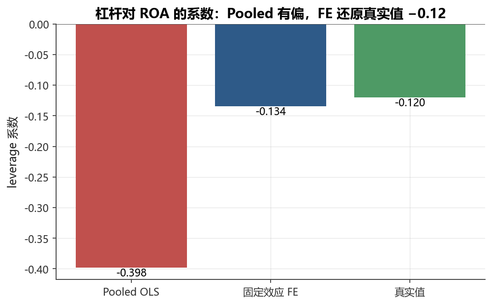

# 第8章 面板数据与回归

[](https://colab.research.google.com/github/albertandking/financial-data-science/blob/main/notebooks/ch08_panel_regression.ipynb) [](https://mybinder.org/v2/gh/albertandking/financial-data-science/main?labpath=notebooks/ch08_panel_regression.ipynb)

!!! info "配套代码"
    本章示例可在配套示例 中运行，主要使用 linearmodels 与 statsmodels。实战部分采用内置财务面板数据集 `fundamentals`，并预设已知系数与公司固定效应，便于检验 FE 估计能否还原真实参数。离线即可完成。

---

## 8.1 本章导读与学习目标

金融研究中最常见的数据结构，既不是纯截面（某年所有公司的一张快照），也不是纯时间序列（某只股票逐日收益），而是**面板数据**（Panel Data）——同时跨越多个个体（公司、股票、国家……）和多个时间点。典型例子：

- **公司-年度面板**：2010—2023年 A 股上市公司的财务指标（资产负债率、ROA、营收增长率……）
- **股票-月度面板**：沪深300成分股每月的收益率、市值、账面市值比（用于 Fama-French 因子模型）
- **基金-季度面板**：公募基金季报披露的持仓、规模与业绩

面板数据的核心优势在于它同时具备**横截面差异**与**时间维度变化**两个维度，这让研究者能够“控制住那些随个体变化但不随时间变化的不可观测因素”——这正是 OLS 最头疼的遗漏变量问题。

**学习目标**

完成本章学习后，读者应能：

1. 识别面板数据的结构（MultiIndex、平衡 vs 非平衡），并会用 `pandas` 构造标准格式；
2. 解释混合 OLS 忽略个体异质性所导致的偏误来源；
3. 推导固定效应（FE）“组内变换”的代数逻辑，理解为什么它能消除不可观测的个体效应；
4. 区分随机效应（RE）与 FE 的假设差异，会运行 Hausman 检验做模型选择；
5. 理解金融面板为何几乎总要使用聚类稳健标准误，会在 `linearmodels` 中指定 `cov_type="clustered"`；
6. 使用 `linearmodels` 跑 Pooled OLS / FE / RE 并横向对比系数与标准误；
7. 认识内生性问题的两种来源（遗漏变量、双向因果），理解 FE 能解决哪一类、不能解决哪一类。

---

## 8.2 面板数据结构

### 8.2.1 个体 × 时间的二维表格

设我们观测 $N$ 个个体（entity，如公司），每个个体在 $T$ 个时间点均有记录。观测值用下标 $(i, t)$ 表示：$i = 1, \ldots, N$；$t = 1, \ldots, T$。

| 变量 | 含义 |
|------|------|
| $y_{it}$ | 因变量（如 ROA） |
| $\mathbf{x}_{it}$ | 自变量向量（如杠杆率、规模） |
| $\alpha_i$ | **个体固定效应**（不随时间变化，不可直接观测） |
| $\lambda_t$ | **时间固定效应**（不随个体变化，如宏观冲击） |
| $u_{it}$ | 纯随机误差 |

一个完整的双向固定效应模型写为：

$$y_{it} = \mathbf{x}_{it}^{\prime} \boldsymbol{\beta} + \alpha_i + \lambda_t + u_{it}$$

其中 $\alpha_i$ 和 $\lambda_t$ 都是未知参数，由数据识别。

### 8.2.2 平衡面板 vs 非平衡面板

**平衡面板（Balanced Panel）**：每个个体在所有 $T$ 个时间点均有记录，共 $N \times T$ 个观测。**非平衡面板（Unbalanced Panel）**：部分个体在某些时间点缺失（如新上市公司、退市公司）。

!!! warning "非平衡面板的处理"
    非平衡面板在金融中极为常见（公司上市/退市、股票停牌等）。`linearmodels` 能自动处理非平衡面板；注意**生存偏差**问题——如果只保留全程存活的公司，估计结果会偏向“好公司”。

### 8.2.3 与截面/时序数据的比较

| 维度 | 截面数据 | 时间序列 | 面板数据 |
|------|----------|----------|----------|
| 观测轴 | 个体 $i$ | 时间 $t$ | 个体 × 时间 $(i,t)$ |
| 样本量 | $N$ | $T$ | $N \times T$（或更少） |
| 个体异质性 | 无法控制 | 单一个体 | **可通过 FE 控制** |
| 时间趋势 | 无 | 直接观测 | 可通过时间 FE 控制 |
| 典型问题 | 遗漏变量偏误 | 自相关/单位根 | 异方差 + 序列相关 + 截面相关 |

### 8.2.4 pandas MultiIndex 表示

在 Python 中，面板数据以 `(entity, time)` 的 **MultiIndex** DataFrame 表示：

```python
# 构造标准面板 DataFrame
panel = pd.DataFrame({...}, index=pd.MultiIndex.from_tuples(
    [(entity_id, year), ...], names=['entity', 'time']
))
```

`linearmodels` 要求数据必须有两层 MultiIndex，且第一层为个体、第二层为时间。

---

## 8.3 混合 OLS（Pooled OLS）及其问题

### 8.3.1 模型设定

最朴素的做法是**忽略面板结构**，把所有 $N \times T$ 个观测当作独立的截面数据来做 OLS：

$$y_{it} = \mathbf{x}_{it}^{\prime} \boldsymbol{\beta} + \varepsilon_{it}$$

其中 $\varepsilon_{it} = \alpha_i + u_{it}$——把个体效应 $\alpha_i$ 丢进了误差项。

### 8.3.2 忽略个体异质性的危害

**问题1：遗漏变量偏误（Omitted Variable Bias）**

若 $\alpha_i$（不可观测的个体特征，如公司管理层能力、行业地位）与 $\mathbf{x}_{it}$ 相关，则 $\text{Cov}(\mathbf{x}_{it}, \varepsilon_{it}) \neq 0$，OLS 估计量 $\hat{\boldsymbol{\beta}}_{\text{OLS}}$ **不一致**，存在系统性偏误。

以杠杆率（leverage）对 ROA 的影响为例：高质量公司（$\alpha_i$ 大）可能同时有更高的 ROA 和更保守的杠杆，导致 Pooled OLS 高估杠杆率的负效应（或低估正效应）。

**问题2：标准误严重低估**

同一公司的多个观测（$t = 1, 2, \ldots$）高度相关，误差项存在序列相关。若用 OLS 假定误差独立，标准误会被**严重低估**，导致 t 统计量虚高，大量假显著。

### 8.3.3 Pooled OLS 的适用前提

只有在 $\alpha_i$ **不与** $\mathbf{x}_{it}$ 相关，且 $\alpha_i$ 仅是随机噪声时，Pooled OLS 才是一致的（这正是随机效应模型的前提）。

### 8.3.4 偏误来源的代数推导

前一节用文字描述了“遗漏变量偏误”，本节把它写成可以逐项核对的代数式，让读者看清楚偏误的**符号**与**大小**究竟由什么决定。

考虑单变量情形 $y_{it} = \beta x_{it} + \alpha_i + u_{it}$，其中我们假定 $u_{it}$ 与 $x_{it}$ 严格外生（$\mathrm{Cov}(x_{it}, u_{it})=0$），唯一的麻烦来自被丢进误差项的 $\alpha_i$。Pooled OLS 把模型写成 $y_{it} = \beta x_{it} + \varepsilon_{it}$，其中 $\varepsilon_{it} = \alpha_i + u_{it}$。一元 OLS 估计量的概率极限为：

$$\operatorname*{plim} \hat{\beta}_{\text{Pooled}} = \beta + \frac{\mathrm{Cov}(x_{it}, \varepsilon_{it})}{\mathrm{Var}(x_{it})} = \beta + \frac{\mathrm{Cov}(x_{it}, \alpha_i)}{\mathrm{Var}(x_{it})}$$

最后一步用到了 $\mathrm{Cov}(x_{it}, u_{it})=0$。于是**渐近偏误**整理为：

$$\text{Bias} = \operatorname*{plim} \hat{\beta}_{\text{Pooled}} - \beta = \frac{\mathrm{Cov}(x_{it}, \alpha_i)}{\mathrm{Var}(x_{it})}$$

这条公式有三点值得品味：其一，偏误的**符号**由 $\mathrm{Cov}(x_{it}, \alpha_i)$ 决定——本章案例中 $x=\text{leverage}$ 与 $\alpha_i$（盈利能力）负相关，故偏误为负，使 $\hat{\beta}$ 比真值 $-0.12$ 更负；其二，偏误的**大小**与 $x$ 的离散程度成反比，$x$ 变异越大、偏误越被“摊薄”；其三，只要 $\mathrm{Cov}(x_{it}, \alpha_i)=0$，偏误归零，Pooled OLS 一致——这正是8.3.3节适用前提的代数版本。

!!! example "例8.1：手算 Pooled OLS 偏误的符号与近似量级"
    设杠杆率 $x$ 标准化后 $\mathrm{Var}(x)=1$。数据生成过程内置“高盈利能力公司低杠杆”，对应 $\mathrm{Cov}(x, \alpha_i) = -0.28$。代入偏误公式：
    $\text{Bias} = \frac{-0.28}{1} = -0.28$
    于是 $\operatorname*{plim}\hat{\beta}_{\text{Pooled}} = \beta + \text{Bias} = -0.12 + (-0.28) = -0.40$。这与8.9.2节实验所得 $\hat{\beta}_{\text{Pooled}} \approx -0.40$ 完全吻合：Pooled OLS 把 $\alpha_i$ 对 ROA 的正贡献错误地“记账”到低杠杆头上，从而把杠杆的负效应夸大了约3倍。读者由此可见，“偏误”并非玄学，而是 $\mathrm{Cov}(x,\alpha_i)\neq 0$ 这一项的直接后果。

---

## 8.4 固定效应模型（Fixed Effects）

### 8.4.1 个体固定效应

**模型：**

$$y_{it} = \mathbf{x}_{it}^{\prime} \boldsymbol{\beta} + \alpha_i + u_{it}$$

其中 $\alpha_i$ 为**个体特定常数**，可与 $\mathbf{x}_{it}$ 任意相关——这是 FE 的关键优势。

**估计思路——“组内变换”（Within Transformation）**

对个体 $i$ 取时间均值：

$$\bar{y}_{i\cdot} = \bar{\mathbf{x}}_{i\cdot}^{\prime} \boldsymbol{\beta} + \alpha_i + \bar{u}_{i\cdot}$$

用原式减去均值式，消去 $\alpha_i$：

$$\underbrace{y_{it} - \bar{y}_{i\cdot}}_{\tilde{y}_{it}} = \underbrace{(\mathbf{x}_{it} - \bar{\mathbf{x}}_{i\cdot})^{\prime}}_{\tilde{\mathbf{x}}_{it}^{\prime}} \boldsymbol{\beta} + \underbrace{u_{it} - \bar{u}_{i\cdot}}_{\tilde{u}_{it}}$$

对变换后的数据跑 OLS，即得 **组内（Within）估计量** $\hat{\boldsymbol{\beta}}_{\text{FE}}$。

!!! tip "直觉理解"
    组内变换把所有变量“中心化”到各公司自身的均值上，相当于“用公司自己和自己比”，从而排除了公司间不可观测差异（$\alpha_i$）的干扰。FE 只利用**组内（within）变异**，忽略**组间（between）变异**。

**自由度损失**：FE 估计 $N$ 个个体虚拟变量，消耗 $N$ 个自由度，在 $T$ 很小、$N$ 很大时效率损失较大。

### 8.4.2 时间固定效应

$$y_{it} = \mathbf{x}_{it}^{\prime} \boldsymbol{\beta} + \lambda_t + u_{it}$$

控制宏观冲击（利率变化、金融危机）等**共同时间趋势**。对 $t$ 做时间中心化后估计。

### 8.4.3 双向固定效应（Two-Way FE）

$$y_{it} = \mathbf{x}_{it}^{\prime} \boldsymbol{\beta} + \alpha_i + \lambda_t + u_{it}$$

同时控制个体效应和时间效应，是公司金融实证研究的标准配置。在 `linearmodels` 中：

```python
PanelOLS(y, X, entity_effects=True, time_effects=True).fit(
    cov_type="clustered", cluster_entity=True
)
```

!!! note "FE 能识别什么？"
    FE 只能估计**随时间变化**的自变量对因变量的影响。**不随时间变化的变量**（如行业代码、公司注册地）会被 $\alpha_i$ 完全吸收，系数无法识别。这是 FE 的根本局限。

### 8.4.4 组内变换消去 $\alpha_i$ 的逐步推导

8.4.1节给出了组内变换的三行公式，但许多初学者仍会怀疑：“凭什么减去均值就能让一个**未知**的 $\alpha_i$ 凭空消失？”本节把推导拆成可逐项核对的步骤。

从个体 $i$ 的第 $t$ 期模型出发（为简洁取单变量）：

$$y_{it} = \beta x_{it} + \alpha_i + u_{it} \tag{1}$$

对个体 $i$ 在其全部 $T$ 期上取**时间均值**。注意求平均是对下标 $t$ 求和再除以 $T$，而 $\alpha_i$ 不含下标 $t$，是个常数，故 $\frac{1}{T}\sum_{t=1}^{T}\alpha_i = \alpha_i$：

$$\bar{y}_{i\cdot} = \beta \bar{x}_{i\cdot} + \alpha_i + \bar{u}_{i\cdot} \tag{2}$$

关键就在这一步：**$\alpha_i$ 取均值后仍是它自己**。式 (1) 减去式 (2)：

$$y_{it} - \bar{y}_{i\cdot} = \beta(x_{it} - \bar{x}_{i\cdot}) + \underbrace{(\alpha_i - \alpha_i)}_{=\,0} + (u_{it} - \bar{u}_{i\cdot}) \tag{3}$$

$\alpha_i$ 项相减为零，**彻底退出方程**。记 $\tilde{y}_{it} = y_{it} - \bar{y}_{i\cdot}$、$\tilde{x}_{it} = x_{it} - \bar{x}_{i\cdot}$，则 $\tilde{y}_{it} = \beta \tilde{x}_{it} + \tilde{u}_{it}$，对去均值后的数据做 OLS 即得 FE 估计量：

$$\hat{\beta}_{\text{FE}} = \frac{\sum_i \sum_t \tilde{x}_{it}\,\tilde{y}_{it}}{\sum_i \sum_t \tilde{x}_{it}^2}$$

由于 $\tilde{x}_{it}$ 只含**组内变异**（每个公司围绕自身均值的波动），不再与公司层面的 $\alpha_i$ 沾边，故无论 $\alpha_i$ 是否与 $x$ 相关，$\hat{\beta}_{\text{FE}}$ 都一致——这正是 FE 相对 Pooled OLS 的根本优势。同时也立刻看出 FE 的死穴：若 $x_{it}=x_i$ 不随时间变化，则 $\tilde{x}_{it}=x_i-x_i=0$，分母为零，系数无从识别。

!!! example "例8.2：2公司 × 3年小面板手算组内变换与 FE 估计"
    考虑一个最小可手算的平衡面板（$N=2$, $T=3$），因变量 $y$（ROA，%）、自变量 $x$（杠杆率，%）：

    | 公司 | 年 | $x_{it}$ | $y_{it}$ |
    |------|----|---------|---------|
    | A | 1 | 30 | 12 |
    | A | 2 | 40 | 10 |
    | A | 3 | 50 | 8 |
    | B | 1 | 20 | 22 |
    | B | 2 | 30 | 20 |
    | B | 3 | 40 | 18 |

    **第一步：算各公司均值。** 公司 A：$\bar{x}_A = (30+40+50)/3 = 40$，$\bar{y}_A = (12+10+8)/3 = 10$。公司 B：$\bar{x}_B = (20+30+40)/3 = 30$，$\bar{y}_B = (22+20+18)/3 = 20$。

    **第二步：去均值（组内变换）。**

    | 公司 | 年 | $\tilde{x}_{it}$ | $\tilde{y}_{it}$ |
    |------|----|------------------|------------------|
    | A | 1 | $-10$ | $+2$ |
    | A | 2 | $0$ | $0$ |
    | A | 3 | $+10$ | $-2$ |
    | B | 1 | $-10$ | $+2$ |
    | B | 2 | $0$ | $0$ |
    | B | 3 | $+10$ | $-2$ |

    **第三步：在去均值数据上做无截距 OLS。**
    $\sum \tilde{x}\tilde{y} = (-10)(2)+0+(10)(-2)+(-10)(2)+0+(10)(-2) = -80$
    $\sum \tilde{x}^2 = 100+0+100+100+0+100 = 400$
    $\hat{\beta}_{\text{FE}} = \frac{-80}{400} = -0.20$

    **第四步：对照 Pooled OLS 看偏误。** 全样本均值 $\bar{x}=35$、$\bar{y}=15$。逐点偏差乘积之和 $\sum(x-\bar{x})(y-\bar{y})$：A 公司三点 $(-5)(-3)+(5)(-5)+(15)(-7)=15-25-105=-115$；B 公司三点 $(-15)(7)+(-5)(5)+(5)(3)=-105-25+15=-115$，合计 $-230$。$\sum(x-\bar{x})^2 = 25+25+225+225+25+25 = 550$。故
    $\hat{\beta}_{\text{Pooled}} = \frac{-230}{550} \approx -0.42$
    **解读**：公司 B 整体杠杆更低（均值30 < 40）却 ROA 更高（均值20 > 10），这部分**组间差异**正是 $\alpha_i$ 在作怪。Pooled OLS 把这条向下倾斜的“组间云”也算进斜率，得到 $-0.42$；FE 先把两家公司各自拉回原点、只看组内的 $\tilde{x}$–$\tilde{y}$ 关系，得到更干净的 $-0.20$。一个6行的小表，就把“Pooled 有偏、FE 还原”的故事算到了小数点后两位。

!!! example "例8.3：个体固定效应吸收不随时间变量的演示"
    沿用例8.2的两家公司，再加一个**不随时间变化**的虚拟变量 $d_i$（如“是否国企”）：公司 A 为 $d_A=1$，公司 B 为 $d_B=0$，三年都不变。试图把它放进 FE 模型 $y_{it}=\beta x_{it}+\gamma d_i+\alpha_i+u_{it}$。

    对 $d_i$ 做组内变换：$\bar{d}_{A\cdot}=(1+1+1)/3=1$，故 $\tilde{d}_{A,t}=1-1=0$；同理 $\tilde{d}_{B,t}=0-0=0$。**$d_i$ 在所有6个观测上全部被去成0**，整列归零，设计矩阵出现完全共线，$\gamma$ 根本无法估计。这从数值上印证了8.4节末尾的论断：国企属性、行业、注册地这类“一辈子不变”的特征，会被个体效应 $\alpha_i$ 一口吞下。若研究者偏要估 $d_i$ 的效应，只能放弃 FE、改用 RE 或带交互项（$d_i \times \text{时间}$，制造组内变异）的设定。

---

## 8.5 随机效应模型（Random Effects）

### 8.5.1 模型假设

RE 模型与 FE 同形：

$$y_{it} = \mathbf{x}_{it}^{\prime} \boldsymbol{\beta} + \alpha_i + u_{it}$$

但核心假设不同：

$$\alpha_i \overset{\text{iid}}{\sim} (0, \sigma_\alpha^2), \quad u_{it} \overset{\text{iid}}{\sim} (0, \sigma_u^2), \quad \text{且} \quad \text{Cov}(\mathbf{x}_{it}, \alpha_i) = 0$$

$\alpha_i$ 被视为**随机干扰项的一部分**，而非固定参数，因此个体效应可以与截面数据的协变量“分享”信息。

### 8.5.2 GLS 估计

合并误差 $v_{it} = \alpha_i + u_{it}$ 不是 iid 的：

$$\text{Var}(v_{it}) = \sigma_\alpha^2 + \sigma_u^2, \quad \text{Cov}(v_{it}, v_{is}) = \sigma_\alpha^2 \quad (t \neq s)$$

RE 使用**广义最小二乘（GLS）**，对“组内相关”做加权处理。等价于在变换后的数据上做 OLS，其中变换参数为：

$$\theta = 1 - \sqrt{\frac{\sigma_u^2}{\sigma_u^2 + T\sigma_\alpha^2}}$$

RE 的变换介于**不做变换（Pooled OLS，$\theta=0$）**和**完全组内变换（FE，$\theta=1$）**之间，因此 RE 利用了组间和组内两部分变异，在 $\text{Cov}(\mathbf{x}_{it}, \alpha_i) = 0$ 成立时**比 FE 更有效率**。

### 8.5.3 FE vs RE：核心权衡

| 维度 | 固定效应（FE） | 随机效应（RE） |
|------|----------------|----------------|
| $\alpha_i$ 与 $\mathbf{x}_{it}$ 的关系 | 可以相关 | **必须不相关** |
| 一致性 | 无论相关与否均一致 | 若相关则**不一致** |
| 效率 | 若 RE 假设成立，效率较低 | 若假设成立，效率更高 |
| 不随时间变化的变量 | **不可估计** | 可估计 |
| 典型适用场景 | 公司 FE（管理层质量与杠杆相关） | 若有强理论保证不相关 |

### 8.5.4 RE 变换参数 $\theta$ 的来源与两个极端

8.5.2节直接给出了 GLS 变换参数 $\theta$ 的公式，本节解释它从何而来，以及为什么说 RE 是“Pooled 与 FE 之间的折中”。

RE 的本质是对合并误差 $v_{it}=\alpha_i+u_{it}$ 的协方差结构做**准去均值**（quasi-demeaning）变换。可以证明，对每个变量做如下变换后再跑 OLS，即得 RE 的 GLS 估计：

$$y_{it}^{*} = y_{it} - \theta\,\bar{y}_{i\cdot}, \qquad x_{it}^{*} = x_{it} - \theta\,\bar{x}_{i\cdot}$$

注意这里减去的是 $\theta$ 倍的组内均值，而非像 FE 那样减去**整整一份**均值。变换系数为：

$$\theta = 1 - \sqrt{\frac{\sigma_u^2}{\sigma_u^2 + T\sigma_\alpha^2}}$$

它的形式直接源自合并误差的方差分解：个体效应方差 $\sigma_\alpha^2$ 占比越大、时间跨度 $T$ 越长，组内相关越严重，就越需要把组内均值“减掉更多”，故 $\theta$ 越接近1。把两个极端代入即可看清 RE 的中间地位：

- **当 $\sigma_\alpha^2 \to 0$**（没有个体效应）：根号内 $\to 1$，$\theta \to 0$，变换退化为 $y_{it}^{*}=y_{it}$，即**不做任何去均值**——这正是 Pooled OLS。
- **当 $\sigma_\alpha^2 \to \infty$ 或 $T \to \infty$**（个体效应主导）：根号内 $\to 0$，$\theta \to 1$，变换退化为减去整份均值——这正是 **FE 的组内变换**。

因此 $\theta \in (0,1)$ 度量了模型“向 FE 靠拢”的程度。当 $\mathrm{Cov}(x_{it},\alpha_i)=0$ 成立时，RE 既利用组内变异、又利用组间变异，比只用组内变异的 FE 更有效率；但只要该假设被违反，部分保留的组间变异就会把 $\alpha_i$ 的偏误重新带入估计——这正是本章案例中 RE“介于两者之间、仍有偏”的根源。

!!! example "例8.4：手算 RE 变换系数 $\theta$"
    设某公司-年度面板方差分量估计为 $\hat{\sigma}_u^2 = 4$、$\hat{\sigma}_\alpha^2 = 3$，时间跨度 $T=8$（与内置 `fundamentals` 一致）。代入：
    $\theta = 1 - \sqrt{\frac{4}{4 + 8 \times 3}} = 1 - \sqrt{\frac{4}{28}} = 1 - \sqrt{0.1429} \approx 1 - 0.378 = 0.622$
    解读：$\theta \approx 0.62$ 偏向1，说明个体效应相当可观，RE 的变换已“大半像 FE”。若把 $T$ 改小为2，则 $\theta = 1-\sqrt{4/10}\approx 0.368$，更靠近 Pooled——时间越短，RE 越像把所有观测一锅烩。这解释了为何**短面板**里 FE 与 RE 的系数差距往往更小，而**长面板**里两者分歧更明显。

---

## 8.6 Hausman 检验

### 8.6.1 原理

Hausman（1978）提出了一个系统性检验：

- **原假设 $H_0$**：$\text{Cov}(\mathbf{x}_{it}, \alpha_i) = 0$，RE 假设成立；FE 与 RE 均一致，RE 更有效率。
- **备择假设 $H_1$**：$\text{Cov}(\mathbf{x}_{it}, \alpha_i) \neq 0$；仅 FE 一致，RE 不一致，应选 FE。

检验统计量：

$$H = (\hat{\boldsymbol{\beta}}_{\text{FE}} - \hat{\boldsymbol{\beta}}_{\text{RE}})^{\prime} \left[\widehat{\text{Var}}(\hat{\boldsymbol{\beta}}_{\text{FE}}) - \widehat{\text{Var}}(\hat{\boldsymbol{\beta}}_{\text{RE}})\right]^{-1} (\hat{\boldsymbol{\beta}}_{\text{FE}} - \hat{\boldsymbol{\beta}}_{\text{RE}}) \overset{H_0}{\sim} \chi^2(k)$$

其中 $k$ 为时变自变量的个数。**拒绝 $H_0$**（p 值小）→ 选 FE；**不能拒绝 $H_0$** → FE 与 RE 一致，可选更有效率的 RE。

### 8.6.2 实践中的注意事项

!!! warning "Hausman 检验的局限"
    1. Hausman 检验对**聚类标准误**不敏感，传统版本假定同方差。在金融面板（有序列相关）中，检验结论有时不稳健。
    2. 即使 Hausman 检验不显著，公司金融研究者通常**仍倾向于使用 FE**，因为“管理层能力与财务决策相关”几乎是行业共识。
    3. Hausman 检验只是辅助工具，最终选择应结合**经济直觉**和**鲁棒性检验**。

### 8.6.3 单系数 Hausman 检验的手算与判读

8.6.1节的 Hausman 统计量是矩阵形式，初学者常被吓退。当只关心**一个**关键系数（如本章的 `leverage`）时，统计量退化为一个非常直观的标量公式，便于手算：

$$H = \frac{(\hat{\beta}_{\text{FE}} - \hat{\beta}_{\text{RE}})^2}{\widehat{\mathrm{Var}}(\hat{\beta}_{\text{FE}}) - \widehat{\mathrm{Var}}(\hat{\beta}_{\text{RE}})} \overset{H_0}{\sim} \chi^2(1)$$

分子是两模型系数之差的平方，分母是 FE 方差减 RE 方差。注意一个反直觉之处：**分母必须为正**。在 $H_0$ 成立时 RE 是有效估计量，其方差应当**小于**任何其他一致估计量（包括 FE），故 $\widehat{\mathrm{Var}}(\hat{\beta}_{\text{FE}}) > \widehat{\mathrm{Var}}(\hat{\beta}_{\text{RE}})$，分母为正。若实测分母为负（有限样本里偶有发生），多半意味着模型设定或方差估计有问题，应改用聚类稳健版本的 Hausman 检验。

!!! example "例8.5：手算 Hausman 统计量判定 FE 还是 RE"
    在内置 `fundamentals` 数据上跑 FE 与 RE，读出 `leverage` 系数及其标准误（示意数值，量级与实验一致）：

    | 模型 | $\hat{\beta}_{\text{leverage}}$ | 标准误 SE | 方差 $\mathrm{SE}^2$ |
    |------|-------------------------------|-----------|---------------------|
    | FE | $-0.130$ | $0.030$ | $0.000900$ |
    | RE | $-0.220$ | $0.020$ | $0.000400$ |

    代入单系数公式：
    $H = \frac{(-0.130 - (-0.220))^2}{0.000900 - 0.000400} = \frac{(0.090)^2}{0.000500} = \frac{0.008100}{0.000500} = 16.2$
    与自由度1的卡方临界值 $\chi^2_{0.05}(1)=3.84$ 比较：$16.2 \gg 3.84$，落在拒绝域，**拒绝 $H_0$**（对应 $p \approx 6\times10^{-5}$）。结论：FE 与 RE 系数差距（$-0.13$ vs $-0.22$）大到无法用抽样误差解释，说明 $\mathrm{Cov}(x,\alpha_i)\neq 0$，应选 **FE**。这与数据生成过程“故意让 $\alpha_i$ 与杠杆负相关”的设定吻合：RE 的 $-0.22$ 因保留组间变异而被 $\alpha_i$ 污染，介于 Pooled 的 $-0.40$ 与 FE 的 $-0.13$ 之间。

---

## 8.7 标准误问题

### 8.7.1 金融面板的误差结构

金融面板的误差项 $u_{it}$ 通常同时存在：

- **序列相关（Serial Correlation）**：同一公司的误差跨期相关——宏观冲击、公司特定事件会持续多期。
- **截面相关（Cross-Sectional Correlation）**：同一时期不同公司的误差相关——系统性风险、行业冲击。
- **异方差（Heteroscedasticity）**：不同公司误差方差不同——大公司和小公司的波动率差异。

OLS 标准误在上述情形下均**严重低估**，导致 t 统计量虚高。

### 8.7.2 聚类稳健标准误

**按个体（公司）聚类**是金融面板最常用的修正方式，它允许同一公司内部误差任意相关（序列相关），但假定不同公司间独立。

!!! tip "Petersen (2009) 的关键发现"
    Petersen（2009, *Review of Financial Studies*）研究发现：
    - 对于**公司-年度面板**，最主要的误差相关是**公司内序列相关**，应按公司聚类。
    - 若时间维度也有显著相关（如金融危机期间），应考虑**双向聚类**（按公司 + 按年度）。
    - Fama-MacBeth 两步法在处理截面相关时有优势（将在第9章介绍）。

**`linearmodels` 中的聚类标准误：**

```python
# 按个体（公司）聚类
res_fe = PanelOLS(y, X, entity_effects=True).fit(
    cov_type="clustered", cluster_entity=True
)

# 双向聚类（按公司 + 按时间）
res_fe2 = PanelOLS(y, X, entity_effects=True, time_effects=True).fit(
    cov_type="clustered", cluster_entity=True, cluster_time=True
)
```

### 8.7.3 普通标准误 vs 聚类标准误：对比

下表展示了两种标准误的典型差异（数值来自内置 `fundamentals` 数据集实验）：

| 估计方法 | 系数 $\hat{\beta}$ | 普通 SE | 聚类 SE | 聚类/普通比 |
|----------|-------------------|---------|---------|-------------|
| Pooled OLS | × | 极小 | — | — |
| FE（个体） | ✓ | 偏小 | 更大 | ≈ 1.5–3× |
| FE（双向） | ✓ | 偏小 | 更大 | ≈ 1.5–3× |

!!! danger "不用聚类标准误的后果"
    忽略序列相关时，标准误可能被低估50%—200%，相当于把 t = 1.3的不显著结果报告为 t = 2.6的显著结果。这是金融实证中最常见的统计谬误之一。

### 8.7.4 各类标准误的适用场景对照

金融面板里“该用哪种标准误”常令初学者困惑。下表把常见选择与其适用的误差结构一一对应，供查表使用：

| 标准误类型 | 允许的误差相关 | 典型适用场景 | 在 `linearmodels` 中的写法 |
|------------|----------------|--------------|----------------------------|
| 普通（经典）SE | 仅同方差、独立 | 几乎不适用于真实金融面板 | `cov_type="unadjusted"` |
| 异方差稳健（White）SE | 异方差，但仍跨期独立 | 纯截面或无序列相关时 | `cov_type="robust"` |
| 按个体聚类 SE | 同公司任意序列相关 | **公司-年度面板的默认选择** | `cov_type="clustered", cluster_entity=True` |
| 双向聚类 SE | 公司内 + 同年跨公司相关 | 存在系统性/行业冲击（如危机年） | `cluster_entity=True, cluster_time=True` |
| Driscoll-Kraay SE | 截面相关 + 序列相关 | 截面相关强、$N$ 较大的宏观面板 | `cov_type="kernel"` |

经验法则：公司-年度面板默认**按公司聚类**；若怀疑存在同年度的共同冲击（如2008、2015、2020这类年份），升级为**双向聚类**；若截面相关弥漫整张表（如国别宏观面板），则考虑 Driscoll-Kraay。

!!! example "例8.6：聚类 vs 普通标准误对 t 值与显著性的逆转"
    设某 FE 回归得到 `leverage` 系数 $\hat{\beta} = -0.130$。两种标准误下：

    | 标准误类型 | SE | $t = \hat{\beta}/\mathrm{SE}$ | 5% 显著（$|t|>1.96$）? |
    |------------|------|------------------------------|------------------------|
    | 普通（低估） | $0.050$ | $-0.130/0.050 = -2.60$ | 是（看似显著） |
    | 按公司聚类 | $0.085$ | $-0.130/0.085 \approx -1.53$ | 否（实则不显著） |

    聚类 SE 是普通 SE 的 $0.085/0.050 = 1.7$ 倍，把 $|t|$ 从 $2.60$ 压到 $1.53$，结论从“5% 水平显著”直接**翻转为不显著**。系数点估计**一字未改**，仅仅换了标准误，研究结论就南辕北辙——这就是为什么审稿人会盯着标准误的设定不放。在本例两公司小面板（例8.2）里同样的逻辑成立：同一公司三期的 $\tilde{u}_{it}$ 高度相关，普通 SE 把它们当成独立信息而高估了样本的有效信息量，聚类 SE 才如实反映“其实只有2个独立的公司单元”。

---

## 8.8 内生性简介

### 8.8.1 遗漏变量

当自变量与误差项相关（$\text{Cov}(\mathbf{x}_{it}, u_{it}) \neq 0$）时，OLS 估计量不一致。FE 通过消除 $\alpha_i$，能解决**不随时间变化的遗漏变量**问题，但对**随时间变化的遗漏变量**（如公司层面的年度冲击）无能为力。

### 8.8.2 双向因果（同期内生性）

在公司金融中，杠杆率↔ROA 可能同期互为因果：

- 高 ROA → 内部资金充裕 → 降低杠杆（啄序理论）
- 高杠杆 → 利息负担 → 降低 ROA（财务困境成本）

FE 无法解决这类**同期内生性**。需要工具变量（IV）或准自然实验（DID、RD 等），将在后续章节介绍。

!!! info "本章目标：识别问题，而非完全解决"
    本章聚焦于用 FE/RE 处理个体异质性导致的遗漏变量问题，并认识其局限。因果推断方法详见第10—11章。

---

## 8.9 实战案例：杠杆率对盈利能力的影响

<figure markdown>
  { width="680" }
  <figcaption>图8-1　Pooled OLS 有偏，固定效应还原真实系数 −0.12</figcaption>
</figure>


!!! info "内置财务面板数据集 `fundamentals`"
    本节使用 `fds.load_fundamentals()` 加载内置公司-年度财务面板（见附录C数据字典）：**200家公司 × 8年（2018—2025），共1600个观测**（平衡面板）。数据生成过程内置已知系数（$\beta_{\text{leverage}} = -0.12$）与公司固定效应（$\alpha_i$ 与 leverage **负相关**），故可检验 FE 能否还原真实系数，并直观展示 Pooled OLS 偏误来源。

    ```python
    from fds import load_fundamentals
    df_raw = load_fundamentals()
    df = df_raw.set_index(['firm', 'year'])
    ```

### 8.9.1 面板设计

内置数据集包含以下变量：

| 变量 | 含义 | 备注 |
|------|------|------|
| `firm` | 公司代码（F000—F199） | 个体索引 |
| `year` | 年份（2018—2025） | 时间索引 |
| `roa` | 资产收益率（ROA，**因变量**） | 内置真实系数 |
| `leverage` | 资产负债率 | 与 $\alpha_i$ 负相关（故意设计） |
| `size` | log 总资产 | 规模控制变量 |
| `revenue_growth` | 营收增长率 | 备用控制变量 |
| `industry` | 行业分类 | 不随时间变化，FE 无法识别 |

数据生成过程内置**个体固定效应** $\alpha_i$：高盈利能力公司（$\alpha_i$ 大）倾向于保守融资（低杠杆），即 $\text{Cov}(\alpha_i, \text{leverage}_{it}) < 0$——这正是 Pooled OLS 产生偏误的根源。

### 8.9.2 Pooled OLS vs FE vs RE 系数对比

以下给出基于 `load_fundamentals()` 数据的实验结果：

| 估计方法 | $\hat{\beta}_{\text{leverage}}$ | 偏误 | 备注 |
|----------|--------------------------------|------|------|
| Pooled OLS | ≈ $-0.40$ | **−0.28（严重夸大）** | $\alpha_i$ 混入误差项，偏误约3倍 |
| FE（个体） | ≈ $-0.13$ | ≈ −0.01（近似无偏）| FE 消除偏误 ✓ |
| FE（双向） | ≈ $-0.13$ | ≈ −0.01 | 额外控制宏观年度冲击 |
| RE | 介于两者之间 | 有偏 | $\alpha_i \perp X$ 假设被违反 |

**真实系数（内置）**：$\beta_{\text{leverage}} = -0.12$

Pooled OLS 偏误来源：$\alpha_i$（盈利能力）与 leverage 负相关（高能力公司 → $\alpha_i$ 大，低杠杆），Pooled OLS 把 $\alpha_i$ 的正影响错误归因到低杠杆上，从而大幅夸大了杠杆的负效应（$-0.40$ vs 真实 $-0.12$）。

### 8.9.3 Hausman 检验结果解读

`fundamentals` 数据中，$\alpha_i$ 刻意设计为与杠杆率负相关，因此 Hausman 检验**拒绝 $H_0$**（p 值 < 0.05），支持选择 FE 而非 RE。

### 8.9.4 聚类标准误的重要性

`fundamentals` 数据含有序列相关成分（同公司跨期误差相关）。比较结果：

- 普通 FE 标准误：较小，t 统计量偏大（假性显著）
- 聚类 FE 标准误（按公司）：更大，t 统计量更保守（反映真实不确定性）

**结论**：在任何金融面板研究中，FE + 聚类标准误是标配组合。

### 8.9.5 A股小案例：管理层质量作为遗漏变量

把内置数据集的故事翻译成一个 A 股研究者会遇到的真实情境，能让前面的代数“落地”。

**研究问题**：A 股制造业上市公司的**资产负债率（leverage）是否拉低了盈利能力（ROA）**？一位研究者用2018—2025年 A 股制造业公司-年度面板，先跑 Pooled OLS，得到 $\hat{\beta}_{\text{leverage}} \approx -0.40$，并据此写下“去杠杆显著提升盈利”的政策建议。

**问题出在哪？** 这里潜伏着一个经典遗漏变量——**管理层质量**（$\alpha_i$）。优秀的管理层往往做两件事：一方面经营效率高、ROA 天然更高；另一方面融资上更审慎、偏好低杠杆（与啄序理论一致）。于是“管理层质量”同时推高 ROA、压低 leverage，制造出 $\mathrm{Cov}(\text{leverage}, \alpha_i) < 0$。管理层质量难以量化、几乎不可能完整观测，只能落进误差项。按例8.1的偏误公式，这会让 Pooled OLS 系统性地**夸大**杠杆的负效应——研究者看到的 $-0.40$ 里，有一大半是“好公司低杠杆又高盈利”这层组间相关，而非杠杆本身的因果作用。

**FE 如何补救？** 管理层质量在样本期内可近似视为**不随时间变化的公司特征**，恰好被个体固定效应 $\alpha_i$ 吸收。改跑公司 FE 后系数回到 $\approx -0.13$，逼近真实的 $-0.12$。换句话说，FE 把比较从“好公司 vs 坏公司”变成“**同一家公司、加杠杆的年份 vs 减杠杆的年份**”，管理层质量这一层在公司内部被自动抵消。

!!! warning "FE 也并非万能"
    需要强调：FE 只解决了**不随时间变化**的遗漏变量（管理层质量）。若杠杆与 ROA 之间存在**同期双向因果**（高 ROA 当年就降杠杆，见8.8.2节），或存在**随时间变化的遗漏变量**（如当年突发的行业景气度同时影响两者），FE 的 $-0.13$ 仍非干净的因果系数，需进一步借助工具变量或准自然实验（第10—11章）。本案例的教益是：**面板方法能把偏误从“离谱”压到“可接受”，但读者务必清楚它消除了哪一类偏误、又遗留了哪一类。**

---

## 8.10 本章小结

本章建立了金融面板回归的基本框架。学完后，建议按以下三层来掌握：

**必须掌握**

1. **面板结构**：面板数据同时含有个体维度与时间维度，平衡与非平衡面板的处理方式不同。
2. **三类模型**：Pooled OLS、固定效应（FE）、随机效应（RE）分别对应不同的个体效应假设。
3. **模型选择**：当个体效应与解释变量相关时，FE 更稳健；Hausman 检验是 FE/RE 选择的经典工具。

**理解即可**

4. **标准误处理**：金融面板里聚类标准误通常是默认选项，因为同一公司跨期误差往往相关。
5. **识别边界**：FE 能处理不随时间变化的遗漏变量，但不能解决同期反向因果或更强的内生性问题。

**实践提醒**

面板回归最常见的错误，不是不会跑模型，而是没有先想清楚“个体效应是否和解释变量相关”。这个判断往往比软件里点 FE 还是 RE 更重要。

**选择流程**（实践建议）：

```
数据是面板结构?
  ├─ 否
  │   → 截面 / 时序方法
  └─ 是
      → 个体效应与 X 相关？
        ├─ 是（经济上合理）
        │   → FE + 聚类 SE
        ├─ 否（有理论保证）
        │   → Hausman 检验
        │   → p < 0.05：FE
        │   → p ≥ 0.05：RE
        └─ 不确定
            → 汇报 FE 为主，RE 为鲁棒性检验
```

---

## 8.11 习题

!!! note "使用建议"
    建议按“面板结构 → FE/RE 识别 → 动态扩展”顺序完成本章习题。若是本科主线课程，可重点完成 8.1~8.4；第 8.5 题更适合与宏观时间效应结合讨论。

### 面板结构

**习题8.1**（面板结构识别）给定一个包含50家公司、8年数据的 DataFrame（存在部分缺失），请：(a) 判断是平衡还是非平衡面板；(b) 构造正确的 `(entity, time)` MultiIndex；(c) 计算每家公司的观测年数分布。*参考思路：用 `groupby('entity').size()` 检查各公司观测数；用 `pd.MultiIndex.from_frame()` 构造索引。*

**习题8.2**（FE 组内变换推导）设简单单变量面板模型 $y_{it} = \beta x_{it} + \alpha_i + u_{it}$，$N=3$，$T=4$。(a) 写出组内变换后的方程；(b) 证明组内变换后 $\alpha_i$ 完全消失；(c) 若 $x_{it}$ 不随时间变化（$x_{it} = x_i$），变换后发生什么？*参考思路：(c) 变换后 $\tilde{x}_{it} = x_i - x_i = 0$，完全消失，系数无法识别。*

### FE / RE 识别

**习题8.3**（Pooled OLS 偏误方向）在内置数据集 `fundamentals` 中，个体效应 $\alpha_i$ 与杠杆率 $\text{leverage}_{it}$ 负相关（高盈利能力公司低杠杆）。(a) 预测 Pooled OLS 对 $\beta_{\text{leverage}}$ 的偏误方向（高估还是低估负效应绝对值）；(b) 用 `load_fundamentals()` 跑 Pooled OLS，验证预测；(c) 计算偏误大小：$\hat{\beta}_{\text{Pooled}} - \beta_{\text{true}}$，其中内置真实值 $\beta_{\text{true}} = -0.12$。*参考思路：$\alpha_i$ 与 leverage 负相关，且 $\alpha_i$ 对 ROA 正影响 → Pooled OLS 把 $\alpha_i$ 的正影响归因到低杠杆上，导致高估负效应绝对值（$|\hat{\beta}| > |\beta_{\text{true}}|$，约为 −0.40）。*

**习题8.4**（Hausman 检验解读）使用 `load_fundamentals()` 数据跑 FE 和 RE，手动计算 Hausman 统计量（只对 `leverage` 这一个系数）：
$$H_{\text{手动}} = \frac{(\hat{\beta}_{\text{FE}} - \hat{\beta}_{\text{RE}})^2}{\widehat{\text{Var}}(\hat{\beta}_{\text{FE}}) - \widehat{\text{Var}}(\hat{\beta}_{\text{RE}})}$$
与 $\chi^2(1)$ 的临界值3.84（5%水平）比较，得出结论。*参考思路：分子 = 两模型系数差的平方；分母 = FE 方差 - RE 方差（应为正数）。*

### 动态扩展

**习题8.5**（双向 FE 与时间效应）在内置数据集 `fundamentals` 中，数据生成过程包含宏观年度冲击（时间固定效应）。(a) 比较单向 FE（仅个体效应）和双向 FE（个体+时间）的 `leverage` 系数差异；(b) 解释为什么时间效应会影响 $\hat{\beta}_{\text{leverage}}$ 的估计；(c) 用 F 检验（`entity_effects=True, time_effects=True` 的 $F$ 统计量）验证时间效应是否联合显著。*参考思路：若宏观因素同时影响 ROA 和杠杆决策（如经济下行期公司既增加杠杆又降低 ROA），不控制时间效应会产生混淆。*

---

## 8.12 拓展阅读

1. **Wooldridge, J. M. (2010)**. *Econometric Analysis of Cross Section and Panel Data* (2nd ed.). MIT Press.
   — 面板数据计量经济学圣经，第10—14章系统讲述 FE/RE/工具变量，数学推导完整。

2. **Baltagi, B. H. (2021)**. *Econometric Analysis of Panel Data* (6th ed.). Springer.
   — 覆盖非平衡面板、动态面板（GMM）、空间面板等高级专题，计量经济系研究生必读。

3. **Petersen, M. A. (2009)**. Estimating standard errors in finance panel data sets: Comparing approaches. *Review of Financial Studies*, 22(1), 435—480.
   — 金融实证必读。通过 Monte Carlo 模拟对比 OLS SE、Fama-MacBeth、聚类 SE 在不同误差结构下的表现，结论：公司-年度面板应按公司聚类。

4. **Hausman, J. A. (1978)**. Specification tests in econometrics. *Econometrica*, 46(6), 1251—1271.
   — 原始 Hausman 检验论文，奠定 FE/RE 选择的统计基础。

5. **Arellano, M., & Bond, S. (1991)**. Some tests of specification for panel data: Monte Carlo evidence and an application to employment equations. *Review of Economic Studies*, 58(2), 277—297.
   — 动态面板 GMM（Arellano-Bond 估计），适用于含滞后因变量的模型。

6. **Cameron, A. C., & Miller, D. L. (2015)**. A practitioner's guide to cluster-robust inference. *Journal of Human Resources*, 50(2), 317—372.
   — 聚类标准误的实践指南，涵盖何时聚类、如何选择聚类变量、小样本修正等实际操作问题。


