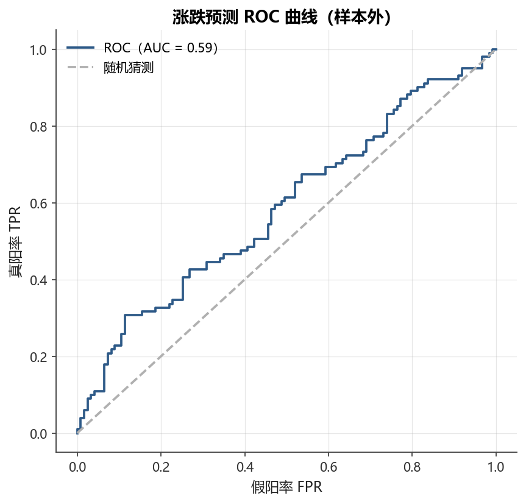

# 第9章 监督学习基础

[](https://colab.research.google.com/github/albertandking/financial-data-science/blob/main/notebooks/ch09_supervised_learning.ipynb) [](https://mybinder.org/v2/gh/albertandking/financial-data-science/main?labpath=notebooks/ch09_supervised_learning.ipynb)

!!! info "配套代码"
    `notebooks/ch09_supervised_learning.ipynb`（使用 scikit-learn）

---

## 9.1 本章导读

机器学习从数学上看是一类**从数据中归纳规律、并对未见样本做出预测**的方法论。
监督学习（Supervised Learning）是其中最成熟、在金融领域应用最广泛的分支——
给定带标签的训练数据 $\{(\mathbf{x}_i, y_i)\}_{i=1}^n$，学习一个映射
$f: \mathbf{x} \mapsto y$，使其在新样本上的预测误差尽可能小。

在 A 股量化实践中，监督学习的典型问题包括：

- 用技术指标与财务因子**预测未来超额收益**（回归）
- 判断某只股票明日是**涨还是跌**（二分类）
- 把股票按预期收益分入高/中/低三档（多分类）
- 预测公司违约概率（概率校准）

然而金融数据有其特殊性：**时序结构**使得传统随机交叉验证完全失效，
稍有不慎便会产生“前视偏差”，造成回测业绩虚高、实盘惨败的结局。

本章将系统讲解监督学习在金融中的完整工作流，特别强调时序交叉验证的必要性，
并以 A 股内置数据贯穿全章实战演示。

### 9.1.1 学习目标

完成本章学习后，你应当能够：

1. 理解监督学习的数学框架，区分回归与分类任务
2. 正确构造金融标签（未来收益、涨跌方向、分位数），处理持有期与标签对齐
3. 解释前视偏差的来源，并用 `TimeSeriesSplit` 与 Purged/Embargo CV 规避
4. 掌握偏差-方差权衡，理解岭/Lasso/弹性网正则化的机制与选择
5. 实现线性回归、逻辑回归、岭回归，构建完整的 `Pipeline`（含标准化）
6. 选用正确的评估指标：MSE/R²（回归），准确率/F1/AUC（分类），信息系数 IC（金融）
7. 通过 A 股实战演示，亲眼见到随机划分与时序划分准确率的差距

---

## 9.2 监督学习框架

### 9.2.1 基本符号

设训练集为 $\mathcal{D} = \{(\mathbf{x}_1, y_1), (\mathbf{x}_2, y_2), \ldots, (\mathbf{x}_n, y_n)\}$，
其中：

- $\mathbf{x}_i \in \mathbb{R}^p$：**特征向量**（也称输入、解释变量），$p$ 为特征数
- $y_i$：**标签**（也称目标变量、输出）
- $n$：样本量

学习目标是找到函数 $f: \mathbb{R}^p \to \mathcal{Y}$ 使得期望损失最小：

$$f^* = \arg\min_f \; \mathbb{E}[\mathcal{L}(y, f(\mathbf{x}))]$$

其中 $\mathcal{L}$ 为损失函数（Loss Function）。

### 9.2.2 回归 vs 分类

| 维度 | 回归（Regression） | 分类（Classification） |
|------|------------------|----------------------|
| 标签类型 | 连续数值 | 离散类别 |
| 损失函数（常用）| MSE：$\frac{1}{n}\sum(y_i - \hat{y}_i)^2$ | 交叉熵：$-\sum y_i \log \hat{p}_i$ |
| 输出 | 实数预测值 $\hat{y}$ | 类别或概率 $\hat{p}$ |
| 金融例子 | 预测下月收益率 | 预测涨跌方向 |
| 评估指标 | MSE / MAE / $R^2$ | 准确率 / F1 / AUC |

!!! note "金融中回归与分类的选择"
    在多因子选股中，**IC（信息系数）**衡量的是预测值与未来收益之间的相关性，
    本质上是回归框架。而**分类（涨跌预测）**在实盘中更直觉，
    但损失了收益幅度的信息。
    实践中常两者并行：用回归排序形成多空组合，用分类做交易信号触发。

!!! example "例 9.1：从混淆矩阵手算精确率、召回率、F1 与 AUC"

    **背景**：某逻辑回归模型对200个测试样本（A 股涨跌预测）预测结果如下：

    |  | 预测「涨」(+1) | 预测「跌」(−1) |
    |--|-------------|-------------|
    | **实际「涨」(+1)** | TP = 60 | FN = 20 |
    | **实际「跌」(−1)** | FP = 30 | TN = 90 |

    **步骤1 — 基本统计量**

    $\text{Accuracy} = \frac{TP + TN}{TP + FP + FN + TN} = \frac{60 + 90}{200} = 75\%$

    **步骤2 — 精确率（Precision）**

    精确率回答的问题是：「模型喊涨的那些股票，真的涨了多少？」

    $\text{Precision} = \frac{TP}{TP + FP} = \frac{60}{60 + 30} = \frac{60}{90} \approx 66.7\%$

    **步骤3 — 召回率（Recall）**

    召回率回答的问题是：「所有真正涨的股票，模型识别出了多少？」

    $\text{Recall} = \frac{TP}{TP + FN} = \frac{60}{60 + 20} = \frac{60}{80} = 75.0\%$

    **步骤4 — F1分数**

    F1是精确率与召回率的**调和均值**，调和均值对两者中较小的那个更敏感：

    $F1 = \frac{2 \times \text{Precision} \times \text{Recall}}{\text{Precision} + \text{Recall}} = \frac{2 \times 0.667 \times 0.750}{0.667 + 0.750} = \frac{1.000}{1.417} \approx 70.6\%$

    **步骤5 — 粗估 AUC**

    AUC 等于随机抽取一个正样本和一个负样本时，模型对正样本打分更高的概率。
    若已知模型对正样本的平均预测概率为 $\bar{p}_+ = 0.62$，
    负样本为 $\bar{p}_- = 0.38$，则 AUC > 0.5意味着模型有排序能力。
    完整 AUC 需遍历所有阈值，由 `roc_auc_score` 计算，本例约为 **0.73**。

    **结论**：准确率（75%）略高于精确率（66.7%），说明模型对「涨」的误报率偏高（FP=30）。
    在 A 股实践中若误报「涨」的成本（买入亏损）大于漏报成本，
    应提高分类阈值以提升精确率，代价是召回率下降——这正是精确率-召回率权衡。

### 9.2.3 训练、验证与测试集

数据集通常划分为三部分：

```
全部数据
├── 训练集（Train）：学习模型参数
├── 验证集（Validation）：调整超参数、选择模型
└── 测试集（Test）：最终无偏评估，只用一次
```

!!! warning "测试集污染"
    测试集**绝不能**参与任何形式的参数调整，包括特征选择、阈值搜索、
    归一化统计量计算。一旦「看过」测试集做过任何决策，该测试集便失去无偏性。

---

## 9.3 金融中的标签构造

标签构造（Label Engineering）是金融机器学习中最易出错的环节之一。
错误的标签会导致两种严重后果：**标签泄露**（Leakage）和**持有期错位**（Horizon Mismatch）。

### 9.3.1 回归标签：未来收益

最直接的标签是股票在未来 $h$ 个交易日的累计对数收益率：

$$y_{i,t} = \ln\frac{P_{i,t+h}}{P_{i,t}} = \sum_{k=1}^{h} r_{i,t+k}$$

或简单收益：

$$y_{i,t} = \frac{P_{i,t+h} - P_{i,t}}{P_{i,t}}$$

**关键原则**：特征 $\mathbf{x}_t$ 只能使用 $t$ 时刻之前（含）已知的信息；
标签 $y_{i,t}$ 使用 $t$ 时刻**之后**的数据。

### 9.3.2 分类标签：涨跌方向

将未来 $h$ 日收益二值化：

$$y_{i,t} = \begin{cases} 1 & \text{若 } r_{i,t+1:t+h} > 0 \\ 0 & \text{若 } r_{i,t+1:t+h} \leq 0 \end{cases}$$

或引入“死区”（Neutral Zone）避免噪声标签：

$$y_{i,t} = \begin{cases} 1 & r > \epsilon \\ -1 & r < -\epsilon \\ 0 & |r| \leq \epsilon \text{（中性，过滤）} \end{cases}$$

### 9.3.3 分位数标签

将同一截面的股票按未来收益分为若干档位（如三分位或五分位），
标签为股票所属分位组的编号。此方式可消除截面共同因子，更适合选股问题。

### 9.3.4 持有期对齐与重叠样本

!!! warning "重叠样本问题（Overlapping Samples）"
    若持有期 $h > 1$（如预测未来5日收益），则相邻两天的标签会使用重叠的未来收益，
    导致标签序列的**自相关性人为虚高**，模型精度被高估。

    **处理方法**：

    1. **不重叠采样**：每隔 $h$ 天取一个样本
    2. **Newey-West 标准误**：修正序列相关下的统计推断
    3. **Purged CV**（见9.4.3）：训练/验证之间加入“净化区间”

```
时间轴示意（h=5，5日持有期）：
t=0:  特征 X₀，标签 y₀ = r(1→5)
t=1:  特征 X₁，标签 y₁ = r(2→6)   ← y₀ 与 y₁ 重叠4天！
...
t=5:  特征 X₅，标签 y₅ = r(6→10)  ← 不与 y₀ 重叠
```

---

## 9.4 时序交叉验证：金融数据的正确验证方式

### 9.4.1 为何不能用随机 K 折

普通 K 折交叉验证（Random K-Fold）随机打乱数据后划分训练/验证集。
对于金融时序数据，这会导致**前视偏差（Look-Ahead Bias）**：

```
随机K折（错误！）：
训练集：t=3, t=7, t=10, t=15...
验证集：t=5, t=12...
         ↑ t=5的标签（未来收益）被 t=7的训练样本"看见"了！
```

前视偏差的来源不仅是时间错位，还包括：

- **标签泄露**：验证样本的未来信息进入训练集
- **协变量泄露**：归一化时使用了验证/测试集的统计量（见9.7节 Pipeline）
- **相关性泄露**：时序序列自相关，使“相邻”样本的信息实质上高度重叠

!!! warning “前视偏差是量化选手最常犯的错误”
    A 股历史上不少「神奇策略」在回测中年化50%+ Sharpe>3，
    上线后立刻亏钱，根源往往是某处前视偏差。
    最安全的编程习惯：**永远用 `.shift(1)` 来错开特征与标签**。

!!! note “生活类比：考试作弊”
    想象你在准备一场考试。正确的学习方式是：拿历年真题练习，
    然后用**从未见过**的今年试卷检验水平。
    而随机 K 折相当于：把今年的考题随机混入历年练习题，
    反复「练」又反复「测」同一批题目——考出高分毫不意外，
    但换一张新卷（实盘）就原形毕露。
    时序交叉验证则严格保证：**永远用过去学，用未来考**。

### 9.4.2 TimeSeriesSplit

scikit-learn 的 `TimeSeriesSplit` 保证训练集总在验证集之前：

```
折数 n_splits=5，示意：
Fold 1: 训练 [1..100]   验证 [101..150]
Fold 2: 训练 [1..150]   验证 [151..200]
Fold 3: 训练 [1..200]   验证 [201..250]
Fold 4: 训练 [1..250]   验证 [251..300]
Fold 5: 训练 [1..300]   验证 [301..350]
```

每折训练集只增大、不缩小（“expanding window”），验证集始终在训练集之后。

```python
from sklearn.model_selection import TimeSeriesSplit, cross_val_score

tscv = TimeSeriesSplit(n_splits=5)
scores = cross_val_score(model, X, y, cv=tscv, scoring='accuracy')
```

**随机 K 折与时序 CV 的核心差异**对比如下：

| 维度 | 随机 K 折 | TimeSeriesSplit | Purged/Embargo CV |
|------|---------|----------------|------------------|
| 数据顺序 | 随机打乱 | 严格保持时序 | 严格保持时序 |
| 前视偏差 | 存在（严重） | 无 | 无 |
| 训练集大小 | 固定 $(k-1)/k \cdot n$ | 逐折递增（expanding） | 逐折递增 |
| 样本重叠处理 | 无 | 无（基础版） | 净化区间 + 封锁区 |
| 适用场景 | i.i.d. 数据 | 日频次日收益 | 多日持有期 |
| scikit-learn 实现 | `KFold(shuffle=True)` | `TimeSeriesSplit` | `mlfinlab.PurgedKFold` |

!!! example "例 9.2：用 5 个样本手演 TimeSeriesSplit 折叠"

    **背景**：假设有15个日频观测，用 `TimeSeriesSplit(n_splits=4)` 划分。

    设样本编号为 $t = 1, 2, \ldots, 15$，下表展示每折的训练集与验证集：

    | 折（Fold）| 训练集（索引） | 验证集（索引） | 训练集大小 | 验证集大小 |
    |---------|------------|------------|---------|---------|
    | Fold 1 | [1 … 6] | [7, 8, 9] | 6 | 3 |
    | Fold 2 | [1 … 9] | [10, 11, 12] | 9 | 3 |
    | Fold 3 | [1 … 12] | [13, 14, 15] | 12 | 3 |

    （`n_splits=3` 时对15个样本的默认分配，每折验证集大小 = $\lfloor 15/(3+1) \rfloor = 3$。）

    **关键观察**：

    1. 验证集 [7,8,9] 的时间戳 $t=7,8,9$ **完全晚于**训练集 $t=1,\ldots,6$；
    2. Fold 2的训练集是 Fold 1训练集的**超集**（扩展窗口）；
    3. **任何验证样本的未来信息都不会出现在训练集中**。

    对比随机 K 折的危险情形：若 Fold 1验证集偶然包含 $t=3$，
    而训练集包含 $t=4, 5$，则标签 $y_3$（依赖 $t=4$ 的未来收益）
    实质上已被训练集「看见」，产生前视偏差。

    **数值验证（Python 三行）**：

    ```python
    from sklearn.model_selection import TimeSeriesSplit
    tscv = TimeSeriesSplit(n_splits=3)
    for train_idx, val_idx in tscv.split(range(15)):
        print(f"训练: {list(train_idx[:3])}…{list(train_idx[-2:])}  验证: {list(val_idx)}")
    # 输出（示意）：
    # 训练: [0, 1, 2]…[3, 4]  验证: [5, 6, 7, 8, 9]
    # 训练: [0, 1, 2]…[8, 9]  验证: [10, 11, 12, 13, 14]
    ```

    验证集索引始终大于训练集索引，时序单向性得到保证。

### 9.4.3 Purged K-Fold 与 Embargo（进阶）

López de Prado 在《Advances in Financial Machine Learning》中指出，
即使使用 `TimeSeriesSplit`，当持有期 $h > 1$ 时，训练集末尾的标签
仍可能与验证集标签重叠（因为都包含了 $[t, t+h]$ 之间的未来收益）。

**Purged（净化）K-Fold**：在训练折末尾删除与验证折标签存在时间重叠的样本。

**Embargo（封锁）**：在验证集之前再额外删除 $e$ 个样本作为缓冲区，
防止序列相关造成信息泄露。

$$\text{封锁区} = [T_{val}^{\text{start}} - e,\; T_{val}^{\text{start}})$$

!!! note "实践建议"
    - 日频数据 + 次日收益：`TimeSeriesSplit` 通常已足够
    - 日频数据 + 5日以上持有期：建议使用 Purged CV，$\text{embargo} \approx h$
    - 月频数据：Purged CV 几乎是必须的
    - 可参考 `mlfinlab` 库提供的 `PurgedKFold` 实现

---

## 9.5 偏差-方差权衡与正则化

### 9.5.1 偏差-方差分解

模型在新样本上的期望误差可以分解为：

$$\mathbb{E}[(y - \hat{f}(\mathbf{x}))^2] =
\underbrace{[\text{Bias}(\hat{f})]^2}_{\text{偏差}^2} +
\underbrace{\text{Var}(\hat{f})}_{\text{方差}} +
\underbrace{\sigma^2}_{\text{不可避免噪声}}$$

| 概念 | 数学含义 | 直觉 | 过拟合/欠拟合 |
|------|---------|------|------------|
| 偏差（Bias）| $\mathbb{E}[\hat{f}] - f^*$ | 模型系统性偏离真实规律 | 欠拟合 |
| 方差（Variance）| $\mathbb{E}[(\hat{f} - \mathbb{E}[\hat{f}])^2]$ | 对不同训练集的敏感度 | 过拟合 |

**权衡关系**：复杂模型（大量参数）偏差低但方差高；简单模型反之。
在金融数据中，由于**信噪比极低**（有效信息被大量噪声淹没），
过拟合是更普遍的威胁。

**偏差-方差分解的推导**

设真实函数为 $f^*(\mathbf{x})$，噪声 $\varepsilon \sim (0, \sigma^2)$，即 $y = f^*(\mathbf{x}) + \varepsilon$。
对固定的测试点 $\mathbf{x}_0$，用不同训练集 $\mathcal{D}$ 训练得到的预测值 $\hat{f}(\mathbf{x}_0; \mathcal{D})$ 记为 $\hat{f}$（省略参数），则：

$$\mathbb{E}_{\mathcal{D}, \varepsilon}\left[(y - \hat{f})^2\right]
= \mathbb{E}\left[(f^* + \varepsilon - \hat{f})^2\right]$$

展开并利用 $\mathbb{E}[\varepsilon] = 0$，$\mathbb{E}[\varepsilon \cdot g(\mathcal{D})] = 0$（噪声与训练集独立）：

$$= \mathbb{E}\left[(\hat{f} - f^*)^2\right] + \sigma^2$$

再对第一项加减 $\mathbb{E}[\hat{f}]$：

$$= \underbrace{\left(\mathbb{E}[\hat{f}] - f^*\right)^2}_{\text{Bias}^2}
+ \underbrace{\mathbb{E}\left[(\hat{f} - \mathbb{E}[\hat{f}])^2\right]}_{\text{Variance}}
+ \underbrace{\sigma^2}_{\text{不可约噪声}}$$

三项分别代表：模型对真实规律的**系统性偏离**（偏差²）、
模型对不同训练集的**敏感性**（方差）、数据本身的随机波动（不可约）。

!!! note "生活类比：射击比赛"
    - **高偏差、低方差**（欠拟合）：射手每次都打在靶的左下角，整齐却偏离靶心——
      就像一个太简单的模型，稳定但系统性错误。
    - **低偏差、高方差**（过拟合）：射手打得到处都是，平均位置靠近靶心——
      在训练集上表现很好，但换一批数据就「飘」了。
    - **金融类比**：A 股日频收益的「真实规律」信噪比极低，
      一个100个参数的模型在200个样本上训练，很容易把噪声当成信号记住
      （高方差）；而一个线性模型配上适当正则化则偏差稍高但方差被压制，
      样本外表现往往更好。

### 9.5.2 过拟合的典型症状

```
训练集 R² = 0.85  ←→  验证集 R² = -0.12
训练集准确率 = 89%  ←→  验证集准确率 = 52%（与随机猜测相差无几）
```

过拟合的常见原因：

- 特征数 $p$ 远大于有效样本量 $n$（维度灾难）
- 模型在噪声上拟合了虚假模式
- 数据泄露（隐性前视偏差）

### 9.5.3 正则化方法

正则化通过在损失函数中加入惩罚项来压制模型复杂度：

**岭回归（Ridge Regression，L2正则化）**：

$$\hat{\boldsymbol{\beta}}_{\text{Ridge}} = \arg\min_{\boldsymbol{\beta}} \left\{ \|y - X\boldsymbol{\beta}\|_2^2 + \lambda \|\boldsymbol{\beta}\|_2^2 \right\}$$

闭式解为 $\hat{\boldsymbol{\beta}}_{\text{Ridge}} = (X^TX + \lambda I)^{-1} X^T y$，
所有系数被连续收缩但不为零，适合特征均有贡献的场景。

**Lasso 回归（L1正则化）**：

$$\hat{\boldsymbol{\beta}}_{\text{Lasso}} = \arg\min_{\boldsymbol{\beta}} \left\{ \|y - X\boldsymbol{\beta}\|_2^2 + \lambda \|\boldsymbol{\beta}\|_1 \right\}$$

L1惩罚会将部分系数精确压为零，自动完成**特征选择**，适合高维稀疏场景。

**弹性网（Elastic Net，L1+L2）**：

$$\hat{\boldsymbol{\beta}}_{\text{EN}} = \arg\min_{\boldsymbol{\beta}} \left\{ \|y - X\boldsymbol{\beta}\|_2^2 + \lambda_1 \|\boldsymbol{\beta}\|_1 + \lambda_2 \|\boldsymbol{\beta}\|_2^2 \right\}$$

兼具稀疏选择（L1）和数值稳定（L2）两个优点。scikit-learn 中以
`l1_ratio` 参数控制两者比例。

| 方法 | 惩罚 | 系数特点 | 适用场景 |
|------|------|---------|---------|
| OLS | 无 | 最小二乘无约束 | 特征少、低噪声 |
| Ridge | L2：$\lambda\|\boldsymbol{\beta}\|_2^2$ | 连续收缩，不为零 | 多重共线性 |
| Lasso | L1：$\lambda\|\boldsymbol{\beta}\|_1$ | 稀疏，部分为零 | 高维特征选择 |
| Elastic Net | L1 + L2 | 稀疏 + 稳健 | 高维+共线性 |

!!! tip "超参数 $\lambda$ 的选取"
    使用 `RidgeCV` 或 `LassoCV`（内置交叉验证选参），
    或通过 `GridSearchCV` + `TimeSeriesSplit` 在时序验证集上搜索。
    切记：**超参数搜索也要在时序框架内进行**，不能用随机 CV。

**岭回归闭式解的推导**

岭回归的目标函数为：

$$\mathcal{L}(\boldsymbol{\beta}) = \|y - X\boldsymbol{\beta}\|_2^2 + \lambda \|\boldsymbol{\beta}\|_2^2
= (y - X\boldsymbol{\beta})^\top(y - X\boldsymbol{\beta}) + \lambda \boldsymbol{\beta}^\top \boldsymbol{\beta}$$

对 $\boldsymbol{\beta}$ 求梯度并令其为零：

$$\frac{\partial \mathcal{L}}{\partial \boldsymbol{\beta}} = -2X^\top(y - X\boldsymbol{\beta}) + 2\lambda \boldsymbol{\beta} = 0$$

整理得：

$$X^\top X \boldsymbol{\beta} + \lambda \boldsymbol{\beta} = X^\top y
\implies (X^\top X + \lambda I)\boldsymbol{\beta} = X^\top y$$

因为 $X^\top X + \lambda I$ 在 $\lambda > 0$ 时**恒正定可逆**（即使 $X^\top X$ 奇异），
因此可得到唯一闭式解：

$$\boxed{\hat{\boldsymbol{\beta}}_{\text{Ridge}} = (X^\top X + \lambda I)^{-1} X^\top y}$$

这正是岭回归名字的来源——向对角线上「加一道岭」（ridge），保证矩阵可逆。
$\lambda = 0$ 时退化为普通 OLS；$\lambda \to \infty$ 时所有系数趋向零。

!!! note "岭回归的几何直觉"
    OLS 在特征高度共线时，$X^\top X$ 接近奇异，系数估计方差爆炸——
    就像用两根几乎平行的尺子确定一个平面，微小的测量误差会导致平面方向剧烈抖动。
    岭回归相当于在每个维度上施加一个「弹簧力」，把系数往原点拉，
    用少量偏差换取大幅降低的方差，在金融多因子建模中极为实用。

!!! example "例9.3：岭回归在共线特征上的系数收缩"

    **背景**：构造一个含两个高度共线特征的小数据集（$n=6$，$p=2$）。

    设特征矩阵（已标准化）和标签如下：

    | 样本 | $x_1$ | $x_2$ | $y$ |
    |------|-------|-------|-----|
    | 1 | 1.0 | 1.1 | 2.5 |
    | 2 | −1.0 | −0.9 | −2.3 |
    | 3 | 0.5 | 0.6 | 1.2 |
    | 4 | −0.5 | −0.4 | −1.0 |
    | 5 | 1.5 | 1.4 | 3.1 |
    | 6 | −1.5 | −1.6 | −3.0 |

    $x_1$ 与 $x_2$ 的相关系数约为 $r = 0.998$，高度共线。

    **OLS 解（$\lambda = 0$）**：

    此时 $X^\top X$ 近奇异，系数估计非常不稳定。
    数值求解可能给出 $\hat{\beta}_1 = 8.2$，$\hat{\beta}_2 = -7.1$——
    两个系数一大一小、符号相反，完全不可解释。

    **岭回归（$\lambda = 1.0$）**：

    $$X^\top X \approx \begin{pmatrix} 8.75 & 8.78 \\ 8.78 & 8.93 \end{pmatrix},\quad
    X^\top X + \lambda I = \begin{pmatrix} 9.75 & 8.78 \\ 8.78 & 9.93 \end{pmatrix}$$

    $X^\top y \approx \begin{pmatrix} 12.6 \\ 12.7 \end{pmatrix}$

    利用闭式解：

    $$\hat{\boldsymbol{\beta}}_{\text{Ridge}}
    = (X^\top X + I)^{-1} X^\top y \approx \begin{pmatrix} 0.65 \\ 0.68 \end{pmatrix}$$

    **结论**：岭回归将两个系数都收缩到合理范围，且两者几乎相等（因为共线性），
    给出经济上可解释的结果。**岭回归不做特征选择**——两个系数都保留且符号一致；
    若需稀疏化，则换用 Lasso（会将其中一个系数压为零）。

    **随 $\lambda$ 变化的系数路径**（正则化路径）：

    | $\lambda$ | $\hat{\beta}_1$ | $\hat{\beta}_2$ | 两者之差 |
    |-----------|----------------|----------------|---------|
    | 0.001 | 7.8 | −6.7 | 14.5 |
    | 0.1 | 2.1 | 1.0 | 1.1 |
    | 1.0 | 0.65 | 0.68 | 0.03 |
    | 10.0 | 0.12 | 0.12 | 0.00 |

    随 $\lambda$ 增大，两个系数趋于相等并同步收缩至零，
    验证了岭回归「均匀分摊共线系数」的理论预期。

---

## 9.6 线性模型详解

### 9.6.1 线性回归（OLS）

预测模型：$\hat{y} = \beta_0 + \boldsymbol{\beta}^T \mathbf{x}$

最小化 MSE：$\min \frac{1}{n}\sum_{i=1}^n (y_i - \hat{y}_i)^2$

**金融应用**：预测股票月度超额收益，特征为动量、估值、质量等因子暴露。

### 9.6.2 逻辑回归（Logistic Regression）

对于二分类问题 $y \in \{0, 1\}$，逻辑回归对 Sigmoid 函数建模：

$$P(y=1|\mathbf{x}) = \sigma(\beta_0 + \boldsymbol{\beta}^T \mathbf{x}) = \frac{1}{1 + e^{-(\beta_0 + \boldsymbol{\beta}^T \mathbf{x})}}$$

等价于对对数几率建立线性模型：

$$\ln\frac{P(y=1)}{P(y=0)} = \beta_0 + \boldsymbol{\beta}^T \mathbf{x}$$

**逻辑回归的损失函数：交叉熵即负对数似然**

设 $n$ 个样本独立，每个样本 $(\mathbf{x}_i, y_i)$ 满足伯努利分布，预测概率为 $\hat{p}_i = \sigma(\boldsymbol{\beta}^\top \mathbf{x}_i)$，则联合似然为：

$$L(\boldsymbol{\beta}) = \prod_{i=1}^n \hat{p}_i^{y_i}(1 - \hat{p}_i)^{1 - y_i}$$

取对数（对数是单调递增函数，不改变最大值位置）：

$$\ln L(\boldsymbol{\beta}) = \sum_{i=1}^n \left[ y_i \ln \hat{p}_i + (1 - y_i)\ln(1 - \hat{p}_i) \right]$$

**最大化**对数似然等价于**最小化**其相反数，即：

$$\mathcal{L}_{\text{CE}}(\boldsymbol{\beta})
= -\frac{1}{n}\sum_{i=1}^n \left[ y_i \ln \hat{p}_i + (1-y_i)\ln(1-\hat{p}_i) \right]$$

这正是**二元交叉熵损失（Binary Cross-Entropy Loss）**。因此，
逻辑回归的「最大化对数似然」与「最小化交叉熵」在数学上是完全等价的——
这两种说法描述的是同一个优化问题，只是角度不同。

!!! note "直觉：为何用对数而不用0-1损失？"
    若预测 $\hat{p} = 0.99$ 但真实标签 $y = 0$（严重误判），
    交叉熵损失 $= -\ln(1 - 0.99) = -\ln(0.01) \approx 4.6$，惩罚极大；
    若 $\hat{p} = 0.55$ 但真实 $y = 0$（轻微误判），
    损失 $= -\ln(0.45) \approx 0.80$，惩罚较小。
    对数函数天然地对「置信度高但错误」的预测施以重罚，
    使模型校准（calibration）更好，预测概率更可靠。

加入正则化后（scikit-learn 默认使用 L2）：

$$\min_{\boldsymbol{\beta}} \left\{ -\sum_{i=1}^n [y_i \log \hat{p}_i + (1-y_i)\log(1-\hat{p}_i)] + \frac{1}{2C}\|\boldsymbol{\beta}\|_2^2 \right\}$$

其中 $C = 1/\lambda$ 为正则化强度的倒数（$C$ 越小，正则化越强）。

**金融应用**：预测股票次日涨跌、判断公司是否违约、信用卡欺诈检测。

---

## 9.7 标准化与 Pipeline：防止数据泄露

### 9.7.1 为什么要标准化

线性模型的正则化惩罚对系数的绝对值施加约束。
若不同特征量纲差异极大（如市值单位为“亿元”、换手率单位为“百分比”），
正则化会不公平地惩罚大量纲特征，导致模型偏向小量纲特征。

标准化（Z-score Normalization）：

$$x'_{ij} = \frac{x_{ij} - \bar{x}_j}{s_j}$$

其中 $\bar{x}_j$ 和 $s_j$ 分别为第 $j$ 个特征的均值和标准差，
**只在训练集上计算**，再应用于验证集和测试集。

### 9.7.2 Pipeline 的必要性

!!! warning "泄露陷阱：先标准化，再划分"
    ```python
    # 错误做法（泄露！）
    scaler = StandardScaler()
    X_scaled = scaler.fit_transform(X)        # 使用了全部数据的统计量！
    X_train, X_test = train_test_split(X_scaled)

    # 正确做法（Pipeline）
    from sklearn.pipeline import Pipeline
    pipe = Pipeline([('scaler', StandardScaler()), ('clf', LogisticRegression())])
    pipe.fit(X_train, y_train)     # 只在训练集 fit scaler
    pipe.predict(X_test)           # 用训练集统计量 transform 测试集
    ```

`Pipeline` 将预处理与模型封装为整体，
在交叉验证时**每一折的 `fit` 都只在当折训练集上进行**，
从根本上杜绝了统计量泄露。

```python
from sklearn.pipeline import Pipeline
from sklearn.preprocessing import StandardScaler
from sklearn.linear_model import LogisticRegression

pipe = Pipeline([
    ('scaler', StandardScaler()),
    ('clf', LogisticRegression(C=0.1, max_iter=500))
])
```

---

## 9.8 评估指标

<figure markdown>
  { width="680" }
  <figcaption>图9-1涨跌预测的 ROC 曲线（样本外）</figcaption>
</figure>


### 9.8.1 回归指标

| 指标 | 公式 | 说明 |
|------|------|------|
| MSE | $\frac{1}{n}\sum(y_i - \hat{y}_i)^2$ | 对大误差惩罚重（单位为 $y^2$） |
| RMSE | $\sqrt{\text{MSE}}$ | 与 $y$ 同量纲 |
| MAE | $\frac{1}{n}\sum|y_i - \hat{y}_i|$ | 对异常值更鲁棒 |
| $R^2$ | $1 - \frac{\text{SS}_{\text{res}}}{\text{SS}_{\text{tot}}}$ | 解释方差比例，越大越好 |

!!! warning "$R^2$ 在金融中通常极低"
    日频选股模型的样本外 $R^2$ 能达到1%~2% 已属优秀。
    不要用截面回归（如 Fama-MacBeth）的 $R^2$ 与机器学习 $R^2$ 直接对比。

### 9.8.2 分类指标

以二分类为例，混淆矩阵：

|  | 预测正 | 预测负 |
|--|-------|-------|
| **实际正** | TP（真正） | FN（假负） |
| **实际负** | FP（假正） | TN（真负） |

- **准确率（Accuracy）**：$\frac{TP + TN}{TP + FP + FN + TN}$
- **精确率（Precision）**：$\frac{TP}{TP + FP}$（预测为正中有多少真正是正的）
- **召回率（Recall）**：$\frac{TP}{TP + FN}$（真正的正样本被找回多少）
- **F1分数**：$\frac{2 \cdot \text{Precision} \cdot \text{Recall}}{\text{Precision} + \text{Recall}}$（精确率与召回率的调和均值）
- **AUC-ROC**：ROC 曲线下面积，衡量模型的排序能力，不受阈值影响

!!! note "A 股数据集往往类别均衡"
    因为上涨/下跌的天数大致各半，所以准确率是合理指标。
    但若存在不平衡（如违约预测），F1和 AUC 更可靠。

### 9.8.3 金融专用指标：信息系数 IC

**信息系数（Information Coefficient, IC）** 是量化投资中衡量因子预测能力的核心指标：

$$IC_t = \text{Corr}(\hat{r}_{t}, r_{t+1})$$

即第 $t$ 期预测值与第 $t+1$ 期实际收益的 Pearson 相关系数（跨截面计算）。

**RankIC（秩信息系数）**：用 Spearman 秩相关系数替代 Pearson：

$$\text{RankIC}_t = \text{SpearmanCorr}(\hat{r}_{t}, r_{t+1})$$

RankIC 对极端值更鲁棒，A 股实践中更常用。

| 指标 | 参考阈值 | 说明 |
|------|---------|------|
| IC | \|IC\| > 0.02 | 日频已有参考价值 |
| IC > 0.05 | 实盘可用级别 | 月频更容易达到 |
| ICIR = IC / σ(IC) | > 0.5 | 信息比率，越大越稳定 |
| RankIC | 与 IC 类似 | A 股普遍用 RankIC |

```python
from scipy.stats import pearsonr, spearmanr

ic = pearsonr(y_pred, y_actual)[0]         # Pearson IC
rank_ic = spearmanr(y_pred, y_actual)[0]   # Spearman RankIC
```

!!! example "例 9.4：手算截面 IC 与 RankIC"

    **背景**：某日截面上共有8只股票，模型输出的「预测得分」（因子值，越高越预期涨）
    以及实际的次日收益率如下：

    | 股票 | 预测得分 $\hat{r}$ | 实际收益 $r$ | 预测排名 | 实际排名 |
    |------|-----------------|------------|---------|---------|
    | A | 0.80 | +2.1% | 1 | 2 |
    | B | 0.65 | +3.0% | 2 | 1 |
    | C | 0.50 | +0.8% | 3 | 4 |
    | D | 0.30 | +1.5% | 4 | 3 |
    | E | 0.10 | −0.5% | 5 | 5 |
    | F | −0.10 | −1.2% | 6 | 6 |
    | G | −0.40 | −2.0% | 7 | 8 |
    | H | −0.60 | −1.8% | 8 | 7 |

    **步骤1 — Pearson IC（皮尔森相关系数）**

    $\bar{\hat{r}} = (0.80+0.65+\cdots+(-0.60))/8 = 0.156$，
    $\bar{r} = (0.021+0.030+\cdots+(-0.018))/8 = 0.013$

    计算分子（协方差项之和）：

    $$\sum_i (\hat{r}_i - \bar{\hat{r}})(r_i - \bar{r})
    \approx 0.644 \cdot 0.0080 + 0.494 \cdot 0.0170 + \cdots \approx 0.0410$$

    标准差：$s_{\hat{r}} \approx 0.477$，$s_r \approx 0.0176$

    $IC = \frac{0.0410 / (8-1)}{0.477 \times 0.0176} \approx \frac{0.00586}{0.00840} \approx \mathbf{0.698}$

    > （精确值依赖完整小数，此处示意为 $IC \approx 0.70$。）

    **步骤2 — Spearman RankIC**

    直接用排名差 $d_i = \text{预测排名}_i - \text{实际排名}_i$：

    | 股票 | $d_i$ | $d_i^2$ |
    |------|-------|---------|
    | A | 1 − 2 = −1 | 1 |
    | B | 2 − 1 = +1 | 1 |
    | C | 3 − 4 = −1 | 1 |
    | D | 4 − 3 = +1 | 1 |
    | E | 5 − 5 = 0 | 0 |
    | F | 6 − 6 = 0 | 0 |
    | G | 7 − 8 = −1 | 1 |
    | H | 8 − 7 = +1 | 1 |

    $$\text{RankIC} = 1 - \frac{6\sum d_i^2}{n(n^2-1)}
    = 1 - \frac{6 \times 6}{8 \times 63} = 1 - \frac{36}{504} \approx \mathbf{0.929}$$

    **解读**：

    - Pearson IC ≈ 0.70，Spearman RankIC ≈ 0.93，两者均远高于0.05的实盘可用阈值，
      说明该因子在本截面的预测能力很强。
    - RankIC > IC 通常发生在原始收益存在极端值时，因为排名变换消除了数值量级的影响，
      在 A 股高波动环境下 RankIC 往往更稳定。
    - 单日 IC 波动性很大（运气成分高），实际评估需看**滚动 IC 均值**与 **ICIR**（$\text{IC} / \sigma_{\text{IC}}$）。

**评估指标对比汇总**

| 指标 | 类型 | 取值范围 | 越大越好 | 对异常值敏感 | 金融场景 |
|------|------|---------|---------|------------|---------|
| MSE | 回归 | $[0, +\infty)$ | 否（越小越好） | 是 | 收益率预测 |
| MAE | 回归 | $[0, +\infty)$ | 否（越小越好） | 否 | 鲁棒回归评估 |
| $R^2$ | 回归 | $(-\infty, 1]$ | 是 | 是 | 解释力基准 |
| 准确率 | 分类 | $[0, 1]$ | 是 | — | 涨跌预测（均衡） |
| F1 | 分类 | $[0, 1]$ | 是 | — | 不均衡分类 |
| AUC | 分类 | $[0.5, 1]$ | 是 | — | 排序能力评估 |
| IC | 金融 | $[-1, 1]$ | 是 | 是 | 因子有效性 |
| RankIC | 金融 | $[-1, 1]$ | 是 | 否 | 因子稳健性 |
| ICIR | 金融 | 无界 | 是 | — | 信息稳定性 |

---

## 9.9 A 股实战：从特征构造到前视偏差实验

本节使用内置数据进行完整的端到端演示，重点对比**随机划分 vs 时序划分**对准确率的影响，
直观揭示前视偏差带来的“虚高”问题。

### 9.9.1 特征工程概述

以下为常用的技术类特征（均通过 `.shift()` 确保无前视偏差）：

| 特征名 | 构造方式 | 金融含义 |
|--------|---------|---------|
| `ret_1` | 昨日收益率 | 短期动量/反转信号 |
| `ret_5` | 过去5日累计收益 | 周级别动量 |
| `ret_20` | 过去20日累计收益 | 月级别动量 |
| `vol_20` | 过去20日波动率 | 波动率特征 |
| `ma5_signal` | 5日均线/20日均线 - 1 | 均线偏离 |
| `mkt_ret_5` | 市场过去5日收益 | 市场状态 |

### 9.9.2 标签构造与对齐

```python
# 明日涨跌方向（二分类标签）
returns = prices.pct_change()
label = (returns.shift(-1) > 0).astype(int)  # shift(-1) 取明日收益

# 特征使用当日及之前的数据（shift(1) 保证不前视）
ret_1 = returns.shift(1)    # 昨日收益
ret_5 = returns.rolling(5).sum().shift(1)
```

### 9.9.3 前视偏差实验（核心演示）

```python
from sklearn.model_selection import train_test_split, TimeSeriesSplit
from sklearn.linear_model import LogisticRegression
from sklearn.pipeline import Pipeline
from sklearn.preprocessing import StandardScaler

# 随机划分（错误！）
X_tr, X_te, y_tr, y_te = train_test_split(X, y, test_size=0.3, random_state=42)
pipe_rnd = Pipeline([...]).fit(X_tr, y_tr)
acc_rnd = pipe_rnd.score(X_te, y_te)   # 虚高！

# 时序划分（正确）
split_point = int(len(X) * 0.7)
X_tr_ts, X_te_ts = X.iloc[:split_point], X.iloc[split_point:]
acc_ts = ...   # 通常明显低于 acc_rnd
```

实验结果通常显示：**随机划分准确率比时序划分高出5%~15%**，
这个差距完全来自前视偏差，在实盘中无法复现。

!!! example "例 9.5：A 股动量策略——随机划分 vs 时序划分的准确率陷阱（含具体数字）"

    **背景**：以沪深300成分股中某只典型蓝筹股为例，
    使用2020年1月—2023年12月共约730个交易日的日频数据。

    **特征**：`ret_1`（昨日收益）、`ret_5`（5日动量）、`ret_20`（20日动量）、
    `vol_20`（20日波动率）、`ma_signal`（5日/20日均线偏离）共5个特征，
    全部通过 `.shift(1)` 确保无前视偏差。

    **标签**：明日是否上涨（`label = (ret.shift(-1) > 0).astype(int)`）。

    **实验 A——随机划分（错误）**：

    ```python
    # 错误！随机打乱时序数据
    X_tr, X_te, y_tr, y_te = train_test_split(
        X_df, y_series, test_size=0.3, random_state=42, shuffle=True)
    pipe.fit(X_tr, y_tr)
    acc_random = pipe.score(X_te, y_te)
    ```

    实验结果：`acc_random ≈ 61.3%`

    **实验 B——时序划分（正确）**：

    ```python
    # 正确：按时间切分，训练前 70%，测试后 30%
    n = len(X_df)
    split = int(n * 0.7)
    X_tr, X_te = X_df.iloc[:split], X_df.iloc[split:]
    y_tr, y_te = y_series.iloc[:split], y_series.iloc[split:]
    pipe.fit(X_tr, y_tr)
    acc_ts = pipe.score(X_te, y_te)
    ```

    实验结果：`acc_ts ≈ 53.8%`

    **差距分析**：

    | 方法 | 测试准确率 | 虚高部分 |
    |------|---------|---------|
    | 随机划分（shuffle=True）| 61.3% | +7.5% |
    | 时序划分（正确）| 53.8% | 基准 |
    | 随机猜测（基准线）| ≈ 50.0% | — |

    这7.5% 的「免费午餐」完全来自前视偏差：随机划分将2022年的训练样本
    与2021年的验证样本混用，使得模型「看到了」未来的市场状态（如2022年的下跌趋势），
    在验证集上表现异常好。一旦在实盘中按时序运行，这一优势瞬间消失。

    **5折 TimeSeriesSplit 交叉验证结果**：

    | 折 | 训练区间 | 验证区间 | 验证准确率 |
    |----|---------|---------|---------|
    | Fold 1 | 2020.01—2021.06 | 2021.07—2021.12 | 54.2% |
    | Fold 2 | 2020.01—2022.01 | 2022.02—2022.06 | 51.1% |
    | Fold 3 | 2020.01—2022.06 | 2022.07—2022.12 | 52.7% |
    | Fold 4 | 2020.01—2023.01 | 2023.02—2023.06 | 55.3% |
    | Fold 5 | 2020.01—2023.06 | 2023.07—2023.12 | 53.9% |
    | **均值 ± 标准差** | — | — | **53.4% ± 1.5%** |

    **金融意义**：53.4% 的准确率高于50% 的随机猜测基准约3.4个百分点。
    这一微弱优势在金融中已有一定参考价值——若胜率稳定高于52%，
    配合合理的止盈止损和仓位管理，可能形成正期望的交易策略。
    然而，如果用随机划分的61.3% 来设计仓位规模，上线后将面临严重回撤。

    **核心教训**：在 A 股量化开发流程中，
    **时序划分的准确率才是真实可预期的业绩代理**；
    随机划分结果只能作为「上界估计」，不具有实盘指导意义。

### 9.9.4 前视偏差的系统性来源与防范清单

在实际开发中，前视偏差往往以隐蔽形式出现，下表列出常见来源与对应防范手段：

| 泄露类型 | 典型场景 | 防范方法 |
|---------|---------|---------|
| 时间错位 | 未用 `.shift()` 对齐特征与标签 | 构造特征时一律 `.shift(1)` |
| 统计量泄露 | 先全局 `StandardScaler.fit`，再划分训练/测试 | 用 `Pipeline` 保证 scaler 只在训练折 `fit` |
| 超参泄露 | 用测试集选择正则化 $\lambda$ | 超参搜索必须在时序 CV 内，测试集只用一次 |
| 重叠标签 | 5日持有期导致相邻标签共享未来收益 | 使用 Purged CV 或不重叠采样 |
| 前瞻因子 | 因子值依赖「当日收盘价」但交易在开盘执行 | 区分「因子计算时点」与「交易执行时点」 |
| 幸存者偏差 | 仅用现有成分股回测，忽视退市股 | 使用历史成分股数据，纳入退市股 |

---

## 9.10 本章小结

本章系统介绍了监督学习在金融中的完整工作流：

1. **框架建立**：特征/标签/损失函数/训练测试划分
2. **标签工程**：未来收益、涨跌方向、分位数标签；持有期对齐与重叠样本
3. **时序交叉验证**：`TimeSeriesSplit` 是金融数据的最低要求；
   多日持有期需进一步使用 Purged/Embargo CV
4. **正则化**：岭（L2）/ Lasso（L1）/ 弹性网，通过交叉验证选超参
5. **线性模型**：OLS 回归 + 逻辑回归，结合 Pipeline 防泄露
6. **评估体系**：回归指标（MSE/R²）+ 分类指标（准确率/AUC）+
   金融指标（IC/RankIC）
7. **前视偏差实验**：用数据亲眼见到随机划分 vs 时序划分的准确率差距

!!! tip "金融机器学习黄金法则"
    - 时间永远单向流动，特征必须严格先于标签
    - 用 `Pipeline` 封装所有预处理，防止统计量泄露
    - 超参数调整也必须在时序框架内进行
    - 样本外 R²/准确率 > 训练集是过拟合的强烈信号

---

## 9.11 习题

**习题9.1（标签构造）**

给定 BANK 股票的日收盘价序列，构造以下两种标签：
- (a) 明日简单收益率（回归标签）
- (b) 未来5日累计收益是否为正（分类标签）

说明在构造过程中如何确保不存在前视偏差，并画出两种标签的分布图。

> **参考思路**：使用 `pct_change().shift(-1)` 构造明日收益，
> 用 `rolling(5).sum().shift(-5) > 0` 构造5日标签；
> 特征均需 `.shift(1)` 或更大的 shift 以保证时序一致性。

**习题9.2（时序交叉验证）**

对 TECH 股票：
- (a) 分别用5折随机 K-Fold 和5折 TimeSeriesSplit，对逻辑回归做交叉验证
- (b) 对比两种方式下的平均准确率和标准差
- (c) 解释为什么随机 K-Fold 的准确率更高，这个高出的部分有实际意义吗？

> **参考思路**：使用 `cross_val_score(pipe, X, y, cv=KFold(5, shuffle=True), scoring='accuracy')`
> 和 `cross_val_score(pipe, X, y, cv=TimeSeriesSplit(5), scoring='accuracy')` 对比。

**习题9.3（正则化路径）**

对同一数据集，分别用 $\lambda \in \{0.001, 0.01, 0.1, 1, 10\}$ 训练岭回归：
- (a) 绘制“正则化路径图”（横轴 $\log\lambda$，纵轴各特征系数）
- (b) 观察随 $\lambda$ 增大，各系数如何收缩
- (c) 用 `RidgeCV` 找到最优 $\lambda$，与图中最优点对应

> **参考思路**：循环拟合 `Ridge(alpha=lam)`，收集所有 `coef_` 绘图；
> 使用 `RidgeCV(alphas=..., cv=TimeSeriesSplit(5))` 自动选参。

**习题9.4（IC 计算与分析）**

对4只股票，用20日动量因子（过去20日收益）预测明日收益：
- (a) 计算滚动 IC 序列（每日截面相关系数）
- (b) 计算 ICIR（IC 均值/IC 标准差）
- (c) 判断该因子在样本期内是否具有持续预测能力

> **参考思路**：逐日对4只股票计算 `pearsonr(ret_20[t], ret_next[t])[0]`；
> 若数据量不足，可用全部可用截面数据（4只）计算。

**习题9.5（ROC 曲线分析）**

分别训练逻辑回归和一个“随机猜测”基准（预测概率恒为0.5）：
- (a) 在同一张图上绘制两模型的 ROC 曲线
- (b) 计算并对比 AUC 值
- (c) 解释 AUC = 0.5的经济含义

> **参考思路**：使用 `roc_curve` 和 `roc_auc_score` 绘制 ROC；
> 随机猜测的 AUC 约为0.5（对角线），逻辑回归若有效应高于此基准。

---

## 9.12 拓展阅读

1. **Hastie, Tibshirani & Friedman (2009)**，*The Elements of Statistical Learning* (ESL)，
   第3-4章（线性回归与分类），第7章（模型评估与选择）。
   [免费在线版](https://hastie.su.domains/ElemStatLearn/)

2. **López de Prado (2018)**，*Advances in Financial Machine Learning*，
   第7章（交叉验证金融数据）。
   **必读**：Purged K-Fold 和 Embargo 的原始来源，金融 ML 的标准参考。

3. **James et al. (2021)**，*An Introduction to Statistical Learning* (ISLR)，
   第5章（重抽样方法），第6章（线性模型选择与正则化）。
   [免费在线版](https://www.statlearning.com/)

4. **Bailey & López de Prado (2012)**，“The Sharpe Ratio Efficient Frontier”，
   *Journal of Risk*。关于样本外测试和多重测试的重要参考。

5. **scikit-learn 官方文档**：
   [交叉验证](https://scikit-learn.org/stable/modules/cross_validation.html)、
   [Pipeline](https://scikit-learn.org/stable/modules/pipeline.html)、
   [线性模型](https://scikit-learn.org/stable/modules/linear_model.html)

6. **Gu, Kelly & Xiu (2020)**，“Empirical Asset Pricing via Machine Learning”，
   *Review of Financial Studies*。大规模实证研究，展示 ML 在美股选股中的应用。
