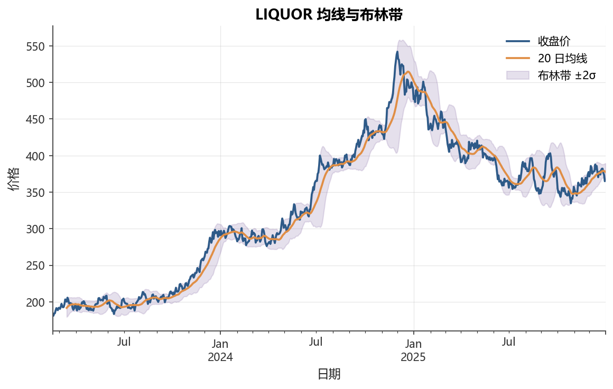

# 第10章 金融特征工程

[](https://colab.research.google.com/github/albertandking/financial-data-science/blob/main/notebooks/ch10_feature_engineering.ipynb) [](https://mybinder.org/v2/gh/albertandking/financial-data-science/main?labpath=notebooks/ch10_feature_engineering.ipynb)

!!! info "配套代码"
    `notebooks/ch10_feature_engineering.ipynb`

## 10.1 本章导读

特征工程是机器学习流程的核心环节，尤其在金融领域，原始的价格和成交量数据极少直接作为模型输入。一方面，金融时序数据的**信噪比极低**——真实的预测信号可能淹没在大量随机噪声之中；另一方面，金融市场存在**时序依赖**结构，某一时刻的信息只能来自过去，任何涉及未来信息的特征都会引入“前视偏差”（look-ahead bias），导致回测严重虚高。

本章围绕 A 股量化实战，系统介绍价量特征、技术指标、滚动窗口与防前视技术、截面标准化，以及特征筛选方法，帮助读者建立一套可直接投入实践的特征工程体系。

## 10.2 学习目标

读完本章后，你应当能够：

1. 理解金融特征工程与通用机器学习特征工程的区别，尤其是**前视偏差**的来源与危害。
2. 手动构造多周期动量、波动率、换手率代理、量价背离等价量特征。
3. 用 `pandas` 正确实现 MA、EMA、RSI、MACD、布林带等技术指标，确保**只用历史信息**。
4. 理解 `rolling`/`ewm` + `shift(1)` 的标准写法，能够用对照实验量化前视偏差的影响。
5. 区分**时序标准化**与**截面标准化**，解释金融中通常采用截面标准化的原因。
6. 掌握基于相关性、方差阈值、IC（信息系数）的特征筛选方法。

---

## 10.3 金融特征工程的特殊性

### 10.3.1 低信噪比下的特征构造

在计算机视觉或 NLP 中，模型通常能从高维输入中提取显著信号。但股票收益率的日度预测 $R^2$ 很少超过5%——真实信号微弱，噪声主导。这意味着：

- **特征的预测力（IC/IR）通常很低**，0.02~0.05的截面 IC 在 A 股已属可用信号。
- 单一特征难以胜任，往往需要**组合多维特征**形成特征矩阵。
- 对数据质量（停牌填充、复权、异常值处理）极度敏感。

### 10.3.2 时序特征的三大原则

!!! warning "防前视偏差是金融特征工程的第一原则"
    **前视偏差**（look-ahead bias）指特征构造时意外用了未来信息。例如，“当天收盘价 / 过去20日最高价” 中的“最高价”如果包含了当天，就用了当天才知道的信息，在实际交易中无法复现。一旦引入前视偏差，回测业绩将严重虚高。

**原则一：时间对齐**。特征 $x_{i,t}$ 必须仅由 $t$ 时刻及之前的数据计算。通用做法是在构造特征后立即 `shift(1)`，确保预测 $t+1$ 时用的特征全部来自 $t$ 及之前。

**原则二：滚动窗口**。使用 `rolling(window).func()` 时，pandas 默认窗口包含当前点，即计算 $t$ 日特征时用到了 $t$ 日本身的数据。若随后对结果做 `shift(1)`，就能保证信息不泄漏。

**原则三：跨资产一致性**。同一截面（同一交易日）不同股票的特征要基于可比的口径，否则截面信号失去意义。

值得强调的是，前视偏差往往以**隐蔽**的形式出现，并非总是“显式地用了明天的价格”。常见的隐蔽来源包括：用全样本统计量做标准化或 Winsorize（偷看了整段历史的均值方差）、用后复权价回测却忽略复权信息在历史时点尚不可得、用财报数据时按“报告期”而非“公告日”对齐（财报往往滞后一两个月才披露）、以及在剔除退市股时只保留“活到今天”的样本（幸存者偏差）。这些都会让回测结果系统性偏乐观。养成“构造完任何特征立即问一句：这个值在交易决策那一刻真的能拿到吗？”的习惯，是金融特征工程的基本功。

### 10.3.3 数据类型概览

| 特征类型 | 原始来源 | 典型例子 |
|---|---|---|
| 价格衍生特征 | 日度 OHLCV | 动量、反转、波动率 |
| 技术指标 | 收盘价 / 成交量 | MA、RSI、MACD、布林带 |
| 基本面特征 | 财报、公告 | PE、ROE、净利润增速 |
| 情绪特征 | 新闻、研报 | 情感得分、超预期 |
| 市场微结构 | L2行情 | 买卖价差、订单不平衡 |

本章聚焦**前两类**，它们来自公开行情数据，是量化选股的基础。

---

## 10.4 价量特征

### 10.4.1 动量特征（Momentum）

动量来源于“过去强者继续强”的经验观察。经典的 $n$ 日动量定义为：

$$\text{MOM}_n(t) = \frac{P_t}{P_{t-n}} - 1$$

其中 $P_t$ 为 $t$ 日收盘价。在实践中，Jegadeesh & Titman（1993）发现跳过最近1个月（避免反转效应），以 $[t-252, t-21]$ 区间的累计收益作为动量信号效果更稳定。A 股常用5日、20日、60日多周期动量：

$$\text{MOM}_5 = \frac{P_t}{P_{t-5}} - 1, \quad
\text{MOM}_{20} = \frac{P_t}{P_{t-20}} - 1, \quad
\text{MOM}_{60} = \frac{P_t}{P_{t-60}} - 1$$

!!! tip "多周期动量的直觉"
    5日动量捕捉短期反转前的动能；20日动量对应月度趋势；60日动量对应季度级别趋势。在 A 股中，短期反转（5日）和中期动量（20~60日）均有文献记录，但效果随时期变化。

### 10.4.2 反转特征（Reversal）

短期反转（short-term reversal）是动量的反面：上周涨幅最大的股票，下周倾向于回调。其信号通常用1周（5日）收益率的负值来构造：

$$\text{REV}_5(t) = -\left(\frac{P_t}{P_{t-5}} - 1\right)$$

在 A 股日度截面，5日收益率往往呈现明显负自相关，即短期反转效应。

### 10.4.3 波动率特征（Volatility）

已实现波动率（Realized Volatility）通常用过去 $n$ 日对数收益率的标准差衡量：

$$\text{VOL}_n(t) = \text{std}\left(\ln\frac{P_s}{P_{s-1}},\ s = t-n+1, \ldots, t\right) \times \sqrt{252}$$

波动率本身可作为**风险特征**（高波动率往往意味着更高的非系统性风险），也可用于识别**波动率突破**等信号。

### 10.4.4 换手率代理

换手率（Turnover）= 成交量 / 流通股本，是流动性的代理。内置数据无流通股本，可用**相对换手率**作为代理：

$$\text{TVOL\_rel}(t) = \frac{V_t}{\text{mean}(V_{t-20}, \ldots, V_{t-1})}$$

其中 $V_t$ 为 $t$ 日成交量。相对换手率 > 1表示成交量放大，常伴随价格突破或主力行为。

### 10.4.5 量价背离

量价背离（Volume-Price Divergence）衡量价格上涨时成交量是否配合：

$$\text{VPD}(t) = \text{sign}(r_t) \times \left(1 - \frac{V_t}{\text{VOL\_ma}_{20}(t)}\right)$$

当价格上涨而成交量萎缩时，VPD 为负，提示上涨动能不足。

### 10.4.6 动量与反转：A 股的特殊性

A 股与美股在动量、反转因子上的表现存在显著差异，这是中文文献反复讨论的话题。美股以 Jegadeesh & Titman（1993）的中期动量（$[t-252, t-21]$）为代表，呈现“强者恒强”；而 A 股由于散户占比高、换手率远高于成熟市场，**短期反转效应**往往比中期动量更强、更稳定。直观理解是：A 股短期价格易被情绪推动而过度反应，随后均值回归，这正是反转因子的来源。

!!! example "例 10.1：动量与反转因子在 A 股的表现差异"
    考虑一个简化的截面回测：每个交易日，按某个信号把全市场股票分成5组（五分位），做多信号最高组、做空信号最低组，统计下一期的多空收益差（即多空组合月均收益）。在一个典型的样本期里，我们对两类信号各跑一遍：

    | 信号 | 构造方式 | 多空月均收益（假想） | 方向解读 |
    |---|---|---|---|
    | 中期动量 MOM$_{20}$ | $P_t/P_{t-20}-1$，做多高分位 | $-0.4\%$ | 动量为负，即“买强卖弱”反而亏 |
    | 短期反转 REV$_5$ | $-(P_t/P_{t-5}-1)$，做多高分位 | $+0.8\%$ | 反转为正，即“买跌卖涨”赚钱 |

    数字本身随样本期变化，但符号在 A 股历史中长期稳定：**中期动量的多空收益常为负或不显著，短期反转的多空收益常为正**。这与美股“动量为正、短期反转较弱”恰好相反。

    一个关键启示：把美股教科书里的动量因子直接搬到 A 股，方向可能是反的。实务中常见做法是对动量取负号（等价于反转），或在动量信号上叠加换手率、波动率过滤，剔除高换手的“伪强势股”。

!!! example "例 10.2：手算多周期动量与反转"
    设某股票近6个收盘价为 $P_{t-5},\ldots,P_t = 10.0,\ 10.5,\ 10.2,\ 11.0,\ 10.8,\ 11.4$。

    - 5日动量 $\text{MOM}_5 = P_t/P_{t-5}-1 = 11.4/10.0 - 1 = 0.14$（即 $+14\%$）。
    - 5日反转 $\text{REV}_5 = -0.14$（$-14\%$），表示该股近5日涨幅居前，反转信号为强负值——若反转有效，预期下期回调。
    - 若再给出更早的 $P_{t-20}=9.0$，则20日动量 $\text{MOM}_{20}=11.4/9.0-1\approx 0.267$（$+26.7\%$）。

    可见同一只股票在不同周期上的动量数值差异很大，这也是为何要同时构造5/20/60日多周期动量：它们捕捉不同时间尺度的趋势。

---

## 10.5 技术指标

<figure markdown>
  { width="680" }
  <figcaption>图10-1　LIQUOR 均线与布林带</figcaption>
</figure>


!!! warning "所有技术指标只能用历史数据"
    以下指标的实现均确保在计算 $t$ 日特征时**只用 $t$ 日及之前的数据**。使用 `rolling` 后配合 `shift(1)` 确保下一期预测不会泄漏当期信息。

### 10.5.1 移动均线（MA / EMA）

**简单移动均线（SMA）**：

$$\text{MA}_n(t) = \frac{1}{n}\sum_{s=t-n+1}^{t} P_s$$

**指数移动均线（EMA）**，赋予近期数据更高权重：

$$\text{EMA}_n(t) = \alpha \cdot P_t + (1-\alpha) \cdot \text{EMA}_n(t-1), \quad \alpha = \frac{2}{n+1}$$

均线衍生特征常用**价格偏离均线的比率**（Price-MA Ratio）：

$$\text{PMR}_n(t) = \frac{P_t}{\text{MA}_n(t)} - 1$$

$\text{PMR} > 0$ 表示价格在均线之上（偏强），$\text{PMR} < 0$ 表示偏弱。

!!! note "EMA 权重 $\alpha=2/(n+1)$ 的来历"
    为什么 $n$ 日 EMA 的平滑系数取 $\alpha = 2/(n+1)$，而不是直观的 $1/n$？把递推式 $\text{EMA}_t = \alpha P_t + (1-\alpha)\text{EMA}_{t-1}$ 展开，可得历史价格的权重呈几何衰减：$P_t$ 权重 $\alpha$，$P_{t-1}$ 权重 $\alpha(1-\alpha)$，$P_{t-k}$ 权重 $\alpha(1-\alpha)^k$。这组权重的**加权平均“重心”**（即等效的平均滞后期）为

    $\bar{k}=\sum_{k=0}^{\infty} k\,\alpha(1-\alpha)^k = \frac{1-\alpha}{\alpha}.$

    要让 EMA 的等效“记忆长度”与 $n$ 日 SMA 对齐——$n$ 日 SMA 的平均滞后是 $(n-1)/2$——令 $\frac{1-\alpha}{\alpha}=\frac{n-1}{2}$，解得 $\alpha = \frac{2}{n+1}$。这就是 $\alpha=2/(n+1)$ 的由来：它使 EMA 与同周期 SMA 在“平均回看长度”上等价，因此12日 EMA 与12日 SMA 才具有可比的趋势含义。

!!! example "例 10.3：手算 EMA 递推（$n=3$）"
    取 $n=3$，则 $\alpha = 2/(3+1) = 0.5$。设连续4日收盘价为 $10, 12, 11, 13$。EMA 的常见初值取首个价格，即 $\text{EMA}_0 = 10$。逐日递推 $\text{EMA}_t = 0.5 P_t + 0.5\,\text{EMA}_{t-1}$：

    | 日期 | $P_t$ | 计算 | $\text{EMA}_t$ |
    |---|---|---|---|
    | 0 | 10 | 初值 | $10.00$ |
    | 1 | 12 | $0.5\times12 + 0.5\times10$ | $11.00$ |
    | 2 | 11 | $0.5\times11 + 0.5\times11$ | $11.00$ |
    | 3 | 13 | $0.5\times13 + 0.5\times11$ | $12.00$ |

    与同期3日 SMA 对比：第3日 SMA $=(12+11+13)/3 = 12.00$，恰好与 EMA 接近，但 EMA 给最新价 $13$ 的权重更高（$\alpha=0.5$），因此在价格转向时反应更快。这也解释了 MACD 用 EMA 而非 SMA 的原因——更快地捕捉趋势拐点。

```python
# 正确写法：rolling 计算均线，shift(1) 确保预测下一期时不泄漏当期
ma20 = prices.rolling(20).mean().shift(1)
pmr20 = prices / ma20 - 1   # 当期价格相对昨日均线的偏离
```

### 10.5.2 相对强弱指数（RSI）

RSI 由 Wilder（1978）提出，衡量 $n$ 日内上涨日平均涨幅与下跌日平均跌幅之比：

$$\text{RSI}_n(t) = 100 - \frac{100}{1 + RS_n(t)}, \quad RS_n = \frac{\text{平均上涨}}{\text{平均下跌}}$$

RSI 的范围为 [0, 100]。传统解读：RSI > 70为超买区域，RSI < 30为超卖区域。

**注意**：在量化策略中，RSI 的超买/超卖阈值可能随市场结构变化。应对 RSI 进行**截面排名**而非使用绝对阈值。

!!! note "RSI 公式为什么长这样"
    RSI 的设计目标是把“涨跌力量对比”压缩到一个 $[0,100]$ 的有界区间。先定义相对强度 $RS = \dfrac{\text{平均上涨}}{\text{平均下跌}}$，它的取值范围是 $[0,+\infty)$：全是下跌时 $RS=0$，全是上涨时 $RS\to\infty$。直接用 $RS$ 不便比较，于是 Wilder 用变换 $\text{RSI}=100\cdot\dfrac{RS}{1+RS}=100-\dfrac{100}{1+RS}$ 把它映射到 $[0,100]$。代入边界即可验证：$RS=0\Rightarrow\text{RSI}=0$（极弱），$RS=1$（涨跌力量持平）$\Rightarrow\text{RSI}=50$（中位），$RS\to\infty\Rightarrow\text{RSI}\to100$（极强）。这个 $50$ 的中轴正是 RSI 作为“多空平衡线”被广泛使用的数学根源。

!!! example "例 10.4：手算 RSI（一段涨跌幅）"
    取窗口 $n=6$，某股票连续7个收盘价为 $50,\ 51,\ 50,\ 52,\ 53,\ 52,\ 54$，则相邻6个日涨跌额为：

    $+1,\ -1,\ +2,\ +1,\ -1,\ +2.$

    - 上涨日（取正值）：$1, 2, 1, 2$，其余记为 $0$；6日**平均上涨** $= (1+0+2+1+0+2)/6 = 6/6 = 1.0$。
    - 下跌日（取跌幅绝对值）：$1, 1$，其余记为 $0$；6日**平均下跌** $= (0+1+0+0+1+0)/6 = 2/6 \approx 0.333$。
    - 相对强度 $RS = 1.0 / 0.333 = 3.0$。
    - $\text{RSI}_6 = 100 - \dfrac{100}{1+3.0} = 100 - 25 = 75$。

    结果 $\text{RSI}=75 > 70$，落在传统“超买”区。注意上面用的是“涨跌额除以窗口长度 $n$”的口径（与代码中 `rolling(window).mean()` 一致），并非“除以上涨/下跌天数”，两种口径会得到不同数值，使用时务必统一。此外，真正用于预测时，这个 $\text{RSI}_6$ 必须再 `shift(1)` 才能避免前视。

```python
def compute_rsi(prices: pd.DataFrame, window: int = 14) -> pd.DataFrame:
    """计算 RSI，只用历史信息（shift 后再用于预测）。"""
    delta = prices.diff()
    gain = delta.clip(lower=0).rolling(window).mean()
    loss = (-delta.clip(upper=0)).rolling(window).mean()
    rs = gain / loss.replace(0, float('inf'))
    return 100 - 100 / (1 + rs)
```

### 10.5.3 MACD（指数平滑异同移动平均线）

MACD 由 Appel（1979）提出，是两条 EMA 之差：

$$\text{DIF}(t) = \text{EMA}_{12}(t) - \text{EMA}_{26}(t)$$

$$\text{DEA}(t) = \text{EMA}_9(\text{DIF})$$

$$\text{MACD}(t) = 2 \times (\text{DIF}(t) - \text{DEA}(t))$$

常用特征：DIF 上穿 DEA（金叉）、MACD 柱状图由负转正。

```python
def compute_macd(prices: pd.DataFrame,
                 fast: int = 12, slow: int = 26, signal: int = 9):
    """返回 (DIF, DEA, MACD 柱) 三列 DataFrame。"""
    ema_fast = prices.ewm(span=fast, adjust=False).mean()
    ema_slow = prices.ewm(span=slow, adjust=False).mean()
    dif  = ema_fast - ema_slow
    dea  = dif.ewm(span=signal, adjust=False).mean()
    macd = 2 * (dif - dea)
    return dif, dea, macd
```

!!! example "例 10.5：手算 MACD 的 EMA 递推与金叉判定"
    为便于手算，用短周期 fast$=2$、slow$=3$、signal$=2$ 演示（实盘常用 $12/26/9$，原理相同）。对应平滑系数：$\alpha_{\text{fast}}=2/(2+1)\approx0.667$，$\alpha_{\text{slow}}=2/(3+1)=0.5$，$\alpha_{\text{sig}}\approx0.667$。设连续4日收盘价 $10, 11, 12, 11$，EMA 初值取首价。

    | 日 | $P$ | $\text{EMA}_2$ | $\text{EMA}_3$ | $\text{DIF}$ | $\text{DEA}$（DIF 的 EMA$_2$） |
    |---|---|---|---|---|---|
    | 0 | 10 | $10.000$ | $10.000$ | $0.000$ | $0.000$ |
    | 1 | 11 | $10.667$ | $10.500$ | $0.167$ | $0.111$ |
    | 2 | 12 | $11.556$ | $11.250$ | $0.306$ | $0.241$ |
    | 3 | 11 | $11.185$ | $11.125$ | $0.060$ | $0.180$ |

    其中如第1日 $\text{EMA}_2 = 0.667\times11 + 0.333\times10 = 10.667$，$\text{DEA}_1 = 0.667\times0.167 + 0.333\times0 = 0.111$，以此类推。

    观察 $\text{DIF}$ 与 $\text{DEA}$ 的关系：第1、2日 $\text{DIF}>\text{DEA}$（DIF 在 DEA 上方，多头），到第3日 $\text{DIF}=0.060<\text{DEA}=0.180$，**DIF 下穿 DEA**，即出现“死叉”信号。对应的柱状图 $\text{MACD}=2(\text{DIF}-\text{DEA})$ 由正转负（第2日 $2\times0.065=+0.130$，第3日 $2\times(-0.120)=-0.240$），这正是把“金叉/死叉”量化为特征的方式：**MACD 柱由正转负**可编码为一个择时或截面信号。

下表对几类常用价量与技术指标特征做横向对比，帮助在构造特征矩阵时选型：

| 特征 | 主要捕捉 | 是否有界 | 对趋势/震荡的偏好 | 防前视关键 |
|---|---|---|---|---|
| 动量 MOM$_n$ | 趋势延续 | 否 | 趋势市更有效 | `pct_change(n).shift(1)` |
| 反转 REV$_5$ | 短期均值回归 | 否 | 震荡市更有效（A 股尤甚） | 同上，取负号 |
| 波动率 VOL$_n$ | 风险/不确定性 | 否（$\geq 0$） | 风险特征，方向中性 | `rolling(n).std().shift(1)` |
| RSI$_n$ | 超买超卖 | 是（$[0,100]$） | 震荡市更有效 | 计算后 `shift(1)` |
| MACD | 趋势拐点 | 否 | 趋势市更有效 | EMA 后 `shift(1)` |
| %B（布林带） | 价格相对位置 | 近似 $[0,1]$ | 兼具动量/反转两面性 | 均线与 $\sigma$ 后 `shift(1)` |

可见**有界指标**（RSI、%B）天然适合做截面比较与阈值判断，而**无界指标**（动量、MACD）在跨股票比较前更需要截面标准化。

### 10.5.4 布林带（Bollinger Bands）

布林带在均线基础上加减标准差：

$$\text{Upper}(t) = \text{MA}_n(t) + k \cdot \sigma_n(t)$$

$$\text{Lower}(t) = \text{MA}_n(t) - k \cdot \sigma_n(t)$$

常用 $n=20, k=2$。常用的截面特征是**%B 指标**（价格在布林带中的相对位置）：

$$\%B(t) = \frac{P_t - \text{Lower}(t)}{\text{Upper}(t) - \text{Lower}(t)}$$

$\%B \approx 1$ 时价格接近上轨，$\%B \approx 0$ 时接近下轨。

---

## 10.6 滚动窗口特征与前视偏差

### 10.6.1 `rolling` 的工作方式

`pandas.DataFrame.rolling(window=n)` 在每个时间点 $t$ 用 $[t-n+1, t]$ 的 $n$ 个数据点计算统计量。**关键点**：计算 $t$ 日特征时，包含了 $t$ 日本身的数据。若特征直接用于预测次日收益率 $r_{t+1}$，则没有前视偏差（因为 $t$ 日数据在 $t$ 日收盘后已知）。

然而，在**截面策略**中，通常在 $t$ 日收盘**之前**（如开盘前）构造特征，此时还不知道 $t$ 日收盘价。为安全起见，规范做法是 `shift(1)`：

```python
# 推荐写法：rolling 计算后 shift(1)
# 在预测 t 日收益时，特征只用到 t-1 日及之前的数据
feature = prices.rolling(20).std().shift(1)
```

### 10.6.2 EWM 与前视偏差

`ewm` 默认 `adjust=True`，在序列开头使用了边界修正，但不会引入未来信息。`ewm(span=n, adjust=False)` 与 `rolling(n).mean()` 的主要区别在于权重形式，二者均不引入前视偏差。

但 `ewm` 没有严格的“窗口长度”，每一步都对全部历史加权，因此`shift(1)` 同样适用。

### 10.6.3 前视偏差的量化对比

!!! warning "用实验验证前视偏差的危害"
    下面的对比实验清晰展示前视偏差的代价：含前视的特征与未来收益的相关性**虚高**，因为特征构造时直接或间接用到了未来信息。

以20日动量为例：

```python
# 有前视偏差的写法（错误）：
# prices.pct_change(20) 在 t 日计算时包含 t 日本身，
# 特征与 t+1 日收益的相关性会虚高
mom_biased = prices.pct_change(20)          # 含 t 日信息

# 正确写法：shift(1) 确保预测用的是昨日及更早的信息
mom_clean  = prices.pct_change(20).shift(1) # 只含 t-1日及更早信息
```

两种写法的特征与次日收益的 IC（Pearson 相关系数）往往相差2~5倍，直接影响策略评估的可靠性。

!!! warning "例 10.6：含/不含前视的 IC 对照算例（差几倍）"
    用一个极简的6期数据手算，看前视偏差如何凭空“制造” IC。设某序列每期收益率 $r_t$ 为：

    $r = [\,+2\%,\ -1\%,\ +3\%,\ -2\%,\ +1\%,\ -1\%\,].$

    我们构造一个“1期动量”特征，并考察它与**同期收益** $r_t$ 的相关性（这是一个会泄漏未来的错误对齐示范）。

    - **含前视写法**：直接令特征 $x_t = r_t$（即特征里混入了当期收益本身）。那么 $x_t$ 与 $r_t$ 完全同步，$\text{IC} = \text{corr}(x_t, r_t) = 1.0$——一个完美但虚假的相关。
    - **无前视写法**：令特征 $x_t = r_{t-1}$（只用上一期信息，相当于 `shift(1)`）。对齐后的配对为 $(x,r) = (+2,-1),(-1,+3),(+3,-2),(-2,+1),(+1,-1)$。计算其 Pearson 相关系数：分子（去均值后的协方差和）约为 $-9.6$，分母约为 $13.0$，得 $\text{IC} \approx -0.74$。

    两者从 $1.0$ 跌到 $-0.74$，**符号都翻转了**。这正是前视偏差的典型危害：它不仅放大相关性的绝对值，还可能让你误判信号方向。在真实多股票截面里差距通常是2~5倍量级，但机制完全相同——**任何把当期或未来收益混进特征的写法，IC 都会被系统性高估**。唯一的解药是构造完特征立即 `shift(1)`，并在回测中严格用 $t$ 及之前的信息预测 $t+1$。

### 10.6.4 `min_periods` 与缺失值

`rolling(n, min_periods=m)` 允许窗口不足 $n$ 时以至少 $m$ 个数据点计算。建议：

- 对于样本量足够的情况，设 `min_periods=n`（严格要求窗口满）；
- 序列开头会产生 NaN，在构建特征矩阵时需要 `dropna()` 或填充处理。

---

## 10.7 截面特征标准化

### 10.7.1 为何金融用截面标准化

在监督学习中，时序标准化（用整个历史均值和标准差）最为常见。但金融截面策略有其特殊性：

- **策略是“同一天选哪些股”**，关注的是截面排名，而非时序水平。
- 市场整体水平随时间漂移——牛市时所有股票的动量特征都很高，时序标准化后的信号会失真。
- **截面标准化**（对同一天所有股票的特征做 z-score）消除了时间趋势，保留了截面信息。

数学定义：设 $t$ 日有 $N$ 只股票，特征值为 $x_{i,t}$，则截面 z-score 为：

$$z_{i,t} = \frac{x_{i,t} - \mu_t}{\sigma_t}, \quad
\mu_t = \frac{1}{N}\sum_i x_{i,t}, \quad
\sigma_t = \text{std}\left(\{x_{i,t}\}_{i=1}^N\right)$$

!!! note "为何金融常用截面而非时序标准化（细节推导）"
    把任一只股票的特征拆成“市场共同成分 + 个股特异成分”：$x_{i,t} = m_t + e_{i,t}$，其中 $m_t$ 是当天所有股票共享的市场水平（如牛市里普涨推高所有动量），$e_{i,t}$ 才是真正用于选股的截面差异。

    - **截面标准化**对固定的 $t$、跨股票求 $\mu_t$ 和 $\sigma_t$。由于 $m_t$ 对当天所有 $i$ 是同一个常数，减去截面均值 $\mu_t = m_t + \bar{e}_t$ 时，$m_t$ 被**精确消去**，剩下 $z_{i,t} = (e_{i,t}-\bar e_t)/\sigma_t$——纯粹反映“这只股票在今天比同行强多少”。这正是横截面选股需要的量。
    - **时序标准化**对固定的 $i$、跨时间求均值标准差。此时 $m_t$ 随时间漂移（牛熊切换），它不会被消去，反而成了主要波动来源；标准化后的信号里混着“现在是牛市还是熊市”的成分，跨期不可比。

    一句话：选股是“同一天的横向比较”，截面标准化把无关的市场水平 $m_t$ 干净地剔除，时序标准化做不到这一点。这就是金融截面策略默认用截面（而非时序）标准化的根本原因。

!!! example "例10.7：截面 z-score 标准化的数字例"
    某交易日4只股票的20日动量特征为 $x = [0.10,\ 0.02,\ -0.04,\ 0.08]$。

    - 截面均值 $\mu = (0.10+0.02-0.04+0.08)/4 = 0.16/4 = 0.04$。
    - 去均值后偏差：$[0.06,\ -0.02,\ -0.08,\ 0.04]$，平方和 $=0.0036+0.0004+0.0064+0.0016 = 0.0120$；总体标准差 $\sigma = \sqrt{0.0120/4} = \sqrt{0.003} \approx 0.0548$。
    - z-score：

    | 股票 | $x_i$ | $x_i-\mu$ | $z_i=(x_i-\mu)/\sigma$ |
    |---|---|---|---|
    | A | $0.10$ | $+0.06$ | $+1.10$ |
    | B | $0.02$ | $-0.02$ | $-0.37$ |
    | C | $-0.04$ | $-0.08$ | $-1.46$ |
    | D | $0.08$ | $+0.04$ | $+0.73$ |

    标准化后均值为 $0$、标准差为 $1$，且**保持了原始排序** A > D > B > C。若次日整个市场普涨使所有动量 $x_i$ 同时 $+0.05$，截面均值也随之变为 $0.09$，z-score 完全不变——市场整体漂移被自动消除，这正是上一条推导的数值印证。

### 10.7.2 截面分位数与排序

截面分位数比 z-score 更稳健（对异常值不敏感）：

```python
# 截面 z-score：对每一天，跨股票标准化
def cross_section_zscore(df: pd.DataFrame) -> pd.DataFrame:
    """对 DataFrame 每行（每个时间截面）做 z-score 标准化。"""
    return df.sub(df.mean(axis=1), axis=0).div(df.std(axis=1), axis=0)

# 截面排序（0~1 分位数）
def cross_section_rank(df: pd.DataFrame) -> pd.DataFrame:
    """截面排名，映射到 [0, 1] 区间。"""
    return df.rank(axis=1, pct=True)
```

!!! info "截面标准化的边界情况"
    当截面只有少数股票时，截面标准差可能极小，z-score 方差放大。实践中常在截面标准化前先做**Winsorize**（截断极端值），通常取1%~99% 分位数。

### 10.7.3 时序标准化与截面标准化对比

把两种标准化方式放在一张表里对照，能更清楚地看到它们在“按谁求均值/标准差”这一根本维度上的差异，以及由此带来的适用场景区别：

| 维度 | 时序标准化（time-series） | 截面标准化（cross-sectional） |
|---|---|---|
| 沿哪个方向聚合 | 固定股票 $i$，跨时间 $t$ | 固定时间 $t$，跨股票 $i$ |
| 均值/标准差 | $\mu_i, \sigma_i$（每只股票一组） | $\mu_t, \sigma_t$（每天一组） |
| 消除的成分 | 个股自身的时序水平与波动 | 当天的市场共同水平 $m_t$ |
| 是否引入前视风险 | 高：用全样本统计量会泄漏未来 | 低：同一天内的横向操作，不跨期 |
| pandas 写法 | `df.sub(df.mean()).div(df.std())`（按列） | `df.sub(df.mean(axis=1),axis=0).div(df.std(axis=1),axis=0)`（按行） |
| 典型用途 | 单资产时序模型、波动率归一 | 横截面选股、多因子打分 |
| 跨期可比性 | 弱（混入牛熊水平） | 强（剔除市场漂移） |

!!! warning "时序标准化天然带前视风险"
    若用**整个样本**的 $\mu_i, \sigma_i$ 做时序标准化，相当于在 $t$ 时刻偷看了 $t$ 之后才出现的均值与标准差，构成前视偏差。若确需时序标准化，必须改用**滚动统计量**（如 `rolling(252).mean()` 与 `rolling(252).std()`）再 `shift(1)`，只用历史信息估计 $\mu, \sigma$。截面标准化因为是“同一天内横向比较”，天然不存在这一问题，这也是它在选股中更省心的一个附带优点。

---

## 10.8 缺失值与异常值处理

### 10.8.1 金融数据的缺失来源

| 缺失类型 | A 股常见场景 | 处理建议 |
|---|---|---|
| 新股上市初期 | 上市20天内无历史均线 | 丢弃或标记 |
| 停牌 | 价格不变，成交量为零 | 前向填充或剔除 |
| 指标窗口不足 | RSI(14) 前13天 NaN | 丢弃 |
| 数据源缺漏 | 部分数据库跳行 | 检查并填补 |

### 10.8.2 异常值的处理

金融数据中异常大的特征值（如 ST 股票的异常波动率）会干扰模型。处理步骤：

1. **Winsorize**（截尾）：将超过 $[\mu - 3\sigma, \mu + 3\sigma]$ 范围的值截断。
2. **截面百分位截断**：更常用，对每个截面取1%~99% 分位数截断。
3. **对数变换**：对右偏严重的特征（如成交量、PE）先取对数。

```python
def winsorize(df: pd.DataFrame, lower: float = 0.01, upper: float = 0.99) -> pd.DataFrame:
    """截面 Winsorize：对每个截面（行）分别截断极端值。"""
    q_low  = df.quantile(lower, axis=1)
    q_high = df.quantile(upper, axis=1)
    return df.clip(lower=q_low, upper=q_high, axis=0)
```

---

## 10.9 特征选择

### 10.9.1 相关性筛除

高度相关的特征携带冗余信息，增加多重共线性风险。常见做法：

1. 计算特征间的 Pearson/Spearman 相关矩阵。
2. 若两特征相关系数 $|r| > 0.8$，保留与目标变量 IC 更高的一个。

```python
def remove_correlated(X: pd.DataFrame, threshold: float = 0.8) -> list[str]:
    """返回去除高相关特征后保留的列名列表。"""
    corr = X.corr().abs()
    upper = corr.where(np.triu(np.ones(corr.shape), k=1).astype(bool))
    to_drop = [col for col in upper.columns if any(upper[col] > threshold)]
    return [c for c in X.columns if c not in to_drop]
```

### 10.9.2 方差阈值

方差接近零的特征几乎不含信息，应剔除：

```python
from sklearn.feature_selection import VarianceThreshold
sel = VarianceThreshold(threshold=0.001)
sel.fit(X)
kept = X.columns[sel.get_support()]
```

### 10.9.3 基于 IC 的特征筛选

**IC（Information Coefficient）**是特征与下期收益的 Spearman/Pearson 相关系数，是量化金融中最核心的特征评价指标：

$$IC_t = \text{corr}(x_{\cdot,t},\ r_{\cdot,t+1})$$

**ICIR（IC Information Ratio）**= IC 的均值/标准差，衡量 IC 的稳定性：

$$ICIR = \frac{\overline{IC}}{\text{std}(IC)}$$

筛选准则（A 股经验）：
- $|\overline{IC}| > 0.02$：有一定预测能力
- $ICIR > 0.3$：信号较稳定
- **IC 衰减曲线**：随滞后期延长，IC 应逐渐衰减（验证信号的时效性）

!!! example "例10.8：用 IC 筛选特征的小例"
    假设对3个候选特征统计了5个交易日的截面 IC 序列：

    | 特征 | IC$_1$ | IC$_2$ | IC$_3$ | IC$_4$ | IC$_5$ | $\overline{IC}$ | std(IC) | ICIR |
    |---|---|---|---|---|---|---|---|---|
    | 特征 A | $0.05$ | $0.03$ | $0.04$ | $0.02$ | $0.06$ | $0.040$ | $0.0141$ | $2.83$ |
    | 特征 B | $0.06$ | $-0.05$ | $0.04$ | $-0.03$ | $0.03$ | $0.010$ | $0.0438$ | $0.23$ |
    | 特征 C | $0.005$ | $0.000$ | $-0.005$ | $0.005$ | $0.000$ | $0.001$ | $0.0042$ | $0.24$ |

    其中 ICIR $=\overline{IC}/\text{std}(IC)$。按 A 股经验阈值（$|\overline{IC}|>0.02$ 且 $ICIR>0.3$）逐一判定：

    - **特征 A**：$\overline{IC}=0.040>0.02$ 且 $ICIR=2.83>0.3$，预测力强且非常稳定，**保留**。
    - **特征 B**：$|\overline{IC}|=0.010<0.02$，且 IC 时正时负（$ICIR=0.23<0.3$），平均预测力弱、方向不稳定，**剔除**。
    - **特征 C**：$\overline{IC}=0.001$，几乎为零，**剔除**。

    这个小例点出两个常被忽视的细节：其一，**光看单期 IC 没用**——特征 B 单日最高 IC 达 $0.06$，但因符号不稳，平均后几近抵消；其二，**$\overline{IC}$ 大不等于可用**，必须同时看 ICIR 衡量稳定性。实务中常把 $\overline{IC}$、ICIR、IC 衰减曲线三者结合，再叠加特征间相关性筛除（见10.9.1），最终留下少数互补的稳健因子。

### 10.9.4 多重共线性与方差膨胀因子

**VIF（方差膨胀因子）**量化特征间的线性相关程度：

$$\text{VIF}_j = \frac{1}{1 - R_j^2}$$

其中 $R_j^2$ 是用其余特征回归第 $j$ 个特征的 $R^2$。VIF > 10提示严重共线性，应考虑：

- PCA 降维
- 删除冗余特征
- 使用 L1/L2正则化的模型

---

## 10.10 A 股实战：构造特征矩阵

本节以内置的4只 A 股风格资产（BANK / LIQUOR / TECH / UTILITY）为例，构造一套完整的特征矩阵，并系统验证前视偏差。

### 10.10.1 特征构造流程

完整流程如下：

```
原始价格数据
    ↓
计算各类特征（动量、波动率、技术指标等）
    ↓
shift(1) 时间对齐（防前视）
    ↓
截面 Winsorize（截断极端值）
    ↓
截面 z-score 标准化
    ↓
拼接为特征矩阵
    ↓
对齐目标变量（下期收益率）
    ↓
删除含 NaN 的行
```

### 10.10.2 前视偏差的对照实验

对照实验设计：

| 版本 | 写法 | 预期结果 |
|---|---|---|
| 含前视 | `pct_change(20)` 直接使用 | 与下期收益相关性**虚高** |
| 无前视 | `pct_change(20).shift(1)` | 与下期收益相关性**真实** |

通过计算两版本特征与下期收益的相关性（IC），可以定量展示前视偏差的危害。

### 10.10.3 特征矩阵的组织与对齐

构造好的多个特征最终要拼成一张“样本 $\times$ 特征”的矩阵供模型使用，这一步的对齐极易出错。一个稳健的组织方式是采用 **MultiIndex（日期, 股票代码）** 的长表：每一行是“某只股票在某一天”的一条样本，每一列是一个特征，外加一列目标变量（下期收益率）。这样做的好处是，**截面操作**（z-score、Winsorize、排序）天然按日期分组进行，而 `shift(1)` 这类时序操作则按股票分组进行，两类操作不会互相串味。

对齐时务必把握一条铁律：**特征用 $t$ 及之前的信息，目标变量用 $t+1$ 的收益**。常见写法是 `target = prices.pct_change().shift(-1)`——这里的 `shift(-1)` 是把未来收益“拉回”到当前行作为标签，是**唯一允许出现的“看未来”**，因为它是被预测的 $y$，而不是用于预测的 $x$。最后用 `dropna()` 删除因窗口不足或末期无标签产生的缺失行，得到干净的训练集。

!!! warning "目标变量的 shift(-1) 不要和特征的 shift(1) 混淆"
    特征做 `shift(1)`（向后挪，只用历史）是为了**防前视**；目标做 `shift(-1)`（向前挪，取未来收益）是为了**构造预测标签**。二者方向相反、目的不同。初学者最常见的灾难是把特征也写成 `shift(-1)`，等于直接用未来信息当特征，IC 会高得离谱却毫无实盘价值。提交前务必检查每一列的 shift 方向。

---

## 10.11 本章小结

本章系统介绍了金融特征工程的核心方法论与实践技巧。学完后，建议按以下三层来掌握：

**必须掌握**

1. **防前视原则**：`rolling` / `ewm` 之后接 `shift(1)`，是金融特征工程最重要的安全范式。
2. **基础特征族**：动量、反转、波动率、换手率代理与量价关系，是最常见的价量信号来源。
3. **标准化与筛选**：截面 z-score、排序、相关性分析、IC/ICIR 是从“能算特征”走向“能用特征”的关键步骤。

**理解即可**

4. **技术指标本质**：MA、RSI、MACD、布林带不是神秘工具，本质上都是价格和波动的不同变换。
5. **特征解释**：同一个特征在趋势市和震荡市中可能对应完全不同的经济含义。

**实践提醒**

特征工程不是“堆更多指标”，而是构造能在时间上严格成立、在经济上讲得通、在样本外不过度衰减的信号。

### 10.11.1 关键公式汇总

| 特征 | 公式 | 防前视写法 |
|---|---|---|
| $n$ 日动量 | $P_t/P_{t-n} - 1$ | `pct_change(n).shift(1)` |
| 已实现波动率 | $\text{std}(r_{t-n+1..t}) \times \sqrt{252}$ | `rolling(n).std().shift(1)` |
| RSI | $100 - 100/(1+RS)$ | 计算后 `shift(1)` |
| EMA | $\alpha P_t + (1-\alpha)\text{EMA}_{t-1}$ | `ewm(span).mean().shift(1)` |
| 截面 z-score | $(x_{i,t} - \mu_t)/\sigma_t$ | 截面操作，不涉及时序前视 |
| IC | $\text{corr}(x_t, r_{t+1})$ | 已含 shift |

---

## 10.12 习题

!!! note "使用建议"
    建议按“防前视与单特征实现 → 标准化与筛选 → 信号解释”顺序完成本章习题。若是本科主线课程，可重点完成 10.1、10.2、10.4；若是研究生课程或因子研究训练，可进一步完成 10.3、10.5。

### 防前视与单特征实现

**习题10.1**（前视偏差诊断）

给定如下代码片段，判断每行是否存在前视偏差，并说明原因：

```python
# (a) 以下三种特征构造方式，哪些有问题？
feat_a = prices.rolling(20).mean()             # 直接用滚动均值
feat_b = prices.rolling(20).mean().shift(1)    # 均值再 shift
feat_c = prices.pct_change(20).shift(1)        # 收益率再 shift

# (b) 如果用 feat_a 作为特征预测 t+1 期收益，有无前视偏差？
# (c) 如果策略在 t 日开盘前选股（不知道 t 日收盘价），feat_b 和 feat_c 哪个更安全？
```

参考思路：(a) feat_a 包含 $t$ 日信息，若预测 $t+1$ 日收益，$t$ 日收盘后才知道，不算偏差；但若在开盘前选股则有偏差。feat_b 和 feat_c 的 `shift(1)` 确保特征值是 $t-1$ 日及之前的数据，两者均安全。(b) 取决于策略信号触发时间。(c) feat_b 和 feat_c 均安全。

**习题10.2**（RSI 实现）

手动实现 RSI(14)，并用内置 `load_sample_prices()` 数据计算 TECH 股票的 RSI 序列。绘制价格与 RSI 的双轴图，在图上标出 RSI = 30和 RSI = 70的水平线。注意构造 RSI 时不要引入前视偏差。

参考思路：参照10.5.2节的公式，`delta = prices.diff(); gain = delta.clip(lower=0).rolling(14).mean()` 等，最后 `shift(1)` 对齐。

### 标准化与筛选

**习题10.3**（截面 vs 时序标准化）

以 TECH 的20日动量特征为例：(a) 分别做**时序 z-score**（对整个时间序列标准化）和**截面 z-score**（对每日4只股票截面标准化）；(b) 绘制两种标准化结果的时序对比图；(c) 解释为何截面 z-score 更适合横截面选股策略。

参考思路：时序标准化用全样本均值/标准差；截面标准化对 DataFrame 的每行（日期）标准化（`sub(mean(axis=1), axis=0).div(std(axis=1), axis=0)`）。截面标准化消除了市场整体水平随时间的漂移，使信号在不同时期具有可比性。

**习题10.4**（IC 计算与特征筛选）

构造以下4个特征：5日动量、20日动量、20日已实现波动率、14日 RSI（均经过 `shift(1)` 防前视）。(a) 计算每个特征与次日收益率的时序平均 IC 和 ICIR；(b) 根据 IC > 0.02的标准筛选有效特征；(c) 计算4个特征之间的相关系数矩阵，识别高度相关的特征对。

参考思路：对每个日期计算截面 Spearman 相关系数，取时序均值即为 $\overline{IC}$；$\overline{IC}/\text{std}(IC)$ 为 ICIR。

### 信号解释

**习题10.5**（布林带与 %B 特征）

(a) 实现布林带（MA(20) ± 2σ），计算 TECH 的 %B 特征序列；(b) 分析 %B 与下期收益的相关性；(c) 解释为何布林带的 %B 既可以用作动量信号（%B 高代表强势），也可以用作反转信号（%B 高代表超买）。在什么市场环境下各自更有效？

参考思路：%B = (P - Lower) / (Upper - Lower)。趋势市场中 %B 高（突破上轨）往往续涨（动量解读）；震荡市中 %B 高后均值回归（反转解读）。判断用哪种解读需结合更长周期的趋势过滤器。

---

## 10.13 拓展阅读

1. **Jegadeesh, N., & Titman, S. (1993)**. “Returns to Buying Winners and Selling Losers: Implications for Stock Market Efficiency.” *Journal of Finance*, 48(1), 65–91. — 动量效应的奠基论文。

2. **Fama, E. F., & French, K. R. (1992)**. “The Cross-Section of Expected Stock Returns.” *Journal of Finance*, 47(2), 427–465. — 规模与价值特征的实证来源。

3. **Gu, S., Kelly, B., & Xiu, D. (2020)**. “Empirical Asset Pricing via Machine Learning.” *Review of Financial Studies*, 33(5), 2223–2273. — 机器学习在特征选择与资产定价中的系统性应用，含超过900个特征的大规模实验。

4. **López de Prado, M. (2018)**. *Advances in Financial Machine Learning*. Wiley. — 第4~6章专门讲述金融特征工程，强调前视偏差与标准化。

5. **华泰证券研究所 A 股多因子系列报告**（2016~2023）——对 A 股动量、反转、波动率因子有深入的实证分析与改进方案。
