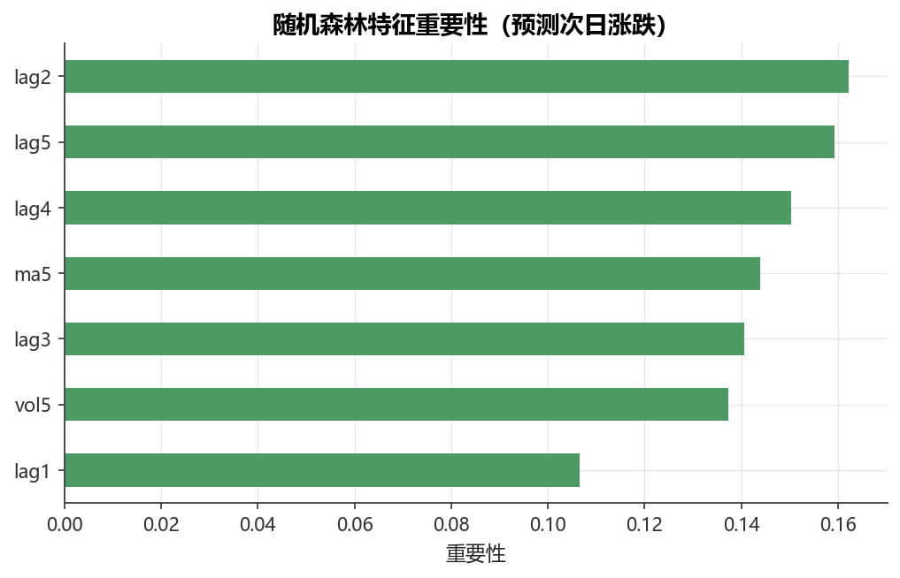

# 第11章 树模型与集成学习

[](https://colab.research.google.com/github/albertandking/financial-data-science/blob/main/notebooks/ch11_ensemble_trees.ipynb) [](https://mybinder.org/v2/gh/albertandking/financial-data-science/main?labpath=notebooks/ch11_ensemble_trees.ipynb)

!!! info "配套代码"
    `notebooks/ch11_ensemble_trees.ipynb`（使用 scikit-learn / xgboost）

## 11.1 本章导读

决策树是最直观的非线性模型之一，但单棵树容易过拟合、泛化能力差。集成学习通过组合多棵树的预测，大幅提升稳定性和准确度。随机森林（Random Forest）和梯度提升决策树（GBDT/XGBoost）是当前量化金融与风险建模中使用最广泛的机器学习模型，也是各类金融数据科学竞赛的常胜工具。

本章先从单棵决策树出发，理解分裂准则与过拟合；再系统阐述 Bagging（随机森林）和 Boosting（GBDT、XGBoost）的偏差-方差视角；最后以 A 股内置数据为实战场景，演示特征构造、时序交叉验证、超参调优与模型解释全流程。

## 11.2 学习目标

完成本章后，读者应能：

1. 解释决策树的分裂准则（基尼系数、信息熵、MSE），并分析深度与过拟合的关系；
2. 从偏差-方差权衡的角度区分 Bagging 与 Boosting 的降误差路径；
3. 用随机森林进行分类/回归，解读袋外误差（OOB）和特征重要性；
4. 描述 GBDT 的加法模型框架与残差拟合思路；
5. 配置并运行 XGBoost，调整核心超参数并理解其作用；
6. 使用时序交叉验证（承接第9章）进行超参搜索与早停；
7. 利用特征重要性（gain/split）或置换重要性解释模型决策，并理解 SHAP 值的思想；
8. 在 A 股预测场景中，对比 XGBoost 与逻辑回归的 AUC，分析过拟合风险。

---

## 11.3 决策树

### 11.3.1 树的结构与生长

决策树将特征空间递归地划分为若干矩形区域，每个叶节点给出该区域的预测值（分类时为多数类，回归时为均值）。学习算法的核心是在每个节点选择**最优分裂**：对所有特征 $j$ 和阈值 $t$，寻找使某个不纯度最小的 $(j, t)$ 组合。

**CART 算法**（Classification and Regression Trees）是 scikit-learn 默认实现，每次只做二叉分裂（左：$x_j \le t$，右：$x_j > t$）。

### 11.3.2 分裂准则

**分类树——基尼系数（Gini Impurity）**

$$G(p) = \sum_{k=1}^K p_k (1 - p_k) = 1 - \sum_{k=1}^K p_k^2$$

其中 $p_k$ 为节点中第 $k$ 类的比例。$G=0$ 表示节点纯净，$G$ 越大越不纯。

**分类树——信息熵（Entropy / Information Gain）**

$$H(p) = -\sum_{k=1}^K p_k \log_2 p_k$$

信息增益 = 父节点熵 − 子节点加权平均熵。信息增益率（C4.5）进一步除以分裂信息量，避免偏好多取值特征。

!!! note "基尼 vs 熵"
    二者在实践中差异通常很小。基尼不含对数运算，略快；熵对纯净节点更敏感。默认用基尼即可。

**回归树——均方误差（MSE）**

$$\text{MSE} = \frac{1}{n} \sum_{i=1}^n (y_i - \bar{y})^2$$

最优分裂使左右子集的加权 MSE 之和最小：

$$\min_{j,t}\left[\frac{n_L}{n} \text{MSE}_L(j,t) + \frac{n_R}{n} \text{MSE}_R(j,t)\right]$$

不纯度准则的本质，是把「一个节点里标签有多混乱」量化为一个非负的数。混乱度越低，意味着这个节点对预测越有把握；分裂的目的，就是用一刀切把混乱的父节点切成两个尽量「纯」的子节点。基尼系数与信息熵都满足两条直觉性质：当节点完全纯净（只剩一类）时取最小值 $0$；当各类比例相等时取最大值。它们的差别只在于「惩罚不纯」的曲率不同——熵在接近纯净时下降得更陡，因此对边际上的纯度提升更敏感；基尼则更平缓、计算更省。下面用数字把这套准则走通一遍，读者会发现「最优分裂」其实就是一次穷举比较。

!!! example "例 11.1 手算基尼系数与信息熵的最优分裂"
    设某节点有10个样本，标签为「明日上涨（+）」与「明日下跌（−）」两类，其中 $6$ 个为 $+$、$4$ 个为 $-$。考虑用单一特征「5日动量 `mom_5`」分裂，候选阈值 $t=0$（动量为正走右，非正走左）。分裂后：

    - 左子节点（$\text{mom\_5}\le 0$）：$4$ 个样本，$1$ 个 $+$、$3$ 个 $-$；
    - 右子节点（$\text{mom\_5}>0$）：$6$ 个样本，$5$ 个 $+$、$1$ 个 $-$。

    **第1步：父节点不纯度。** $p_+=0.6,\ p_-=0.4$，

    $G_{\text{父}}=1-(0.6^2+0.4^2)=1-(0.36+0.16)=0.48.$

    熵（以2为底）：$H_{\text{父}}=-0.6\log_2 0.6-0.4\log_2 0.4=0.6\times0.737+0.4\times1.322=0.971.$

    **第2步：左右子节点不纯度。** 左：$p_+=1/4=0.25$，
    $G_L=1-(0.25^2+0.75^2)=1-(0.0625+0.5625)=0.375.$
    右：$p_+=5/6\approx0.833$，
    $G_R=1-(0.833^2+0.167^2)=1-(0.694+0.028)=0.278.$

    **第3步：加权子节点不纯度与基尼下降。**
    $G_{\text{子}}=\frac{4}{10}\times0.375+\frac{6}{10}\times0.278=0.150+0.167=0.317.$
    $\Delta G=G_{\text{父}}-G_{\text{子}}=0.48-0.317=0.163.$

    **第4步：用熵复核。** 左熵 $H_L=-0.25\log_2 0.25-0.75\log_2 0.75=0.811$，右熵 $H_R=-0.833\log_2 0.833-0.167\log_2 0.167=0.650$。加权子熵 $=0.4\times0.811+0.6\times0.650=0.324+0.390=0.714$。信息增益 $=0.971-0.714=0.257$。

    **结论**：无论用基尼（下降 $0.163$）还是用熵（增益 $0.257$），这个分裂都把不纯度大幅压低，是一次「好分裂」。CART 在每个节点对所有特征、所有候选阈值重复以上四步，挑出 $\Delta G$ 最大的 $(j,t)$。可见所谓「学习最优分裂」，不过是一次带数字的穷举比较而已。

!!! note "推导：基尼系数是熵的一阶近似"
    为何基尼与熵在实践中结论高度一致？把二分类熵在 $p=1/2$ 附近展开即可看清。记单类比例为 $p$，对数用自然对数时，熵 $H(p)=-p\ln p-(1-p)\ln(1-p)$，基尼 $G(p)=2p(1-p)$。利用 $-\ln p$ 的一阶泰勒近似 $-\ln p\approx 1-p$（在 $p=1$ 附近），可得

    $H(p)=-p\ln p-(1-p)\ln(1-p)\approx p(1-p)+(1-p)\,p=2p(1-p)=G(p).$

    也就是说，基尼系数恰是信息熵在每类内部做一阶近似后的结果。二者作为 $p$ 的函数都是开口向下的凸曲线、在 $p=0.5$ 取极大、在 $p=0,1$ 取零，形状几乎重合（熵的峰更尖）。这解释了「换准则通常不改变树的结构」这一经验事实：默认用基尼（省去对数运算）即可，只有在极不平衡、追求对纯净节点更敏感时才考虑用熵。

### 11.3.3 过拟合与剪枝

不加限制地生长，决策树会完全拟合训练集（叶节点只含1个样本），导致方差极大、泛化失败。主要防过拟合手段：

| 手段 | 参数（sklearn） | 推荐范围 |
|------|----------------|---------|
| 限制深度 | `max_depth` | 3～8 |
| 最小叶节点样本数 | `min_samples_leaf` | 10～50 |
| 最小分裂样本数 | `min_samples_split` | 20～100 |
| 最小不纯度下降量 | `min_impurity_decrease` | 0～0.01 |
| 代价复杂度剪枝 | `ccp_alpha` | 通过 CV 选取 |

**代价复杂度剪枝**（后剪枝）：优化目标为

$$R_\alpha(T) = R(T) + \alpha |T|$$

其中 $R(T)$ 为树的训练误差，$|T|$ 为叶节点数，$\alpha \ge 0$ 为惩罚系数。随 $\alpha$ 增大，树被依次“剪叶”，通过交叉验证选择最优 $\alpha$。

!!! warning "单棵树在金融数据上极易过拟合"
    金融收益序列信噪比极低（通常 $R^2 < 0.05$），单棵深树几乎必然过拟合：训练 AUC 可达0.9以上，测试 AUC 却只有0.51。请始终使用验证集或时序交叉验证评估树的真实泛化能力。

---

## 11.4 集成思想：偏差-方差视角

给定测试点 $x$，均方预测误差可分解为：

$$\text{MSE} = \underbrace{[\text{Bias}(\hat{f}(x))]^2}_{\text{偏差}^2} + \underbrace{\text{Var}(\hat{f}(x))}_{\text{方差}} + \sigma^2$$

- **偏差**：模型的系统性误差，来自对真实关系的欠拟合假设；
- **方差**：模型对训练集扰动的敏感度，即不同训练集给出不同预测的程度；
- $\sigma^2$：不可消除的噪声。

**Bagging（自助聚合）降低方差**：对 $B$ 个自助样本各训练一棵复杂树（低偏差、高方差），再平均/投票。独立同分布情形下，$B$ 个均值的方差为单个的 $1/B$；实际因树间相关性，方差降幅有限但仍显著。

**Boosting 降低偏差**：串行训练弱学习器（浅树），每一轮拟合上一轮的残差（或负梯度），逐步减小系统误差。代价是若迭代过多，方差也会上升（需早停或正则化）。

$$\text{集成收益示意：}$$

| 方法 | 偏差 | 方差 | 适合基学习器 |
|------|------|------|------------|
| 单棵深树 | 低 | 高 | — |
| Bagging / RF | 低 | 低（平均）| 深树 |
| Boosting / GBDT | 从高到低（逐步）| 较低（正则化后）| 浅树 |

把 Bagging 与 Boosting 并排放在一起，最容易记住它们「治什么病」的分工：前者用并行平均去「方差」，后者用串行修正去「偏差」。下表把两者的机制、基学习器、训练方式与对噪声的态度逐项对照，金融场景中尤其要留意最后一行——Boosting 对脏标签更敏感，这正是低信噪比的 A 股日频数据容易把它带进过拟合的根源。

| 维度 | Bagging（随机森林） | Boosting（GBDT / XGBoost） |
|------|--------------------|---------------------------|
| 主攻目标 | 降方差 | 降偏差 |
| 训练方式 | 并行，各树相互独立 | 串行，第 $m$ 棵依赖前 $m-1$ 棵 |
| 基学习器 | 深树（低偏差、高方差） | 浅树（高偏差、低方差） |
| 样本权重 | 各样本等权（自助抽样） | 难样本被反复「加权」拟合 |
| 过拟合来源 | 树太相关时方差降不下去 | 迭代过多时方差回升 |
| 主要正则手段 | 增大树数、特征随机 | 早停、学习率、`lambda`/`gamma` |
| 对标签噪声 | 较稳健（平均抵消） | 敏感（会去拟合噪声残差） |
| 可并行性 | 天然并行 | 仅特征维度可并行 |

!!! tip "一句话记忆"
    方差高（训练好、测试差、对数据扰动敏感）就往 Bagging 靠；偏差高（训练测试都不好、欠拟合）就往 Boosting 靠。金融预测里多数失败属于前者——过拟合，所以随机森林常作为稳健基线，而 XGBoost 必须配早停与强正则才敢用。

---

## 11.5 随机森林

### 11.5.1 算法核心：自助采样 + 特征随机

随机森林 = Bagging（有放回抽样） + **特征随机子集**。

**训练第 $b$ 棵树的步骤：**

1. 从训练集中有放回地抽取 $n$ 个样本（自助样本），约 $63.2\%$ 样本被选中；
2. 在每个节点，只从 $m$ 个随机选出的特征（而非全部 $p$ 个）中寻找最优分裂；
3. 不剪枝，树生长至最大深度。

默认 $m = \lfloor\sqrt{p}\rfloor$（分类）或 $m = \lfloor p/3 \rfloor$（回归）。特征随机化使各棵树之间的相关性降低，进一步减小集成方差。

### 11.5.2 袋外误差（OOB）

每棵树约 $36.8\%$ 的样本未参与训练（袋外样本，Out-Of-Bag）。利用这些未见样本对该棵树进行预测，所有树的 OOB 预测汇总后可得到**免费的交叉验证误差**，无需额外划分验证集。

当样本量 $n$ 足够大时，OOB 误差是测试误差的良好近似。

### 11.5.3 特征重要性

**impurity importance（不纯度重要性）**：特征 $j$ 的重要性 = 在所有树、所有使用了该特征的分裂节点上，不纯度的总下降量（按样本数加权），再除以样本总数。

$$\text{Importance}_j = \frac{1}{B} \sum_{b=1}^B \sum_{\text{节点 } t \in T_b : v(t)=j} \frac{n_t}{n} \Delta i(t)$$

!!! warning "不纯度重要性偏向高基数特征"
    若某特征取值极多（如连续数值未分箱），其被选为分裂节点的概率本身更大，不纯度重要性会被高估。对于金融中常见的连续特征，建议结合置换重要性或 SHAP 进行验证。

**置换重要性（Permutation Importance）**：在测试集（或 OOB 集）上，随机打乱某特征后，模型性能下降的幅度。不受特征基数影响，更能反映“该特征对泛化的贡献”。

### 11.5.4 袋外误差的数字计算

前面说 OOB 是「免费的交叉验证」，听起来有点玄，其实拆开看只是一次「只让没见过这个样本的树来投票」的统计。关键在于：对样本 $i$ 而言，约 $36.8\%$ 的树在训练时没抽到它，这些树构成它的「袋外评审团」；用这个评审团对 $i$ 投票，得到的就是一个近似样本外的预测。把全部样本各自的袋外预测汇总，再与真实标签比对，就得到 OOB 误差。下面用一个迷你森林把这套流程算到底。

!!! example "例 11.2 随机森林袋外（OOB）误差手算"
    设训练集只有 $5$ 个样本 $\{1,2,3,4,5\}$，真实标签均为「上涨=1」中的 $\{1,1,0,1,0\}$。我们训练 $4$ 棵树，每棵树的自助样本（有放回抽样，括号内为被抽中的样本编号）与「未被抽中」的袋外集如下：

    | 树 | 自助样本（训练用） | 袋外样本 |
    |----|-------------------|---------|
    | $T_1$ | $\{1,2,2,4,5\}$ | $\{3\}$ |
    | $T_2$ | $\{1,1,3,4,4\}$ | $\{2,5\}$ |
    | $T_3$ | $\{2,3,3,5,5\}$ | $\{1,4\}$ |
    | $T_4$ | $\{1,3,4,4,5\}$ | $\{2\}$ |

    **第1步：收集每个样本的袋外评审团。** 样本 $1$ 只被 $T_3$ 当作袋外（$T_3$ 没抽到它）；样本 $2$ 被 $T_2,T_4$ 当作袋外；样本 $3$ 被 $T_1$；样本 $4$ 被 $T_3$；样本 $5$ 被 $T_2$。

    **第2步：用各自评审团投票。** 假设这些树对袋外样本给出的预测类别为：

    | 样本 | 评审团（树） | 各树预测 | 多数投票 | 真实标签 | 是否正确 |
    |------|------------|---------|---------|---------|---------|
    | 1 | $T_3$ | 1 | 1 | 1 | ✓ |
    | 2 | $T_2,T_4$ | 1, 0 | 平票→取1 | 1 | ✓ |
    | 3 | $T_1$ | 1 | 1 | 0 | ✗ |
    | 4 | $T_3$ | 1 | 1 | 1 | ✓ |
    | 5 | $T_2$ | 0 | 0 | 0 | ✓ |

    **第3步：汇总。** 5个样本中错1个（样本3），

    $\text{OOB 误差}=\frac{\text{袋外错分数}}{\text{有袋外预测的样本数}}=\frac{1}{5}=0.20,\quad \text{OOB 准确率}=0.80.$

    注意：这里每个样本只用「没见过它」的树投票，因此不存在「拿训练样本评自己」的乐观偏差。当样本量大、树数多（成百上千）时，几乎每个样本都有约 $0.368B$ 棵树作袋外评审，投票结果稳定，OOB 误差就成为测试误差的可靠近似——而且一分验证数据都没浪费。在 sklearn 中只需设 `oob_score=True`，用 `rf.oob_score_` 读取 OOB 准确率。

---

## 11.6 梯度提升决策树（GBDT）

### 11.6.1 加法模型框架

GBDT 将预测器表示为 $M$ 棵树的加法组合：

$$F_M(x) = \sum_{m=0}^M \eta \cdot h_m(x)$$

其中 $h_m$ 是第 $m$ 棵回归树，$\eta \in (0,1]$ 为学习率（shrinkage）。训练目标是最小化损失函数之和：

$$\min_{\{h_m\}} \sum_{i=1}^n L(y_i, F_M(x_i))$$

对分类任务通常选交叉熵，对回归选 MSE 或 MAE。

### 11.6.2 残差拟合视角（梯度下降视角）

第 $m$ 轮，计算当前模型 $F_{m-1}$ 在每个样本上的**伪残差**（负梯度）：

$$r_{i,m} = -\left[\frac{\partial L(y_i, F(x_i))}{\partial F(x_i)}\right]_{F=F_{m-1}}$$

对 MSE 损失，$r_{i,m} = y_i - F_{m-1}(x_i)$ 即真实残差；对对数损失，则为预测概率误差。

新树 $h_m$ 拟合这批伪残差，然后更新：

$$F_m(x) = F_{m-1}(x) + \eta \cdot h_m(x)$$

**直觉**：每一轮都在梯度下降方向上“修正”上一轮的错误，浅树（$\text{max\_depth}=3\sim5$）作为弱学习器已足够。

### 11.6.3 学习率与树数的权衡

- 学习率 $\eta$ 越小，每步修正越保守，需要更多树才能收敛，但泛化通常更好；
- 树数越多，训练误差单调下降，但过多会导致过拟合（方差上升）；
- **早停（Early Stopping）**：监控验证集误差，若连续 $k$ 轮不改善则停止训练，自动确定最优树数。

推荐组合：$\eta = 0.05 \sim 0.1$，$n\_\text{estimators} = 300 \sim 1000$，配合早停。

### 11.6.4 负梯度即残差：推导与数字例

GBDT 最常被误解的一点是「为什么拟合残差就等于在做梯度下降」。把损失函数的负梯度算出来就一目了然——在平方损失下，负梯度恰好就是普通意义上的残差。理解这一点，才能明白 GBDT 不是「凭直觉去补差额」，而是在函数空间里沿着最速下降方向走一步。

!!! note "推导：平方损失的负梯度等于残差"
    取单样本平方损失 $L(y,F)=\tfrac{1}{2}(y-F)^2$，把当前模型的输出 $F(x_i)$ 视作可优化的「变量」。对 $F$ 求导：

    $\frac{\partial L(y_i,F(x_i))}{\partial F(x_i)}=\frac{\partial}{\partial F}\Big[\tfrac12(y_i-F)^2\Big]=-(y_i-F(x_i)).$

    因此伪残差（负梯度）

    $r_{i,m}=-\left[\frac{\partial L}{\partial F}\right]_{F=F_{m-1}}=y_i-F_{m-1}(x_i),$

    正是「真实值减去当前预测」的普通残差。于是「新树拟合残差」与「在函数空间沿负梯度方向走一步」是同一件事，更新 $F_m=F_{m-1}+\eta\,h_m$ 就是步长为 $\eta$ 的梯度下降。对其它损失（如对数损失）残差不再等于 $y-F$，但「拟合负梯度」这一框架完全通用——这正是 Friedman「梯度提升机」的核心抽象。

!!! example "例 11.3 GBDT 一轮残差拟合的数字演示"
    用 $4$ 个样本做回归（预测次日超额收益，单位 %），平方损失，学习率 $\eta=0.5$。

    | 样本 | 真实 $y_i$ |
    |------|-----------|
    | A | 3.0 |
    | B | 1.0 |
    | C | -1.0 |
    | D | -3.0 |

    **第0步：初始化。** 用常数模型，最优初值为均值 $F_0=\bar{y}=\tfrac{3+1-1-3}{4}=0$。

    **第1步：算伪残差。** $r_i=y_i-F_0$，即 $r=(3,1,-1,-3)$。

    **第2步：拟合一棵两叶回归树 $h_1$。** 设这棵浅树按某特征把 $\{A,B\}$ 分到左叶、$\{C,D\}$ 分到右叶，叶输出取叶内残差均值：

    $h_1(\text{左})=\frac{3+1}{2}=2.0,\qquad h_1(\text{右})=\frac{-1-3}{2}=-2.0.$

    **第3步：更新模型。** $F_1=F_0+\eta\,h_1$：

    | 样本 | $F_0$ | $h_1$ | $F_1=0+0.5\,h_1$ | 新残差 $y-F_1$ |
    |------|------|------|------------------|----------------|
    | A | 0 | 2.0 | 1.0 | 2.0 |
    | B | 0 | 2.0 | 1.0 | 0.0 |
    | C | 0 | -2.0 | -1.0 | 0.0 |
    | D | 0 | -2.0 | -1.0 | -2.0 |

    **第4步：看损失下降。** 初始总平方误差 $\sum r^2=9+1+1+9=20$；一轮后 $\sum(y-F_1)^2=4+0+0+4=8$。损失从 $20$ 降到 $8$，下降了 $60\%$。

    可见学习率 $\eta=0.5$ 让模型只走了「理论最优一步」的一半（若 $\eta=1$，B、C 会被一步拟合到位但 A、D 仍欠拟合），保留余量给后续的树继续修正。下一轮将对新残差 $(2,0,0,-2)$ 再拟合一棵树，如此串行迭代，逐步逼近真实值——这正是「逐步减小偏差」的数字写照。

---

## 11.7 XGBoost：正则化提升

XGBoost（eXtreme Gradient Boosting）在 GBDT 基础上引入了以下关键改进：

### 11.7.1 正则化目标函数

$$\mathcal{L}^{(m)} = \sum_{i=1}^n L(y_i, \hat{y}_i^{(m)}) + \Omega(h_m)$$

$$\Omega(h) = \gamma T + \frac{1}{2}\lambda \sum_{j=1}^T w_j^2$$

其中 $T$ 为叶节点数，$w_j$ 为叶权重，$\gamma$ 控制叶数量（剪枝），$\lambda$ 为 L2权重正则化。

### 11.7.2 二阶泰勒近似

对损失函数在 $\hat{y}^{(m-1)}$ 处做二阶展开：

$$L(y_i, \hat{y}^{(m-1)} + h_m(x_i)) \approx L(y_i, \hat{y}^{(m-1)}) + g_i h_m(x_i) + \frac{1}{2} h_i h_m^2(x_i)$$

其中 $g_i$ 为一阶导数（梯度），$h_i$ 为二阶导数（海森）。利用二阶信息可以给出每个叶节点最优权重的解析解，并精确计算分裂增益：

$$\text{Gain} = \frac{1}{2}\left[\frac{G_L^2}{H_L + \lambda} + \frac{G_R^2}{H_R + \lambda} - \frac{(G_L+G_R)^2}{H_L+H_R+\lambda}\right] - \gamma$$

### 11.7.3 关键超参数速查

| 超参 | 含义 | 推荐范围 | 作用 |
|------|------|---------|------|
| `n_estimators` | 树的数量 | 100～1000，配合早停 | 迭代轮数 |
| `max_depth` | 每棵树最大深度 | 3～6 | 控制单树复杂度 |
| `learning_rate` (`eta`) | 学习率 | 0.01～0.1 | 步长缩减 |
| `subsample` | 行采样比例 | 0.6～0.9 | 随机化，降方差 |
| `colsample_bytree` | 列采样比例 | 0.6～0.9 | 特征随机化 |
| `lambda` | L2正则 | 1～10 | 叶权重惩罚 |
| `gamma` | 最小增益阈值 | 0～5 | 最小分裂增益 |
| `min_child_weight` | 子节点最小样本权重 | 1～10 | 避免过小叶节点 |

### 11.7.4 缺失值处理

XGBoost 原生支持缺失值：训练时对每个分裂节点学习缺失值应走左子树还是右子树（稀疏感知算法），无需预先填充。这在金融数据（停牌、缺指标）中非常实用。

### 11.7.5 并行计算

特征维度的分裂增益计算天然可并行（`nthread` 参数控制线程数），在多核机器上显著加速。

### 11.7.6 分裂增益公式的推导

11.7.2给出的 Gain 公式不是凭空设定，而是从「二阶泰勒近似 + L2正则」严格推出来的。把这条链路走通，读者就能理解 `lambda`（叶权重正则）和 `gamma`（分裂门槛）到底在公式的哪个位置起作用，从而知道调它们会改变什么。

!!! note "推导：二阶泰勒给出叶权重与分裂增益"
    设某叶节点 $j$ 含样本集合 $I_j$，叶权重为待定常数 $w_j$。把第 $m$ 棵树该叶上的目标（二阶展开后，丢掉与 $w$ 无关的常数项）写成

    $\tilde{\mathcal{L}}_j(w_j)=\Big(\sum_{i\in I_j}g_i\Big)w_j+\frac12\Big(\sum_{i\in I_j}h_i+\lambda\Big)w_j^2,$

    记 $G_j=\sum_{i\in I_j}g_i$（梯度之和）、$H_j=\sum_{i\in I_j}h_i$（海森之和）。对 $w_j$ 求导置零：

    $\frac{\partial \tilde{\mathcal{L}}_j}{\partial w_j}=G_j+(H_j+\lambda)w_j=0\ \Rightarrow\ w_j^\star=-\frac{G_j}{H_j+\lambda}.$

    回代得该叶的最优目标值（越小越好）

    $\tilde{\mathcal{L}}_j(w_j^\star)=-\frac12\frac{G_j^2}{H_j+\lambda}.$

    一个节点若被分成左右两叶，目标值从 $-\tfrac12\frac{(G_L+G_R)^2}{H_L+H_R+\lambda}$ 变为 $-\tfrac12\frac{G_L^2}{H_L+\lambda}-\tfrac12\frac{G_R^2}{H_R+\lambda}$，再为「多出一个叶子」付出 $\gamma$ 的代价。两者之差即「分裂带来的目标下降」，也就是增益

    $\text{Gain}=\frac12\left[\frac{G_L^2}{H_L+\lambda}+\frac{G_R^2}{H_R+\lambda}-\frac{(G_L+G_R)^2}{H_L+H_R+\lambda}\right]-\gamma.$

    由此看清：$\lambda$ 出现在每个分母里，会把叶权重和增益一起「压小」（正则化，抗过拟合）；$\gamma$ 是直接从增益里扣的固定门槛，只有 $\text{Gain}>0$（即净下降为正）才值得分裂，否则该分裂被剪掉——这就是 XGBoost 的预剪枝机制。

!!! example "例 11.4 XGBoost 分裂增益公式代入数字"
    考虑一个含 $4$ 个样本的待分裂节点，用对数损失做二分类。设当前各样本的一阶梯度 $g_i$ 与二阶海森 $h_i$ 已算出（数值典型范围 $g\in[-1,1]$、$h\in[0,0.25]$）：

    | 样本 | $g_i$ | $h_i$ |
    |------|------|------|
    | 1 | -0.5 | 0.25 |
    | 2 | -0.3 | 0.21 |
    | 3 |  0.4 | 0.24 |
    | 4 |  0.6 | 0.24 |

    候选分裂把 $\{1,2\}$ 分到左、$\{3,4\}$ 分到右。取正则参数 $\lambda=1,\ \gamma=0.05$。

    **第1步：聚合梯度与海森。**
    $G_L=-0.5-0.3=-0.8,\quad H_L=0.25+0.21=0.46;$
    $G_R=0.4+0.6=1.0,\quad H_R=0.24+0.24=0.48;$
    $G_L+G_R=0.2,\quad H_L+H_R=0.94.$

    **第2步：代入三项。**
    $$\frac{G_L^2}{H_L+\lambda}=\frac{0.64}{1.46}=0.438,\quad
    \frac{G_R^2}{H_R+\lambda}=\frac{1.00}{1.48}=0.676,$$
    $\frac{(G_L+G_R)^2}{H_L+H_R+\lambda}=\frac{0.04}{1.94}=0.021.$

    **第3步：算增益。**
    $\text{Gain}=\frac12\,(0.438+0.676-0.021)-0.05=\frac12\times1.093-0.05=0.547-0.05=0.497.$

    增益 $0.497>0$，分裂被采纳。直觉上，左叶梯度全为负（样本偏向「应增大预测」）、右叶梯度全为正，左右方向相反，分开能让两叶各自取到差别很大的最优权重 $w_L^\star=-G_L/(H_L+\lambda)=0.8/1.46=+0.548$、$w_R^\star=-1.0/1.48=-0.676$，故收益大。**反例直觉**：若把 $\gamma$ 调到 $0.6$，则 $\text{Gain}=0.547-0.6<0$，这次分裂会被剪掉——这正是用 `gamma` 控制树复杂度、抑制过拟合的杠杆。

---

## 11.8 调参：时序交叉验证

### 11.8.1 为什么不能用随机 K-Fold

金融时间序列存在**前视偏差（look-ahead bias）**：若验证集含有训练集“未来”的数据，模型评估结果会虚高。必须使用时序交叉验证（Time Series Cross-Validation / Walk-Forward Validation）。

**sklearn 的 `TimeSeriesSplit`**：将数据按时间依次划分为 $k$ 折，每折验证集均在训练集之后。

```
折1：TRAIN=[1..200]  VAL=[201..250]
折2：TRAIN=[1..250]  VAL=[251..300]
折3：TRAIN=[1..300]  VAL=[301..350]
...
```

### 11.8.2 超参搜索

**网格搜索**：穷举所有组合，适合参数空间小时使用。

**随机搜索**：从参数分布中随机采样，适合参数空间大时；通常50~200次采样已能找到接近最优解。

**早停结合网格/随机搜索**：固定较大 `n_estimators`，通过 `early_stopping_rounds` 自动确定最优树数，减少一个调参维度。

!!! note "A 股调参的实践建议"
    A 股日频数据噪声大、样本量有限，过度调参容易产生“在历史上调出来的最优超参”。建议：(1) 将调参范围集中在 `max_depth`（3～5）和 `learning_rate`（0.01～0.1）；(2) 至少保留1年数据作为最终样本外测试集；(3) 关注 AUC 的方差，而非单点均值。

---

## 11.9 模型解释

<figure markdown>
  { width="680" }
  <figcaption>图11-1随机森林特征重要性</figcaption>
</figure>


### 11.9.1 不纯度特征重要性（Gain / Split Count）

XGBoost 提供两种内置重要性：
- **weight**（split count）：特征被用作分裂节点的次数；
- **gain**：特征贡献的平均分裂增益；
- **cover**：特征分裂所覆盖的平均样本数。

`gain` 是最能反映“对损失下降贡献”的指标，通常优先使用。

### 11.9.2 置换重要性（Permutation Importance）

对模型“遮蔽”某特征（打乱其值），观察性能（AUC、准确率等）下降多少。优点：与模型无关，适用于任何黑盒；能检测特征的真实预测贡献而非仅凭分裂次数。

```python
from sklearn.inspection import permutation_importance
result = permutation_importance(model, X_test, y_test, n_repeats=10,
                                random_state=42, scoring='roc_auc')
```

### 11.9.3 SHAP 值（Shapley Additive Explanations）

SHAP 将博弈论中的 Shapley 值引入机器学习解释：对每个预测样本，将每个特征对预测输出的“贡献”精确分解，满足**效率性**（贡献之和 = 预测值 − 基准值）、**对称性**与**虚特征**等公理。

$$\phi_j = \sum_{S \subseteq F \setminus \{j\}} \frac{|S|!(|F|-|S|-1)!}{|F|!} \left[v(S \cup \{j\}) - v(S)\right]$$

对树模型，TreeSHAP 算法将 Shapley 值的计算复杂度从指数降至多项式，并且精确而非近似。

**常用图表**：
- **Summary Plot**：所有样本所有特征的 SHAP 值分布，既看方向又看大小；
- **Dependence Plot**：某特征的 SHAP 值与其取值的关系，揭示非线性与交互；
- **Force Plot / Waterfall**：单样本解释，逐特征“叠加”至最终预测。

!!! info "shap 库的安装"
    本教材环境中若 `import shap` 失败，使用 `sklearn.inspection.permutation_importance` 替代，并在正文中理解 SHAP 思想。安装方式：`pip install shap`（需 C++ 编译环境）。

### 11.9.4 特征重要性（gain）的计算与解读

`gain` 重要性的算法其实是例11.4的自然延伸：每当某特征被用作一个分裂节点，就给它记上那次分裂的 Gain；训练结束后，把同一特征在所有树、所有分裂上的 Gain 累加（或取平均），就是它的 gain 重要性。换言之，gain 回答的是「这个特征一共为损失下降贡献了多少」，而 `weight`（split count）只回答「被用了几次」——一个被频繁使用但每次贡献都很小的特征，weight 高而 gain 未必高。

!!! example "例 11.5 特征重要性（gain）解读"
    设一棵小树共发生 $5$ 次分裂，分别用到3个特征，各次分裂的 Gain 如下表：

    | 分裂序号 | 使用特征 | 该次 Gain |
    |---------|---------|----------|
    | 1（根） | `mom_20` | 0.50 |
    | 2 | `vol_20` | 0.30 |
    | 3 | `mom_20` | 0.10 |
    | 4 | `ret_1` | 0.06 |
    | 5 | `ret_1` | 0.04 |

    **按特征聚合 total gain：**
    $\text{mom\_20}=0.50+0.10=0.60,\quad \text{vol\_20}=0.30,\quad \text{ret\_1}=0.06+0.04=0.10.$
    总 Gain $=0.60+0.30+0.10=1.00$，归一化后的相对重要性为 $\text{mom\_20}=60\%,\ \text{vol\_20}=30\%,\ \text{ret\_1}=10\%$。

    **weight（split count）对比：** `mom_20` 用2次、`vol_20` 用1次、`ret_1` 用2次。注意 `ret_1` 与 `mom_20` 的 weight 都是2，但 `mom_20` 的 gain（$0.60$）是 `ret_1`（$0.10$）的6倍——`ret_1` 虽常被用，每次只切在树的深层、贡献微小。

    **解读要点**：
    1. `mom_20`（月度动量）贡献了 $60\%$ 的损失下降，是该模型最核心的预测信号，且它被选为根节点，说明对样本整体区分力最强；
    2. 若仅看 weight 会误判 `ret_1` 与 `mom_20` 同等重要，故金融场景优先看 gain；
    3. gain 高 ≠ 因果。动量重要可能只反映了某段行情的风格，换一个市场区间重要性排序可能翻转，应配合置换重要性（在样本外打乱该特征看 AUC 跌多少）和 SHAP 交叉验证，切忌据单一重要性图下因果结论。

---

## 11.10 树模型在金融中的优劣

### 11.10.1 优势

1. **天然处理非线性与交互**：无需手工构造交叉特征，树自动捕捉特征间的非线性组合；
2. **对特征尺度不敏感**：分裂基于排序，无需标准化；
3. **自动处理缺失值**（XGBoost/LightGBM）：金融数据停牌、缺指标直接喂入；
4. **特征重要性**：内置可解释性工具；
5. **速度快**：XGBoost 并行化，百万样本分钟级训练。

### 11.10.2 劣势与风险

!!! warning "金融时序的过拟合陷阱"
    1. **信噪比极低**：涨跌方向预测 AUC 通常在0.52～0.58已属优秀。如果 AUC > 0.65，几乎可以确定存在数据泄漏或前视偏差；
    2. **特征工程依赖**：树模型仍然高度依赖“好特征”，垃圾特征进、垃圾预测出；
    3. **外推能力弱**：树模型在训练集特征范围之外无法推断（预测值被“截断”在叶节点范围内），市场结构变化时需重新训练；
    4. **换手率/交易成本**：高 AUC 不等于高收益，需额外建模交易成本；
    5. **因果混淆**：特征重要性≠因果效应，高重要性特征可能只是相关信号而非驱动因素。

---

## 11.11 A 股实战：涨跌预测与模型对比

### 11.11.1 特征工程

以内置4只 A 股数据为例，构造以下技术类特征：

| 特征 | 公式/含义 | 金融直觉 |
|------|---------|---------|
| `mom_5` | 5日动量（5日前至今的收益率） | 短期惯性 |
| `mom_20` | 20日动量 | 月度动量 |
| `vol_5` | 5日滚动波动率 | 短期风险 |
| `vol_20` | 20日滚动波动率 | 月度风险 |
| `ret_1` | 昨日收益率 | 短线反转信号 |
| `ma_ratio` | 当前价 / 20日均线 | 偏离程度 |
| `high_low` | (最高-最低)/开盘价（需日线OHLC，此处用价格代理） | 当日振幅代理 |

预测目标 $y = \mathbf{1}[\text{明日收益率} > 0]$（二分类，预测次日是否上涨）。

### 11.11.2 时序划分

按时间切分，前70% 为训练+验证集，后30% 为测试集（严禁随机打乱）。

### 11.11.3 XGBoost vs 逻辑回归对比

| 指标 | XGBoost | 逻辑回归 |
|------|---------|---------|
| 训练 AUC | — | — |
| 测试 AUC | （见 notebook 运行结果）| （见 notebook 运行结果）|
| 主要优势 | 捕捉非线性交互 | 可解释系数，不易过拟合 |
| 主要风险 | 超参敏感，需交叉验证 | 假设线性，错失非线性信息 |

上表的数字留待 notebook 实跑填写，但「该读出什么结论」可以先讲透。下面给一组贴近真实日频实验的典型数值，演示如何从训练/测试 AUC 的对比里读出过拟合，并理解「为什么 XGBoost 不一定打得过逻辑回归」。

!!! example "例 11.6 A 股涨跌预测：XGBoost vs 逻辑回归 AUC"
    在某只 A 股的日频数据上，用11.11.1的7个技术特征预测次日涨跌，按时间 $70\%/30\%$ 切分训练与测试，得到一组典型结果（数值随随机种子与区间略有波动）：

    | 模型 | 训练 AUC | 测试 AUC | 训练−测试 |
    |------|---------|---------|----------|
    | XGBoost（默认、深树、无早停） | 0.88 | 0.512 | 0.368 |
    | XGBoost（`max_depth=3`、`eta=0.03`、强正则、早停） | 0.61 | 0.548 | 0.062 |
    | 逻辑回归（标准化 + L2） | 0.57 | 0.541 | 0.029 |

    **怎么读这张表：**

    1. **第一行是教科书式过拟合。** 训练 AUC 高达 $0.88$、测试只有 $0.512$（仅略好于抛硬币的 $0.5$），训练−测试差 $0.368$ 巨大。深而不正则的 XGBoost 把日频噪声当成了规律去拟合——正是11.3节那条 warning 的真实写照。
    2. **正则化后泛化反而变好。** 第二行把深度压到 $3$、学习率降到 $0.03$、开早停，训练 AUC 掉到 $0.61$，但测试 AUC 升到 $0.548$，差距缩到 $0.062$。「主动降低训练表现以换取泛化」是金融 ML 的核心反直觉。
    3. **XGBoost 仅以微弱优势胜出逻辑回归。** $0.548$ vs $0.541$，差 $0.007$——在 A 股低信噪比环境里，非线性模型相对线性基线的增益往往就是这么小。逻辑回归训练测试差最小（$0.029$），最稳健、最可解释，是当之无愧的「不能省的基线」。
    4. **AUC 的量级要有概念。** 测试 AUC 落在 $0.52\sim0.55$ 已属正常偏好；若某次实验得到 $0.70$，第一反应不该是高兴，而应排查前视偏差、特征里混入了未来信息（如用了当日收盘后才知道的量）或标签泄漏。

    !!! warning "过拟合警示：高训练 AUC 是陷阱不是成绩"
        评判金融预测模型，绝不能只看训练集或单点测试 AUC。务必：(1) 同时报告训练与测试 AUC，盯住二者的差；(2) 用时序交叉验证报告测试 AUC 的均值与标准差，而非一个幸运的单点；(3) 永远保留一段最靠后的样本外数据，调参全程不许碰；(4) 把逻辑回归当作必跑基线——若复杂模型打不过它，复杂度就是负担。

---

## 11.12 本章小结

本章系统介绍了树模型从单棵决策树到集成学习的完整体系：

- **决策树**：分裂准则（基尼/熵/MSE）决定如何分割空间；深度和叶节点约束防止过拟合；
- **随机森林**：Bagging + 特征随机，通过降低树间相关性大幅减小方差；OOB 误差是免费的交叉验证；
- **GBDT/XGBoost**：加法模型 + 梯度下降，每轮拟合残差，逐步减小偏差；正则化项和早停防止过拟合；
- **超参调优**：金融场景必须用时序交叉验证；关注测试 AUC 的分布而非单点；
- **模型解释**：特征重要性（gain）+ 置换重要性 + SHAP 值（概念），从不同角度理解模型；
- **金融应用注意**：低信噪比、外推能力弱、不等于因果，需配合经济学直觉使用。

---

## 11.13 习题

**习题11.1**（理论）：
决策树的基尼系数和信息熵在二分类问题中的数值关系如何？证明：当 $p_1 = p_2 = 0.5$ 时，基尼系数 $G = 0.5$，信息熵 $H = 1$（以2为底）。

> **参考思路**：代入 $p_1 = p_2 = 0.5$，$G = 1 - (0.5^2 + 0.5^2) = 0.5$；$H = -2 \times 0.5 \log_2 0.5 = 1$。两者在极值点（均匀分布时）同时达到最大，但数值尺度不同，实践中影响微小。

**习题11.2**（编程）：
用 scikit-learn 在内置信用数据（`load_credit()`）上训练随机森林，通过 OOB 误差选择最优树数（试50、100、200、500），画出 OOB 误差随树数的变化曲线。讨论：增加树数是否一定有益？

> **参考思路**：
> ```python
> from fds import load_credit
> from sklearn.ensemble import RandomForestClassifier
> # oob_score=True 开启 OOB 评估
> oob_errors = []
> for n in [50, 100, 200, 500]:
>     rf = RandomForestClassifier(n_estimators=n, oob_score=True, random_state=42)
>     rf.fit(X, y)
>     oob_errors.append(1 - rf.oob_score_)
> ```
> OOB 误差通常随树数增加而先快速下降后趋于平稳，增至一定数量后几乎无收益但增加训练时间。

**习题11.3**（理论）：
解释 Boosting 与 Bagging 在“偏差-方差权衡”上的不同路径。若金融预测中发现：模型训练 AUC = 0.72，测试 AUC = 0.53，问题更可能是偏差还是方差？应如何调整？

> **参考思路**：训练/测试差距大 → 高方差（过拟合）。Boosting 需减少迭代轮数（树数）或加大正则化（减小 `max_depth`、增大 `lambda`、降低 `learning_rate` + 早停）；也可增加训练数据、缩短特征回看窗口、移除低质量特征。

**习题11.4**（编程）：
在 A 股预测任务（`ch11_ensemble_trees.ipynb`）中，将训练集扩展到全部4只股票，不做任何股票层面的数据泄漏处理（即 pooled），与单只股票 TECH 的结果比较测试 AUC。讨论混合多支股票时需注意哪些数据处理问题。

> **参考思路**：混合时需对收益率/特征做截面标准化，避免某只股票的均值漂移主导模型；同时测试集须仍为时间靠后的数据。常见陷阱：同一时刻多支股票的标签高度相关（市场整体涨跌），导致虚高 AUC。

**习题11.5**（开放思考）：
SHAP 值满足“效率性”公理：所有特征 SHAP 值之和等于预测值与基准值之差。请解释这一性质在以下场景中的意义：(a) 信贷风险解释；(b) A 股量化选股的监管合规（金融产品投资决策说明）。

> **参考思路**：
> (a) 信贷风险中，可以对借款人说明“您的年龄 +0.02、收入 −0.05、负债率 +0.08...总风险评分 = 基准0.15 + 合计 +0.10 = 0.25”，比特征重要性排名更具可操作性；
> (b) 量化选股中，SHAP 可以回应监管“为何买入/不买入该股票”的质询，提供逐样本、逐特征的分解证据，符合 MiFID II / 中国资管新规对“可解释投资决策”的精神要求。

---

## 11.14 拓展阅读

1. **Breiman, L. (2001)**. *Random Forests*. Machine Learning, 45(1), 5-32. 随机森林原始论文，奠定了理论基础。

2. **Friedman, J.H. (2001)**. *Greedy function approximation: A gradient boosting machine*. Annals of Statistics, 29(5), 1189-1232. GBDT 奠基性论文，梯度提升的完整推导。

3. **Chen, T. & Guestrin, C. (2016)**. *XGBoost: A scalable tree boosting system*. KDD 2016. XGBoost 原始论文，详细介绍正则化、二阶近似与稀疏感知。

4. **Lundberg, S. & Lee, S.-I. (2017)**. *A unified approach to interpreting model predictions*. NeurIPS 2017. SHAP 原始论文，Shapley 值的统一框架。

5. **López de Prado, M. (2018)**. *Advances in Financial Machine Learning*. Wiley. 第6、8章专门讨论金融场景的特征工程与时序交叉验证，是量化金融 ML 的标准参考书。

6. **scikit-learn 官方文档**. [Ensemble methods](https://scikit-learn.org/stable/modules/ensemble.html). 随机森林与梯度提升的参数详解与示例。

7. **XGBoost 官方文档**. [XGBoost Parameters](https://xgboost.readthedocs.io/en/stable/parameter.html). 全部超参数说明与调优建议。
