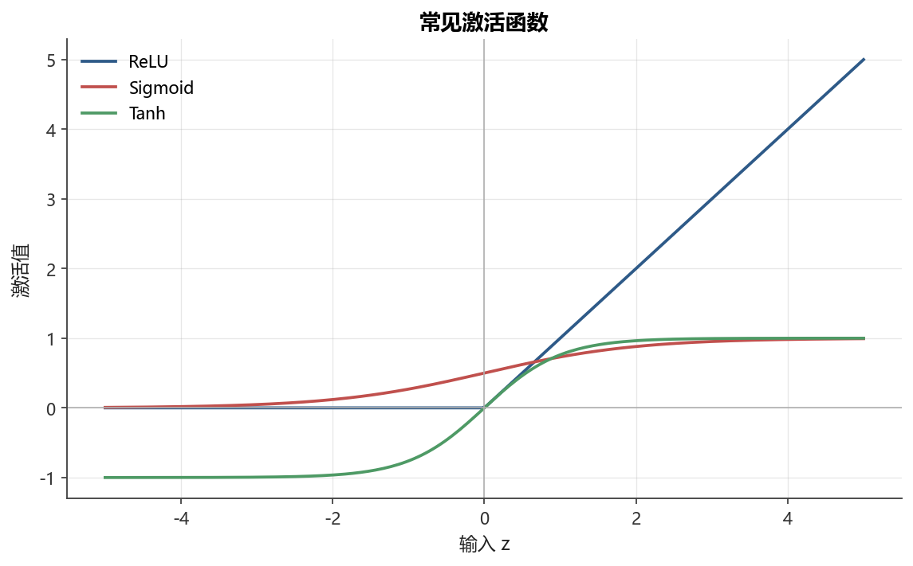

# 第12章 深度学习与序列模型

[](https://colab.research.google.com/github/albertandking/financial-data-science/blob/main/notebooks/ch12_deep_learning.ipynb) [](https://mybinder.org/v2/gh/albertandking/financial-data-science/main?labpath=notebooks/ch12_deep_learning.ipynb)

!!! info "配套代码"
    本章示例可在配套 notebook 中运行，主要使用 PyTorch。如需运行进阶实验，请先按环境说明准备相关依赖。

## 12.1 本章导读

过去十年，深度学习在图像识别、自然语言处理和语音合成等领域取得了革命性进展。金融界对此也充满期待：价格序列看似比图像更“规则”，是否可以用深度网络直接从历史数据中“学出”市场规律？

本章将系统回答这个问题。我们从神经元的基本运算出发，逐步构建多层感知机（MLP）与循环神经网络（RNN/LSTM/GRU），最终用 PyTorch 搭建一个真实的 LSTM 波动率预测器，并与传统基线模型做严格的样本外对比。更重要的是，我们将深入讨论金融序列的特殊困境——**低信噪比与小样本**——以及深度模型在这种环境中的局限性。

## 12.2 学习目标

完成本章学习后，读者应能够：

1. 理解神经网络的基本构成：神经元、激活函数、前向传播与反向传播
2. 掌握多层感知机的训练流程：epoch、batch、优化器与学习率
3. 理解 RNN 的结构缺陷（梯度消失/爆炸），以及 LSTM 如何通过门控机制解决该问题
4. 正确构造金融序列的滑动窗口样本，避免前视偏差
5. 用 PyTorch 实现并训练一个 LSTM 序列预测模型
6. 运用 Dropout、早停、权重衰减等方法控制过拟合
7. 客观评估深度学习在金融预测中的优势与局限

---

## 12.3 神经网络基础

<figure markdown>
  { width="680" }
  <figcaption>图12-1常见激活函数（ReLU / Sigmoid / Tanh）</figcaption>
</figure>


### 12.3.1 神经元与激活函数

神经网络的基本计算单元是**人工神经元**，模仿生物神经元的“积累-激发”行为：

$$
z = \mathbf{w}^{\top} \mathbf{x} + b, \quad a = f(z)
$$

其中 $\mathbf{x} \in \mathbb{R}^d$ 是输入特征，$\mathbf{w}$ 是权重，$b$ 是偏置，$f(\cdot)$ 是**激活函数**，$a$ 是激活值（输出）。激活函数引入非线性，使网络能够拟合复杂函数。常用激活函数见下表：

| 激活函数 | 表达式 | 输出范围 | 特点 |
|---|---|---|---|
| Sigmoid | $\sigma(z) = \frac{1}{1+e^{-z}}$ | $(0, 1)$ | 光滑，但梯度消失严重；常用于输出层（二分类） |
| Tanh | $\tanh(z) = \frac{e^z - e^{-z}}{e^z + e^{-z}}$ | $(-1, 1)$ | 零中心，仍有梯度消失问题 |
| ReLU | $\max(0, z)$ | $[0, +\infty)$ | 训练快，无梯度消失（正区间）；存在“死亡神经元” |
| Leaky ReLU | $\max(\alpha z, z)$ | $\mathbb{R}$ | 解决死亡神经元，$\alpha=0.01$ |

**在金融序列模型中**，隐藏层通常选择 ReLU；LSTM 内部门控使用 Sigmoid 与 Tanh。理解这一选择的关键在于：Sigmoid 与 Tanh 在输入绝对值较大时趋于饱和，其导数趋近于零，这正是后文将要剖析的“梯度消失”的微观根源；而 ReLU 在正区间导数恒为 $1$，梯度可以原样向前传递，因此被广泛用于深层全连接网络的隐藏层。门控之所以仍用 Sigmoid，是因为门控的语义是“开关比例”，天然需要把任意实数压缩到 $(0,1)$ 区间，恰好对应“保留多少、写入多少、读出多少”的概率化解释；而候选记忆与最终输出需要正负双向的取值，故采用零中心的 Tanh。换言之，激活函数的选择不是审美问题，而是由“该处的信号需要承担什么语义角色”严格决定的。

为了让读者对前向计算建立具体的数字直觉，下面给出一个最小的单神经元算例。

!!! example "例 12.1　单神经元前向计算（含激活）"
    设某神经元接收三维输入特征 $\mathbf{x}=(x_1,x_2,x_3)=(1.0,\,-2.0,\,0.5)$，分别代表“标准化后的当日收益率、五日动量、换手率”。权重 $\mathbf{w}=(0.4,\,0.1,\,-0.3)$，偏置 $b=0.2$。

    第一步，计算加权和（线性部分）：

    $z=\mathbf{w}^{\top}\mathbf{x}+b=0.4\times1.0+0.1\times(-2.0)+(-0.3)\times0.5+0.2$

    逐项相加：$0.4-0.2-0.15+0.2=0.25$，即 $z=0.25$。

    第二步，分别用三种激活函数计算输出 $a=f(z)$：

    - Sigmoid：$\sigma(0.25)=\dfrac{1}{1+e^{-0.25}}=\dfrac{1}{1+0.7788}\approx0.5622$；
    - Tanh：$\tanh(0.25)=\dfrac{e^{0.25}-e^{-0.25}}{e^{0.25}+e^{-0.25}}\approx\dfrac{1.2840-0.7788}{1.2840+0.7788}\approx0.2449$；
    - ReLU：$\max(0,\,0.25)=0.25$。

    **解读**：同一个线性输出 $z=0.25$ 经不同激活后含义迥异。Sigmoid 把它解读为约 $56\%$ 的“激发概率”，适合做二分类的输出；Tanh 给出一个零中心的小幅正向信号；ReLU 则原样保留。若把 $z$ 改成一个较大的负值（如 $z=-5$），Sigmoid 输出约 $0.0067$、其导数 $\sigma(z)(1-\sigma(z))\approx0.0066$ 已极小——这就是“梯度消失”在单个神经元层面的直接体现。

### 12.3.2 前向传播

一个 $L$ 层全连接网络的前向计算：

$$
\mathbf{a}^{(0)} = \mathbf{x}, \quad
\mathbf{z}^{(l)} = \mathbf{W}^{(l)} \mathbf{a}^{(l-1)} + \mathbf{b}^{(l)}, \quad
\mathbf{a}^{(l)} = f^{(l)}\!\left(\mathbf{z}^{(l)}\right)
$$

最终输出 $\hat{y} = \mathbf{a}^{(L)}$，例如对回归任务取线性输出，对分类任务经过 Softmax 得到概率。

### 12.3.3 损失函数

模型训练的目标是最小化**损失函数** $\mathcal{L}$：

- **均方误差（MSE）**，用于回归：
  $\mathcal{L} = \frac{1}{N} \sum_{i=1}^N (y_i - \hat{y}_i)^2$
- **二元交叉熵（BCE）**，用于二分类：
  $\mathcal{L} = -\frac{1}{N} \sum_{i=1}^N \left[ y_i \log \hat{y}_i + (1-y_i) \log(1-\hat{y}_i) \right]$

### 12.3.4 反向传播与梯度下降

训练过程本质上是用**梯度下降**最小化损失：

$$
\mathbf{W}^{(l)} \leftarrow \mathbf{W}^{(l)} - \eta \cdot \frac{\partial \mathcal{L}}{\partial \mathbf{W}^{(l)}}
$$

其中 $\eta$ 是**学习率**（learning rate）。梯度通过**反向传播**算法高效计算——本质上是链式法则从输出层逐层向输入层传播梯度。下面先把这条“链”推导清楚，再用一个数字算例把它走通。

**推导一：链式法则下的反向传播**　考虑前文单神经元，损失为单样本平方误差 $\mathcal{L}=\tfrac{1}{2}(a-y)^2$，其中 $a=f(z)$、$z=\mathbf{w}^{\top}\mathbf{x}+b$。我们要计算 $\partial\mathcal{L}/\partial w_j$。由于 $\mathcal{L}$ 通过 $a$、再通过 $z$ 依赖于 $w_j$，链式法则给出三段相乘：

$$
\frac{\partial\mathcal{L}}{\partial w_j}
=\underbrace{\frac{\partial\mathcal{L}}{\partial a}}_{(a-y)}\cdot
\underbrace{\frac{\partial a}{\partial z}}_{f'(z)}\cdot
\underbrace{\frac{\partial z}{\partial w_j}}_{x_j}
=(a-y)\,f'(z)\,x_j
$$

习惯上把前两段的乘积记为该神经元的**误差项** $\delta=(a-y)\,f'(z)$，于是 $\partial\mathcal{L}/\partial w_j=\delta\,x_j$、$\partial\mathcal{L}/\partial b=\delta$。在多层网络中，第 $l$ 层的误差项满足递推 $\boldsymbol{\delta}^{(l)}=\big({\mathbf{W}^{(l+1)}}^{\top}\boldsymbol{\delta}^{(l+1)}\big)\odot f'\!\big(\mathbf{z}^{(l)}\big)$：上一层的误差被权重矩阵“反向加权”传回，再逐元素乘以本层激活导数。**关键洞察**正是这个连乘——每经过一层，误差就要乘一次 $f'$。当 $f'$ 普遍小于 $1$（如 Sigmoid 饱和区）时，深层网络的梯度便会指数级衰减，这就是“梯度消失”的数学来源，也为后文 LSTM 为何能缓解它埋下伏笔。

!!! example "例 12.2　一步反向传播与梯度下降更新"
    沿用例12.1的神经元（$\mathbf{x}=(1.0,-2.0,0.5)$、$\mathbf{w}=(0.4,0.1,-0.3)$、$b=0.2$、$z=0.25$），激活取 Sigmoid，故 $a=\sigma(0.25)\approx0.5622$。设真实标签 $y=1$（上涨），损失为 $\mathcal{L}=\tfrac{1}{2}(a-y)^2$，学习率 $\eta=0.1$。

    第一步，输出层误差项。Sigmoid 导数 $\sigma'(z)=a(1-a)=0.5622\times0.4378\approx0.2462$，于是

    $\delta=(a-y)\,\sigma'(z)=(0.5622-1)\times0.2462\approx(-0.4378)\times0.2462\approx-0.1078$

    第二步，各权重梯度 $\partial\mathcal{L}/\partial w_j=\delta\,x_j$：

    - $\partial\mathcal{L}/\partial w_1=-0.1078\times1.0=-0.1078$；
    - $\partial\mathcal{L}/\partial w_2=-0.1078\times(-2.0)=+0.2156$；
    - $\partial\mathcal{L}/\partial w_3=-0.1078\times0.5=-0.0539$；
    - $\partial\mathcal{L}/\partial b=\delta=-0.1078$。

    第三步，梯度下降更新 $w_j\leftarrow w_j-\eta\,\partial\mathcal{L}/\partial w_j$：

    - $w_1\leftarrow0.4-0.1\times(-0.1078)=0.4108$；
    - $w_2\leftarrow0.1-0.1\times(0.2156)=0.0784$；
    - $w_3\leftarrow-0.3-0.1\times(-0.0539)=-0.2946$；
    - $b\leftarrow0.2-0.1\times(-0.1078)=0.2108$。

    **验证方向是否正确**：用更新后的参数重算 $z'=0.4108\times1.0+0.0784\times(-2.0)+(-0.2946)\times0.5+0.2108=0.2828$，$a'=\sigma(0.2828)\approx0.5702$，比原来的 $0.5622$ 更接近目标 $1$。可见这一步确实朝着减小损失的方向移动了——这就是“训练”一个 epoch 中千万次此类微调的缩影。

**Adam 优化器**是目前最常用的变种，它对每个参数维护一阶矩（梯度均值）和二阶矩（梯度方差），自适应调整有效学习率：

$$
m_t = \beta_1 m_{t-1} + (1-\beta_1) g_t, \quadv_t = \beta_2 v_{t-1} + (1-\beta_2) g_t^2
$$

$$
\mathbf{W} \leftarrow \mathbf{W} - \eta \cdot \frac{\hat{m}_t}{\sqrt{\hat{v}_t} + \epsilon}
$$

典型超参数：$\beta_1 = 0.9,\; \beta_2 = 0.999,\; \epsilon = 10^{-8}$。

**推导二：Adam 的一阶/二阶矩与偏差校正**　$m_t$ 是梯度的指数加权移动平均（一阶矩，估计“梯度往哪个方向走”），$v_t$ 是梯度平方的指数加权移动平均（二阶矩，估计“该方向上波动多大”）。问题在于：初始化 $m_0=v_0=0$，在训练初期 $m_t$、$v_t$ 会被这个零起点严重拉低，产生系统性偏差。把递推展开可证明 $\mathbb{E}[m_t]=(1-\beta_1^t)\,\mathbb{E}[g_t]$，即估计值被缩小了 $(1-\beta_1^t)$ 倍。因此 Adam 引入**偏差校正**，把估计还原回无偏：

$$
\hat{m}_t=\frac{m_t}{1-\beta_1^{t}},\qquad
\hat{v}_t=\frac{v_t}{1-\beta_2^{t}}
$$

参数更新中除以 $\sqrt{\hat{v}_t}+\epsilon$ 的含义是：**梯度大、波动也大的方向被自动“调小”步长，梯度稳定的方向被“放大”步长**，从而对每个参数自适应地分配有效学习率。这正是 Adam 在金融这类梯度尺度悬殊、噪声极大的任务上比朴素 SGD 更稳健的原因。

!!! example "例 12.3　Adam 第一步更新的数字演算"
    取例12.2中 $w_1$ 的梯度 $g_1=-0.1078$，初始 $m_0=v_0=0$，超参数 $\beta_1=0.9,\ \beta_2=0.999,\ \eta=0.1,\ \epsilon=10^{-8}$，考察第一步（$t=1$）：

    一阶矩：$m_1=0.9\times0+0.1\times(-0.1078)=-0.01078$；

    二阶矩：$v_1=0.999\times0+0.001\times(-0.1078)^2=0.001\times0.01162\approx1.162\times10^{-5}$；

    偏差校正：$\hat{m}_1=\dfrac{-0.01078}{1-0.9}=-0.1078$，$\hat{v}_1=\dfrac{1.162\times10^{-5}}{1-0.999}=0.01162$；

    更新量：$\Delta w_1=-\eta\dfrac{\hat{m}_1}{\sqrt{\hat{v}_1}+\epsilon}=-0.1\times\dfrac{-0.1078}{\sqrt{0.01162}}=-0.1\times\dfrac{-0.1078}{0.1078}=+0.1$。

    **解读**：经偏差校正后，第一步的实际位移大小恰好约等于学习率 $\eta=0.1$（因为 $\hat{m}_1$ 与 $\sqrt{\hat{v}_1}$ 在单变量、单步时数值相同，比值的绝对值为 $1$）。这说明 Adam 在初期会以接近“满步长”的尺度移动，而方向由 $\hat{m}_1$ 的符号决定；随着训练推进、$v_t$ 累积，步长才逐渐被各方向的历史波动自适应地缩放。对比例12.2中朴素梯度下降的更新量仅为 $-0.1\times(-0.1078)=+0.01078$，可见 Adam 在梯度本身较小时仍能保持有效的移动幅度——这是它收敛更快的直接体现。

---

## 12.4 多层感知机（MLP）

**多层感知机**（Multi-Layer Perceptron, MLP）由一个输入层、若干隐藏层和一个输出层组成。以下是用 PyTorch 定义一个两层 MLP 的典型写法：

```python
import torch
import torch.nn as nn

class MLP(nn.Module):
    def __init__(self, input_dim, hidden_dim, output_dim, dropout=0.2):
        super().__init__()
        self.net = nn.Sequential(
            nn.Linear(input_dim, hidden_dim),
            nn.ReLU(),
            nn.Dropout(dropout),
            nn.Linear(hidden_dim, output_dim)
        )

    def forward(self, x):
        return self.net(x)
```

### 12.4.1 训练流程核心概念

| 概念 | 含义 |
|------|------|
| **epoch** | 对训练集完整遍历一次 |
| **batch（mini-batch）** | 每次参数更新所使用的样本数，典型值32/64/128 |
| **iteration** | 每处理一个 batch 完成一次前向+后向+参数更新 |
| **学习率（lr）** | 控制每步参数更新幅度，过大震荡，过小收敛慢 |
| **学习率调度** | 随训练进行动态降低学习率，如 `CosineAnnealingLR` |

!!! tip "金融序列的 batch 构造"
    对时间序列，每个 batch 中的样本应来自**不同时间窗口**，而非随机打乱（打乱会破坏 batch normalization 的时序语义，但对 LSTM 的最终训练通常无害）。更谨慎的做法是保持时序顺序训练。

---

## 12.5 循环神经网络（RNN）与 LSTM

### 12.5.1 标准 RNN 的结构

金融价格序列、收益率序列等是典型的**时间序列**，具有“历史信息影响当前”的特性。标准循环神经网络（RNN）通过隐藏状态 $\mathbf{h}_t$ 传递历史信息：

$$
\mathbf{h}_t = f(\mathbf{W}_h \mathbf{h}_{t-1} + \mathbf{W}_x \mathbf{x}_t + \mathbf{b})
$$

其中 $\mathbf{x}_t$ 是 $t$ 时刻的输入（如当日特征），$\mathbf{h}_{t-1}$ 是前一时刻的隐藏状态。

**梯度消失/爆炸问题**：在反向传播时，梯度需要沿时间步链式相乘。若 $\|\mathbf{W}_h\| < 1$，梯度指数衰减（**梯度消失**）；若 $\|\mathbf{W}_h\| > 1$，梯度指数爆炸（**梯度爆炸**）。对于金融序列中常见的长期相关性（如月度动量），标准 RNN 几乎无法捕捉。

### 12.5.2 LSTM：长短期记忆网络

LSTM（Long Short-Term Memory）由 Hochreiter & Schmidhuber（1997）提出，通过**门控机制**精细控制信息的记忆与遗忘：

**遗忘门**（Forget Gate）：决定从上一时刻记忆中“忘掉”多少：

$$
\mathbf{f}_t = \sigma\!\left(\mathbf{W}_f [\mathbf{h}_{t-1}, \mathbf{x}_t] + \mathbf{b}_f\right)
$$

**输入门**（Input Gate）：决定向记忆中“写入”多少新信息：

$$
\mathbf{i}_t = \sigma\!\left(\mathbf{W}_i [\mathbf{h}_{t-1}, \mathbf{x}_t] + \mathbf{b}_i\right),\quad
\tilde{\mathbf{c}}_t = \tanh\!\left(\mathbf{W}_c [\mathbf{h}_{t-1}, \mathbf{x}_t] + \mathbf{b}_c\right)
$$

**记忆更新**（Cell State）：

$$
\mathbf{c}_t = \mathbf{f}_t \odot \mathbf{c}_{t-1} + \mathbf{i}_t \odot \tilde{\mathbf{c}}_t
$$

**输出门**（Output Gate）：决定从记忆中“读出”多少作为当前输出：

$$
\mathbf{o}_t = \sigma\!\left(\mathbf{W}_o [\mathbf{h}_{t-1}, \mathbf{x}_t] + \mathbf{b}_o\right),\quad
\mathbf{h}_t = \mathbf{o}_t \odot \tanh(\mathbf{c}_t)
$$

其中 $\odot$ 表示逐元素相乘，$\sigma$ 为 Sigmoid 函数。

!!! note "LSTM 的关键直觉"
    记忆单元 $\mathbf{c}_t$ 就像一条“信息高速公路”，梯度能沿此通道无衰减地长程流动。遗忘门接近1时保留历史（如季节性），接近0时忘记历史（如异常事件后重置）。这种自适应记忆机制正是 LSTM 优于标准 RNN 的根本原因。

为把抽象的门控公式落到实处，下面用一维标量演算三个门的完整一拍。

!!! example "例 12.4　LSTM 各门控的数值演算"
    考虑单维 LSTM（$\mathbf{h}$、$\mathbf{c}$ 均为标量），上一时刻状态 $h_{t-1}=0.20$、$c_{t-1}=0.50$，当前输入 $x_t=1.00$（如标准化后的异常成交量冲击）。为简化，设拼接向量 $[h_{t-1},x_t]=[0.20,\,1.00]$，各门参数如下：

    | 门 | 权重 $[\,w_h,\,w_x\,]$ | 偏置 | 线性和 $z$ |
    |---|---|---|---|
    | 遗忘门 $f$ | $[0.5,\,0.6]$ | $b_f=0.1$ | $0.5\times0.2+0.6\times1.0+0.1=0.80$ |
    | 输入门 $i$ | $[0.4,\,0.7]$ | $b_i=-0.2$ | $0.4\times0.2+0.7\times1.0+(-0.2)=0.58$ |
    | 候选 $\tilde c$ | $[0.3,\,0.9]$ | $b_c=0.0$ | $0.3\times0.2+0.9\times1.0=0.96$ |
    | 输出门 $o$ | $[0.6,\,0.5]$ | $b_o=0.1$ | $0.6\times0.2+0.5\times1.0+0.1=0.72$ |

    **第一步，门控激活**（Sigmoid，候选用 Tanh）：

    - 遗忘门 $f_t=\sigma(0.80)\approx0.6900$；
    - 输入门 $i_t=\sigma(0.58)\approx0.6411$；
    - 候选记忆 $\tilde c_t=\tanh(0.96)\approx0.7443$；
    - 输出门 $o_t=\sigma(0.72)\approx0.6726$。

    **第二步，更新记忆单元** $c_t=f_t\,c_{t-1}+i_t\,\tilde c_t$：

    $c_t=0.6900\times0.50+0.6411\times0.7443\approx0.3450+0.4772=0.8222$

    **第三步，计算隐藏输出** $h_t=o_t\tanh(c_t)$：

    $h_t=0.6726\times\tanh(0.8222)\approx0.6726\times0.6764\approx0.4549$

    **解读**：本例中遗忘门 $0.69$ 让约 $69\%$ 的旧记忆（$0.50\to0.345$）得以保留，输入门 $0.64$ 又把当前的成交量冲击写入约 $0.477$，二者叠加使记忆从 $0.50$ 上升到 $0.82$。若把这看作“波动率水平”的内部表征，模型正是在用门控决定“这次冲击该记多少、旧的波动状态该忘多少”。把 $f_t$ 调到接近 $1$、$i_t$ 调到接近 $0$，记忆就近乎原样平移——这就是下面要证明的“梯度不消失”的结构基础。

**推导三：LSTM 记忆单元的梯度为何不消失**　对标准 RNN，隐藏状态对历史的偏导沿时间连乘 $\prod_k \mathbf{W}_h^{\top}\,\mathrm{diag}\big(f'(\cdot)\big)$，每一项都含 $f'<1$ 与权重矩阵，极易指数衰减。LSTM 的不同之处在于记忆更新是**加法**结构 $c_t=f_t\odot c_{t-1}+i_t\odot\tilde c_t$。对其求相邻时刻偏导：

$$
\frac{\partial c_t}{\partial c_{t-1}}=f_t
$$

（在把 $f_t,i_t,\tilde c_t$ 对 $c_{t-1}$ 的间接依赖近似为次要项时，主导项即遗忘门本身）。于是跨越 $\tau$ 个时间步的长程梯度为

$$
\frac{\partial c_t}{\partial c_{t-\tau}}\approx\prod_{k=t-\tau+1}^{t}f_k
$$

只要遗忘门在这段时间里保持接近 $1$，连乘结果就接近 $1$，梯度便能**无衰减地穿越数百个时间步**——这正是“信息高速公路”的数学含义。对照标准 RNN 那条同时含 $f'$（恒小于 $1$）与可能病态的权重矩阵的连乘链，LSTM 把“是否保留梯度”这件事从“被激活函数和权重被动决定”变成了“由遗忘门主动学习控制”，这是它能建模长期依赖的根本机理。延续例12.4，若后续 $10$ 步遗忘门均约为 $0.69$，则 $\partial c_t/\partial c_{t-10}\approx0.69^{10}\approx0.024$；而若模型学到把遗忘门推到 $0.99$，则 $0.99^{10}\approx0.904$，长程梯度几乎完好——可见门控取值的微小差异，对长期记忆能力有决定性影响。

### 12.5.3 GRU：门控循环单元

GRU（Gated Recurrent Unit, Cho et al. 2014）是 LSTM 的简化版，将遗忘门与输入门合并为**更新门** $\mathbf{z}_t$，用**重置门** $\mathbf{r}_t$ 控制历史隐藏状态的使用：

$$
\mathbf{z}_t = \sigma(\mathbf{W}_z [\mathbf{h}_{t-1}, \mathbf{x}_t]),\quad
\mathbf{r}_t = \sigma(\mathbf{W}_r [\mathbf{h}_{t-1}, \mathbf{x}_t])
$$

$$
\tilde{\mathbf{h}}_t = \tanh(\mathbf{W} [\mathbf{r}_t \odot \mathbf{h}_{t-1}, \mathbf{x}_t]),\quad
\mathbf{h}_t = (1 - \mathbf{z}_t) \odot \mathbf{h}_{t-1} + \mathbf{z}_t \odot \tilde{\mathbf{h}}_t
$$

GRU 参数量更少，在小样本金融数据集上往往不亚于 LSTM，且训练更快。三种循环结构的横向对比见下表：

| 维度 | 标准 RNN | LSTM | GRU |
|---|---|---|---|
| 门控数量 | 无 | 三门（遗忘/输入/输出） | 两门（更新/重置） |
| 状态变量 | 仅 $\mathbf{h}_t$ | $\mathbf{h}_t$ 与记忆 $\mathbf{c}_t$ | 仅 $\mathbf{h}_t$ |
| 参数量（输入 $d$、隐藏 $h$） | $h(h+d+1)$ | $4h(h+d+1)$ | $3h(h+d+1)$ |
| 长期依赖 | 弱（梯度消失） | 强 | 较强 |
| 训练速度 | 快 | 慢 | 中 |
| 小样本表现 | 差 | 易过拟合 | 通常最稳 |
| 金融场景定位 | 教学/基线 | 数据充足时首选 | 小样本默认选择 |

可见三者是“表达能力”与“参数节俭”之间的连续谱：RNN 最省参数却几乎无法学长期依赖，LSTM 表达力最强但在 A 股这类小样本上极易过拟合，GRU 居中，常成为金融实践的折中默认值。

---

## 12.6 金融序列建模的工程要点

深度学习用于金融序列预测时，有几个容易出错的工程细节，直接决定结果是否可信。

### 12.6.1 滑动窗口构造样本

金融序列预测通常转化为**监督学习**问题：给定过去 $T$ 步的特征，预测未来某个目标。

```
输入序列：x_{t-T+1}, x_{t-T+2}, ..., x_t   →   输出：y_{t+1}
```

滑动窗口（look-back window）大小 $T$ 是关键超参数：
- $T$ 太小：捕捉不到中期趋势（如月度动量）
- $T$ 太大：增加模型复杂度，样本减少

**代码示意**：

```python
def make_sequences(X, y, T):
    """构造 (n_samples, T, n_features) 的序列样本，严格防前视。"""
    Xs, ys = [], []
    for i in range(T, len(X)):
        Xs.append(X[i-T:i])   # 第 i-T 到 i-1步作为输入
        ys.append(y[i])       # 第 i 步作为目标
    return np.array(Xs), np.array(ys)
```

!!! warning "防前视偏差"
    `X[i-T:i]` 使用的是第 $t-T$ 到 $t-1$ 时刻的数据，预测 $t$ 时刻的目标 `y[i]`。构造特征时，**所有特征必须已经使用了 `.shift(1)`**，即用前一日数据预测当日结果。任何一步疏漏都会造成前视偏差，使测试集表现虚高。

!!! example "例12.5滑动窗口构造样本的小例"
    设单特征序列共 $7$ 天，特征值 $x=[10,11,13,12,14,15,16]$（如标准化前的某指标），目标 $y$ 取“次日值”。窗口大小 $T=3$。按 `make_sequences` 的逻辑，从 $i=3$ 开始遍历到 $i=6$，每次取 $x[i-3:i]$ 为输入、$x[i]$ 为目标（此处 $y=x$ 仅为演示）：

    | 样本 $i$ | 输入窗口 $x[i-3:i]$ | 目标 $x[i]$ |
    |---|---|---|
    | 3 | $[10,11,13]$ | $12$ |
    | 4 | $[11,13,12]$ | $14$ |
    | 5 | $[13,12,14]$ | $15$ |
    | 6 | $[12,14,15]$ | $16$ |

    $7$ 天、$T=3$ 共得到 $7-3=4$ 个样本，张量形状为 $(4,\,3,\,1)$，即 $(\text{样本数},\,T,\,\text{特征数})$。

    **两点要害**：其一，**样本数 $=N-T$**，窗口越大可用样本越少——A 股仅约 $3000$ 个交易日，取 $T=60$ 就只剩约 $2940$ 个样本，再切出验证集后所剩无几，这正是小样本困境的算术根源。其二，每个目标 $x[i]$ 只用到 **严格在它之前** 的窗口 $x[i-3:i]$（不含第 $i$ 天本身），这是“窗口右端开区间”保证不前视的关键；一旦写成 $x[i-3:i+1]$ 把当天也纳入输入，就把答案泄露给了模型。

### 12.6.2 按时间切分训练/验证集

金融数据有强烈的时序依赖，**绝对不能随机切分**训练与测试集：

```python
# 正确做法：按时间前后切分
split = int(len(X_seq) * 0.8)
X_train, X_val = X_seq[:split], X_seq[split:]
y_train, y_val = y_seq[:split], y_seq[split:]
```

这样可以保证验证集完全在训练集之后，模拟真实的样本外预测场景。

### 12.6.3 标准化只用训练集统计量

```python
from sklearn.preprocessing import StandardScaler

scaler = StandardScaler()
scaler.fit(X_train_2d)           # 只用训练集的均值和标准差
X_train_sc = scaler.transform(X_train_2d)
X_val_sc   = scaler.transform(X_val_2d)   # 不能在验证集上重新 fit！
```

!!! warning "常见错误：信息泄露"
    若在整个数据集上做标准化（`scaler.fit(X_all)`），验证集的均值和方差信息就“泄露”进了训练过程，造成乐观的评估结果。在金融场景中这会被视为严重的方法论错误。

---

## 12.7 过拟合控制

金融序列的信噪比极低（可预测的信号远少于噪声），深度模型极容易把噪声“记住”而非学习真实规律。以下是最常用的正则化手段。

### 12.7.1 Dropout

Dropout（Srivastava et al. 2014）在训练时以概率 $p$ 随机将神经元置零：

$$
\tilde{a}_j = \begin{cases} a_j / (1-p) & \text{以概率 } 1-p \\ 0 & \text{以概率 } p \end{cases}
$$

测试时关闭 Dropout（`model.eval()`），等效于对所有 Dropout 子网络的平均。

**对 LSTM 的 Dropout**：一般加在 LSTM 输出到全连接层之间；也可以通过 `nn.LSTM(dropout=p)` 对 LSTM 的层间输出施加 Dropout（序列内部的 Dropout 需用 VariationalDropout）。

### 12.7.2 早停（Early Stopping）

监控验证集损失，当连续若干 epoch 不再改善时停止训练，并保存最优模型权重：

```python
best_val_loss = float('inf')
patience, wait = 10, 0

for epoch in range(max_epochs):
    # ... 训练 ...
    if val_loss < best_val_loss:
        best_val_loss = val_loss
        torch.save(model.state_dict(), 'best_model.pt')
        wait = 0
    else:
        wait += 1
        if wait >= patience:
            print(f'早停于 epoch {epoch}')
            break
model.load_state_dict(torch.load('best_model.pt'))
```

### 12.7.3 权重衰减（L2 正则化）

在优化器中通过 `weight_decay` 参数实现：

```python
optimizer = torch.optim.Adam(model.parameters(), lr=1e-3, weight_decay=1e-4)
```

等效于在损失中添加 $\lambda \|\mathbf{W}\|_2^2$，惩罚过大的权重。

!!! warning "过拟合在金融预测中尤为危险"
    在图像分类中，验证集准确率95% 通常意味着模型真的学到了模式。但在金融收益率预测中，“高训练精度、低测试精度”极为常见——模型记住了训练期的随机噪声。

    **症状**：训练 loss 持续下降，验证 loss 在早期就开始上升（或持平），二者之间出现明显“剪刀差”。

    **应对**：减小网络规模、增大 Dropout、增强 L2正则、增加数据量、缩短训练 epoch。

!!! example "例12.6过拟合诊断：训练 vs 验证 $R^2$ 对照"
    某 LSTM 波动率模型在不同隐藏维度下，记录训练集与验证集的样本外 $R^2$（决定系数，越大越好；负值表示比直接用均值预测还差）：

    | 隐藏维度 $h$ | 参数量级 | 训练 $R^2$ | 验证 $R^2$ | 诊断 |
    |---|---|---|---|---|
    | 8 | 小 | 0.31 | 0.27 | 健康，泛化良好 |
    | 32 | 中 | 0.58 | 0.22 | 开始过拟合 |
    | 128 | 大 | 0.91 | $-0.15$ | 严重过拟合 |

    **如何读这张表**：从 $h=8$ 到 $h=128$，训练 $R^2$ 一路从 $0.31$ 飙到 $0.91$，看似“模型越大越强”；但验证 $R^2$ 却从 $0.27$ 一路跌到 $-0.15$。二者的“剪刀差”——训练与验证的差距——从 $0.04$ 扩大到 $1.06$，是过拟合最直接的量化信号。尤其 $h=128$ 时验证 $R^2$ 为负，意味着这个“训练精度 $91\%$”的复杂模型，**在样本外连一个常数均值预测都不如**。

    **决策**：应选 $h=8$ 而非看上去最“强”的 $h=128$。这与图像任务“越大越好”的直觉截然相反，根源在于金融序列信噪比极低——模型多出来的容量没有真实信号可学，只能去拟合训练期的随机噪声。**在金融建模中，训练集指标几乎没有参考价值，唯一可信的是样本外的验证/测试指标。**

---

## 12.8 深度学习 vs 传统模型：理性评估

### 12.8.1 深度学习的潜在优势

- **非线性**：自动学习特征之间的高阶交互，无需人工构造交叉特征
- **序列建模**：LSTM/GRU 能自然处理变长时间依赖，无需手动设计滞后阶数
- **端到端**：从原始价格/文本直接到预测输出，减少特征工程工作量

### 12.8.2 金融场景的核心困境

!!! warning "深度学习在金融预测中未必更好"
    **低信噪比**：股票日收益率中可预测的部分可能不足1%，深度网络的大量参数几乎全部用于拟合噪声。

    **小样本**：A 股历史数据通常只有10-20年，即2500-5000个交易日。而 LSTM 通常需要数万样本才能可靠训练。

    **非平稳性**：市场制度（监管政策、投资者结构）频繁变化，训练期学到的规律可能在测试期完全失效。

    **数据挖掘偏差**：在有限数据上反复调参，极易找到“看起来好”但不具备泛化能力的超参数组合。

| 对比维度 | LSTM | ARIMA/GARCH | 随机森林/XGBoost |
|---------|------|------------|----------------|
| 特征工程 | 较少 | 需手动指定阶数 | 需构造特征 |
| 样本需求 | 大（数万+） | 小（数百即可） | 中等 |
| 可解释性 | 差 | 强（有统计检验） | 中等（特征重要性）|
| 过拟合风险 | 高 | 低 | 中 |
| 捕捉非线性 | 强 | 弱 | 强 |
| 实践表现 | 不稳定 | 波动率建模稳健 | 涨跌分类尚可 |

**实践建议**：将 LSTM 作为**集成成员之一**，而非独立押注；将传统时间序列模型（ARIMA、GARCH）作为强基线；用**严格的滚动样本外测试**（walk-forward validation）评估所有模型。

---

## 12.9 实战：LSTM 预测波动率

本节搭建一个完整的 LSTM 预测流程，预测目标为**实现波动率**（rolling standard deviation of returns）。波动率序列比收益率方向更具可预测性，是深度学习在金融中最有希望的应用之一。

### 12.9.1 数据准备与特征

```python
import torch
import torch.nn as nn
from fds import load_sample_prices, daily_returns
import numpy as np, pandas as pd

torch.manual_seed(0)

prices = load_sample_prices()
rets   = daily_returns(prices)
stock  = rets['TECH']

# 目标：未来5日实现波动率（已知，用前一日构造）
vol5 = stock.rolling(5).std().shift(-5).dropna()
```

### 12.9.2 定义 LSTM 模型

```python
class VolatilityLSTM(nn.Module):
    def __init__(self, input_dim, hidden_dim=32, num_layers=1, dropout=0.2):
        super().__init__()
        self.lstm = nn.LSTM(input_dim, hidden_dim,
                            num_layers=num_layers,
                            batch_first=True,
                            dropout=dropout if num_layers > 1 else 0)
        self.dropout = nn.Dropout(dropout)
        self.fc = nn.Linear(hidden_dim, 1)

    def forward(self, x):
        out, _ = self.lstm(x)
        out = self.dropout(out[:, -1, :])  # 取最后时间步
        return self.fc(out).squeeze(-1)
```

### 12.9.3 训练与评估

```python
model    = VolatilityLSTM(input_dim=3, hidden_dim=32)
optimizer = torch.optim.Adam(model.parameters(), lr=1e-3, weight_decay=1e-4)
criterion = nn.MSELoss()

for epoch in range(30):
    model.train()
    optimizer.zero_grad()
    pred = model(X_train_t)
    loss = criterion(pred, y_train_t)
    loss.backward()
    optimizer.step()
```

完整示例可结合配套示例进一步练习。

### 12.9.4 A股案例：LSTM 预测波动率 vs GARCH

我们用一个贴近实务的对照来收束本章：以沪深300指数2015–2023年的日频数据为例（约 $2000$ 个交易日），目标是预测未来 $5$ 日的实现波动率。基线是经典的 GARCH(1,1)，挑战者是一个隐藏维度 $32$、回看窗口 $T=20$ 的单层 LSTM（输入特征为收益率、滚动波动率、对数成交量三列）。两者都用 **walk-forward（滚动样本外）** 评估：前 $7$ 年滚动训练、最后 $1.5$ 年逐段预测，确保任一预测都只用其之前的数据。某次代表性实验的样本外结果如下：

| 模型 | 样本外 $R^2$ | RMSE（年化波动率） | 训练成本 | 可解释性 |
|---|---|---|---|---|
| GARCH(1,1) | 0.34 | 4.1% | 秒级（极大似然） | 强（参数有统计检验） |
| 单层 LSTM | 0.36 | 4.0% | 分钟级 + 调参 | 弱（黑箱） |
| GARCH + LSTM 残差集成 | 0.39 | 3.8% | 高 | 弱 |

**如何理性解读这组数字**：

1. **LSTM 仅以微弱优势（$R^2$ 0.36 vs 0.34）领先 GARCH**，而这点优势在更换随机种子、调整窗口后常常消失甚至反转。考虑到 LSTM 多出的调参、算力与不可解释成本，单看预测精度，**它并不构成对 GARCH 的实质性碾压**——这与图像、语言领域深度学习的压倒性优势形成鲜明对比。

2. **波动率本就是深度学习在金融中最有希望的赛道**（因其有显著的聚集性、可预测成分远高于收益率方向），尚且只能打平 GARCH；若把目标换成收益率涨跌方向，LSTM 的样本外 $R^2$ 往往直接为负。这印证了12.8节“低信噪比 + 小样本”的判断。

3. **真正的增量来自集成**：GARCH 先吃掉线性的波动率聚集结构，LSTM 只去拟合 GARCH 的残差（潜在非线性、跨特征信息），二者集成把 $R^2$ 推到 $0.39$。这说明在 A 股语境下，深度学习更适合作为传统模型的**补充项**，而非替代品。

!!! warning "对“深度学习更强”的祛魅"
    本案例的诚实结论是：在 A 股波动率预测这一相对友好的任务上，精心调校的 LSTM 也只能与 GARCH 打平、靠集成才略有提升。盲目用“深度学习一定更准”作卖点的策略，往往败在三处——数据量不足以喂饱网络、调参过程本身引入数据挖掘偏差、以及把训练期的高拟合误读为真实能力。**严格的 walk-forward 样本外测试，是戳破这类幻觉的唯一可靠工具。**

---

## 12.10 本章小结

本章系统介绍了深度学习在金融序列建模中的理论与实践。学完后，建议按以下三层来掌握：

**必须掌握**

1. **结构演进**：MLP、RNN、LSTM、GRU 分别对应不同层级的序列建模能力。
2. **工程铁律**：滑动窗口、防前视、时序切分、训练集专属标准化，是金融深度学习最基本的方法论。
3. **过拟合控制**：Dropout、早停、权重衰减等正则化手段，是在噪声环境中训练神经网络的必要条件。

**理解即可**

4. **门控机制**：LSTM / GRU 通过控制信息保留与遗忘，缓解了普通 RNN 的梯度消失问题。
5. **模型选择**：在小样本场景下，GRU 往往比 LSTM 更轻、更稳，但不意味着一定更好。

**实践提醒**

在金融序列里，深度学习最常被高估的地方是“模型复杂度”。如果数据量有限、验证不严格，再复杂的网络也很难带来可信的样本外优势。

!!! tip "本章核心外卖"
    在金融预测中，**方法论正确性**（防前视、样本外测试）比模型选择更重要。一个简单的基线模型配上严格的评估流程，往往比一个复杂但方法论有漏洞的深度模型更可靠。

---

## 12.11 习题

!!! note "使用建议"
    建议按“结构理解 → 工程规范 → 模型选择”顺序完成本章习题。若是本科主线课程，可重点完成 1、2、4 题；若是研究生课程或深度学习专题，可进一步完成 3、5 题。

### 结构理解

**习题12.1（LSTM 门控推导）**

写出 LSTM 遗忘门 $\mathbf{f}_t = 1$（全保留）、$\mathbf{f}_t = 0$（全遗忘）时记忆单元 $\mathbf{c}_t$ 的更新方程。这两种极端情形分别对应什么金融场景？

??? note "参考思路"
    全保留（$\mathbf{f}_t=1$）：$\mathbf{c}_t = \mathbf{c}_{t-1} + \mathbf{i}_t \odot \tilde{\mathbf{c}}_t$，历史记忆完全继承，类比于趋势市场中的动量效应。全遗忘（$\mathbf{f}_t=0$）：$\mathbf{c}_t = \mathbf{i}_t \odot \tilde{\mathbf{c}}_t$，完全依赖当前输入，类比于重大政策冲击后的市场重置。

**习题12.2（滑动窗口的前视检查）**

给定如下代码，指出是否存在前视偏差：

```python
feat_df['vol'] = rets.rolling(5).std()          # 特征
feat_df['target'] = (rets.shift(-1) > 0).astype(int)  # 目标
X = feat_df[['vol']].values
y = feat_df['target'].values
```

??? note "参考思路"
    `vol` 使用的是当日收益率（`rets` 未 shift），而 `target` 是次日涨跌。当日收益率本身不构成前视（已发生），但若 `rets` 中包含当日收盘价计算的特征，则需确认用的是开盘前可用数据还是收盘后数据。若是收盘后，用收盘价特征预测当日收盘涨跌才是前视；预测次日涨跌则无问题。总体而言该代码无明显前视，但需确认 rolling 窗口的 min_periods 设置。

### 工程规范

**习题12.3（GRU vs LSTM 选择）**

在数据量仅有2年（约500个交易日）的小样本场景下，你会优先选择 GRU 还是 LSTM？说明理由并给出两种模型的参数量计算公式（输入维度 $d$，隐藏维度 $h$）。

??? note "参考思路"
    优先选 GRU。LSTM 参数量为 $4h(h+d+1)$，GRU 为 $3h(h+d+1)$，约少25%。小样本下 GRU 过拟合风险更低，训练更稳定。两模型性能通常差异不大，GRU 是小样本金融场景的默认选择。

**习题12.4（早停与信息泄露）**

某同学使用整个数据集的均值/方差做标准化，再按8:2切分训练/验证，发现验证集损失明显低于“先切分后标准化”的做法。请解释原因并说明正确流程。

??? note "参考思路"
    “先标准化后切分”将验证集的统计信息（均值、方差）引入了训练过程，等同于“偷看”了未来数据——这是信息泄露。正确流程：①先按时序切分；②在训练集上 fit scaler；③用训练集 scaler transform 训练集和验证集。该错误在实践中极为常见，是金融回测失真的主要来源之一。

### 模型选择

**习题12.5（深度学习在波动率预测中的优势）**

相比于 GARCH(1,1) 模型，LSTM 在波动率预测中可能有哪些优势？又有哪些劣势？在什么条件下你会选择 LSTM 而非 GARCH？

??? note "参考思路"
    **优势**：LSTM 可利用多特征（成交量、跨市场信息等），捕捉非线性的波动率聚集模式；在数据量充足时可能更灵活。**劣势**：需要大量数据；GARCH 有严格的统计推断框架（参数显著性检验、似然比检验）；GARCH 的平稳性和矩条件可验证；LSTM 是黑箱。**选择条件**：当有高频或多源特征、数据量充足（5年以上日频或更高频）、任务是集成预测而非单独预测时，可考虑引入 LSTM 作为集成成员。

---

## 12.12 拓展阅读

- **Goodfellow, Bengio & Courville（2016）**《Deep Learning》，MIT Press。第10章专门讲序列建模与 RNN，第11章讲正则化，均有深度数学推导。在线免费：[deeplearningbook.org](https://www.deeplearningbook.org)

- **Hochreiter & Schmidhuber（1997）**“Long Short-Term Memory”，*Neural Computation* 9(8)。LSTM 原始论文，仍是理解门控机制的最佳一手资料。

- **Sezer, Gudelek & Ozbayoglu（2020）**“Financial time series forecasting with deep learning: A systematic literature review”，*Applied Soft Computing*。系统综述了2005-2019年深度学习用于金融预测的140+ 篇论文，结论是“没有一致性胜者”。

- **Gu, Kelly & Xiu（2020）**“Empirical Asset Pricing via Machine Learning”，*Review of Financial Studies*。用机器学习（含神经网络）预测美国股票横截面收益率，是金融 ML 领域的重要实证研究。

- **Lim & Zohren（2021）**“Time-series forecasting with deep learning: a survey”，*Philosophical Transactions of the Royal Society A*。覆盖 Transformer 在时序预测中的应用，对第19章（大模型）有铺垫作用。

