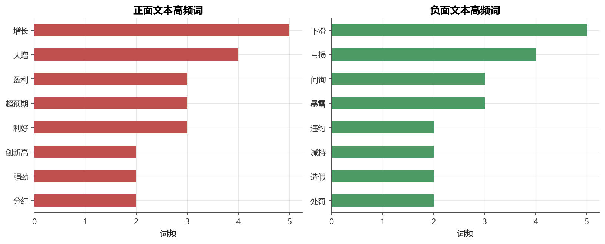

# 第13章 金融文本与自然语言处理

[](https://colab.research.google.com/github/albertandking/financial-data-science/blob/main/notebooks/ch13_nlp_text.ipynb) [](https://mybinder.org/v2/gh/albertandking/financial-data-science/main?labpath=notebooks/ch13_nlp_text.ipynb)

!!! info "配套代码"
    `notebooks/ch13_nlp_text.ipynb`（使用 jieba / scikit-learn / transformers，需 `--extra advanced`）

---

## 13.1 本章导读

从季报年报到财经新闻，从分析师研报到股吧舆情，金融市场每天产生海量文本信息。这些文字背后隐藏着投资者情绪、公司基本面变化和市场预期的关键信号。传统量化方法依赖结构化数据（价格、财务指标），而**自然语言处理（NLP）** 技术打开了另一扇窗——让机器自动“读懂”非结构化文本，并将其转化为可量化的投资信号。

本章以**中文金融文本**为主线，系统介绍从原始文字到可用因子的完整流程：分词与清洗 → 文本表示 → 情感分析 → 信号构建。核心代码在配套 notebook 中完整演示，全部**离线可运行**。

### 13.1.1 学习目标

学完本章，读者应能：

1. 说明中文金融文本的主要来源及其特点，理解为什么预处理至关重要；
2. 使用 **jieba** 对中文句子分词，过滤停用词，提取词性；
3. 用 **词袋 / TF-IDF / N-gram** 将文本转为机器可用的特征矩阵；
4. 实现两条情感分析路线：**词典打分法** 与 **有监督分类**（逻辑回归 / 朴素贝叶斯）；
5. 了解 BERT / 中文 FinBERT 的原理，以及如何在金融情感任务中调用；
6. 将情感分数与收益率结合，理解**前视对齐**的关键风险；
7. 独立构建一个小型中文财经文本情感分类 Pipeline，并评估其性能。

---

## 13.2 金融文本的价值与来源

### 13.2.1 为什么文本是 α 来源

> **效率市场假说的软肋**：公开信息在价格中的反映并非瞬间完成。文本信息量大、解读需要时间，给量化策略留下了窗口。

金融文本的信号价值来自两个维度：

| 维度 | 含义 | 举例 |
|------|------|------|
| **情感极性** | 文本正面/负面倾向 | “净利润大增” vs “亏损扩大” |
| **不确定性** | 管理层语言的模糊程度 | “可能”、“或将”等词的频率 |

Tetlock (2007) 最早系统论证了媒体悲观词频与股票收益的负相关；Loughran & McDonald (2011) 构建了专用于财务文本的情感词典，彻底改变了该领域的研究范式。

### 13.2.2 主要文本来源

```
金融文本生态系统
│
├── 公司信息
│   ├── 年报 / 半年报（MD&A 管理层讨论与分析）
│   ├── 季报 / 业绩预告 / 利润预告
│   └── 重大事项公告（并购、减持、问询函回复…）
│
├── 市场资讯
│   ├── 财经新闻（东方财富、新浪财经、同花顺）
│   ├── 分析师研报（标题 + 摘要）
│   └── 交易所公告（沪深交易所官网）
│
└── 社交舆情
    ├── 雪球（机构投资者、专业散户）
    ├── 东方财富股吧（散户为主，噪音大）
    └── 微博财经话题
```

各来源的特征比较：

| 来源 | 专业性 | 更新频率 | 噪声水平 | 可得性 |
|------|--------|---------|---------|--------|
| 年报 MD&A | 高 | 年/半年 | 低 | 公开免费 |
| 分析师研报 | 高 | 事件驱动 | 中 | 需购买 |
| 财经新闻 | 中 | 日内 | 中 | 爬虫可得 |
| 股吧/雪球 | 低 | 实时 | 高 | 爬虫可得 |

!!! warning "合规提示"
    爬取上市公司公告、研报等数据时，需遵守相关平台的使用条款及《数据安全法》、《个人信息保护法》等法规。建议优先使用交易所官网的公开公告。

---

## 13.3 中文文本预处理

中文与英文最大的区别：**中文词之间没有天然空格**，需要先“分词”才能后续处理。

### 13.3.1 分词：jieba

jieba 是最常用的开源中文分词库，支持三种模式：

| 模式 | 函数 | 特点 | 适用场景 |
|------|------|------|---------|
| 精确模式 | `jieba.lcut(text)` | 最精确，不重叠 | 情感分析、文本分类 |
| 全模式 | `jieba.lcut(text, cut_all=True)` | 穷举所有可能词 | 信息检索 |
| 搜索引擎模式 | `jieba.lcut_for_search(text)` | 精确基础上对长词再切 | 搜索 |

**自定义词典**在金融场景至关重要：

```python
jieba.add_word("沪深300", freq=1000, tag="n")
jieba.add_word("核心资产", freq=500)
jieba.add_word("量化私募", freq=200)
jieba.add_word("北向资金", freq=800)
```

金融专业词汇（“市盈率”、“可转债”、“融资融券”）jieba 默认词典通常已收录，但新兴词汇（“注册制”改革后的新词）需要手动添加。

**词性标注**（精确模式）：

```python
import jieba.posseg as pseg

words = pseg.lcut("公司净利润同比增长30%，超出分析师预期")
for word, flag in words:
    print(f"{word:8s} {flag}")
# 输出：公司 n  净利润 n  同比 d  增长 v  30 m  % x  超出 v ...
```

常用词性标签：`n`(名词)、`v`(动词)、`a`(形容词)、`d`(副词)、`m`(数词)。情感分析时，形容词（`a`）和副词（`d`）往往携带最多情感信息。

### 13.3.2 停用词与去噪

**停用词**：高频但无实质意义的词，如“的”、“了”、“在”、“是”等。

```python
STOPWORDS = {"的", "了", "在", "是", "和", "与", "对", "将", "为",
             "也", "不", "而", "但", "从", "到", "由", "于", "等",
             "该", "其", "以", "因此", "然而", "可以"}
```

!!! tip "金融停用词"
    金融文本还需过滤行业通用词，如“公司”、“市场”、“业务”、“发展”等。这些词几乎出现在所有财报中，对情感分析无帮助，反而增加噪声。

**去噪**操作清单：

1. 去除 HTML 标签、URL、@用户名
2. 去除数字（或保留为特殊标记 `<NUM>`）
3. 去除标点符号（`[^一-龥a-zA-Z]`）
4. 统一繁简转换（`opencc`）
5. 去除单字词（中文单字通常噪声大）
6. 长度过滤（太短的文本情感信号弱）

**完整预处理函数示例**：

```python
import re
import jieba

def preprocess(text: str, stopwords: set) -> list[str]:
    """中文金融文本预处理：去噪 → 分词 → 去停用词"""
    # 1. 去除非中文字符（保留基本标点暗示）
    text = re.sub(r'[^一-龥]', ' ', text)
    # 2. 分词
    words = jieba.lcut(text)
    # 3. 去停用词 + 单字过滤
    return [w for w in words if w not in stopwords and len(w) > 1]
```

### 13.3.3 预处理效果对比

| 原始文本 | 分词结果 | 去停用词后 |
|---------|---------|----------|
| 公司净利润同比大增，超预期 | 公司/净利润/同比/大/增/，/超/预期 | 净利润/同比/大增/超预期 |
| 业绩暴雷遭监管问询 | 业绩/暴雷/遭/监管/问询 | 业绩/暴雷/监管/问询 |
| 股价创历史新高，资金持续流入 | 股价/创/历史/新高/，/资金/持续/流入 | 股价/历史/新高/资金/持续/流入 |

---

## 13.4 文本表示

将文字转化为数值向量，是机器学习的必要前提。

### 13.4.1 词袋模型（Bag of Words, BoW）

最简单的表示方式：统计每个词在文档中出现的次数，忽略词序。

$$\text{doc}_i = [c_{w_1}, c_{w_2}, \ldots, c_{w_V}]$$

其中 $c_{w_j}$ 是词 $w_j$ 在文档 $i$ 中的出现次数，$V$ 是词汇表大小。

**优点**：直观、可解释、与 sklearn 无缝衔接  
**缺点**：忽略词序；高频词（“公司”）掩盖信息词（“暴雷”）

### 13.4.2 TF-IDF

TF-IDF（Term Frequency–Inverse Document Frequency）对高频词降权，突出区分度大的词：

$$\text{TF-IDF}(w, d) = \underbrace{\frac{c_{w,d}}{\sum_{w'} c_{w',d}}}_{\text{词频 TF}} \times \underbrace{\log \frac{N}{1 + df_w}}_{\text{逆文档频率 IDF}}$$

其中：
- $c_{w,d}$：词 $w$ 在文档 $d$ 中的出现次数
- $N$：文档总数
- $df_w$：包含词 $w$ 的文档数

**直觉**：若一个词在大多数文档中都出现（如“公司”），IDF 接近 0，权重低；若只在少数文档中出现（如“暴雷”），IDF 大，权重高。

```python
from sklearn.feature_extraction.text import TfidfVectorizer

vec = TfidfVectorizer(
    tokenizer=lambda x: x.split(),  # 已分词，空格分隔
    max_features=5000,               # 只保留最重要的5000词
    ngram_range=(1, 2),              # 包含 unigram + bigram
    min_df=2,                        # 至少出现在2个文档中
    sublinear_tf=True                # 对TF取log平滑：1+log(tf)
)
```

### 13.4.3 N-gram

N-gram 通过捕捉连续 $n$ 个词的组合，部分弥补词袋对词序的忽略：

| N-gram | 示例 | 语义 |
|--------|------|------|
| Unigram (1-gram) | 净利润 | 单词含义 |
| Bigram (2-gram) | 净利润_同比、同比_增长 | 短语语义 |
| Trigram (3-gram) | 净利润_同比_增长 | 更长上下文 |

在金融情感分析中，bigram 往往显著优于 unigram，因为“大幅增长”的语义强于“大幅”和“增长”单独出现。

### 13.4.4 词向量（Word2Vec）概念

词袋/TF-IDF 的根本局限：词与词之间没有语义关联（“涨”和“上升”被视为完全不同的词）。

**Word2Vec** 通过神经网络在大型语料上训练，将每个词映射为低维稠密向量（如 200 维），使语义相近的词在向量空间中距离相近：

$$\text{cos}(\vec{v}_{\text{涨}},\, \vec{v}_{\text{上涨}}) \approx 0.92 \quad \gg \quad \text{cos}(\vec{v}_{\text{涨}},\, \vec{v}_{\text{暴跌}}) \approx -0.40$$

**中文预训练词向量**推荐来源：

| 资源 | 规模 | 特点 |
|------|------|------|
| 腾讯 AI Lab 中文词向量 | 800万词，200维 | 通用领域，质量高 |
| 清华 THULAC 词向量 | 14万词，50维 | 轻量，分词自带 |
| 金融领域词向量（学术） | 针对财经语料训练 | 专业术语效果好 |

**文档向量**：将文档中所有词的词向量取均值（Mean Pooling）：

$$\vec{d} = \frac{1}{|D|} \sum_{w \in D} \vec{v}_w$$

---

## 13.5 情感分析两条路线

<figure markdown>
  { width="680" }
  <figcaption>图 13-1　正负面财经文本的高频情感词（示意）</figcaption>
</figure>


### 13.5.1 情感词典法

**原理**：预先构建正面词和负面词列表，对文本中正负词计数后求分：

$$\text{Sentiment Score} = \frac{N_{\text{pos}} - N_{\text{neg}}}{N_{\text{pos}} + N_{\text{neg}} + \epsilon}$$

**金融领域情感词典**：

| 词典名称 | 语言 | 来源 | 特点 |
|---------|------|------|------|
| Loughran-McDonald (LM) | 英文 | 会计/财经论文 | 专为财务文本设计 |
| NTUSD-Fin | 中文 | 台湾大学 | 中文金融情感词典 |
| BosonNLP 情感词典 | 中文 | BosonNLP | 商业中文 NLP |
| 大连理工情感词汇库 | 中文 | DUTIR | 包含情感强度 |

**示例词典**（简化版）：

```python
POSITIVE_WORDS = {
    "增长", "上涨", "利好", "超预期", "大增", "盈利", "突破",
    "创新高", "业绩亮眼", "高增长", "扭亏", "丰收", "稳健",
    "回升", "强劲", "领涨", "龙头", "优质", "战略机遇"
}

NEGATIVE_WORDS = {
    "下跌", "亏损", "暴雷", "问询", "风险", "违规", "诉讼",
    "下滑", "减持", "警示", "退市", "处罚", "欺诈", "造假",
    "业绩不及预期", "营收下降", "债务危机", "流动性风险"
}
```

**优点**：可解释性强、无需标注数据、推理速度极快  
**缺点**：无法处理否定（“没有增长”）、无法感知语境（反讽）、需要领域专家维护

!!! tip "否定处理"
    简单增强：若情感词前 2 个词内出现否定词（“不”、“没”、“未”、“无”、“非”），则翻转极性。

### 13.5.2 有监督分类

**思路**：准备带标签的训练数据（正面/负面），训练机器学习分类器。

**经典 Pipeline**：

```
原始文本
  ↓ 预处理（jieba分词 + 去停用词）
分词文本
  ↓ TF-IDF 向量化
稀疏特征矩阵 (n_samples × n_features)
  ↓ 分类模型（逻辑回归 / 朴素贝叶斯）
情感预测（正面/负面） + 概率分数
```

**朴素贝叶斯（Multinomial NB）**：

$$P(y=1 | \mathbf{x}) = \frac{P(y=1) \prod_{j} P(x_j|y=1)}{P(\mathbf{x})}$$

假设各词条件独立，计算效率极高，在文本分类中往往是强基线。

**逻辑回归**：

$$P(y=1|\mathbf{x}) = \sigma\!\left(\boldsymbol{\beta}^T \mathbf{x} + \beta_0\right), \quad \sigma(z) = \frac{1}{1+e^{-z}}$$

可解释性强，系数绝对值大的词是情感的关键词，便于人工审核。

**两种方法对比**：

| 方法 | 优点 | 缺点 | 适用场景 |
|------|------|------|---------|
| 朴素贝叶斯 | 训练极快、需要样本少 | 条件独立假设强 | 快速验证、小数据集 |
| 逻辑回归 + TF-IDF | 可解释、稳健、高准确率 | 需要较多标注数据 | 实际生产部署 |
| 随机森林/梯度提升 | 非线性、抗噪 | 可解释性差 | 大规模标注数据 |
| BERT/FinBERT | 最强上下文语义 | 需大量数据/算力 | 研究级/大规模系统 |

---

## 13.6 预训练语言模型：BERT 与中文 FinBERT

### 13.6.1 BERT 原理简介

BERT（Bidirectional Encoder Representations from Transformers，Devlin et al. 2018）通过在海量语料上进行**掩码语言模型**（MLM）预训练，学到了深层语义表示。

核心机制：**自注意力（Self-Attention）**

$$\text{Attention}(Q,K,V) = \text{softmax}\!\left(\frac{QK^T}{\sqrt{d_k}}\right)V$$

BERT 的最大优势：**双向上下文**——同一个词在不同语境下有不同表示（解决了一词多义问题）。

### 13.6.2 中文 FinBERT

中文 FinBERT（`IDEA-CCNL/Erlangshen-Roberta-110M-Sentiment` 或 `ProsusAI/finbert`）是在金融语料上继续预训练的 BERT 变体，对中文财经文本情感分类有显著提升。

**调用方式（需联网下载模型，约 400MB）**：

```python
from transformers import pipeline

# 仅供参考 —— 实际执行需联网，notebook 中已用 try/except 保护
classifier = pipeline(
    "text-classification",
    model="IDEA-CCNL/Erlangshen-Roberta-110M-Sentiment"
)
result = classifier("公司净利润同比大增40%，远超市场预期")
# [{'label': 'POSITIVE', 'score': 0.96}]
```

!!! note "可选：FinBERT"
    本章 notebook 的 FinBERT 示例用 `try/except` 包裹——若无网络或模型下载失败，会自动跳过并打印提示，不影响其他 cell 运行。

### 13.6.3 方法论演进

```
词典法 (2000s)
  → 朴素贝叶斯/SVM + TF-IDF (2010s)
    → Word2Vec + 深度网络 (2015+)
      → BERT/RoBERTa 微调 (2019+)
        → GPT/LLM 零样本情感分析 (2023+)
```

---

## 13.7 从文本到信号：情感因子构建

将情感分数转化为可用的量化投资信号，需要特别关注**时间对齐**问题。

### 13.7.1 时间戳对齐的黄金法则

!!! danger "前视偏差（Look-Ahead Bias）警告"
    使用文本情感因子时，最容易犯的错误是**用了未来信息**：
    - 盘后（收盘后）才发布的新闻，不能用于当日收益的解释；
    - 当日 9:30 之前的信息，可作为当日开盘信号；
    - 当日盘中新闻，只能用于次日（或之后）的收益预测。

**事件研究框架（Event Study）**：

$$CAR_{[-T_1, T_2]} = \sum_{t=-T_1}^{T_2} (R_t - E[R_t])$$

$CAR$ 是累计超额收益（Cumulative Abnormal Return），事件日 $t=0$。情感正面事件在 $[-1, 1]$ 窗口内是否有显著正 $CAR$，是检验文本信号有效性的标准方法。

### 13.7.2 情感因子的典型构建

```python
# 伪代码示例（不实际运行，说明思路）
import pandas as pd

def build_sentiment_factor(news_df, returns_df):
    """
    news_df: columns = [date, ticker, sentiment_score]
    returns_df: columns = [date, ticker, return]
    """
    # 1. 聚合：每股每日情感分均值
    daily_sentiment = (
        news_df
        .groupby(['date', 'ticker'])['sentiment_score']
        .mean()
        .unstack('ticker')
    )
    # 2. 对齐：情感分 shift(1)，避免前视（当日情感预测次日收益）
    factor = daily_sentiment.shift(1)
    # 3. 截面标准化：排名分位数
    factor_rank = factor.rank(axis=1, pct=True) - 0.5
    return factor_rank
```

### 13.7.3 情感因子有效性检验

| 检验方法 | 指标 | 参考标准 |
|---------|------|---------|
| IC 分析 | 月频 IC 均值 | $|IC| > 0.03$ 有参考价值 |
| 因子回报 | 多空组合月均超额 | $> 50$ bps 可接受 |
| t 检验 | t 统计量 | $|t| > 2$ 显著 |
| 事件研究 | $CAR[-1,+1]$ 显著性 | $p < 0.05$ |

---

## 13.8 实战：中文财经情感分类 Pipeline

本节的完整代码在 `notebooks/ch13_nlp_text.ipynb` 中逐步实现，概要如下：

### 13.8.1 数据集构建

我们在 notebook 中**硬编码**一个由 50 条中文财经句子组成的小型数据集，涵盖：
- 正面（利好）：业绩超预期、股价创新高、大额回购、分红提升等
- 负面（利空）：亏损扩大、问询函、减持公告、债务危机等
- 中性：日常公告、管理层换届等（可选扩展）

每条样本附带二分类标签（1=正面，0=负面）。

### 13.8.2 流程概览

```
① 硬编码数据集（50条带标签财经句子）
         ↓
② jieba 分词 + 停用词过滤
         ↓
③ 词频统计 + 高频词可视化（条形图）
         ↓
④ TF-IDF 向量化（unigram + bigram）
         ↓
⑤ 训练集/测试集划分（stratified）
         ↓
⑥ 逻辑回归 + 朴素贝叶斯并行训练
         ↓
⑦ 准确率、混淆矩阵、分类报告
         ↓
⑧ 情感词典法打分（对比）
         ↓
⑨ 两种方法结果对比可视化
         ↓
⑩ （可选）FinBERT 推理，try/except 保护
```

### 13.8.3 评估指标

对于二分类情感分析，常用评估指标：

| 指标 | 公式 | 含义 |
|------|------|------|
| 准确率 Accuracy | $(TP+TN)/(TP+TN+FP+FN)$ | 整体正确率 |
| 精确率 Precision | $TP/(TP+FP)$ | 预测正面中真正正面的比例 |
| 召回率 Recall | $TP/(TP+FN)$ | 真实正面中被正确识别的比例 |
| F1 Score | $2 \cdot P \cdot R/(P+R)$ | 精确率与召回率的调和均值 |

!!! tip "样本不均衡"
    若正负样本比例悬殊（常见于极端市场情绪期），应使用 F1 而非 Accuracy 作为主要指标；训练时可用 `class_weight='balanced'`。

---

## 13.9 本章小结

本章系统介绍了**中文金融文本的 NLP 处理流程**，从文本来源到可量化信号：

1. **数据来源**：年报 MD&A、财经新闻、分析师研报、股吧舆情各有侧重；合规获取是前提。
2. **预处理**：jieba 分词、停用词过滤、去噪是下游任务的基础，质量直接影响模型性能。
3. **文本表示**：TF-IDF 在小数据集上鲁棒且可解释；词向量适合大语料、语义任务。
4. **情感分析**：词典法快速、可解释但受限于词典质量；监督分类准确率更高但需标注数据；FinBERT 性能最强但部署成本高。
5. **信号构建**：时间对齐是最大风险——情感分数必须 `shift(1)` 才能作为预测因子。

**三种方法的准确率对比（本章示例数据集）**：

| 方法 | 典型准确率 | 优势 | 局限 |
|------|-----------|------|------|
| 情感词典法 | 60-75% | 无需训练数据 | 词典覆盖有限 |
| TF-IDF + 逻辑回归 | 75-90% | 可解释、鲁棒 | 需标注数据 |
| FinBERT 微调 | 85-95% | 深层语义 | 需大算力/数据 |

---

## 13.10 习题

**习题 13.1** 分词与停用词

给定句子：“受宏观经济下行影响，公司主营业务收入同比下降15%，净利润亏损2亿元。”  
(a) 用 jieba 精确模式分词并打印结果；  
(b) 过滤停用词和单字词后，还剩哪些关键词？  
(c) 该句属于正面还是负面情感？列出判断依据的关键词。

> **参考思路**：关键词包括“下行”、“下降”、“亏损”，均为负面词，该句为明显负面情感。

---

**习题 13.2** TF-IDF 直觉

设有 3 个文档：  
$D_1$：“净利润大幅增长，超出预期”  
$D_2$：“净利润同比下滑，低于预期”  
$D_3$：“公司发布新品，市场反应良好”

(a) 计算词“预期”在 $D_1$ 中的 IDF 值（分母+1 平滑）；  
(b) 为什么“公司”在所有文档中 TF-IDF 权重都应较低？  
(c) 若你是分析师，哪些词应当加入金融专用停用词表？

> **参考思路**：(a) IDF(“预期”) = log(3/(1+2)) ≈ 0；“公司”几乎出现在每份财报中，IDF→0；建议加入：“公司”、“市场”、“发展”、“业务”等高频业务词。

---

**习题 13.3** 情感词典 vs 有监督分类

在同一数据集上，同时运行词典法打分和逻辑回归分类。  
(a) 哪种方法在本章数据集上准确率更高？  
(b) 词典法出现哪些典型错误（举 2 个例子）？  
(c) 要提升词典法的精度，你会怎么改进？

> **参考思路**：(b) 典型错误：否定句“公司并未亏损”被误判为负面；反讽句“这真是大好消息”在极端语境下被误判；(c) 加入否定处理规则、扩充领域词典、增加词权重差异。

---

**习题 13.4** 前视偏差识别

以下哪些情形构成前视偏差？请逐一判断并说明理由：

(a) 用 2023 年 12 月 31 日收盘后发布的年报情感分数，预测 2024 年 1 月 2 日（第一个交易日）的开盘收益；  
(b) 用 2023 年 3 月 15 日下午 14:00 发布的研报标题情感，预测 3 月 15 日当日收盘收益；  
(c) 用 shift(1) 后的每日情感均值作为因子，与次日收益做截面 IC 分析。

> **参考思路**：(a) 无前视偏差，收盘后信息可用于次日交易；(b) 有前视偏差，14:00 发布的信息影响了当日收盘价（15:00）；(c) 正确，shift(1) 确保因子先于收益。

---

**习题 13.5** 实战挑战

基于本章 notebook 中的 50 条数据集：

(a) 将数据集扩充至 80 条（自行添加 30 条合理的财经句子），重新训练并观察准确率变化；  
(b) 尝试将 `ngram_range=(1,2)` 改为 `(1,3)`，比较结果差异并解释原因；  
(c) 使用 `class_weight='balanced'` 参数，观察对混淆矩阵的影响；  
(d) （进阶）爬取 10 条真实财经新闻标题，用训练好的模型预测情感，主观评估预测质量。

> **参考思路**：(a) 通常增加数据会提升准确率，但小数据集噪声也大，效果不稳定；(b) trigram 增加稀疏度，在小数据集上可能过拟合；(c) balanced 使模型更关注少数类，可能提升 recall 但降低 precision。

---

## 13.11 拓展阅读

| 资源 | 类型 | 链接/说明 |
|------|------|---------|
| Loughran & McDonald (2011) | 论文 | *JF* 财务文本情感词典的奠基之作 |
| Tetlock (2007) | 论文 | 媒体悲观情绪与股票收益的关系 |
| Yang et al. (2020) FinBERT | 论文 | 金融领域预训练 BERT 模型 |
| BERT: Pre-training of Deep Bidirectional Transformers | 论文 | Devlin et al. 2018, NAACL |
| 《自然语言处理综论》| 教材 | Jurafsky & Martin, 斯坦福开放教材 |
| jieba 官方文档 | 文档 | github.com/fxsjy/jieba |
| sklearn 文本特征提取 | 文档 | scikit-learn.org/stable/modules/feature\_extraction.html |
| Hugging Face Hub | 模型库 | huggingface.co — 中文金融模型搜索关键词：FinBERT-Chinese |
