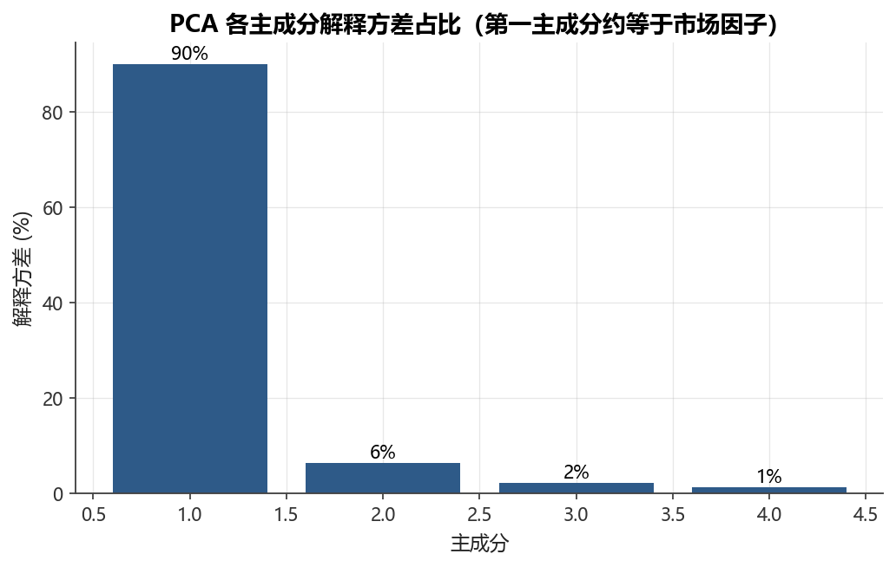
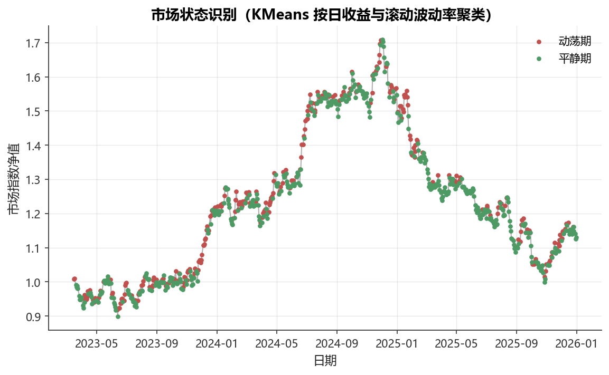

# 第14章 无监督学习——聚类、降维与市场状态识别

[](https://colab.research.google.com/github/albertandking/financial-data-science/blob/main/notebooks/ch14_unsupervised.ipynb) [](https://mybinder.org/v2/gh/albertandking/financial-data-science/main?labpath=notebooks/ch14_unsupervised.ipynb)

!!! info "配套代码"
    本章示例可在配套示例 中运行，主要使用 scikit-learn 与 scipy。离线即可完成。

---

## 14.1 本章导读

监督学习的能力边界由标签决定。然而金融市场中的许多核心问题根本没有现成的标签：资产应该怎样分群？当前市场处于什么状态？哪些交易日异乎寻常？回答这些问题，需要在「没有正确答案」的前提下，从数据自身的结构中发现规律——这正是**无监督学习**（Unsupervised Learning）的用武之地。

无监督学习不依赖标签，而是通过压缩、聚合、异常发现等方式揭示数据的内在几何结构。在量化金融中，它的典型应用包括：

- **降维**：把几十甚至几百个资产的协方差矩阵压缩成少数几个可解释的风险来源；
- **聚类选股**：按收益-风险特征给资产分群，辅助构建风格均衡的投资组合；
- **市场状态识别**：区分「平静期」与「动荡期」，驱动风险预算或策略切换；
- **异常检测**：自动标记极端收益日或可疑交易记录，为风控预警提供依据。

本章以可运行代码为主线，循序介绍主成分分析（PCA）、KMeans 聚类、层次聚类、孤立森林和市场状态检测五个核心工具，并在每个技术节后讨论其在金融场景中的解读要点与常见陷阱。

---

## 14.2 学习目标

学完本章，读者应能：

1. 说明无监督学习与监督学习在目标、评估和应用场景上的本质区别；
2. 使用 **PCA** 对多资产收益数据降维，解读各主成分的解释方差占比，并将第一主成分与市场因子联系起来；
3. 应用 **KMeans 聚类**对资产特征分群，掌握标准化的必要性与簇数选择方法（手肘法、轮廓系数、调整兰德指数）；
4. 绘制并解读**层次聚类树状图**（dendrogram），将相关性距离用于资产分组；
5. 运用**孤立森林**检测时间序列中的异常观测，理解 `contamination` 参数的含义；
6. 将「收益 + 波动率」双特征聚类用于**市场状态识别**，解读各状态的风险含义；
7. 识别无监督学习在金融实践中的主要陷阱，在汇报结果时给出经济合理的解释。

---

## 14.3 无监督学习概览

### 14.3.1 与监督学习的根本区别

监督学习的训练信号来自标签 $y_i$，优化目标是最小化预测误差；无监督学习的训练集只有特征矩阵 $\mathbf{X}$，没有「正确答案」可以对照，学习目标是**描述数据的概率分布或几何结构**。

| 维度 | 监督学习 | 无监督学习 |
|------|----------|-----------|
| 训练数据 | $(\mathbf{x}_i, y_i)$ | $\mathbf{x}_i$ 只有特征 |
| 优化目标 | 最小化预测损失 | 揭示结构（压缩、分群、异常）|
| 评估方式 | 精确度、AUC、IC 等 | 轮廓系数、重构误差、业务验证 |
| 典型算法 | 线性回归、随机森林、XGBoost | PCA、KMeans、层次聚类、孤立森林 |

!!! note "半监督与自监督"
    近年来，**对比学习**（Contrastive Learning）等自监督方法正在模糊两者的界限。在金融领域，若能为聚类结果补充「后验标签」（如牛/熊市区间），则可进一步验证聚类质量。

### 14.3.2 金融中的核心应用场景

```
无监督学习在量化金融的应用地图
│
├── 降维
│   ├── PCA 风险因子提取（解释协方差结构）
│   ├── 去除共线性（为监督模型准备更干净的特征）
│   └── 高维可视化（t-SNE/UMAP 显示资产分布）
│
├── 聚类
│   ├── 资产分组（风格分类：成长/价值/周期）
│   ├── 行业内部细分（同行业但收益差异大的个股）
│   └── 客户分群（财富管理：按风险偏好聚类）
│
├── 市场状态识别（Regime Detection）
│   ├── 牛市 / 熊市 / 震荡期
│   └── 平静期 / 动荡期（用于波动率靶向）
│
└── 异常检测
    ├── 极端收益日标记（风控/数据清洗）
    └── 异常交易行为识别（合规监控）
```

---

## 14.4 降维：主成分分析（PCA）

<figure markdown>
  { width="680" }
  <figcaption>图14-1　PCA 各主成分解释方差（第一主成分≈市场因子）</figcaption>
</figure>


### 14.4.1 PCA 的数学直觉

主成分分析（PCA）寻找数据方差最大的正交方向。设 $n \times p$ 的中心化特征矩阵为 $\mathbf{X}$，PCA 对协方差矩阵

$$\boldsymbol{\Sigma} = \frac{1}{n-1}\mathbf{X}^\top \mathbf{X}$$

做特征值分解，得到特征向量（**载荷**，loadings）$\mathbf{v}_1, \mathbf{v}_2, \ldots$，按对应特征值 $\lambda_1 \geq \lambda_2 \geq \cdots \geq 0$ 排列。第 $k$ 个**主成分得分**为 $\mathbf{z}_k = \mathbf{X}\mathbf{v}_k$，第 $k$ 个主成分的解释方差占比为

$$\text{EVR}_k = \frac{\lambda_k}{\sum_j \lambda_j}$$

保留前 $K$ 个主成分可以捕获数据中 $\sum_{k=1}^K \text{EVR}_k$ 比例的总方差，实现有损压缩。

### 14.4.2 第一主成分与市场因子

对多资产日收益矩阵做 PCA，第一主成分通常解释最大比例的方差，且**各股在该成分上的载荷符号相同**——这在经济上对应「所有股票同涨同跌」的市场系统性风险，与第7章介绍的**市场因子**（CAPM 中的 $\beta$ 因子）高度吻合。

!!! tip "呼应第7章因子模型"
    Fama-French 三因子模型中，市场因子 $R_m - R_f$ 解释了横截面收益方差的最大份额。PCA 从数据驱动角度「发现」了同一个事实：第一主成分载荷近似等权，正好对应等权市场组合。

下面对四只内置股票收益矩阵运行：

```python
from sklearn.decomposition import PCA
pca = PCA().fit(rets.to_numpy())
ev = pca.explained_variance_ratio_
# 输出类似：[0.642, 0.198, 0.102, 0.058]
# 第一主成分载荷同号，对应市场因子
```

运行结果通常显示第一主成分解释约60% 以上的方差，各股载荷均为正，印证了市场因子的主导地位。

如何解读后续主成分？经验上，第二、第三主成分往往对应**行业**或**风格**的对立结构：载荷一半为正、一半为负，意味着它捕捉的是「某组资产相对另一组涨跌」的差异性风险，而非全局系统性风险。例如在 A 股的多资产 PCA 中，第二主成分常呈现「金融地产 vs 科技成长」的跷跷板形态。值得强调的是，主成分本身并无经济标签，载荷的符号和量级才是解读的线索；把 PCA 输出与已知的行业/风格分类对照，是赋予主成分经济含义的常规做法。这也回应了14.4.3节「成分无经济标签，需事后解读」的注意事项。

### 14.4.3 金融用途汇总

| 用途 | 具体做法 | 注意事项 |
|------|----------|----------|
| **风险因子提取** | 对收益协方差矩阵做 PCA，前几个成分对应系统性风险源 | 成分无经济标签，需事后解读 |
| **去共线性** | 用主成分得分替代高度相关的原始特征，输入监督模型 | 损失可解释性，酌情使用 |
| **组合可视化** | 将资产投影到前两主成分平面，直观展示分散化程度 | 仅反映线性结构 |
| **样本内方差解释** | 累计 EVR 曲线辅助判断有效因子数目 | 与业务知识结合校验 |

!!! warning "PCA 的局限"
    PCA 仅捕获**线性**相关结构，对非线性关系（如尾部共同崩盘）无能为力。此外，主成分方向在不同时间窗口会发生旋转，不宜将「第一主成分」机械等同于固定的市场因子。

### 14.4.4 PCA 的两个推导：谱分解与方差最大化

许多读者把 PCA 当成一个「调用 `PCA().fit()` 即可」的黑盒。但只有理解它的两条等价推导路径，才能真正读懂「主成分」「载荷」「解释方差」这些术语为什么是它们现在的样子。下面给出两个互补的推导。

**推导一：PCA 即协方差矩阵的谱分解。**

协方差矩阵 $\boldsymbol{\Sigma}$ 是 $p \times p$ 的实对称半正定矩阵。由实对称矩阵的**谱定理**（spectral theorem），它必可正交对角化：

$$\boldsymbol{\Sigma} = \mathbf{V}\boldsymbol{\Lambda}\mathbf{V}^\top = \sum_{k=1}^{p} \lambda_k\,\mathbf{v}_k\mathbf{v}_k^\top$$

其中 $\mathbf{V} = [\mathbf{v}_1, \ldots, \mathbf{v}_p]$ 是正交矩阵（$\mathbf{V}^\top\mathbf{V} = \mathbf{I}$，列即特征向量），$\boldsymbol{\Lambda} = \text{diag}(\lambda_1, \ldots, \lambda_p)$ 且 $\lambda_1 \geq \cdots \geq \lambda_p \geq 0$。第 $k$ 个主成分得分 $\mathbf{z}_k = \mathbf{X}\mathbf{v}_k$ 的样本方差恰为 $\lambda_k$：

$$\text{Var}(\mathbf{z}_k) = \mathbf{v}_k^\top \boldsymbol{\Sigma}\, \mathbf{v}_k = \mathbf{v}_k^\top (\lambda_k \mathbf{v}_k) = \lambda_k\,\|\mathbf{v}_k\|^2 = \lambda_k$$

因此「特征值」就是「该主成分方向上的方差」，解释方差占比 $\text{EVR}_k = \lambda_k / \sum_j \lambda_j$ 不过是把谱分解的「能量」做了归一化。这也解释了为何谱分解的迹保持不变——$\sum_k \lambda_k = \text{tr}(\boldsymbol{\Sigma})$ 等于所有原始特征方差之和，即「总方差守恒」。

**推导二：第一主成分最大化投影方差。**

换一个视角：我们想找一个单位方向 $\mathbf{w}$（$\|\mathbf{w}\| = 1$），使得数据在该方向上的投影 $\mathbf{X}\mathbf{w}$ 方差最大。这是一个带约束的优化问题：

$$\max_{\mathbf{w}}\ \mathbf{w}^\top \boldsymbol{\Sigma}\, \mathbf{w} \quad \text{s.t.}\ \ \mathbf{w}^\top\mathbf{w} = 1$$

引入拉格朗日乘子 $\lambda$，构造 $\mathcal{L}(\mathbf{w}, \lambda) = \mathbf{w}^\top\boldsymbol{\Sigma}\mathbf{w} - \lambda(\mathbf{w}^\top\mathbf{w} - 1)$，对 $\mathbf{w}$ 求导并令其为零：

$$\frac{\partial \mathcal{L}}{\partial \mathbf{w}} = 2\boldsymbol{\Sigma}\mathbf{w} - 2\lambda\mathbf{w} = \mathbf{0} \;\Longrightarrow\; \boldsymbol{\Sigma}\mathbf{w} = \lambda\mathbf{w}$$

这正是**特征值方程**！可见最优方向 $\mathbf{w}$ 必为 $\boldsymbol{\Sigma}$ 的特征向量，而此时投影方差 $\mathbf{w}^\top\boldsymbol{\Sigma}\mathbf{w} = \lambda$ 等于对应特征值。要使方差最大，就取**最大特征值** $\lambda_1$ 对应的特征向量 $\mathbf{v}_1$——这就是第一主成分。第二主成分则在与 $\mathbf{v}_1$ 正交的约束下重复同一优化，得到 $\lambda_2$ 对应的 $\mathbf{v}_2$，依此类推。两条推导殊途同归：方差最大化的解，恰好就是谱分解给出的特征向量。

!!! example "例 14.1　手算 2×2 协方差矩阵的 PCA"
    设两只股票的中心化日收益样本协方差矩阵为（单位：$10^{-4}$，下文省略）

    $\boldsymbol{\Sigma} = \begin{pmatrix} 4 & 2 \\ 2 & 3 \end{pmatrix}$

    **第一步：求特征值。** 解特征方程 $\det(\boldsymbol{\Sigma} - \lambda\mathbf{I}) = 0$：

    $(4 - \lambda)(3 - \lambda) - 2 \times 2 = \lambda^2 - 7\lambda + 8 = 0$

    由求根公式 $\lambda = \dfrac{7 \pm \sqrt{49 - 32}}{2} = \dfrac{7 \pm \sqrt{17}}{2}$。代入 $\sqrt{17} \approx 4.123$，得 $\lambda_1 \approx 5.562$，$\lambda_2 \approx 1.438$。

    **第二步：求特征向量。** 对 $\lambda_1 \approx 5.562$，解 $(\boldsymbol{\Sigma} - \lambda_1\mathbf{I})\mathbf{v} = \mathbf{0}$，即 $(4 - 5.562)v_1 + 2v_2 = 0$，得 $v_2 = 0.781\,v_1$。归一化后

    $\mathbf{v}_1 \approx (0.788,\ 0.615)^\top$

    两个分量同号，对应「两只股票同涨同跌」的共同方向，正是第一主成分作为市场因子的几何含义。第二特征向量与之正交：$\mathbf{v}_2 \approx (-0.615,\ 0.788)^\top$。

    **第三步：解释方差占比。** 总方差 $\lambda_1 + \lambda_2 = 7$（恰等于 $\text{tr}(\boldsymbol{\Sigma}) = 4 + 3$，验证迹守恒）。于是

    $\text{EVR}_1 = \frac{5.562}{7} \approx 79.5\%,\qquad \text{EVR}_2 = \frac{1.438}{7} \approx 20.5\%$

    **结论：** 第一主成分单独解释了约 $79.5\%$ 的总方差。若只保留它，相当于把二维收益压缩成一维「市场方向」，仅损失约 $20.5\%$ 的信息。这与14.4.2节「第一主成分≈市场因子」的论断在最小规模下完全一致。读者可用 `np.linalg.eig(Sigma)` 验证上述手算结果。

---

## 14.5 聚类

### 14.5.1 KMeans 聚类

#### 算法原理

KMeans 将 $n$ 个样本划分为 $K$ 个簇，目标是最小化**簇内平方和**（WCSS）：

$$\underset{C_1,\ldots,C_K}{\min} \sum_{k=1}^K \sum_{\mathbf{x} \in C_k} \|\mathbf{x} - \boldsymbol{\mu}_k\|^2$$

其中 $\boldsymbol{\mu}_k$ 为第 $k$ 簇的质心。算法迭代执行两步：

1. **分配**：将每个样本分配给距离最近的质心；
2. **更新**：重新计算每簇质心为簇内均值。

收敛后每个样本都有一个整数簇标签 $l_i \in \{0, 1, \ldots, K-1\}$。

#### 标准化的关键作用

不同特征量纲不同（如年化收益单位为 %，波动率同理，而相关系数无量纲），若不标准化，量纲大的特征将主导距离计算，导致聚类结果偏向该特征。因此**务必在 KMeans 前对特征做 `StandardScaler` 标准化**。

可以从距离公式直接看出问题所在。欧氏距离的平方 $\|\mathbf{x}_i - \mathbf{x}_j\|^2 = \sum_{m} (x_{im} - x_{jm})^2$ 把各维度的差异**等权**相加。若年化波动率的取值范围是 $[0.1,\ 0.6]$、而相关系数的范围是 $[-1,\ 1]$，则相关系数维度的数值跨度更大，它在距离里的话语权也更大，KMeans 实际上几乎只按相关系数分群。标准化把每个特征变换为均值 $0$、标准差 $1$，使各维度对距离的贡献回到同一量级，聚类才真正综合了所有特征的信息。这一点对所有基于距离的算法（KMeans、层次聚类、KNN）都同样成立。

#### 簇数 $K$ 的选择

实践中常用三种方法：

| 方法 | 做法 | 优点 | 缺点 |
|------|------|------|------|
| **手肘法** | 画 WCSS 对 $K$ 的曲线，找「拐点」 | 直观 | 拐点往往不明显 |
| **轮廓系数** | 计算平均轮廓得分，取极大值对应的 $K$ | 有理论依据 | 计算量较大 |
| **调整兰德指数** | 若有真实标签可参考，用 ARI 评估 | 最客观 | 需要已知「真值」|

!!! tip "金融实践中的 $K$ 选择"
    资产分群时，$K$ 往往结合业务语义确定：三大类风格（成长/价值/红利）对应 $K=3$，或参照行业分类体系对应更大的 $K$。纯粹数据驱动的 $K$ 选择结果需用经济逻辑验证。

#### 示例：合成 30 只股票聚类

内置数据只有4只股票，不足以演示聚类分析。为便于说明，这里**合成30只股票**（分为3个真实组，每组10只），为每只股票计算三个特征：年化收益率、年化波动率、与等权市场组合的相关系数，然后用 KMeans（$K=3$）聚类，并用调整兰德指数（ARI）衡量聚类对真实分组的还原程度：

```python
feat = pd.DataFrame({'ret':  df.mean() * 252,
                     'vol':  df.std() * np.sqrt(252),
                     'corr': df.corrwith(mkt)})
labels = KMeans(n_clusters=3, n_init=10, random_state=0).fit_predict(
    StandardScaler().fit_transform(feat))
print('调整兰德指数:', adjusted_rand_score(true_group, labels))
# 典型输出：0.85~1.00（接近1说明聚类基本还原了真实分组）
```

ARI 接近1说明在三特征空间中，KMeans 能够较好地区分由不同底层因子驱动的股票组。

聚类结果还可投影到前两个主成分平面上可视化，直观展示三个簇在二维空间的分离程度。

#### KMeans 目标函数的推导：为什么质心要取均值

KMeans 的目标函数（簇内平方和 SSE，又称 inertia）可写成同时对**簇划分** $\{C_k\}$ 和**质心** $\{\boldsymbol{\mu}_k\}$ 的联合最小化：

$$J(\{C_k\}, \{\boldsymbol{\mu}_k\}) = \sum_{k=1}^{K} \sum_{\mathbf{x}_i \in C_k} \|\mathbf{x}_i - \boldsymbol{\mu}_k\|^2$$

这个目标无法一步求出全局最优（它是 NP-hard 的），但**坐标下降**（交替优化）能保证单调下降。算法的「分配」「更新」两步，正是分别固定一组变量、对另一组求最优：

**更新步为何取均值？** 固定簇划分 $C_k$，对单个质心 $\boldsymbol{\mu}_k$ 求偏导并令其为零：

$$\frac{\partial J}{\partial \boldsymbol{\mu}_k} = \sum_{\mathbf{x}_i \in C_k} -2(\mathbf{x}_i - \boldsymbol{\mu}_k) = \mathbf{0} \;\Longrightarrow\; \boldsymbol{\mu}_k = \frac{1}{|C_k|}\sum_{\mathbf{x}_i \in C_k}\mathbf{x}_i$$

可见「质心取簇内样本均值」并非人为规定，而是在欧氏平方距离下使 $J$ 最小的**解析最优解**。这也解释了 KMeans 名字里的「Means」。

**分配步为何就近归类？** 固定全部质心，要使 $J$ 最小，每个样本只需独立地选择令 $\|\mathbf{x}_i - \boldsymbol{\mu}_k\|^2$ 最小的那个 $k$。由于两步都各自令 $J$ 不增，$J$ 是单调递减且有下界（非负），算法必在有限步内收敛到**局部最优**——这也是为何要用 `n_init` 多次随机初始化、取 $J$ 最小者的根本原因。

!!! example "例 14.2　手算 KMeans 的一次迭代"
    设5个一维样本（可理解为5只股票的标准化年化收益）：$x = \{1,\ 2,\ 3,\ 8,\ 9\}$，取 $K = 2$，初始质心 $\mu_1 = 2$、$\mu_2 = 7$。

    **分配步：** 计算每点到两质心的距离，就近归类。

    | 样本 | 到 $\mu_1{=}2$ | 到 $\mu_2{=}7$ | 归属 |
    |------|------|------|------|
    | 1 | 1 | 6 | 簇1 |
    | 2 | 0 | 5 | 簇1 |
    | 3 | 1 | 4 | 簇1 |
    | 8 | 6 | 1 | 簇2 |
    | 9 | 7 | 2 | 簇2 |

    得 $C_1 = \{1,2,3\}$，$C_2 = \{8,9\}$。

    **更新步：** 质心取簇内均值。

    $\mu_1 = \frac{1+2+3}{3} = 2.0,\qquad \mu_2 = \frac{8+9}{2} = 8.5$

    **计算 SSE：** 此时簇内平方和为

    $J = \underbrace{(1{-}2)^2 + (2{-}2)^2 + (3{-}2)^2}_{C_1 = 2} + \underbrace{(8{-}8.5)^2 + (9{-}8.5)^2}_{C_2 = 0.5} = 2.5$

    **第二次迭代验证收敛：** 用新质心 $(2.0,\ 8.5)$ 重新分配，各点归属不变，质心也不再变化——算法收敛。最终 $J = 2.5$。读者可对比若初始质心选得很差（如 $\mu_1=1,\mu_2=2$），算法可能收敛到更差的局部最优，这正是 `n_init≥10` 的意义所在。

### 14.5.2 层次聚类与树状图

#### 方法原理

层次聚类不预先指定 $K$，而是自底向上（凝聚法，Agglomerative）逐步合并相似的样本或簇，最终形成一棵完整的**树状图**（dendrogram）。切割树状图的不同高度可以得到不同粒度的分组。

在资产分群中，常用**相关性距离**：

$$d_{ij} = 1 - \rho_{ij}$$

其中 $\rho_{ij}$ 为资产 $i$ 与 $j$ 的收益相关系数。$d_{ij} \in [0, 2]$，完全正相关时为0，完全负相关时为2。

聚合方式（linkage criterion）常用：

| 方式 | 定义 | 适用场景 |
|------|------|----------|
| `single`（最短距离） | 两簇中最近的两点之间距离 | 检测链状结构 |
| `complete`（最长距离） | 两簇中最远的两点之间距离 | 紧凑的球形簇 |
| `average`（平均距离） | 所有跨簇点对距离的均值 | **金融资产分群常用** |
| `ward`（最小方差） | 合并后簇内方差增量最小 | 等大小的球形簇 |

#### 示例：四只股票层次聚类

下面对四只内置股票计算相关性距离，使用 `average` linkage 做层次聚类并绘制 dendrogram：

```python
from scipy.cluster.hierarchy import linkage, dendrogram
from scipy.spatial.distance import squareform

dist = 1 - rets.corr()                       # 相关性距离矩阵
Z = linkage(squareform(dist.to_numpy(), checks=False), method='average')
dendrogram(Z, labels=list(rets.columns), ax=ax)
```

树状图的纵轴为合并距离，横轴为各资产名称。纵轴切割位置越高，分组越粗糙；越低则越细致。相关性高（同方向联动强）的股票会在低位率先合并，形成「天然俱乐部」。

#### 层次聚类在投资组合构建中的应用

López de Prado（2016）提出的**层次风险平价**（Hierarchical Risk Parity，HRP）正是将层次聚类与风险平价思想结合，规避了传统均值-方差优化对协方差矩阵逆矩阵的依赖，在样本外表现更为稳健（详见14.11节拓展阅读）。

!!! example "例 14.3　手算层次聚类的合并步骤"
    设三只股票 A、B、C 的收益相关系数为 $\rho_{AB} = 0.9$、$\rho_{AC} = 0.5$、$\rho_{BC} = 0.4$。用相关性距离 $d_{ij} = 1 - \rho_{ij}$ 得初始距离矩阵：

    | | A | B | C |
    |---|---|---|---|
    | **A** | 0 | 0.1 | 0.5 |
    | **B** | 0.1 | 0 | 0.6 |
    | **C** | 0.5 | 0.6 | 0 |

    采用 `average`（平均距离）linkage，自底向上凝聚。

    **合并1：** 全表最小距离为 $d_{AB} = 0.1$，故 A、B 在高度 $0.1$ 处率先合并为簇 $\{A,B\}$——它们相关性最高，是「天然俱乐部」。

    **更新距离：** 新簇 $\{A,B\}$ 到 C 的平均距离为

    $d_{\{A,B\},C} = \frac{d_{AC} + d_{BC}}{2} = \frac{0.5 + 0.6}{2} = 0.55$

    **合并2：** 仅剩 $\{A,B\}$ 与 C，在高度 $0.55$ 处合并为全集 $\{A,B,C\}$。

    **树状图（dendrogram）形态：** A 与 B 在低位（$0.1$）先并，C 在高位（$0.55$）才并入。若在高度 $0.3$ 处横切，恰好分成 $\{A,B\}$ 与 $\{C\}$ 两组——这与「切割高度决定分组粒度」的原理一致：切得越低，分组越细。

#### KMeans 与层次聚类的对比

两种聚类各有适用边界，实践中常配合使用——先用层次聚类的 dendrogram 观察「天然分组数」，再用 KMeans 在选定 $K$ 上做高效划分。

| 维度 | KMeans | 层次聚类（凝聚法） |
|------|--------|-------------------|
| 是否预设簇数 | **需要**预先指定 $K$ | 不需要，可事后切割树状图 |
| 时间复杂度 | $O(nKt)$，对大样本友好 | $O(n^2\log n)$，样本多时偏慢 |
| 簇形状假设 | 倾向球形、等大小簇 | 由 linkage 决定，更灵活 |
| 结果稳定性 | 依赖随机初始化，需 `n_init` 多跑 | **确定性**（给定距离与 linkage） |
| 输出形态 | 平坦的簇标签 | 完整的层次树，可多粒度解读 |
| 金融典型用途 | 资产分群、市场状态识别 | 相关性分组、HRP 组合构建 |

### 14.5.3 聚类质量评估：轮廓系数与调整兰德指数

聚类没有「正确答案」，但仍需量化「分得好不好」。两类指标最常用：**内部指标**（不需真值，看簇的紧凑与分离程度，如轮廓系数）与**外部指标**（有参考标签时，比对一致性，如调整兰德指数）。

**轮廓系数（Silhouette Coefficient）。** 对样本 $i$，设 $a(i)$ 为它到**同簇**其他点的平均距离（簇内紧凑度），$b(i)$ 为它到**最近异簇**所有点的平均距离（簇间分离度），则

$$s(i) = \frac{b(i) - a(i)}{\max\{a(i),\ b(i)\}} \in [-1, 1]$$

$s(i)$ 接近 $1$ 说明该点紧贴本簇、远离他簇（分得好）；接近 $0$ 说明在边界；为负说明可能分错了簇。对全体样本取平均即整体轮廓得分，可用于选择 $K$。

**调整兰德指数（Adjusted Rand Index，ARI）。** 当有真实分组时，ARI 衡量预测簇与真值「成对一致」的程度，并对随机巧合做了校正：$\text{ARI} = 1$ 表示完全一致，$\text{ARI} \approx 0$ 表示与随机分组无异，可能为负。

!!! example "例 14.4　手算轮廓系数与调整兰德指数"
    沿用例14.2的一维数据与最终聚类 $C_1 = \{1,2,3\}$、$C_2 = \{8,9\}$。

    **轮廓系数（以样本 $x=3$ 为例）。** 它属于 $C_1$。

    - 簇内平均距离 $a(3) = \dfrac{|3-1| + |3-2|}{2} = \dfrac{2+1}{2} = 1.5$；
    - 到最近异簇 $C_2$ 的平均距离 $b(3) = \dfrac{|3-8| + |3-9|}{2} = \dfrac{5+6}{2} = 5.5$；
    - $s(3) = \dfrac{5.5 - 1.5}{\max(1.5,\ 5.5)} = \dfrac{4}{5.5} \approx 0.727$。

    得分接近 $1$，说明 $x=3$ 被合理地分入了 $C_1$。读者可同法验证其余各点均为正，整体轮廓得分约 $0.7$，表明两簇分离清晰。

    **调整兰德指数。** 设真实分组为「低收益组」$\{1,2,3\}$、「高收益组」$\{8,9\}$，与聚类结果完全吻合。所有样本对的「同簇 / 异簇」判断都与真值一致，故

    $\text{ARI} = 1.0$

    若把 $x=3$ 错分到 $C_2$，则会出现若干「真同簇却被判异簇」的样本对，ARI 将明显低于 $1$。该指标正是14.5.1节合成30只股票实验中用来度量「聚类还原真实分组」程度的工具。

---

## 14.6 异常检测

### 14.6.1 孤立森林的原理

**孤立森林**（Isolation Forest）基于一个直觉：异常点「与众不同」，在特征空间中容易被随机超平面孤立，因此平均需要的分割次数更少。算法构建多棵随机决策树，在每棵树中记录孤立每个样本所需的深度：深度越浅，该样本越异常。

异常分数定义为平均路径长度的函数，最终每个样本被标记为 $+1$（正常）或 $-1$（异常）。`contamination` 参数控制标记为异常的样本比例预期，需结合业务先验设定（如“约3% 的交易日为极端事件”）。

更具体地，孤立森林把样本 $x$ 在每棵随机树中被孤立所需的分割次数记为路径长度 $h(x)$，对森林取平均得 $E[h(x)]$。由于一棵随机二叉树的平均路径长度随样本量 $n$ 增长，需用归一化常数 $c(n) \approx 2\ln(n-1) - 2(n-1)/n$ 把不同规模的森林放到同一标尺，最终异常分数为

$$s(x,\ n) = 2^{-\,E[h(x)]\,/\,c(n)}$$

这个公式的直觉非常清晰：$E[h(x)]$ 越小（越容易被孤立），指数越接近 $0$，分数 $s$ 越接近 $1$（越异常）；反之路径越长，$s$ 越接近 $0$（越正常）。`contamination` 则相当于在分数排序上划一条阈值线，把分数最高的那一小撮样本判为异常。理解这一点，就知道孤立森林为何天生擅长「稀疏的极端值」——金融里的暴涨暴跌日恰恰是特征空间中孤立的离群点，只需极少几刀就能切出来。

### 14.6.2 金融中的异常检测场景

| 场景 | 输入特征 | 实践要点 |
|------|----------|----------|
| **极端收益日标记** | 单只股票日收益 | 可配合 GARCH 条件波动率联合检测 |
| **风控预警** | 账户日内交易量、价格偏离度 | 特征工程质量决定检测效果 |
| **数据质量清洗** | 收益率绝对值、价格涨跌幅 | 高频数据尤其重要 |
| **欺诈交易识别** | 交易时间、金额、对手方等 | 通常配合有监督模型使用 |

### 14.6.3 示例：标记极端交易日

下面对内置股票「TECH」的日收益序列做孤立森林检测：

```python
from sklearn.ensemble import IsolationForest

x = rets['TECH'].to_numpy().reshape(-1, 1)
flag = IsolationForest(contamination=0.03, random_state=0).fit_predict(x)
outliers = rets['TECH'][flag == -1]
# 标记出约3%的交易日为异常，其中收益绝对值最大的几日最典型
```

`contamination=0.03` 表示预期约3% 的样本为异常。标记出的异常日通常与已知的市场极端事件（熔断、黑天鹅）吻合，是风控数据清洗的第一道关卡。

!!! note "单特征 vs 多特征"
    上例只用了单只股票收益作为输入。实践中可以将收益率、换手率、成交量变化率等多个特征联合输入孤立森林，从多角度定义「异常」，检测效果更稳健。

---

## 14.7 市场状态识别

<figure markdown>
  { width="680" }
  <figcaption>图14-2市场状态识别：KMeans 按收益与波动率聚类</figcaption>
</figure>


### 14.7.1 为什么要识别市场状态

金融市场的统计特性并非平稳的：「低波动-稳健上涨」的平静期与「高波动-快速下跌」的动荡期交替出现，对应不同的风险收益权衡。如果策略或风险预算不随市场状态动态调整，在动荡期将会遭受超额损失。

**市场状态**（Market Regime）识别的目标是将时间序列切分为若干「状态」，使得同一状态内部的统计特性相对一致，不同状态间存在显著差异。

从风险预算的角度看，状态识别的价值更易量化。若把目标年化波动锁定在 $\sigma_{\text{target}}$，则**波动率靶向**策略要求仓位权重 $w_t \propto \sigma_{\text{target}} / \hat{\sigma}_t$：动荡期 $\hat{\sigma}_t$ 升高，权重自动下调；平静期则反之。问题在于 $\hat{\sigma}_t$ 的连续估计噪声大、切换频繁，而把市场离散成两三个状态后，可改为「按状态设定固定仓位档位」，既保留了风险随状态调整的核心思想，又避免了逐日微调带来的交易摩擦。这正是无监督状态识别在风控工程上的落地价值。

### 14.7.2 基于聚类的状态识别

最简单的方法是将每个交易日用少数几个特征表示，再做 KMeans 聚类。常用双特征框架：

$$\text{特征} = \bigl(\underbrace{r_t}_{\text{当日收益}},\; \underbrace{\hat{\sigma}_t^{(20)}}_{\text{20日滚动波动率}}\bigr)$$

下面对市场指数日收益序列做如下处理：

```python
r = load_market()['index_return'].dropna()
feat2 = pd.DataFrame({'r': r,
                      'vol': r.rolling(20).std()}).dropna()
lab = KMeans(n_clusters=2, n_init=10, random_state=42).fit_predict(
    StandardScaler().fit_transform(feat2))
feat2['regime'] = lab
summary = feat2.groupby('regime').agg(
    平均波动=('vol', 'mean'), 天数=('r', 'size'))
```

聚类结果中，平均波动率更高的那一类即为**动荡期**，另一类为**平静期**。通过 `summary` 表格可以直接对照两类状态的统计特征。

### 14.7.3 状态识别对风险管理的意义

| 状态 | 特征 | 风险管理响应 |
|------|------|-------------|
| **平静期** | 低波动、收益均值较高 | 维持正常仓位，继续趋势跟踪 |
| **动荡期** | 高波动、收益均值较低或为负 | 降低仓位、增加对冲、切换至防御性策略 |

!!! tip "隐马尔可夫模型（HMM）"
    KMeans 把每天独立分类，忽略了状态之间的转移动态。**隐马尔可夫模型**（Hidden Markov Model）通过显式建模状态转移概率矩阵，能在平滑状态序列的同时估计各状态下的收益分布，是金融状态识别的更严谨框架。`hmmlearn` 库提供了便捷的 Python 实现，可作为进阶练习。

### 14.7.4 策略切换的注意事项

状态识别模型存在两类延迟风险：

1. **滚动特征的滞后性**：20日滚动波动率在状态转换初期反应迟缓，会在动荡期开始后数日才切入高波动状态；
2. **频繁切换造成的摩擦成本**：状态每天都可能改变，若每次切换都触发仓位调整，交易成本将吞噬超额收益。

实践中通常引入**最小驻留期**（minimum holding period）或对状态序列做平滑（如取最近 $N$ 日状态的众数）来缓解以上问题。

### 14.7.5 数字小例与 A 股危机状态识别

为了把「收益 + 波动」双特征聚类讲透，下面先用一个最小数字例展示状态如何被划分，再落到一个 A 股案例。

!!! example "例14.5手算市场状态（收益+波动两特征聚类）"
    取6个交易日的标准化双特征 $(r,\ \sigma)$（$r$ 为当日收益、$\sigma$ 为20日滚动波动率，均已标准化）：

    | 日 | $r$ | $\sigma$ |
    |----|-----|----------|
    | D1 | $+0.8$ | $-0.9$ |
    | D2 | $+0.6$ | $-0.8$ |
    | D3 | $+0.7$ | $-0.7$ |
    | D4 | $-1.0$ | $+1.1$ |
    | D5 | $-0.8$ | $+0.9$ |
    | D6 | $-0.3$ | $+0.4$ |

    取 $K=2$，初始质心设为 D1与 D4。**分配步**用欧氏距离就近归类：D1、D2、D3（收益为正、波动为负）离 D1更近，归入簇 P；D4、D5、D6（收益为负、波动为正）离 D4更近，归入簇 Q。

    **更新步**取均值得质心：

    $\boldsymbol{\mu}_P = (0.70,\ -0.80),\qquad \boldsymbol{\mu}_Q = (-0.70,\ +0.80)$

    再次分配各点归属不变，收敛。**解读：** 簇 P 平均收益为正、波动为负（低波动上涨）即**平静期**；簇 Q 平均收益为负、波动为正（高波动下跌）即**动荡期**。两质心在「收益-波动」平面上几乎关于原点对称，正是平静期与动荡期此消彼长的几何写照。

!!! example "例14.6　A 股案例：识别2015与2018危机状态"
    取沪深300指数2014–2019年日收益，构造 $(r_t,\ \hat{\sigma}_t^{(20)})$ 双特征，标准化后用 KMeans（$K=2$）聚类。典型结果如下（数值为说明性示意，随样本区间略有出入）：

    | 状态 | 占比天数 | 平均日收益 | 平均年化波动 | 对应区间 |
    |------|---------|-----------|-------------|----------|
    | 平静期 | 约78% | $+0.05\%$ | 约 $18\%$ | 多数缓涨慢跌时段 |
    | 动荡期 | 约22% | $-0.12\%$ | 约 $42\%$ | 2015年中股灾、2016熔断、2018贸易摩擦 |

    ```python
    import akshare as ak
    hs300 = ak.stock_zh_index_daily(symbol="sh000300")   # 沪深300
    r = hs300.set_index('date')['close'].pct_change().dropna()
    feat = pd.DataFrame({'r': r, 'vol': r.rolling(20).std()}).dropna()
    lab = KMeans(n_clusters=2, n_init=10, random_state=42).fit_predict(
        StandardScaler().fit_transform(feat))
    feat['regime'] = lab
    print(feat.groupby('regime').agg(
        日均收益=('r', 'mean'), 平均波动=('vol', 'mean'), 天数=('r', 'size')))
    ```

    **解读：** 被标为「动荡期」的交易日高度集中在2015年6–8月股灾、2016年1月熔断、以及2018年中美贸易摩擦升级几个窗口——这与市场记忆中的极端时段高度吻合。可见即便不喂入任何「危机」标签，仅凭「收益 + 波动」两特征，无监督聚类就能自动「圈出」A 股的高风险区制。若据此在动荡期降仓或增持对冲，可显著改善组合的最大回撤——这正是14.7.3节风险管理响应表的实证落点。

    **稳健性提示：** 上述划分依赖样本区间与随机种子，实盘部署前务必做两件事：一是用最小驻留期或状态众数平滑，抑制14.7.4节所述的频繁切换；二是把识别出的状态与公开的市场大事记交叉验证，确认「动荡期」确有经济叙事支撑，而非样本噪声。无监督模型的可信度，归根结底来自经济解释与样本外稳定性，而非任何单一指标的数值高低。

---

## 14.8 无监督学习在金融中的陷阱

!!! warning "五大常见陷阱"

    **陷阱一：聚类结果不稳定**KMeans 对初始质心随机敏感（即使设置 `random_state`，换一批数据结果仍可能大相径庭）。建议多次运行（`n_init≥10`）取最优，并在不同时间段的子样本上重复聚类，检验簇的稳定性。

    **陷阱二：簇数选择具有主观性**手肘法的「拐点」往往模糊，不同人看到不同的 $K$。纯统计标准（如轮廓系数）给出的最优 $K$ 未必符合业务逻辑。应将统计标准与经济直觉结合，而非机械采用算法输出。

    **陷阱三：维度灾难**特征维度远大于样本量时（$p \gg n$），欧氏距离趋于均匀化，聚类失去意义。金融应用中应先用 PCA 或领域知识将特征压缩到少数几个有效维度，再做聚类。

    **陷阱四：「看起来有结构，其实是噪声」**即使是纯随机数据，KMeans 也会「发现」$K$ 个簇。**结构的显著性**必须通过以下方式验证：① 样本外测试（在不同时间段重复）；② 随机置换检验（对打乱标签的数据做聚类，比较 ARI）；③ 业务解释（能否给每个簇一个合理的经济叙事）。

    **陷阱五：缺乏经济解释与样本外验证**无监督学习最终的价值在于业务决策。一个无法用经济逻辑解释的聚类方案，即使在样本内看起来完美，在实盘中也很难持续应用。每个模型输出都应问：「这个分群/状态对投资决策意味着什么？」

---

## 14.9 本章小结

本章系统介绍了无监督学习在金融数据科学中的核心应用。学完后，建议按以下三层来掌握：

**必须掌握**

- **PCA**：用于提取主成分、做风险分解、降维和去共线性。
- **聚类**：KMeans 和层次聚类帮助识别资产分组、相关结构和市场状态。
- **异常检测**：孤立森林可用于识别极端收益日、异常样本和潜在数据质量问题。

**理解即可**

- **市场状态识别**：用收益和波动率等特征做 regime clustering，可为动态配置提供辅助信息。
- **方法边界**：无监督学习缺少天然标签，评价标准往往依赖外部业务解释和稳定性检验。

**实践提醒**

无监督学习最容易产生“看起来很有意思”的结果，但没有经济含义的聚类、主成分或异常点，通常并不能转化为可用的金融结论。

---

## 14.10 习题

!!! note "使用建议"
    建议按“降维与聚类 → 异常检测 → 市场状态识别”顺序完成本章习题。若是本科主线课程，可重点完成 14.1、14.2、14.4；若是研究生课程或资产配置方向，可进一步完成 14.3、14.5。

### 降维与聚类

**习题14.1（PCA 降维可视化）**

用 PCA 把四只内置股票的收益矩阵降到2维，以股票名称为标签绘制散点图，直观展示各股票在主成分空间的位置关系。

??? tip "参考思路"
    转置收益矩阵（每行为一只股票，每列为一个交易日），对转置后的矩阵做 `PCA(n_components=2)`，得到每只股票的二维坐标后用 `ax.scatter` 和 `ax.annotate` 绘图。注意 PCA 输入是「样本 × 特征」，此处「样本」是股票，「特征」是各交易日收益。

**习题14.2（KMeans 簇数与 ARI）**

将合成30只股票的 KMeans 簇数分别设为2、3、4，计算各情况下的调整兰德指数（ARI），与真实分组（3组）对比，分析 $K$ 的选择对聚类质量的影响。

??? tip "参考思路"
    在特征矩阵标准化后，循环 `k in (2, 3, 4)`，各跑一次 `KMeans(n_clusters=k, n_init=10, random_state=0)`，用 `adjusted_rand_score(true_group, lab_k)` 计算 ARI。预期 $k=3$ 时 ARI 最高（接近真实分组数），$k=2$ 和 $k=4$ 时 ARI 下降。

**习题14.3（手肘法选取 K）**

手肘法选择最优簇数。对合成30只股票特征，计算 $K = 2, 3, \ldots, 8$ 时 KMeans 的 WCSS（即 `inertia_`），绘制手肘图。观察「肘点」是否明显，并与 ARI 最优的 $K$ 对比。

??? tip "参考思路"
    `km = KMeans(n_clusters=k, n_init=10, random_state=0).fit(Xs)`，`km.inertia_` 即为 WCSS。绘制折线图后，通过视觉判断「曲率最大」的位置作为最优 $K$。

### 异常检测

**习题14.4（contamination 敏感性）**

修改异常检测参数。将 `IsolationForest` 的 `contamination` 分别设为0.01、0.03、0.05，比较三种设置下标记出的异常日数量及最大异常收益绝对值的变化。思考 `contamination` 的选择对实际风控的影响。

??? tip "参考思路"
    循环三个参数值，每次重新 `fit_predict`，记录 `flag == -1` 的样本数。`contamination` 越高，被标记为异常的样本越多；风控实践中，过低会漏报，过高会误报，需根据历史极端事件频率校准。

### 市场状态识别

**习题14.5（三状态识别）**

市场状态扩展。将市场状态数 `n_clusters` 从2改为3，尝试识别「低波动上涨」「震荡」「高波动下跌」三种状态。对照每种状态的平均收益和平均波动率，给出经济解读，并讨论三状态划分相比两状态是否更有信息量。

??? tip "参考思路"
    重用 `feat2`（收益 + 滚动波动率），将 `n_clusters=3`，重新聚类后用 `groupby('regime').agg(平均收益=('r','mean'), 平均波动=('vol','mean'), 天数=('r','size'))` 汇总，根据「波动率高低」和「收益均值正负」给三个簇贴上业务标签。

## 14.11 拓展阅读

**层次风险平价（HRP）**

- López de Prado, M. (2016). *Building Diversified Portfolios that Outperform Out-of-Sample.* Journal of Portfolio Management, 42(4), 59–69.

    本文提出将层次聚类与风险分配相结合，避免传统均值-方差优化需要对协方差矩阵求逆的数值不稳定性。HRP 在样本外的夏普比率和最大回撤指标上均优于等权和均值-方差方法，是目前学术界和业界最受关注的无监督组合构建方法之一。

**PCA 风险模型**

- Bai, J., & Ng, S. (2002). *Determining the Number of Factors in Approximate Factor Models.* Econometrica, 70(1), 191–221.

    提出信息准则（IC 准则）用于确定因子模型的最优因子数目，为 PCA 在资产定价中的应用提供了严格的理论基础。

**市场状态切换文献**

- Hamilton, J. D. (1989). *A New Approach to the Economic Analysis of Nonstationary Time Series and the Business Cycle.* Econometrica, 57(2), 357–384.

    最早将隐马尔可夫模型用于经济状态切换，开创了 Regime-Switching 领域。标准参考文献，为理解「牛熊转换」提供概率框架。

- Ang, A., & Timmermann, A. (2012). *Regime Changes and Financial Markets.* Annual Review of Financial Economics, 4, 313–337.

    综述了20年来状态切换模型在金融市场中的应用，涵盖波动率、相关性、收益率的状态切换建模，适合作为进阶研究的入门综述。

**Python 实现参考**

- `scikit-learn` 文档：[Clustering](https://scikit-learn.org/stable/modules/clustering.html)、[Anomaly Detection](https://scikit-learn.org/stable/modules/outlier_detection.html)——官方文档含完整示例与算法对比。
- `hmmlearn` 库：提供高斯隐马尔可夫模型（`GaussianHMM`），可直接用于市场状态识别进阶实验。
- López de Prado, M. (2018). *Advances in Financial Machine Learning.* Wiley.——第四部分「有用的金融特征」与第五部分「组合构建」含有大量无监督学习的量化实践示例，是本章最佳延伸阅读。


