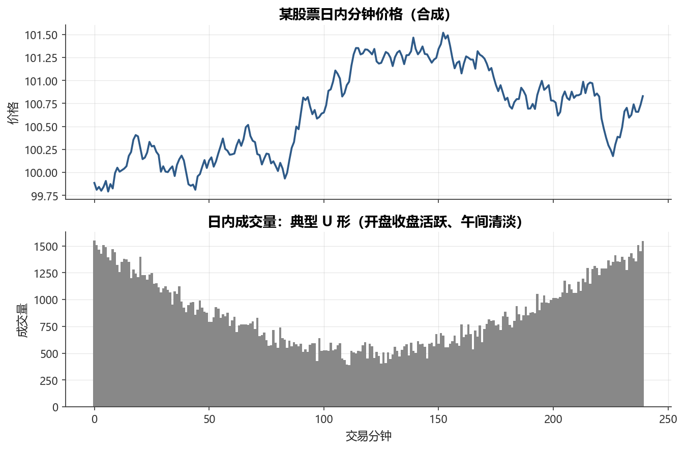
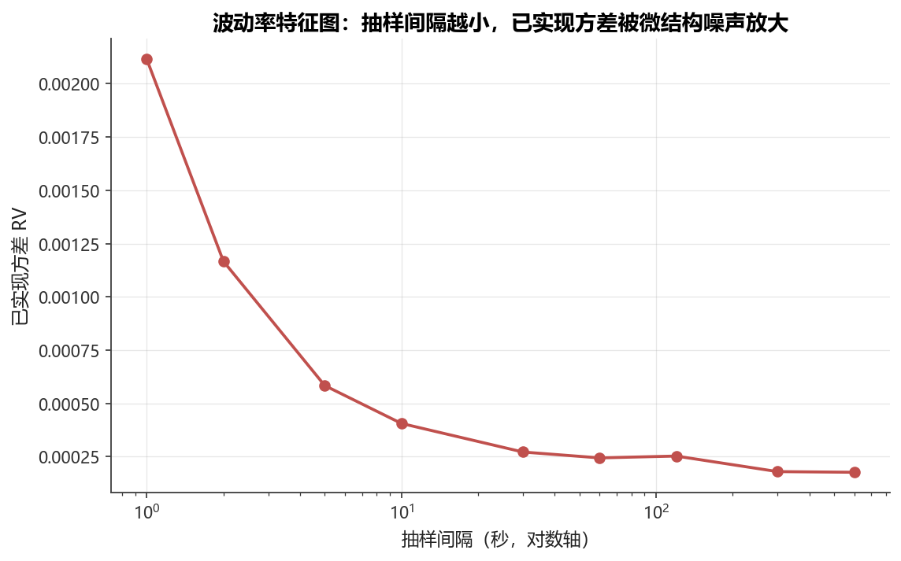

# 第15章 高频数据与市场微结构

[](https://colab.research.google.com/github/albertandking/financial-data-science/blob/main/notebooks/ch15_high_frequency.ipynb) [](https://mybinder.org/v2/gh/albertandking/financial-data-science/main?labpath=notebooks/ch15_high_frequency.ipynb)

!!! info "配套代码"
    本章示例可在配套示例 中运行。示例数据使用 `np.random.default_rng(15)` 生成的**合成日内数据**，无需真实 Level-2 数据源。离线即可完成。

---

## 15.1 本章导读

第1章曾提到，金融数据按频率可分为日频、日内分钟/秒级、逐笔成交与报价（Tick）以及订单簿快照等多个层次，并指出「高频数据的分析方法将在第15章专门介绍」。从日频迈向日内，不仅是抽样频率的提升，更是研究视角的根本转变：

- **体量**：单只股票一天的逐笔数据可达数万条，全市场一日全量数据往往超过数十 GB，远超一般机器的内存容量；
- **微结构噪声**：在极短时间尺度上，观测价格受买卖价差、订单流方向等市场微结构因素影响，叠加在“真实”价格信号之上，形成统计意义上可测量的噪声；
- **非线性时间**：高频数据的时间间隔不均匀——开盘与收盘前后成交密集，午间稀疏，不能简单套用等时间间隔的时间序列方法。

本章从市场微结构的基本概念出发，依次介绍限价订单簿、买卖价差、日内量价模式、bid-ask bounce 与已实现波动率，再讨论 VWAP/TWAP 等执行基准，以及中国市场的高频特点与数据工程挑战。**第17章**的回测成本建模将直接使用本章的执行成本框架。

!!! note "本章数据说明"
    所有代码示例均使用合成教学数据：随机游走价格、U 形日内成交量以及人工叠加的微结构噪声。真实高频分析需要 Level-2数据源（如上交所、深交所的逐笔数据，或第三方数据供应商接口）。

---

## 15.2 学习目标

读完本章，读者应能够：

1. 描述高频数据的层次结构（分钟棒、Tick、Level-2）及其规模量级；
2. 解释限价订单簿（LOB）的基本组成，理解买卖价差与市场深度的含义；
3. 描述日内成交量与波动率的典型「U 形」模式，解释其成因；
4. 理解 bid-ask bounce 产生高频收益**负自相关**的机制，用合成数据量化该效应；
5. 推导已实现波动率（RV）公式，解释「波动率特征图」（Signature Plot）及其对抽样频率选择的指导意义；
6. 计算 VWAP 与 TWAP，说明其在执行算法中的用途，并连接第17章的交易成本建模；
7. 归纳中国市场高频数据的特殊性：集合竞价、涨跌停、T+1等制度特征；
8. 描述高频数据工程的核心挑战：存储格式、异常清洗、对齐与回放。

---

## 15.3 什么是高频数据

### 15.3.1 数据层次

按时间粒度从粗到细，金融数据可分为以下层次：

| 层次 | 典型粒度 | 内容 | 单股单日条数（量级） |
|------|---------|------|-------------------|
| 日频 OHLCV | 1天 | 开高低收 + 成交量 | 1 |
| 分钟棒（K 线）| 1分钟 | OHLCV | ≈240（A股4小时） |
| Tick（逐笔成交） | 每笔成交 | 成交价、量、时间戳 | 数百～数万 |
| Level-2（快照） | 3秒或每笔 | 买卖各10档报价与量 | 数万 |
| 逐笔委托 | 每条报单 | 报单价量、方向、撤单 | 数十万 |

!!! tip "为什么关注 Level-2"
    A 股 Level-2行情包含买卖各10档挂单（委托量），是订单流分析、高频因子挖掘和微结构研究的主要数据源。相比仅有成交价的 Tick，Level-2提供了更丰富的供需信息。

### 15.3.2 数据规模

以 A 股市场为例：

- 全市场上市股票约5 000只；
- 每只股票的逐笔成交数据（Tick）单日可达1万～3万条；
- Level-2 10档快照按3秒间隔，单日约5 000条/只；
- **全市场单日原始数据总量：数十 GB**（Level-2全量）。

这一规模意味着：
1. 不可能将一年的高频数据全部加载到内存；
2. 需要列式存储（Parquet/Arrow）和按日分片的数据库；
3. 数据清洗与预处理本身就是一项重要的工程任务。

### 15.3.3 时间戳精度

| 市场 | 时间戳精度 | 备注 |
|------|-----------|------|
| A 股 Level-2 | 毫秒（ms） | 上交所、深交所均提供毫秒级 |
| 美股 TAQ | 纳秒（ns） | 交易所自身打戳 |
| 加密货币 | 毫秒～微秒 | 取决于交易所 API |

!!! warning "时间戳对齐陷阱"
    不同数据源的时间戳可能存在系统时钟偏差（clock skew）。在多数据源联合分析时，必须显式统一时区（UTC 或 Asia/Shanghai）并排查时间戳乱序。

---

## 15.4 市场微结构基础

### 15.4.1 限价订单簿

**限价订单簿（Limit Order Book，LOB）** 是撮合引擎维护的双向报价队列：

- **卖出挂单（Ask/Offer）**：愿意**卖出**的报价，从低到高排列；卖一（Ask₁）是最低卖价；
- **买入挂单（Bid）**：愿意**买入**的报价，从高到低排列；买一（Bid₁）是最高买价。

```
卖3  10.08   500
卖2  10.06   300
卖1  10.05   200      ← 卖一（最优卖价）
────────────────
买1  10.03   400      ← 买一（最优买价）
买2  10.01   600
买3  10.00   800
```

**中间价（Mid Price）**：$P_\text{mid} = \dfrac{P_\text{ask_1} + P_\text{bid_1}}{2}$，常用作「真实价格」的近似估计。

**市场深度**：各档位的挂单量之和，反映市场消化大单的能力。深度大的市场，执行大额订单对价格的冲击较小。

!!! example "例 15.1　限价订单簿撮合一笔市价单"
    沿用上面的订单簿快照，假设一名投资者提交一笔**买入800股**的市价单。撮合引擎会自下而上「吃掉」卖出方向的挂单队列，逐档成交直至数量满足：

    | 成交步骤 | 吃掉档位 | 成交价 | 成交量 | 该档金额 |
    |---------|---------|-------|-------|---------|
    | 第1笔 | 卖一 | 10.05 | 200 | 2 010 |
    | 第2笔 | 卖二 | 10.06 | 300 | 3 018 |
    | 第3笔 | 卖三 | 10.08 | 300 | 3 024 |
    | 合计 | —— | —— | 800 | 8 052 |

    成交后卖三档剩余 $500-300=200$ 股，卖一、卖二被完全清空，新的最优卖价变为10.08。

    这笔订单的**平均成交价**为 $8\,052 / 800 = 10.065$。若以撮合前的中间价 $P_\text{mid}=(10.05+10.03)/2=10.04$ 作为基准，则该笔大单的**实现冲击**为：

    $10.065 - 10.04 = 0.025 \quad(\text{约 } 0.025/10.04 \approx 24.9\text{ bp})$

    可见：当订单量超过卖一深度（200股）时，成交价会沿订单簿「爬坡」，越大的订单穿透越深的档位，平均成交价越不利。这正是「市场冲击」在微观层面的来源——它不是抽象参数，而是订单簿离散深度的直接后果。若买一档深度从200股增厚到1 000股，则同样的800股订单可在卖一单档成交，冲击降为零。

### 15.4.2 买卖价差与流动性

**买卖价差（Bid-Ask Spread）** 是衡量流动性最直接的指标：

$$
\text{名义价差} = P_\text{ask_1} - P_\text{bid_1}
$$

$$
\text{相对价差} = \frac{P_\text{ask_1} - P_\text{bid_1}}{P_\text{mid}}
$$

| 流动性水平 | 典型相对价差 | 示例 |
|-----------|-------------|------|
| 极高（蓝筹股） | < 0.05% | 沪深300成分股 |
| 中等（中小盘） | 0.1%～0.5% | 中证500成分股 |
| 低（小盘股） | > 1% | 微盘股、ST股 |

!!! note "流动性的多维度"
    买卖价差只是流动性的一个维度。完整的流动性度量还包括：深度（Depth）、弹性（Resiliency，冲击后价差恢复速度）和即时性（Immediacy，成交所需时间）。

### 15.4.3 做市商与订单流

**做市商（Market Maker）** 同时在买卖两侧挂出限价单，通过买卖价差赚取利润（做市收益），但承担**存货风险**：若价格持续单向运动，其库存头寸将产生亏损。

**知情交易者（Informed Trader）** 掌握私有信息，倾向于使用市价单快速成交，将信息“注入”价格；**噪声交易者（Noise Trader）** 则出于流动性需求随机交易。

**订单流毒性（Order Flow Toxicity）**：当知情交易者比例上升时，做市商持续被“逆向选择”，价差会被迫扩大作为补偿。Easley et al. 提出的 **PIN（Probability of Informed Trading）** 和 **VPIN（Volume-Synchronized PIN）** 是度量订单流毒性的经典指标。

### 15.4.4 做市商的盈亏拆解

为什么做市商既能稳定盈利、又会在剧烈行情中遭受重创？把做市收益拆成两项就能看清这对张力。设做市商在买一 $P_\text{bid_1}$ 挂买单、在卖一 $P_\text{ask_1}$ 挂卖单，每笔成交赚取「半价差」 $s/2$。在平稳市场中，买卖两侧成交概率大致对称，做市商每完成一次「买进—卖出」的来回，就赚取整条价差 $s$。这部分收益与成交笔数成正比，是做市的「面包与黄油」。

但价差收益的对立面是**存货风险**与**逆向选择**：

- **存货风险**：若价格单边上行，做市商的卖单被持续吃掉、买单无人问津，库存被动转为净空头，价格越涨亏损越大。这部分风险与价格方差 $\sigma^2$ 成正比；
- **逆向选择**：知情交易者只在对自己有利时成交，做市商与之对手的那一笔注定吃亏。价差收益本质上是向**噪声交易者**收取的「流动性服务费」，用以补偿被知情交易者「割」走的部分。

由此可以理解15.4.2节价差水平的成因：一只股票的均衡价差，恰好要使「向噪声交易者收取的价差收益」覆盖「被知情交易者逆向选择的预期损失」。这就解释了为什么**信息越不对称、波动越剧烈的股票价差越宽**——做市商必须索取更高的补偿。后文15.6节将证明，正是这条价差 $s$，在高频收益序列中留下了可被测量的统计指纹。

---

## 15.5 日内模式

<figure markdown>
  { width="680" }
  <figcaption>图15-1日内分钟价格与 U 形成交量（合成）</figcaption>
</figure>


### 15.5.1 U 形成交量

实证研究在全球主要市场发现，日内成交量呈现「**U 形**」（有时称「微笑形」）模式：

- **开盘阶段**（前30～60分钟）：隔夜积累的信息在开盘集中释放，成交量与波动率均处于全天峰值；
- **午间**：信息流减少，流动性提供者（做市商）主动撤单降低库存风险，成交量与价差均萎缩；
- **收盘阶段**（后30～60分钟）：指数成分股再平衡、基金申赎、收盘竞价等需求推动成交量回升至第二高峰。

下面用以下模型合成 U 形成交量：

```python
t = np.linspace(0, 1, n)
volume = (1.5 - np.sin(np.pi * t)) * 1000 + rng.normal(0, 60, n)
```

$\sin(\pi t)$ 在 $t=0.5$（午间）取最大值1，使成交量在午间最低；$t=0$ 与 $t=1$（开收盘）时 $\sin$ 为0，成交量达到 $1.5 \times 1000$。

### 15.5.2 U 形波动率

与成交量类似，**日内已实现波动率** 也呈 U 形分布，且与成交量高度正相关（Admati & Pfleiderer，1988）。其经济学解释：

1. 信息不对称在开盘最强，价格发现过程剧烈；
2. 开盘与收盘前后，机构投资者集中调仓，订单流定向冲击价格；
3. 午间信息量少，“公平价格”的不确定性降低，价格漂移减小。

### 15.5.3 隔夜跳空与集合竞价

**隔夜跳空**：从前一日收盘到次日开盘，价格往往出现不连续跳变（overnight gap）。对高频策略而言，隔夜持仓面临的风险与日内持仓性质完全不同，通常需要单独建模。

**集合竞价（Call Auction）**：A 股在每个交易日09:15–09:25进行开盘集合竞价，09:25–09:30为冻结期。成交量集中在集合竞价结束时刻，形成开盘价格。高频策略需显式区分集合竞价与连续竞价（09:30–15:00）两个交易阶段。

---

## 15.6 微结构噪声与 bid-ask bounce

### 15.6.1 观测价格与有效价格

设某资产的**有效价格**（Efficient Price）$m_t$ 服从随机游走：

$$
m_t = m_{t-1} + \varepsilon_t, \quad \varepsilon_t \sim \mathcal{N}(0, \sigma^2)
$$

**观测价格**（成交价）$p_t$ 在有效价格基础上叠加微结构噪声 $u_t$：

$$
p_t = m_t + u_t
$$

在最简单的模型中，$u_t = q_t \cdot s/2$，其中 $s$ 为买卖价差，$q_t \in \{-1, +1\}$ 表示成交方向（买方发起/卖方发起）。

### 15.6.2 bid-ask bounce 导致负自相关

设 $q_t$ 独立同分布，则观测收益 $r_t = p_t - p_{t-1}$ 的一阶自协方差为：

$$
\mathrm{Cov}(r_t, r_{t-1}) = -\frac{s^2}{4}
$$

这意味着：**买卖价差越大，高频收益的一阶自相关越负**。这是 Roll（1984）模型的核心结论，也称「Roll 隐含价差」：

$$
\hat{s} = 2\sqrt{-\mathrm{Cov}(r_t, r_{t-1})}
$$

??? note "推导：bid-ask bounce 为何产生 $-s^2/4$"
    假设有效价格 $m_t$ 在短窗口内近似不变（$m_t \approx m$），观测价 $p_t = m + q_t \cdot s/2$，其中成交方向 $q_t \in \{-1,+1\}$ 独立同分布且 $\Pr(q_t=+1)=\Pr(q_t=-1)=1/2$，故 $\mathbb{E}[q_t]=0$、$\mathbb{E}[q_t^2]=1$、$\mathbb{E}[q_t q_{t-1}]=0$。观测收益为：

    $r_t = p_t - p_{t-1} = \frac{s}{2}(q_t - q_{t-1})$

    其一阶自协方差为：

    $\mathrm{Cov}(r_t, r_{t-1}) = \frac{s^2}{4}\,\mathbb{E}\big[(q_t - q_{t-1})(q_{t-1} - q_{t-2})\big] = \frac{s^2}{4}\big(0 - \mathbb{E}[q_{t-1}^2] - 0 + 0\big) = -\frac{s^2}{4}$

    关键项是 $-\mathbb{E}[q_{t-1}^2]=-1$：相邻两笔收益**共享同一个 $q_{t-1}$**，且符号相反（$+q_{t-1}$ 出现在 $r_t$，$-q_{t-1}$ 出现在 $r_{t-1}$），这正是「价格在买价与卖价之间来回弹跳」制造负相关的数学本质。把 $\hat{s}=2\sqrt{-\mathrm{Cov}}$ 反解出来，即得 Roll 隐含价差估计量。

!!! example "例 15.2　bid-ask bounce 的数字推演"
    考虑一只有效价格几乎不动、固定价差 $s=0.04$ 的股票，连续6笔成交的方向序列为 $q = (+1, -1, +1, +1, -1, -1)$，半价差 $s/2 = 0.02$。设有效价格 $m=20.00$，则观测成交价与逐笔收益为：

    | 笔序 $t$ | $q_t$ | 观测价 $p_t = 20 + 0.02\,q_t$ | 收益 $r_t = p_t - p_{t-1}$ |
    |---------|------|------------------------------|---------------------------|
    | 1 | $+1$ | 20.02 | —— |
    | 2 | $-1$ | 19.98 | $-0.04$ |
    | 3 | $+1$ | 20.02 | $+0.04$ |
    | 4 | $+1$ | 20.02 | $0.00$ |
    | 5 | $-1$ | 19.98 | $-0.04$ |
    | 6 | $-1$ | 19.98 | $0.00$ |

    收益序列 $r = (-0.04, +0.04, 0, -0.04, 0)$ 在符号上呈现明显的「正—负」交替倾向：相邻收益 $(r_t, r_{t+1})$ 的4个配对为 $(-0.04,+0.04)$、$(+0.04,0)$、$(0,-0.04)$、$(-0.04,0)$，乘积之和为 $(-0.0016)+0+0+0 = -0.0016$，平均得样本一阶自协方差约 $-0.0016/4 = -0.0004$，为负。

    **与理论值对照**：Roll 模型预测 $\mathrm{Cov}(r_t, r_{t-1}) = -s^2/4 = -(0.04)^2/4 = -0.0016/4 = -0.0004$。本例样本量虽小，所得 $-0.0004$ 竟与理论值吻合。代入 Roll 隐含价差公式：

    $\hat{s} = 2\sqrt{-\mathrm{Cov}(r_t, r_{t-1})} = 2\sqrt{0.0004} = 2 \times 0.02 = 0.04$

    准确还原了真实价差 $s=0.04$。这个「玩具」例子展示了机制的核心：**正是相邻收益共享同一个方向变量 $q_{t-1}$（一进一出、符号相反），制造出可被测量的负自协方差**。在真实数据中，有效价格本身也在随机游走（$\sigma_m>0$），会稀释这一效应，使样本估计在小样本下出现波动；只有当成交笔数足够大、$q_t$ 接近独立同分布时，估计才稳定收敛——这一点在习题1的合成实验中会得到验证。

用合成数据可直接验证：固定价差 $s=0.02$，生成观测成交价，计算高频收益的一阶自相关，可观察到显著的负值，而底层有效价格收益（随机游走）本应自相关接近于零。

!!! warning "分析高频因子时的误区"
    直接用逐笔成交价的涨跌幅构造动量因子，会因 bid-ask bounce 引入**人为的反转信号**，与真实价格动量混淆。正确做法是先用中间价（mid-price）或对观测价做价差修正。

### 15.6.3 价差扩大时自相关的变化

作为延伸练习，可将价差翻倍，验证一阶自相关更负。下面给出一段参考解答：

```python
for sp in (0.02, 0.04):
    tr = price + rng.choice([-1, 1], n) * sp / 2
    r = np.diff(np.log(tr))
    print(f'价差={sp}: 一阶自相关 = {np.corrcoef(r[:-1], r[1:])[0, 1]:.3f}')
```

理论预期：当 $s$ 从0.02翻倍到0.04，一阶自相关的绝对值大约翻4倍（因为 $s^2/4$ 是关于 $s^2$ 的函数）。

---

## 15.7 已实现波动率与抽样频率

<figure markdown>
  { width="680" }
  <figcaption>图15-2波动率特征图：抽样越密，微结构噪声越放大 RV</figcaption>
</figure>


### 15.7.1 已实现波动率的定义

设一个交易日被划分为 $M$ 个等长子区间，第 $i$ 个子区间的对数收益率为 $r_i = \ln(P_i/P_{i-1})$，则**已实现波动率（Realized Volatility，RV）** 定义为：

$$
RV = \sum_{i=1}^{M} r_i^2
$$

当 $M \to \infty$（连续极限）且不存在微结构噪声时，RV 依概率收敛于积分二次变差（Integrated Variance），是真实波动率的一致估计量（Andersen & Bollerslev，1998；Barndorff-Nielsen & Shephard，2002）。

### 15.7.2 微结构噪声对 RV 的影响

引入微结构噪声 $u_t$ 后，RV 不再是纯粹的价格波动估计：

$$
RV_\text{obs} \approx RV_\text{true} + \underbrace{2M \cdot \sigma_u^2}_{\text{噪声偏差项}}
$$

当抽样频率 $M$ 增大时，噪声偏差项线性增长，导致 $RV_\text{obs}$ 系统性高估真实波动率。

??? note "推导：噪声偏差为何是 $2M\sigma_u^2$（即 $2n\sigma_\epsilon^2$）"
    设观测价 $p_i = m_i + u_i$，噪声 $u_i$ 独立同分布、$\mathbb{E}[u_i]=0$、$\mathrm{Var}(u_i)=\sigma_u^2$，且与有效价格独立。则第 $i$ 个区间的观测收益为：

    $r_i^\text{obs} = (m_i - m_{i-1}) + (u_i - u_{i-1}) = r_i^\text{true} + (u_i - u_{i-1})$

    对其平方取期望，交叉项因独立而消失：

    $\mathbb{E}[(r_i^\text{obs})^2] = \mathbb{E}[(r_i^\text{true})^2] + \mathbb{E}[(u_i - u_{i-1})^2] = \mathbb{E}[(r_i^\text{true})^2] + 2\sigma_u^2$

    其中 $\mathbb{E}[(u_i-u_{i-1})^2]=\mathrm{Var}(u_i)+\mathrm{Var}(u_{i-1})=2\sigma_u^2$（噪声差分的方差）。对 $M$ 个区间求和：

    $\mathbb{E}[RV_\text{obs}] = \underbrace{\mathbb{E}[RV_\text{true}]}_{\text{随 }M\text{ 收敛到积分方差}} + \underbrace{2M\sigma_u^2}_{\text{随 }M\text{ 线性发散}}$

    这就是偏差项 $2M\sigma_u^2$（若以采样点数 $n=M$、噪声标准差 $\sigma_\epsilon=\sigma_u$ 记之，即 $2n\sigma_\epsilon^2$）的来源。关键在于：**真实部分随 $M$ 增大趋于常数（积分方差），而噪声部分随 $M$ 线性增长**——抽样越密，噪声越占主导。这正是波动率特征图在高频端「翘起」的根本原因。

### 15.7.3 波动率特征图

**波动率特征图（Volatility Signature Plot）** 以抽样间隔为横轴、RV 为纵轴，揭示了两种相互竞争的误差：

| 抽样越密 | 抽样越疏 |
|---------|---------|
| 微结构噪声放大 RV ↑ | 丢失日内波动信息，RV ↓ |
| 主要误差：噪声偏差 | 主要误差：离散化误差 |

最优抽样频率位于两种误差的「折中点」，实务中通常取 **5分钟**（约 $M=78$，美股；A 股约 $M=48$）。

!!! example "例 15.3　同一序列在不同抽样频率下的 RV 对比"
    设某股票一个交易日的有效价格真实方差为 $RV_\text{true}=0.0001$（即真实日波动率约 $\sqrt{0.0001}=1\%$），每个采样点的微结构噪声方差 $\sigma_u^2 = 1\times 10^{-7}$。A 股一日连续竞价约 $4$ 小时 $=14\,400$ 秒。用偏差公式 $\mathbb{E}[RV_\text{obs}] = RV_\text{true} + 2M\sigma_u^2$ 估算不同抽样间隔下的观测 RV：

    | 抽样间隔 | 区间数 $M$ | 噪声偏差 $2M\sigma_u^2$ | $RV_\text{obs}$ | 相对真实值高估 |
    |---------|-----------|------------------------|-----------------|--------------|
    | 1秒 | 14 400 | $2.88\times10^{-3}$ | 0.002 98 | +2 880% |
    | 5秒 | 2 880 | $5.76\times10^{-4}$ | 0.000 676 | +576% |
    | 30秒 | 480 | $9.6\times10^{-5}$ | 0.000 196 | +96% |
    | 1分钟 | 240 | $4.8\times10^{-5}$ | 0.000 148 | +48% |
    | 5分钟 | 48 | $9.6\times10^{-6}$ | 0.000 110 | +9.6% |
    | 30分钟 | 8 | $1.6\times10^{-6}$ | 0.000 102 | +1.6% |

    逐秒抽样把波动率高估了近30倍——RV 几乎全部由噪声贡献，真实信号被淹没。随着间隔拉长，噪声偏差以 $1/M$ 的速度迅速衰减：5分钟时高估已降到约10%，30分钟时几乎无偏。

    但这并不意味着「越疏越好」。本例假设有效价格方差不随 $M$ 变化（这是简化），现实中过疏的抽样会丢失日内波动结构、增大估计的**采样方差**（每天只剩几个点，估计极不稳定）。综合**噪声偏差**（偏向高频端恶化）与**采样方差**（偏向低频端恶化），5分钟成为业界的经验折中点：它把噪声偏差压到个位数百分比，同时仍保留约48个日内区间以维持估计精度。这就是「为何5分钟」的定量回答。

用23 400秒（6.5小时）的合成数据绘制特征图，可清晰看到：逐秒（间隔1秒）的 RV 显著高于5分钟（300秒）的 RV，而后者更接近有效价格的真实方差。

!!! tip "Subsampling 与两次清洗估计量"
    Zhang et al.（2005）提出 **Two-Scale Realized Volatility（TSRV）** 估计量，通过多个错开的稀疏子采样序列的平均来同时抵消噪声偏差与离散化误差，在实践中优于简单的5分钟RV。

### 15.7.4 已实现波动率的扩展

| 估计量 | 公式（简写）| 优点 |
|--------|-----------|------|
| 简单 RV | $\sum r_i^2$ | 计算简单 |
| 双幂变差（BPV） | $\sum \lvert r_i \rvert \cdot \lvert r_{i+1} \rvert$ | 对跳跃鲁棒 |
| TSRV | 双尺度平均 | 噪声一致估计 |
| BNHLS kernel | 核函数加权 | 噪声+非同步最优 |

---

## 15.8 执行与交易成本

### 15.8.1 执行成本的构成

实际交易成本可分为三类：

$$
\text{总成本} = \underbrace{\text{佣金}}_{\text{显性}} + \underbrace{\text{买卖价差} + \text{市场冲击}}_{\text{隐性（微结构）}} + \underbrace{\text{机会成本}}_{\text{时间延迟}}
$$

| 成本类型 | 说明 | A股典型量级 |
|---------|------|-----------|
| 佣金 | 经纪商收取 | 万分之3～5 |
| 印花税 | 卖出方向单边 | 千分之1 |
| 买卖价差 | 穿越买一/卖一的成本 | 万分之5～50 |
| 市场冲击 | 大单推动价格不利移动 | 取决于订单大小与流动性 |

### 15.8.2 VWAP 与 TWAP

**成交量加权平均价（VWAP，Volume-Weighted Average Price）**：

$$
\text{VWAP} = \frac{\sum_{i=1}^{N} P_i \cdot V_i}{\sum_{i=1}^{N} V_i}
$$

**时间加权平均价（TWAP，Time-Weighted Average Price）**：

$$
\text{TWAP} = \frac{1}{N} \sum_{i=1}^{N} P_i
$$

下面用合成日内数据计算这两个基准值。VWAP 偏向成交量大的时段（开收盘），TWAP 对各时段等权。

!!! example "例 15.4　VWAP 与 TWAP 的手算对比"
    某股票一日分5个时段成交，价格与成交量（手）如下表。注意成交量在开盘（时段1）和收盘（时段5）显著放大，呈典型 U 形：

    | 时段 | 价格 $P_i$ | 成交量 $V_i$（手） | $P_i \cdot V_i$ |
    |------|-----------|-------------------|-----------------|
    | 1（开盘）| 10.20 | 4 000 | 40 800 |
    | 2 | 10.10 | 1 000 | 10 100 |
    | 3（午间）| 10.00 | 500 | 5 000 |
    | 4 | 10.05 | 1 000 | 10 050 |
    | 5（收盘）| 10.30 | 3 500 | 36 050 |
    | 合计 | —— | 10 000 | 102 000 |

    **TWAP**（各时段等权，对价格直接取算术平均）：

    $\text{TWAP} = \frac{10.20+10.10+10.00+10.05+10.30}{5} = \frac{50.65}{5} = 10.13$

    **VWAP**（按成交量加权）：

    $\text{VWAP} = \frac{\sum P_i V_i}{\sum V_i} = \frac{102\,000}{10\,000} = 10.20$

    两者相差 $10.20 - 10.13 = 0.07$（约69 bp）。VWAP 高于 TWAP，原因一目了然：成交量集中的开盘（10.20）与收盘（10.30）价格偏高，VWAP 对这两个高价高量时段赋予更大权重，而 TWAP 把午间的低价（10.00）与高价时段同等对待。

    **实务含义**：一个被动执行的算法若以 VWAP 为基准，意味着它要在全天「按市场成交量的节奏」分批下单——成交量大的时段多买、成交量小的时段少买，从而使自己的平均成交价贴近10.20。若错误地采用 TWAP 式匀速下单，则会在午间低量时段「买得过多」，反而偏离市场主流成交价。这就是为什么大额被动委托普遍以 VWAP 而非 TWAP 为绩效标尺。

!!! example "例 15.5　买卖价差的交易成本估算（往返成本占比）"
    某投资者计划买入再卖出一只股票，做一次完整的「往返」交易。已知：中间价 $P_\text{mid}=10.00$，名义价差 $s=0.02$（相对价差 $0.02/10.00 = 20$ bp），单边佣金万分之3，印花税千分之1（仅卖出单边）。

    **买入端**：以卖一价成交，付出半价差 $s/2 = 0.01$，相对中间价多付 $0.01/10.00 = 10$ bp；加佣金3 bp，买入成本 $=10 + 3 = 13$ bp。

    **卖出端**：以买一价成交，再付半价差 $10$ bp；加佣金3 bp、印花税10 bp，卖出成本 $=10 + 3 + 10 = 23$ bp。

    **往返总成本**：

    | 成本项 | 买入 | 卖出 | 合计 |
    |--------|------|------|------|
    | 价差（半价差×2）| 10 bp | 10 bp | 20 bp |
    | 佣金 | 3 bp | 3 bp | 6 bp |
    | 印花税 | —— | 10 bp | 10 bp |
    | 小计 | 13 bp | 23 bp | **36 bp** |

    一次往返合计约 $36$ bp $=0.36\%$。这意味着：策略必须先赚到 $0.36\%$ 的毛收益才能保本。对一个预测胜率55%、平均盈亏比1:1的高频策略，单笔期望毛收益若只有 $0.2\%$，扣除 $0.36\%$ 成本后净期望为负——**策略在纸面上盈利、在实盘中亏损**，根源正在于此。这定量地解释了为什么高频策略对成本极度敏感、为什么换手率必须被严格约束（详见第17章回测成本建模）。

| 指标 | 适用场景 | 计算基准 | 特点 |
|------|---------|---------|------|
| VWAP | 被动执行基准、绩效评估 | 全天成交量加权均价 | 与市场均衡价格对齐，大单首选 |
| TWAP | 小流动性市场、匀速拆单 | 各时段等权均价 | 减少时间集中度，实现简单 |
| IS（实施缺口）| 主动执行评估 | 决策时刻价 vs 实际成交价 | 含机会成本与延迟成本，最贴近真实损益 |

### 15.8.3 最优执行与拆单策略

**市场冲击（Market Impact）** 模型的核心假设：在单位时间内执行的订单量越大，价格的不利移动越大：

$$
\text{冲击成本} \propto \left(\frac{Q_\text{exec}}{V_\text{market}}\right)^\gamma
$$

其中 $Q_\text{exec}$ 为执行量，$V_\text{market}$ 为市场成交量，$\gamma \in (0.5, 1)$ 为市场冲击指数。

**Almgren-Chriss（2001）最优执行框架**将市场冲击与时间风险做显式权衡：

- **激进执行**（快速完成）：减少暴露时间，但冲击成本高；
- **被动执行**（慢速拆单）：降低冲击，但价格在等待期间可能继续不利移动（时间风险）。

最优策略为按时间的「弧形」调度，详见第17章的回测成本建模。

!!! note "与第17章的联系"
    第17章的向量化回测框架采用简化的线性冲击成本模型。本节提供的 VWAP/TWAP 基准和 Almgren-Chriss 框架是更精细成本建模的理论基础。在研究高换手率策略时，忽略执行成本往往导致策略在实盘中大幅跑输回测。

---

## 15.9 中国市场高频特点

### 15.9.1 数据层次与制度特征

A 股高频数据与美股存在若干重要差异：

| 特征 | A 股 | 美股（参考） |
|------|-----|------------|
| 主要高频数据 | Level-2（10档快照 + 逐笔）| TAQ（成交 + 报价）|
| 交易时段 | 09:30–11:30；13:00–15:00 | 09:30–16:00（含盘前/盘后）|
| 集合竞价 | 开盘（09:15–09:25）、收盘（14:57–15:00）| 开收盘均有 |
| 涨跌停板 | ±10%（ST 股 ±5%，科创板 ±20%）| 无（熔断机制）|
| 交割规则 | T+1（当日买入不可当日卖出）| T+2（股票）|
| 做空限制 | 严格（需融券，券池有限）| 相对宽松 |

### 15.9.2 涨跌停对高频策略的影响

**价格封板**：当股价触及涨停（或跌停）时，订单簿单侧清空，流动性骤降。高频模型在封板后无法正常估计价差与冲击成本。实务中需要：

1. 在因子计算前过滤涨跌停状态的 Tick；
2. 识别「一字板」（开盘即封板）：这类股票的高频数据几乎无意义；
3. 在回测中禁止在涨停板买入、跌停板卖出。

### 15.9.3 T+1 对日内策略的制约

T+1规则使 A 股**不存在真正意义上的纯日内做空策略**（当日买入不可当日卖出）。与美股日内交易相比：

- 无法在日内快速反转头寸以锁定利润；
- 隔夜持仓不可避免，日内开仓的风险管理复杂度上升；
- 因子换手率的上限受到约束。

!!! tip "量化自营与融券"
    持有融券额度的量化机构可以通过先借券卖出、当日平仓的方式实现类「日内做空」，但融券成本（约6%～15%/年）和券池限制使这一策略的使用门槛较高。

### 15.9.4 逐笔委托与撤单

A 股 Level-2数据提供**逐笔委托**（含报单、撤单、成交三类事件）。撤单率是重要的微结构特征：

- **高撤单率** 往往暗示机构报单试探（Quote Stuffing）或算法拆单；
- 撤单数据可用于构造**订单流失衡（Order Flow Imbalance，OFI）**因子，该因子被证实对短期价格方向有预测能力（Cont et al.，2014）。

### 15.9.5 A 股案例：Level-2 十档、集合竞价与 T+1 如何共同塑造日内策略

把前述制度特征落到一只具体股票上，能更直观地看到 A 股高频研究与美股的差异。设想对一只沪市主板蓝筹股（如600000.SH）用上交所 Level-2数据构建一个「开盘动量」日内策略，会接连撞上三道制度约束：

**一、集合竞价决定起跑线。** 该股09:15–09:25进行开盘集合竞价，撮合系统按「最大成交量」原则一次性撮合出开盘价；09:25时 Level-2快照会显示一个集中成交的巨量。策略**不能用集合竞价段的逐笔数据计算价差或 bid-ask bounce**——这一阶段没有连续撮合，价格不是在买卖价之间弹跳，而是由竞价机制一次性出清。因此特征计算必须从09:30连续竞价开始，把09:15–09:30单独作为「开盘信息」处理。一个常见做法是用集合竞价的未匹配委托量（十档挂单的买卖失衡）预测开盘后5分钟的方向。

**二、十档快照提供供需全景，但需对齐到3秒网格。** 上交所 Level-2以约3秒间隔推送买卖各十档的价量快照。假设09:30:03的快照显示买一至买三合计挂单12万股、卖一至卖三合计4万股，则买卖深度比 $12/4 = 3$，是一个强烈的买方失衡信号，可据此构造 OFI 因子。但十档数据的**时间戳是3秒一帧**，与逐笔成交（毫秒级）频率不同，联合分析时必须显式对齐（参见15.10.3的重采样），否则会把不同时刻的快照与成交错配。

**三、T+1把日内策略「锁」成隔夜策略。** 即便开盘动量信号在09:35给出明确的买入提示、且股价在午盘已上涨1.5%，由于 T+1规则，**当日买入的股票当日不可卖出**。这条策略实际上无法在日内兑现利润，所谓「日内动量」最终被迫变成「持有到次日开盘」的隔夜策略——而隔夜要承担跳空风险（15.5.3节）。这与美股可在同一日内反复开平仓的纯日内交易形成本质区别。若该机构持有融券额度，可改为先融券卖出、尾盘买券归还，绕开 T+1实现类日内做空；但融券券池对蓝筹股之外的标的往往不可得，且年化成本6%～15%，使该路径仅对少数大盘股可行。

**小结**：同样一段「开盘十档失衡 → 预测日内方向」的逻辑，在美股是一个可即时兑现的纯日内策略，在 A 股则受集合竞价（特征起点）、3秒快照（对齐粒度）与 T+1（兑现约束）三重制度过滤，最终演化为一个隔夜方向性策略。脱离这些制度细节直接照搬美股高频文献的结论，是 A 股量化研究中常见的陷阱。

---

## 15.10 数据工程与挑战

### 15.10.1 存储格式

| 格式 | 优点 | 适用场景 |
|------|------|---------|
| CSV | 人类可读、通用 | 小数据集、调试 |
| Parquet（列式）| 压缩比高、按列读取快 | 大规模高频数据 |
| HDF5 | 支持多维数组、随机访问 | 时间序列分析 |
| KDB+/Q | 专为时序优化 | 生产级高频系统 |

**推荐做法**：用 Parquet 按日期分片存储，每个文件对应一只股票一天的数据。读取时用 `pandas.read_parquet` 加 `filters` 参数实现按列/行条件筛选，避免全量加载。

```python
# 示例：只读取特定股票和日期
df = pd.read_parquet(
    'data/tick/',
    filters=[('stock', '=', '600000.SH'), ('date', '=', '2024-01-02')]
)
```

### 15.10.2 异常 Tick 清洗

真实 Tick 数据中常见的异常类型：

| 异常类型 | 典型表现 | 处理方式 |
|---------|---------|---------|
| 错单（Fat Finger）| 价格偏离当前价20%+ | 设阈值过滤，或用前后价格内插 |
| 时间戳乱序 | 后一条 Tick 时间早于前一条 | 排序后去重 |
| 零成交量 | 成交量为0 | 剔除 |
| 重复条目 | 同一时间戳重复出现 | 去重（保留第一条或均值） |
| 价格跳跃（真实）| 跳空或涨跌停触发 | 区别对待，不可过度过滤 |

!!! warning "过度清洗的代价"
    过于激进的过滤规则（如剔除所有涨跌超过3% 的 Tick）会错误地移除真实的价格跳跃事件，在波动率估计和跳跃检测中引入下偏偏差（downward bias）。

### 15.10.3 对齐与重采样

**等时间间隔重采样（Time-Based Resampling）**：将不等间隔 Tick 数据聚合为1分钟、5分钟等均匀时间棒：

```python
# 将 Tick 数据重采样为 1 分钟 OHLCV
ohlcv = tick_df.resample('1min').agg({
    'price': ['first', 'max', 'min', 'last'],
    'volume': 'sum'
})
```

**按成交量重采样（Volume Bar）**：每累积固定成交量生成一根 Bar，使得高活跃期的 Bar 更密集，低活跃期更稀疏，统计性质优于等时间 Bar（López de Prado，2018）。

### 15.10.4 历史数据回放

**Tick 回放（Replay）** 是策略开发中的关键步骤：在离线环境中按原始时间顺序重现数据流，模拟实盘的事件驱动逻辑：

1. 按时间戳排序所有事件（Tick、报单、成交、行情快照）；
2. 逐事件推送给策略逻辑；
3. 策略的报单、撤单操作被纳入模拟订单簿。

主流回放框架：vnpy（国内）、Nautilus Trader（国际开源）、自研事件循环。

### 15.10.5 计算成本

| 操作 | 数据量 | 典型耗时 |
|------|-------|---------|
| 读取单股单日 Tick（Parquet）| ~10 MB | <1秒 |
| 全市场单日 Level-2重采样 | ~50 GB | 数分钟（多进程）|
| 一年全量因子计算（分布式）| ~10 TB | 数小时（集群）|

实务中常用 **Dask**、**Ray** 或 **Spark** 做分布式并行计算；GPU 加速（cuDF）在需要实时处理的场景下也日益普及。

---

## 15.11 本章小结

本章沿“数据 → 结构 → 统计 → 成本 → 工程”的主线介绍了高频数据与市场微结构。学完后，建议按以下三层来掌握：

**必须掌握**

1. **数据层次**：从分钟棒到 Level-2，粒度越细，数据量越大、噪声越重。
2. **订单簿与价差**：限价订单簿是价格发现核心，买卖价差直接反映流动性成本。
3. **高频统计特征**：bid-ask bounce、已实现波动率和抽样频率权衡，是高频研究的基本概念。

**理解即可**

4. **执行成本**：VWAP / TWAP 是执行评价的常用基准，Almgren-Chriss 提供了拆单优化框架。
5. **中国市场制度**：涨跌停、T+1、集合竞价等规则会显著影响高频策略设计与数据解释。
6. **数据工程**：Parquet、异常清洗、重采样、回放等是把高频研究真正做下去的基础设施。

**实践提醒**

高频研究里最大的敌人往往不是“模型不够复杂”，而是噪声、成本和制度摩擦。忽略它们，策略很容易从一开始就建立在错误信号上。

---

## 15.12 习题

!!! note "使用建议"
    建议按“微结构统计 → 成本估算 → 数据工程”顺序完成本章习题。若是本科主线课程，可重点完成 1、2、3、4 题；第 5 题更适合作为高频数据处理练习。

### 微结构统计

**习题15.1**：在 bid-ask bounce 演示代码中，将买卖价差从0.02扩大到0.04，重新计算观测成交价收益的一阶自相关。与理论预测（自相关绝对值增大约4倍）相比，数值结果是否一致？尝试给出解释。

> **参考思路**：Roll（1984）模型给出 $\mathrm{Cov}(r_t, r_{t-1}) = -s^2/4$，自相关系数 $\rho_1 \approx -s^2/4\sigma_m^2$（$\sigma_m^2$ 为有效价格方差）。$s$ 翻倍则 $\rho_1$ 绝对值约变为4倍；若合成数据中有效价格方差远大于价差平方，实际倍数可能稍偏离4倍。

**习题15.2**：对合成的秒级数据，分别用间隔1秒、10秒、60秒、300秒（5分钟）计算 RV，并与有效价格的真实积分方差对比。哪个抽样间隔的 RV 估计最接近真实方差？

> **参考思路**：逐秒 RV 因微结构噪声大幅高于真实方差；300秒（5分钟）在噪声偏差与离散化误差之间取得较好折中。可绘制简单折线图直观比较。

**习题15.3**：解释为什么在 A 股中直接用逐笔成交价的「涨跌幅」构造短期动量因子可能产生反转信号，而非真实的价格动量。应如何修正？

> **参考思路**：bid-ask bounce 使高频收益出现负一阶自相关，短期动量因子会将这种统计伪影识别为「反转」。修正方式：使用中间价（而非成交价）；或对成交价施加滚动价差修正；或选取足够低的换手频率（日度及以上）以使噪声均值回归。

### 成本估算

**习题15.4**：对于一只相对价差为0.2%、单日成交额为5亿元的 A 股，若需在一天内完成500万元的买入执行，估算穿越买卖价差的显性成本，并说明为何市场冲击成本往往更不可忽视。

> **参考思路**：穿越价差的成本 = $500 \times 0.2\% = 1$ 万元。执行量占日成交额的1%，若采用冲击模型 $\text{冲击} \propto (Q/V)^{0.5}$，冲击成本在流动性适中的市场通常在数个基点（bp）量级，随执行比例上升而迅速增加，当 $Q/V$ 超过5%～10% 后往往超过价差本身。

### 数据工程

**习题15.5**：列举3种 A 股 Level-2数据中常见的异常 Tick 类型，并为每种类型设计一条简洁的 pandas 过滤规则（用代码或伪代码描述）。

> **参考思路**：
>
> - 错单：`df = df[df['price'].between(df['price'].shift().ewm(span=5).mean() * 0.9, df['price'].shift().ewm(span=5).mean() * 1.1)]`；
> - 零成交量：`df = df[df['volume'] > 0]`；
> - 时间戳乱序：`df = df.sort_values('time').drop_duplicates(subset='time', keep='first')`。

---

## 15.13 拓展阅读

**市场微结构理论**

- O'Hara, M. (1995). *Market Microstructure Theory*. Blackwell. 微结构领域的奠基教材，系统论述信息不对称、做市商行为与价格发现。
- Hasbrouck, J. (2007). *Empirical Market Microstructure*. Oxford University Press. 理论与实证并重，重点介绍 Tick 数据分析方法，附带 RATS 代码。

**高频统计**

- Aït-Sahalia, Y. & Jacod, J. (2014). *High-Frequency Financial Econometrics*. Princeton University Press. 已实现波动率估计量的严格数学处理，含 RV、BPV、TSRV 等。
- Andersen, T. G., Bollerslev, T., Diebold, F. X. & Labys, P. (2001). The distribution of realized exchange rate volatility. *JASA*, 96(453), 42–55. 已实现波动率实证研究的经典论文。
- Zhang, L., Mykland, P. A. & Aït-Sahalia, Y. (2005). A tale of two time scales: Determining integrated volatility with noisy high-frequency data. *JASA*, 100, 1394–1411. TSRV 估计量的原始论文。

**最优执行**

- Almgren, R. & Chriss, N. (2001). Optimal execution of portfolio transactions. *Journal of Risk*, 3, 5–39. 最优执行的数学框架，冲击成本与时间风险权衡的标准参考。
- Kissell, R. (2013). *The Science of Algorithmic Trading and Portfolio Management*. Academic Press. 面向实践的算法交易教材，覆盖 VWAP/TWAP/IS 算法实现。

**订单流与因子**

- Cont, R., Kukanov, A. & Stoikov, S. (2014). The price impact of order book events. *Journal of Financial Econometrics*, 12(1), 47–88. 订单流失衡（OFI）因子的学术来源。
- López de Prado, M. (2018). *Advances in Financial Machine Learning*. Wiley. 第2章「金融数据结构」详细介绍 Volume Bar、Dollar Bar 等高频重采样方法。

**中国高频数据**

- 上海证券交易所市场质量报告（年度）：包含流动性、成交量分布、集合竞价等统计数据，免费公开。
- 深圳证券交易所 Level-2数据说明文档：逐笔成交与委托数据格式规范的权威参考。


