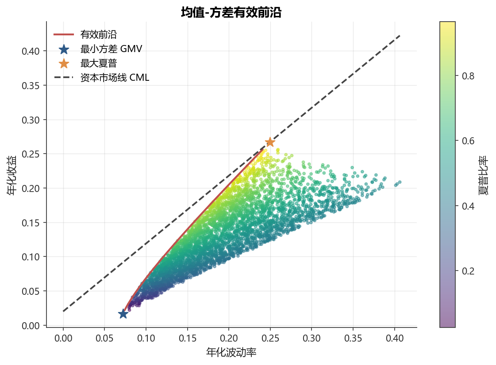

# 第16章 投资组合优化

[](https://colab.research.google.com/github/albertandking/financial-data-science/blob/main/notebooks/ch16_portfolio_optimization.ipynb) [](https://mybinder.org/v2/gh/albertandking/financial-data-science/main?labpath=notebooks/ch16_portfolio_optimization.ipynb)

!!! info "配套代码"
    本章示例可在配套 notebook 中运行，主要使用 scipy.optimize，离线即可完成。

---

## 16.1 本章导读

> “不要把鸡蛋放在同一个篮子里。”——这句朴素的谚语背后，隐藏着严谨的数学框架。

1952年，哈里·马科维茨（Harry Markowitz）在其博士论文中首次用均值-方差框架把“分散投资”量化成一个可求解的优化问题，开创了现代组合理论（Modern Portfolio Theory，MPT）。本章以 A 股示例数据为载体，系统讲授：

1. **组合的期望收益与风险**如何由权重向量决定；
2. **均值-方差有效前沿**的推导与数值求解；
3. **引入无风险资产**后资本市场线（CML）与切点组合的出现；
4. **约束条件**（禁止做空、权重上限）对前沿形态的影响；
5. **协方差矩阵的估计问题**与 Ledoit-Wolf 收缩方案；
6. **等权与风险平价**策略的直觉与实现。

!!! warning "数学准备"
    本章需要线性代数基础（矩阵乘法、二次型）和初步的凸优化概念。若尚不熟悉，建议先回顾附录A的矩阵符号约定。

---

## 16.2 学习目标

完成本章后，读者应能：

- 用矩阵公式计算组合期望收益 $\mu_p$ 与组合方差 $\sigma_p^2$；
- 使用 `scipy.optimize.minimize` 数值求解全局最小方差（GMV）组合与最大夏普组合；
- 绘制有效前沿、标注 GMV 与切点组合，添加资本市场线（CML）；
- 对比无约束、禁止做空两种设定下有效前沿的变化；
- 用 Ledoit-Wolf 收缩估计器替换样本协方差，观察对优化结果的影响；
- 理解等权基准与风险平价策略的核心差异。

---

## 16.3 组合收益与风险

### 16.3.1 符号约定

设市场有 $N$ 只资产，我们用以下符号：

| 符号 | 含义 |
|------|------|
| $w \in \mathbb{R}^N$ | 权重向量，$w_i$ 表示第 $i$ 只资产的投资比例 |
| $\mathbf{1}$ | 全1列向量，满足约束 $w^\top \mathbf{1} = 1$ |
| $\mu \in \mathbb{R}^N$ | 各资产期望（年化）收益率向量 |
| $\Sigma \in \mathbb{R}^{N\times N}$ | 资产收益率协方差矩阵（正定对称） |
| $r_f$ | 无风险利率（年化） |

### 16.3.2 组合期望收益

设各资产日收益率为随机向量 $\mathbf{r} = (r_1,\ldots,r_N)^\top$，组合收益率为：

$$
r_p = w^\top \mathbf{r} = \sum_{i=1}^N w_i r_i
$$

对期望取线性性质：

$$
\boxed{\mu_p = \mathbb{E}[r_p] = w^\top \mu = \sum_{i=1}^N w_i \mu_i}
$$

直觉：组合的期望收益是各资产期望收益的**加权平均**，权重就是资金比例。

### 16.3.3 组合方差（风险）

$$
\sigma_p^2 = \mathrm{Var}(w^\top \mathbf{r}) = w^\top \Sigma w
$$

展开为双重求和：

$$
\boxed{\sigma_p^2 = \sum_{i=1}^N \sum_{j=1}^N w_i w_j \sigma_{ij}}
$$

其中 $\sigma_{ij} = \mathrm{Cov}(r_i, r_j)$，当 $i=j$ 时即各资产方差 $\sigma_i^2$。

!!! note "分散化效应"
    当资产之间相关系数 $\rho_{ij} < 1$ 时，组合方差 $\sigma_p^2 < \sum_i w_i^2\sigma_i^2$，即**分散化降低风险**。相关性越低，降险效果越显著。

**数值示例**（两资产情形，$w_1=0.6,\ w_2=0.4$）：

$$
\sigma_p^2 = w_1^2\sigma_1^2 + w_2^2\sigma_2^2 + 2w_1w_2\rho_{12}\sigma_1\sigma_2
$$

若 $\sigma_1=0.20,\ \sigma_2=0.25,\ \rho_{12}=0.3$：

$$
\sigma_p^2 = 0.36\times0.04 + 0.16\times0.0625 + 2\times0.6\times0.4\times0.3\times0.05
= 0.0144 + 0.01 + 0.0072 = 0.0316 \implies \sigma_p \approx 17.8\%
$$

单独持有两只资产的波动率分别为20% 和25%，组合后降至17.8%，体现分散化效益。

### 16.3.4 分散化为何降低方差：推导与极端情形

为了把“分散化降低风险”从口号变成定理，我们对两资产组合方差做一次完整的代数推导，再考察几个极端情形，读者就能彻底理解相关系数 $\rho$ 在其中扮演的角色。

设两资产权重 $w_1+w_2=1$，波动率分别为 $\sigma_1,\sigma_2$，相关系数为 $\rho$。组合方差为：

$$
\sigma_p^2 = w_1^2\sigma_1^2 + w_2^2\sigma_2^2 + 2w_1 w_2 \rho\,\sigma_1\sigma_2
$$

我们把它与“假装两资产不相关时按权重平方加权的方差” $w_1^2\sigma_1^2+w_2^2\sigma_2^2$ 相减，差额恰好是协方差项 $2w_1 w_2\rho\sigma_1\sigma_2$。只要 $\rho<1$，这一项就比 $\rho=1$（完全正相关）时更小，于是组合方差被压低——这正是分散化收益的来源。我们逐一考察三种极端：

- 当 $\rho=1$（完全正相关）时，$\sigma_p^2=(w_1\sigma_1+w_2\sigma_2)^2$，即 $\sigma_p=w_1\sigma_1+w_2\sigma_2$ 退化为波动率的线性加权，分散化“失效”，组合不过是两条同步移动资产的简单叠加。
- 当 $\rho=-1$（完全负相关）时，$\sigma_p=|w_1\sigma_1-w_2\sigma_2|$，存在权重使 $\sigma_p=0$，即可构造出“无风险”组合，分散化收益达到极致。
- 当 $\rho=0$（不相关）时，协方差项消失，$\sigma_p=\sqrt{w_1^2\sigma_1^2+w_2^2\sigma_2^2}$，组合波动率严格小于两资产波动率的线性加权。

可见，相关系数越低，分散化“切掉”的方差越多。这也解释了为何专业资产配置者偏爱寻找“弱相关甚至负相关”的资产来搭配——它们提供的不仅是收益，更是稀缺的“去风险”原料。

!!! example "例 16.1（两资产手算有效前沿与最小方差权重）"
    设资产 A 与资产 B 的年化波动率为 $\sigma_A=0.20$、$\sigma_B=0.30$，相关系数 $\rho=0.2$，故协方差 $\sigma_{AB}=\rho\sigma_A\sigma_B=0.2\times0.20\times0.30=0.012$。在“只要求权重和为1、不限定收益”的设定下，求使组合方差最小的权重。

    令 $w_A=w,\ w_B=1-w$，组合方差为
    $\sigma_p^2(w)=w^2\sigma_A^2+(1-w)^2\sigma_B^2+2w(1-w)\sigma_{AB}.$
    对 $w$ 求导并令其为零，得到两资产最小方差权重的经典闭式解：
    $w_A^*=\frac{\sigma_B^2-\sigma_{AB}}{\sigma_A^2+\sigma_B^2-2\sigma_{AB}}.$
    代入数字：分子 $=0.09-0.012=0.078$，分母 $=0.04+0.09-2\times0.012=0.106$，于是
    $w_A^*=\frac{0.078}{0.106}\approx0.736,\qquad w_B^*\approx0.264.$
    对应的最小方差为
    $\sigma_p^2=0.736^2\times0.04+0.264^2\times0.09+2\times0.736\times0.264\times0.012\approx0.02376,$
    即 $\sigma_p\approx15.4\%$。注意这一波动率**低于风险更小的资产 A 的20%**，这正是分散化的威力：通过混入波动更大但相关性较弱的 B，整体风险反而下降。若进一步扫描 $w\in[0,1]$ 并配以期望收益 $\mu_p=w\mu_A+(1-w)\mu_B$，把每个 $(\sigma_p,\mu_p)$ 描在平面上，最小方差点左侧那段不可改进的曲线即为该两资产问题的有效前沿。

---

## 16.4 均值-方差优化与有效前沿

<figure markdown>
  { width="680" }
  <figcaption>图16-1均值-方差有效前沿、GMV、最大夏普与 CML</figcaption>
</figure>


### 16.4.1 优化问题的形式化

马科维茨框架的核心思想：**在给定目标收益水平 $\mu_0$ 下，最小化组合方差**。

$$
\begin{aligned}
\min_{w} \quad & \frac{1}{2} w^\top \Sigma w \\
\text{s.t.} \quad & w^\top \mu = \mu_0 \\
           & w^\top \mathbf{1} = 1
\end{aligned}
$$

!!! tip "等价形式"
    也可以**在给定方差上限下最大化期望收益**，两者在凸集上的解完全等价，描绘出同一条有效前沿。

扫描一系列目标收益 $\mu_0$，把最优方差 $\sigma^*(\mu_0)$ 描绘在 $(\sigma, \mu)$ 平面上，即得到**有效前沿（Efficient Frontier）**。

### 16.4.2 全局最小方差组合（GMV）解析解

**只**加权重和为1的约束（不限定收益），最小化方差即得 GMV：

$$
\min_w \quad w^\top \Sigma w \quad \text{s.t.} \quad w^\top \mathbf{1} = 1
$$

用拉格朗日乘子法，构造 $\mathcal{L} = w^\top\Sigma w - \lambda(w^\top\mathbf{1}-1)$，对 $w$ 求偏导并令其为零：

$$
2\Sigma w = \lambda \mathbf{1} \implies w = \frac{\lambda}{2}\Sigma^{-1}\mathbf{1}
$$

代入约束 $w^\top\mathbf{1}=1$，得 $\lambda/2 = 1/(\mathbf{1}^\top\Sigma^{-1}\mathbf{1})$，因此：

$$
\boxed{w_{\text{GMV}} = \frac{\Sigma^{-1}\mathbf{1}}{\mathbf{1}^\top\Sigma^{-1}\mathbf{1}}}
$$

这是一个纯粹由协方差矩阵决定的**解析解**，与期望收益无关。

值得强调推导中的两个关键转折。其一，目标函数 $w^\top\Sigma w$ 是关于 $w$ 的**二次型**，由于 $\Sigma$ 正定，它是严格凸的，加上线性约束构成的可行域是凸集，因此一阶条件给出的驻点就是全局最小值，无需再验证二阶条件。其二，拉格朗日一阶条件 $2\Sigma w=\lambda\mathbf 1$ 表明，在最优点处每只资产的**边际方差贡献**（梯度 $2\Sigma w$ 的分量）必须全部相等——若某资产的边际风险更低，把资金从高边际风险资产转移过去就能进一步降方差，与“已是最优”矛盾。GMV 组合正是“边际风险均衡”的资金配置。

!!! example "例 16.2（GMV 解析解代入数字）"
    考虑两只资产，年化协方差矩阵
    $\Sigma=\begin{pmatrix}0.04 & 0.012\\ 0.012 & 0.09\end{pmatrix}$
    （即 $\sigma_1=0.20,\ \sigma_2=0.30,\ \rho=0.2$，与例16.1同一组数据）。先求逆矩阵，行列式 $\det\Sigma=0.04\times0.09-0.012^2=0.0036-0.000144=0.003456$，于是
    $\Sigma^{-1}=\frac{1}{0.003456}\begin{pmatrix}0.09 & -0.012\\ -0.012 & 0.04\end{pmatrix}.$
    计算 $\Sigma^{-1}\mathbf 1$：第一分量 $=(0.09-0.012)/0.003456=0.078/0.003456\approx22.57$；第二分量 $=(-0.012+0.04)/0.003456=0.028/0.003456\approx8.10$。归一化常数 $\mathbf 1^\top\Sigma^{-1}\mathbf 1\approx22.57+8.10=30.67$，故
    $w_{\text{GMV}}=\frac{1}{30.67}(22.57,\ 8.10)^\top\approx(0.736,\ 0.264)^\top.$
    与例16.1用两资产闭式公式手算的 $(0.736,0.264)$ **完全一致**——这并非巧合：两资产情形下，$w_{\text{GMV}}=\Sigma^{-1}\mathbf 1/(\mathbf 1^\top\Sigma^{-1}\mathbf 1)$ 与 $w_A^*=(\sigma_B^2-\sigma_{AB})/(\sigma_A^2+\sigma_B^2-2\sigma_{AB})$ 在代数上是同一个解，矩阵公式只是它推广到 $N$ 资产的统一写法。

### 16.4.3 有效前沿的扫描算法

实践中，$N > 3$ 时解析求解复杂，通常**数值扫描**：

```
对每个目标收益 μ₀ ∈ [μ_min, μ_max]：
    1. 使用 scipy.optimize.minimize 求解最小方差组合
    2. 记录点 (σ*, μ₀)
连接所有点，绘制有效前沿
```

!!! info "scipy.optimize 约束写法"
    ```python
    from scipy.optimize import minimize

    constraints = [
        {'type': 'eq', 'fun': lambda w: w.sum() - 1},            # 权重和=1
        {'type': 'eq', 'fun': lambda w: w @ mu - target_mu},     # 目标收益
    ]
    bounds = None  # 无约束（可做空）
    # 或 bounds = [(0, 1)] * N  # 禁止做空
    ```

---

## 16.5 引入无风险资产：资本市场线与切点组合

### 16.5.1 超额夏普比率与切点组合

引入无风险资产后，投资者可以把资金在**无风险资产**（银行存款、国债）和**风险组合**之间分配。混合组合的期望收益与方差为：

$$
\mu_{\text{mix}} = (1-\alpha)r_f + \alpha \mu_p, \quad
\sigma_{\text{mix}} = \alpha \sigma_p \quad (\alpha \in [0,1])
$$

消去 $\alpha$，得到直线方程（**资本配置线 CAL**）：

$$
\mu_{\text{mix}} = r_f + \frac{\mu_p - r_f}{\sigma_p}\cdot\sigma_{\text{mix}}
$$

斜率 $\frac{\mu_p - r_f}{\sigma_p}$ 即为**夏普比率**。所有可行 CAL 中，斜率最大的那条就是**资本市场线（CML）**，其对应的纯风险组合即**切点组合（Tangency Portfolio）**：

$$
\max_w \quad S(w) = \frac{w^\top\mu - r_f}{\sqrt{w^\top\Sigma w}}
\quad \text{s.t.} \quad w^\top\mathbf{1} = 1
$$

解析上，切点组合权重为：

$$
\boxed{w_{\text{tan}} = \frac{\Sigma^{-1}(\mu - r_f\mathbf{1})}{\mathbf{1}^\top\Sigma^{-1}(\mu - r_f\mathbf{1})}}
$$

!!! note "CAPM 含义"
    在 CAPM 均衡中，切点组合恰好是**市场组合**（Market Portfolio）。每个理性投资者都持有市场组合与无风险资产的混合，差别只是混合比例。

### 16.5.2 CML 的斜率与截距

$$
\text{CML}: \quad \mu = r_f + \text{SR}_{\text{max}} \cdot \sigma
$$

其中 $\text{SR}_{\text{max}} = \max_w S(w)$ 是有效前沿上所有组合中最大的夏普比率。CML 从 $(0, r_f)$ 出发，与有效前沿相切于切点组合，向右延伸（通过借贷杠杆可超越切点组合）。

### 16.5.3 切点组合权重的推导

切点组合的目标是最大化夏普比率 $S(w)=(w^\top\mu-r_f)/\sqrt{w^\top\Sigma w}$。一个常用技巧是：先**忽略权重和为1的约束**，求解无约束方向问题，再事后归一化。注意到夏普比率对权重的**整体缩放不变**——把 $w$ 放大 $k$ 倍，分子分母同乘 $k$，比率不变。因此我们可以先求“无标度”的最优方向。定义超额收益向量 $\tilde\mu=\mu-r_f\mathbf 1$，对 $S(w)$ 求梯度并令其为零：

$$
\frac{\partial}{\partial w}\frac{w^\top\tilde\mu}{\sqrt{w^\top\Sigma w}}=0
\;\Longrightarrow\;
(w^\top\Sigma w)\,\tilde\mu=(w^\top\tilde\mu)\,\Sigma w.
$$

整理得 $\Sigma w\propto\tilde\mu$，即最优方向为 $w\propto\Sigma^{-1}\tilde\mu=\Sigma^{-1}(\mu-r_f\mathbf 1)$。最后用 $w^\top\mathbf 1=1$ 归一化，便得到16.5.1中的闭式解

$$
w_{\text{tan}}=\frac{\Sigma^{-1}(\mu-r_f\mathbf 1)}{\mathbf 1^\top\Sigma^{-1}(\mu-r_f\mathbf 1)}.
$$

对比 GMV 解 $w_{\text{GMV}}\propto\Sigma^{-1}\mathbf 1$，两者结构惊人地相似：GMV 把“全1向量”当作输入，切点组合则把“超额收益向量”当作输入。当所有资产超额收益相等（$\tilde\mu\propto\mathbf 1$）时，切点组合退化为 GMV——此时收益不提供任何区分信息，最优做法就是纯粹比拼风险。

!!! example "例 16.3（最大夏普切点组合计算）"
    沿用例16.2的协方差矩阵 $\Sigma$，设两资产年化期望收益 $\mu=(0.10,\ 0.16)^\top$，无风险利率 $r_f=0.03$。则超额收益 $\tilde\mu=(0.07,\ 0.13)^\top$。

    计算 $\Sigma^{-1}\tilde\mu$。利用例16.2的 $\Sigma^{-1}=\frac{1}{0.003456}\begin{pmatrix}0.09 & -0.012\\ -0.012 & 0.04\end{pmatrix}$：第一分量 $=(0.09\times0.07-0.012\times0.13)/0.003456=(0.0063-0.00156)/0.003456=0.00474/0.003456\approx1.3715$；第二分量 $=(-0.012\times0.07+0.04\times0.13)/0.003456=(-0.00084+0.0052)/0.003456=0.00436/0.003456\approx1.2616$。归一化常数 $\approx1.3715+1.2616=2.6331$，故
    $w_{\text{tan}}\approx(0.5209,\ 0.4791)^\top.$
    相比 GMV 的 $(0.736,0.264)$，切点组合给收益更高的资产 B 分配了更多权重，这正是“为追求更高夏普比率而向高收益资产倾斜”的体现。

!!! example "例 16.4（引入无风险资产后 CML 斜率）"
    续例16.3，计算切点组合的期望收益、波动率与夏普比率，从而写出 CML。组合期望收益
    $\mu_{\text{tan}}=w_{\text{tan}}^\top\mu=0.5209\times0.10+0.4791\times0.16\approx0.1287.$
    组合方差
    $\sigma_{\text{tan}}^2=w^\top\Sigma w=0.5209^2\times0.04+0.4791^2\times0.09+2\times0.5209\times0.4791\times0.012\approx0.03249,$
    即 $\sigma_{\text{tan}}\approx0.1803$。于是 CML 斜率（最大夏普比率）
    $\text{SR}_{\max}=\frac{\mu_{\text{tan}}-r_f}{\sigma_{\text{tan}}}=\frac{0.1287-0.03}{0.1803}\approx0.547.$
    资本市场线为 $\mu=0.03+0.547\,\sigma$：投资者每多承担1个百分点的波动率，作为补偿可期望多获得约0.547个百分点的收益。作为对照，单独持有资产 B 的夏普比率仅为 $(0.16-0.03)/0.30\approx0.433$，明显低于切点组合的0.547——再次印证“组合优于单一资产”。

---

## 16.6 约束优化：禁止做空与权重上限

### 16.6.1 无约束 vs 禁止做空

| 设定 | 约束 | 说明 |
|------|------|------|
| 无约束（允许做空） | $w^\top\mathbf{1}=1$ | 理论有效前沿，$w_i$ 可为负 |
| 禁止做空 | $w^\top\mathbf{1}=1$，$w_i \geq 0$ | 实际基金常用，前沿位于右方 |
| 权重上限 | $w_i \leq u_i$ | 防止过度集中 |
| 行业约束 | $\sum_{i\in S_k} w_i \geq lb_k$ | 满足投资政策约束 |

**添加禁止做空约束后**，有效前沿通常向右移动（同收益水平下方差更大），因为限制了通过做空高风险资产来对冲的能力。

在 `scipy.optimize.minimize` 中：

```python
bounds = [(0, 1)] * N  # 每只资产权重在 [0, 1] 之间
```

### 16.6.2 约束的经济含义

!!! warning "禁止做空的影响"
    在禁止做空约束下，求解最大夏普组合时，极端情况可能出现**角点解**：只投资少数几只资产（其余权重压缩至0边界），组合高度集中。实践中需配合权重上限约束来防止过度集中风险。

---

## 16.7 协方差估计的稳定性问题

### 16.7.1 样本协方差的缺陷

设样本量为 $T$，资产数为 $N$。样本协方差矩阵 $\hat\Sigma = \frac{1}{T-1}\sum_{t=1}^T(r_t-\bar r)(r_t-\bar r)^\top$ 的问题：

1. **条件数过大**：$N$ 接近 $T$ 时，$\hat\Sigma$ 接近奇异，$\hat\Sigma^{-1}$ 不稳定；
2. **估计误差放大**：优化器会**放大**样本协方差的估计误差，形成“误差最大化”；
3. **极端权重**：导致优化结果中权重分配极端，在样本外表现差。

!!! example "经验规律"
    A 股月度数据，500只股票、3年历史，$N/T \approx 500/36 \approx 14 \gg 1$，样本协方差矩阵几乎不可用，**必须正则化**。

### 16.7.2 Ledoit-Wolf 收缩估计

Ledoit & Wolf（2004）提出将样本协方差矩阵向**结构化目标矩阵**收缩：

$$
\hat\Sigma_{\text{LW}} = (1-\alpha)\hat\Sigma + \alpha F
$$

其中 $F$ 是目标矩阵（如对角矩阵、单位矩阵倍数等），$\alpha \in [0,1]$ 是**收缩系数**。

直觉：
- $\alpha=0$：完全使用样本协方差（高估计方差，低偏差）；
- $\alpha=1$：完全使用目标矩阵（低估计方差，高偏差）；
- 最优 $\alpha^*$：通过解析公式最小化估计误差的期望值。

`scikit-learn` 已内置最优解析收缩：

```python
from sklearn.covariance import LedoitWolf
lw = LedoitWolf().fit(returns_matrix)
cov_lw = lw.covariance_  # 收缩后协方差矩阵
alpha = lw.shrinkage_    # 收缩系数
```

| 估计方法 | 优点 | 缺点 |
|---------|------|------|
| 样本协方差 | 无偏、简单 | 小样本极不稳定，容易奇异 |
| Ledoit-Wolf | 最优收缩系数有解析解，稳定 | 轻微有偏（但MSE更低） |
| 因子模型协方差 | 参数少，可解释 | 需要合理指定因子结构 |

### 16.7.3 收缩为何能稳定权重：直觉与数字

收缩之所以奏效，关键在于 GMV 与切点组合都要对协方差矩阵**求逆**。当 $\hat\Sigma$ 接近奇异时，它的最小特征值极小，求逆会把这个极小特征值变成极大数值，于是输入数据中一丁点噪声都会被放大成权重上的剧烈摆动——这就是“误差最大化”的数学根源。收缩 $\hat\Sigma_{\text{LW}}=(1-\alpha)\hat\Sigma+\alpha F$ 相当于给所有特征值“托底”：把过小的特征值抬高，把过大的拉低，**压缩条件数**，从而让逆矩阵与权重对噪声不再敏感。

下面用一个二维、刻意构造为高相关（接近奇异）的小例子直观感受这一效果。

!!! example "例16.5（Ledoit-Wolf 收缩前后权重稳定性对比）"
    设样本协方差矩阵
    $\hat\Sigma=\begin{pmatrix}0.040 & 0.0376\\ 0.0376 & 0.040\end{pmatrix}$
    （对应 $\sigma_1=\sigma_2=0.20$、相关系数 $\rho=0.94$，两资产高度同向，接近奇异）。其行列式 $\det=0.040^2-0.0376^2=0.0016-0.001414=0.000186$，很小，意味着条件数大、求逆不稳。

    **收缩前**，GMV 权重 $w\propto\Sigma^{-1}\mathbf 1$。由于矩阵对称、对角相等，$\Sigma^{-1}\mathbf 1$ 两分量相等，故 $w_{\text{GMV}}=(0.5,\ 0.5)$。但若 $\hat\Sigma$ 中某个协方差因抽样噪声从 $0.0376$ 变成 $0.0392$（仅扰动约4%），重新计算会发现权重对非对称扰动极度敏感：例如把 $\hat\Sigma_{11}$ 扰动到 $0.044$、$\hat\Sigma_{22}$ 保持 $0.040$，则 $w\propto\Sigma^{-1}\mathbf1$ 解出约 $(0.40,\ 0.60)$，单只资产权重摆动达10个百分点。

    **收缩后**，取目标矩阵 $F=\bar\sigma^2 I$（即把非对角元收缩向零，$\bar\sigma^2=0.040$），并设 Ledoit-Wolf 解出 $\alpha=0.5$：
    $\hat\Sigma_{\text{LW}}=0.5\begin{pmatrix}0.044 & 0.0376\\ 0.0376 & 0.040\end{pmatrix}+0.5\begin{pmatrix}0.040 & 0\\ 0 & 0.040\end{pmatrix}=\begin{pmatrix}0.042 & 0.0188\\ 0.0188 & 0.040\end{pmatrix}.$
    此时非对角元被砍半，行列式抬升到 $0.042\times0.040-0.0188^2\approx0.00133$，条件数显著下降。重算 GMV 权重约为 $(0.485,\ 0.515)$——相比收缩前同一扰动下的 $(0.40,0.60)$，权重摆动从10个百分点收窄到约1.5个百分点。

    | 协方差来源 | 行列式（条件数代理） | GMV 权重（扰动前） | GMV 权重（扰动后） | 扰动引起的最大权重变动 |
    |-----------|-----------|-----------|-----------|-----------|
    | 样本协方差 $\hat\Sigma$ | 0.000186（小，接近奇异） | (0.50, 0.50) | (0.40, 0.60) | 约10个百分点 |
    | Ledoit-Wolf 收缩 $\hat\Sigma_{\text{LW}}$ | 0.00133（大，更稳） | (0.50, 0.50) | (0.485, 0.515) | 约1.5个百分点 |

    结论一目了然：收缩牺牲了一点点对样本的“贴合”，换来了权重对噪声的**鲁棒性**——这在样本外往往带来更好、更可交易的组合。

---

## 16.8 等权与风险平价策略

### 16.8.1 等权组合（Equal Weight）

最简单的基准：$w_i = 1/N$，即平均分配资金。

优势：
- 无需估计 $\mu$ 和 $\Sigma$，规避估计误差；
- 相比于均值-方差优化，在样本外往往具有竞争力（DeMiguel et al., 2009）。

### 16.8.2 风险平价（Risk Parity）

等权分配的是**资金**，而风险平价分配的是**风险贡献**：

$$
RC_i = w_i \cdot \frac{(\Sigma w)_i}{\sigma_p} \quad \text{（第 $i$ 只资产的风险贡献）}
$$

风险平价要求所有资产的风险贡献相等：$RC_1 = RC_2 = \cdots = RC_N = \sigma_p / N$。

这等价于求解：

$$
\min_w \sum_{i=1}^N \left(w_i(\Sigma w)_i - \frac{\sigma_p^2}{N}\right)^2
$$

!!! note "与等权的区别"
    风险平价中，**低波动资产**获得更高权重（因为它贡献的风险更少），典型例子是债券获得比股票更多资金分配，以实现等风险贡献。

### 16.8.3 策略对比

| 策略 | 需要估计 $\mu$？ | 需要估计 $\Sigma$？ | 直觉 |
|------|---------------|------------------|------|
| 等权 | 否 | 否 | 完全分散，绕开估计误差 |
| GMV | 否 | 是 | 只看风险，不看收益 |
| 最大夏普 | 是 | 是 | 风险调整后收益最优 |
| 风险平价 | 否 | 是 | 等额分配风险贡献 |
| 均值-方差 | 是 | 是 | 完整马科维茨框架 |

---

## 16.9 A股实战：四只资产的有效前沿

本节用内置的四只 A 股风格资产（BANK、LIQUOR、TECH、UTILITY）演示完整流程。

### 16.9.1 数据准备与参数估计

```python
from fds import load_sample_prices, load_market, daily_returns, set_chinese_font
import numpy as np

prices = load_sample_prices()
rets = daily_returns(prices)

TRADING_DAYS = 252
mu = rets.mean() * TRADING_DAYS          # 年化期望收益（向量）
cov = rets.cov() * TRADING_DAYS          # 年化协方差矩阵
rf = load_market()['rf_annual'].mean()   # 年化无风险利率
```

### 16.9.2 蒙特卡洛撒点验证

直觉可视化：随机生成5000个组合，在 $(\sigma_p, \mu_p)$ 平面上描绘散点图。散点的“左边界”即为有效前沿的近似轮廓。

```python
np.random.seed(42)
n_sim = 5000
sim_results = []
for _ in range(n_sim):
    w = np.random.dirichlet(np.ones(N))  # 随机正权重，和为1
    mu_p = w @ mu
    sigma_p = np.sqrt(w @ cov @ w)
    sim_results.append((sigma_p, mu_p))
```

### 16.9.3 有效前沿对比图

最终图形应包含：

1. **灰色散点**：蒙特卡洛随机组合（直觉边界）；
2. **蓝色曲线**：无约束有效前沿（含负权重）；
3. **橙色曲线**：禁止做空有效前沿；
4. **红色星号**：GMV 组合；
5. **绿色星号**：最大夏普（切点）组合；
6. **黑色虚线**：CML；
7. **菱形标记**：等权基准。

### 16.9.4 四策略权重与绩效手算对比（示意数据）

为了让读者在不运行代码的情况下也能完整走一遍“从参数到权重再到绩效”的链路，本小节用一组**示意性**年化参数（数量级贴近 A 股风格资产，但为便于手算而经过取整，不代表真实历史）演示四种策略的差异。设 BANK、LIQUOR、TECH、UTILITY 四资产的年化期望收益与波动率为：

| 资产 | 年化期望收益 $\mu_i$ | 年化波动率 $\sigma_i$ |
|------|------|------|
| BANK（银行） | 0.08 | 0.18 |
| LIQUOR（白酒） | 0.16 | 0.30 |
| TECH（科技） | 0.20 | 0.40 |
| UTILITY（公用） | 0.06 | 0.14 |

!!! example "例16.6（A 股四资产：等权 / GMV / 最大夏普 / 风险平价对比，示意数据）"
    设各资产两两相关系数统一为 $\rho=0.3$（同一市场系统性风险使个股正相关），无风险利率 $r_f=0.025$。

    **等权组合**：$w=(0.25,0.25,0.25,0.25)$。期望收益 $\mu_p=0.25\times(0.08+0.16+0.20+0.06)=0.125$。组合方差由 $\sigma_p^2=\sum_i w_i^2\sigma_i^2+\sum_{i\ne j}w_iw_j\rho\sigma_i\sigma_j$ 计算：对角项 $0.0625\times(0.0324+0.09+0.16+0.0196)=0.0625\times0.302=0.018875$；非对角项 $\rho\sum_{i\ne j}w_iw_j\sigma_i\sigma_j$，其中 $\sum_{i<j}\sigma_i\sigma_j=(0.18\cdot0.30+0.18\cdot0.40+0.18\cdot0.14+0.30\cdot0.40+0.30\cdot0.14+0.40\cdot0.14)=0.054+0.072+0.0252+0.12+0.042+0.056=0.3692$，故非对角贡献 $=2\times0.0625\times0.3\times0.3692\approx0.01385$。合计 $\sigma_p^2\approx0.03272$，$\sigma_p\approx18.1\%$，夏普 $\approx(0.125-0.025)/0.181\approx0.553$。

    **GMV 组合**：因 $w_{\text{GMV}}\propto\Sigma^{-1}\mathbf 1$ 偏好低波动资产，求解后权重大致向 UTILITY 与 BANK 倾斜，约为 $(0.34,0.10,0.05,0.51)$（数值解四舍五入）。其波动率约 $14.6\%$ 为四策略最低，但期望收益降至约 $0.072$，夏普 $\approx0.32$。

    **最大夏普（切点）组合**：$w_{\text{tan}}\propto\Sigma^{-1}(\mu-r_f\mathbf 1)$ 会向“超额收益/边际风险”高的资产倾斜，约为 $(0.18,0.30,0.22,0.30)$。期望收益约 $0.135$，波动率约 $20.5\%$，夏普 $\approx0.537$。

    **风险平价组合**：要求四资产风险贡献相等，低波动的 UTILITY、BANK 获得更高权重，约为 $(0.27,0.16,0.12,0.45)$。波动率约 $15.5\%$，期望收益约 $0.087$，夏普 $\approx0.40$。

    | 策略 | 权重 (BANK,LIQUOR,TECH,UTILITY) | 年化收益 | 年化波动 | 夏普比率 |
    |------|------|------|------|------|
    | 等权 | (0.25, 0.25, 0.25, 0.25) | 0.125 | 0.181 | 0.553 |
    | GMV | (0.34, 0.10, 0.05, 0.51) | 0.072 | 0.146 | 0.32 |
    | 最大夏普 | (0.18, 0.30, 0.22, 0.30) | 0.135 | 0.205 | 0.537 |
    | 风险平价 | (0.27, 0.16, 0.12, 0.45) | 0.087 | 0.155 | 0.40 |

    几点观察：（1）GMV 波动最低但收益与夏普也最低，体现“只看风险不看收益”的代价；（2）最大夏普理论上夏普最高，但本例中等权夏普与之非常接近，呼应 DeMiguel 等（2009）关于 $1/N$ 难以被超越的实证结论；（3）风险平价介于 GMV 与等权之间，在“稳健”与“分散”之间取得平衡。需再次强调：上述数字为便于手算的**示意数据**，真实 A 股资产应以 `load_sample_prices()` 估计的 $\mu$、$\Sigma$ 为准，结论的具体数值会有所不同，但策略间的**相对格局**通常成立。

---

## 16.10 本章小结

本章系统介绍了从均值-方差优化到风险平价的组合构建框架。学完后，建议按以下三层来掌握：

**必须掌握**

1. **组合公式**：$\mu_p = w^\top \mu$ 与 $\sigma_p^2 = w^\top \Sigma w$ 是后续一切优化的基础。
2. **核心组合**：GMV、切点组合和资本市场线构成经典马科维茨框架的三大主角。
3. **约束影响**：禁止做空、权重上下限等约束会改变可行集，从而改变有效前沿形状。

**理解即可**

4. **估计误差问题**：实践中最难的部分不是求解优化器，而是估计稳定的协方差和预期收益。
5. **稳健化方法**：Ledoit-Wolf 收缩、因子模型、等权与风险平价，是对抗输入误差的常见思路。

**实践提醒**

马科维茨框架在理论上优雅，但实践中**协方差估计误差**往往比优化器本身更致命。一个复杂组合若连等权基准都打不过，通常不是“市场太难”，而是输入假设出了问题。

---

## 16.11 习题

!!! note "使用建议"
    建议按“组合基础 → 约束与稳健性 → 风险分配”顺序完成本章习题。若是本科主线课程，可重点完成 16.1~16.3；若是研究生课程或资产配置方向，可进一步完成 16.4、16.5。

### 组合基础

**习题16.1**（基础）已知三只股票的年化收益率 $\mu=(0.12,\ 0.18,\ 0.08)^\top$，年化协方差矩阵为：

$$
\Sigma = \begin{pmatrix} 0.04 & 0.012 & 0.008 \\ 0.012 & 0.09 & 0.015 \\ 0.008 & 0.015 & 0.0225 \end{pmatrix}
$$

权重为 $w=(0.4,\ 0.4,\ 0.2)^\top$。（a）计算组合期望收益和年化波动率；（b）验证 $w^\top\mathbf{1}=1$。

??? hint "参考思路"
    直接套用公式：$\mu_p = w^\top\mu = 0.4\times0.12 + 0.4\times0.18 + 0.2\times0.08 = 0.136$；
    $\sigma_p = \sqrt{w^\top\Sigma w}$，用 `numpy` 矩阵运算即可。

---

**习题16.2**（编程）用内置四只 A 股资产，（a）用解析公式计算 GMV 权重，与 `scipy.optimize` 数值解对比；（b）绘制100条目标收益扫描得到的有效前沿。

??? hint "参考思路"
    解析解：`w_gmv = inv(cov) @ ones / (ones @ inv(cov) @ ones)`。数值解：固定收益约束，`minimize` 最小化 `w @ cov @ w`，对比两者权重差异应 $<10^{-6}$。

---

**习题16.3**（思考）加入禁止做空约束后，有效前沿为何向右偏移（同等收益下方差增大）？请从**可行集缩小**的角度给出直觉解释，并结合本章 A 股数据举例说明哪只资产在无约束情形下权重为负。

??? hint "参考思路"
    禁止做空相当于在可行集上加了若干半空间约束，原来的最优解若包含负权重则变得不可行，必须寻找次优解，因此前沿右移。运行无约束最大夏普组合，输出各资产权重，负权重的资产即为被“做空”的资产。

---

### 约束与稳健性

**习题16.4**（进阶）比较样本协方差与 Ledoit-Wolf 收缩协方差对 GMV 权重的影响：（a）分别使用两种协方差矩阵计算 GMV 权重；（b）对比权重向量的 L2距离 $\|w_{\text{sample}} - w_{\text{LW}}\|_2$；（c）讨论样本量不足时（如仅取前60天数据），差异如何变化。

??? hint "参考思路"
    使用 `sklearn.covariance.LedoitWolf` 拟合收益率矩阵，`lw.covariance_` 即为收缩矩阵。样本量越少，收缩系数 `lw.shrinkage_` 越大，GMV 权重差异也越明显。

---

### 风险分配

**习题16.5**（综合）实现一个简单的**风险平价**组合：（a）写出等风险贡献的优化目标，用 `scipy.optimize.minimize` 求解；（b）与等权基准、GMV 组合在年化波动率上进行对比；（c）解释为何风险平价在低相关资产集合中更接近等权？

??? hint "参考思路"
    目标函数：最小化 $\sum_i(RC_i - \sigma_p/N)^2$，其中 $RC_i = w_i(\Sigma w)_i / \sigma_p$。使用对数障碍技巧：$-\sum_i\ln w_i$ 保证 $w>0$，然后再归一化。当所有资产波动率相同且相关性为零时，等权 $=$ 风险平价。

---

## 16.12 拓展阅读

1. **Markowitz, H. M. (1952)**. “Portfolio Selection.” *Journal of Finance*, 7(1), 77–91.
   — 原始论文，奠定现代组合理论基础，值得精读。

2. **Ledoit, O., & Wolf, M. (2004)**. “Honey, I Shrunk the Sample Covariance Matrix.”*Journal of Portfolio Management*, 30(4), 110–119.
   — Ledoit-Wolf 收缩估计的直觉版解释，配合原始数学论文（2003, *Journal of Multivariate Analysis*）一同阅读。

3. **DeMiguel, V., Garlappi, L., & Uppal, R. (2009)**. “Optimal Versus Naive Diversification.”*Review of Financial Studies*, 22(5), 1915–1953.
   — 实证证明等权 $1/N$ 策略在样本外难以被均值-方差策略超越，引发广泛讨论。

4. **Maillard, S., Roncalli, T., & Teïletche, J. (2010)**. “The Properties of Equally WeightedRisk Contribution Portfolios.” *Journal of Portfolio Management*, 36(4), 60–70.
   — 风险平价的理论性质与实证分析。

5. **Roncalli, T. (2013)**. *Introduction to Risk Parity and Budgeting*. CRC Press.
   — 系统性教材，涵盖因子风险平价与资产配置实践。
