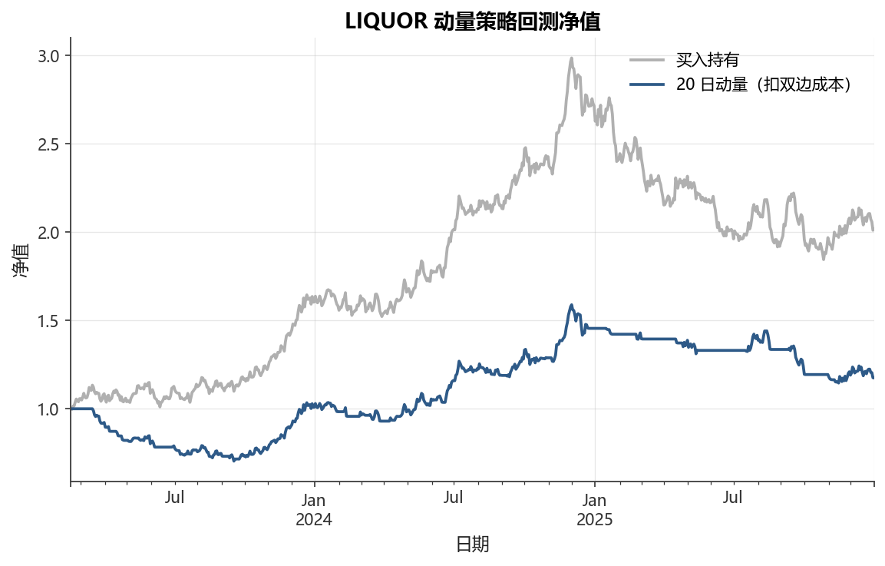

# 第17章 量化策略与回测

[](https://colab.research.google.com/github/albertandking/financial-data-science/blob/main/notebooks/ch17_backtesting.ipynb) [](https://mybinder.org/v2/gh/albertandking/financial-data-science/main?labpath=notebooks/ch17_backtesting.ipynb)

!!! info "配套代码"
    `notebooks/ch17_backtesting.ipynb`

## 17.1 本章导读

“策略在纸面上赚了300%”——这句话在量化圈早已是笑谈，因为每一位入门者都会经历的第一课，就是发现精心构建的回测结果在实盘中化为乌有。回测（Backtesting）是量化投资的核心环节：用历史数据“模拟”交易，检验策略是否真的有效。然而，正是这种“模拟”的性质，埋藏了大量可以让任何策略看起来完美的陷阱。

本章从信号生成开始，构建完整的向量化回测框架，引入A股真实交易成本，计算一套完整的绩效指标，并系统剖析前视偏差、幸存者偏差、过拟合等常见陷阱。最后通过参数稳健性分析帮助读者区分“有效策略”与“数据拟合”。

## 17.2 学习目标

读完本章，读者应能够：

1. 理解回测的意义与根本局限，区分向量化回测与事件驱动回测；
2. 用 `position = signal.shift(1)` 正确实现无前视偏差的向量化回测；
3. 计算A股双边交易成本，分析换手率与成本的关系；
4. 计算年化收益、夏普比率、最大回撤、卡尔玛比率等完整绩效指标；
5. 识别并避免前视偏差、幸存者偏差、数据窥探等回测陷阱；
6. 通过参数扫描和样本内/样本外检验评估策略稳健性。

---

## 17.3 回测的意义与局限

### 17.3.1 为什么需要回测

量化策略在上线前，无法进行大规模真实测试。回测提供了一个近似的“历史模拟器”，帮助回答以下问题：

- 策略在历史上是否具有统计显著的超额收益？
- 最坏情形（最大回撤）有多深？投资者心理上能否承受？
- 在哪些市场状态（牛市/熊市/震荡市）下策略失效？
- 加入交易成本后，策略是否依然盈利？

### 17.3.2 回测的根本局限

!!! warning "回测不是预测未来"
    回测只能告诉你策略**在历史上**表现如何，无法保证未来有效。以下几点尤为关键：

    1. **历史不重演**：市场结构、监管规则、参与者构成随时间变化；
    2. **自我消解**：一旦策略广为人知，超额收益往往消失；
    3. **模拟成本≠真实成本**：冲击成本、流动性限制在回测中难以精确建模；
    4. **数据陷阱**：任何历史数据都包含幸存者偏差、前视偏差等系统性问题。

### 17.3.3 向量化回测 vs 事件驱动回测

| 维度 | 向量化回测 | 事件驱动回测 |
|------|-----------|------------|
| 实现方式 | Pandas/NumPy矩阵运算 | 模拟逐笔报单/成交事件 |
| 速度 | 极快（秒级） | 慢（分钟~小时） |
| 建模精度 | 较低（假设理想成交） | 较高（可模拟部分成交/滑点） |
| 适用场景 | 日度策略快速筛选 | 高频/精细化策略验证 |
| 典型库 | pandas / vectorbt | zipline / backtrader |

本章重点介绍**向量化回测**。它运算效率高，适合快速筛选信号和参数扫描，是量化研究员的日常主力工具。

---

## 17.4 信号→持仓→收益：回测流程

### 17.4.1 三步核心流程

```
原始数据（价格/因子）
    ↓
信号生成（Signal）    ← t 日收盘后根据公开信息计算
    ↓
持仓决策（Position）  ← t+1日开盘按信号执行（T+1规则）
    ↓
策略收益（Return）    ← t+1日的收益 × t 日的持仓
```

### 17.4.2 T+1 规则与前视偏差

在A股，**当日买入的股票不能当日卖出**（T+1交割规则）。因此，即使信号在收盘后立即生成，也只能在**次日**成交。这在向量化回测中通过一行代码体现：

```python
position = signal.shift(1)   # 今日持仓 = 昨日信号
```

这行代码是整个回测框架中**最重要的一行**。若遗漏 `shift(1)`，则相当于当日收盘价信号当日成交，产生严重的**前视偏差（Look-Ahead Bias）**。

!!! warning "最常见的前视偏差"
    以下代码片段包含前视偏差：
    ```python
    # 错误：用当日收盘价信号当日持仓
    signal = (prices > prices.rolling(20).mean()).astype(int)
    strategy_return = signal * returns   # ← 错误！

    # 正确：信号在t日生成，t+1日才能成交
    position = signal.shift(1)
    strategy_return = position * returns   # ← 正确
    ```
    前视偏差会让回测净值“凭空”好看20%~50%，是初学者最常犯的错误。

### 17.4.3 持仓信号的设计

常见信号类型：

| 信号值 | 含义 |
|--------|------|
| `+1`   | 做多（买入并持有） |
| `0`    | 空仓（不持有） |
| `-1`   | 做空（A股受限，一般设为0） |

对于A股普通股票，因为融券受限，通常只有多头（+1）和空仓（0）两种状态。

### 17.4.4 为什么 `shift(1)` 能防前视：时间线推导

要理解 `position = signal.shift(1)` 为什么不可或缺，必须把信息可用的时点画在一条时间轴上。设 $S_t$ 为第 $t$ 日收盘后才能算出的信号（它用到了截至 $t$ 日收盘的全部价格），$r_{t+1}$ 为第 $t$ 到第 $t+1$ 日之间标的的收益。一笔交易能赚到 $r_{t+1}$，前提是在 $t+1$ 日区间开始**之前**就已经持有头寸。

由于 $S_t$ 在 $t$ 日收盘后才可知，它最早只能驱动 $t+1$ 日的持仓 $P_{t+1}$，即

$$P_{t+1} = S_t \quad\Longleftrightarrow\quad P_t = S_{t-1}$$

写成向量形式正是 `position = signal.shift(1)`。于是当日策略收益为

$$r^{策略}_t = P_t \cdot r_t = S_{t-1}\cdot r_t$$

如果错误地写成 $r^{策略}_t = S_t\cdot r_t$，就等价于断言“我在 $t$ 日收盘后才算出的信号，却用它赚到了 $t$ 日当天的收益”——这相当于交易员能拿到尚未发生的收盘价，是一种典型的“时间旅行”。$\text{shift}(1)$ 把整条信号序列向未来平移一格，恰好对齐了“信息可用”与“收益归属”这两件事的先后顺序，这就是它防前视的本质。

!!! example "例 17.1　有前视 vs 无前视：净值差距的手算演示"
    取连续5个交易日，标的日收益 $r_t$ 与“收盘后才可知”的信号 $S_t$ 如下（信号1代表看多、0代表空仓）。注意 $S_t$ 与 $r_t$ 高度相关——因为实际中信号正是由近期价格算出，这种“自相关”恰是前视偏差威力巨大的根源。

    | 日 $t$ | 收益 $r_t$ | 信号 $S_t$ | 无前视持仓 $P_t=S_{t-1}$ | 有前视持仓 $S_t$ |
    |---|---|---|---|---|
    | 1 | $+3\%$ | 1 | — | 1 |
    | 2 | $-2\%$ | 0 | 1 | 0 |
    | 3 | $+4\%$ | 1 | 0 | 1 |
    | 4 | $-1\%$ | 0 | 1 | 0 |
    | 5 | $+2\%$ | 1 | 0 | 1 |

    **无前视净值**（$P_t=S_{t-1}$，第1日无前一日信号故空仓）：

    $\text{NAV}^{无} = 1\times(1{+}0)\times(1{-}0.02)\times(1{+}0)\times(1{-}0.01)\times(1{+}0)=0.9702$

    实际上第2日和第4日因为“昨天看多、今天却下跌”而吃了亏，净值反而跌到 $0.9702$，亏损约 $3\%$。

    **有前视净值**（直接用 $S_t$ 当日持仓）：

    $\text{NAV}^{有} = (1{+}0.03)\times1\times(1{+}0.04)\times1\times(1{+}0.02)=1.0928$

    有前视版本“神奇地”只在上涨日持仓、下跌日空仓，净值涨到 $1.0928$，盈利约 $9.3\%$。两者净值差距高达 $1.0928/0.9702-1\approx 12.6\%$，而这一切只来自漏写一个 `shift(1)`。这就是前视偏差能让任何垃圾策略“纸面暴富”的根本机制。

---

## 17.5 向量化回测实现

### 17.5.1 动量信号

**动量效应**（Momentum）是金融学中最持久的实证发现之一：近期涨幅较大的资产，未来短期内往往继续上涨。以20日动量为例：

$$\text{Signal}_t = \begin{cases} 1 & \text{若 } R_{t-20,t} > 0 \\ 0 & \text{其他} \end{cases}$$

其中 $R_{t-20,t}$ 为过去20个交易日的累计收益率。

在代码中：

```python
# 计算20日动量（过去20日收益）
momentum = prices.pct_change(20)

# 动量为正则做多，否则空仓
signal = (momentum > 0).astype(int)

# T+1执行：今日持仓 = 昨日信号
position = signal.shift(1)

# 策略日收益 = 持仓 × 标的日收益
returns = prices.pct_change()
strategy_return = (position * returns).dropna()
```

### 17.5.2 净值计算

从日度收益序列到净值曲线：

```python
# 起始净值为 1
nav = (1 + strategy_return).cumprod()

# 也可用对数累加（等价，误差极小）
# nav = np.exp(np.log1p(strategy_return).cumsum())
```

净值曲线（NAV, Net Asset Value）是策略表现最直观的展示，反映了从初始1元出发的累计复合增长。

---

## 17.6 交易成本与滑点

### 17.6.1 A股双边成本构成

A股真实交易中，每笔交易都会产生以下费用：

| 费用类型 | 方向 | 典型费率 | 说明 |
|---------|------|---------|------|
| 佣金（券商手续费） | 买卖双向 | ~0.025% | 互联网券商已低至0.015%，部分有最低5元 |
| 印花税 | **仅卖出** | 0.05%（2023年调降） | 2023年8月降至0.05%，此前为0.1% |
| 过户费 | 买卖双向 | 0.001% | 上交所收取，深交所近年已取消 |
| 买入冲击成本/滑点 | 买卖双向 | 0.02%~0.1% | 大单成交时实际价格偏离报价 |

!!! note "简化计算"
    教学与研究中常用的简化假设：

    - 佣金：买卖各0.025%
    - 印花税（仅卖出）：0.05%
    - 滑点（买卖各半）：0.05%

    综合**双边成本**（每完成一次完整的买入+卖出）约为：
    $C_{双边} \approx 2 \times 0.025\% + 0.05\% + 2 \times 0.05\% = 0.2\%$

### 17.6.2 换手率与成本的关系

**换手率**衡量持仓的变动频率：

$$\text{换手率}_{日均} = \frac{1}{T}\sum_{t=1}^{T}|\text{position}_t - \text{position}_{t-1}|$$

$$\text{年化换手率} = \text{换手率}_{日均} \times 252$$

交易成本对策略的侵蚀：

$$\text{年化成本} = \text{年化换手率} \times C_{单边}$$

以一个每月调仓一次（年化换手率约24×）的策略为例：

$$\text{年化成本} \approx 24 \times 0.1\% = 2.4\%$$

这意味着策略每年必须在基准之上超额2.4% 才能弥补成本。对于年化收益8% 的策略来说，这并非小数。

!!! warning "高频换手率是成本杀手"
    日频调仓的策略年化换手率可能高达200~500×，对应年化成本20%~50%。
    绝大多数“看似盈利”的高频信号在加入成本后变为亏损。

### 17.6.3 在回测中加入成本

```python
# 计算每日换手率
turnover = position.diff().abs()

# 每日成本（单边成本率）
cost_per_trade = 0.001   # 0.1% 单边
daily_cost = turnover * cost_per_trade

# 扣除成本后的净收益
net_return = strategy_return - daily_cost
```

### 17.6.4 年化成本公式的推导

“年化成本 $=$ 年化换手率 $\times$ 单边成本”这一公式看似简单，但值得从换手的定义一步步推出来，以免在多空、加减仓等场景下用错。

定义第 $t$ 日的换手为持仓的绝对变动 $u_t=|P_t-P_{t-1}|$。在只做多（$P_t\in\{0,1\}$）的设定下，从空仓到满仓 $u_t=1$，从满仓到空仓 $u_t=1$；一次“完整的买入再卖出”因此贡献 $u$ 的累计为 $2$。每一次换手按单边成本率 $c$ 扣费，故第 $t$ 日成本为 $u_t\cdot c$。把一年 $T\approx 252$ 个交易日的成本加总：

$$\text{年化成本}=\sum_{t=1}^{T}u_t\cdot c=c\sum_{t=1}^{T}u_t = c\cdot T\cdot\underbrace{\frac{1}{T}\sum_{t=1}^{T}u_t}_{\text{日均换手}}=c\times\text{年化换手率}$$

最后一步用到了“年化换手率 $=$ 日均换手 $\times 252$”。这里的 $c$ 是**单边**成本（买一次或卖一次各算一次），因为换手 $u_t$ 已经把买入和卖出分别计入了——一次完整往返的换手累计为 $2$，乘以单边 $c$ 恰好等于双边成本 $2c$。这正是17.6.1中“双边成本约 $0.2\%$”与“单边 $0.1\%$”自洽的原因，切勿把双边成本再乘以换手而重复计费。

!!! example "例 17.2　换手率与年化成本估算"
    某动量策略在一年 $252$ 个交易日中，持仓状态在多头与空仓之间共切换了 $60$ 次（即 $\sum_t u_t=60$）。单边成本取 $c=0.1\%$。

    **日均换手率**：

    $\frac{1}{252}\sum_{t=1}^{252}u_t=\frac{60}{252}\approx 0.238$

    **年化换手率**：

    $0.238\times 252 = 60\quad（即每年约60次单边换手）$

    **年化成本**：

    $\text{年化成本}=60\times 0.1\%=6.0\%$

    若该策略税前年化收益为 $9\%$，则税后只剩 $9\%-6\%=3\%$，**成本占收益比高达 $6\%/9\%\approx 66.7\%$**——三分之二的利润被交易成本吞掉。倘若把调仓频率提高一倍（年化换手 $120$ 次），年化成本翻到 $12\%$，策略直接由盈转亏。这个简单测算解释了为何“信号看起来很灵”的高频策略在实盘中往往血本无归：决定生死的不是信号方向对不对，而是换手率压不压得住。

### 17.6.5 A股案例：双边 0.2% 成本与 T+1 对高换手策略的侵蚀

前面的成本测算在A股语境下还要更严苛，原因有二：成本绝对值偏高，以及 T+1制度强制拉长持仓周期、限制了高频套利的可行性。

!!! example "例 17.3　A股双边 0.2% 成本对高换手策略的侵蚀"
    设某A股日内信号策略平均每两个交易日完成一次“买入—卖出”往返，即年化约 $126$ 次完整往返，对应年化换手率约 $252$ 次单边。按A股双边成本 $C_{双边}\approx 0.2\%$（即单边 $c\approx 0.1\%$）估算：

    $\text{年化成本}=252\times 0.1\%=25.2\%$

    也就是说，仅交易成本一项每年就吃掉 $25\%$ 的净值。要让这种策略不亏，**税前年化收益必须超过 $25\%$**——这已远超绝大多数A股主动策略的长期收益中枢（通常 $8\%\!\sim\!15\%$）。换言之，在 $0.2\%$ 双边成本下，年化换手率超过约 $100\!\sim\!150$ 次的策略，其超额收益几乎注定被成本侵蚀殆尽。

    更关键的是 **T+1约束**：A股当日买入不能当日卖出，理论上的“日内反复套利”根本无法落地，最快也只能 $t$ 日买、$t{+}1$ 日卖。这一制度从源头上压低了可实现的换手频率，也意味着任何在回测里出现“当日买卖”的高频信号都隐含了对A股交易规则的违反，其回测净值不可信。因此在A股做量化，**降低换手、延长持仓周期，往往比优化信号方向更能提升实盘净值**。

---

## 17.7 绩效评估体系

完整的绩效评估需要多维度指标，单一指标（如收益率）容易被操纵或误解。

### 17.7.1 收益类指标

**年化收益率**（几何复合）：

$$\bar{r}_{年化} = \left(\prod_{t=1}^{T}(1+r_t)\right)^{252/T} - 1$$

**超额收益（Alpha）**：相对于基准（如沪深300）的超额年化收益。

### 17.7.2 风险调整类指标

**夏普比率**（Sharpe Ratio）：每单位波动所获得的超额收益：

$$\text{Sharpe} = \frac{\bar{r} - r_f}{\sigma} \times \sqrt{252}$$

其中 $r_f$ 为年化无风险利率（常用货币市场利率，约1.5%~2%）。

**卡尔玛比率**（Calmar Ratio）：年化收益与最大回撤之比：

$$\text{Calmar} = \frac{\bar{r}_{年化}}{|\text{MDD}|}$$

卡尔玛比率特别适合A股，因为A股市场波动剧烈，回撤管理至关重要。

### 17.7.3 回撤类指标

**最大回撤**（Maximum Drawdown, MDD）：

$$\text{MDD} = \min_{t \in [0,T]} \left(\frac{\text{NAV}_t}{\max_{\tau \leq t} \text{NAV}_\tau} - 1\right)$$

最大回撤反映了策略在最坏情形下的亏损幅度，是投资者心理承受力的关键参考。

**水下曲线**（Underwater Chart）：

$$\text{Drawdown}_t = \frac{\text{NAV}_t}{\max_{\tau \leq t} \text{NAV}_\tau} - 1$$

### 17.7.4 交易活跃度指标

| 指标 | 公式 | 说明 |
|------|------|------|
| 胜率 | 正收益日 / 总交易日 | 日胜率通常约50%~55%，均值回复策略可能更高 |
| 盈亏比 | 平均盈利 / 平均亏损绝对值 | 趋势跟踪通常盈亏比高，胜率低 |
| 年化换手率 | 日均换手 × 252 | 反映成本消耗 |
| 成本占收益比 | 年化成本 / 年化收益 | 反映成本对策略的侵蚀程度 |

### 17.7.5 完整绩效报告示例

```python
def performance_report(returns, risk_free=0.02, cost_per_trade=0.001,
                        position=None):
    """生成完整绩效报告。"""
    from fds import annualized_return, annualized_volatility, sharpe_ratio, max_drawdown

    ann_ret = annualized_return(returns)
    ann_vol = annualized_volatility(returns)
    sharpe  = sharpe_ratio(returns, risk_free=risk_free)
    mdd     = max_drawdown(returns)
    calmar  = ann_ret / abs(mdd) if mdd != 0 else np.nan
    win_rate = (returns > 0).mean()

    report = {
        '年化收益': f'{ann_ret:.2%}',
        '年化波动': f'{ann_vol:.2%}',
        '夏普比率': f'{sharpe:.3f}',
        '最大回撤': f'{mdd:.2%}',
        '卡尔玛比率': f'{calmar:.3f}',
        '胜率': f'{win_rate:.2%}',
    }

    if position is not None:
        turnover_daily = position.diff().abs().mean()
        turnover_annual = turnover_daily * 252
        annual_cost = turnover_annual * cost_per_trade
        report['年化换手率'] = f'{turnover_annual:.1f}×'
        report['年化成本'] = f'{annual_cost:.2%}'
        report['成本占收益比'] = f'{annual_cost / ann_ret:.1%}'

    return pd.Series(report)
```

### 17.7.6 夏普与卡尔玛的定义辨析

夏普比率与卡尔玛比率都属于“单位风险的收益”，区别只在于**用什么衡量风险**。理解这一点能避免在不同市场环境下选错指标。

**夏普比率**把风险定义为收益的波动（标准差），衡量的是“收益相对于全程颠簸的性价比”：

$$\text{Sharpe}=\frac{\bar{r}-r_f}{\sigma}\times\sqrt{252}$$

式中 $\bar{r}$、$\sigma$ 为**日度**收益的均值与标准差，乘 $\sqrt{252}$ 是把日度比率年化（均值按 $\times 252$、波动按 $\times\sqrt{252}$，相除后净剩 $\sqrt{252}$）。夏普的缺点是把“向上的波动”也当作风险惩罚，对偶尔暴涨的策略不友好。

**卡尔玛比率**把风险定义为历史最深的一次回撤，衡量的是“收益相对于最痛时刻的性价比”：

$$\text{Calmar}=\frac{\bar{r}_{年化}}{|\text{MDD}|}$$

卡尔玛只关心“最坏能亏多少”，与投资者的心理承受底线直接挂钩。对A股这类波动剧烈、回撤动辄 $30\%$ 以上的市场，卡尔玛往往比夏普更能反映策略的可持有性：一个夏普很高但曾经回撤 $50\%$ 的策略，多数人根本拿不住。

!!! example "例 17.4　一个小动量策略的手算绩效（净值/年化/夏普/最大回撤/卡尔玛）"
    设某动量策略连续6个交易日的（税后）日收益为：

    $r=[+2\%,\;+1\%,\;-3\%,\;+2\%,\;-1\%,\;+3\%]$

    **第一步，逐日净值**（从 $1$ 出发累乘 $(1+r_t)$）：

    | $t$ | $r_t$ | $\text{NAV}_t$ | 历史峰值 | 回撤 |
    |---|---|---|---|---|
    | 1 | $+2\%$ | $1.0200$ | $1.0200$ | $0$ |
    | 2 | $+1\%$ | $1.0302$ | $1.0302$ | $0$ |
    | 3 | $-3\%$ | $0.9993$ | $1.0302$ | $-3.00\%$ |
    | 4 | $+2\%$ | $1.0193$ | $1.0302$ | $-1.06\%$ |
    | 5 | $-1\%$ | $1.0091$ | $1.0302$ | $-2.05\%$ |
    | 6 | $+3\%$ | $1.0394$ | $1.0394$ | $0$ |

    期末净值 $\text{NAV}_6=1.0394$，区间累计收益 $+3.94\%$。

    **第二步，年化收益**（几何复合，$T=6$）：

    $\bar{r}_{年化}=1.0394^{\,252/6}-1=1.0394^{42}-1\approx 4.10-1=410\%$

    （样本极短才会得到这种夸张的年化数字，仅作公式演示；实务中需足够长的样本。）

    **第三步，夏普比率**。日收益均值 $\bar{r}=\frac{2+1-3+2-1+3}{6}\%=0.667\%$；
    日收益样本标准差 $\sigma\approx 2.16\%$。取 $r_f=0$，则

    $\text{Sharpe}=\frac{0.667\%}{2.16\%}\times\sqrt{252}\approx 0.309\times 15.87\approx 4.90$

    **第四步，最大回撤**。从上表回撤列取最小值，发生在第3日：

    $\text{MDD}=\min(0,\,-3.00\%,\,-1.06\%,\,-2.05\%)=-3.00\%$

    **第五步，卡尔玛比率**：

    $\text{Calmar}=\frac{\bar{r}_{年化}}{|\text{MDD}|}=\frac{4.10}{0.03}\approx 137$

    这套手算流程，正是 `performance_report` 函数内部所做的事：净值累乘 $\to$ 求峰值与回撤 $\to$ 年化均值与波动 $\to$ 各项比率。读者可用任意一段真实收益序列照此核对程序输出，确保自己真正理解每个指标的来历，而不是把绩效函数当黑箱。

### 17.7.7 卡尔玛比率的单独计算示例

!!! example "例 17.5　卡尔玛比率计算：两个策略的可持有性对比"
    甲、乙两策略的年化收益与最大回撤如下，比较谁更值得长期持有：

    | 策略 | 年化收益 $\bar{r}_{年化}$ | 最大回撤 $\text{MDD}$ | 卡尔玛 |
    |---|---|---|---|
    | 甲 | $20\%$ | $-40\%$ | $20\%/40\%=0.50$ |
    | 乙 | $12\%$ | $-15\%$ | $12\%/15\%=0.80$ |

    甲策略年化收益更高（$20\%$ vs $12\%$），单看收益似乎更优；但它的最大回撤深达 $40\%$，意味着持有期间净值曾从高点腰斩近一半，多数投资者会在中途割肉离场。乙策略卡尔玛比率 $0.80>0.50$，说明每承受 $1$ 单位的最深亏损，乙能换来更多收益，**风险调整后的可持有性更强**。

    一条经验法则：卡尔玛 $>0.5$ 尚可接受，$>1.0$ 较为优秀，$<0.3$ 则回撤相对收益过大、难以长期持有。在A股做策略选型时，与其追逐最高年化收益，不如优先考察卡尔玛——能拿得住的策略，才能真正赚到复利。

---

## 17.8 回测陷阱详解

!!! danger "回测陷阱是系统性错误，不是小疏漏"
    以下任一陷阱都可能将真实无效的策略包装成“完美”的回测结果。
    在发表结果或实盘前，必须逐一排查。

### 17.8.1 前视偏差（Look-Ahead Bias）

**定义**：在信号计算中使用了信号生成时刻尚不可知的未来信息。

**常见来源**：
1. 忘记 `shift(1)`：用 t 日信号决定 t 日持仓；
2. 用 `rolling().mean()` 的默认参数时，窗口结束点就是当前时间点，本身没问题，但若用 `centered=True` 则包含未来数据；
3. 使用“已知”的财务数据，但实际上该数据在披露日之前不可获得；
4. 用未来的复权因子对历史价格复权（前复权数据中存在这一问题）。

!!! warning "前复权数据的陷阱"
    前复权（Forward-adjusted）价格在每次除权时都会追溯调整历史所有价格。
    这意味着你在2015年“看到”的价格实际上是用2023年的复权因子算出来的——
    这是一种微妙但严重的前视偏差。
    **建议**：用后复权价格计算收益率，避免前复权数据。

**量化影响**：前视偏差通常让年化超额收益虚高10%~30%。

### 17.8.2 幸存者偏差（Survivorship Bias）

**定义**：数据集中只包含“幸存”到今天的股票，剔除了退市、ST、破产的公司。

**影响**：幸存的股票天然是“成功”的股票，在它们上测试的策略会系统性高估收益。

研究表明，忽略幸存者偏差会让年化收益高估约2%~5%（取决于市场和时间段）。

!!! note "A股特殊背景"
    A股退市制度历来较宽松，但近年趋严。量化研究时应使用包含退市股的完整数据集。
    Wind、聚宽等数据供应商提供“全量股票”数据，包含历史退市标的。

### 17.8.3 过拟合（Overfitting）与数据窥探（Data Snooping）

**过拟合**：模型参数在样本内拟合了数据的噪声，样本外表现大幅下降。

**数据窥探**：研究者反复尝试不同参数/信号/组合，直到找到“显著”结果，但这些结果只是多重检验的统计产物。

!!! warning "p-Hacking 与多重检验"
    假设一个参数有100种选择，每种在随机数据上有5% 概率“显著”（p<0.05）。
    如果不进行多重检验校正，预期有5种参数会“显著”——即使真实信号为零。

    **Bonferroni 校正**：若进行 $n$ 次检验，单次检验的显著性水平应调整为 $\alpha/n$。

    Bailey & López de Prado（2016）提出的**回测过拟合概率**（Probability of Backtest Overfitting, PBO）
    更为精细，见本章拓展阅读。

**检验标准**：
- 最低夏普比率（Minimum Track Record Length）：样本外夏普需达到某一阈值才可信；
- 参数敏感性：策略表现应对参数选择不敏感（见17.9节）。

### 17.8.4 未来函数（Future Function）

**定义**：技术指标的实现方式含有当期或未来数据。

典型案例：

```python
# 错误：TA-Lib 的某些函数默认用 "close" 价格，
# 但有时会自动往前对齐，产生未来函数效果。

# 警惕：使用 pandas rolling 时 min_periods 设置不当
signal = returns.rolling(20, min_periods=1).mean()
# min_periods=1 意味着前19天用不足20个样本计算均值，
# 这在某些情况下会引入偏差。建议设为 min_periods=20，
# 让前19天返回 NaN。
```

### 17.8.5 回测的其他常见错误

| 错误 | 描述 | 修正方法 |
|------|------|---------|
| 忽略停牌 | 停牌期间持仓无法调整 | 停牌日持仓强制延续 |
| 忽略涨跌停 | 涨停无法买入，跌停无法卖出 | 信号满足时检查是否涨跌停 |
| 假设无限流动性 | 大额订单实际会冲击市场 | 按流通市值比例限制仓位 |
| 历史数据质量 | 分红、复权、数据错误 | 严格数据清洗，验证价格连续性 |

### 17.8.6 数据窥探的定量测算

数据窥探之所以危险，在于它制造的“显著”是**纯统计假象**，不需要任何真实信号就能凭空冒出来。下面的小测算把这种假象量化，帮助读者建立起对“试得越多、越容易撞上虚假显著”的数值直觉。

!!! example "例 17.6　多重检验导致的虚假显著：小测算"
    假设我们在一段**纯随机**（真实超额收益为零）的数据上测试 $N$ 个互相独立的策略，每个策略用 $\alpha=0.05$ 的显著性水平做单次检验。所谓“显著”，意味着即便无真实信号，也有 $5\%$ 的概率因运气而通过检验。

    **至少出现一个虚假显著的概率**（family-wise error rate）：

    $P(\text{至少一个假阳性})=1-(1-\alpha)^{N}$

    代入不同的尝试次数 $N$：

    | 尝试策略数 $N$ | 预期假阳性个数 $N\alpha$ | 至少一个假阳性的概率 |
    |---|---|---|
    | 1 | $0.05$ | $5.0\%$ |
    | 5 | $0.25$ | $1-0.95^{5}\approx 22.6\%$ |
    | 20 | $1.00$ | $1-0.95^{20}\approx 64.2\%$ |
    | 100 | $5.00$ | $1-0.95^{100}\approx 99.4\%$ |

    可见只要试上 $20$ 种参数，几乎有三分之二的概率能“撞出”至少一个 $p<0.05$ 的策略；试 $100$ 种，则**几乎必然**能找到一个看起来显著的策略——而这一切完全建立在随机噪声之上，没有任何真实 alpha。

    **Bonferroni 校正**给出补救：若做了 $N$ 次检验，单次检验应把门槛收紧到 $\alpha/N$。试了 $100$ 个策略，真正可信的显著性水平是 $0.05/100=0.0005$，对应正态分位数 $z\approx 3.29$；而非校正前的 $z\approx 1.96$。换算成夏普语言，这意味着“试了一百次后挑出来的最佳策略”，其样本内夏普必须高出未校正阈值一大截，才谈得上可信。

    这正是 Harvey、Liu 和 Zhu（2016）主张“因子 $t$ 值至少要达到 $3.0$ 才可信”的统计根据：学术界与业界几十年里检验过成千上万个因子，不做多重检验校正，发表出来的“显著因子”里必然混杂大量数据窥探的产物。**记住：你试过的每一个失败参数，都在悄悄抬高最终那个“成功”参数为假阳性的概率。**

### 17.8.7 回测陷阱排查清单

把前面各类陷阱浓缩成一张可逐项打勾的清单，便于在发表结果或上实盘前做最后体检。每发现一项未排查，就应假定回测净值偏乐观。

| 陷阱 | 自查问题 | 典型征兆 | 排查动作 |
|------|---------|---------|---------|
| 前视偏差 | 是否对信号做了 `shift(1)`？ | 净值异常平滑、回撤极小 | 检查 `position=signal.shift(1)`；改用后复权数据 |
| 幸存者偏差 | 数据是否含退市/ST 股？ | 长期收益明显高于指数 | 使用全量股票池（含退市标的） |
| 数据窥探 | 试过多少组参数才选出这组？ | 最优参数为孤立尖峰 | Bonferroni 校正；样本外验证 |
| 未来函数 | 指标是否用到当期/未来 bar？ | 指标提前“预知”拐点 | 检查 `min_periods`、避免 `center=True` |
| 成本缺失 | 是否扣除双边成本与滑点？ | 高换手仍高收益 | 按换手 $\times$ 单边成本扣费 |
| 涨跌停/停牌 | 信号日能否真实成交？ | 关键收益来自涨停板 | 涨跌停日禁止成交、停牌日延续持仓 |
| 流动性假设 | 仓位是否超出可成交量？ | 小盘股贡献巨额收益 | 按流通市值/成交额限制仓位 |

!!! danger "一票否决"
    清单中任意一项未通过，都足以让整份回测结论作废。尤其是前视偏差与成本缺失这两项——
    它们几乎能把任何随机信号包装成“稳定盈利”的曲线。逐项排查不是形式主义，而是区分“真策略”与“拟合噪声”的最后防线。

---

## 17.9 参数稳健性分析

### 17.9.1 参数高原 vs 参数孤岛

在参数扫描中，我们希望找到“参数高原”（Plateau），而非“参数孤岛”（Island）。

- **参数孤岛**：只有某个特定参数值（如恰好第21天）表现好，稍微偏移立刻崩溃。这通常意味着过拟合；
- **参数高原**：在一个宽泛的参数范围内（如15~30天）策略都有合理表现。这说明信号本身有效，参数选择是次要的。

```
夏普比率
  ↑
1.2|         ████
1.0|       ████████     ← 参数高原（真实信号）
0.8|     ████████████
0.6|   ████████████████
0.4|
0.2|                      █  ← 参数孤岛（过拟合）
  ├──────────────────────────→ 动量窗口（天）
    5  10  15  20  25  30  35
```

### 17.9.2 样本内/样本外检验

**正确的研究流程**：

1. 用前70% 数据（样本内）探索参数、优化策略；
2. 参数确定后**锁定**，用后30% 数据（样本外）验证；
3. 样本外结果不佳时，**不应**返回样本内调整参数（否则样本外等于变成了样本内）。

```python
# 按时间切分，不打乱顺序！
T = len(prices)
split = int(T * 0.7)

prices_in  = prices.iloc[:split]   # 样本内：参数调优
prices_out = prices.iloc[split:]   # 样本外：验证

# 在样本内确定最优参数
best_window = 20  # 假设在样本内得到此参数

# 在样本外用固定参数验证
# ...（不再修改 best_window）
```

!!! warning "禁止时间旅行"
    样本外验证的核心前提是：参数选择不依赖样本外数据。
    一旦因为“样本外表现不好”而回头修改参数，样本外就失去了独立性。

### 17.9.3 Walk-Forward Analysis

更严格的方法是滚动向前检验（Walk-Forward Analysis）：将整个历史切成多个“训练窗口+验证窗口”的滑动区间，统计在所有验证窗口上的平均表现。这能更客观地评估策略的泛化能力。

---

## 17.10 A股实战：20日动量策略完整实现

<figure markdown>
  { width="680" }
  <figcaption>图17-1　LIQUOR 动量策略回测净值 vs 买入持有</figcaption>
</figure>


以内置的四只A股风格资产（BANK/LIQUOR/TECH/UTILITY）为例，实现完整的回测流程：

### 17.10.1 策略框架

```python
import numpy as np
import pandas as pd
from fds import (
    load_sample_prices, load_market, daily_returns, set_chinese_font,
    annualized_return, annualized_volatility, sharpe_ratio, max_drawdown
)

set_chinese_font()

# 加载数据
prices = load_sample_prices()
returns = daily_returns(prices)

# === 策略参数 ===
WINDOW   = 20          # 动量窗口（交易日）
COST     = 0.001       # 单边成本（0.1%）
RF       = 0.02        # 年化无风险利率

# === 信号生成 ===
momentum = prices.pct_change(WINDOW)         # t日动量
signal   = (momentum > 0).astype(float)      # 1=做多, 0=空仓

# === 持仓（T+1执行）===
position = signal.shift(1)                   # 核心：昨日信号=今日持仓

# === 策略收益 ===
gross_ret = (position * returns).dropna()    # 税前收益
turnover  = position.diff().abs().dropna()   # 每日换手
cost      = turnover * COST                  # 每日成本
net_ret   = gross_ret - cost                 # 税后净收益
```

### 17.10.2 绩效指标计算

取 TECH 资产为例：

```python
ticker = 'TECH'
r_net  = net_ret[ticker]

metrics = {
    '年化收益（税后）': f'{annualized_return(r_net):.2%}',
    '年化波动':         f'{annualized_volatility(r_net):.2%}',
    '夏普比率':         f'{sharpe_ratio(r_net, rf):.3f}',
    '最大回撤':         f'{max_drawdown(r_net):.2%}',
    '卡尔玛比率':       f'{annualized_return(r_net) / abs(max_drawdown(r_net)):.3f}',
    '胜率':             f'{(r_net > 0).mean():.2%}',
    '年化换手率':       f'{turnover[ticker].mean() * 252:.1f}×',
}
```

### 17.10.3 前视偏差演示

```python
# 有前视偏差的"错误"版本（忘记shift）
signal_bias  = (momentum > 0).astype(float)
gross_biased = (signal_bias * returns).dropna()   # 直接用signal，不shift

# 净值对比
nav_correct = (1 + net_ret[ticker]).cumprod()
nav_biased  = (1 + gross_biased[ticker]).cumprod()

# 通常 nav_biased 会显著高于 nav_correct，揭示前视偏差的"虚假收益"
```

---

## 17.11 用 akquant 框架做事件驱动回测

前面几节我们手写了**向量化回测**：用 `position = signal.shift(1)` 一次性算出全部持仓与收益，
快、适合参数扫描与信号筛选。但它对撮合细节做了理想化假设（满仓成交、无逐笔风控）。
**生产级**研究往往需要**事件驱动回测**——逐根 K 线（bar）推进，模拟下单、成交、持仓与风控。

[akquant](https://github.com/akfamily/akquant) 是 akshare 生态的开源回测框架：**Rust 内核 + Python 接口**，
内置 walk-forward 滚动验证、TA-Lib 指标、因子表达式引擎、参数网格搜索与丰富的绩效报告，
并能与 akshare 无缝衔接取数。

### 17.11.1 安装

```bash
uv sync --extra quant          # 或：pip install akquant
```

### 17.11.2 核心概念

| 概念 | 说明 |
|---|---|
| `Strategy.on_bar(bar)` | 每根 K 线回调一次；`bar` 提供 `open/close/high/low/symbol/timestamp_iso` |
| `self.buy(symbol=, quantity=)` | 下买单 |
| `self.close_position(symbol=)` | 平仓 |
| `self.get_position(symbol)` | 查询持仓 |
| `aq.run_backtest(data, strategy, initial_cash, symbols)` | 运行回测，返回 `BacktestResult` |
| `result` / `result.metrics` / `result.equity_curve` | 绩效指标表、指标包装、净值曲线 |
| `result.report(filename=, benchmark=)` | 生成 HTML 绩效报告（含基准对比） |

与本章前面手写回测的对照：**向量化**重在快速研究、**事件驱动**重在贴近真实撮合，两者互补。

### 17.11.3 最小示例

下面用**内置数据**离线演示（实盘只需把数据换成 akshare 的真实行情）。
akquant 需要 OHLC 列，内置数据只有收盘价，这里据此构造示意的开高低：

```python
import akquant as aq
from akquant import Strategy
from fds import load_sample_prices

close = load_sample_prices()["LIQUOR"]
df = close.rename("close").reset_index().rename(columns={"index": "date"})
df["open"] = close.shift(1).bfill().to_numpy()
df["high"], df["low"], df["volume"] = close * 1.01, close * 0.99, 1000

class MaCross(Strategy):
    def on_bar(self, bar):
        pos = self.get_position(bar.symbol)
        if pos == 0 and bar.close > bar.open:        # 阳线买入
            self.buy(symbol=bar.symbol, quantity=100)
        elif pos > 0 and bar.close < bar.open:        # 阴线平仓
            self.close_position(symbol=bar.symbol)

result = aq.run_backtest(data=df, strategy=MaCross, initial_cash=100000.0, symbols="LIQUOR")
print(result)                  # 总收益、夏普、最大回撤、胜率等一应俱全
```

!!! note "事件驱动 vs 向量化"
    事件驱动回测更贴近真实交易（逐 bar 撮合、可加风控），但更慢；向量化回测更快、适合海量参数/信号筛选。
    教学这里用内置数据离线演示；真实研究把 `df` 换成 akshare 的真实行情即可（需 `uv sync --extra data`）。

## 17.12 本章小结

本章构建了向量化回测的完整框架，核心知识点如下：

1. **`position = signal.shift(1)` 是回测正确性的基石**，对应A股T+1制度，任何遗漏都导致前视偏差；
2. **A股双边交易成本约0.2%**，高换手率策略的年化成本可能超过20%，吞噬大部分甚至全部收益；
3. **绩效评估需要多指标**：夏普评价风险调整收益，卡尔玛关注回撤，换手率反映成本消耗；
4. **回测陷阱是系统性错误**：前视偏差、幸存者偏差、过拟合、数据窥探，每一个都能让虚假策略看起来完美；
5. **参数高原优于参数孤岛**：策略应对参数选择有一定的稳健性，“恰好”某参数最优往往是过拟合信号；
6. **样本外检验是策略有效性的唯一可信证据**，且参数不能在看到样本外结果后再调整。

---

## 17.13 习题

**习题17.1（基础）** 实现一个5日均线与20日均线的金叉/死叉策略：均线上方多头、均线下方空仓。加入0.1%单边成本后，在TECH资产上计算完整绩效指标，并与20日动量策略对比夏普比率。

*参考思路*：计算 `ma5 = prices.rolling(5).mean()`，`ma20 = prices.rolling(20).mean()`，当 `ma5 > ma20` 时信号为1，否则为0。注意 `signal.shift(1)`。

**习题17.2（进阶）** 演示前视偏差的量化影响：分别计算有前视偏差和无前视偏差两版20日动量策略的净值，比较它们的年化收益率差异。将差值（前视溢价）绘图。

*参考思路*：有前视版直接 `gross = signal * returns`；无前视版 `gross = signal.shift(1) * returns`。年化收益差 = 有前视年化 - 无前视年化，即为“虚假超额收益”。

**习题17.3（成本分析）** 以TECH为例，分别设定单边成本0.0%、0.05%、0.10%、0.15%、0.20%，绘制“成本—夏普比率”关系图。找出使夏普比率降为0的临界成本率，并计算此时年化成本占无成本年化收益的比例。

*参考思路*：用循环遍历成本参数，每次计算净收益后算夏普比率，画折线图，用线性插值找零点。

**习题17.4（参数扫描）** 对TECH资产扫描动量窗口 `[5, 10, 15, 20, 25, 30, 40, 60]`，绘制“窗口—夏普比率”热图。讨论：最优参数附近是否呈现参数高原？是否有过拟合嫌疑？

*参考思路*：循环窗口参数，记录每个窗口的夏普比率，用 `plt.bar` 绘图；同时用时间前60%为样本内，后40%为样本外，对比两段的夏普比率走势。

**习题17.5（综合）** 构造一个“幸运策略”：使用`np.random.seed(42)`生成随机信号，对四只资产分别回测（无成本），选出夏普比率最高的资产。然后：(a) 计算若有10000种随机策略，预期最高夏普比率约为多少（用 `max(np.random.normal(0, 1, 10000) / np.sqrt(252)...)` 估算）；(b) 讨论这与“数据窥探”的关系。

*参考思路*：随机信号 + 大量尝试的组合，在随机数据上总能找到“显著”策略。Bonferroni 校正后，最高夏普的显著性水平应调整为 $\alpha / 10000 = 0.000005$，对应 $z \approx 4.4$ 的标准差水平，说明要求极高。

---

## 17.14 拓展阅读

1. **Bailey, D. H., & López de Prado, M. (2014)**. *The Deflated Sharpe Ratio: Correcting for Selection Bias, Backtest Overfitting, and Non-Normality*. Journal of Portfolio Management. —— 提出回测过拟合概率（PBO）的经典论文。

2. **López de Prado, M. (2018)**. *Advances in Financial Machine Learning*. Wiley. —— 第11章详细介绍多种回测陷阱与检验方法，是量化研究员必读书目。

3. **Prado, M. L. de (2018)**. *The 10 Reasons Most Machine Learning Funds Fail*. Journal of Portfolio Management. —— 系统总结了量化策略失败的10大原因，与本章内容高度相关。

4. **Aronson, D. (2006)**. *Evidence-Based Technical Analysis*. Wiley. —— 用统计学严格检验技术分析有效性，第7章专门处理数据窥探问题。

5. **Harvey, C. R., Liu, Y., & Zhu, H. (2016)**. *…and the Cross-Section of Expected Returns*. Review of Financial Studies. —— 指出大量发表的因子在严格多重检验校正后可能都不显著（t值应至少达到3.0）。
