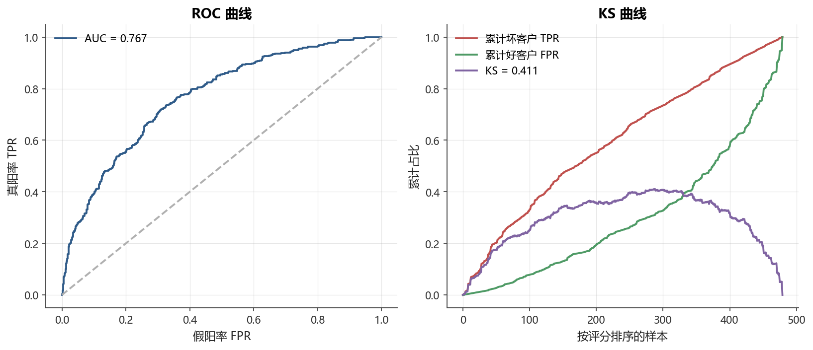

# 第18章 信用风险与违约预测

[](https://colab.research.google.com/github/albertandking/financial-data-science/blob/main/notebooks/ch18_credit_risk.ipynb) [](https://mybinder.org/v2/gh/albertandking/financial-data-science/main?labpath=notebooks/ch18_credit_risk.ipynb)

!!! info "配套代码"
    `notebooks/ch18_credit_risk.ipynb`

---

## 18.1 本章导读

信用风险是金融机构面临的最古老、也是规模最大的风险类型之一。银行在放贷前必须回答一个核心问题：**这笔贷款能否按时还清？** 传统上，信贷员凭借经验和财务报表来判断借款人的还款能力；而今天，机器学习模型可以处理数百个特征、对数百万笔申请进行自动化评分。

本章以中国个人信贷场景为背景，系统讲解信用评分卡的完整建模流程：从违约概率（PD）的定义，到 WOE/IV 分箱，再到逻辑回归评分卡训练、KS/AUC 评估，最后用树模型与机器学习方法做拓展对比。这套方法论也是国内商业银行零售信贷风控的行业标准，具有很强的实用价值。

---

## 18.2 学习目标

学完本章，读者应能：

1. 理解信用风险的三大核心概念：PD、LGD、EAD，以及预期损失（EL）的计算；
2. 掌握 WOE（证据权重）与 IV（信息值）的定义、计算方法和筛选变量的原则；
3. 使用逻辑回归构建可解释的信用评分卡，并完成从预测概率到评分分值的刻度转换；
4. 处理信贷数据中普遍存在的类别不平衡问题；
5. 用混淆矩阵、ROC/AUC、KS 统计量等指标全面评估信用模型；
6. 了解 XGBoost 等机器学习模型在信用评分中的优势与可解释性权衡；
7. 了解 PSI（群体稳定性指数）在模型监控中的作用。

---

## 18.3 信用风险基本概念

### 18.3.1 什么是信用风险

**信用风险**（Credit Risk）是指借款人未能按约定偿还本金或利息，导致贷款方遭受损失的可能性。在中国银行业，信用风险是五大风险（信用、市场、流动性、操作、合规）中规模最大的一类，通常占到商业银行资本消耗的70% 以上。

常见的信用风险场景：

| 场景 | 产品 | 风险事件 |
|------|------|----------|
| 个人消费金融 | 信用卡、消费贷 | 逾期30天以上 |
| 个人住房贷款 | 按揭 | 连续3期未还 |
| 小微企业贷款 | 经营贷 | 到期未归还本金 |
| 供应链金融 | 应付账款融资 | 核心企业拒绝确权 |

### 18.3.2 三大风险参数：PD、LGD、EAD

《巴塞尔协议 II/III》将信用风险量化为三个核心参数：

$$\text{预期损失 (EL)} = PD \times LGD \times EAD$$

**PD（Probability of Default，违约概率）**
: 借款人在未来一定时期（通常12个月）内发生违约的概率。银行内部评级模型的核心输出，也是本章重点。

**LGD（Loss Given Default，违约损失率）**
: 一旦违约，实际损失占风险敞口的比例。$LGD = 1 - \text{回收率}$。抵押品质量、追偿能力是主要影响因素。典型值：无抵押信用贷 LGD ≈ 50-70%；有抵押按揭 LGD ≈ 15-30%。

**EAD（Exposure at Default，违约时风险敞口）**
: 违约发生时，银行面临的实际风险敞口金额。对于贷款，EAD ≈ 贷款余额；对于信用卡，EAD 还需考虑未使用额度的提款概率（CCF）。

**数值示例：**

!!! example "预期损失计算"
    某借款人申请20万元消费贷款：
    - 模型输出 $PD = 5\%$
    - 历史统计 $LGD = 60\%$
    - 贷款本金 $EAD = 200{,}000$ 元

    $EL = 5\% \times 60\% \times 200{,}000 = 6{,}000 \text{ 元}$

    银行需为此笔贷款计提约6,000元的预期损失拨备。

需要强调的是，预期损失只是损失分布的**均值**，它会被提前计入贷款定价（利率中的「风险溢价」一项）和会计拨备。真正吃掉银行资本的是**非预期损失（Unexpected Loss, UL）**，即损失分布的波动部分。监管资本（巴塞尔内部评级法下的风险加权资产）针对的正是 UL 而非 EL。因此一家银行即使把 EL 全额计提为拨备，仍必须为「坏年份」准备一层资本缓冲。三大参数中，PD 由本章的评分模型估计，是建模工作的主战场；LGD 与 EAD 通常由独立的回收率模型与额度使用模型给出，三者相乘才构成完整的损失计量链条。

下面用一个更贴近中国零售信贷的算例，把三大参数串起来，并演示 PD 边际变化对拨备的杠杆效应。

!!! example "例 18.1　信用卡组合的预期损失与定价"
    某股份制银行信用卡中心管理一笔组合，账面余额合计10亿元。建模团队给出如下参数：
    - 组合平均违约概率 $PD = 4\%$（逾期90天口径）；
    - 无抵押信用卡违约损失率 $LGD = 70\%$；
    - 违约时风险敞口 $EAD$ 在账面余额基础上，还需加上未动用额度的提款部分。设未动用额度4亿元，信用转换系数 $CCF = 50\%$。

    第一步，计算 EAD：

    $EAD = 10\,\text{亿} + 4\,\text{亿} \times 50\% = 12\,\text{亿元}$

    第二步，计算组合预期损失：

    $EL = 4\% \times 70\% \times 12\,\text{亿} = 0.336\,\text{亿元} = 3{,}360\,\text{万元}$

    第三步，定价含义。若这笔组合的年化资金成本 + 运营成本为6%，则为覆盖预期损失，定价利率至少应为：

    $6\% + \frac{EL}{\text{余额}} = 6\% + \frac{3{,}360\,\text{万}}{10\,\text{亿}} = 6\% + 3.36\% = 9.36\%$

    第四步，PD 的杠杆。如果通过收紧准入把组合 PD 从4% 降到3%，EL 同比例降到2,520万元，仅风险成本一项就节省840万元——这正是评分卡价值的直接体现：每提升一点排序能力，都可能在亿元级组合上节省千万元级损失。

### 18.3.3 违约的定义

监管上（巴塞尔协议）通常以**逾期90天**作为违约的触发线。但在实操中，银行内部建模往往采用更保守的定义，如逾期30天或逾期60天，以便模型在早期预警。

!!! warning "标签定义直接影响模型"
    同一批数据，以“逾期30天”定义违约，违约率可能是15%；以“逾期90天”定义，违约率可能降至8%。标签窗口（Outcome Window）的选择必须与业务目标匹配，并且在训练集与测试集中保持一致。

在中国零售信贷实践中，违约定义还要区分几个常被混淆的口径。**逾期天数（DPD, Days Past Due）** 是基础：账单到期日次日起算未还款的自然日数。行业常把逾期按月分档为 M0（当前）、M1（逾期1–30天）、M2（31–60天）……监管的「不良贷款」一般对应逾期90天以上（M3+），而内部预警模型往往把违约前移到 M1或 M2，目的是在客户彻底失联前就识别风险。此外还要考虑「once bad ever bad」原则：客户只要在表现期内触达过坏定义，即使后来还清也通常仍标记为坏样本，否则会低估真实风险。

观察期（Observation Window）与表现期（Performance Window）的切分同样关键。典型做法是用某一时点的客户特征作为观察点，向后看12个月的还款表现来打标签。表现期太短，慢性违约尚未暴露，会低估违约率；表现期太长，则建模数据陈旧、客群已迁移。这一「12个月表现期」也正是巴塞尔 PD 定义采用12个月预测窗口的原因。

### 18.3.4 中国信贷场景：违约口径如何左右违约率

国内消费金融与信用卡的违约率，高度依赖于所采用的逾期口径与客群下沉程度，绝不能脱离定义谈数字。

!!! example "例 18.2　逾期口径对违约率的放大效应"
    某消费金融公司一批10,000笔线上消费贷，12个月表现期内逾期分布如下（once bad ever bad 口径）：

    | 最严重逾期档 | 户数 | 累计「该档及以上」户数 |
    |------|------|------|
    | 从未逾期（M0） | 8,200 | 10,000 |
    | M1（1–30天） | 900 | 1,800 |
    | M2（31–60天） | 350 | 900 |
    | M3+（90天以上） | 550 | 550 |

    若以「逾期30天以上（M1+）」定义违约：

    $\text{违约率} = \frac{1{,}800}{10{,}000} = 18\%$

    若以监管「逾期90天以上（M3+）」定义违约：

    $\text{违约率} = \frac{550}{10{,}000} = 5.5\%$

    同一批客户，两种口径下违约率相差超过3倍（18% vs 5.5%）。线上无抵押消费贷的违约率区间（10%–30%）通常按宽口径报出，而银行信用卡的不良率（约1.5%–3%）多按90天口径报出——直接横向比较两个数字会得到完全错误的结论。建模前必须锁定口径，并保证训练集、验证集、上线监控全程一致。

---

## 18.4 逻辑回归评分卡建模

### 18.4.1 为什么用逻辑回归

在信用评分领域，尽管树模型和深度学习的预测精度更高，逻辑回归依然是行业主流，原因如下：

| 维度 | 逻辑回归 | XGBoost |
|------|----------|---------|
| 可解释性 | 系数即边际效应，易向监管解释 | 黑盒，需 SHAP 辅助 |
| 单调性约束 | 配合 WOE 分箱天然满足 | 需额外设置 |
| 监管合规 | 《商业银行信息科技风险管理指引》要求可解释 | 需补充文档 |
| 稳定性 | 在样本外稳定 | 容易过拟合小样本 |
| 部署成本 | 线性公式，任何系统可实现 | 依赖特定库 |

核心公式：

$$\log\frac{P(\text{违约})}{1 - P(\text{违约})} = \beta_0 + \beta_1 x_1 + \cdots + \beta_p x_p$$

其中 $P(\text{违约})$ 即为 PD 的估计值。

### 18.4.2 WOE（证据权重）的定义与计算

**WOE（Weight of Evidence，证据权重）** 是将连续或离散特征转换为对数几率（log-odds）刻度的一种编码方式，源自信息论。

对于特征 $x$ 的第 $i$ 个分箱：

$$WOE_i = \ln\frac{P(\text{Good}_i)}{P(\text{Bad}_i)} = \ln\frac{n_{\text{Good},i} / N_{\text{Good}}}{n_{\text{Bad},i} / N_{\text{Bad}}}$$

其中：
- $n_{\text{Good},i}$：第 $i$ 箱中的**正常客户**（未违约）数量
- $n_{\text{Bad},i}$：第 $i$ 箱中的**违约客户**数量
- $N_{\text{Good}}$、$N_{\text{Bad}}$：全样本中正常/违约客户总数

**直觉解释：**
- $WOE > 0$：该箱中好客户占比高于整体，属于低风险区间
- $WOE < 0$：该箱中坏客户占比高于整体，属于高风险区间
- $WOE = 0$：该箱与整体风险水平相同

!!! tip "WOE 与逻辑回归的天然契合"
    将所有特征转为 WOE 后再做逻辑回归，等价于直接拟合对数几率的线性模型，与逻辑回归的假设完全一致，且使得系数都是正的（单调性约束可自然满足）。

**为什么 WOE 是对数几率刻度（推导）。** 设全样本的先验对数几率为 $\ln\frac{N_{\text{Good}}}{N_{\text{Bad}}}$。在第 $i$ 箱内，根据贝叶斯公式，后验对数几率为

$$\ln\frac{P(\text{Good}\mid i)}{P(\text{Bad}\mid i)} = \ln\frac{P(i\mid \text{Good})\,P(\text{Good})}{P(i\mid \text{Bad})\,P(\text{Bad})} = \underbrace{\ln\frac{P(i\mid \text{Good})}{P(i\mid \text{Bad})}}_{=\,WOE_i} + \underbrace{\ln\frac{N_{\text{Good}}}{N_{\text{Bad}}}}_{\text{先验项}}$$

其中 $P(i\mid \text{Good}) = n_{\text{Good},i}/N_{\text{Good}}$ 正是定义式中的分子。可见 $WOE_i$ 恰好是「第 $i$ 箱相对于全样本，把对数几率往好客户方向推动了多少」。把它代入逻辑回归 $\ln\frac{P}{1-P}=\beta_0+\sum_j \beta_j \cdot WOE_{x_j}$，模型自然在对数几率刻度上做线性叠加，单位统一、量纲一致——这正是 WOE 编码相比独热编码或标准化的根本优势。理想情况下，单变量逻辑回归对 WOE 的拟合系数应接近1，截距应接近先验对数几率。

### 18.4.3 IV（信息值）筛选变量

**IV（Information Value，信息值）** 衡量特征对区分好/坏客户的整体能力：

$$IV = \sum_{i=1}^{k} (P(\text{Good}_i) - P(\text{Bad}_i)) \times WOE_i$$

**IV 的经验判断标准：**

| IV 值 | 预测能力 |
|-------|----------|
| < 0.02 | 几乎没有预测能力，可丢弃 |
| 0.02 – 0.10 | 弱预测能力 |
| 0.10 – 0.30 | 中等预测能力 |
| 0.30 – 0.50 | 强预测能力 |
| > 0.50 | 过于强大，可能存在数据泄露 |

!!! danger "IV > 0.5 的警告"
    如果一个特征的 IV 超过0.5，要高度警惕：要么该特征与标签存在直接因果（近乎标签泄露），要么分箱过细导致过拟合。应回归业务逻辑仔细审查。

**IV 的信息论本质（推导）。** 把 IV 公式展开，记 $g_i=P(\text{Good}_i)$、$b_i=P(\text{Bad}_i)$，则

$$IV = \sum_i (g_i - b_i)\ln\frac{g_i}{b_i} = \sum_i g_i \ln\frac{g_i}{b_i} + \sum_i b_i \ln\frac{b_i}{g_i} = D_{KL}(G\,\|\,B) + D_{KL}(B\,\|\,G)$$

也就是说，IV 等于好客户分布 $G$ 与坏客户分布 $B$ 之间的**对称 KL 散度（Jensen-Shannon 形式的对称化）**。两个分布在各分箱上离得越远，特征区分好坏的能力越强，IV 越大。由此还可看出三个性质：第一，IV 恒为非负（因为 $(g_i-b_i)$ 与 $\ln(g_i/b_i)$ 同号）；第二，分箱越细，IV 通常单调上升，所以不能盲目追求高 IV，必须配合最小箱样本量约束；第三，若某箱 $b_i=0$，WOE 发散为 $+\infty$，工程上需做拉普拉斯平滑（每箱好坏数各加0.5）以避免数值爆炸。

### 18.4.4 分箱方法

**等频分箱（Quantile Binning）**

将样本按特征值从小到大排序，每箱包含相同数量的样本。优点：每箱样本量均衡，WOE 估计稳定；缺点：箱边界可能割裂自然的风险拐点。

**卡方分箱（Chi-square Binning）**

从细粒度分箱开始，逐步合并相邻违约率差异不显著（卡方检验 $p$ 值大）的箱，直到满足最少箱数要求。优点：自动发现风险拐点；缺点：计算量较大。

**单调性要求**

好的分箱应满足 WOE 随特征值单调变化（与业务逻辑一致）。例如：

- `debt_to_income`（负债率）越高 → 风险越高 → WOE 应单调递减
- `credit_history_months`（信用历史月数）越长 → 风险越低 → WOE 应单调递增

单调性约束不仅提升模型稳健性，也使评分卡更易向监管机构解释。

### 18.4.5 手算 WOE 与 IV：一个完整算例

理论讲完，最有效的巩固方式是亲手把一个分箱的 WOE 与 IV 算到底。下面以信用卡使用率 `utilization` 分成4箱为例，演示从原始计数到 IV 的全过程。

!!! example "例 18.3　手算 utilization 的 WOE 与 IV"
    某信用卡组合共10,000户，其中好客户（未违约）9,000户、坏客户（违约）1,000户。按使用率分4箱，各箱好坏计数如下：

    | 分箱 | 区间 | 好客户数 $n_{G,i}$ | 坏客户数 $n_{B,i}$ |
    |------|------|------|------|
    | 1 | [0, 0.3) | 4,500 | 200 |
    | 2 | [0.3, 0.6) | 2,700 | 250 |
    | 3 | [0.6, 0.9) | 1,350 | 300 |
    | 4 | [0.9, 1.0] | 450 | 250 |
    | 合计 | | 9,000 | 1,000 |

    **第一步**，算各箱好/坏占比 $g_i = n_{G,i}/9000$、$b_i = n_{B,i}/1000$：

    | 分箱 | $g_i$ | $b_i$ |
    |------|------|------|
    | 1 | 0.500 | 0.200 |
    | 2 | 0.300 | 0.250 |
    | 3 | 0.150 | 0.300 |
    | 4 | 0.050 | 0.250 |

    **第二步**，按 $WOE_i = \ln(g_i/b_i)$ 逐箱计算：

    - 箱1：$\ln(0.500/0.200) = \ln 2.5 = +0.916$
    - 箱2：$\ln(0.300/0.250) = \ln 1.2 = +0.182$
    - 箱3：$\ln(0.150/0.300) = \ln 0.5 = -0.693$
    - 箱4：$\ln(0.050/0.250) = \ln 0.2 = -1.609$

    WOE 从 +0.916单调递减到 -1.609，与「使用率越高，风险越高」的业务逻辑完全一致。

    **第三步**，按 $(g_i - b_i)\times WOE_i$ 算各箱 IV 贡献并求和：

    - 箱1：$(0.500-0.200)\times 0.916 = 0.300\times 0.916 = 0.275$
    - 箱2：$(0.300-0.250)\times 0.182 = 0.050\times 0.182 = 0.009$
    - 箱3：$(0.150-0.300)\times(-0.693) = (-0.150)\times(-0.693) = 0.104$
    - 箱4：$(0.050-0.250)\times(-1.609) = (-0.200)\times(-1.609) = 0.322$

    $IV = 0.275 + 0.009 + 0.104 + 0.322 = 0.710$

    **结论**：IV ≈ 0.71，按经验标准属于「过强」区间（> 0.50）。这提示我们要回查 `utilization` 是否存在标签泄露——例如临近违约的客户往往刷爆额度，使用率与违约几乎同时发生。这类「事后特征」虽然 IV 极高，却无法在申请时点取到，必须从申请评分卡中剔除，只能用于贷后行为评分。这个例子说明：高 IV 不等于好特征，业务时点的可得性永远优先于统计指标。

---

## 18.5 类别不平衡处理

### 18.5.1 为什么信贷数据天然不平衡

在零售信贷中，优质客户占绝大多数。典型的违约率范围：

| 产品 | 典型违约率 |
|------|-----------|
| 住房按揭 | 0.5% – 2% |
| 消费贷 | 3% – 8% |
| 信用卡 | 5% – 15% |
| 网贷（线上无抵押） | 10% – 30% |

当违约率为5% 时，模型如果简单预测“所有人不违约”，准确率高达95%——但对银行毫无意义。下面用一个算例把「准确率陷阱」量化清楚，说明为什么信贷风控从不用准确率作为主指标。

!!! example "例 18.4　95% 违约率下准确率为何具有误导性"
    某网贷产品测试集10,000户，真实违约500户（违约率5%）。考虑一个「懒惰模型」：对所有人都预测「不违约」。

    其混淆矩阵为：

    |  | 预测正常 | 预测违约 |
    |--|------|------|
    | 实际正常（9,500） | TN = 9,500 | FP = 0 |
    | 实际违约（500） | FN = 500 | TP = 0 |

    准确率 $= \dfrac{TN+TP}{\text{总数}} = \dfrac{9{,}500+0}{10{,}000} = 95\%$，看似优异。

    但对银行真正重要的指标全部归零：
    - 召回率 $= \dfrac{TP}{TP+FN} = \dfrac{0}{500} = 0\%$——没抓住任何一个坏客户；
    - 精确率无定义（分母 $TP+FP=0$）；
    - 该模型放出的500笔坏账将全额变成损失。

    设单笔本金5万元、$LGD=70\%$，则漏判这500户的预期损失为

    $500 \times 5\,\text{万} \times 70\% = 1{,}750\,\text{万元}$

    一个「95% 准确率」的模型，对应着1,750万元的真金白银损失。结论很清楚：**在严重不平衡的信贷场景中，准确率几乎总是被多数类主导，必须改用 AUC、KS、召回率、Lift 等对类别不平衡稳健的指标。**

### 18.5.2 三种主要处理方法

**1. 过采样（Oversampling）**

对少数类（违约）样本进行重复采样，使训练集中好/坏比例接近1:1。

- **随机过采样**：直接复制少数类样本，简单但容易过拟合。
- **SMOTE（Synthetic Minority Oversampling Technique）**：在少数类样本的近邻间插值，生成合成样本，比随机复制效果更好。

```python
# SMOTE 概念示意（需安装 imbalanced-learn）
from imblearn.over_sampling import SMOTE
sm = SMOTE(random_state=42)
X_res, y_res = sm.fit_resample(X_train, y_train)
```

!!! note "本章实践"
    本章环境中 `imbalanced-learn` 可能未安装，我们将用 `class_weight='balanced'` 和手工欠采样来演示效果，SMOTE 仅作概念介绍。

**2. 欠采样（Undersampling）**

随机丢弃多数类（正常）样本，减少不平衡程度。优点：训练速度快；缺点：丢失有用信息，在大样本下效果有限。

**3. 类别权重（class_weight）**

不改变数据集，直接在损失函数中给少数类更高的权重。sklearn 的分类器均支持 `class_weight='balanced'` 参数，自动计算：

$$w_{\text{bad}} = \frac{N_{\text{total}}}{2 \times N_{\text{bad}}}, \quad w_{\text{good}} = \frac{N_{\text{total}}}{2 \times N_{\text{good}}}$$

**工业级选择建议：**

!!! tip "实际项目经验"
    对于银行级评分卡：
    1. 优先使用 `class_weight='balanced'`，简单有效，无需改变数据；
    2. 样本量 < 5000时，SMOTE 通常有帮助；
    3. 欠采样会损失样本，谨慎使用；
    4. 不平衡处理会影响预测概率的校准——最终部署前需做**概率校准（Platt Scaling 或 Isotonic Regression）**，将模型输出校准回真实群体违约率。

### 18.5.3 阈值选择

逻辑回归输出的是概率 $\hat{p} \in [0,1]$，需设置决策阈值 $\tau$ 才能做二分类决策：

$$\hat{y} = \mathbf{1}[\hat{p} > \tau]$$

默认 $\tau = 0.5$ 并非最优选择。业务中常用以下方法确定阈值：

- **F1最大化**：兼顾精确率和召回率的平衡点
- **KS 最大化点**：KS 曲线最大分离处对应的阈值
- **业务约束**：例如“坏账率不超过5%”或“通过率不低于60%”

### 18.5.4 不平衡处理方法对比

各类不平衡处理方法没有绝对优劣，需结合样本量、可解释性要求与对概率校准的影响来选择。下表汇总主流方法的取舍：

| 方法 | 是否改变数据 | 是否扭曲概率 | 适用场景 | 主要风险 |
|------|------|------|------|------|
| 不处理 + 调阈值 | 否 | 否 | 不平衡不严重（坏率 > 10%） | 极端不平衡下少数类信号被淹没 |
| `class_weight='balanced'` | 否 | 是（概率偏高） | 大多数评分卡，首选基线 | 输出概率需事后校准 |
| 随机过采样 | 是（放大少数类） | 是 | 小样本快速验证 | 复制样本易过拟合 |
| SMOTE 合成过采样 | 是（合成少数类） | 是 | 样本量 < 5000、特征连续 | 合成点可能落入好客户区，引入噪声 |
| 随机欠采样 | 是（丢弃多数类） | 是 | 多数类海量、算力受限 | 丢失信息，方差增大 |

!!! note "校准是不平衡处理的必修课"
    凡是改变了好坏比例的方法（加权、采样），都会让模型输出的概率偏离真实群体违约率——通常系统性偏高。若评分卡的下游要用到真实 PD（如计提拨备、风险定价），必须用 Platt Scaling 或 Isotonic Regression 把概率校准回真实先验。仅做排序决策（拒绝得分最低的 X%）时，校准则非必需，因为排序不受单调变换影响。

---

## 18.6 模型评估

<figure markdown>
  { width="680" }
  <figcaption>图18-1信用评分卡 ROC 与 KS 曲线</figcaption>
</figure>


### 18.6.1 混淆矩阵

对于二分类（违约/正常）：

|  | 预测正常 (0) | 预测违约 (1) |
|--|-------------|-------------|
| **实际正常 (0)** | TN（真负） | FP（假正） |
| **实际违约 (1)** | FN（假负） | TP（真正） |

关键指标：

- **精确率（Precision）** $= \frac{TP}{TP+FP}$：预测违约中真实违约的比例（拦截精度）
- **召回率（Recall/TPR）** $= \frac{TP}{TP+FN}$：真实违约中被识别出的比例（捕获率）
- **F1分数** $= \frac{2 \times \text{Precision} \times \text{Recall}}{\text{Precision} + \text{Recall}}$

在信贷风控中，**漏判（FN）** 的成本（贷出去的坏账）通常远高于**误判（FP）** 的成本（拒绝了好客户），因此召回率往往比精确率更受重视。

### 18.6.2 ROC 曲线与 AUC

**ROC（Receiver Operating Characteristic）曲线** 以假阳率（FPR）为横轴、真阳率（TPR）为纵轴，描绘模型在不同阈值下的性能轨迹。

$$AUC = \int_0^1 TPR(FPR) \, d(FPR)$$

- $AUC = 0.5$：随机猜测
- $AUC = 1.0$：完美分类
- $AUC \in [0.7, 0.8)$：可接受的信用模型
- $AUC \in [0.8, 0.9)$：良好的信用模型

### 18.6.3 KS 统计量（重点）

**KS（Kolmogorov-Smirnov）统计量** 是中国信贷行业评估评分卡区分能力的最常用指标。

定义：将样本按预测概率从低到高排序，计算好客户和坏客户的**累积分布函数**之差的最大值：

$$KS = \max_\tau \left| F_{\text{Good}}(\tau) - F_{\text{Bad}}(\tau) \right|$$

- $KS \in [0, 1]$，值越大区分能力越强
- $KS < 0.2$：较差
- $KS \in [0.2, 0.4)$：中等
- $KS \in [0.4, 0.75)$：良好
- $KS > 0.75$：过高（疑似数据泄露）

!!! example "KS 的直觉理解"
    想象将所有申请人按“坏人概率”从低到高排成一排，然后分别累积“好人比例”和“坏人比例”。两条曲线分离程度越大，模型越能将好坏客户分开。KS 就是这两条曲线最大分离处的距离。

**KS 与 AUC 的关系（推导与辨析）。** 二者都建立在「好坏客户得分分布的分离程度」之上，但刻画的侧面不同：

- AUC 等价于「随机取一对好坏客户、好客户得分更高的概率」，是对两条累积分布差异的**积分（整体平均分离度）**；
- KS 则是两条累积分布差异的**最大值（最佳单点分离度）**。

$$AUC = \int_0^1 TPR\, d(FPR), \qquad KS = \max_\tau\big|F_{\text{Good}}(\tau)-F_{\text{Bad}}(\tau)\big|$$

一个常见的工程近似是 $KS \approx 2\times AUC - 1$（即 $KS\approx Gini$），但这只在好坏得分都服从同方差正态分布时才精确成立。更一般地，由于「最大值 ≥ 平均值」的几何直觉，对同一分布通常有 $KS \le 2\,AUC-1$ 之外的复杂关系，因此两者会给出不完全一致的排名：有的模型整体 AUC 略低，却在某个分位点上分离极佳（KS 高），适合「拒绝最差一档」的硬决策；反之亦然。实务中两个指标一起看——AUC 看整体排序，KS 看决策点分离，互为补充而非替代。

### 18.6.4 基尼系数

**Gini 系数** 与 AUC 的关系为：

$$Gini = 2 \times AUC - 1$$

Gini = 0表示随机，Gini = 1表示完美。欧美评分卡文献中常报告 Gini 代替 AUC。

### 18.6.5 提升度（Lift）

提升度衡量模型相对于随机选取的改进倍数：

$$\text{Lift}@k\% = \frac{\text{前}k\%\text{样本中的坏账率}}{\text{整体坏账率}}$$

例如：将模型预测概率最高的10% 申请人拒绝，其中的实际违约率是整体违约率的3.5倍，则 Lift@10% = 3.5。

### 18.6.6 PSI（群体稳定性指数）简介

**PSI（Population Stability Index）** 用于监控模型上线后，**特征分布是否发生漂移**：

$$PSI = \sum_{i=1}^{k} (A_i - E_i) \ln\frac{A_i}{E_i}$$

其中 $A_i$：当前时段第 $i$ 箱比例，$E_i$：开发时段第 $i$ 箱比例。

| PSI | 含义 |
|-----|------|
| < 0.1 | 分布稳定，无需干预 |
| 0.1 – 0.25 | 轻微漂移，需关注 |
| > 0.25 | 明显漂移，模型需重新校准或重建 |

PSI 不是预测性能指标，而是**模型健康监控**工具，通常每月计算一次。

### 18.6.7 手算 KS 统计量

KS 的计算过程并不神秘：把样本按预测概率分档，分别累积好客户与坏客户的比例，取两者差值的最大值。下面用5档的算例完整演示。

!!! example "例 18.5　按风险档手算 KS"
    将测试集10,000户（好9,000、坏1,000）按预测违约概率从低到高分5档，每档2,000户，各档好坏分布如下：

    | 档（低风险→高风险） | 好客户数 | 坏客户数 |
    |------|------|------|
    | 1 | 1,950 | 50 |
    | 2 | 1,900 | 100 |
    | 3 | 1,850 | 150 |
    | 4 | 1,750 | 250 |
    | 5 | 1,550 | 450 |
    | 合计 | 9,000 | 1,000 |

    **第一步**，逐档累计好客户比例 $F_{\text{Good}}$（除以9,000）与坏客户比例 $F_{\text{Bad}}$（除以1,000）：

    | 档 | 累计好客户 | $F_{\text{Good}}$ | 累计坏客户 | $F_{\text{Bad}}$ | 差值 $\lvert F_{B}-F_{G}\rvert$ |
    |------|------|------|------|------|------|
    | 1 | 1,950 | 0.217 | 50 | 0.050 | 0.167 |
    | 2 | 3,850 | 0.428 | 150 | 0.150 | 0.278 |
    | 3 | 5,700 | 0.633 | 300 | 0.300 | 0.333 |
    | 4 | 7,450 | 0.828 | 550 | 0.550 | 0.278 |
    | 5 | 9,000 | 1.000 | 1,000 | 1.000 | 0.000 |

    **第二步**，取差值的最大值：

    $KS = \max\{0.167,\,0.278,\,0.333,\,0.278,\,0.000\} = 0.333$

    最大分离出现在第3档处：此时已累计了63.3% 的好客户却只累计了30.0% 的坏客户，两者相差33.3个百分点。按经验标准 KS ≈ 0.33落在「中等」区间，是一个可用但仍有提升空间的评分卡。注意 KS 一定出现在中间某档而非两端——两端的累计差必然趋于0。

### 18.6.8 KS / AUC / Gini 评级标准对照

为便于在项目评审中快速判断模型档次，下表把三大排序指标的经验阈值并列对照（信贷零售场景）：

| 模型档次 | KS | AUC | Gini |
|------|------|------|------|
| 不可用（接近随机） | < 0.20 | < 0.60 | < 0.20 |
| 偏弱 | 0.20 – 0.30 | 0.60 – 0.70 | 0.20 – 0.40 |
| 中等可用 | 0.30 – 0.40 | 0.70 – 0.80 | 0.40 – 0.60 |
| 良好 | 0.40 – 0.50 | 0.80 – 0.88 | 0.60 – 0.75 |
| 优秀（需警惕泄露） | > 0.50 | > 0.88 | > 0.75 |

!!! warning "高得分未必是好事"
    当 KS > 0.75或 AUC > 0.95时，应优先怀疑数据泄露（用到了违约后才产生的信息）或样本穿越，而不是先庆祝模型优秀。健康的零售申请评分卡 KS 多在0.30–0.45之间；行为评分卡（用到贷后还款行为）可达0.50以上，但那是因为信息更充分，不应与申请评分卡直接比较。

---

## 18.7 评分卡刻度：从概率到信用分

### 18.7.1 为什么要转换为分值

评分卡将预测概率转换为300–850分（类 FICO 标准）或0–100分的整数分值，原因：
1. **可操作性**：业务员、客户容易理解分值，不理解概率；
2. **稳定性**：分值随时间变化比概率更平滑；
3. **一致性**：跨产品、跨时间可比较。

### 18.7.2 刻度方程

标准刻度映射使用两个参数：
- **基准分（Base Score）**：对应某一基准 Odds（如 Odds=50，即好:坏=50:1）的分值，通常设为600或700；
- **PDO（Points to Double Odds）**：Odds 翻倍（风险降低一半）时分数增加的点数，通常设为20或25。

从 Odds 到分值的公式（推导自对数线性关系）：

$$\text{Score} = \text{Base} - PDO \times \frac{\ln(\text{Odds})}{\ln 2}$$

其中 $\text{Odds} = \frac{1 - PD}{PD}$（好客户 Odds = 好:坏比率）。

**offset–factor 形式的推导。** 评分卡的核心假设是「分数与对数几率成线性关系」，即

$$\text{Score} = \text{offset} + \text{factor} \times \ln(\text{Odds})$$

这里待定的两个常数 offset 与 factor 由两条约束确定。第一条：在某个基准 Odds$_0$ 处分数等于 Base。第二条：Odds 每翻一倍（$\ln$ 增加 $\ln 2$），分数变化 PDO 个点。把「翻倍」代入线性式：

$$\text{factor} \times \ln 2 = PDO \;\Rightarrow\; \text{factor} = \frac{PDO}{\ln 2}$$

（若约定「分高=客户好」，则风险升高分数下降，factor 取负号。）再用基准条件解出 offset：

$$\text{offset} = \text{Base} - \text{factor}\times \ln(\text{Odds}_0)$$

把两者代回，就得到上面的 Score 公式的一般形式

$$\text{Score} = \text{Base} - \frac{PDO}{\ln 2}\big(\ln \text{Odds} - \ln \text{Odds}_0\big) = \text{Base} - PDO\times \log_2\frac{\text{Odds}}{\text{Odds}_0}$$

更进一步，由于逻辑回归 $\ln(\text{Odds}) = \beta_0+\sum_j\beta_j\cdot WOE_{x_j}$，把它代入即可把整张评分卡拆成每个特征每个分箱的**部分分数（partial score）**：$\text{points}_{j,i} = -\text{factor}\times \beta_j\times WOE_{j,i}$，再加上均摊的基准分。这样最终客户得分 = 基准分 + 各特征对应分箱的分值之和，正是我们在打印评分卡时看到的「一项一项加分」的表格。

**数值示例（Base=600，PDO=20）：**

| PD | Odds | 信用分 |
|----|------|--------|
| 2% | 49 | 600 |
| 1% | 99 | 620 |
| 0.5% | 199 | 640 |
| 10% | 9 | 566 |
| 50% | 1 | 486 |

!!! note "分值越高 = 客户越好"
    在主流评分卡中，高分对应低违约概率（好客户）。银行通常设置**截止分（Cutoff Score）**：低于截止分的申请被拒绝，高于的通过审批。

### 18.7.3 PDO/Base 刻度换算算例

下面把刻度参数代入，完整算一遍「概率 → Odds → 分数」的换算链路，并验证基准点与 PDO 的含义。

!!! example "例 18.6　Base=600、PDO=20 下的评分换算"
    刻度参数：Base = 600，PDO = 20，基准 Odds$_0$ = 50（好:坏 = 50:1）。先算两个常数：

    $\text{factor} = \frac{PDO}{\ln 2} = \frac{20}{0.693} = 28.85$
    $\text{offset} = \text{Base} - \text{factor}\times\ln 50 = 600 - 28.85\times 3.912 = 600 - 112.9 = 487.1$

    于是评分公式为 $\text{Score} = 487.1 + 28.85\times \ln(\text{Odds})$。

    **验证基准点**：当 Odds = 50时，$\text{Score} = 487.1 + 28.85\times 3.912 = 600$，与 Base 一致。✓

    **验证 PDO**：Odds 从50翻倍到100时，$\text{Score} = 487.1 + 28.85\times \ln 100 = 487.1 + 132.85 = 620$，恰好比600高20分。✓

    **客户算例**：某借款人模型输出 $PD = 8\%$，则

    $\text{Odds} = \frac{1-0.08}{0.08} = \frac{0.92}{0.08} = 11.5$
    $\text{Score} = 487.1 + 28.85\times \ln 11.5 = 487.1 + 28.85\times 2.442 = 487.1 + 70.5 = 557.6 \approx 558\,\text{分}$

    **决策**：若银行截止分设为580，则该客户558分 < 580，申请被拒绝。可反推「580分对应的最高可接受 PD」：$580 = 487.1 + 28.85\ln(\text{Odds})$ 解得 $\ln(\text{Odds}) = 3.219$，Odds $= 25.0$，对应 $PD = 1/(1+25) = 3.85\%$。即截止分580等价于「只批违约概率低于约3.85% 的客户」——把抽象的分数线翻译成了可解释的风险底线。

### 18.8.1 树模型与 XGBoost 的优势

相比传统评分卡，基于树的集成模型（随机森林、XGBoost、LightGBM）在以下方面表现更好：

1. **自动捕获非线性与交互效应**：收入与负债率的联合效应；
2. **无需手工分箱**：树分裂自动寻找最优切点；
3. **对异常值鲁棒**：分裂基于排序，不受极端值影响；
4. **更高的 AUC/KS**：通常比逻辑回归高2–5个百分点。

不过这些优势是有代价的，关键在于评估「增量价值」是否值回「合规与运维成本」。在国内零售信贷的实际落地中，常见的判断逻辑是：当 XGBoost 相对评分卡的 KS 增益超过0.03（3个 KS 点）且能稳定通过样本外验证时，才考虑替换主模型；增益若仅0.01–0.02，往往不足以抵消黑盒带来的解释成本与监管沟通成本。此外，树模型对**特征漂移更敏感**——它学到的是具体切点，一旦客群迁移，切点处的违约率结构变化会让性能快速衰减，因此 XGBoost 上线后的 PSI 监控频率通常比评分卡更高。一个折中的实践是给 XGBoost 加 `monotone_constraints`，强制每个特征的方向与业务先验一致（如负债率越高分越低），既保留非线性拟合能力，又让模型行为可向监管解释，避免出现「负债率上升反而评分变好」这类无法自圆其说的反直觉切分。

### 18.8.2 可解释性权衡

!!! warning "黑盒风险"
    《商业银行内部控制指引》和《人工智能金融应用规范》均要求银行对信贷决策提供合理解释。纯黑盒模型在监管审查和客户诉求中均面临合规风险。

**实际解决方案：**

| 方法 | 说明 |
|------|------|
| SHAP 值 | 对每次预测逐特征分解贡献，满足个案解释需求 |
| 特征重要性排名 | 全局层面解释模型依赖哪些变量 |
| 局部线性近似（LIME） | 在样本邻域拟合可解释的线性代理模型 |
| 单调约束 | XGBoost 支持 `monotone_constraints` 参数，强制特征方向 |

**混合模型策略（工业最佳实践）：**

用逻辑回归评分卡做**粗筛（初审）**，通过初审的申请再用 XGBoost 做精细评分——兼顾合规与性能。

### 18.8.3 模型再训练与版本管理

信用模型不是一次性工具。随时间推移，宏观经济变化、客群迁移、产品策略调整都会导致模型退化（Model Decay）。

一般做法：
- **月度监控**：计算 PSI、KS、违约率是否在预期范围
- **季度评审**：检验模型评分与实际违约的相关性
- **年度重建**：用最新12个月数据重训练，更新分箱和系数

---

## 18.9 实战：信用违约预测完整流程

本节使用内置 `credit` 数据集（5000名借款人，约12% 违约）走完完整流程。详细代码见配套 notebook，这里给出要点总结。

### 18.9.1 数据概览

```python
from fds import load_credit, set_chinese_font
import pandas as pd

df = load_credit()
print(df.describe())
print(f"违约率: {df['default'].mean():.2%}")
```

数据集特征说明：

| 特征名 | 含义 | 与违约的方向 |
|--------|------|-------------|
| `age` | 借款人年龄（岁） | 年龄越大风险越低（-） |
| `income` | 年收入（元） | 收入越高风险越低（-） |
| `debt_to_income` | 负债收入比 | 比率越高风险越高（+） |
| `credit_history_months` | 信用历史月数 | 历史越长风险越低（-） |
| `num_open_accounts` | 当前未结清账户数 | 过多则风险上升（+/-） |
| `num_delinquencies` | 逾期记录次数 | 次数越多风险越高（+） |
| `utilization` | 信用卡使用率 | 使用率越高风险越高（+） |

### 18.9.2 WOE/IV 计算结果（示例）

以 `debt_to_income` 的等频5箱分箱为例：

| 分箱 | 区间 | 好客户占比 | 坏客户占比 | WOE | IV 贡献 |
|------|------|-----------|-----------|-----|---------|
| 1 | [0, 0.15) | 26.2% | 9.3% | +1.04 | 0.175 |
| 2 | [0.15, 0.28) | 22.8% | 16.4% | +0.33 | 0.021 |
| 3 | [0.28, 0.42) | 20.5% | 20.9% | -0.02 | 0.000 |
| 4 | [0.42, 0.60) | 18.1% | 26.6% | -0.39 | 0.033 |
| 5 | [0.60, ∞) | 12.4% | 26.8% | -0.77 | 0.111 |
| **合计** | | | | | **0.340** |

`debt_to_income` 的 IV = 0.34，属于**强预测能力**。WOE 单调递减，与“负债率越高，风险越高”的业务逻辑一致。

### 18.9.3 模型性能汇总（示例）

| 模型 | AUC | KS | Gini |
|------|-----|----|------|
| 逻辑回归（原始特征） | 0.78 | 0.43 | 0.56 |
| 逻辑回归（WOE 编码） | 0.80 | 0.46 | 0.60 |
| 逻辑回归（class_weight='balanced'） | 0.80 | 0.47 | 0.60 |
| XGBoost | 0.84 | 0.52 | 0.68 |

!!! info "主要发现"
    1. WOE 编码使逻辑回归 AUC 提升约2个点，印证了 WOE 与逻辑回归的天然契合；
    2. `class_weight='balanced'` 主要提升了坏客户的召回率（Recall），AUC 变化不大；
    3. XGBoost 的 AUC 和 KS 均优于逻辑回归，但失去了系数层面的直接解释。

---

## 18.10 本章小结

本章系统讲解了信用风险评分卡的完整建模框架：

1. **风险量化基础**：PD × LGD × EAD = EL，三大参数各有侧重；
2. **WOE/IV**：连接特征与逻辑回归的桥梁，兼具变量筛选和编码双重功能；
3. **分箱原则**：等频分箱为主，需满足业务直觉的单调性约束；
4. **不平衡处理**：`class_weight='balanced'` 是最简洁的工业方案；
5. **多维评估**：AUC 衡量排序能力，KS 衡量最大分离，两者互补；
6. **评分刻度**：Base-PDO 刻度将概率转为可操作的分值；
7. **模型演进**：从可解释的逻辑回归，到高精度但需 SHAP 辅助的 XGBoost。

---

## 18.11 习题

**习题16.1（概念理解）**

某银行个人消费贷产品：PD = 3%，LGD = 55%，EAD = 50,000元。
1. 计算该笔贷款的预期损失（EL）。
2. 如果 PD 降低到2%（通过更严格的准入标准），EL 减少多少？
3. 为什么银行需要同时管控 LGD，而不只是降低 PD？

??? tip "参考思路"
    1. EL = 3% × 55% × 50,000 = 825元
    2. 新 EL = 2% × 55% × 50,000 = 550元，减少275元（33%）
    3. 对于抵押贷款，LGD 受抵押物价值影响更大；在房价下跌周期，即使 PD 稳定，LGD 上升也会导致 EL 大幅增加。

**习题16.2（WOE 计算）**

某特征分成3箱，统计如下：

| 分箱 | 好客户数 | 坏客户数 |
|------|---------|---------|
| 低 | 4000 | 100 |
| 中 | 3000 | 250 |
| 高 | 1000 | 350 |
| **合计** | **8000** | **700** |

1. 计算每箱的 WOE。
2. 计算该特征的 IV，判断预测能力。
3. WOE 是否单调？对建模意味着什么？

??? tip "参考思路"
    $WOE_{\text{低}} = \ln\frac{4000/8000}{100/700} = \ln(3.5) \approx 1.25$

    $WOE_{\text{中}} = \ln\frac{3000/8000}{250/700} = \ln(1.05) \approx 0.05$

    $WOE_{\text{高}} = \ln\frac{1000/8000}{350/700} = \ln(0.25) \approx -1.39$

    $IV \approx (0.5 - 0.143) \times 1.25 + (0.375 - 0.357) \times 0.05 + (0.125 - 0.5) \times (-1.39) \approx 0.97$

    WOE 严格单调递减（从1.25到 -1.39），与“分箱越高，风险越高”的逻辑一致，非常适合直接用于逻辑回归。

**习题16.3（代码实践）**

使用内置 `credit` 数据集：
1. 计算 `num_delinquencies` 和 `utilization` 两个特征的 IV，并解读预测能力。
2. 对 `debt_to_income` 做等频5箱分箱，画出每箱的违约率柱状图，验证单调性。
3. 训练逻辑回归模型，计算测试集的 KS 统计量，并在 KS 曲线图上标注最大分离点。

??? tip "参考思路"
    KS 曲线绘制：将测试集样本按预测概率升序排列，分别计算好客户和坏客户的累积比例，两条曲线差值最大处即 KS 值。参考 notebook Cell 6的实现。

**习题16.4（不平衡处理）**

使用 `class_weight='balanced'` 前后，分别计算：
1. 整体 AUC（是否有变化？）
2. 坏客户召回率（Recall for class 1，是否有显著提升？）
3. 精确率（Precision for class 1，是否有下降？）

解释精确率下降但召回率上升的原因，并讨论：在银行实际业务中，哪种权衡更合理？

??? tip "参考思路"
    `class_weight='balanced'` 增大坏客户的损失权重，模型倾向于将更多样本预测为违约，因此召回率↑，但精确率↓（更多误报）。
    银行视角：漏判一个坏客户（FN）损失的是贷款本金；误判一个好客户（FP）损失的是利息收入和客户关系。在高坏账率或经济下行期，银行更愿意牺牲精确率换取更高召回率。

**习题16.5（评分刻度）**

已知评分卡刻度参数：Base Score = 600，PDO = 20（Odds 翻倍增加20分），基准 Odds = 50（好:坏 = 50:1）。

1. 验证：当 Odds = 50时，按公式计算得到的分数应为600。
2. 某借款人模型输出 PD = 8%，计算其信用评分。
3. 如果银行设定截止分为580分，该借款人能否获批？

??? tip "参考思路"
    刻度公式：$\text{Score} = 600 - 20 \times \frac{\ln(\text{Odds}) - \ln(50)}{\ln 2}$

    PD = 8% → Odds = 92/8 = 11.5 → Score = 600 - 20 × (ln(11.5) - ln(50))/ln(2) ≈ 600 - 20 × (-2.16) ≈ 600 + 43.2 → 但注意公式方向：高 Odds（低 PD）应得高分，因此方向应是 $Score = Base + PDO \times \log_2(Odds/BaseOdds)$，即 Score ≈ 600 + 20 × log₂(11.5/50) ≈ 600 - 43 = 557分。低于截止分580，该申请被拒绝。

---

## 18.12 拓展阅读

1. **Thomas, L.C. (2009)** *Consumer Credit Models: Pricing, Profit and Portfolios*. Oxford University Press. — 信用评分领域的标准教材，全面覆盖评分卡开发、组合管理、行为评分。

2. **巴塞尔银行监管委员会 (2004, 2017)** *国际资本计量和资本标准的统一框架（巴塞尔协议 II/III）*. — PD/LGD/EAD 框架的权威定义，中文译本见银保监会官网。

3. **中国银行保险监督管理委员会 (2021)** *商业银行信用风险内部评级体系监管指引*. — 国内监管对评分卡建模的要求，包括验证、文档、审计等。

4. **Siddiqi, N. (2017)** *Intelligent Credit Scoring: Building and Implementing Better Credit Risk Scorecards*. Wiley. — 覆盖 WOE/IV 分箱的实操细节，附有 SAS 和 R 代码。

5. **Chen, T. & Guestrin, C. (2016)** *XGBoost: A Scalable Tree Boosting System*. KDD 2016. — XGBoost 原始论文，单调约束（monotone_constraints）在 XGBoost 1.0版本引入，适合信用场景。

6. **Lundberg, S.M. et al. (2020)** *From local explanations to global understanding with explainable AI for trees*. Nature Machine Intelligence. — TreeSHAP 在信用风险模型解释中的应用，兼顾精度与效率。
