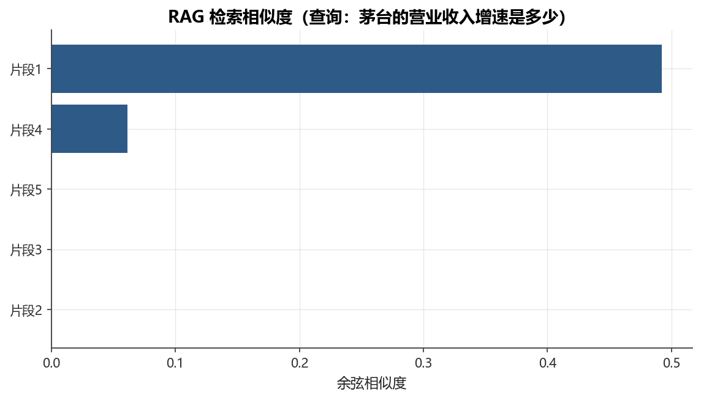

# 第19章 大模型与金融前沿

[](https://colab.research.google.com/github/albertandking/financial-data-science/blob/main/notebooks/ch19_llm_finance.ipynb) [](https://mybinder.org/v2/gh/albertandking/financial-data-science/main?labpath=notebooks/ch19_llm_finance.ipynb)

!!! info "配套代码"
    本章示例可在配套示例 中运行，主要演示 RAG 检索与结构化提示解析。离线即可完成。

---

## 19.1 本章导读

大语言模型（Large Language Model，LLM）正在重塑金融行业的信息处理方式。一份200页的年报，人工阅读需要数小时；一个经过良好调优的 LLM，几秒钟即可提炼关键指标、识别风险信号、生成结构化摘要。无论是卖方研报助手、买方投研 Copilot，还是合规知识问答系统，LLM 都已经从实验室走进了真实的金融工作流。

然而，LLM 并非万能。它会“幻觉”出看似合理却完全错误的数字；它的知识截止于训练数据；它的输出难以追溯来源。在金融这个“一字千金”的行业，如何用好 LLM、同时管好它带来的风险，是本章要解答的核心问题。

本章将系统介绍 LLM 的基本原理、金融应用场景、检索增强生成（RAG）架构、提示工程技巧，以及评估与合规风险。写作上，本章刻意把内容分成两类：一类是**相对稳定的方法论**，如 RAG 流程、结构化输出、风险边界；另一类是**变化较快的工程生态**，如模型家族、部署路线、接口兼容性。前者是本章的主线，后者只需掌握判断框架，不必死记具体产品名称。

!!! note "本章的阅读方式"
    **必须掌握**：token / 上下文窗口 / 温度、RAG 的三段流程、结构化输出、金融幻觉与合规边界。  
    **理解即可**：推理模型、国产模型生态、私有化部署的工程取舍。  
    **会很快变化的内容**：具体模型版本、上下文长度、平台价格与接口细节。本章只用它们来说明选型思路，而不要求记忆厂商清单。

---

## 19.2 学习目标

学完本章，读者应能：

1. 理解 Transformer 架构、预训练-微调范式、指令微调（Instruction Tuning）与 RLHF 的基本概念；
2. 掌握 token、上下文窗口、温度（temperature）等使用 LLM 的核心概念；
3. 列举 LLM 在金融领域的主要应用场景，并理解各场景的技术路线与局限；
4. 理解检索增强生成（RAG）的完整流程，能用 TF-IDF 模拟 RAG 检索步骤；
5. 掌握清晰指令、few-shot、思维链、结构化输出等提示工程技巧；
6. 识别 LLM 在金融应用中的主要风险（幻觉、时效、合规），建立正确的使用边界；
7. 能根据任务类型、时效要求与数据敏感度，在通用模型、推理模型与私有化部署之间做出基本选型；
8. 理解工具调用（function calling）与结构化输出，了解 MCP 协议在企业集成中的作用；
9. 了解推理模型与 LLM-as-judge 评估的使用边界，并为第20章的智能体学习建立基础。

---

## 19.3 大语言模型概览

### 19.3.1 从 Transformer 到指令模型

2017年，Google 发布论文《Attention is All You Need》，提出了 **Transformer** 架构。Transformer 完全依赖注意力机制（Attention Mechanism），抛弃了 RNN/CNN，在并行计算和长程依赖建模上取得了突破性进展。

**自注意力机制（Self-Attention）**的核心公式：

$$\text{Attention}(Q, K, V) = \text{softmax}\left(\frac{QK^T}{\sqrt{d_k}}\right) V$$

其中 $Q$（查询）、$K$（键）、$V$（值）均由输入序列线性变换得到，$d_k$ 是键的维度。这一机制使模型能够在序列的任意位置之间建立直接关联，捕捉长距离依赖关系。

这个公式看似复杂，但拆开来理解其实很直观。可以把它想象成一次「带权检索」：每个位置（token）都拿着自己的「查询向量」$Q$，去和序列里所有位置的「键向量」$K$ 做匹配，匹配度越高的位置，最终被「读取」得越多。具体分三步：

1. **算相似度**：$QK^T$ 是查询与所有键的点积，点积越大表示语义越相关。比如在「公司营业收入同比增长30%」这句话里，「增长」这个 token 的查询向量与「30%」的键向量点积会很大，因为它们语义紧密相关。
2. **缩放（scaling）**：除以 $\sqrt{d_k}$ 是关键的稳定化技巧。当维度 $d_k$ 较大时，点积的数值会随维度线性放大，导致 softmax 进入「饱和区」——梯度趋近于0，训练几乎停滞。除以 $\sqrt{d_k}$ 让点积的方差回到约1的量级，softmax 的输出分布更平滑、梯度更健康。这就是为什么是 $\sqrt{d_k}$ 而不是 $d_k$：若点积各分量方差为1，则 $d_k$ 项求和后方差为 $d_k$，标准差为 $\sqrt{d_k}$，除以它正好归一化。
3. **归一化加权求和**：softmax 把相似度转成一组和为1的权重，再用这组权重对所有「值向量」$V$ 做加权平均，得到该位置的输出。权重大的位置贡献多，权重小的几乎被忽略。

正是这种「任意两个位置直接交互」的设计，让 Transformer 摆脱了 RNN 必须逐步传递信息的瓶颈：在一份年报里，开头提到的「报告期」和几千字之后的「同比口径」可以一步建立关联，而无需信息沿着长链条层层衰减地传递。

**预训练（Pre-training）→ 微调（Fine-tuning）范式**是现代 LLM 的核心：

| 阶段 | 目标 | 数据 | 代表方法 |
|------|------|------|----------|
| 预训练 | 学习通用语言表示 | 海量无标注文本（TB 级） | 下一个 token 预测（GPT 系列）/ 掩码语言模型（BERT） |
| 有监督微调（SFT） | 适配特定任务 | 人工标注的指令-回答对 | LoRA、全量微调 |
| RLHF | 对齐人类偏好 | 人工偏好标注 | PPO、DPO |

**指令微调（Instruction Tuning）** 让模型学会按照自然语言指令完成任务，是 ChatGPT 类模型从“文本补全”升级为“对话助手”的关键一步。**RLHF（Reinforcement Learning from Human Feedback）** 则通过人类偏好反馈进一步优化输出质量和安全性。

### 19.3.2 核心概念速查

使用 LLM 必须理解以下基本概念：

| 概念 | 说明 | 金融场景含义 |
|------|------|------------|
| **Token** | 文本的最小处理单元，约0.75个英文单词或0.5个中文汉字 | 年报20万字 ≈ 10万 token，超出上下文窗口须分块 |
| **上下文窗口（Context Window）** | 模型一次能处理的最大 token 数（如8K、128K） | 决定能直接传入的文档长度上限 |
| **温度（Temperature）** | 控制输出随机性，0→确定性最高，1→更有创意 | 信息抽取建议0~0.2；摘要建议0.3~0.7 |
| **Top-p（核采样）** | 从累积概率 ≥ p 的 token 集合中采样 | 与 temperature 配合控制输出多样性 |
| **提示（Prompt）** | 输入给模型的指令+上下文 | 提示工程的核心载体 |
| **幻觉（Hallucination）** | 模型生成看似合理但实际错误的内容 | 财务数字、法规引用需人工核验 |

这六个概念里，**token** 与**上下文窗口**是工程估算的基础，几乎决定了「能不能一次喂进去」「要花多少钱」这两个最现实的问题。需要强调的是，token 与字数的换算只是粗略经验值：中文里一个常用汉字大约对应0.6~1个 token（取决于分词器），英文里一个 token 约等于4个字符或0.75个单词，标点、空格、数字也各自占 token。真正精确的计数必须用模型对应的分词器（tokenizer）来跑，而不能凭字数硬套——下面的例题用的都是教学用的近似系数，实务中请以分词器实测为准。

!!! example "例 19.1　年报 token 数与分块估算"
    某 A 股上市公司2024年年报正文约20万字（汉字为主，含少量英文与数字）。我们想把它喂给一个上下文窗口为128K token 的大模型做问答，需要估算 token 数并判断是否要分块。

    **第一步：估算总 token 数。** 取中文「1汉字 ≈ 0.6 token」的保守换算（年报含大量数字与表格，实际略高，这里取下界做演示）：

    $20\text{万字} \times 0.6 \approx 12\text{万 token} = 120{,}000 \text{ token}$

    **第二步：判断是否超窗。** 上下文窗口128K = 131,072 token。表面看120,000 < 131,072，似乎能一次塞进去。但这忽略了三件事：（1）系统提示、用户问题、few-shot 示例本身也占 token；（2）模型还要留出**输出**的 token 预算（如要求生成2,000字摘要 ≈ 3,000 token）；（3）换算系数偏乐观，真实 token 数可能达到15~18万。**结论：实务中必须分块。**

    **第三步：分块数量。** 设每块1,000 token、块间重叠100 token（重叠是为了避免把一个完整段落或一个数字从中间切断）。每块净新增 $1000 - 100 = 900$ token，则：

    $\text{块数} \approx \lceil 120{,}000 / 900 \rceil = \lceil 133.3 \rceil = 134 \text{ 块}$

    这134个块就是 RAG 离线索引阶段要嵌入并存入向量库的基本单元。块越小检索越精准但上下文越碎，块越大上下文越完整但可能混入无关信息——1,000 token 是一个常见的折中起点。

### 19.3.3 模型选型框架

对于教材读者来说，真正需要掌握的不是「今年有哪些热门模型」，而是**面对金融任务时如何选一条合适的技术路线**。更稳定的判断框架如下：

| 路线 | 典型优势 | 典型短板 | 适合的金融任务 |
|------|----------|----------|----------------|
| **商业通用模型 API** | 开发快、效果稳、维护成本低 | 数据出域、成本按量增长 | 公共信息摘要、原型验证、低门槛问答 |
| **开源通用模型私有化** | 数据可留内网、可控性高 | 部署与运维成本高 | 内部研报问答、合规知识库、客户敏感数据处理 |
| **推理模型** | 多步推理、代码、复杂逻辑更强 | 延迟高、成本高 | 财报勾稽、复杂规则判断、深度分析 |
| **领域微调/领域语料增强** | 术语理解更贴近业务 | 数据准备成本高、泛化风险更高 | 金融情感分析、公告分类、内部术语抽取 |

这里有一个重要观念：**先按任务选路线，再在路线里选具体模型**。如果任务只是把公告抽成 JSON，优先考虑结构化输出稳定性；如果任务是复杂合规推理，才需要更强的推理能力；如果数据不能出域，再好的商业 API 也不是合适答案。

!!! tip "选型建议"
    对于涉及敏感数据（客户隐私、未公开研究）的金融机构，优先考虑**私有化部署**路线；对于公开信息处理，商业 API 的开发效率通常更高。先定数据边界，再谈模型性能。

!!! note "截至 2026 年的几个趋势"
    （1）**推理模型**兴起（见后文），复杂分析准确率提升；（2）**长上下文**普及，长文档处理门槛下降；（3）**多模态**开始进入实用；（4）**智能体（agents）**成为主线——模型从「回答问题」走向「自主完成任务」（见第20章）。具体模型名称、版本与参数规模迭代极快，本书只强调能力趋势与选型原则。

### 19.3.4 采样参数：温度与 top-p 如何影响输出

理解了注意力如何「读」上下文，还需理解模型如何「写」输出。大模型每生成一个 token，本质上都是在整个词表上算出一个概率分布，然后从中**采样**一个 token。怎么采样，由温度（temperature）和 top-p（核采样，nucleus sampling）两个参数控制。

**温度的数学含义。** 模型在 softmax 之前会得到每个候选 token 的「logit」分数 $z_i$。温度 $T$ 通过缩放 logit 来改变最终概率分布的「尖锐」程度：

$$p_i = \frac{\exp(z_i / T)}{\sum_j \exp(z_j / T)}$$

- 当 $T \to 0$ 时，分母被最大的那一项主导，概率几乎全部集中在最高分 token 上——输出趋于**确定性**（贪心解码）。
- 当 $T = 1$ 时，就是模型原始的概率分布。
- 当 $T > 1$ 时，分布被「拉平」，低概率 token 也有机会被选中——输出更**随机、更有创意**，但也更容易跑题或出错。

举一个直观的小例子：假设下一个 token 的三个候选 logit 为「增长 $=2.0$」「下滑 $=1.0$」「持平 $=0.5$」。

- 在 $T=0.5$ 时，logit 先除以0.5（即放大两倍）变成4.0、2.0、1.0，softmax 后「增长」的概率约为 $0.84$——高度确定。
- 在 $T=2.0$ 时，logit 除以2变成1.0、0.5、0.25，softmax 后「增长」的概率降到约 $0.46$，「下滑」「持平」明显分到更多概率——输出更发散。

**top-p（核采样）的含义。** top-p 不缩放分布，而是**截断**它：把候选 token 按概率从高到低排序，只保留累积概率刚好达到 $p$ 的那一小撮（即「核」），其余直接丢弃，再在这一撮里按归一化后的概率采样。例如 $p=0.9$ 时，若「增长」概率0.7、「下滑」0.15、「持平」0.08……则累积到「增长 + 下滑 = 0.85」还不够，再加「持平 = 0.93」刚超过0.9，于是只在这三个里采样，长尾的怪词被排除。top-p 的好处是能自适应：分布很尖锐时核很小（接近确定），分布很平时核会自动放大，比固定取 top-k 个更灵活。

二者通常配合使用。金融场景下的经验取值：

| 任务类型 | 温度建议 | top-p 建议 | 理由 |
|----------|----------|-----------|------|
| 信息抽取（评级、目标价、财务数字） | 0~0.2 | 0.1~0.5 | 要可复现、可核验，绝不能「创意发挥」 |
| 文档摘要 | 0.3~0.5 | 0.8~0.9 | 允许适度改写措辞，但需忠实原文 |
| 头脑风暴 / 文案 | 0.7~1.0 | 0.9~1.0 | 需要多样性 |

!!! warning "高温采样与金融幻觉"
    在涉及财务数字、法规条文、投资评级的任务中，应坚持把温度设到接近0。温度越高，模型越可能「编造」一个看似合理但原文并不存在的数字或条款。确定性输出不仅降低幻觉概率，也让结果可复现、可审计——这在合规场景中至关重要。

---

## 19.4 金融应用场景

### 19.4.1 应用全景图

LLM 在金融领域的应用可按“输入类型 × 任务类型”组织：

| 输入类型 | 任务 | 典型场景 | 技术路线 |
|----------|------|----------|----------|
| 研报/年报 | 摘要生成 | 自动生成执行摘要 | 直接提示 / 分块摘要 |
| 研报/年报 | 信息抽取 | 提取评级、目标价、风险因素 | 结构化输出提示 |
| 财报文本 | 问答 | “公司营收增速是多少？” | RAG + 精准检索 |
| 公告文本 | 事件分类 | 识别并购、股权变更、业绩预告 | 分类提示 / 微调 |
| 新闻/社交媒体 | 情感分析 | 市场情绪指数构建 | 零样本/few-shot |
| 代码/数据 | 代码生成 | 自动编写数据分析脚本 | 代码模型（Code LLM） |
| 监管规则 | 合规问答 | “该交易是否违反 xxx 规定？” | RAG + 知识库 |

### 19.4.2 研报与年报摘要

将长文档转化为结构化摘要是 LLM 最成熟的金融应用之一。标准流程：

```
长文档
  ↓
分块（chunk）：每块 512~1024 token，块间有重叠
  ↓
逐块摘要（map step）
  ↓
汇总摘要（reduce step）
  ↓
结构化输出（评级 / 目标价 / 风险点）
```

**挑战**：财务数字的准确性要求极高，模型可能错误计算或混淆数字；需设计验证机制（如让模型输出来源引用）。

除了准确性，**成本**是规模化应用前必须算清的一笔账。商业 API 普遍按 token 计费，且输入 token 与输出 token 单价不同（输出通常贵4~5倍，因为生成比读取更耗算力）。一旦要批量处理成百上千份文档，单次看似微不足道的费用会迅速累积。

!!! example "例 19.2　年报摘要的调用成本估算"
    假设用某商业大模型为300家上市公司各生成一份年报执行摘要，估算总成本。设定（单价为教学示意，非真实报价）：输入 \$5 / 百万 token，输出 \$25 / 百万 token。

    **单份文档的 token 账：**

    - 输入：一份年报按例19.1约12万 token。但用 RAG 后，并不会把整份年报塞进去，而是检索 Top-8相关块（每块1,000 token）+ 系统提示与问题约500 token，合计输入 $8 \times 1000 + 500 = 8{,}500$ token。
    - 输出：一份结构化摘要约800字 ≈ 1,200 token。

    **单份成本：**

    $\underbrace{8{,}500 \times \frac{5}{1{,}000{,}000}}_{\text{输入} = \$0.0425} + \underbrace{1{,}200 \times \frac{25}{1{,}000{,}000}}_{\text{输出} = \$0.03} = \$0.0725$

    **300家总成本：** $300 \times \$0.0725 \approx \$21.75$。

    这个数字揭示两个工程要点：（1）**RAG 大幅省钱**——若不分块、直接把12万 token 全塞进去，单份输入成本就是 $120{,}000 \times 5 / 10^6 = \$0.6$，是 RAG 方案的14倍；（2）**输出 token 占比不可忽视**——虽然输出只有1,200 token，但因单价是输入的5倍，它贡献了单份成本的41%。因此「让模型只输出必要字段、不要长篇大论」既是质量要求，也是省钱手段。若再叠加**提示缓存**（把固定的系统提示缓存复用），输入成本还能进一步压低。

### 19.4.3 事件抽取与公告结构化

上市公司公告（并购、重组、股权激励等）包含大量结构化信息，但格式多样。LLM 可将非结构化公告转化为标准化字段：

```json
{
  "事件类型": "股权激励",
  "公告日期": "2024-03-15",
  "激励对象人数": 320,
  "授予价格": 12.50,
  "归属条件": "三年内营收年复合增长率不低于15%"
}
```

!!! note "结构化输出的关键"
    在提示中明确要求 JSON 格式，并提供字段说明和示例；对输出进行 JSON 解析验证，解析失败时重试或人工介入。

### 19.4.4 情感分析与舆情监控

金融情感分析需要区分**一般情感**与**金融情感**：

- 一般情感：“公司面临严峻挑战”→负面
- 金融情感：对于做空者，“公司面临严峻挑战”→正面信号

专业的金融情感词典（如 Loughran-McDonald 词典）或经过金融语料微调的模型，效果显著优于通用情感模型。

**舆情监控流水线**：

```
多源数据采集（新闻/公告/社交媒体）
  ↓
实体识别（哪家公司？哪个人物？）
  ↓
情感打分（正面 / 负面 / 中性）
  ↓
事件关联（该情感与什么事件相关？）
  ↓
聚合为情绪指数（用于量化策略因子）
```

### 19.4.5 投研助手与代码生成

LLM 已被用于构建“投研 Copilot”：分析师输入自然语言问题，系统自动检索相关财报数据、生成分析代码、绘制图表并撰写解读文字。这大幅提升了分析师的工作效率，但**人工审核**仍不可省略。

### 19.4.6 A 股案例：研报信息抽取的结构化输出

下面用一个贴近 A 股投研实务的完整案例，展示「非结构化研报 → 结构化字段」的全过程。这是券商、基金把海量卖方研报批量入库、构建分析师预期数据库的核心环节。

**输入（某券商研报片段，节选）：**

> 我们维持贵州茅台（600519.SH）「买入」评级，上调目标价至1,920元（前值1,850元）。公司2024年实现营业总收入1,476亿元，同比增长15.7%，归母净利润762亿元，同比增长15.4%，业绩符合预期。核心逻辑：（1）直营渠道占比持续提升，吨价仍有上行空间；（2）系列酒放量贡献增量。风险提示：宏观消费复苏不及预期；行业政策调整。

**给模型的结构化抽取提示（关键部分）：**

```
你是专业的证券研报信息抽取引擎。请从研报片段中提取以下字段，严格输出 JSON，
不要任何额外说明。字段在原文未提及时输出 null，绝不臆测或编造数字。

字段定义：
- 公司名称、股票代码、投资评级（买入/增持/中性/减持/卖出）
- 目标价、目标价前值（单位：元）
- 营业总收入、营收同比、归母净利润、净利润同比
- 核心逻辑（数组）、风险提示（数组）
```

**模型输出：**

```json
{
  "公司名称": "贵州茅台",
  "股票代码": "600519.SH",
  "投资评级": "买入",
  "目标价": 1920,
  "目标价前值": 1850,
  "营业总收入_亿元": 1476,
  "营收同比": "15.7%",
  "归母净利润_亿元": 762,
  "净利润同比": "15.4%",
  "核心逻辑": ["直营渠道占比提升，吨价有上行空间", "系列酒放量贡献增量"],
  "风险提示": ["宏观消费复苏不及预期", "行业政策调整"]
}
```

这样的结构化产物可以直接写入数据库，进而支撑「全市场分析师一致预期」「目标价上调/下调监控」「评级变动事件提醒」等量化与投研应用。三个实务要点：

1. **代码归一化**：研报里「600519」「贵州茅台」「茅台」指向同一标的，入库前需统一映射到带交易所后缀的标准代码（`600519.SH`），否则无法与行情、财务数据库 join。
2. **数字与单位的陷阱**：研报里「1,476亿元」「14.76亿」「1476」混用很常见，提示中必须明确单位字段（如 `_亿元`），并在程序侧做范围校验（如净利润不应大于营收）。
3. **必须人工抽检**：评级、目标价是高敏感字段，抽取后应与原文交叉核对——下一节的 RAG 与本章末尾的 LLM-as-judge 都是降低此类错误的手段。

!!! warning "抽取≠核实"
    结构化抽取只保证「把原文里的数字搬进 JSON」，并不保证「这个数字本身是对的」。研报作者的笔误、模型的数字幻觉都可能潜入。任何用于投资决策的字段，都必须回溯到原始研报与公司公告交叉验证。

---

## 19.5 检索增强生成（RAG）

<figure markdown>
  { width="680" }
  <figcaption>图19-1　TF-IDF 检索（模拟 RAG）相似度</figcaption>
</figure>


### 19.5.1 为何需要 RAG？

纯粹的 LLM 存在三个核心局限，导致其不适合直接用于金融知识库问答：

| 问题 | 描述 | 金融影响 |
|------|------|----------|
| **知识截止** | 模型只知道训练截止日之前的信息 | 无法回答最新政策、季报、市场数据 |
| **幻觉** | 模型会编造听起来合理但实际错误的内容 | 财务数字、法规条文错误代价极高 |
| **私有知识** | 模型不知道企业内部文档、私有研报 | 无法支持内部知识库问答 |

**RAG（Retrieval-Augmented Generation）** 通过在生成前先检索相关文档片段，将外部知识“注入”到提示中，有效缓解上述问题。

### 19.5.2 RAG 完整流程

```
【离线索引阶段】
原始文档（年报/研报/政策文件）
  → 文本清洗与分块（Chunking）
    → 固定长度分块（如每块 512 token，重叠 50 token）
    → 语义分块（按段落 / 章节）
  → 嵌入模型（Embedding Model）
  → 转为向量表示
  → 存入向量数据库（Faiss / Milvus / Chroma）

【在线检索阶段】
用户问题
  → 嵌入模型
  → 问题向量
  → 向量数据库相似度检索（余弦相似度 / 点积）
  → Top-k 相关片段

【生成阶段】
[系统提示] + [检索到的片段] + [用户问题]
  → LLM
  → 含引用来源的回答
```

为了真正理解 RAG，关键是看清三段流程里**数据的形态如何变化**——这是初学者最容易混淆的地方：

- **离线索引阶段**（建库，一次性）：数据从「文本」变成「向量」。原始文档被切成块，每块经嵌入模型映射为一个固定维度的稠密向量（如768维或1024维），连同原文一起存入向量库。这一步可能耗时几小时，但只需做一次（或文档更新时增量做）。
- **在线检索阶段**（每次提问）：数据从「问题文本」变成「问题向量」，再变成「Top-k 文本块」。用户问题用**同一个**嵌入模型转成向量（必须同一个，否则向量空间不一致、相似度无意义），在向量库里用余弦相似度或点积找出最近的 k 个块，把这 k 块的**原文**取出来。
- **生成阶段**（每次提问）：数据从「问题 + k 块原文」变成「答案」。三者拼成一个提示喂给 LLM，模型基于检索到的原文作答，而非凭记忆。

这条数据流回答了 RAG 为什么能缓解两大顽疾：「知识截止」之所以被缓解，是因为知识活在**向量库**里而非模型权重里，更新库即可纳入最新政策、季报，无需重训模型；「幻觉」之所以被压低，是因为生成阶段模型手里**有明确的参考原文**，且可被要求逐句标注出处，编造的空间大大缩小。

### 19.5.3 RAG 关键技术选型

| 组件 | 轻量方案（可离线） | 生产方案 |
|------|------------------|----------|
| 文本分块 | 按句子/段落切分 | LangChain RecursiveTextSplitter |
| 嵌入模型 | TF-IDF（关键词匹配） | text-embedding-3-small / BGE-m3 |
| 向量检索 | sklearn 余弦相似度 | Faiss / Milvus |
| 重排序 | 无 | Cross-Encoder 重排序 |
| LLM | 本地 Ollama | GPT-4o / Qwen-Max |

!!! tip "金融 RAG 的实践要点"
    1. **分块策略**：财报表格建议单独处理，避免数字被截断；
    2. **元数据过滤**：检索时先按公司代码/日期过滤，再做语义检索；
    3. **引用追溯**：让模型在回答中标注来源文档和页码，便于人工核验；
    4. **混合检索**：关键词检索（BM25）+ 向量检索结合，效果优于单一方法。

### 19.5.4 简化 RAG 示例（TF-IDF）

下面用 scikit-learn 的 `TfidfVectorizer` 模拟 RAG 的检索步骤。虽然 TF-IDF 不如深度嵌入模型，但它完全离线、无需 GPU，适合教学演示：

```python
from sklearn.feature_extraction.text import TfidfVectorizer
from sklearn.metrics.pairwise import cosine_similarity

# 知识库：硬编码的金融知识片段
knowledge_base = ["片段1：贵州茅台2023年报...", ...]

# 向量化
vectorizer = TfidfVectorizer()
doc_vectors = vectorizer.fit_transform(knowledge_base)

# 检索：给定问题，找 Top-k 相关片段
query = "茅台的营业收入增速是多少？"
query_vec = vectorizer.transform([query])
scores = cosine_similarity(query_vec, doc_vectors)[0]
top_k = scores.argsort()[-3:][::-1]
```

完整示例可结合配套示例进一步练习。

为了真正看懂检索这一步「算的是什么」，下面手工算一遍 TF-IDF 打分，把黑箱拆开。

!!! example "例 19.3　手算 TF-IDF 检索给查询打分排序"
    设知识库有3个片段（已分词），查询为「茅台 营收 增长」：

    | 编号 | 片段内容（分词后） |
    |------|------|
    | D1 | 茅台 营收 增长 强劲 |
    | D2 | 茅台 净利润 下滑 |
    | D3 | 五粮液 营收 增长 |

    **第一步：算 IDF（逆文档频率）。** 公式 $\text{IDF}(t) = \log\dfrac{N}{\text{df}(t)}$，其中 $N=3$ 为文档总数，$\text{df}(t)$ 为含词 $t$ 的文档数。只算查询里的三个词（用自然对数）：

    - 「茅台」出现在 D1、D2 → $\text{df}=2$ → $\text{IDF}=\ln(3/2)\approx 0.405$
    - 「营收」出现在 D1、D3 → $\text{df}=2$ → $\text{IDF}=\ln(3/2)\approx 0.405$
    - 「增长」出现在 D1、D3 → $\text{df}=2$ → $\text{IDF}=\ln(3/2)\approx 0.405$

    三个词的 IDF 恰好相等，说明在这个小库里它们「区分度」一样——若某词只在1篇出现，其 IDF 会更高（$\ln 3 \approx 1.099$），更能凸显文档特征。

    **第二步：算每篇文档对查询词的 TF-IDF。** 这里 TF 用「词在该文档出现次数」（本例都为0或1）。文档对查询的得分 = 该文档中各查询词的 $\text{TF}\times\text{IDF}$ 之和：

    - **D1**：含「茅台」「营收」「增长」三词 → $0.405 + 0.405 + 0.405 = 1.215$
    - **D2**：仅含「茅台」 → $0.405$
    - **D3**：含「营收」「增长」 → $0.405 + 0.405 = 0.810$

    **第三步：排序取 Top-k。** 按得分降序：**D1（1.215）> D3（0.810）> D2（0.405）**。若取 Top-1，检索器返回 D1——正是与「茅台 营收 增长」最相关的片段；取 Top-2则再加上 D3。

    这个手算结果暴露了 TF-IDF 的**软肋**：它只看词的字面重叠。D3谈的是五粮液，却因为共享「营收 增长」两个词而排到了 D2前面；反过来，如果用户问「贵州茅台的收入」，而文档写的是「营业收入」，由于「收入」与「营业收入」字面不完全匹配，TF-IDF 可能漏检。深度嵌入模型（如 BGE-m3）用稠密语义向量替代字面计数，能识别「营收」与「营业收入」是近义词，从而克服这一问题——但代价是需要模型文件与算力。这正是19.5.3选型表中「轻量 vs 生产」分野的根源。

---

## 19.6 提示工程

### 19.6.1 基本原则

好的提示（Prompt）需要遵循以下原则：

1. **角色设定**：告诉模型它是谁（如“你是一位资深证券分析师”），设定专业语境；
2. **清晰指令**：明确任务类型（摘要/抽取/分类）、输出格式、长度限制；
3. **提供上下文**：将相关文档片段放入提示（RAG 的核心）；
4. **输出约束**：要求 JSON/Markdown 等结构化格式，便于程序解析；
5. **边界说明**：明确“如果信息不足，请回答‘无法从文本中获取’”，减少幻觉。

### 19.6.2 提示技巧汇总

| 技巧 | 说明 | 适用场景 |
|------|------|----------|
| **零样本（Zero-shot）** | 仅给任务描述，无示例 | 简单分类、格式转换 |
| **少样本（Few-shot）** | 给2~5个输入-输出示例 | 专业格式输出、领域特定任务 |
| **思维链（Chain-of-Thought）** | 要求模型“逐步分析” | 复杂推理、财务计算验证 |
| **结构化输出** | 要求 JSON/XML，指定字段 | 信息抽取、数据入库 |
| **自一致性（Self-Consistency）** | 多次采样取多数结果 | 降低随机误差 |

### 19.6.3 金融场景提示模板

**研报信息抽取模板**：

```
系统提示：
你是一位专业的证券研究分析师。请从以下研报片段中提取结构化信息，
严格按照 JSON 格式输出，不要添加任何额外说明。
如某字段在文本中未提及，则输出 null。

输出格式：
{
  "公司名称": "...",
  "股票代码": "...",
  "投资评级": "买入/增持/中性/减持/卖出",
  "目标价格": 数字或 null,
  "核心逻辑": ["要点1", "要点2"],
  "主要风险": ["风险1", "风险2"]
}

用户输入：
[研报片段]
```

**情感分析模板（Few-shot）**：

```
系统提示：
你是金融情感分析专家。请判断以下新闻标题对【股票投资者】的情感倾向。

示例：
输入："公司宣布超预期季报，营收同比增长35%"
输出：{"情感": "正面", "置信度": "高", "关键词": ["超预期", "增长35%"]}

输入："监管部门对公司展开调查"
输出：{"情感": "负面", "置信度": "高", "关键词": ["监管调查"]}

请分析：
[新闻标题]
```

### 19.6.4 思维链示例

对于需要推理的任务，“先分析再下结论”显著提升准确率：

```
请分析该公司的偿债能力：
- 流动比率 = 当前资产 / 当前负债
- 流动资产：5.2亿元；流动负债：3.8亿元

请先逐步计算，再给出结论。

模型输出：
1. 流动比率 = 5.2 / 3.8 = 1.37
2. 流动比率 > 1，说明公司能覆盖短期债务
3. 行业平均约 1.5，该公司略低于行业均值
结论：偿债能力尚可但偏弱，建议关注现金流趋势
```

### 19.6.5 提示优化前后对比

提示工程的价值最直观地体现在「同一个任务、不同的提示，输出质量天差地别」。下面用一个研报情感判断的例子，对比劣质提示与结构化提示。

!!! example "例 19.4　劣质提示 vs 结构化提示的输出差异"
    **任务**：判断新闻「某券商对 A 公司展开尽职调查，拟收购其60% 股权」对 A 公司股东的情感倾向。

    **劣质提示（before）：**

    ```
    这条新闻是好是坏？
    某券商对 A 公司展开尽职调查，拟收购其60% 股权
    ```

    **可能的输出（before）：**

    > 这取决于具体情况。尽职调查通常是收购的前置环节，可能是好事，但也存在调查发现问题导致收购失败的风险，还要看收购价格是否合理……

    问题：（1）没指定立场（对谁而言？）；（2）没限定输出格式，得到一大段含糊的「正反都说」，无法入库、无法做成情绪因子；（3）「调查」一词易被通用模型误判为负面（监管调查），而此处实为收购尽调（中性偏正面）。

    **结构化提示（after）：**

    ```
    你是金融情感分析专家。请判断下面新闻对【A 公司股东】的情感倾向。
    注意：本例的“尽职调查”是收购前的常规尽调，非监管处罚调查。
    严格按以下 JSON 输出，不要额外说明；若信息不足，置信度填“低”：
    {"情感": "正面/负面/中性", "置信度": "高/中/低", "关键词": [...], "理由": "一句话"}

    新闻：某券商对 A 公司展开尽职调查，拟收购其60% 股权
    ```

    **输出（after）：**

    ```json
    {
      "情感": "正面",
      "置信度": "中",
      "关键词": ["拟收购", "60%股权"],
      "理由": "控股权溢价收购预期通常利好被收购方股东，但尚处尽调阶段存在不确定性"
    }
    ```

    对比可见，结构化提示通过四个动作把输出从「不可用」变成「可入库」：**设定角色与立场**（对 A 公司股东）、**消歧**（澄清「尽职调查」语义，避免金融情感误判）、**约束格式**（JSON 可解析）、**给出兜底规则**（信息不足时降低置信度而非乱猜）。这四点正对应19.6.1的基本原则，也直接服务于把单条判断聚合成「市场情绪指数」的下游量化用途。

---

## 19.7 工具调用与结构化输出

LLM 不仅能生成文字，还能**调用外部工具**——这是从「会聊天」走向「会做事」（智能体）的关键一步。

### 19.7.1 函数调用（Function / Tool Calling）

开发者用 JSON Schema 描述可用工具（名称、参数、用途），模型在需要时不再输出自由文本，而是输出一个**结构化的工具调用**（指明调用哪个函数、传什么参数）；程序据此执行真实函数（查数据库、调行情 API、跑计算），再把结果回灌给模型继续作答。

| 步骤 | 内容 |
|---|---|
| ① 声明工具 | 用 JSON Schema 描述函数名、参数、用途 |
| ② 模型决策 | 模型判断是否需要、调用哪个工具、传什么参数 |
| ③ 程序执行 | 由你的代码真正运行该函数（模型不直接执行） |
| ④ 回灌结果 | 工具返回值作为新的上下文，模型据此给出最终答复 |

!!! tip "结构化输出（JSON 模式）"
    要求模型严格按 JSON Schema 输出，便于程序解析与校验。金融信息抽取（评级、目标价、风险点）尤其依赖结构化输出——自由文本难以可靠入库。

### 19.7.2 MCP：模型上下文协议

**MCP（Model Context Protocol）** 是一种**标准化**的「模型 ↔ 工具/数据源」连接协议，让同一套工具能被不同模型与客户端复用，正成为智能体工具生态的事实标准。

!!! note "通往智能体"
    工具调用是**智能体（agent）**的技术基础。当模型能在「思考 → 调用工具 → 观察结果」之间多步循环、自主规划完成任务时，它就成了智能体。系统性的智能体设计——多步规划、多智能体协作、记忆与护栏——见**第20章**。

### 19.7.3 一次完整的工具调用解析

为了把「①声明工具 → ②模型决策 → ③程序执行 → ④回灌结果」这条链路落到实处，下面用一个查询实时股价的例子走一遍，重点看模型吐出的「工具调用 JSON」长什么样、程序怎么解析。

!!! example "例 19.5　function calling 的 JSON 工具调用解析"
    **① 开发者声明工具**（用 JSON Schema 描述，注意 `description` 要写清「何时调用」，这能显著提高模型的调用准确率）：

    ```json
    {
      "name": "get_stock_quote",
      "description": "查询某只 A 股的实时行情。当用户询问股价、涨跌幅、市值等实时数据时调用。",
      "input_schema": {
        "type": "object",
        "properties": {
          "code":   {"type": "string", "description": "带交易所后缀的代码，如600519.SH"},
          "fields": {"type": "array", "items": {"type": "string"},
                     "description": "需要的字段，如 price、change_pct"}
        },
        "required": ["code"]
      }
    }
    ```

    **② 用户提问 →模型决策。** 用户问「茅台现在多少钱，涨了没？」。模型不再输出自由文本，而是输出一个结构化的工具调用块（不同厂商字段名略有差异，核心都是「函数名 + 参数」）：

    ```json
    {
      "type": "tool_use",
      "id": "call_a1b2c3",
      "name": "get_stock_quote",
      "input": {"code": "600519.SH", "fields": ["price", "change_pct"]}
    }
    ```

    模型自动完成了两件「翻译」工作：把口语「茅台」映射为标准代码 `600519.SH`，把「多少钱、涨了没」映射为字段 `price`、`change_pct`。

    **③ 程序解析并执行。** 程序侧拿到这个块后，**务必用 JSON 解析器读取 `input`，而非对字符串做正则匹配**——因为模型可能对中文、斜杠等做不同转义，字面匹配会偶发出错。解析出参数后，由你的代码真正去调行情接口（模型自己不联网、不执行）：

    ```python
    import json
    block = response_tool_use_block          # 模型返回的工具调用块
    args = block["input"]                     # 已是结构化对象；若为字符串则 json.loads
    quote = call_market_api(args["code"], args["fields"])  # 你的真实函数
    # quote 例如 {"price": 1685.0, "change_pct": "+1.2%"}
    ```

    **④ 回灌结果 →模型作答。** 把函数返回值作为 `tool_result` 拼回上下文，模型据此生成最终自然语言回答：

    ```json
    {"type": "tool_result", "tool_use_id": "call_a1b2c3",
     "content": "{\"price\": 1685.0, \"change_pct\": \"+1.2%\"}"}
    ```

    > 模型最终答复：贵州茅台（600519.SH）当前股价1,685.0元，今日上涨1.2%。

    这套机制让「会聊天」的模型变成「会查数据、会算账」的助手。两个工程注意点：`tool_result` 必须带上与 `tool_use` 匹配的 `id`，否则模型无法对应是哪次调用的结果；以及工具执行有副作用（如下单、转账）时，应在 ③ 之前加入人工确认环节，绝不能让模型的输出直接触发不可逆操作。

## 19.8 推理模型（Reasoning Models）

近两年，一类强调**测试时计算（test-time compute）**的推理模型成为重要分支：它们在给出答案前先进行更长的内部「思考」，通过多步推理提升数学、代码与复杂分析的准确率。

| 维度 | 通用对话模型 | 推理模型 |
|---|---|---|
| 响应延迟 | 低 | **较高**（先思考） |
| 单次成本 | 低 | **较高** |
| 擅长 | 摘要、抽取、对话 | 多步推理、复杂逻辑、代码 |
| 金融适用 | 高并发、低延迟任务 | 财报勾稽、复杂合规判断、量化逻辑推导 |

!!! note "金融场景怎么选"
    需要严谨多步推理时用推理模型；高并发、低延迟、简单抽取/摘要用通用模型更经济。实务中常**分层**：通用模型做初筛，推理模型啃硬骨头。

## 19.9 评估与风险

### 19.9.1 LLM 评估维度

评估 LLM 在金融任务上的表现，需要从多个维度综合考量：

| 评估维度 | 指标/方法 | 备注 |
|----------|-----------|------|
| **事实准确性** | 人工核验，与原文对照 | 财务数字必须核验 |
| **任务完成度** | Precision/Recall（信息抽取） | 需要构建标注数据集 |
| **幻觉率** | 人工标注“无中生有”比例 | 金融场景核心指标 |
| **格式合规率** | JSON 解析成功率 | 直接影响自动化流程 |
| **时效性** | 训练截止日期 vs 问题涉及日期 | RAG 可缓解 |
| **延迟与成本** | API 响应时间，token 费用 | 高频场景需优化 |

### 19.9.2 LLM-as-judge：用模型评估模型

人工评估 LLM 输出昂贵且慢。**LLM-as-judge** 让一个（通常更强的）模型按给定标准为另一个模型的输出打分，可规模化评测摘要质量、答案正确性、是否含幻觉，是离线评测与回归测试的常用手段。

!!! warning "裁判也会错"
    LLM 裁判存在位置偏好（偏向先出现的答案）、冗长偏好（偏向更长的回答）等偏差，且可能与被评模型「同源同错」。关键场景仍需人工抽检来校准裁判。

下面用一个具体的打分例子，展示 LLM-as-judge 在金融问答评测中如何运作。

!!! example "例 19.6　LLM-as-judge 给年报问答答案打分"
    **评测任务**：用一个更强的「裁判模型」为「被测模型」生成的答案打分（1~5分）。

    **给裁判的评分提示（含明确 rubric）：**

    ```
    你是严格的金融问答评测员。请对照【参考原文】给【模型答案】打分（1-5）：
    - 5分：数字与原文完全一致，无遗漏、无编造
    - 3分：方向正确但有数字误差或遗漏要点
    - 1分：含原文不存在的数字（幻觉）或与原文矛盾
    请输出 JSON：{"得分": n, "是否含幻觉": true/false, "依据": "..."}

    【参考原文】公司2024年营业总收入1,476亿元，同比增长15.7%。
    【问题】公司2024年营收及增速是多少？
    【模型答案】2024年营收约1,476亿元，同比增长约16%。
    ```

    **裁判输出：**

    ```json
    {
      "得分": 3,
      "是否含幻觉": false,
      "依据": "营收金额正确；增速15.7%被四舍五入说成16%，存在数字误差，未达完全一致标准"
    }
    ```

    **如何用这个分数。** 把同一组测试题跑过 N 个候选模型/提示版本，各自取平均分，就得到一张可横向比较的「金融问答能力排行榜」；把「是否含幻觉=true」的比例单独统计，就是关键的**幻觉率**指标。这让原本昂贵缓慢的人工评测得以规模化、可回归（每次改提示后重跑一遍，看分数是否退化）。

    但要警惕裁判的可靠性边界：本例裁判把「16% vs 15.7%」判为扣分项是合理的，但若把题目换成需要主观判断的「这段分析写得好不好」，裁判的冗长偏好、立场偏差就会放大。因此**裁判的评分标准（rubric）越客观、越可核对（如对照数字），结果越可信**；越主观的维度，越要靠人工抽检来校准裁判本身。

### 19.9.3 幻觉风险

幻觉是 LLM 在金融应用中最危险的问题。常见幻觉类型：

- **数字幻觉**：编造财务数字，如“该公司2023年营收为XX亿元”（实为捏造）
- **引用幻觉**：引用不存在的法规条文，如“依据《证券法》第XX条”
- **时间幻觉**：混淆不同年份的数据

!!! warning "金融幻觉的代价"
    在投研报告中，一个错误的财务数字可能导致错误的估值、错误的投资建议，进而造成真实的经济损失。**绝对不能**将 LLM 的输出直接用于投资决策，必须经过人工核验或与原始数据源交叉验证。

**缓解幻觉的策略**：

1. 使用 RAG：让模型基于检索到的原文回答，而非凭记忆生成
2. 要求引用来源：提示中要求注明“依据文档第X页”
3. 温度设为0：减少随机性，提高确定性
4. 交叉验证：多次询问，结果一致性高的更可靠
5. 人工审核节点：关键输出必须人工复核

### 19.9.4 数据合规与隐私

!!! warning "数据合规红线"
    以下数据**严禁**直接传入外部 LLM API：
    - 客户个人身份信息（姓名、身份证号、银行账户）
    - 未公开的公司财务信息（内幕信息）
    - 机构内部研究报告（可能含敏感预测）

    违反数据合规要求可能导致违反《个人信息保护法》、《数据安全法》及证券监管规定。

合规处理方案：
1. **数据脱敏**：在传入 LLM 前对敏感字段做掩码处理
2. **私有化部署**：将开源模型部署在内部服务器，数据不出域
3. **合同约束**：使用商业 API 时确认服务商的数据不训练协议

### 19.9.5 投资建议合规

!!! danger "监管警示"
    根据中国证监会相关规定，发布证券投资建议（“买入”“卖出”等）须持有**证券投资咨询业务资格**。LLM 直接生成的投资评级或交易建议，在未经持牌机构审核的情况下向公众传播，可能构成违规。

    **合规边界**：LLM 可用于辅助分析、整理信息、生成草稿，最终的投资建议必须由持牌分析师审核签发。

---

## 19.10 中国市场实践

### 19.10.1 中国市场的选型维度

中国大模型市场发展迅速，但对教材读者来说，更重要的是理解**在中国市场落地时通常要看哪些维度**，而不是记忆一张厂商名单：

| 维度 | 为什么重要 | 教材建议 |
|------|------------|----------|
| **是否支持私有化部署** | 决定数据能否留在内网 | 涉及敏感数据时优先看这一项 |
| **中文与金融术语表现** | 决定年报、公告、研报的理解质量 | 先做小样本任务测试，不靠宣传口径判断 |
| **结构化输出与工具调用能力** | 决定能否稳定接入自动化流程 | 抽取、入库、agent 场景必须重点测试 |
| **长文档与多轮推理能力** | 决定长年报、复杂问答的处理质量 | 根据任务是「长文档」还是「复杂推理」分别评估 |
| **接口与运维生态** | 决定后续集成与维护成本 | 企业内通常优先选接口稳定、治理能力成熟的方案 |

当前市场上的具体代表会不断变化，但大体可归为三类：**开源可私有化模型、商业 API 模型、面向企业平台的一体化方案**。实际选型时，先按上表的维度打分，再比较候选产品。

### 19.10.2 私有化部署趋势

国内金融机构对数据安全的要求极高，私有化部署成为主流选择：

**私有化部署架构**：

```
金融机构内网
├── 模型层：开源 LLM（Qwen / DeepSeek）
│           部署在 GPU 服务器（如 A100/H100）
├── 推理框架：vLLM / TGI（高并发推理）
├── 向量数据库：Milvus（私有化）
├── 应用层：内部 RAG 系统 / 投研助手
└── 安全层：访问控制 + 审计日志
```

**成本估算**：

- 开源模型（如 DeepSeek-7B）：4 × A100（80G）可支撑百并发；
- 百万 token 推理成本约为商业 API 的1/10；
- 一次性硬件投入换取长期数据安全与成本优势。

### 19.10.3 合规框架

中国 LLM 应用须遵循的主要法规：

| 法规 | 核心要求 | 与金融 LLM 的关系 |
|------|----------|-----------------|
| 《生成式人工智能服务管理暂行办法》（2023） | 内容合规、算法备案 | 面向公众的金融 AI 服务须备案 |
| 《个人信息保护法》（2021） | 个人数据处理告知同意 | 使用客户数据训练/推理须合规 |
| 《数据安全法》（2021） | 重要数据分级保护 | 金融数据属于重要数据 |
| 《证券期货投资者适当性管理办法》 | 投资建议须匹配投资者风险等级 | AI 生成建议须人工审核 |

---

## 19.11 本章小结

本章系统介绍了大语言模型在金融领域的应用全景。学完后，建议把知识点分成以下三层来掌握：

**必须掌握**

1. **核心概念**：Transformer、预训练 → SFT → RLHF 的基本脉络；token、上下文窗口、温度等直接影响使用方式与成本。
2. **主线架构**：RAG 的三段流程是金融知识问答与长文档处理的基础；结构化输出是把模型结果接入业务系统的关键接口。
3. **风险边界**：幻觉、知识截止、数据合规、投资建议监管是金融 LLM 应用中最不能忽视的四类风险。

**理解即可**

4. **应用场景**：年报摘要、事件抽取、情感分析、问答、代码生成是当前最成熟的五类金融 LLM 应用，但各自都有适用边界。
5. **工程取舍**：提示工程、工具调用、延迟、成本、格式合规率共同决定系统能否从“能演示”走向“能落地”。
6. **选型框架**：实际选模型时，应先看任务类型、数据敏感度和部署边界，再比较具体产品，而不是反过来记厂商清单。

**实践提醒**

LLM 是强大的**信息处理和辅助分析工具**，但不是决策工具。在金融领域，最终判断、签发与责任归属仍需由人类专家承担。

---

## 19.12 习题

!!! note "使用建议"
    建议按“基础理解 → 应用设计 → 综合方案”顺序完成本章习题。若是本科课程，可重点完成 19.1~19.4；若是研究生课程或项目训练，可进一步完成 19.5。

### 基础理解

**习题19.1**（概念题）简述 RAG 的三个核心步骤（分块、检索、生成），并说明为什么 RAG 能缓解 LLM 的“知识截止”和“幻觉”问题。

> **参考思路**：
> - 分块（Chunking）：将长文档切分为可处理的片段，建立索引；
> - 检索（Retrieval）：给定用户问题，用向量相似度找到最相关的 k 个片段；
> - 生成（Generation）：将检索到的片段拼入提示，让模型基于片段回答（而非凭记忆）。
> - 缓解知识截止：可实时更新知识库，无需重新训练模型；
> - 缓解幻觉：模型有明确的参考文本，降低编造概率；同时可要求注明出处。

---

**习题19.2**（提示工程）设计一个用于从上市公司并购公告中抽取结构化信息的提示模板，要求输出 JSON 格式，包含以下字段：`公告日期`、`收购方`、`被收购方`、`交易金额（亿元）`、`交易方式`（现金/股票/混合）、`预期完成时间`。

> **参考思路**：
> - 系统提示说明角色（信息抽取专家）和任务；
> - 明确 JSON 格式和每个字段的说明；
> - 给1~2个 few-shot 示例（输入公告片段 → 输出 JSON）；
> - 说明“如信息未提及则输出 null”，减少幻觉；
> - 要求模型在 JSON 之外不输出额外内容。

---

### 应用设计

**习题19.3**（代码实践）将本节 TF-IDF RAG 示例中的知识库替换为5条关于 A 股 IPO 规则的知识片段（可自拟），并测试以下两个问题的检索效果：

1. “科创板上市需要满足哪些财务条件？”
2. “注册制下 IPO 审核流程是怎样的？”

比较 Top-1和 Top-3检索结果，讨论 TF-IDF 与深度嵌入模型的差异。

> **参考思路**：
> - 替换 `knowledge_base` 列表，加入 IPO 相关文本片段；
> - 调用 `retrieve(query, top_k=3)` 获取检索结果；
> - TF-IDF 依赖关键词重叠，对同义词/近义词不敏感（如“科创板”和“Sci-Tech Innovation Board”无法匹配）；
> - 深度嵌入模型（如 BGE-m3）通过语义表示克服此问题，但需要模型文件和计算资源。

---

**习题19.4**（风险分析）某券商希望部署一个面向零售投资者的 AI 选股助手，该助手基于 LLM 直接给出“买入/卖出”建议。请从**技术风险**和**合规风险**两个维度分析该方案的潜在问题，并提出改进方案。

> **参考思路**：
> - 技术风险：幻觉导致错误建议；知识截止，无法反映最新行情；模型无法理解个人风险偏好；
> - 合规风险：向公众发布投资建议须持证（证券投资咨询牌照）；AI 建议责任归属不明；可能违反投资者适当性管理规定；
> - 改进方案：LLM 仅做信息整理和问答（不给具体买卖建议）；加入持牌分析师审核环节；在界面上明确标注“非投资建议”；记录完整的 AI 决策日志用于合规审计。

---

### 综合方案

**习题19.5**（综合题）以“DeepSeek-R1 私有化部署在金融机构内部研究系统”为场景，设计一套完整的 RAG 系统架构，需包含：数据来源（3种以上）、分块与嵌入方案、向量数据库选型、查询流程、安全控制措施，并评估主要风险点。

> **参考思路**：
> - 数据来源：内部研报库、监管公告数据库、公开年报/季报 PDF；
> - 分块：PDF 按段落/表格分开处理，每块约512 token，重叠64 token；
> - 嵌入：BGE-m3（开源中文嵌入模型，可本地运行）；
> - 向量库：Milvus（支持私有化、高并发）；
> - 查询：问题嵌入 → ANN 检索 Top-20 → Cross-Encoder 重排 → Top-5 → LLM 生成；
> - 安全控制：内网隔离、角色权限管理（不同级别研究员看不同文档）、审计日志；
> - 风险点：嵌入模型对长尾专业术语支持有限；PDF 表格解析质量影响检索；私有化部署运维成本高。

---

## 19.13 拓展阅读

| 类型 | 标题 | 核心贡献 |
|------|------|----------|
| 论文 | Vaswani et al. (2017) *Attention is All You Need* | Transformer 架构的奠基论文 |
| 论文 | Lewis et al. (2020) *Retrieval-Augmented Generation for Knowledge-Intensive NLP Tasks* | RAG 的原始论文 |
| 论文 | Wu et al. (2023) *BloombergGPT: A Large Language Model for Finance* | 首个金融专用 LLM |
| 论文 | Yang et al. (2023) *FinGPT: Open-Source Financial Large Language Models* | 开源金融 LLM 框架 |
| 论文 | Ouyang et al. (2022) *Training language models to follow instructions with human feedback* | RLHF 的核心论文（InstructGPT） |
| 报告 | 中国信通院《大模型标准化白皮书》（2024） | 国内大模型评测与合规框架 |
| 工具 | LangChain 文档（langchain.com） | RAG/Agent 开发框架 |
| 工具 | LlamaIndex 文档 | 结构化数据 RAG 框架 |


